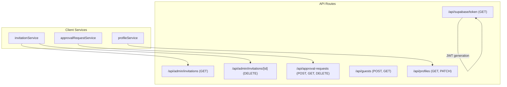
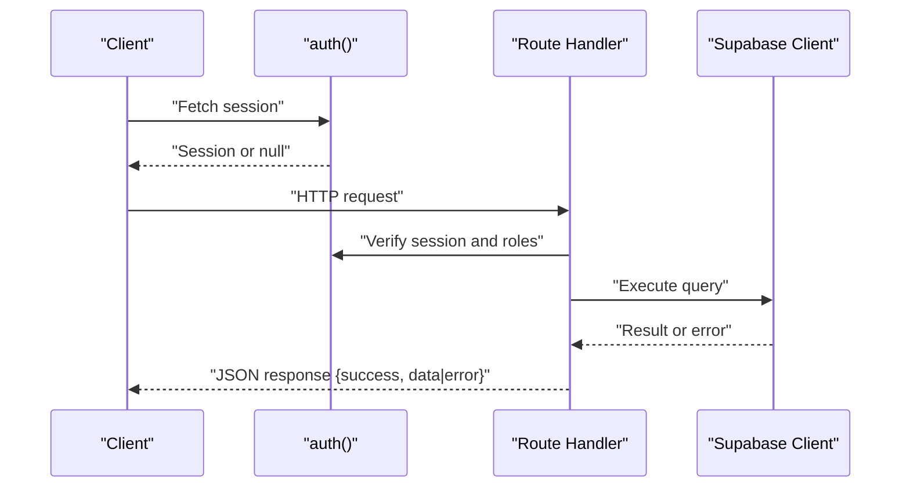
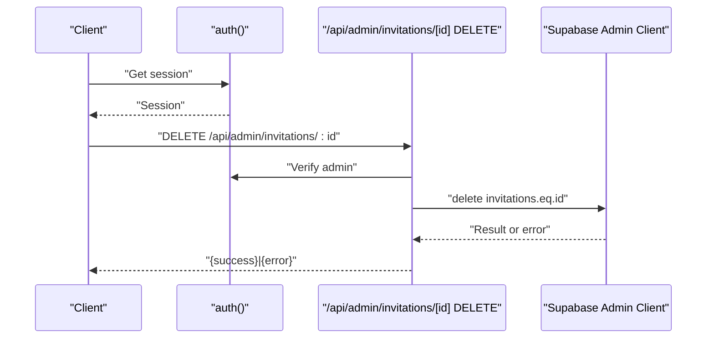
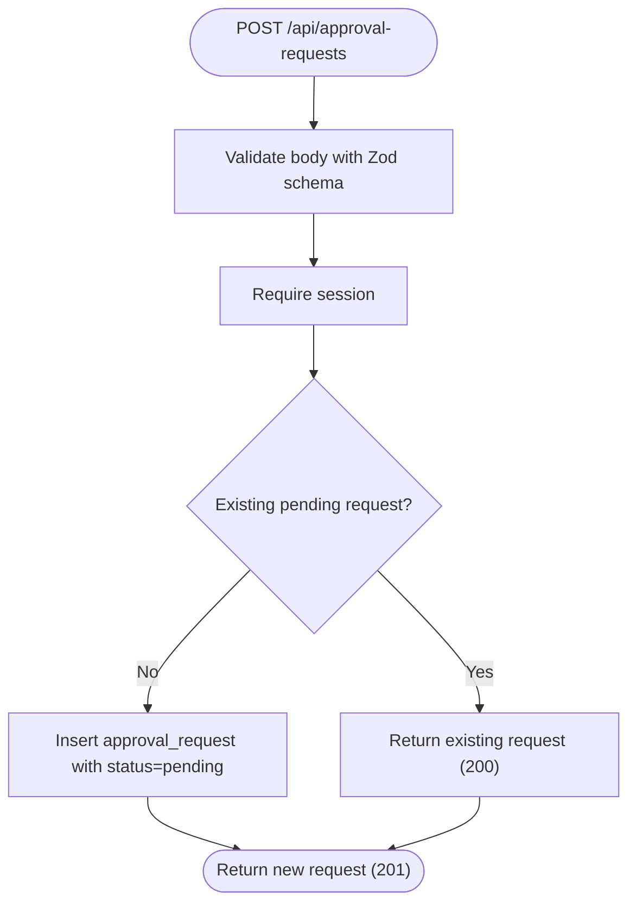
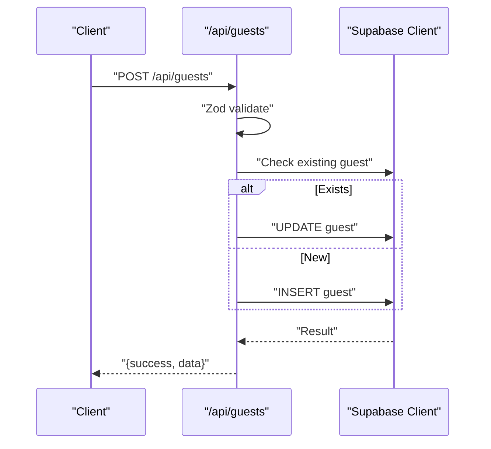
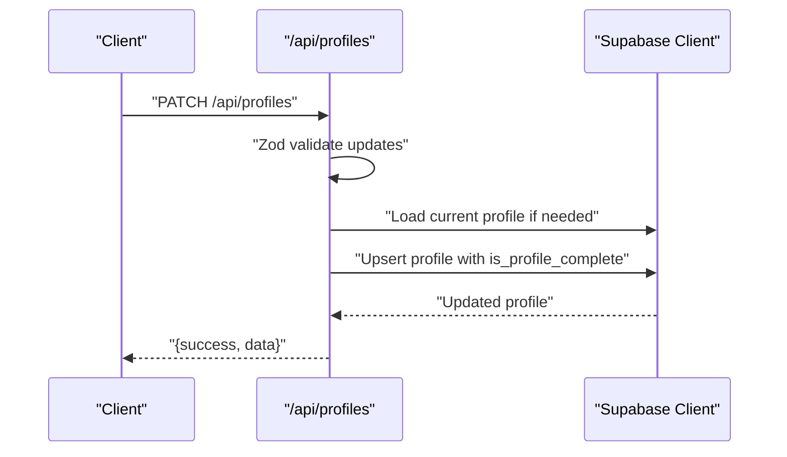
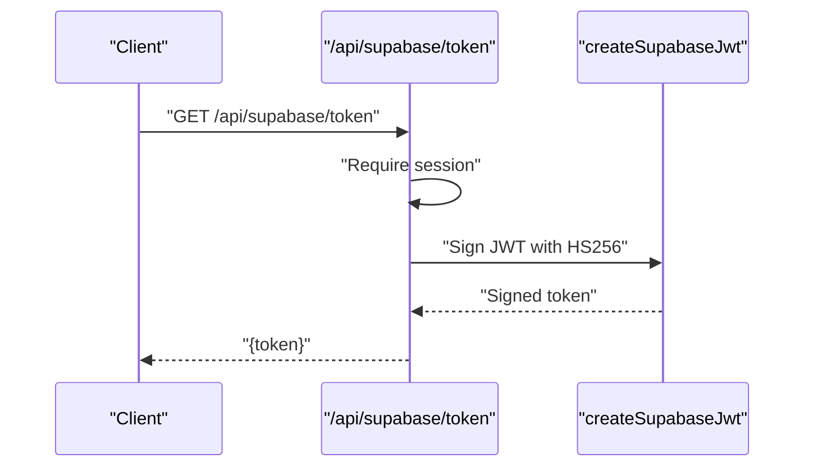
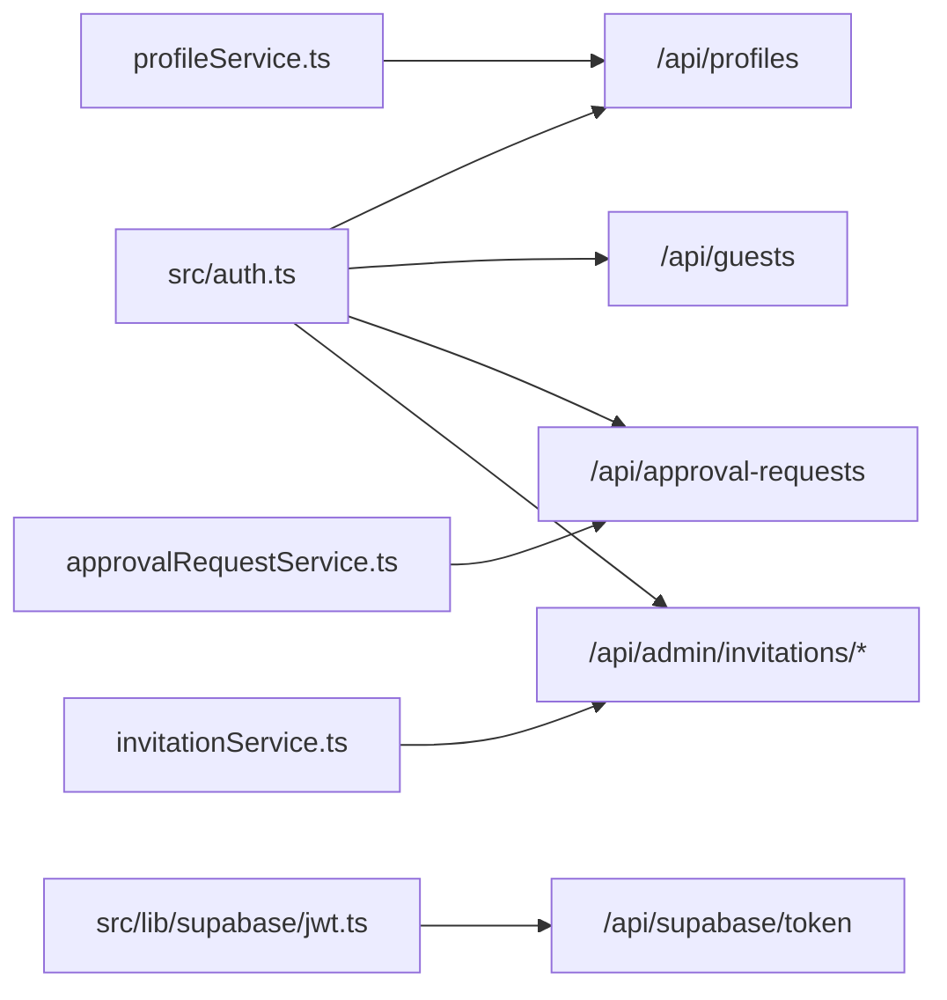

# API Endpoints

<cite>
**Referenced Files in This Document**
- [src/app/api/admin/invitations/route.ts](file://src/app/api/admin/invitations/route.ts)
- [src/app/api/admin/invitations/[id]/route.ts](file://src/app/api/admin/invitations/[id]/route.ts)
- [src/app/api/approval-requests/route.ts](file://src/app/api/approval-requests/route.ts)
- [src/app/api/guests/route.ts](file://src/app/api/guests/route.ts)
- [src/app/api/profiles/route.ts](file://src/app/api/profiles/route.ts)
- [src/app/api/supabase/token/route.ts](file://src/app/api/supabase/token/route.ts)
- [src/services/approvalRequestService.ts](file://src/services/approvalRequestService.ts)
- [src/services/invitationService.ts](file://src/services/invitationService.ts)
- [src/services/profileService.ts](file://src/services/profileService.ts)
- [src/auth.ts](file://src/auth.ts)
- [src/lib/supabase/jwt.ts](file://src/lib/supabase/jwt.ts)
- [src/lib/constants.ts](file://src/lib/constants.ts)
- [src/lib/services.ts](file://src/lib/services.ts)
</cite>

## Table of Contents
1. [Introduction](#introduction)
2. [Project Structure](#project-structure)
3. [Core Components](#core-components)
4. [Architecture Overview](#architecture-overview)
5. [Detailed Component Analysis](#detailed-component-analysis)
6. [Dependency Analysis](#dependency-analysis)
7. [Performance Considerations](#performance-considerations)
8. [Troubleshooting Guide](#troubleshooting-guide)
9. [Conclusion](#conclusion)
10. [Appendices](#appendices)

## Introduction
This document describes the RESTful API endpoints used by the Banana Wedding platform. It covers HTTP methods, URL patterns, request/response schemas, authentication requirements, and operational behavior for:
- Admin invitation management
- Approval request handling
- Guest management (RSVP)
- Profile services
- Supabase token generation for secure client authentication

It also documents error handling, parameter validation, response formatting, rate limiting considerations, API versioning posture, and backward compatibility practices.

## Project Structure
The API surface is implemented as Next.js App Router API routes grouped by domain:
- Admin invitation management: GET and DELETE endpoints under /api/admin/invitations
- Approval requests: POST, GET, and DELETE under /api/approval-requests
- Guest management: POST and GET under /api/guests
- Profiles: GET and PATCH under /api/profiles
- Supabase token: GET under /api/supabase/token

**Diagram sources**
- [src/app/api/admin/invitations/route.ts](file://src/app/api/admin/invitations/route.ts#L1-L64)
- [src/app/api/admin/invitations/[id]/route.ts](file://src/app/api/admin/invitations/[id]/route.ts#L1-L40)
- [src/app/api/approval-requests/route.ts](file://src/app/api/approval-requests/route.ts#L1-L213)
- [src/app/api/guests/route.ts](file://src/app/api/guests/route.ts#L1-L124)
- [src/app/api/profiles/route.ts](file://src/app/api/profiles/route.ts#L1-L125)
- [src/app/api/supabase/token/route.ts](file://src/app/api/supabase/token/route.ts#L1-L16)
- [src/services/approvalRequestService.ts](file://src/services/approvalRequestService.ts#L1-L53)
- [src/services/invitationService.ts](file://src/services/invitationService.ts#L1-L81)
- [src/services/profileService.ts](file://src/services/profileService.ts#L1-L101)

**Section sources**
- [src/app/api/admin/invitations/route.ts](file://src/app/api/admin/invitations/route.ts#L1-L64)
- [src/app/api/admin/invitations/[id]/route.ts](file://src/app/api/admin/invitations/[id]/route.ts#L1-L40)
- [src/app/api/approval-requests/route.ts](file://src/app/api/approval-requests/route.ts#L1-L213)
- [src/app/api/guests/route.ts](file://src/app/api/guests/route.ts#L1-L124)
- [src/app/api/profiles/route.ts](file://src/app/api/profiles/route.ts#L1-L125)
- [src/app/api/supabase/token/route.ts](file://src/app/api/supabase/token/route.ts#L1-L16)
- [src/services/approvalRequestService.ts](file://src/services/approvalRequestService.ts#L1-L53)
- [src/services/invitationService.ts](file://src/services/invitationService.ts#L1-L81)
- [src/services/profileService.ts](file://src/services/profileService.ts#L1-L101)

## Core Components
- Authentication: NextAuth-based session retrieval via a shared auth helper. Routes enforce session presence and admin checks where required.
- Supabase integration: Routes use either a server client bound to the session or the Supabase admin client depending on operation.
- Validation: Zod schemas validate request bodies and parameters.
- Response format: All endpoints return a consistent envelope with a boolean success flag and a data payload or an error object with an error message and optional details.

**Section sources**
- [src/auth.ts](file://src/auth.ts#L1-L5)
- [src/app/api/profiles/route.ts](file://src/app/api/profiles/route.ts#L1-L125)
- [src/app/api/guests/route.ts](file://src/app/api/guests/route.ts#L1-L124)
- [src/app/api/approval-requests/route.ts](file://src/app/api/approval-requests/route.ts#L1-L213)
- [src/app/api/admin/invitations/route.ts](file://src/app/api/admin/invitations/route.ts#L1-L64)

## Architecture Overview
The API follows a layered architecture:
- Route handlers implement HTTP endpoints and enforce auth and admin checks.
- Services encapsulate client-side API calls and data processing utilities.
- Supabase clients are created per-request/session as needed.

**Diagram sources**
- [src/auth.ts](file://src/auth.ts#L1-L5)
- [src/app/api/profiles/route.ts](file://src/app/api/profiles/route.ts#L1-L125)
- [src/app/api/guests/route.ts](file://src/app/api/guests/route.ts#L1-L124)
- [src/app/api/approval-requests/route.ts](file://src/app/api/approval-requests/route.ts#L1-L213)
- [src/app/api/admin/invitations/route.ts](file://src/app/api/admin/invitations/route.ts#L1-L64)

## Detailed Component Analysis

### Admin Invitation Management
- Purpose: Retrieve invitations requiring approval and delete invitations (admin-only).
- Authentication: Session required; admin check enforced via profile lookup or hardcoded admin email.

Endpoints:
- GET /api/admin/invitations
  - Description: List invitations with pending approval requests, ordered by last update.
  - Auth: Requires session; admin required.
  - Query: None.
  - Body: None.
  - Response: success (boolean), data (array of invitation summaries).
  - Errors: Unauthorized (401), Forbidden (403), Internal Server Error (500).

- DELETE /api/admin/invitations/[id]
  - Description: Delete an invitation record using service role bypass.
  - Auth: Requires session; admin required.
  - Path param: id (UUID).
  - Body: None.
  - Response: success (boolean).
  - Errors: Unauthorized (401), Internal Server Error (500).

**Diagram sources**
- [src/app/api/admin/invitations/[id]/route.ts](file://src/app/api/admin/invitations/[id]/route.ts#L1-L40)

**Section sources**
- [src/app/api/admin/invitations/route.ts](file://src/app/api/admin/invitations/route.ts#L1-L64)
- [src/app/api/admin/invitations/[id]/route.ts](file://src/app/api/admin/invitations/[id]/route.ts#L1-L40)

### Approval Requests
- Purpose: Submit, list, and cancel approval requests for invitations.
- Authentication: Session required for all methods.

Endpoints:
- POST /api/approval-requests
  - Description: Create a new approval request for an invitation. Prevents duplicate pending requests.
  - Auth: Required.
  - Body: invitationId (UUID), invitationSlug (string), requesterName (string), requesterPhone (string).
  - Response: success (boolean), data (approval request summary).
  - Errors: Unauthorized (401), Bad Request (400), Internal Server Error (500).

- GET /api/approval-requests
  - Description: List all approval requests (admin-only).
  - Auth: Required; admin required.
  - Query: None.
  - Body: None.
  - Response: success (boolean), data (array of approval request summaries).
  - Errors: Unauthorized (401), Forbidden (403), Internal Server Error (500).

- DELETE /api/approval-requests?invitationId={uuid}
  - Description: Cancel a pending approval request and reset invitation’s requesting flag.
  - Auth: Required.
  - Query: invitationId (required UUID).
  - Body: None.
  - Response: success (boolean).
  - Errors: Bad Request (400), Unauthorized (401), Internal Server Error (500).

**Diagram sources**
- [src/app/api/approval-requests/route.ts](file://src/app/api/approval-requests/route.ts#L1-L89)

**Section sources**
- [src/app/api/approval-requests/route.ts](file://src/app/api/approval-requests/route.ts#L1-L213)
- [src/services/approvalRequestService.ts](file://src/services/approvalRequestService.ts#L1-L53)

### Guest Management (RSVP)
- Purpose: Record or update guest RSVP details for an invitation.
- Authentication: Not required for guest submissions; public endpoint.

Endpoints:
- POST /api/guests
  - Description: Upsert guest record by invitationId and name.
  - Auth: Not required.
  - Body: invitationId (UUID), name (string), attending (boolean), numberOfGuests (number 0–10), dietaryRestrictions (array of strings, optional), specialRequests (string, optional).
  - Response: success (boolean), data (guest record).
  - Errors: Bad Request (400), Internal Server Error (500).

- GET /api/guests?invitationId={uuid}
  - Description: List all guests for an invitation, newest first.
  - Auth: Not required.
  - Query: invitationId (required UUID).
  - Body: None.
  - Response: success (boolean), data (array of guest records).
  - Errors: Bad Request (400), Internal Server Error (500).

**Diagram sources**
- [src/app/api/guests/route.ts](file://src/app/api/guests/route.ts#L1-L86)

**Section sources**
- [src/app/api/guests/route.ts](file://src/app/api/guests/route.ts#L1-L124)

### Profiles
- Purpose: Retrieve and update user profile data.
- Authentication: Session required for both methods.

Endpoints:
- GET /api/profiles
  - Description: Get current user’s profile. Returns null if no record found.
  - Auth: Required.
  - Query: None.
  - Body: None.
  - Response: success (boolean), data (profile or null).
  - Errors: Unauthorized (401), Internal Server Error (500).

- PATCH /api/profiles
  - Description: Upsert profile. Completes profile if both full_name and phone are present.
  - Auth: Required.
  - Body: full_name (string, optional), phone (string, optional), avatar_url (string URL or null, optional).
  - Response: success (boolean), data (profile).
  - Errors: Unauthorized (401), Bad Request (400), Internal Server Error (500).

**Diagram sources**
- [src/app/api/profiles/route.ts](file://src/app/api/profiles/route.ts#L56-L124)

**Section sources**
- [src/app/api/profiles/route.ts](file://src/app/api/profiles/route.ts#L1-L125)
- [src/services/profileService.ts](file://src/services/profileService.ts#L1-L101)

### Supabase Token Generation
- Purpose: Issue a short-lived JWT for client-side Supabase access.
- Authentication: Session required.

Endpoint:
- GET /api/supabase/token
  - Description: Generate a signed JWT with role authenticated and 1-hour expiry.
  - Auth: Required.
  - Query: None.
  - Body: None.
  - Response: token (string).
  - Errors: Unauthorized (401), Internal Server Error (500).

**Diagram sources**
- [src/app/api/supabase/token/route.ts](file://src/app/api/supabase/token/route.ts#L1-L16)
- [src/lib/supabase/jwt.ts](file://src/lib/supabase/jwt.ts#L1-L15)

**Section sources**
- [src/app/api/supabase/token/route.ts](file://src/app/api/supabase/token/route.ts#L1-L16)
- [src/lib/supabase/jwt.ts](file://src/lib/supabase/jwt.ts#L1-L15)

## Dependency Analysis
- Route handlers depend on:
  - Shared auth helper for session retrieval.
  - Supabase clients created per request/session.
  - Zod schemas for request validation.
- Client-side services wrap API routes for convenience and type safety.

**Diagram sources**
- [src/auth.ts](file://src/auth.ts#L1-L5)
- [src/app/api/profiles/route.ts](file://src/app/api/profiles/route.ts#L1-L125)
- [src/app/api/guests/route.ts](file://src/app/api/guests/route.ts#L1-L124)
- [src/app/api/approval-requests/route.ts](file://src/app/api/approval-requests/route.ts#L1-L213)
- [src/app/api/admin/invitations/route.ts](file://src/app/api/admin/invitations/route.ts#L1-L64)
- [src/app/api/admin/invitations/[id]/route.ts](file://src/app/api/admin/invitations/[id]/route.ts#L1-L40)
- [src/app/api/supabase/token/route.ts](file://src/app/api/supabase/token/route.ts#L1-L16)
- [src/lib/supabase/jwt.ts](file://src/lib/supabase/jwt.ts#L1-L15)
- [src/services/approvalRequestService.ts](file://src/services/approvalRequestService.ts#L1-L53)
- [src/services/invitationService.ts](file://src/services/invitationService.ts#L1-L81)
- [src/services/profileService.ts](file://src/services/profileService.ts#L1-L101)

**Section sources**
- [src/services/approvalRequestService.ts](file://src/services/approvalRequestService.ts#L1-L53)
- [src/services/invitationService.ts](file://src/services/invitationService.ts#L1-L81)
- [src/services/profileService.ts](file://src/services/profileService.ts#L1-L101)

## Performance Considerations
- Request validation occurs before database calls to fail fast.
- Parallel operations are used where appropriate (e.g., fetching session and request body concurrently).
- Client-side services leverage Next.js caching and request memoization for data fetching.
- Recommendations:
  - Apply rate limiting at the edge or gateway to protect sensitive endpoints (e.g., approval creation, guest upsert).
  - Use pagination for admin lists when data grows.
  - Consider CDN caching for read-heavy public endpoints (e.g., guest list retrieval) with appropriate revalidation.

[No sources needed since this section provides general guidance]

## Troubleshooting Guide
Common issues and resolutions:
- Unauthorized (401):
  - Cause: Missing or invalid session.
  - Resolution: Ensure the client authenticates and passes session cookies/tokens.
- Forbidden (403):
  - Cause: Non-admin user attempting admin-only operations.
  - Resolution: Verify admin status via profile or use admin credentials.
- Bad Request (400):
  - Cause: Invalid input per Zod schema.
  - Resolution: Validate fields (UUIDs, min lengths, numeric ranges) before sending.
- Internal Server Error (500):
  - Cause: Database errors or missing service role keys.
  - Resolution: Check logs, verify Supabase configuration, and retry.

Operational tips:
- Use the consistent response envelope to detect failures uniformly.
- For approval requests, check for existing pending requests before resubmitting.
- For guest management, note that upsert semantics update existing guests by invitationId and name.

**Section sources**
- [src/app/api/approval-requests/route.ts](file://src/app/api/approval-requests/route.ts#L75-L88)
- [src/app/api/guests/route.ts](file://src/app/api/guests/route.ts#L71-L85)
- [src/app/api/profiles/route.ts](file://src/app/api/profiles/route.ts#L110-L123)
- [src/app/api/admin/invitations/route.ts](file://src/app/api/admin/invitations/route.ts#L32-L38)

## Conclusion
The Banana Wedding API provides a focused set of endpoints for admin workflows, approval management, guest RSVP tracking, and user profile maintenance. It enforces authentication centrally, validates inputs rigorously, and returns consistent responses. The Supabase token endpoint enables secure client authentication. For production hardening, apply rate limiting, monitor error rates, and consider API versioning and deprecation policies as the platform evolves.

[No sources needed since this section summarizes without analyzing specific files]

## Appendices

### Authentication Methods
- Session-based via NextAuth. Use the shared auth helper to retrieve the session in route handlers.
- Admin verification: Check profile is_admin flag or compare against a configured admin email.

**Section sources**
- [src/auth.ts](file://src/auth.ts#L1-L5)
- [src/app/api/admin/invitations/route.ts](file://src/app/api/admin/invitations/route.ts#L10-L30)
- [src/app/api/approval-requests/route.ts](file://src/app/api/approval-requests/route.ts#L91-L120)

### Parameter Validation
- Approval requests: UUID invitationId, non-empty strings for slug/name/phone.
- Guest management: UUID invitationId, boolean attending, numberOfGuests 0–10, optional arrays/strings.
- Profiles: Optional full_name/phone/avatar_url; Zod enforces types and URLs.

**Section sources**
- [src/app/api/approval-requests/route.ts](file://src/app/api/approval-requests/route.ts#L9-L14)
- [src/app/api/guests/route.ts](file://src/app/api/guests/route.ts#L6-L13)
- [src/app/api/profiles/route.ts](file://src/app/api/profiles/route.ts#L7-L11)

### Response Formatting Standards
- Envelope: { success: boolean, data: any | null, error?: string, details?: any }
- Status codes: 2xx success, 400 bad request, 401 unauthorized, 403 forbidden, 500 internal server error.

**Section sources**
- [src/app/api/profiles/route.ts](file://src/app/api/profiles/route.ts#L14-L53)
- [src/app/api/guests/route.ts](file://src/app/api/guests/route.ts#L15-L85)
- [src/app/api/approval-requests/route.ts](file://src/app/api/approval-requests/route.ts#L17-L88)
- [src/app/api/admin/invitations/route.ts](file://src/app/api/admin/invitations/route.ts#L8-L62)

### Rate Limiting Considerations
- Recommended placement: Edge/proxy or middleware before route handlers.
- Sensitive endpoints: approval-requests (POST/DELETE), guests (POST), profiles (PATCH).
- Public endpoints: guests (GET), admin invitations (GET) can be more permissive but still monitored.

[No sources needed since this section provides general guidance]

### API Versioning, Backward Compatibility, Deprecation
- Current state: No explicit version prefix on routes; base URL configurable via constants.
- Recommendations:
  - Introduce versioned base path (e.g., /api/v1) to decouple future breaking changes.
  - Announce deprecations with timeline and migration guide.
  - Preserve old endpoints during transition period and mark deprecated in docs.

**Section sources**
- [src/lib/constants.ts](file://src/lib/constants.ts#L12-L16)

### Practical Examples of API Usage
- Create an approval request:
  - Method: POST /api/approval-requests
  - Body: { invitationId, invitationSlug, requesterName, requesterPhone }
  - Expected: 201 with data; 200 if duplicate pending exists; 400 on validation failure; 500 on server error.
- Submit an RSVP:
  - Method: POST /api/guests
  - Body: { invitationId, name, attending, numberOfGuests, dietaryRestrictions?, specialRequests? }
  - Expected: 201 on create, 200 on update; 400 on validation failure; 500 on server error.
- Fetch guest list:
  - Method: GET /api/guests?invitationId={uuid}
  - Expected: 200 with array; 400 if missing parameter; 500 on server error.
- Update profile:
  - Method: PATCH /api/profiles
  - Body: { full_name?, phone?, avatar_url? }
  - Expected: 200 with updated profile; 400 on validation failure; 500 on server error.
- Generate Supabase token:
  - Method: GET /api/supabase/token
  - Expected: 200 with token; 401 if not authenticated; 500 on server error.

**Section sources**
- [src/app/api/approval-requests/route.ts](file://src/app/api/approval-requests/route.ts#L17-L89)
- [src/app/api/guests/route.ts](file://src/app/api/guests/route.ts#L15-L86)
- [src/app/api/profiles/route.ts](file://src/app/api/profiles/route.ts#L56-L124)
- [src/app/api/supabase/token/route.ts](file://src/app/api/supabase/token/route.ts#L5-L15)