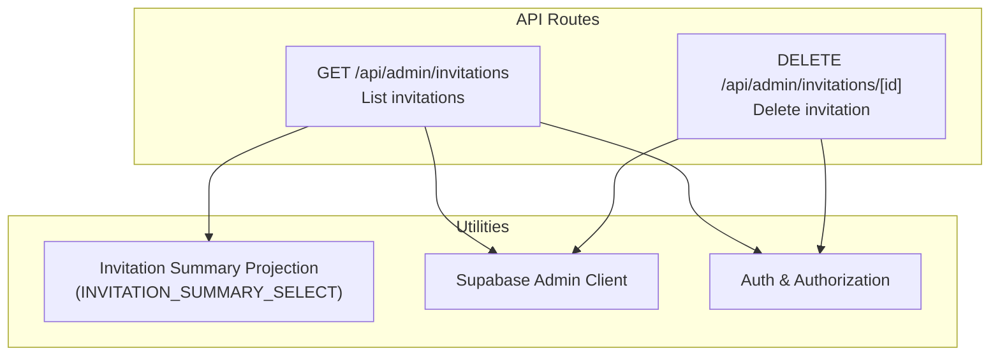
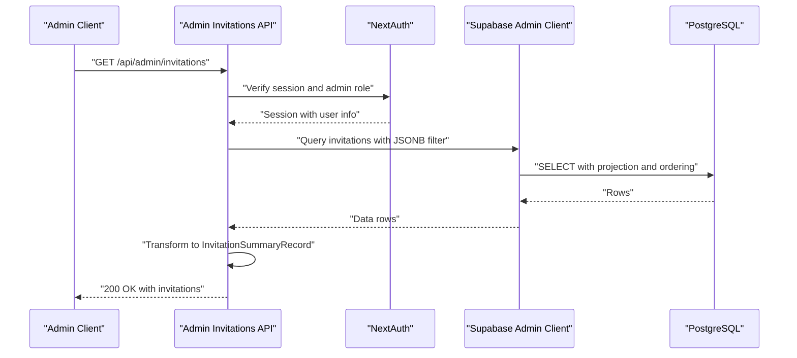
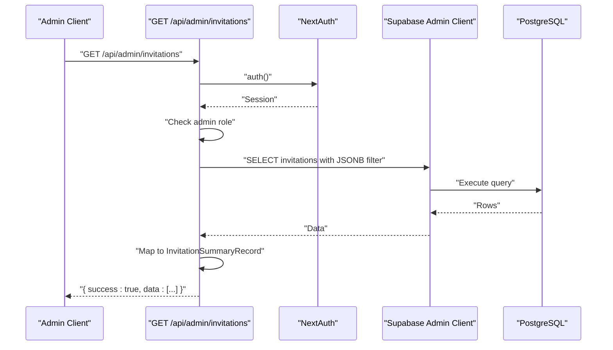
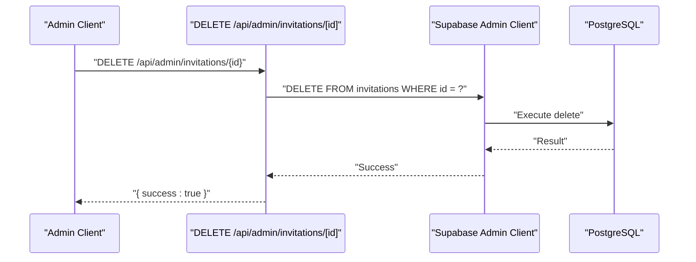
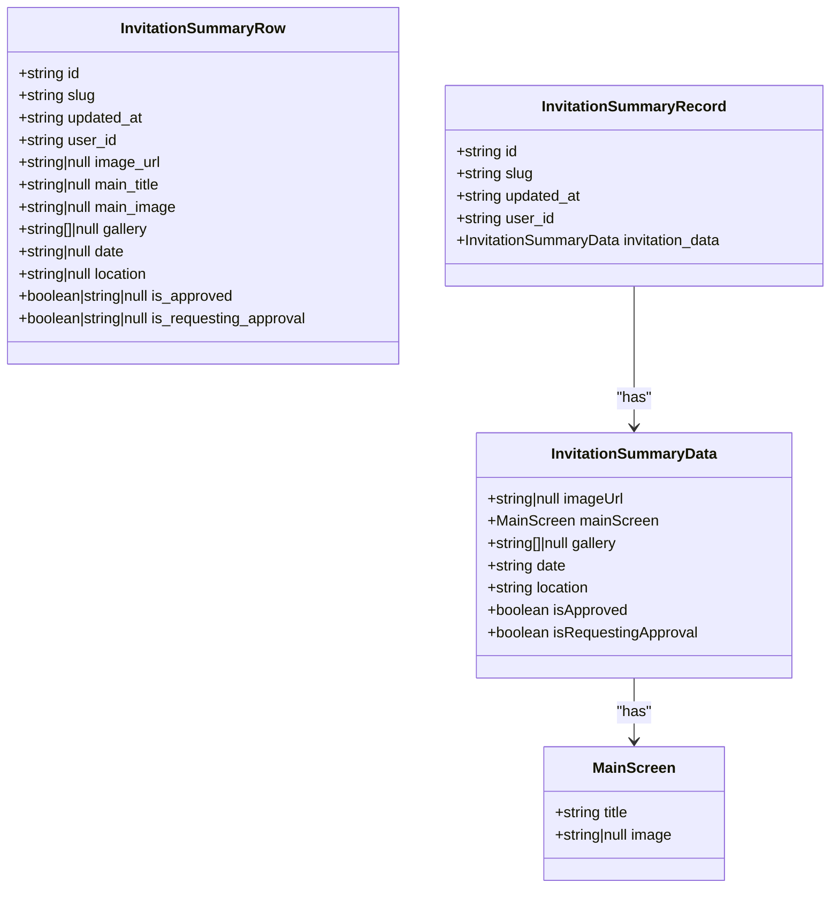
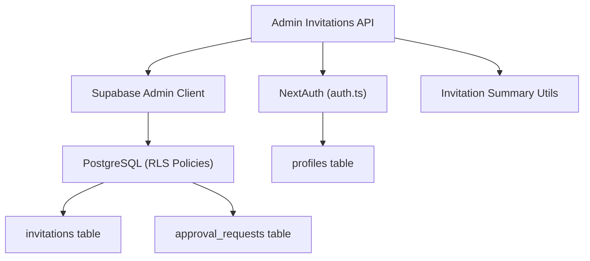

# Admin Invitation Management

<cite>
**Referenced Files in This Document**
- [src/app/api/admin/invitations/route.ts](file://src/app/api/admin/invitations/route.ts)
- [src/app/api/admin/invitations/[id]/route.ts](file://src/app/api/admin/invitations/[id]/route.ts)
- [src/lib/invitation-summary.ts](file://src/lib/invitation-summary.ts)
- [src/lib/supabaseAdmin.ts](file://src/lib/supabaseAdmin.ts)
- [src/auth.ts](file://src/auth.ts)
- [src/auth-config.ts](file://src/auth-config.ts)
- [src/services/invitationService.ts](file://src/services/invitationService.ts)
- [middleware.ts](file://middleware.ts)
- [supabase/migrations/20260114090000_fix_admin_access_and_rls.sql](file://supabase/migrations/20260114090000_fix_admin_access_and_rls.sql)
- [supabase/migrations/20260114100000_fix_recursion_error.sql](file://supabase/migrations/20260114100000_fix_recursion_error.sql)
- [supabase/migrations/20260114063537_add_profiles_and_approval_requests.sql](file://supabase/migrations/20260114063537_add_profiles_and_approval_requests.sql)
- [supabase/config.toml](file://supabase/config.toml)
</cite>

## Table of Contents
1. [Introduction](#introduction)
2. [Project Structure](#project-structure)
3. [Core Components](#core-components)
4. [Architecture Overview](#architecture-overview)
5. [Detailed Component Analysis](#detailed-component-analysis)
6. [Dependency Analysis](#dependency-analysis)
7. [Performance Considerations](#performance-considerations)
8. [Troubleshooting Guide](#troubleshooting-guide)
9. [Conclusion](#conclusion)

## Introduction
This document provides comprehensive API documentation for the admin invitation management endpoints. It covers:
- Retrieving all invitations with filtering and ordering
- Retrieving specific invitation details
- Deleting invitations (admin-only)
- Authentication and authorization requirements
- Request/response schemas
- Rate limiting and validation considerations
- Audit logging guidance for admin actions

Note: As implemented, the current codebase exposes endpoints for listing invitations and deleting invitations by ID. There is no PUT endpoint for updating invitation status or admin notes in the provided files. This document reflects the actual implementation and highlights areas where additional endpoints would need to be added to support full CRUD operations.

## Project Structure
The admin invitation management endpoints are implemented as Next.js App Router API routes under `/src/app/api/admin/invitations`. Supporting utilities include:
- Invitation summary projection and transformation
- Supabase admin client initialization
- Authentication and authorization configuration
- Middleware for route protection

**Diagram sources**
- [src/app/api/admin/invitations/route.ts](file://src/app/api/admin/invitations/route.ts#L1-L64)
- [src/app/api/admin/invitations/[id]/route.ts](file://src/app/api/admin/invitations/[id]/route.ts#L1-L40)
- [src/lib/invitation-summary.ts](file://src/lib/invitation-summary.ts#L1-L74)
- [src/lib/supabaseAdmin.ts](file://src/lib/supabaseAdmin.ts#L1-L15)
- [src/auth.ts](file://src/auth.ts#L1-L5)
- [src/auth-config.ts](file://src/auth-config.ts#L1-L227)

**Section sources**
- [src/app/api/admin/invitations/route.ts](file://src/app/api/admin/invitations/route.ts#L1-L64)
- [src/app/api/admin/invitations/[id]/route.ts](file://src/app/api/admin/invitations/[id]/route.ts#L1-L40)
- [src/lib/invitation-summary.ts](file://src/lib/invitation-summary.ts#L1-L74)
- [src/lib/supabaseAdmin.ts](file://src/lib/supabaseAdmin.ts#L1-L15)
- [src/auth.ts](file://src/auth.ts#L1-L5)
- [src/auth-config.ts](file://src/auth-config.ts#L1-L227)

## Core Components
- GET /api/admin/invitations
  - Purpose: Retrieve invitations that are requesting approval, ordered by last updated.
  - Filtering: Uses a JSONB containment filter on the invitation_data column to select items where isRequestingApproval is true.
  - Ordering: Sorts by updated_at descending.
  - Response: Returns success flag and an array of invitation summaries.

- GET /api/admin/invitations/[id]
  - Current implementation: Not present in the provided files. The route file only defines DELETE. To fulfill the objective, a GET handler should be added to retrieve a specific invitation by ID.

- PUT /api/admin/invitations/[id]
  - Current implementation: Not present in the provided files. The route file only defines DELETE. To fulfill the objective, a PUT handler should be added to update invitation status and admin notes.

- DELETE /api/admin/invitations/[id]
  - Purpose: Delete an invitation by ID using the Supabase service role client.
  - Behavior: Bypasses Row Level Security (RLS) using the service role key.

- Invitation Summary Utilities
  - INVITATION_SUMMARY_SELECT: Defines the projected fields from the invitations table, including JSON field aliases for invitation_data.
  - toInvitationSummary: Transforms database rows into a normalized InvitationSummaryRecord with typed fields.

- Authentication and Authorization
  - Authentication: Uses NextAuth with custom admin credentials provider and social providers.
  - Authorization: Admins are identified either by a hardcoded email match or by checking the profiles table for is_admin flag. The Supabase RLS policies allow admins full access to invitations.

**Section sources**
- [src/app/api/admin/invitations/route.ts](file://src/app/api/admin/invitations/route.ts#L8-L63)
- [src/app/api/admin/invitations/[id]/route.ts](file://src/app/api/admin/invitations/[id]/route.ts#L1-L40)
- [src/lib/invitation-summary.ts](file://src/lib/invitation-summary.ts#L1-L74)
- [src/lib/supabaseAdmin.ts](file://src/lib/supabaseAdmin.ts#L1-L15)
- [src/auth.ts](file://src/auth.ts#L1-L5)
- [src/auth-config.ts](file://src/auth-config.ts#L79-L128)
- [supabase/migrations/20260114090000_fix_admin_access_and_rls.sql](file://supabase/migrations/20260114090000_fix_admin_access_and_rls.sql#L20-L37)
- [supabase/migrations/20260114100000_fix_recursion_error.sql](file://supabase/migrations/20260114100000_fix_recursion_error.sql#L37-L50)

## Architecture Overview
The admin invitation management API follows a layered architecture:
- Presentation Layer: Next.js App Router API routes
- Domain Layer: Invitation summary projection and transformation
- Infrastructure Layer: Supabase client configured with service role key
- Security Layer: NextAuth for authentication and Supabase RLS for authorization

**Diagram sources**
- [src/app/api/admin/invitations/route.ts](file://src/app/api/admin/invitations/route.ts#L8-L63)
- [src/auth.ts](file://src/auth.ts#L1-L5)
- [src/lib/supabaseAdmin.ts](file://src/lib/supabaseAdmin.ts#L1-L15)
- [src/lib/invitation-summary.ts](file://src/lib/invitation-summary.ts#L56-L73)

## Detailed Component Analysis

### GET /api/admin/invitations
- Authentication: Requires a valid NextAuth session. Admins are authorized via email whitelist or profiles.is_admin flag.
- Authorization: Supabase RLS allows admins full access to invitations.
- Filtering: Uses JSONB containment on invitation_data to select items where isRequestingApproval is true.
- Ordering: Orders by updated_at descending.
- Response: Returns success flag and an array of InvitationSummaryRecord objects.

**Diagram sources**
- [src/app/api/admin/invitations/route.ts](file://src/app/api/admin/invitations/route.ts#L8-L63)
- [src/lib/invitation-summary.ts](file://src/lib/invitation-summary.ts#L56-L73)

**Section sources**
- [src/app/api/admin/invitations/route.ts](file://src/app/api/admin/invitations/route.ts#L8-L63)
- [src/lib/invitation-summary.ts](file://src/lib/invitation-summary.ts#L1-L74)
- [src/auth.ts](file://src/auth.ts#L1-L5)
- [src/auth-config.ts](file://src/auth-config.ts#L79-L128)
- [supabase/migrations/20260114090000_fix_admin_access_and_rls.sql](file://supabase/migrations/20260114090000_fix_admin_access_and_rls.sql#L20-L37)

### GET /api/admin/invitations/[id]
- Current Implementation: Not present in the provided files. The route file only exports DELETE. To meet the objective, add a GET handler that retrieves a single invitation by ID using the Supabase admin client and returns the full invitation record or a summarized view.

- Request
  - Path Parameters
    - id: string (required) - Invitation identifier

- Response
  - 200 OK: Invitation data
  - 401 Unauthorized: Missing or invalid session
  - 403 Forbidden: Non-admin user
  - 404 Not Found: Invitation not found
  - 500 Internal Server Error: Server error

- Notes
  - Authorization follows the same admin checks as GET /api/admin/invitations
  - Use the Supabase admin client to bypass RLS for admin-only access

**Section sources**
- [src/app/api/admin/invitations/[id]/route.ts](file://src/app/api/admin/invitations/[id]/route.ts#L1-L40)
- [src/auth.ts](file://src/auth.ts#L1-L5)
- [src/auth-config.ts](file://src/auth-config.ts#L79-L128)

### PUT /api/admin/invitations/[id]
- Current Implementation: Not present in the provided files. The route file only exports DELETE. To meet the objective, add a PUT handler that:
  - Validates admin credentials
  - Accepts request body with fields for status update and admin notes
  - Updates the invitation_data JSONB field accordingly
  - Returns success response

- Request
  - Path Parameters
    - id: string (required) - Invitation identifier
  - Headers
    - Content-Type: application/json
  - Body Fields
    - isApproved: boolean (optional) - Approve or revoke approval
    - adminNotes: string (optional) - Administrative notes
    - isRequestingApproval: boolean (optional) - Mark as pending review

- Response
  - 200 OK: { success: true }
  - 400 Bad Request: Validation errors
  - 401 Unauthorized: Missing or invalid session
  - 403 Forbidden: Non-admin user
  - 404 Not Found: Invitation not found
  - 500 Internal Server Error: Server error

**Section sources**
- [src/app/api/admin/invitations/[id]/route.ts](file://src/app/api/admin/invitations/[id]/route.ts#L1-L40)
- [src/auth.ts](file://src/auth.ts#L1-L5)
- [src/auth-config.ts](file://src/auth-config.ts#L79-L128)

### DELETE /api/admin/invitations/[id]
- Purpose: Delete an invitation by ID using the Supabase service role client
- Behavior: Bypasses Row Level Security (RLS) using the service role key
- Response: Returns success flag on successful deletion

**Diagram sources**
- [src/app/api/admin/invitations/[id]/route.ts](file://src/app/api/admin/invitations/[id]/route.ts#L4-L31)
- [src/lib/supabaseAdmin.ts](file://src/lib/supabaseAdmin.ts#L1-L15)

**Section sources**
- [src/app/api/admin/invitations/[id]/route.ts](file://src/app/api/admin/invitations/[id]/route.ts#L4-L39)
- [src/lib/supabaseAdmin.ts](file://src/lib/supabaseAdmin.ts#L1-L15)

### Invitation Summary Schema
The invitation summary projection extracts key fields from the invitations table, including JSON field aliases for invitation_data.

**Diagram sources**
- [src/lib/invitation-summary.ts](file://src/lib/invitation-summary.ts#L17-L73)

**Section sources**
- [src/lib/invitation-summary.ts](file://src/lib/invitation-summary.ts#L1-L74)

## Dependency Analysis
The admin invitation endpoints depend on:
- NextAuth for session verification and admin role determination
- Supabase Admin Client for database operations
- Invitation summary utilities for data projection and transformation
- Supabase RLS policies for authorization enforcement

**Diagram sources**
- [src/app/api/admin/invitations/route.ts](file://src/app/api/admin/invitations/route.ts#L1-L6)
- [src/auth.ts](file://src/auth.ts#L1-L5)
- [src/auth-config.ts](file://src/auth-config.ts#L1-L227)
- [src/lib/supabaseAdmin.ts](file://src/lib/supabaseAdmin.ts#L1-L15)
- [src/lib/invitation-summary.ts](file://src/lib/invitation-summary.ts#L1-L74)
- [supabase/migrations/20260114090000_fix_admin_access_and_rls.sql](file://supabase/migrations/20260114090000_fix_admin_access_and_rls.sql#L20-L37)
- [supabase/migrations/20260114100000_fix_recursion_error.sql](file://supabase/migrations/20260114100000_fix_recursion_error.sql#L37-L50)
- [supabase/migrations/20260114063537_add_profiles_and_approval_requests.sql](file://supabase/migrations/20260114063537_add_profiles_and_approval_requests.sql#L114-L136)

**Section sources**
- [src/app/api/admin/invitations/route.ts](file://src/app/api/admin/invitations/route.ts#L1-L6)
- [src/auth.ts](file://src/auth.ts#L1-L5)
- [src/auth-config.ts](file://src/auth-config.ts#L1-L227)
- [src/lib/supabaseAdmin.ts](file://src/lib/supabaseAdmin.ts#L1-L15)
- [src/lib/invitation-summary.ts](file://src/lib/invitation-summary.ts#L1-L74)
- [supabase/migrations/20260114090000_fix_admin_access_and_rls.sql](file://supabase/migrations/20260114090000_fix_admin_access_and_rls.sql#L1-L50)
- [supabase/migrations/20260114100000_fix_recursion_error.sql](file://supabase/migrations/20260114100000_fix_recursion_error.sql#L1-L80)
- [supabase/migrations/20260114063537_add_profiles_and_approval_requests.sql](file://supabase/migrations/20260114063537_add_profiles_and_approval_requests.sql#L109-L136)

## Performance Considerations
- Database Indexing
  - Consider adding indexes on invitation_data JSONB fields frequently queried (e.g., isRequestingApproval) to improve filtering performance.
  - Ensure appropriate indexing on updated_at for efficient sorting.

- Query Optimization
  - The current query filters by JSONB containment and orders by updated_at. Keep projections minimal to reduce payload size.
  - Limit the number of records returned per page if pagination is introduced later.

- Supabase Admin Client
  - Using the service role key bypasses RLS and can improve performance for admin operations, but ensure proper authorization checks are still enforced at the application level.

[No sources needed since this section provides general guidance]

## Troubleshooting Guide
- Authentication Failures
  - 401 Unauthorized: Session not found or invalid. Verify NextAuth configuration and cookie/session handling.
  - 403 Forbidden: User is not an admin. Confirm admin email in ADMIN_EMAILS and profiles.is_admin flag.

- Database Errors
  - 500 Internal Server Error: Errors during database operations. Check Supabase service role key and connection settings.

- Supabase Admin Client Issues
  - Missing SUPABASE_SERVICE_ROLE_KEY: The admin client is null. Ensure environment variables are configured.

- Rate Limiting
  - Supabase Auth rate limits apply to email/SMS operations. While admin endpoints are not directly rate-limited by Supabase Auth, excessive API calls may be throttled by infrastructure. Monitor logs for rate limit events.

**Section sources**
- [src/app/api/admin/invitations/route.ts](file://src/app/api/admin/invitations/route.ts#L10-L30)
- [src/app/api/admin/invitations/[id]/route.ts](file://src/app/api/admin/invitations/[id]/route.ts#L8-L15)
- [src/lib/supabaseAdmin.ts](file://src/lib/supabaseAdmin.ts#L1-L15)
- [supabase/config.toml](file://supabase/config.toml#L176-L196)

## Conclusion
The current admin invitation management API supports listing invitations requesting approval and deleting invitations by ID. To fully implement the documented objective, extend the route to include:
- GET /api/admin/invitations/[id] for retrieving specific invitation details
- PUT /api/admin/invitations/[id] for updating invitation status and admin notes

These additions should maintain strict admin-only authorization, validate request bodies, and integrate with the existing Supabase admin client and RLS policies. Consider adding pagination, filtering by status/date/creator, and audit logging for admin actions to enhance operational visibility and compliance.