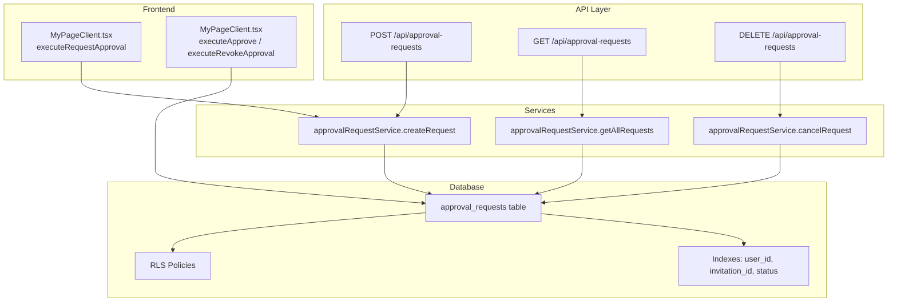
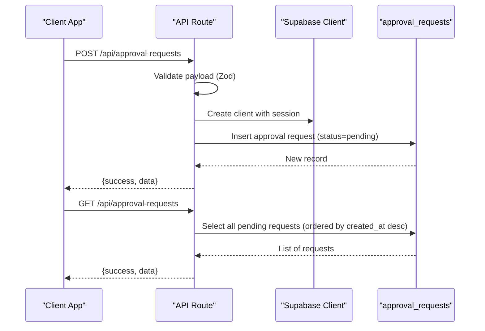
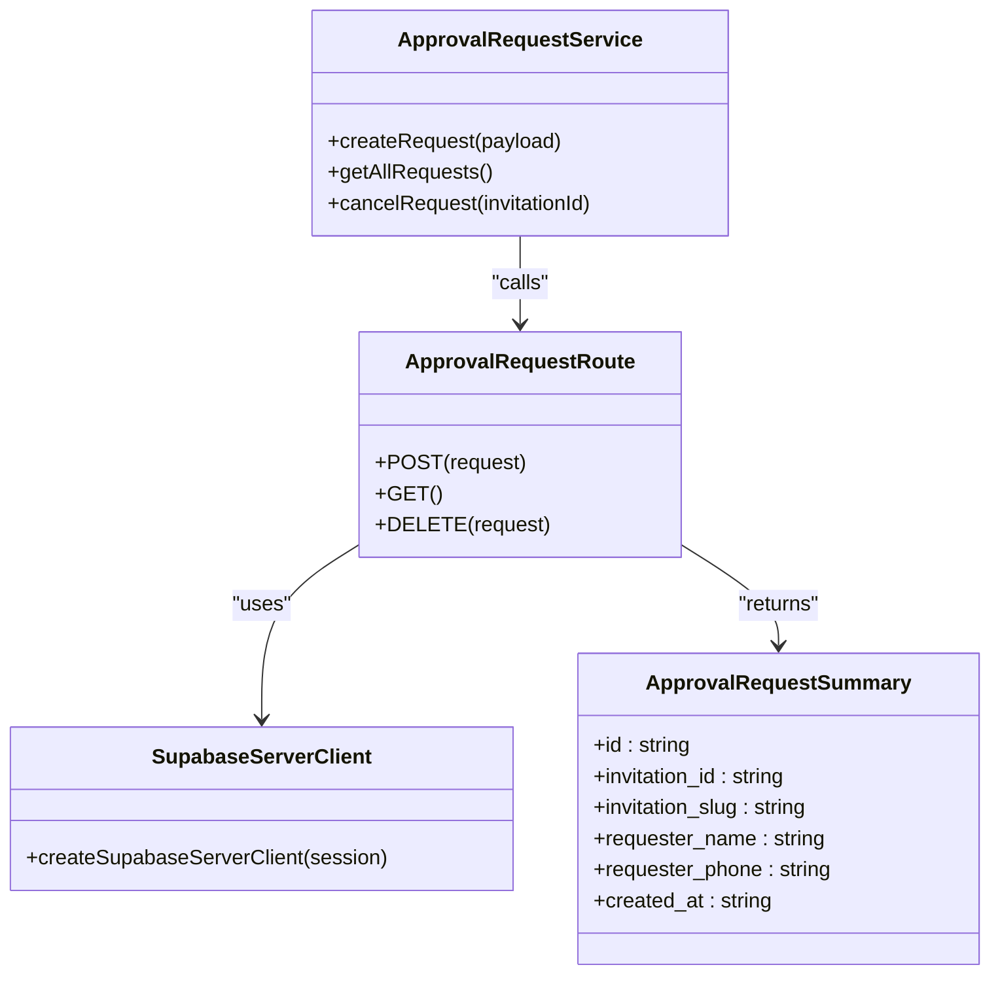
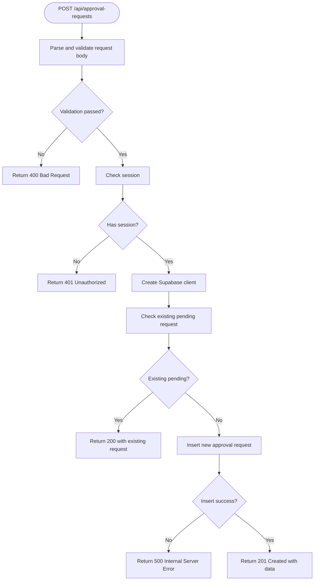
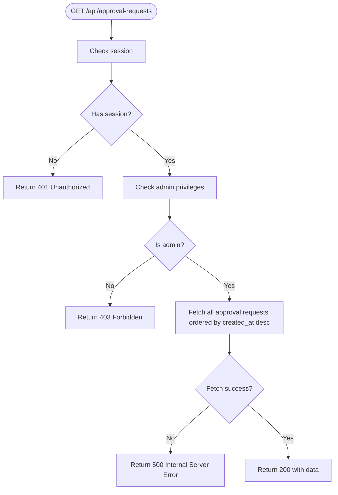
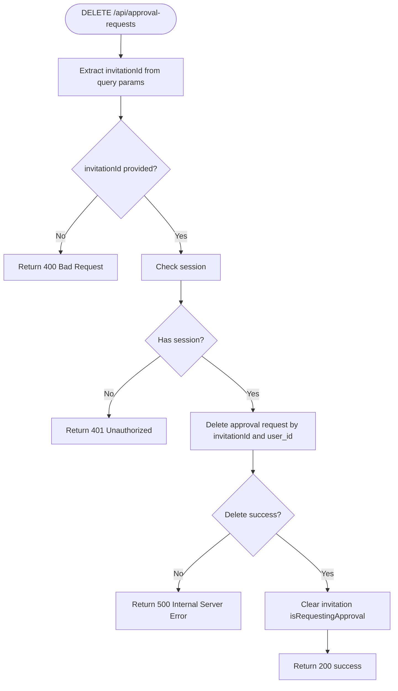
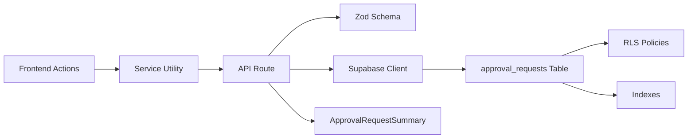

# Approval Request Management

<cite>
**Referenced Files in This Document**
- [src/app/api/approval-requests/route.ts](file://src/app/api/approval-requests/route.ts)
- [src/services/approvalRequestService.ts](file://src/services/approvalRequestService.ts)
- [src/lib/approval-request-summary.ts](file://src/lib/approval-request-summary.ts)
- [src/lib/supabase/server.ts](file://src/lib/supabase/server.ts)
- [supabase/migrations/20260114063537_add_profiles_and_approval_requests.sql](file://supabase/migrations/20260114063537_add_profiles_and_approval_requests.sql)
- [src/app/mypage/MyPageClient.tsx](file://src/app/mypage/MyPageClient.tsx)
- [src/app/api/admin/invitations/route.ts](file://src/app/api/admin/invitations/route.ts)
</cite>

## Table of Contents
1. [Introduction](#introduction)
2. [Project Structure](#project-structure)
3. [Core Components](#core-components)
4. [Architecture Overview](#architecture-overview)
5. [Detailed Component Analysis](#detailed-component-analysis)
6. [Dependency Analysis](#dependency-analysis)
7. [Performance Considerations](#performance-considerations)
8. [Troubleshooting Guide](#troubleshooting-guide)
9. [Conclusion](#conclusion)

## Introduction
This document provides comprehensive API documentation for the approval request management system. It covers the submission of new approval requests, retrieval of pending requests for administrators, and the processing of approvals or rejections. It also documents request schemas, response formats, workflow states, and error handling. Notably, the current implementation supports POST and GET endpoints for approval requests and includes administrative processing flows in the frontend, while the PUT endpoint for processing approvals or rejections is not present in the current codebase.

## Project Structure
The approval request system spans API routes, service utilities, Supabase database schema, and frontend components:
- API routes define the HTTP endpoints and business logic
- Services encapsulate client-side interactions with the API
- Supabase schema defines the data model and Row Level Security (RLS) policies
- Frontend components orchestrate user actions and integrate with the backend

**Diagram sources**
- [src/app/api/approval-requests/route.ts](file://src/app/api/approval-requests/route.ts#L17-L89)
- [src/services/approvalRequestService.ts](file://src/services/approvalRequestService.ts#L13-L52)
- [supabase/migrations/20260114063537_add_profiles_and_approval_requests.sql](file://supabase/migrations/20260114063537_add_profiles_and_approval_requests.sql#L114-L139)
- [src/app/mypage/MyPageClient.tsx](file://src/app/mypage/MyPageClient.tsx#L324-L357)

**Section sources**
- [src/app/api/approval-requests/route.ts](file://src/app/api/approval-requests/route.ts#L1-L213)
- [src/services/approvalRequestService.ts](file://src/services/approvalRequestService.ts#L1-L53)
- [supabase/migrations/20260114063537_add_profiles_and_approval_requests.sql](file://supabase/migrations/20260114063537_add_profiles_and_approval_requests.sql#L1-L234)
- [src/app/mypage/MyPageClient.tsx](file://src/app/mypage/MyPageClient.tsx#L320-L519)

## Core Components
- API Route: Implements POST, GET, and DELETE handlers for approval requests
- Service Utility: Provides client-side functions to create, cancel, and list approval requests
- Data Model: Defines the approval_requests table, indexes, and RLS policies
- Frontend Integration: Orchestrates user actions and updates invitation state upon approval

Key responsibilities:
- Validate and sanitize incoming request payloads
- Enforce authentication and authorization
- Prevent duplicate pending requests
- Return structured success/error responses
- Support administrative retrieval of all pending requests

**Section sources**
- [src/app/api/approval-requests/route.ts](file://src/app/api/approval-requests/route.ts#L9-L14)
- [src/services/approvalRequestService.ts](file://src/services/approvalRequestService.ts#L13-L52)
- [supabase/migrations/20260114063537_add_profiles_and_approval_requests.sql](file://supabase/migrations/20260114063537_add_profiles_and_approval_requests.sql#L114-L139)

## Architecture Overview
The approval request workflow integrates frontend actions, API routes, and database operations with Supabase authentication and RLS.

**Diagram sources**
- [src/app/api/approval-requests/route.ts](file://src/app/api/approval-requests/route.ts#L17-L89)
- [src/lib/supabase/server.ts](file://src/lib/supabase/server.ts#L9-L18)
- [supabase/migrations/20260114063537_add_profiles_and_approval_requests.sql](file://supabase/migrations/20260114063537_add_profiles_and_approval_requests.sql#L114-L139)

## Detailed Component Analysis

### POST /api/approval-requests
Purpose: Submit a new approval request with invitation details and requester metadata.

- Authentication: Requires a valid session; returns 401 if missing
- Authorization: Enforced via RLS policy ensuring the user_id matches the authenticated user
- Validation: Uses Zod schema to validate invitationId, invitationSlug, requesterName, requesterPhone
- Duplicate Prevention: Checks for existing pending requests per invitation to avoid duplicates
- Response: Returns 201 on success with the created request summary; 200 if a pending request exists

Request Schema
- invitationId: UUID string
- invitationSlug: Non-empty string
- requesterName: Non-empty string
- requesterPhone: Non-empty string

Response Format
- success: Boolean indicating operation outcome
- data: ApprovalRequestSummary object containing id, invitation_id, invitation_slug, requester_name, requester_phone, created_at

Error Handling
- 400: Validation errors from Zod
- 401: Missing or invalid session
- 500: Internal server errors with details

Example Request
- Method: POST
- URL: /api/approval-requests
- Headers: Content-Type: application/json
- Body: { invitationId, invitationSlug, requesterName, requesterPhone }

Example Response (Success)
- Status: 201 Created
- Body: { success: true, data: { id, invitation_id, invitation_slug, requester_name, requester_phone, created_at } }

**Section sources**
- [src/app/api/approval-requests/route.ts](file://src/app/api/approval-requests/route.ts#L17-L89)
- [src/lib/approval-request-summary.ts](file://src/lib/approval-request-summary.ts#L10-L17)

### GET /api/approval-requests
Purpose: Retrieve all pending approval requests for administrators.

- Authentication: Requires a valid session; returns 401 if missing
- Authorization: Admin-only access; checks email or profile.is_admin flag
- Response: Returns 200 with a list of ApprovalRequestSummary objects ordered by created_at descending

Response Format
- success: Boolean indicating operation outcome
- data: Array of ApprovalRequestSummary objects

Error Handling
- 401: Missing or invalid session
- 403: Insufficient permissions
- 500: Internal server errors with details

Example Request
- Method: GET
- URL: /api/approval-requests

Example Response (Success)
- Status: 200 OK
- Body: { success: true, data: [{ id, invitation_id, invitation_slug, requester_name, requester_phone, created_at }, ...] }

**Section sources**
- [src/app/api/approval-requests/route.ts](file://src/app/api/approval-requests/route.ts#L91-L147)

### DELETE /api/approval-requests
Purpose: Cancel a user's own pending approval request and reset invitation state.

- Authentication: Requires a valid session; returns 401 if missing
- Authorization: Enforced via RLS policy ensuring the user_id matches the authenticated user
- Behavior: Deletes the pending approval request and clears the invitation's isRequestingApproval flag

Query Parameter
- invitationId: Required UUID string identifying the invitation

Response Format
- success: Boolean indicating operation outcome

Error Handling
- 400: Missing invitationId
- 401: Missing or invalid session
- 500: Internal server errors with details

Example Request
- Method: DELETE
- URL: /api/approval-requests?invitationId={invitationId}

Example Response (Success)
- Status: 200 OK
- Body: { success: true }

**Section sources**
- [src/app/api/approval-requests/route.ts](file://src/app/api/approval-requests/route.ts#L149-L212)

### PUT Endpoint for Processing Approvals or Rejections
Current Status: The PUT endpoint for processing approvals or rejections is not implemented in the current codebase. Administrators can approve or revoke invitations via frontend actions, which update invitation state directly. There is no dedicated API route for PUT /api/approval-requests to change approval request status.

Recommendation: Implement a PUT handler to update approval_requests.status with appropriate validation and RLS enforcement.

**Section sources**
- [src/app/api/approval-requests/route.ts](file://src/app/api/approval-requests/route.ts#L1-L213)
- [src/app/mypage/MyPageClient.tsx](file://src/app/mypage/MyPageClient.tsx#L180-L218)

### Approval Workflow States and Processing
Workflow States
- pending: Initial state when a user submits an approval request
- approved: Admin-approved state (managed via frontend actions updating invitation state)
- rejected: Not modeled in the approval_requests table; rejections are handled by deleting the request

Processing Flows
- Submission: User initiates approval request; frontend updates invitation state to isRequestingApproval
- Review: Admin views pending requests and either approves or revokes
- Approval: Invitation state updated to isApproved and isRequestingApproval cleared
- Revocation: Invitation state reverted to not approved and isRequestingApproval cleared

Note: The current implementation does not support explicit rejection of approval requests through the API; deletion of the request removes it from the queue.

**Section sources**
- [supabase/migrations/20260114063537_add_profiles_and_approval_requests.sql](file://supabase/migrations/20260114063537_add_profiles_and_approval_requests.sql#L114-L126)
- [src/app/mypage/MyPageClient.tsx](file://src/app/mypage/MyPageClient.tsx#L180-L218)
- [src/app/mypage/MyPageClient.tsx](file://src/app/mypage/MyPageClient.tsx#L324-L357)

### Data Model and Indexes
The approval_requests table stores approval requests with the following key columns:
- id: Primary key
- invitation_id: References invitations(id)
- invitation_slug: Slug for the associated invitation
- user_id: References auth.users(id)
- requester_name, requester_phone: Metadata for the requester
- status: Enum with values pending, approved, rejected
- reviewed_by, reviewed_at: Admin review metadata
- created_at, updated_at: Timestamps managed by triggers

Indexes
- idx_approval_requests_user_id
- idx_approval_requests_invitation_id
- idx_approval_requests_status

RLS Policies
- Users can view their own requests
- Users can create their own requests
- Admins can view all requests
- Admins can update any request

**Section sources**
- [supabase/migrations/20260114063537_add_profiles_and_approval_requests.sql](file://supabase/migrations/20260114063537_add_profiles_and_approval_requests.sql#L114-L183)

### Client-Side Integration
The frontend integrates with the approval request system through:
- approvalRequestService: Encapsulates API calls for creating, canceling, and listing requests
- MyPageClient.tsx: Orchestrates user actions, including requesting approval and processing admin decisions

Key Interactions
- executeRequestApproval: Submits an approval request and updates invitation state to isRequestingApproval
- executeApprove / executeRevokeApproval: Admin actions that update invitation state to approved or revoked

**Section sources**
- [src/services/approvalRequestService.ts](file://src/services/approvalRequestService.ts#L13-L52)
- [src/app/mypage/MyPageClient.tsx](file://src/app/mypage/MyPageClient.tsx#L324-L357)
- [src/app/mypage/MyPageClient.tsx](file://src/app/mypage/MyPageClient.tsx#L180-L218)

## Architecture Overview

**Diagram sources**
- [src/app/api/approval-requests/route.ts](file://src/app/api/approval-requests/route.ts#L17-L147)
- [src/services/approvalRequestService.ts](file://src/services/approvalRequestService.ts#L13-L52)
- [src/lib/approval-request-summary.ts](file://src/lib/approval-request-summary.ts#L10-L17)
- [src/lib/supabase/server.ts](file://src/lib/supabase/server.ts#L9-L18)

## Detailed Component Analysis

### POST /api/approval-requests Flow

**Diagram sources**
- [src/app/api/approval-requests/route.ts](file://src/app/api/approval-requests/route.ts#L17-L89)

**Section sources**
- [src/app/api/approval-requests/route.ts](file://src/app/api/approval-requests/route.ts#L17-L89)

### GET /api/approval-requests Flow

**Diagram sources**
- [src/app/api/approval-requests/route.ts](file://src/app/api/approval-requests/route.ts#L91-L147)

**Section sources**
- [src/app/api/approval-requests/route.ts](file://src/app/api/approval-requests/route.ts#L91-L147)

### DELETE /api/approval-requests Flow

**Diagram sources**
- [src/app/api/approval-requests/route.ts](file://src/app/api/approval-requests/route.ts#L149-L212)

**Section sources**
- [src/app/api/approval-requests/route.ts](file://src/app/api/approval-requests/route.ts#L149-L212)

## Dependency Analysis
- API Route depends on:
  - Supabase client creation for authenticated requests
  - Zod schema for input validation
  - ApprovalRequestSummary for response formatting
- Service Utility depends on:
  - API endpoints for CRUD operations
- Database depends on:
  - RLS policies for access control
  - Triggers for updated_at timestamps
  - Indexes for efficient queries

**Diagram sources**
- [src/app/api/approval-requests/route.ts](file://src/app/api/approval-requests/route.ts#L1-L213)
- [src/services/approvalRequestService.ts](file://src/services/approvalRequestService.ts#L1-L53)
- [src/lib/approval-request-summary.ts](file://src/lib/approval-request-summary.ts#L1-L17)
- [src/lib/supabase/server.ts](file://src/lib/supabase/server.ts#L1-L19)
- [supabase/migrations/20260114063537_add_profiles_and_approval_requests.sql](file://supabase/migrations/20260114063537_add_profiles_and_approval_requests.sql#L114-L183)

**Section sources**
- [src/app/api/approval-requests/route.ts](file://src/app/api/approval-requests/route.ts#L1-L213)
- [src/services/approvalRequestService.ts](file://src/services/approvalRequestService.ts#L1-L53)
- [supabase/migrations/20260114063537_add_profiles_and_approval_requests.sql](file://supabase/migrations/20260114063537_add_profiles_and_approval_requests.sql#L114-L183)

## Performance Considerations
- Indexes: Ensure optimal query performance for user_id, invitation_id, and status filters
- Pagination: Consider adding pagination for GET /api/approval-requests if the dataset grows large
- Concurrency: The duplicate prevention logic prevents concurrent duplicate requests for the same invitation
- RLS Overhead: RLS policies add minimal overhead but ensure secure access

## Troubleshooting Guide
Common Issues and Resolutions
- 400 Bad Request: Occurs when request payload fails Zod validation. Verify invitationId is a valid UUID and all required fields are present.
- 401 Unauthorized: Occurs when the session is missing or invalid. Ensure the user is logged in.
- 403 Forbidden: Occurs when the user lacks admin privileges. Confirm the user has is_admin=true or uses the admin email.
- 500 Internal Server Error: Indicates database or server issues. Check logs for detailed error messages.

Operational Notes
- Duplicate Pending Requests: The system returns the existing pending request instead of creating a new one.
- Invitation State Updates: Frontend actions update invitation state upon approval or revocation.

**Section sources**
- [src/app/api/approval-requests/route.ts](file://src/app/api/approval-requests/route.ts#L75-L88)
- [src/app/mypage/MyPageClient.tsx](file://src/app/mypage/MyPageClient.tsx#L324-L357)

## Conclusion
The approval request management system provides a robust foundation for handling user requests to use invitations, with strong authentication, authorization, and data modeling. While the current implementation focuses on POST and GET endpoints with administrative processing handled in the frontend, future enhancements could include a dedicated PUT endpoint for explicit approval or rejection processing and expanded notification mechanisms.