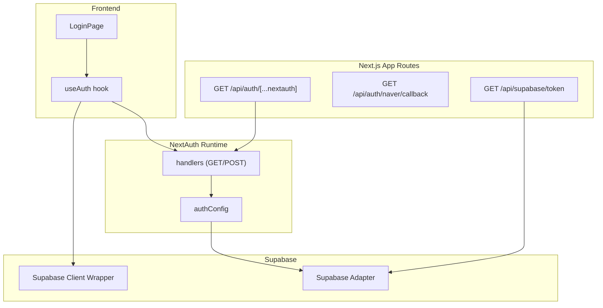
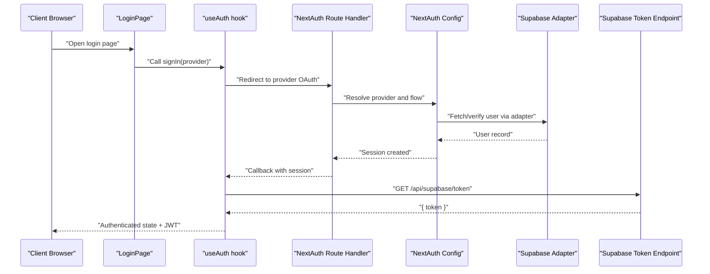
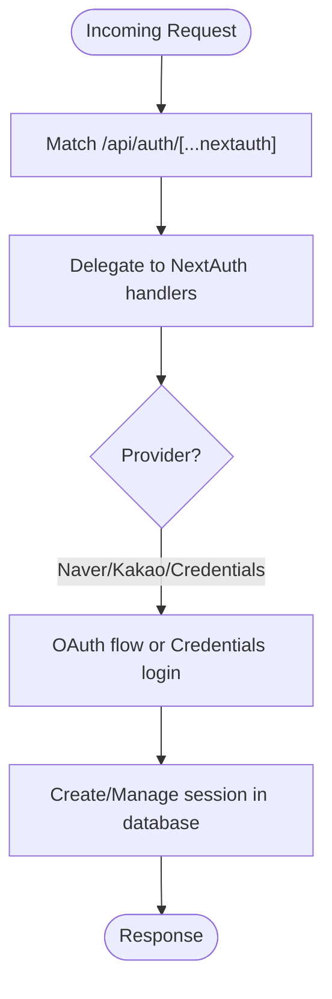
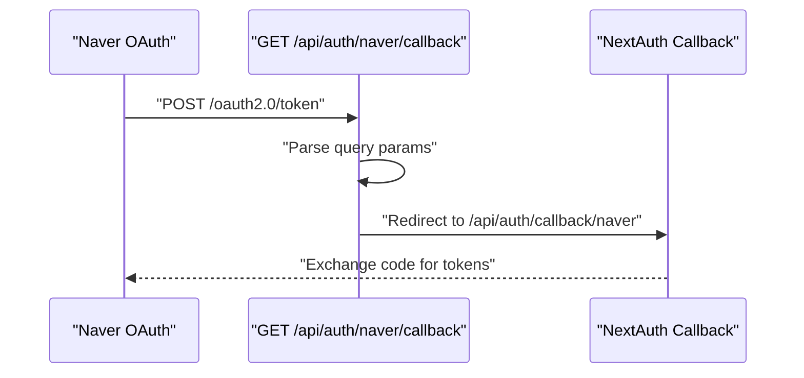
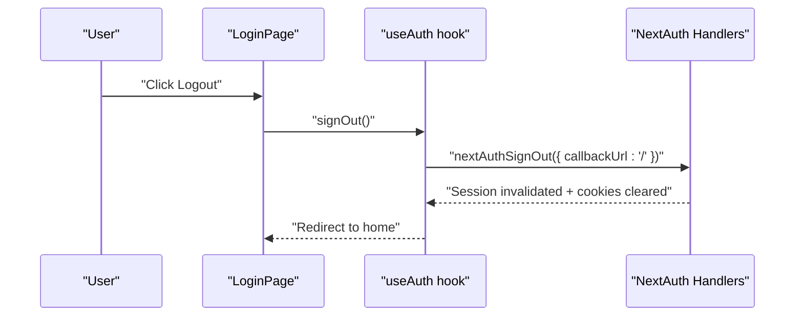
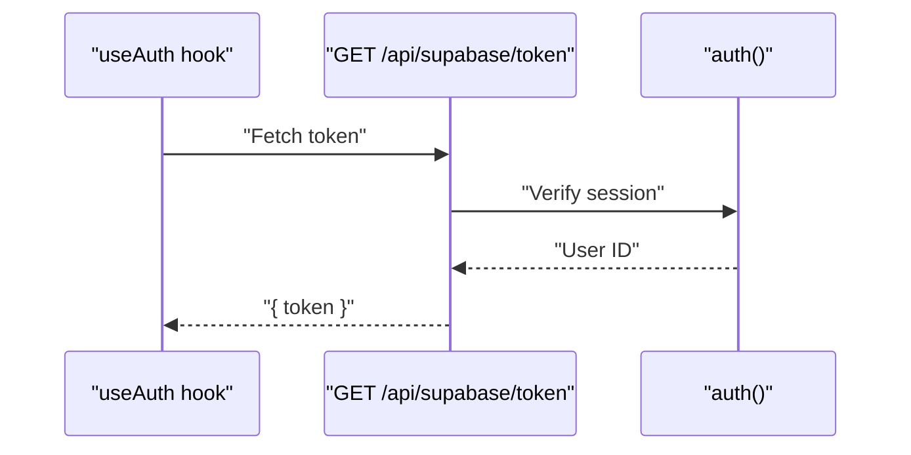
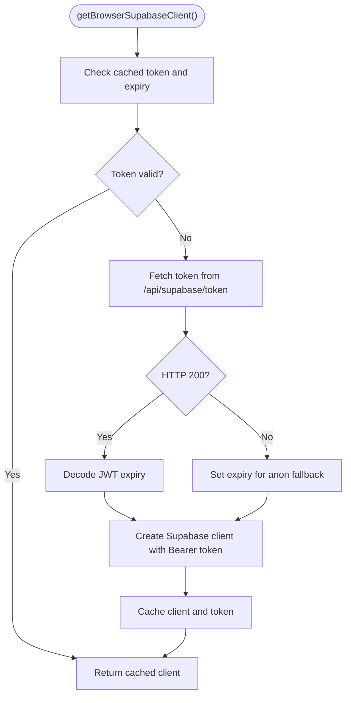
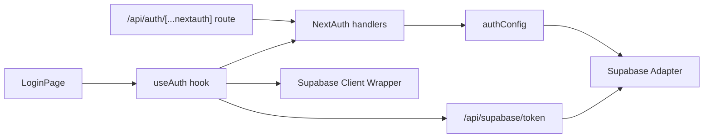

# Authentication Endpoints

<cite>
**Referenced Files in This Document**
- [src/app/api/auth/[...nextauth]/route.ts](file://src/app/api/auth/[...nextauth]/route.ts)
- [src/app/api/auth/naver/callback/route.ts](file://src/app/api/auth/naver/callback/route.ts)
- [src/auth.ts](file://src/auth.ts)
- [src/auth-config.ts](file://src/auth-config.ts)
- [src/hooks/useAuth.ts](file://src/hooks/useAuth.ts)
- [src/app/login/LoginPage.tsx](file://src/app/login/LoginPage.tsx)
- [src/types/next-auth.d.ts](file://src/types/next-auth.d.ts)
- [src/app/api/supabase/token/route.ts](file://src/app/api/supabase/token/route.ts)
- [src/lib/supabase/client.ts](file://src/lib/supabase/client.ts)
</cite>

## Table of Contents
1. [Introduction](#introduction)
2. [Project Structure](#project-structure)
3. [Core Components](#core-components)
4. [Architecture Overview](#architecture-overview)
5. [Detailed Component Analysis](#detailed-component-analysis)
6. [Dependency Analysis](#dependency-analysis)
7. [Performance Considerations](#performance-considerations)
8. [Troubleshooting Guide](#troubleshooting-guide)
9. [Conclusion](#conclusion)

## Introduction
This document describes the authentication system endpoints and flows used by the application. It focuses on:
- NextAuth.js integration via the dynamic route handler for OAuth provider callbacks and session management
- The Naver OAuth callback redirection endpoint
- Session termination and cookie clearing via the frontend sign-out flow
- Request/response schemas for authentication tokens, user session data, and provider-specific parameters
- OAuth flow patterns, state management, and CSRF protection
- Examples of successful authentication, error handling for failed logins, and session refresh mechanisms
- Security considerations, token expiration handling, and multi-provider authentication support

## Project Structure
The authentication system is implemented using NextAuth.js with Supabase as the adapter. The key files are:
- Dynamic NextAuth route handler exposing GET/POST for all providers
- Provider-specific callback redirection for Naver
- Frontend hooks for session and profile management
- Supabase JWT generation endpoint for browser clients
- Supabase client wrapper for token caching and expiry handling

**Diagram sources**
- [src/app/api/auth/[...nextauth]/route.ts](file://src/app/api/auth/[...nextauth]/route.ts#L1-L4)
- [src/app/api/auth/naver/callback/route.ts](file://src/app/api/auth/naver/callback/route.ts#L1-L10)
- [src/auth.ts](file://src/auth.ts#L1-L5)
- [src/auth-config.ts](file://src/auth-config.ts#L1-L227)
- [src/hooks/useAuth.ts](file://src/hooks/useAuth.ts#L1-L55)
- [src/app/login/LoginPage.tsx](file://src/app/login/LoginPage.tsx#L1-L155)
- [src/app/api/supabase/token/route.ts](file://src/app/api/supabase/token/route.ts#L1-L16)
- [src/lib/supabase/client.ts](file://src/lib/supabase/client.ts#L1-L85)

**Section sources**
- [src/app/api/auth/[...nextauth]/route.ts](file://src/app/api/auth/[...nextauth]/route.ts#L1-L4)
- [src/app/api/auth/naver/callback/route.ts](file://src/app/api/auth/naver/callback/route.ts#L1-L10)
- [src/auth.ts](file://src/auth.ts#L1-L5)
- [src/auth-config.ts](file://src/auth-config.ts#L1-L227)
- [src/hooks/useAuth.ts](file://src/hooks/useAuth.ts#L1-L55)
- [src/app/login/LoginPage.tsx](file://src/app/login/LoginPage.tsx#L1-L155)
- [src/app/api/supabase/token/route.ts](file://src/app/api/supabase/token/route.ts#L1-L16)
- [src/lib/supabase/client.ts](file://src/lib/supabase/client.ts#L1-L85)

## Core Components
- NextAuth dynamic route handler: Exposes GET/POST for all configured providers and delegates to NextAuth handlers.
- Naver callback redirection: Redirects incoming Naver callback requests to NextAuth’s callback endpoint.
- NextAuth configuration: Defines providers (Naver, Kakao, Credentials), adapter (Supabase), session strategy, and callbacks for profile upsert and session augmentation.
- Frontend authentication hook: Provides session, profile, sign-out, and profile refresh utilities.
- Supabase token endpoint: Generates a signed JWT for browser clients after verifying the NextAuth session.
- Supabase client wrapper: Manages token caching, expiry decoding, and client initialization.

**Section sources**
- [src/app/api/auth/[...nextauth]/route.ts](file://src/app/api/auth/[...nextauth]/route.ts#L1-L4)
- [src/app/api/auth/naver/callback/route.ts](file://src/app/api/auth/naver/callback/route.ts#L1-L10)
- [src/auth.ts](file://src/auth.ts#L1-L5)
- [src/auth-config.ts](file://src/auth-config.ts#L1-L227)
- [src/hooks/useAuth.ts](file://src/hooks/useAuth.ts#L1-L55)
- [src/app/api/supabase/token/route.ts](file://src/app/api/supabase/token/route.ts#L1-L16)
- [src/lib/supabase/client.ts](file://src/lib/supabase/client.ts#L1-L85)

## Architecture Overview
The authentication architecture integrates NextAuth.js with Supabase for database-backed sessions and user profiles. Providers (Naver, Kakao, Credentials) are configured in NextAuth. The frontend uses NextAuth React hooks to manage session state and profile data. A dedicated endpoint generates a Supabase JWT for browser-side Supabase client usage.

**Diagram sources**
- [src/app/login/LoginPage.tsx](file://src/app/login/LoginPage.tsx#L1-L155)
- [src/hooks/useAuth.ts](file://src/hooks/useAuth.ts#L1-L55)
- [src/app/api/auth/[...nextauth]/route.ts](file://src/app/api/auth/[...nextauth]/route.ts#L1-L4)
- [src/auth.ts](file://src/auth.ts#L1-L5)
- [src/auth-config.ts](file://src/auth-config.ts#L1-L227)
- [src/app/api/supabase/token/route.ts](file://src/app/api/supabase/token/route.ts#L1-L16)

## Detailed Component Analysis

### GET /api/auth/[...nextauth]
- Purpose: Dynamic route handler for NextAuth.js. Exposes GET/POST to handle OAuth provider callbacks and session management.
- Behavior:
  - Delegates all routing to NextAuth handlers.
  - Supports all configured providers (Naver, Kakao, Credentials).
  - Uses database-backed sessions via Supabase adapter.
- Integration:
  - Imports handlers from the NextAuth runtime module.
  - Relies on NextAuth configuration for provider settings, callbacks, and session strategy.

**Diagram sources**
- [src/app/api/auth/[...nextauth]/route.ts](file://src/app/api/auth/[...nextauth]/route.ts#L1-L4)
- [src/auth.ts](file://src/auth.ts#L1-L5)
- [src/auth-config.ts](file://src/auth-config.ts#L1-L227)

**Section sources**
- [src/app/api/auth/[...nextauth]/route.ts](file://src/app/api/auth/[...nextauth]/route.ts#L1-L4)
- [src/auth.ts](file://src/auth.ts#L1-L5)
- [src/auth-config.ts](file://src/auth-config.ts#L1-L227)

### GET /api/auth/naver/callback
- Purpose: Redirects incoming Naver OAuth callback requests to NextAuth’s standardized callback endpoint.
- Behavior:
  - Extracts query parameters from the request URL.
  - Constructs a redirect URL to NextAuth’s Naver callback route.
  - Returns a 302 redirect response.
- Notes:
  - Ensures provider-specific callback URLs are normalized to NextAuth’s expected pattern.

**Diagram sources**
- [src/app/api/auth/naver/callback/route.ts](file://src/app/api/auth/naver/callback/route.ts#L1-L10)

**Section sources**
- [src/app/api/auth/naver/callback/route.ts](file://src/app/api/auth/naver/callback/route.ts#L1-L10)

### POST /api/auth/logout (via frontend)
- Purpose: Terminates the current session and clears cookies.
- Implementation:
  - Frontend uses NextAuth React signOut with a callback URL.
  - The hook clears local queries and invokes NextAuth’s signOut.
- Outcome:
  - NextAuth invalidates the session and clears cookies on the client.
  - The backend does not require a separate logout endpoint because NextAuth handles session termination server-side.

**Diagram sources**
- [src/app/login/LoginPage.tsx](file://src/app/login/LoginPage.tsx#L1-L155)
- [src/hooks/useAuth.ts](file://src/hooks/useAuth.ts#L1-L55)
- [src/auth.ts](file://src/auth.ts#L1-L5)

**Section sources**
- [src/app/login/LoginPage.tsx](file://src/app/login/LoginPage.tsx#L1-L155)
- [src/hooks/useAuth.ts](file://src/hooks/useAuth.ts#L1-L55)
- [src/auth.ts](file://src/auth.ts#L1-L5)

### GET /api/supabase/token
- Purpose: Generates a signed Supabase JWT for the authenticated user.
- Behavior:
  - Verifies the NextAuth session.
  - Creates a JWT scoped to the user ID.
  - Returns the token to the caller.
- Notes:
  - Used by the browser Supabase client wrapper to initialize authenticated clients.

**Diagram sources**
- [src/app/api/supabase/token/route.ts](file://src/app/api/supabase/token/route.ts#L1-L16)
- [src/auth.ts](file://src/auth.ts#L1-L5)

**Section sources**
- [src/app/api/supabase/token/route.ts](file://src/app/api/supabase/token/route.ts#L1-L16)
- [src/auth.ts](file://src/auth.ts#L1-L5)

### Supabase Client Wrapper (Browser)
- Purpose: Manage token caching and expiry, and initialize a Supabase client with an Authorization header when available.
- Behavior:
  - Fetches a fresh token from the token endpoint when needed.
  - Decodes JWT expiry to schedule refreshes.
  - Re-creates the client when the token changes.

**Diagram sources**
- [src/lib/supabase/client.ts](file://src/lib/supabase/client.ts#L1-L85)
- [src/app/api/supabase/token/route.ts](file://src/app/api/supabase/token/route.ts#L1-L16)

**Section sources**
- [src/lib/supabase/client.ts](file://src/lib/supabase/client.ts#L1-L85)
- [src/app/api/supabase/token/route.ts](file://src/app/api/supabase/token/route.ts#L1-L16)

## Dependency Analysis
- NextAuth dynamic route handler depends on the NextAuth runtime module.
- NextAuth configuration defines providers, adapter, session strategy, and callbacks.
- Frontend hooks depend on NextAuth React for session state and on the Supabase token endpoint for JWT generation.
- Supabase client wrapper depends on the token endpoint and NextAuth session verification.

**Diagram sources**
- [src/app/api/auth/[...nextauth]/route.ts](file://src/app/api/auth/[...nextauth]/route.ts#L1-L4)
- [src/auth.ts](file://src/auth.ts#L1-L5)
- [src/auth-config.ts](file://src/auth-config.ts#L1-L227)
- [src/app/login/LoginPage.tsx](file://src/app/login/LoginPage.tsx#L1-L155)
- [src/hooks/useAuth.ts](file://src/hooks/useAuth.ts#L1-L55)
- [src/app/api/supabase/token/route.ts](file://src/app/api/supabase/token/route.ts#L1-L16)
- [src/lib/supabase/client.ts](file://src/lib/supabase/client.ts#L1-L85)

**Section sources**
- [src/app/api/auth/[...nextauth]/route.ts](file://src/app/api/auth/[...nextauth]/route.ts#L1-L4)
- [src/auth.ts](file://src/auth.ts#L1-L5)
- [src/auth-config.ts](file://src/auth-config.ts#L1-L227)
- [src/app/login/LoginPage.tsx](file://src/app/login/LoginPage.tsx#L1-L155)
- [src/hooks/useAuth.ts](file://src/hooks/useAuth.ts#L1-L55)
- [src/app/api/supabase/token/route.ts](file://src/app/api/supabase/token/route.ts#L1-L16)
- [src/lib/supabase/client.ts](file://src/lib/supabase/client.ts#L1-L85)

## Performance Considerations
- Session strategy: Database-backed sessions reduce memory overhead and enable centralized session management.
- Token caching: The Supabase client wrapper caches tokens and decodes expiry to avoid frequent re-fetches.
- Minimal round trips: NextAuth handles provider flows server-side; the frontend only needs the token endpoint for JWT generation.

[No sources needed since this section provides general guidance]

## Troubleshooting Guide
- Unauthorized token request:
  - The token endpoint returns a 401 error when there is no authenticated user session.
  - Ensure the NextAuth session is established before calling the token endpoint.
- Provider login failures:
  - The frontend login page displays errors returned by NextAuth and redirects to provider authorization.
  - Verify provider credentials and scopes in the NextAuth configuration.
- Session not updating:
  - Use the frontend hook’s profile refresh mechanism to update cached profile data after authentication.
- Logout not clearing cookies:
  - Confirm the frontend invokes NextAuth’s signOut with a callback URL to trigger session invalidation.

**Section sources**
- [src/app/api/supabase/token/route.ts](file://src/app/api/supabase/token/route.ts#L1-L16)
- [src/app/login/LoginPage.tsx](file://src/app/login/LoginPage.tsx#L1-L155)
- [src/hooks/useAuth.ts](file://src/hooks/useAuth.ts#L1-L55)
- [src/auth-config.ts](file://src/auth-config.ts#L1-L227)

## Conclusion
The authentication system leverages NextAuth.js with Supabase for robust, database-backed sessions and multi-provider OAuth support. The dynamic route handler centralizes provider flows, while the Naver callback endpoint normalizes provider-specific URLs. The frontend integrates seamlessly with NextAuth hooks and a token endpoint to manage sessions and Supabase client initialization. Security is enforced through CSRF protection and session management, with clear error handling and logout behavior.

[No sources needed since this section summarizes without analyzing specific files]