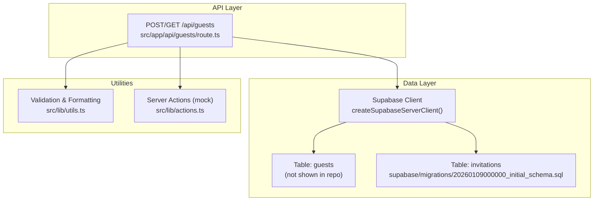
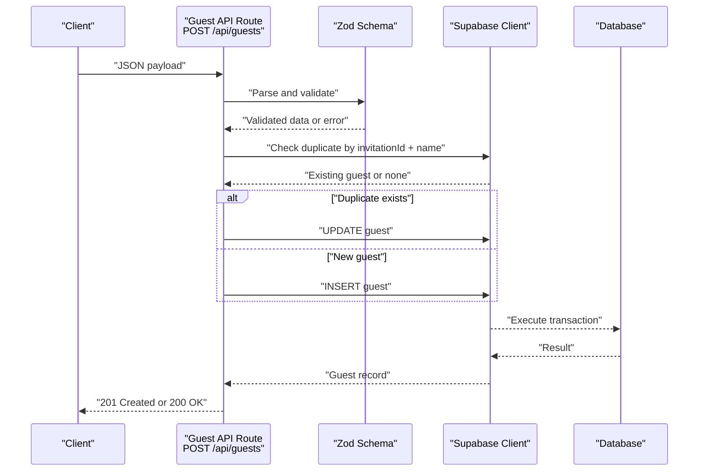
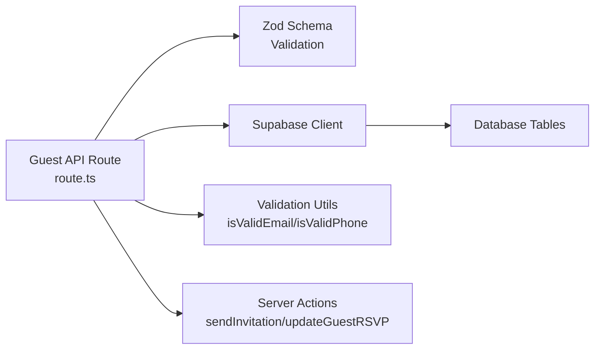

# Guest Management

<cite>
**Referenced Files in This Document**
- [route.ts](file://src/app/api/guests/route.ts)
- [utils.ts](file://src/lib/utils.ts)
- [actions.ts](file://src/lib/actions.ts)
- [services.ts](file://src/lib/services.ts)
- [invitationService.ts](file://src/services/invitationService.ts)
- [initial_schema.sql](file://supabase/migrations/20260109000000_initial_schema.sql)
- [update_policies.sql](file://supabase/migrations/20260109000001_update_policies.sql)
</cite>

## Table of Contents
1. [Introduction](#introduction)
2. [Project Structure](#project-structure)
3. [Core Components](#core-components)
4. [Architecture Overview](#architecture-overview)
5. [Detailed Component Analysis](#detailed-component-analysis)
6. [Dependency Analysis](#dependency-analysis)
7. [Performance Considerations](#performance-considerations)
8. [Troubleshooting Guide](#troubleshooting-guide)
9. [Conclusion](#conclusion)
10. [Appendices](#appendices)

## Introduction
This document provides comprehensive API documentation for the guest management endpoints that power guest registration, RSVP tracking, and group management for wedding invitations. It covers:
- POST /api/guests: Add new guests to invitations with RSVP details and contact information
- GET /api/guests: Retrieve guest lists filtered by invitation ID
- PUT /api/guests: Update guest information and RSVP responses
- Request/response schemas, validation rules for email addresses and phone numbers
- Bulk operations support
- Guest invitation workflows, confirmation emails, and automated reminders
- Examples of guest registration, RSVP tracking, and group management
- Data privacy considerations, guest list export capabilities, and duplicate detection mechanisms

## Project Structure
The guest management functionality is implemented as a Next.js App Router API route backed by Supabase. Supporting utilities provide validation and formatting for phone numbers and emails. The database schema defines the invitations table and policies for row-level security.

**Diagram sources**
- [route.ts](file://src/app/api/guests/route.ts#L1-L123)
- [initial_schema.sql](file://supabase/migrations/20260109000000_initial_schema.sql#L1-L52)
- [utils.ts](file://src/lib/utils.ts#L54-L85)
- [actions.ts](file://src/lib/actions.ts#L70-L112)

**Section sources**
- [route.ts](file://src/app/api/guests/route.ts#L1-L123)
- [initial_schema.sql](file://supabase/migrations/20260109000000_initial_schema.sql#L1-L52)

## Core Components
- Guest API Route: Implements POST, GET, and PUT endpoints for guest management with Zod validation and Supabase integration.
- Validation Utilities: Provides email and phone number validation and formatting helpers.
- Server Actions: Includes mock implementations for sending invitations and updating guest RSVPs.
- Services: Offers cached guest list retrieval and invitation-related services.

Key responsibilities:
- Validate incoming guest data and enforce business rules
- Detect duplicates by invitation ID and guest name
- Persist guest records and return structured responses
- Support filtering by invitation ID for retrieval
- Provide mock workflows for email dispatch and RSVP updates

**Section sources**
- [route.ts](file://src/app/api/guests/route.ts#L6-L13)
- [utils.ts](file://src/lib/utils.ts#L54-L85)
- [actions.ts](file://src/lib/actions.ts#L70-L112)
- [services.ts](file://src/lib/services.ts#L51-L53)

## Architecture Overview
The guest management API follows a layered architecture:
- HTTP handlers validate requests and delegate to Supabase
- Zod schemas define strict request/response contracts
- Supabase handles persistence and row-level security policies
- Utilities provide cross-cutting concerns like validation and formatting
- Server actions encapsulate side effects such as email dispatch

**Diagram sources**
- [route.ts](file://src/app/api/guests/route.ts#L15-L86)

## Detailed Component Analysis

### POST /api/guests
Purpose: Add a new guest to an invitation or update an existing guest's RSVP details.

Request schema:
- invitationId: UUID string (required)
- name: Non-empty string (required)
- attending: Boolean (required)
- numberOfGuests: Integer between 0 and 10 (required)
- dietaryRestrictions: Array of strings (optional)
- specialRequests: String (optional)

Response schema:
- success: Boolean
- data: Guest object with created/updated timestamps

Behavior:
- Validates payload using Zod schema
- Checks for existing guest by invitationId and name
- Updates existing guest if found
- Inserts new guest otherwise
- Returns appropriate HTTP status codes

Validation rules:
- invitationId must be a valid UUID
- name must be non-empty
- numberOfGuests must be within range
- Email and phone number validation are available via utilities but not enforced in this endpoint

Bulk operations:
- Not supported in current implementation

**Section sources**
- [route.ts](file://src/app/api/guests/route.ts#L6-L13)
- [route.ts](file://src/app/api/guests/route.ts#L15-L86)

### GET /api/guests
Purpose: Retrieve guest list for a given invitation ID.

Query parameters:
- invitationId: UUID string (required)

Response schema:
- success: Boolean
- data: Array of guest objects ordered by creation time (newest first)

Behavior:
- Requires invitationId query parameter
- Fetches all guests associated with the invitation
- Orders results by created_at descending

Filtering:
- Filters by invitation_id only

**Section sources**
- [route.ts](file://src/app/api/guests/route.ts#L88-L123)

### PUT /api/guests
Note: The current implementation does not expose a PUT endpoint for guest updates. The existing route only supports POST and GET. To enable updates, add a PUT handler similar to POST with appropriate validation and update logic.

Current limitations:
- No explicit PUT handler
- Update logic would mirror POST duplicate detection and update flow

Recommendation:
- Add PUT /api/guests with request schema supporting partial updates (attending, numberOfGuests, dietaryRestrictions, specialRequests)

**Section sources**
- [route.ts](file://src/app/api/guests/route.ts#L1-L123)

### Request/Response Schemas
Request schemas:
- POST /api/guests: Zod object with fields defined above
- GET /api/guests: Query parameter invitationId (UUID)

Response schemas:
- Success: { success: true, data: Guest | Guest[] }
- Error: { error: string, details?: any }

Guest object fields:
- invitation_id: UUID
- name: String
- attending: Boolean
- number_of_guests: Number
- dietary_restrictions: String[]
- special_requests: String
- created_at: Timestamp
- updated_at: Timestamp

**Section sources**
- [route.ts](file://src/app/api/guests/route.ts#L6-L13)
- [route.ts](file://src/app/api/guests/route.ts#L101-L115)

### Validation Rules
Email validation:
- Pattern: Non-empty string with @ and domain
- Function: isValidEmail

Phone number validation:
- Pattern: Starts with +82 or 0, length 8-11 digits
- Function: isValidPhone
- Formatting helper: formatPhoneNumber for Korean phone numbers

Usage in guest management:
- Current endpoint does not require email or phone fields
- These utilities can be integrated when extending the schema

**Section sources**
- [utils.ts](file://src/lib/utils.ts#L54-L85)

### Duplicate Detection Mechanism
Mechanism:
- Query guests by invitation_id and name
- If found, update existing record
- If not found, insert new record

Benefits:
- Prevents duplicate entries per invitation and name
- Maintains single-source-of-truth for RSVP status

**Section sources**
- [route.ts](file://src/app/api/guests/route.ts#L22-L50)

### Guest Invitation Workflows
Workflows:
- Send invitations: Mock action sends invitations to guest emails
- Update RSVP: Mock action updates guest RSVP status
- Reminder automation: Not implemented in current codebase

Mock implementations:
- sendInvitation: Accepts invitationId and guestEmails array
- updateGuestRSVP: Accepts guestId and RSVP data object

**Section sources**
- [actions.ts](file://src/lib/actions.ts#L70-L112)

### Guest Registration Examples
Example scenarios:
- New guest registration: POST /api/guests with invitationId, name, attending, numberOfGuests
- Existing guest update: POST /api/guests with same invitationId and name to update RSVP
- Group management: Submit multiple registrations for the same invitationId with different names

Note: Bulk submission is not implemented; submit one guest per request.

**Section sources**
- [route.ts](file://src/app/api/guests/route.ts#L15-L86)

### RSVP Tracking Examples
Tracking features:
- Filter guests by invitationId to see all responses
- Monitor attending status and guest counts
- Review dietary restrictions and special requests

Integration points:
- GET /api/guests for listing
- Mock updateGuestRSVP for status changes

**Section sources**
- [route.ts](file://src/app/api/guests/route.ts#L88-L123)
- [actions.ts](file://src/lib/actions.ts#L88-L112)

### Data Privacy Considerations
Privacy controls:
- Row-level security policies on invitations table
- Authenticated access policies for managing invitations
- Public read access for viewing invitations

Recommendations:
- Restrict guest data access to authorized users
- Consider GDPR-compliant deletion and anonymization
- Log access and modifications for audit trails

**Section sources**
- [initial_schema.sql](file://supabase/migrations/20260109000000_initial_schema.sql#L13-L25)
- [update_policies.sql](file://supabase/migrations/20260109000001_update_policies.sql#L4-L9)

### Guest List Export Capabilities
Current state:
- No built-in export endpoint in the guest API
- Invitation summary service available for admin use

Recommendations:
- Add CSV/Excel export endpoint for guest lists
- Include filters for status, dietary restrictions, and date ranges
- Implement rate limiting and user permissions

**Section sources**
- [services.ts](file://src/lib/services.ts#L51-L53)
- [invitationService.ts](file://src/services/invitationService.ts#L37-L44)

## Dependency Analysis
The guest API depends on:
- Supabase client for database operations
- Zod for request validation
- Validation utilities for optional field checks
- Server actions for side effects

**Diagram sources**
- [route.ts](file://src/app/api/guests/route.ts#L1-L123)
- [utils.ts](file://src/lib/utils.ts#L54-L85)
- [actions.ts](file://src/lib/actions.ts#L70-L112)

**Section sources**
- [route.ts](file://src/app/api/guests/route.ts#L1-L123)

## Performance Considerations
- Parallel loading: Use Promise.all for request parsing and Supabase client initialization
- Caching: Consider caching guest lists for frequently accessed invitations
- Pagination: Implement pagination for large guest lists
- Indexing: Ensure indexes on invitation_id and name for efficient lookups
- Batch operations: For bulk updates, process in smaller chunks to avoid timeouts

## Troubleshooting Guide
Common issues and resolutions:
- Validation errors: Ensure payload matches Zod schema; check invitationId format and numeric ranges
- Duplicate detection: If receiving unexpected updates, verify invitationId and name uniqueness
- Database errors: Check Supabase connection and row-level security policies
- Missing invitationId: GET /api/guests requires invitationId query parameter

Error handling:
- Validation failures return 400 with details
- Internal errors return 500 with generic messages
- Duplicates trigger update flow; verify updated_at timestamp reflects recent changes

**Section sources**
- [route.ts](file://src/app/api/guests/route.ts#L71-L85)
- [route.ts](file://src/app/api/guests/route.ts#L93-L98)

## Conclusion
The guest management API provides a robust foundation for handling guest registrations, RSVP tracking, and group management. With Zod validation, duplicate detection, and Supabase-backed persistence, it ensures data integrity and scalability. Future enhancements should include a PUT endpoint for updates, export capabilities, and automated reminder workflows to complete the guest invitation lifecycle.

## Appendices

### API Definitions
- POST /api/guests
  - Request: Guest registration/update payload
  - Response: Success indicator and guest data
  - Status: 201 Created (new), 200 OK (updated), 400 Bad Request, 500 Internal Server Error

- GET /api/guests
  - Query: invitationId (UUID)
  - Response: Success indicator and guest list
  - Status: 200 OK, 400 Bad Request, 500 Internal Server Error

- PUT /api/guests (recommended)
  - Request: Partial guest update payload
  - Response: Success indicator and updated guest data
  - Status: 200 OK, 400 Bad Request, 500 Internal Server Error

### Validation Utilities Reference
- isValidEmail: Validates email format
- isValidPhone: Validates phone number format
- formatPhoneNumber: Formats Korean phone numbers

**Section sources**
- [utils.ts](file://src/lib/utils.ts#L54-L85)