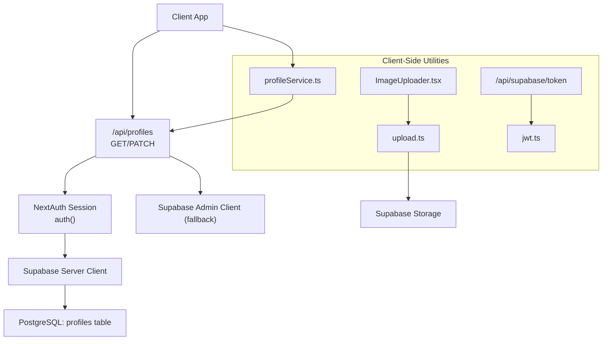
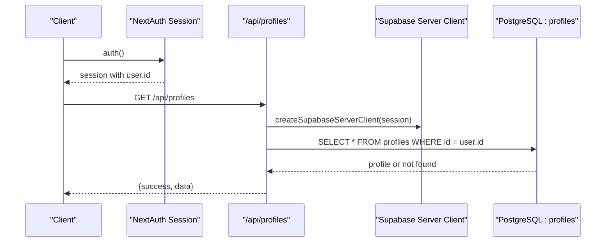
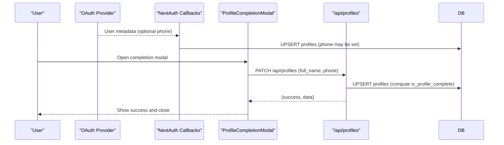
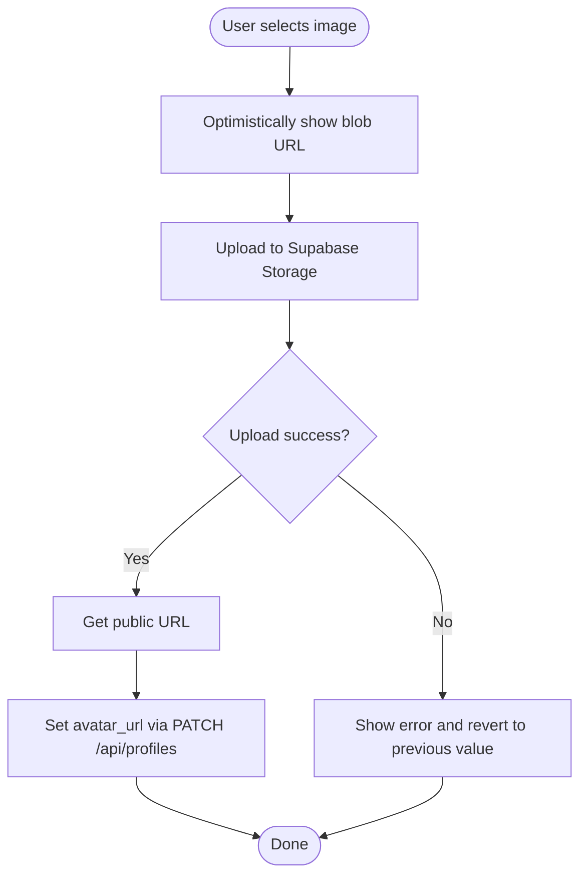
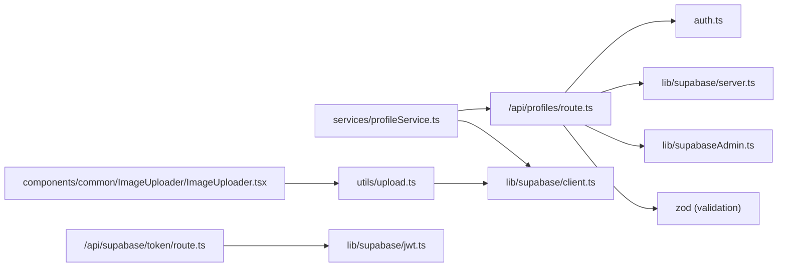
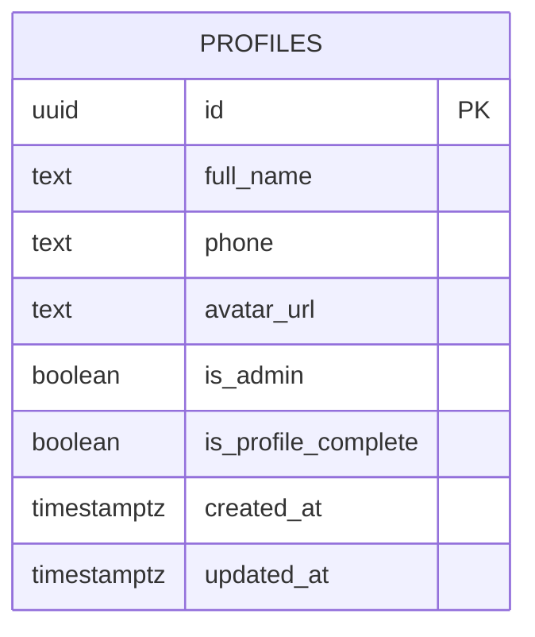
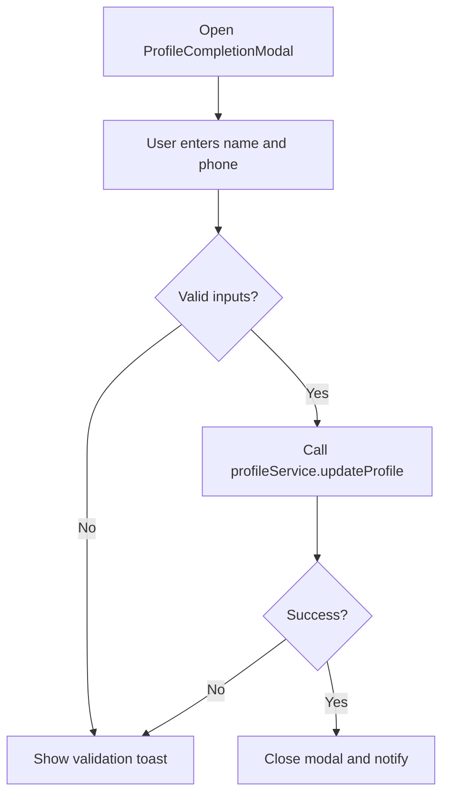

# Profile Services

<cite>
**Referenced Files in This Document**
- [src/app/api/profiles/route.ts](file://src/app/api/profiles/route.ts)
- [src/services/profileService.ts](file://src/services/profileService.ts)
- [src/lib/supabase/client.ts](file://src/lib/supabase/client.ts)
- [src/lib/supabase/jwt.ts](file://src/lib/supabase/jwt.ts)
- [src/app/api/supabase/token/route.ts](file://src/app/api/supabase/token/route.ts)
- [src/auth.ts](file://src/auth.ts)
- [src/auth-config.ts](file://src/auth-config.ts)
- [src/hooks/useAuth.ts](file://src/hooks/useAuth.ts)
- [src/components/common/ImageUploader/ImageUploader.tsx](file://src/components/common/ImageUploader/ImageUploader.tsx)
- [src/utils/upload.ts](file://src/utils/upload.ts)
- [supabase/migrations/20260114063537_add_profiles_and_approval_requests.sql](file://supabase/migrations/20260114063537_add_profiles_and_approval_requests.sql)
- [src/components/auth/ProfileCompletionModal.tsx](file://src/components/auth/ProfileCompletionModal.tsx)
- [src/app/mypage/MyPageClient.tsx](file://src/app/mypage/MyPageClient.tsx)
- [src/app/builder/page.tsx](file://src/app/builder/page.tsx)
</cite>

## Table of Contents
1. [Introduction](#introduction)
2. [Project Structure](#project-structure)
3. [Core Components](#core-components)
4. [Architecture Overview](#architecture-overview)
5. [Detailed Component Analysis](#detailed-component-analysis)
6. [Dependency Analysis](#dependency-analysis)
7. [Performance Considerations](#performance-considerations)
8. [Troubleshooting Guide](#troubleshooting-guide)
9. [Conclusion](#conclusion)
10. [Appendices](#appendices)

## Introduction
This document provides API documentation for profile management endpoints focused on retrieving and updating user profile information. It covers:
- GET /api/profiles: Retrieve the authenticated user’s profile
- PATCH /api/profiles: Update profile information including personal details and avatar URL
- Profile completion flow during first-time setup
- Request/response schemas, validation rules, and profile picture upload handling
- Visibility settings, privacy controls, and data protection measures
- Examples of profile updates, verification workflows, and completion status tracking
- Cross-device synchronization and account linking capabilities

## Project Structure
Profile services are implemented as Next.js App Router API routes backed by Supabase. Authentication is handled via NextAuth with Supabase adapter, and profile data is stored in a dedicated profiles table with Row Level Security (RLS) policies.

**Diagram sources**
- [src/app/api/profiles/route.ts](file://src/app/api/profiles/route.ts#L1-L125)
- [src/services/profileService.ts](file://src/services/profileService.ts#L1-L101)
- [src/lib/supabase/client.ts](file://src/lib/supabase/client.ts#L1-L85)
- [src/lib/supabase/jwt.ts](file://src/lib/supabase/jwt.ts#L1-L15)
- [src/app/api/supabase/token/route.ts](file://src/app/api/supabase/token/route.ts#L1-L16)
- [src/components/common/ImageUploader/ImageUploader.tsx](file://src/components/common/ImageUploader/ImageUploader.tsx#L1-L199)
- [src/utils/upload.ts](file://src/utils/upload.ts#L1-L39)
- [supabase/migrations/20260114063537_add_profiles_and_approval_requests.sql](file://supabase/migrations/20260114063537_add_profiles_and_approval_requests.sql#L18-L36)

**Section sources**
- [src/app/api/profiles/route.ts](file://src/app/api/profiles/route.ts#L1-L125)
- [src/services/profileService.ts](file://src/services/profileService.ts#L1-L101)
- [src/lib/supabase/client.ts](file://src/lib/supabase/client.ts#L1-L85)
- [src/lib/supabase/jwt.ts](file://src/lib/supabase/jwt.ts#L1-L15)
- [src/app/api/supabase/token/route.ts](file://src/app/api/supabase/token/route.ts#L1-L16)
- [src/components/common/ImageUploader/ImageUploader.tsx](file://src/components/common/ImageUploader/ImageUploader.tsx#L1-L199)
- [src/utils/upload.ts](file://src/utils/upload.ts#L1-L39)
- [supabase/migrations/20260114063537_add_profiles_and_approval_requests.sql](file://supabase/migrations/20260114063537_add_profiles_and_approval_requests.sql#L18-L36)

## Core Components
- API Route: Implements GET and PATCH endpoints for profile retrieval and updates
- Profile Service: Provides typed client-side helpers to fetch and update profiles
- Authentication: NextAuth with Supabase adapter; session-based access control
- Supabase Client: Browser client with dynamic JWT injection for Supabase Storage and DB
- Image Upload: Client-side uploader that uploads to Supabase Storage and returns a public URL
- RLS Policies: Enforce per-user access and admin visibility

**Section sources**
- [src/app/api/profiles/route.ts](file://src/app/api/profiles/route.ts#L1-L125)
- [src/services/profileService.ts](file://src/services/profileService.ts#L1-L101)
- [src/auth.ts](file://src/auth.ts#L1-L5)
- [src/auth-config.ts](file://src/auth-config.ts#L1-L227)
- [src/lib/supabase/client.ts](file://src/lib/supabase/client.ts#L1-L85)
- [src/components/common/ImageUploader/ImageUploader.tsx](file://src/components/common/ImageUploader/ImageUploader.tsx#L1-L199)
- [src/utils/upload.ts](file://src/utils/upload.ts#L1-L39)
- [supabase/migrations/20260114063537_add_profiles_and_approval_requests.sql](file://supabase/migrations/20260114063537_add_profiles_and_approval_requests.sql#L44-L73)

## Architecture Overview
The profile service relies on NextAuth for session management and Supabase for storage and RLS enforcement. The browser client dynamically obtains a short-lived JWT to access Supabase resources.

**Diagram sources**
- [src/app/api/profiles/route.ts](file://src/app/api/profiles/route.ts#L14-L54)
- [src/lib/supabase/client.ts](file://src/lib/supabase/client.ts#L41-L84)
- [src/auth.ts](file://src/auth.ts#L1-L5)

## Detailed Component Analysis

### GET /api/profiles
- Purpose: Retrieve the authenticated user’s profile
- Authentication: Requires a valid NextAuth session; returns 401 if missing
- Behavior:
  - Uses server client to query the profiles table by user id
  - Returns null data if no record exists (not an error)
  - Returns internal server error on unexpected failures
- Response:
  - success: boolean
  - data: profile object or null

Validation and constraints:
- Request: No body required
- Response: Profile object with optional fields

**Section sources**
- [src/app/api/profiles/route.ts](file://src/app/api/profiles/route.ts#L13-L54)

### PATCH /api/profiles
- Purpose: Update profile information (personal details and avatar)
- Authentication: Requires a valid NextAuth session; returns 401 if missing
- Request body schema:
  - full_name: string, optional, min length 1 if provided
  - phone: string, optional, min length 1 if provided
  - avatar_url: string, optional, must be a valid URL if provided, can be null
- Behavior:
  - Validates request payload against schema
  - If either full_name or phone is not provided, loads current values to compute completion status
  - Computes is_profile_complete as true when both full_name and phone are truthy
  - Performs upsert with updated_at timestamp
- Response:
  - success: boolean
  - data: updated profile object

Validation and constraints:
- Required fields: none (all fields are optional)
- Completion logic: is_profile_complete computed server-side based on presence of full_name and phone

**Section sources**
- [src/app/api/profiles/route.ts](file://src/app/api/profiles/route.ts#L7-L11)
- [src/app/api/profiles/route.ts](file://src/app/api/profiles/route.ts#L56-L124)

### Profile Completion Workflow (First-Time Setup)
- Trigger: When a user logs in via OAuth, the backend attempts to populate profile fields (including phone and completion status) based on provider data
- Client flow: If profile is incomplete, a modal prompts the user to enter name and phone; submission triggers PATCH /api/profiles
- Completion criteria: Both full_name and phone must be present to mark is_profile_complete as true

**Diagram sources**
- [src/auth-config.ts](file://src/auth-config.ts#L154-L218)
- [src/components/auth/ProfileCompletionModal.tsx](file://src/components/auth/ProfileCompletionModal.tsx#L33-L62)
- [src/app/api/profiles/route.ts](file://src/app/api/profiles/route.ts#L56-L124)

**Section sources**
- [src/auth-config.ts](file://src/auth-config.ts#L154-L218)
- [src/components/auth/ProfileCompletionModal.tsx](file://src/components/auth/ProfileCompletionModal.tsx#L1-L108)
- [src/app/api/profiles/route.ts](file://src/app/api/profiles/route.ts#L56-L124)

### Profile Picture Upload Handling
- Client-side uploader:
  - Accepts an image file and optimistically previews a blob URL
  - Uploads to Supabase Storage under a configurable bucket and folder
  - On success, replaces the blob URL with the public URL
  - On failure, reverts to previous value and shows a toast
- Public URL assignment:
  - The returned public URL can be assigned to avatar_url via PATCH /api/profiles
- Storage path:
  - Bucket: images (default)
  - Folder: uploads (configurable)

**Diagram sources**
- [src/components/common/ImageUploader/ImageUploader.tsx](file://src/components/common/ImageUploader/ImageUploader.tsx#L43-L83)
- [src/utils/upload.ts](file://src/utils/upload.ts#L10-L38)
- [src/app/api/profiles/route.ts](file://src/app/api/profiles/route.ts#L10-L11)

**Section sources**
- [src/components/common/ImageUploader/ImageUploader.tsx](file://src/components/common/ImageUploader/ImageUploader.tsx#L1-L199)
- [src/utils/upload.ts](file://src/utils/upload.ts#L1-L39)

### Data Protection and Privacy Controls
- Row Level Security (RLS):
  - Users can view/update only their own profile
  - Insert policy allows authenticated users to create their profile via trigger
  - Admins can view all profiles
- Environment-driven JWT:
  - Short-lived JWT generated server-side for Supabase client usage
- Storage:
  - Images uploaded to Supabase Storage; public URL returned after successful upload

**Section sources**
- [supabase/migrations/20260114063537_add_profiles_and_approval_requests.sql](file://supabase/migrations/20260114063537_add_profiles_and_approval_requests.sql#L44-L73)
- [src/lib/supabase/jwt.ts](file://src/lib/supabase/jwt.ts#L1-L15)
- [src/app/api/supabase/token/route.ts](file://src/app/api/supabase/token/route.ts#L1-L16)

### Cross-Device Synchronization and Account Linking
- Synchronization:
  - Profile data is stored in Supabase; updates via PATCH propagate instantly across devices
- Account linking:
  - OAuth providers (Naver, Kakao) integrate with Supabase adapter
  - During sign-in, provider metadata is used to enrich the profile (including phone when available)
  - Admin credentials can create admin profiles automatically

**Section sources**
- [src/auth-config.ts](file://src/auth-config.ts#L31-L129)
- [src/auth-config.ts](file://src/auth-config.ts#L154-L218)

## Dependency Analysis

**Diagram sources**
- [src/app/api/profiles/route.ts](file://src/app/api/profiles/route.ts#L1-L5)
- [src/services/profileService.ts](file://src/services/profileService.ts#L1-L3)
- [src/lib/supabase/client.ts](file://src/lib/supabase/client.ts#L1-L11)
- [src/components/common/ImageUploader/ImageUploader.tsx](file://src/components/common/ImageUploader/ImageUploader.tsx#L57-L62)
- [src/utils/upload.ts](file://src/utils/upload.ts#L1-L2)
- [src/app/api/supabase/token/route.ts](file://src/app/api/supabase/token/route.ts#L1-L3)
- [src/lib/supabase/jwt.ts](file://src/lib/supabase/jwt.ts#L1-L3)

**Section sources**
- [src/app/api/profiles/route.ts](file://src/app/api/profiles/route.ts#L1-L125)
- [src/services/profileService.ts](file://src/services/profileService.ts#L1-L101)
- [src/lib/supabase/client.ts](file://src/lib/supabase/client.ts#L1-L85)
- [src/components/common/ImageUploader/ImageUploader.tsx](file://src/components/common/ImageUploader/ImageUploader.tsx#L1-L199)
- [src/utils/upload.ts](file://src/utils/upload.ts#L1-L39)
- [src/app/api/supabase/token/route.ts](file://src/app/api/supabase/token/route.ts#L1-L16)
- [src/lib/supabase/jwt.ts](file://src/lib/supabase/jwt.ts#L1-L15)

## Performance Considerations
- Minimal round-trips: GET and PATCH use server clients configured with session context
- Lazy token refresh: Browser Supabase client caches and refreshes JWTs based on expiry
- Optimistic UI: Image uploader updates immediately with blob URL while upload proceeds
- Stale-time caching: Client-side profile queries cache results briefly to reduce redundant fetches

[No sources needed since this section provides general guidance]

## Troubleshooting Guide
Common issues and resolutions:
- 401 Unauthorized on GET/PATCH:
  - Ensure the user is signed in and session is valid
  - Verify NextAuth configuration and cookies/session persistence
- PATCH validation errors:
  - full_name and phone must be non-empty strings when provided
  - avatar_url must be a valid URL or null
- Profile not found:
  - First-time users may not have a profile record yet; expect null data
- Upload failures:
  - Confirm Supabase Storage bucket permissions and network connectivity
  - Check toast messages for user feedback

**Section sources**
- [src/app/api/profiles/route.ts](file://src/app/api/profiles/route.ts#L18-L22)
- [src/app/api/profiles/route.ts](file://src/app/api/profiles/route.ts#L111-L116)
- [src/app/api/profiles/route.ts](file://src/app/api/profiles/route.ts#L36-L38)
- [src/components/common/ImageUploader/ImageUploader.tsx](file://src/components/common/ImageUploader/ImageUploader.tsx#L63-L72)

## Conclusion
The profile services provide a secure, schema-validated mechanism for retrieving and updating user profiles with robust OAuth integration, RLS policies, and client-side upload handling. Completion status tracking ensures a smooth first-time setup experience, while cross-device synchronization guarantees consistent user data across sessions.

[No sources needed since this section summarizes without analyzing specific files]

## Appendices

### API Definitions

- GET /api/profiles
  - Authentication: Required
  - Response: { success: boolean, data: Profile | null }
  - Notes: Returns null when no profile exists

- PATCH /api/profiles
  - Authentication: Required
  - Request body: { full_name?: string, phone?: string, avatar_url?: string }
  - Response: { success: boolean, data: Profile }

**Section sources**
- [src/app/api/profiles/route.ts](file://src/app/api/profiles/route.ts#L13-L54)
- [src/app/api/profiles/route.ts](file://src/app/api/profiles/route.ts#L56-L124)

### Data Models

**Diagram sources**
- [supabase/migrations/20260114063537_add_profiles_and_approval_requests.sql](file://supabase/migrations/20260114063537_add_profiles_and_approval_requests.sql#L18-L27)

### Client-Side Profile Service Methods

- getProfile(userId): Fetches profile with error resilience
- updateProfile(userId, updates): Sends PATCH /api/profiles
- isProfileComplete(userId): Computes completion from full_name and phone
- isAdmin(userId): Reads is_admin flag

**Section sources**
- [src/services/profileService.ts](file://src/services/profileService.ts#L22-L100)

### Client-Side Completion Modal Flow

**Diagram sources**
- [src/components/auth/ProfileCompletionModal.tsx](file://src/components/auth/ProfileCompletionModal.tsx#L33-L62)
- [src/services/profileService.ts](file://src/services/profileService.ts#L60-L81)

### Cross-Device Access Guard

- Builder page guards access until profile completion
- Redirects incomplete users to login

**Section sources**
- [src/app/builder/page.tsx](file://src/app/builder/page.tsx#L71-L76)