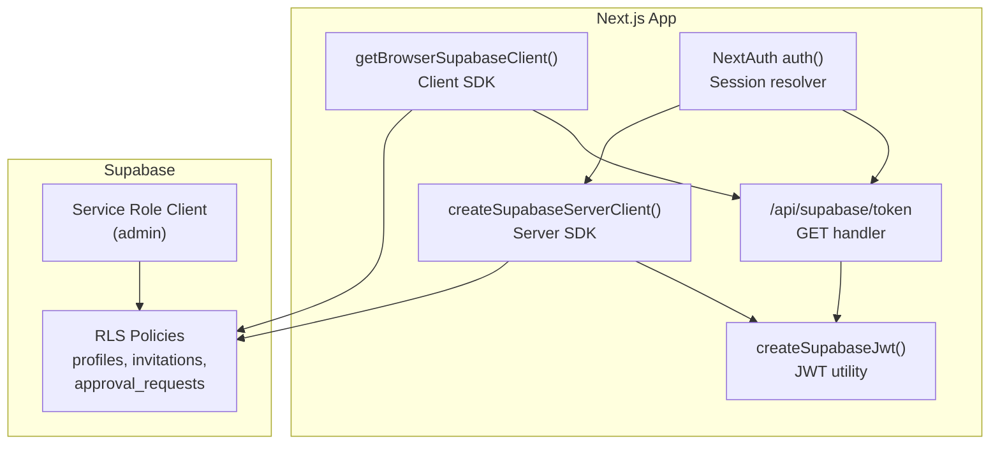
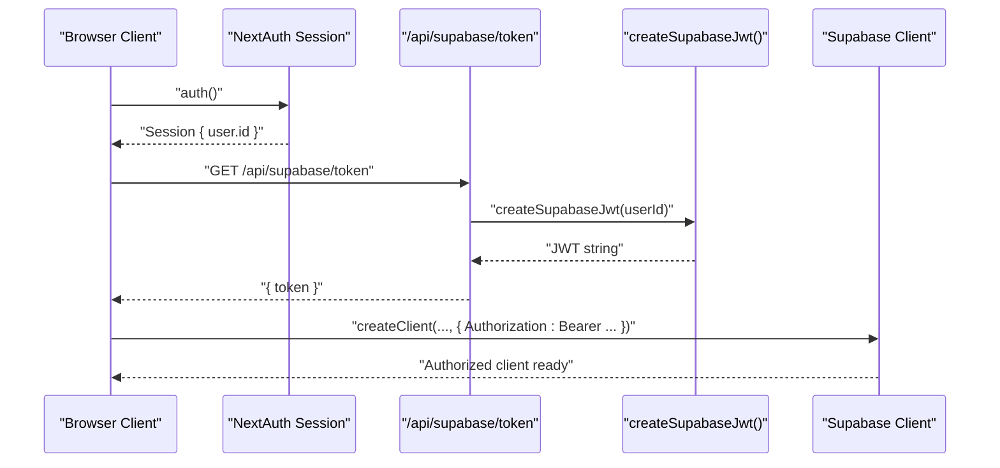
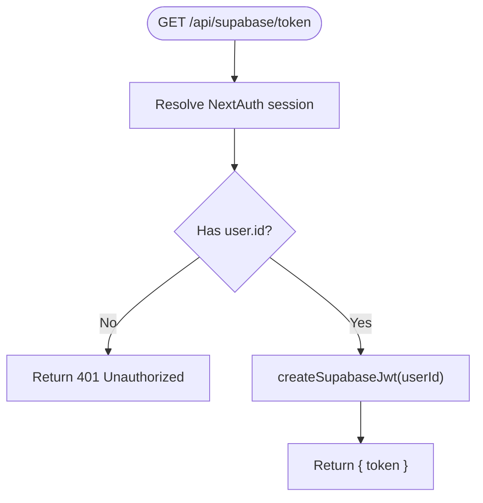
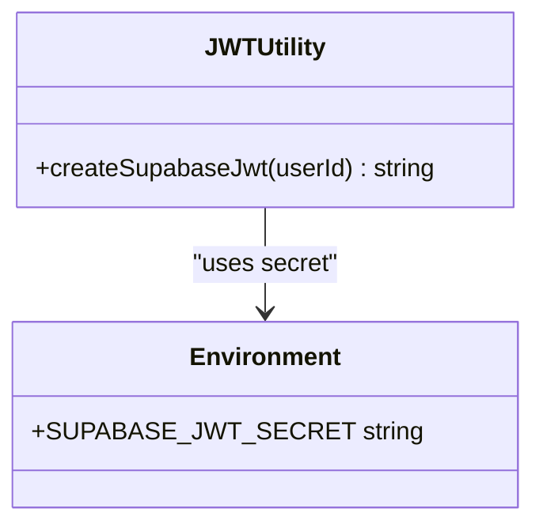
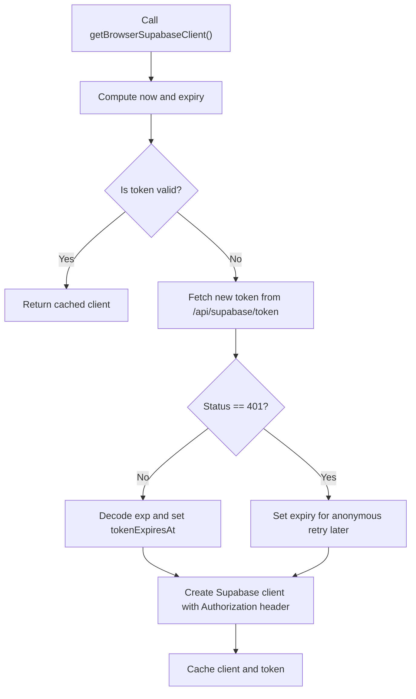
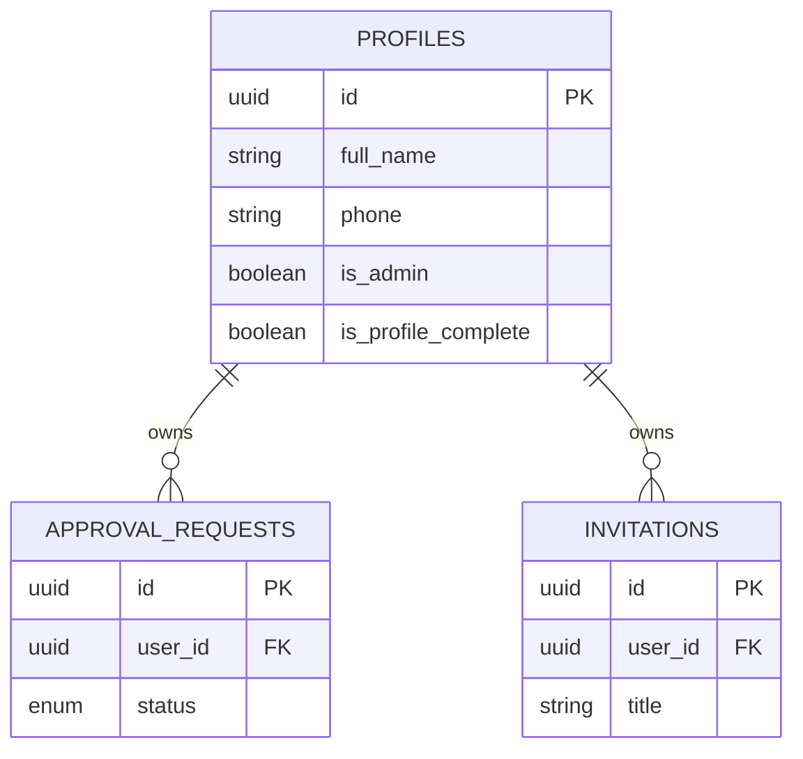
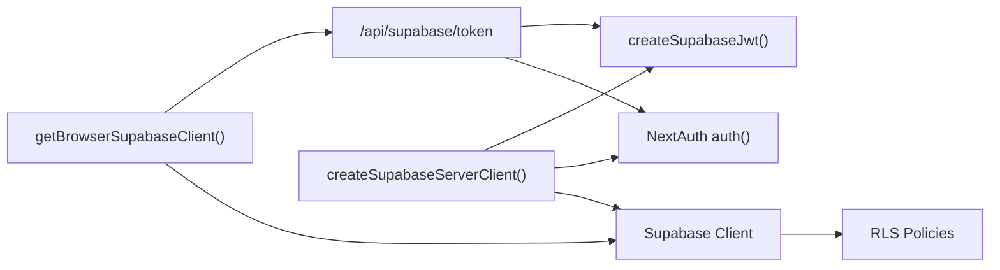

# Supabase Token Generation

<cite>
**Referenced Files in This Document**
- [route.ts](file://src/app/api/supabase/token/route.ts)
- [jwt.ts](file://src/lib/supabase/jwt.ts)
- [client.ts](file://src/lib/supabase/client.ts)
- [server.ts](file://src/lib/supabase/server.ts)
- [auth.ts](file://src/auth.ts)
- [auth-config.ts](file://src/auth-config.ts)
- [middleware.ts](file://middleware.ts)
- [useAuth.ts](file://src/hooks/useAuth.ts)
- [package.json](file://package.json)
- [env.ts](file://src/lib/env.ts)
- [supabaseAdmin.ts](file://src/lib/supabaseAdmin.ts)
- [20260114063537_add_profiles_and_approval_requests.sql](file://supabase/migrations/20260114063537_add_profiles_and_approval_requests.sql)
- [20260114090000_fix_admin_access_and_rls.sql](file://supabase/migrations/20260114090000_fix_admin_access_and_rls.sql)
- [20260114100000_fix_recursion_error.sql](file://supabase/migrations/20260114100000_fix_recursion_error.sql)
- [20260116000001_disable_rls_nextauth.sql](file://supabase/migrations/20260116000001_disable_rls_nextauth.sql)
</cite>

## Table of Contents
1. [Introduction](#introduction)
2. [Project Structure](#project-structure)
3. [Core Components](#core-components)
4. [Architecture Overview](#architecture-overview)
5. [Detailed Component Analysis](#detailed-component-analysis)
6. [Dependency Analysis](#dependency-analysis)
7. [Performance Considerations](#performance-considerations)
8. [Troubleshooting Guide](#troubleshooting-guide)
9. [Conclusion](#conclusion)
10. [Appendices](#appendices)

## Introduction
This document describes the Supabase token generation endpoint that enables clients to obtain short-lived JWTs for secure database access. It covers the POST /api/supabase/token endpoint behavior, request and response formats, security considerations, integration with Supabase authentication and Row Level Security (RLS), and client-side token lifecycle management. It also documents token issuance, revocation, rotation, and best practices for safe client-side database access.

## Project Structure
The token generation feature spans a small set of focused modules:
- API route that validates the current NextAuth session and issues a signed JWT
- JWT creation utility that signs a compact JWT with a configured secret
- Client SDK that fetches and caches tokens, attaching them to Supabase client instances
- Server SDK that builds a Supabase client pre-authorized with a JWT for SSR or server actions
- Authentication configuration and middleware that enforce session presence
- Supabase RLS policies that govern row-level access based on the authenticated user ID embedded in the JWT

**Diagram sources**
- [route.ts](file://src/app/api/supabase/token/route.ts#L5-L15)
- [jwt.ts](file://src/lib/supabase/jwt.ts#L5-L14)
- [client.ts](file://src/lib/supabase/client.ts#L41-L84)
- [server.ts](file://src/lib/supabase/server.ts#L9-L18)
- [auth.ts](file://src/auth.ts#L1-L5)
- [20260114063537_add_profiles_and_approval_requests.sql](file://supabase/migrations/20260114063537_add_profiles_and_approval_requests.sql#L44-L55)
- [20260114090000_fix_admin_access_and_rls.sql](file://supabase/migrations/20260114090000_fix_admin_access_and_rls.sql#L20-L37)
- [20260114100000_fix_recursion_error.sql](file://supabase/migrations/20260114100000_fix_recursion_error.sql#L9-L50)
- [supabaseAdmin.ts](file://src/lib/supabaseAdmin.ts#L1-L14)

**Section sources**
- [route.ts](file://src/app/api/supabase/token/route.ts#L1-L16)
- [jwt.ts](file://src/lib/supabase/jwt.ts#L1-L15)
- [client.ts](file://src/lib/supabase/client.ts#L1-L85)
- [server.ts](file://src/lib/supabase/server.ts#L1-L19)
- [auth.ts](file://src/auth.ts#L1-L5)
- [auth-config.ts](file://src/auth-config.ts#L31-L227)
- [middleware.ts](file://middleware.ts#L1-L22)
- [useAuth.ts](file://src/hooks/useAuth.ts#L1-L55)
- [package.json](file://package.json#L17-L75)
- [env.ts](file://src/lib/env.ts#L1-L50)
- [supabaseAdmin.ts](file://src/lib/supabaseAdmin.ts#L1-L14)
- [20260114063537_add_profiles_and_approval_requests.sql](file://supabase/migrations/20260114063537_add_profiles_and_approval_requests.sql#L29-L183)
- [20260114090000_fix_admin_access_and_rls.sql](file://supabase/migrations/20260114090000_fix_admin_access_and_rls.sql#L1-L50)
- [20260114100000_fix_recursion_error.sql](file://supabase/migrations/20260114100000_fix_recursion_error.sql#L1-L80)
- [20260116000001_disable_rls_nextauth.sql](file://supabase/migrations/20260116000001_disable_rls_nextauth.sql#L1-L5)

## Core Components
- Token endpoint: Validates the NextAuth session and returns a signed JWT for the authenticated user
- JWT utility: Creates a HS256-signed JWT with a short lifetime and audience "authenticated"
- Client SDK: Fetches tokens via the endpoint, decodes expiration, and attaches the token to a Supabase client
- Server SDK: Builds a server-side Supabase client pre-authorized with a JWT for SSR or server actions
- Authentication: Enforces session presence and provides user identity to the endpoint
- Supabase RLS: Enforces row-level access based on the authenticated user ID embedded in the JWT

**Section sources**
- [route.ts](file://src/app/api/supabase/token/route.ts#L5-L15)
- [jwt.ts](file://src/lib/supabase/jwt.ts#L5-L14)
- [client.ts](file://src/lib/supabase/client.ts#L24-L39)
- [server.ts](file://src/lib/supabase/server.ts#L9-L18)
- [auth.ts](file://src/auth.ts#L1-L5)
- [auth-config.ts](file://src/auth-config.ts#L31-L227)

## Architecture Overview
The token generation flow integrates NextAuth, the token endpoint, and Supabase RLS. The client obtains a JWT by calling the endpoint, then uses it to initialize a Supabase client with Authorization headers. On the server, a similar pattern initializes a Supabase client with the JWT for SSR or server actions. Supabase enforces RLS policies using the authenticated user ID contained in the JWT.

**Diagram sources**
- [route.ts](file://src/app/api/supabase/token/route.ts#L5-L15)
- [jwt.ts](file://src/lib/supabase/jwt.ts#L5-L14)
- [client.ts](file://src/lib/supabase/client.ts#L41-L84)

## Detailed Component Analysis

### Endpoint Definition
- Method: GET
- Path: /api/supabase/token
- Purpose: Issue a short-lived JWT for the currently authenticated user
- Behavior:
  - Resolves NextAuth session
  - Returns 401 Unauthorized if no user ID is present
  - Generates a JWT with role "authenticated", subject as the user ID, and 1-hour expiration
  - Returns JSON with a single field token

**Diagram sources**
- [route.ts](file://src/app/api/supabase/token/route.ts#L5-L15)
- [jwt.ts](file://src/lib/supabase/jwt.ts#L5-L14)

**Section sources**
- [route.ts](file://src/app/api/supabase/token/route.ts#L1-L16)

### Request and Response Specification
- Request
  - Method: GET
  - Path: /api/supabase/token
  - Authentication: Requires a valid NextAuth session cookie
  - Body: None
- Response
  - Success: 200 OK with JSON body containing token
  - Failure: 401 Unauthorized when no session is present

Note: There is no support for passing additional parameters (permissions, scopes, or custom expiration) in the current implementation. The issued token is a compact JWT with a fixed role and 1-hour lifetime.

**Section sources**
- [route.ts](file://src/app/api/supabase/token/route.ts#L5-L15)
- [jwt.ts](file://src/lib/supabase/jwt.ts#L5-L14)

### JWT Creation Details
- Algorithm: HS256
- Claims:
  - role: "authenticated"
  - subject: user ID from NextAuth session
  - audience: "authenticated"
  - issued at: current time
  - expiration: 1 hour from issuance
- Secret: SUPABASE_JWT_SECRET environment variable
- Audience and role align with Supabase authentication expectations

**Diagram sources**
- [jwt.ts](file://src/lib/supabase/jwt.ts#L3-L14)

**Section sources**
- [jwt.ts](file://src/lib/supabase/jwt.ts#L1-L15)

### Client-Side Token Lifecycle
- Fetching: The client calls GET /api/supabase/token and expects { token }
- Caching: Tokens are cached with an expiration derived from the JWT exp claim
- Reuse: A cached token is reused until close to expiration (with a small buffer)
- Refresh: If the cached token is near expiry, a new token is fetched
- Initialization: A Supabase client is created with Authorization: Bearer header set to the token

**Diagram sources**
- [client.ts](file://src/lib/supabase/client.ts#L41-L84)
- [client.ts](file://src/lib/supabase/client.ts#L24-L39)

**Section sources**
- [client.ts](file://src/lib/supabase/client.ts#L1-L85)

### Server-Side Token Usage
- The server SDK resolves a NextAuth session and generates a JWT for the user
- It creates a Supabase client with Authorization header pre-set
- This pattern is suitable for SSR, server actions, and API routes

**Section sources**
- [server.ts](file://src/lib/supabase/server.ts#L1-L19)

### Authentication Integration
- NextAuth manages sessions and exposes the current user ID
- Middleware protects routes and ensures logged-in users before allowing access to protected areas
- The token endpoint depends on a valid session to issue a JWT

**Section sources**
- [auth.ts](file://src/auth.ts#L1-L5)
- [auth-config.ts](file://src/auth-config.ts#L31-L227)
- [middleware.ts](file://middleware.ts#L1-L22)

### Supabase RLS Enforcement
- RLS policies use auth.uid() to restrict access to rows owned by the authenticated user
- The JWT carries the authenticated role and user ID, enabling RLS to enforce per-user access
- Migrations define policies for profiles, invitations, and approval_requests tables

**Diagram sources**
- [20260114063537_add_profiles_and_approval_requests.sql](file://supabase/migrations/20260114063537_add_profiles_and_approval_requests.sql#L44-L55)
- [20260114090000_fix_admin_access_and_rls.sql](file://supabase/migrations/20260114090000_fix_admin_access_and_rls.sql#L20-L37)
- [20260114100000_fix_recursion_error.sql](file://supabase/migrations/20260114100000_fix_recursion_error.sql#L38-L50)

**Section sources**
- [20260114063537_add_profiles_and_approval_requests.sql](file://supabase/migrations/20260114063537_add_profiles_and_approval_requests.sql#L29-L183)
- [20260114090000_fix_admin_access_and_rls.sql](file://supabase/migrations/20260114090000_fix_admin_access_and_rls.sql#L1-L50)
- [20260114100000_fix_recursion_error.sql](file://supabase/migrations/20260114100000_fix_recursion_error.sql#L1-L80)

### Admin Access and RLS
- Admin users can view and modify all invitations and approval requests
- A SECURITY DEFINER function is used to avoid recursive RLS evaluation
- RLS on next_auth tables is disabled to allow service role access

**Section sources**
- [20260114090000_fix_admin_access_and_rls.sql](file://supabase/migrations/20260114090000_fix_admin_access_and_rls.sql#L16-L37)
- [20260114100000_fix_recursion_error.sql](file://supabase/migrations/20260114100000_fix_recursion_error.sql#L9-L24)
- [20260116000001_disable_rls_nextauth.sql](file://supabase/migrations/20260116000001_disable_rls_nextauth.sql#L1-L5)

## Dependency Analysis
- The endpoint depends on NextAuth for session resolution and on the JWT utility for signing
- The client SDK depends on the endpoint for tokens and on Supabase client library for database access
- The server SDK depends on NextAuth and the JWT utility to construct an authorized client
- Supabase RLS depends on the authenticated user ID embedded in the JWT

**Diagram sources**
- [route.ts](file://src/app/api/supabase/token/route.ts#L5-L15)
- [jwt.ts](file://src/lib/supabase/jwt.ts#L5-L14)
- [client.ts](file://src/lib/supabase/client.ts#L41-L84)
- [server.ts](file://src/lib/supabase/server.ts#L9-L18)
- [auth.ts](file://src/auth.ts#L1-L5)

**Section sources**
- [route.ts](file://src/app/api/supabase/token/route.ts#L1-L16)
- [jwt.ts](file://src/lib/supabase/jwt.ts#L1-L15)
- [client.ts](file://src/lib/supabase/client.ts#L1-L85)
- [server.ts](file://src/lib/supabase/server.ts#L1-L19)
- [auth.ts](file://src/auth.ts#L1-L5)

## Performance Considerations
- Token lifetime: 1-hour expiration balances convenience with risk; consider reducing for higher security
- Client caching: Tokens are cached until near expiry; a small buffer avoids last-millisecond failures
- Request deduplication: Concurrent requests for tokens are deduplicated via a pending promise
- Anonymous fallback: When no session exists, the client retries token retrieval after a delay to avoid excessive polling

**Section sources**
- [jwt.ts](file://src/lib/supabase/jwt.ts#L12)
- [client.ts](file://src/lib/supabase/client.ts#L45-L61)
- [client.ts](file://src/lib/supabase/client.ts#L48-L52)

## Troubleshooting Guide
- 401 Unauthorized from endpoint
  - Cause: No active NextAuth session
  - Resolution: Ensure the user is logged in; the endpoint requires a valid session
- Token fetch failures
  - Cause: Network errors or endpoint misconfiguration
  - Resolution: Verify endpoint availability and network connectivity
- Expired token errors
  - Cause: Using a token outside its 1-hour validity window
  - Resolution: Trigger a new token fetch; the client SDK handles this automatically
- RLS access denied
  - Cause: Attempting to access rows not owned by the authenticated user
  - Resolution: Ensure the operation targets the correct user ID; verify RLS policies

**Section sources**
- [route.ts](file://src/app/api/supabase/token/route.ts#L9-L11)
- [client.ts](file://src/lib/supabase/client.ts#L24-L39)
- [20260114063537_add_profiles_and_approval_requests.sql](file://supabase/migrations/20260114063537_add_profiles_and_approval_requests.sql#L44-L55)

## Conclusion
The token generation endpoint provides a simple, secure mechanism for issuing short-lived JWTs bound to authenticated users. Combined with Supabase RLS, it enables fine-grained access control while maintaining a clean separation between authentication and data access. The client and server SDKs offer robust token caching and initialization patterns that minimize overhead and improve reliability.

## Appendices

### API Definition
- Method: GET
- Path: /api/supabase/token
- Authentication: Required (NextAuth session)
- Request body: None
- Response body: { token: string }
- Status codes:
  - 200 OK: Token issued successfully
  - 401 Unauthorized: No active session

**Section sources**
- [route.ts](file://src/app/api/supabase/token/route.ts#L5-L15)

### Environment Variables
- NEXT_PUBLIC_SUPABASE_URL: Supabase project URL
- NEXT_PUBLIC_SUPABASE_ANON_KEY: Supabase anonymous key
- SUPABASE_JWT_SECRET: Secret used to sign JWTs
- SUPABASE_SERVICE_ROLE_KEY: Service role key for administrative tasks

**Section sources**
- [env.ts](file://src/lib/env.ts#L8-L10)
- [jwt.ts](file://src/lib/supabase/jwt.ts#L3)
- [supabaseAdmin.ts](file://src/lib/supabaseAdmin.ts#L4)

### Client-Side Usage Patterns
- Obtain a Supabase client with an attached token by calling the client SDK function
- The SDK automatically fetches a token if none is cached or if it is about to expire
- The client is reinitialized with the Authorization header when the token changes

**Section sources**
- [client.ts](file://src/lib/supabase/client.ts#L41-L84)

### Server-Side Usage Patterns
- Build a server client with an attached token for SSR or server actions
- The server SDK resolves the session and injects the token into the Supabase client

**Section sources**
- [server.ts](file://src/lib/supabase/server.ts#L9-L18)

### Security Best Practices
- Keep SUPABASE_JWT_SECRET secure and rotated periodically
- Use short token lifetimes (current 1 hour) and rely on automatic refresh
- Avoid storing long-lived tokens in client storage; prefer ephemeral tokens
- Ensure RLS policies consistently enforce ownership using auth.uid()
- Monitor and audit token issuance and access patterns

**Section sources**
- [jwt.ts](file://src/lib/supabase/jwt.ts#L12)
- [20260114063537_add_profiles_and_approval_requests.sql](file://supabase/migrations/20260114063537_add_profiles_and_approval_requests.sql#L44-L55)