# Architecture Overview

<cite>
**Referenced Files in This Document**
- [layout.tsx](file://src/app/layout.tsx)
- [page.tsx](file://src/app/page.tsx)
- [ClientProviders.tsx](file://src/app/ClientProviders.tsx)
- [builder/page.tsx](file://src/app/builder/page.tsx)
- [v/[slug]/page.tsx](file://src/app/v/[slug]/page.tsx)
- [server.ts](file://src/lib/supabase/server.ts)
- [client.ts](file://src/lib/supabase/client.ts)
- [invitationService.ts](file://src/services/invitationService.ts)
- [actions.ts](file://src/lib/actions.ts)
- [useInvitationStore.ts](file://src/store/useInvitationStore.ts)
- [MainScreenSection.tsx](file://src/components/builder/sections/MainScreenSection.tsx)
- [KakaoMapContainer.tsx](file://src/components/preview/sections/maps/KakaoMapContainer.tsx)
- [api/supabase/token/route.ts](file://src/app/api/supabase/token/route.ts)
- [api/auth/[...nextauth]/route.ts](file://src/app/api/auth/[...nextauth]/route.ts)
- [api/guests/route.ts](file://src/app/api/guests/route.ts)
</cite>

## Table of Contents
1. [Introduction](#introduction)
2. [Project Structure](#project-structure)
3. [Core Components](#core-components)
4. [Architecture Overview](#architecture-overview)
5. [Detailed Component Analysis](#detailed-component-analysis)
6. [Dependency Analysis](#dependency-analysis)
7. [Performance Considerations](#performance-considerations)
8. [Troubleshooting Guide](#troubleshooting-guide)
9. [Conclusion](#conclusion)

## Introduction
This document describes the Banana Wedding system architecture with a focus on Next.js 16 App Router, server components prioritization, and a zero-client-fetching strategy. It explains the component hierarchy from the root layout down to individual sections, outlines the separation between server and client components, and documents technical decisions such as direct database access via Supabase, server actions for mutations, and real-time-capable infrastructure. Cross-cutting concerns include state management with Zustand, performance optimizations, and responsive design. External integrations include Supabase backend, Kakao Maps SDK, and Naver authentication.

## Project Structure
The application follows a strict Next.js 16 App Router structure with:
- Root layout and metadata configuration
- Route handlers under src/app/api for server-side operations
- Client-side pages and components under src/app and src/components
- Services and state management under src/services and src/store
- Supabase client and server utilities under src/lib/supabase

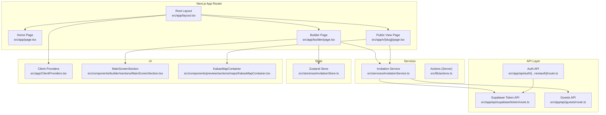

**Diagram sources**
- [layout.tsx](file://src/app/layout.tsx#L79-L155)
- [page.tsx](file://src/app/page.tsx#L6-L52)
- [builder/page.tsx](file://src/app/builder/page.tsx#L42-L231)
- [v/[slug]/page.tsx](file://src/app/v/[slug]/page.tsx#L63-L107)
- [ClientProviders.tsx](file://src/app/ClientProviders.tsx#L8-L19)
- [invitationService.ts](file://src/services/invitationService.ts#L9-L80)
- [actions.ts](file://src/lib/actions.ts#L10-L27)
- [useInvitationStore.ts](file://src/store/useInvitationStore.ts#L373-L533)
- [MainScreenSection.tsx](file://src/components/builder/sections/MainScreenSection.tsx#L18-L59)
- [KakaoMapContainer.tsx](file://src/components/preview/sections/maps/KakaoMapContainer.tsx#L15-L53)
- [api/supabase/token/route.ts](file://src/app/api/supabase/token/route.ts#L5-L15)
- [api/auth/[...nextauth]/route.ts](file://src/app/api/auth/[...nextauth]/route.ts#L1-L4)
- [api/guests/route.ts](file://src/app/api/guests/route.ts#L15-L123)

**Section sources**
- [layout.tsx](file://src/app/layout.tsx#L79-L155)
- [page.tsx](file://src/app/page.tsx#L6-L52)
- [ClientProviders.tsx](file://src/app/ClientProviders.tsx#L8-L19)
- [builder/page.tsx](file://src/app/builder/page.tsx#L42-L231)
- [v/[slug]/page.tsx](file://src/app/v/[slug]/page.tsx#L63-L107)

## Core Components
- Root layout and providers: Sets viewport, metadata, schema markup, Kakao SDK initialization, and wraps children with client providers for session, query client, and notifications.
- Builder page: Client-side orchestration for editing, saving, and previewing invitations; integrates Zustand store and Supabase service.
- Public view page: Server-rendered public invitation page with metadata generation and JSON-LD for SEO.
- Supabase utilities: Server client creation with JWT-based auth and browser client with token caching and lazy initialization.
- Services: Invitation CRUD and admin summaries; guest RSVP endpoint with validation.
- State management: Zustand store for invitation data with IndexedDB persistence.
- Server actions: Mutations and validations executed on the server for safety and SSR-friendly workflows.
- Maps integration: Client component for Kakao Maps with loader and skeleton fallback.

**Section sources**
- [layout.tsx](file://src/app/layout.tsx#L10-L156)
- [ClientProviders.tsx](file://src/app/ClientProviders.tsx#L8-L19)
- [builder/page.tsx](file://src/app/builder/page.tsx#L42-L231)
- [v/[slug]/page.tsx](file://src/app/v/[slug]/page.tsx#L16-L107)
- [server.ts](file://src/lib/supabase/server.ts#L9-L18)
- [client.ts](file://src/lib/supabase/client.ts#L41-L84)
- [invitationService.ts](file://src/services/invitationService.ts#L9-L80)
- [useInvitationStore.ts](file://src/store/useInvitationStore.ts#L373-L533)
- [actions.ts](file://src/lib/actions.ts#L10-L27)
- [KakaoMapContainer.tsx](file://src/components/preview/sections/maps/KakaoMapContainer.tsx#L15-L53)

## Architecture Overview
The system emphasizes server components and minimal client hydration:
- Root layout initializes environment-wide assets and providers.
- Pages are split between server-rendered public view and client-rendered builder/editor.
- Supabase is accessed directly from server components and lazily from the browser via a token endpoint.
- Server actions encapsulate sensitive mutations and validations.
- Zustand manages client-side state with IndexedDB persistence for offline resilience.

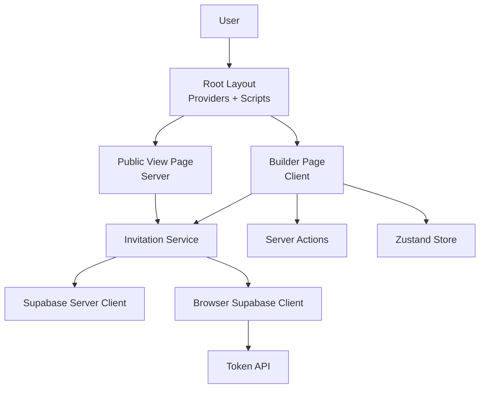

**Diagram sources**
- [layout.tsx](file://src/app/layout.tsx#L79-L155)
- [builder/page.tsx](file://src/app/builder/page.tsx#L42-L231)
- [v/[slug]/page.tsx](file://src/app/v/[slug]/page.tsx#L63-L107)
- [invitationService.ts](file://src/services/invitationService.ts#L9-L80)
- [server.ts](file://src/lib/supabase/server.ts#L9-L18)
- [client.ts](file://src/lib/supabase/client.ts#L41-L84)
- [api/supabase/token/route.ts](file://src/app/api/supabase/token/route.ts#L5-L15)
- [actions.ts](file://src/lib/actions.ts#L10-L27)

## Detailed Component Analysis

### Root Layout and Providers
- Initializes viewport, metadata, Open Graph, Twitter, and JSON-LD structured data.
- Injects Kakao SDK script and initializes it with environment key.
- Wraps children with SessionProvider, QueryClientProvider, and Toaster for UX feedback.

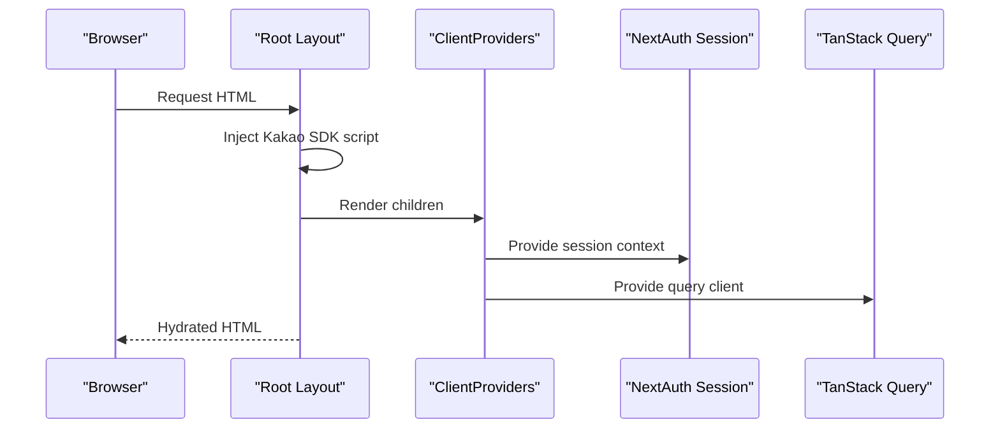

**Diagram sources**
- [layout.tsx](file://src/app/layout.tsx#L87-L149)
- [ClientProviders.tsx](file://src/app/ClientProviders.tsx#L8-L19)

**Section sources**
- [layout.tsx](file://src/app/layout.tsx#L10-L156)
- [ClientProviders.tsx](file://src/app/ClientProviders.tsx#L8-L19)

### Builder Page (Client-Side Editing)
- Dynamically imports the InvitationCanvas to avoid SSR overhead and reduce preload warnings.
- Uses Zustand store for real-time updates and IndexedDB persistence.
- Integrates with Supabase service to save invitations and redirects after successful save.
- Guards profile completion and handles login flow.

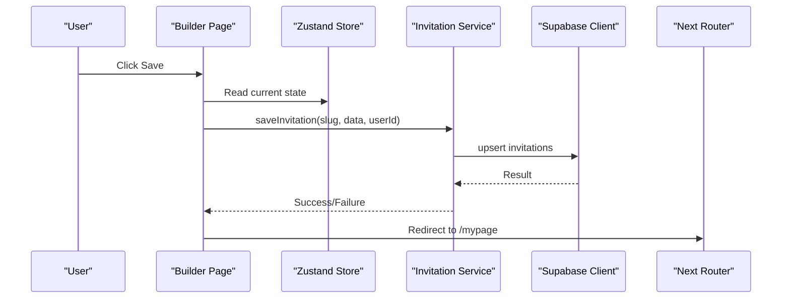

**Diagram sources**
- [builder/page.tsx](file://src/app/builder/page.tsx#L87-L127)
- [invitationService.ts](file://src/services/invitationService.ts#L10-L24)
- [useInvitationStore.ts](file://src/store/useInvitationStore.ts#L373-L533)

**Section sources**
- [builder/page.tsx](file://src/app/builder/page.tsx#L42-L231)
- [invitationService.ts](file://src/services/invitationService.ts#L9-L80)
- [useInvitationStore.ts](file://src/store/useInvitationStore.ts#L373-L533)

### Public View Page (Server-Side Rendering)
- Fetches invitation data server-side using Supabase server client.
- Generates metadata dynamically (OG, Twitter) and emits JSON-LD for events.
- Renders InvitationCanvas with preloaded data.

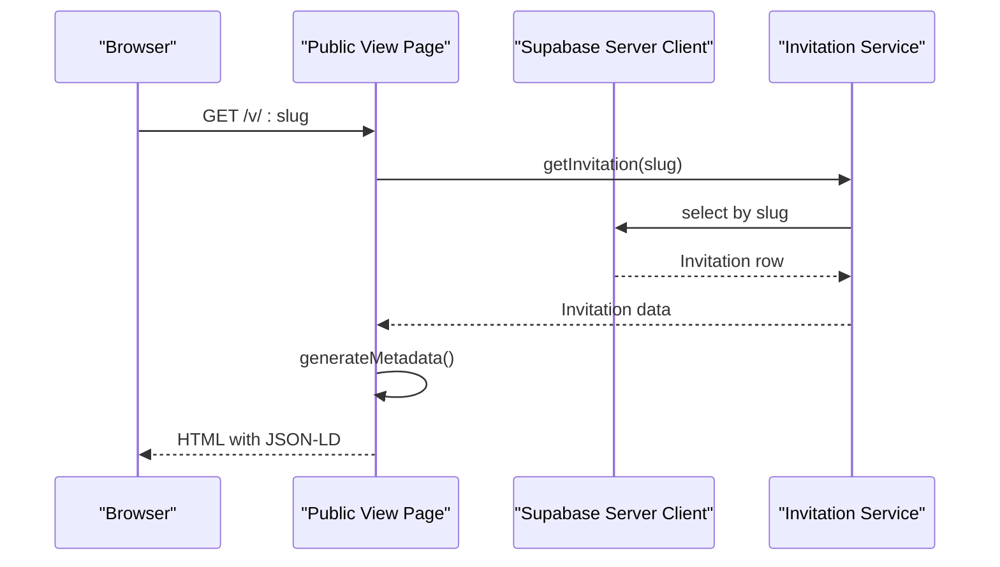

**Diagram sources**
- [v/[slug]/page.tsx](file://src/app/v/[slug]/page.tsx#L11-L61)
- [invitationService.ts](file://src/services/invitationService.ts#L59-L69)
- [server.ts](file://src/lib/supabase/server.ts#L9-L18)

**Section sources**
- [v/[slug]/page.tsx](file://src/app/v/[slug]/page.tsx#L63-L107)
- [invitationService.ts](file://src/services/invitationService.ts#L9-L80)
- [server.ts](file://src/lib/supabase/server.ts#L9-L18)

### Supabase Access Patterns
- Server client: Creates a Supabase client with a JWT derived from NextAuth session for RLS-safe operations.
- Browser client: Lazily initializes with token refresh logic and caches tokens until expiration.
- Token endpoint: Issues a signed JWT for browser clients to authenticate with Supabase.

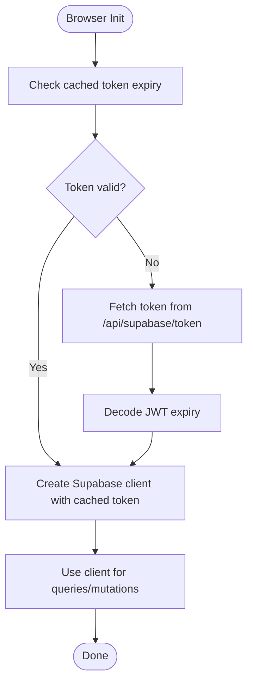

**Diagram sources**
- [client.ts](file://src/lib/supabase/client.ts#L41-L84)
- [api/supabase/token/route.ts](file://src/app/api/supabase/token/route.ts#L5-L15)

**Section sources**
- [server.ts](file://src/lib/supabase/server.ts#L9-L18)
- [client.ts](file://src/lib/supabase/client.ts#L41-L84)
- [api/supabase/token/route.ts](file://src/app/api/supabase/token/route.ts#L5-L15)

### Server Actions for Mutations
- Encapsulate sensitive operations and validations on the server.
- Return typed ServerActionResponse for consistent client handling.
- Used for saving invitations, generating previews, exporting, sending invites, RSVP updates, image uploads, event tracking, and data validation.

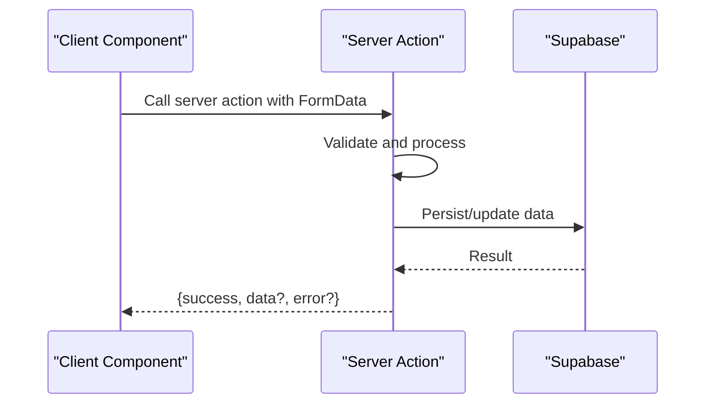

**Diagram sources**
- [actions.ts](file://src/lib/actions.ts#L10-L27)
- [actions.ts](file://src/lib/actions.ts#L114-L145)

**Section sources**
- [actions.ts](file://src/lib/actions.ts#L10-L200)

### Authentication Flow
- NextAuth handles authentication; routes are exposed via API handlers.
- Supabase token endpoint requires an authenticated session and returns a JWT for browser client usage.

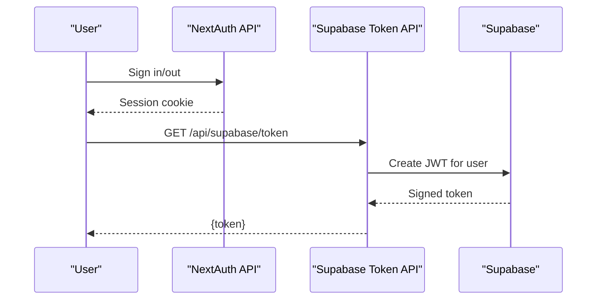

**Diagram sources**
- [api/auth/[...nextauth]/route.ts](file://src/app/api/auth/[...nextauth]/route.ts#L1-L4)
- [api/supabase/token/route.ts](file://src/app/api/supabase/token/route.ts#L5-L15)

**Section sources**
- [api/auth/[...nextauth]/route.ts](file://src/app/api/auth/[...nextauth]/route.ts#L1-L4)
- [api/supabase/token/route.ts](file://src/app/api/supabase/token/route.ts#L5-L15)

### Real-Time Capabilities and External Integrations
- Kakao Maps SDK is loaded dynamically and initialized with environment key; supports loading skeletons and error states.
- Naver authentication is integrated via NextAuth; token endpoint enables browser-to-Supabase auth.

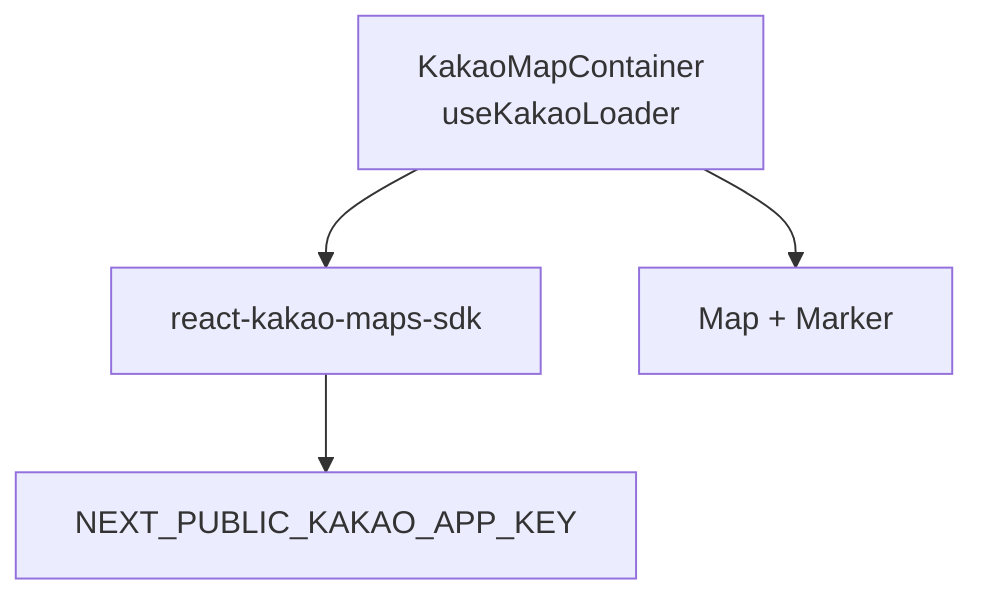

**Diagram sources**
- [KakaoMapContainer.tsx](file://src/components/preview/sections/maps/KakaoMapContainer.tsx#L15-L53)
- [layout.tsx](file://src/app/layout.tsx#L87-L99)

**Section sources**
- [KakaoMapContainer.tsx](file://src/components/preview/sections/maps/KakaoMapContainer.tsx#L15-L53)
- [layout.tsx](file://src/app/layout.tsx#L87-L99)

### Component Hierarchy and Server/Client Separation
- Server components: Root layout, public view page, API routes, server actions.
- Client components: Builder page, editor form, canvas preview, map container, UI primitives.
- Sections: Modular builder sections (e.g., MainScreenSection) consume store and render content conditionally.

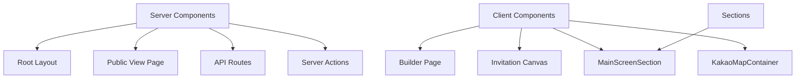

**Diagram sources**
- [layout.tsx](file://src/app/layout.tsx#L79-L155)
- [v/[slug]/page.tsx](file://src/app/v/[slug]/page.tsx#L63-L107)
- [builder/page.tsx](file://src/app/builder/page.tsx#L42-L231)
- [MainScreenSection.tsx](file://src/components/builder/sections/MainScreenSection.tsx#L18-L59)
- [KakaoMapContainer.tsx](file://src/components/preview/sections/maps/KakaoMapContainer.tsx#L15-L53)

**Section sources**
- [layout.tsx](file://src/app/layout.tsx#L79-L155)
- [builder/page.tsx](file://src/app/builder/page.tsx#L42-L231)
- [MainScreenSection.tsx](file://src/components/builder/sections/MainScreenSection.tsx#L18-L59)

## Dependency Analysis
- Presentation layer depends on Zustand store and Supabase service.
- Services depend on Supabase clients (server or browser).
- API routes depend on server Supabase client and NextAuth session.
- Client components depend on dynamic imports and UI libraries.

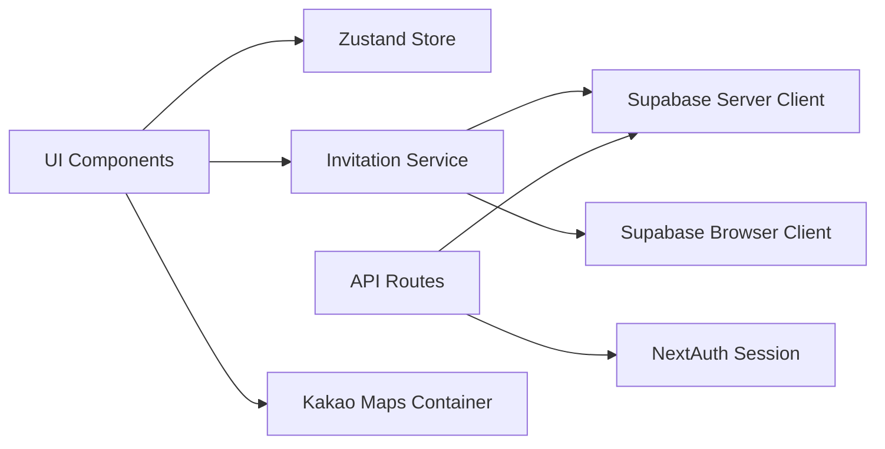

**Diagram sources**
- [useInvitationStore.ts](file://src/store/useInvitationStore.ts#L373-L533)
- [invitationService.ts](file://src/services/invitationService.ts#L9-L80)
- [server.ts](file://src/lib/supabase/server.ts#L9-L18)
- [client.ts](file://src/lib/supabase/client.ts#L41-L84)
- [api/guests/route.ts](file://src/app/api/guests/route.ts#L15-L123)
- [api/auth/[...nextauth]/route.ts](file://src/app/api/auth/[...nextauth]/route.ts#L1-L4)
- [KakaoMapContainer.tsx](file://src/components/preview/sections/maps/KakaoMapContainer.tsx#L15-L53)

**Section sources**
- [invitationService.ts](file://src/services/invitationService.ts#L9-L80)
- [server.ts](file://src/lib/supabase/server.ts#L9-L18)
- [client.ts](file://src/lib/supabase/client.ts#L41-L84)
- [api/guests/route.ts](file://src/app/api/guests/route.ts#L15-L123)
- [api/auth/[...nextauth]/route.ts](file://src/app/api/auth/[...nextauth]/route.ts#L1-L4)
- [KakaoMapContainer.tsx](file://src/components/preview/sections/maps/KakaoMapContainer.tsx#L15-L53)

## Performance Considerations
- Zero client fetching: Browser client lazily requests a token and reuses it until expiry to minimize network calls.
- Dynamic imports: InvitationCanvas and modals are imported dynamically to reduce initial bundle size and SSR overhead.
- Caching: React cache is used in the public view to memoize Supabase queries per slug.
- IndexedDB persistence: Zustand persists large invitation payloads efficiently.
- Skeleton loaders: Maps container shows skeleton while SDK loads.

[No sources needed since this section provides general guidance]

## Troubleshooting Guide
- Supabase token unauthorized: Ensure NextAuth session exists and user ID is present; verify NEXT_PUBLIC_SUPABASE_URL and NEXT_PUBLIC_SUPABASE_ANON_KEY are configured.
- Kakao Maps not loading: Confirm NEXT_PUBLIC_KAKAO_APP_KEY is set and SDK initialization runs after interactive hydration.
- Guest API validation errors: Validate invitationId UUID and payload constraints; check server logs for Zod errors.
- Zustand persistence issues: Verify IndexedDB availability and idb-keyval integration.

**Section sources**
- [api/supabase/token/route.ts](file://src/app/api/supabase/token/route.ts#L5-L15)
- [client.ts](file://src/lib/supabase/client.ts#L41-L84)
- [layout.tsx](file://src/app/layout.tsx#L87-L99)
- [api/guests/route.ts](file://src/app/api/guests/route.ts#L70-L85)
- [useInvitationStore.ts](file://src/store/useInvitationStore.ts#L474-L533)

## Conclusion
The Banana Wedding system leverages Next.js 16’s App Router to separate server and client concerns effectively. Server components handle rendering and secure data access, while client components manage interactive editing and previews. Supabase is accessed directly from the server and via a token endpoint for the browser, enabling a zero-client-fetching strategy. Server actions encapsulate sensitive mutations, and Zustand with IndexedDB ensures a responsive, resilient editing experience. External integrations like Kakao Maps and Naver authentication are cleanly integrated through dynamic loading and NextAuth.