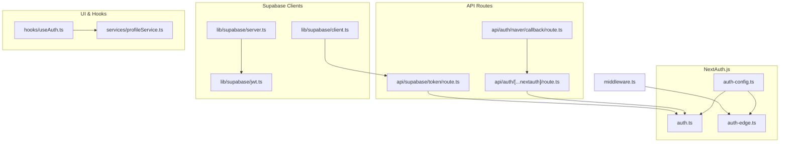
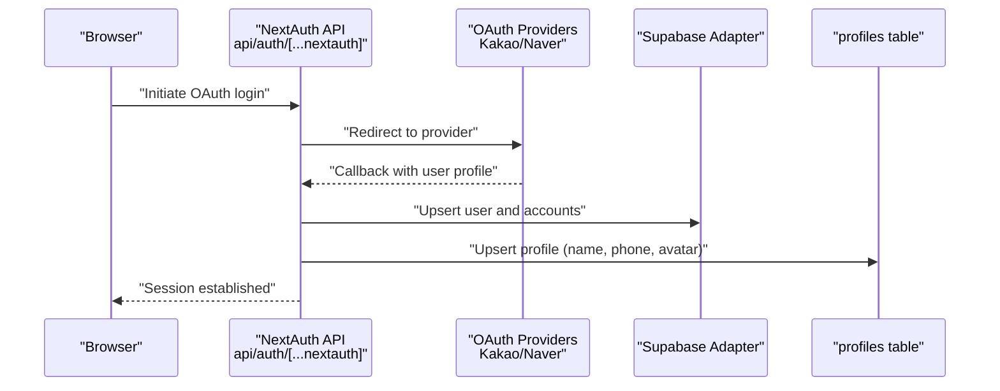
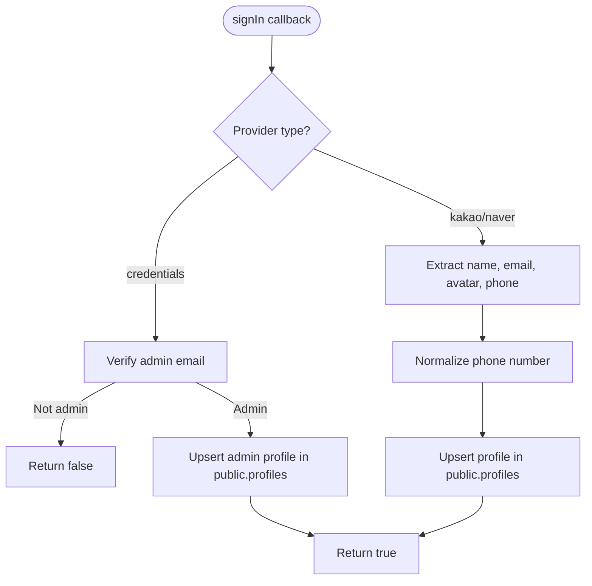
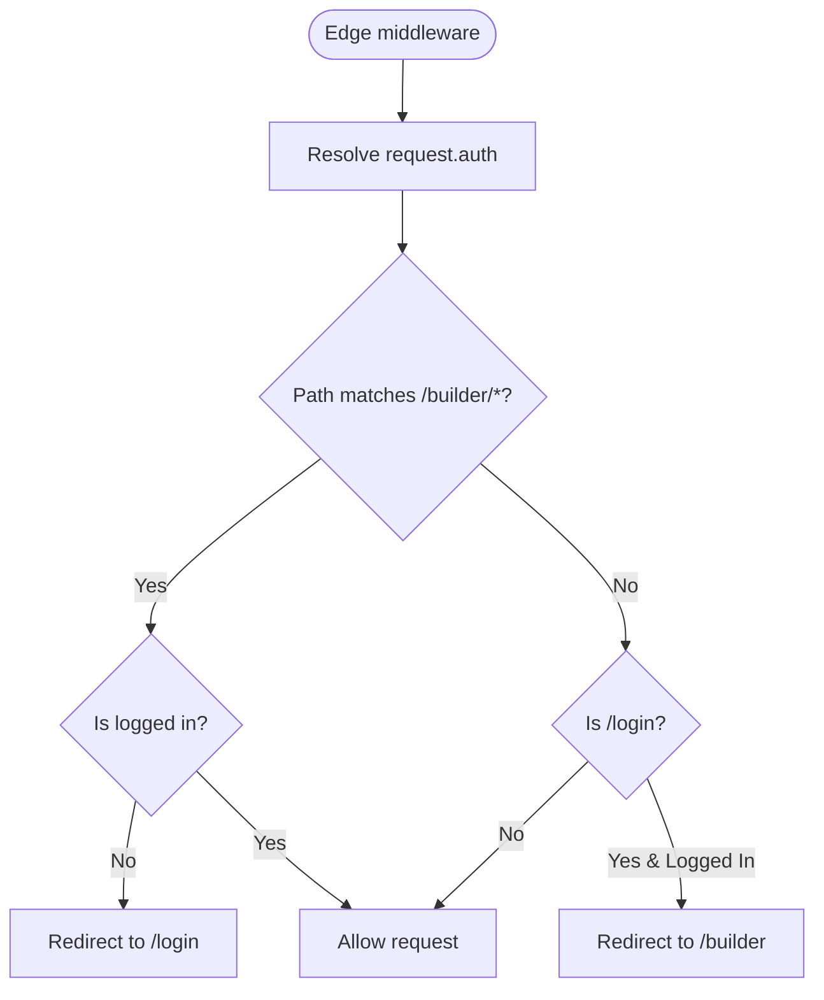
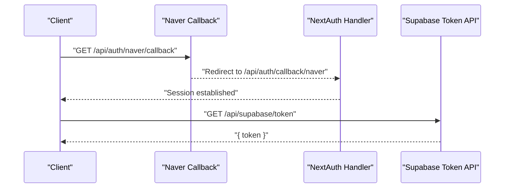
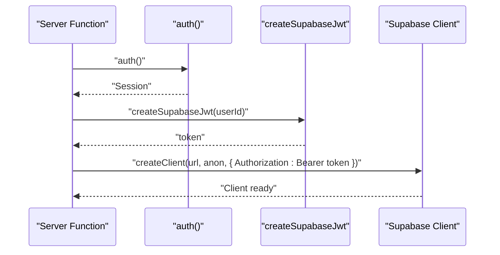
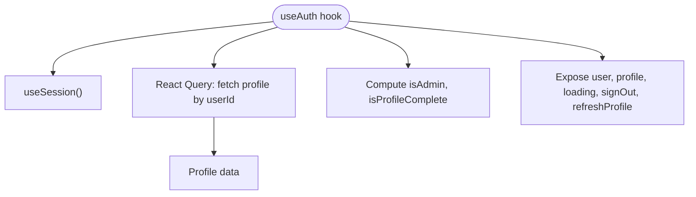
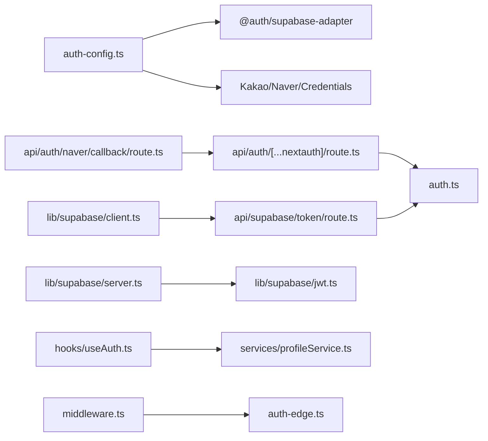

# Authentication System

<cite>
**Referenced Files in This Document**
- [src/auth.ts](file://src/auth.ts)
- [src/auth-edge.ts](file://src/auth-edge.ts)
- [src/auth-config.ts](file://src/auth-config.ts)
- [src/app/api/auth/[...nextauth]/route.ts](file://src/app/api/auth/[...nextauth]/route.ts)
- [src/app/api/auth/naver/callback/route.ts](file://src/app/api/auth/naver/callback/route.ts)
- [src/app/api/supabase/token/route.ts](file://src/app/api/supabase/token/route.ts)
- [src/lib/supabase/server.ts](file://src/lib/supabase/server.ts)
- [src/lib/supabase/client.ts](file://src/lib/supabase/client.ts)
- [src/lib/supabase/jwt.ts](file://src/lib/supabase/jwt.ts)
- [src/hooks/useAuth.ts](file://src/hooks/useAuth.ts)
- [src/services/profileService.ts](file://src/services/profileService.ts)
- [middleware.ts](file://middleware.ts)
- [src/types/next-auth.d.ts](file://src/types/next-auth.d.ts)
- [supabase/migrations/20260116000000_add_nextauth_tables.sql](file://supabase/migrations/20260116000000_add_nextauth_tables.sql)
- [supabase/migrations/20260114063537_add_profiles_and_approval_requests.sql](file://supabase/migrations/20260114063537_add_profiles_and_approval_requests.sql)
</cite>

## Table of Contents
1. [Introduction](#introduction)
2. [Project Structure](#project-structure)
3. [Core Components](#core-components)
4. [Architecture Overview](#architecture-overview)
5. [Detailed Component Analysis](#detailed-component-analysis)
6. [Dependency Analysis](#dependency-analysis)
7. [Performance Considerations](#performance-considerations)
8. [Security Considerations](#security-considerations)
9. [Troubleshooting Guide](#troubleshooting-guide)
10. [Testing Strategies](#testing-strategies)
11. [Conclusion](#conclusion)

## Introduction
This document explains the authentication system built with NextAuth.js integrated against a Supabase backend. It covers OAuth provider configuration for Kakao and Naver, session management, user profile synchronization, token handling, edge runtime authentication, server-side session validation, authentication guards, protected routes, user state management, and the integration between NextAuth.js and Supabase for user data persistence. Security considerations such as session security and CSRF protection are addressed, along with troubleshooting guidance and testing strategies.

## Project Structure
The authentication system spans several layers:
- NextAuth.js configuration and edge runtime wrapper
- API routes for NextAuth.js and Supabase token exchange
- Supabase client utilities for server and browser contexts
- Middleware for route protection
- React hooks for client-side user state
- Supabase database schema for NextAuth.js tables and user profiles



**Diagram sources**
- [src/auth-config.ts](file://src/auth-config.ts#L31-L227)
- [src/auth.ts](file://src/auth.ts#L1-L5)
- [src/auth-edge.ts](file://src/auth-edge.ts#L1-L5)
- [src/app/api/auth/[...nextauth]/route.ts](file://src/app/api/auth/[...nextauth]/route.ts#L1-L4)
- [src/app/api/auth/naver/callback/route.ts](file://src/app/api/auth/naver/callback/route.ts#L1-L10)
- [src/app/api/supabase/token/route.ts](file://src/app/api/supabase/token/route.ts#L1-L16)
- [src/lib/supabase/server.ts](file://src/lib/supabase/server.ts#L1-L19)
- [src/lib/supabase/client.ts](file://src/lib/supabase/client.ts#L1-L85)
- [src/lib/supabase/jwt.ts](file://src/lib/supabase/jwt.ts#L1-L15)
- [src/hooks/useAuth.ts](file://src/hooks/useAuth.ts#L1-L55)
- [src/services/profileService.ts](file://src/services/profileService.ts#L1-L101)
- [middleware.ts](file://middleware.ts#L1-L22)

**Section sources**
- [src/auth.ts](file://src/auth.ts#L1-L5)
- [src/auth-edge.ts](file://src/auth-edge.ts#L1-L5)
- [src/auth-config.ts](file://src/auth-config.ts#L31-L227)
- [src/app/api/auth/[...nextauth]/route.ts](file://src/app/api/auth/[...nextauth]/route.ts#L1-L4)
- [src/app/api/auth/naver/callback/route.ts](file://src/app/api/auth/naver/callback/route.ts#L1-L10)
- [src/app/api/supabase/token/route.ts](file://src/app/api/supabase/token/route.ts#L1-L16)
- [src/lib/supabase/server.ts](file://src/lib/supabase/server.ts#L1-L19)
- [src/lib/supabase/client.ts](file://src/lib/supabase/client.ts#L1-L85)
- [src/lib/supabase/jwt.ts](file://src/lib/supabase/jwt.ts#L1-L15)
- [src/hooks/useAuth.ts](file://src/hooks/useAuth.ts#L1-L55)
- [src/services/profileService.ts](file://src/services/profileService.ts#L1-L101)
- [middleware.ts](file://middleware.ts#L1-L22)

## Core Components
- NextAuth.js configuration defines providers (Kakao, Naver, Credentials), adapter, session strategy, and callbacks for profile synchronization and admin assignment.
- Edge runtime wrapper exposes a minimal auth function for middleware.
- API routes expose NextAuth.js handlers and a Naver callback redirection endpoint.
- Supabase clients provide server-side and browser-side access with JWT-based authorization.
- Middleware enforces protected routes for builder pages and login redirection logic.
- React hooks centralize user session and profile state management.
- Supabase schema defines NextAuth.js tables and user profiles with RLS policies.

**Section sources**
- [src/auth-config.ts](file://src/auth-config.ts#L31-L227)
- [src/auth-edge.ts](file://src/auth-edge.ts#L1-L5)
- [src/app/api/auth/[...nextauth]/route.ts](file://src/app/api/auth/[...nextauth]/route.ts#L1-L4)
- [src/app/api/auth/naver/callback/route.ts](file://src/app/api/auth/naver/callback/route.ts#L1-L10)
- [src/app/api/supabase/token/route.ts](file://src/app/api/supabase/token/route.ts#L1-L16)
- [src/lib/supabase/server.ts](file://src/lib/supabase/server.ts#L1-L19)
- [src/lib/supabase/client.ts](file://src/lib/supabase/client.ts#L1-L85)
- [src/lib/supabase/jwt.ts](file://src/lib/supabase/jwt.ts#L1-L15)
- [src/hooks/useAuth.ts](file://src/hooks/useAuth.ts#L1-L55)
- [supabase/migrations/20260116000000_add_nextauth_tables.sql](file://supabase/migrations/20260116000000_add_nextauth_tables.sql#L1-L57)
- [supabase/migrations/20260114063537_add_profiles_and_approval_requests.sql](file://supabase/migrations/20260114063537_add_profiles_and_approval_requests.sql#L1-L234)

## Architecture Overview
The system integrates NextAuth.js with Supabase for:
- OAuth flows via Kakao and Naver
- Database-backed sessions
- Automatic user profile creation and updates
- Edge runtime authentication guard
- Browser and server client initialization with JWT tokens



**Diagram sources**
- [src/app/api/auth/[...nextauth]/route.ts](file://src/app/api/auth/[...nextauth]/route.ts#L1-L4)
- [src/auth-config.ts](file://src/auth-config.ts#L39-L129)
- [src/auth-config.ts](file://src/auth-config.ts#L130-L225)
- [supabase/migrations/20260116000000_add_nextauth_tables.sql](file://supabase/migrations/20260116000000_add_nextauth_tables.sql#L11-L52)
- [supabase/migrations/20260114063537_add_profiles_and_approval_requests.sql](file://supabase/migrations/20260114063537_add_profiles_and_approval_requests.sql#L18-L27)

## Detailed Component Analysis

### NextAuth.js Configuration and Providers
- Providers:
  - Kakao: Configured with authorization URL and scope, mapping provider profile to NextAuth user fields.
  - Naver: Configured with authorization URL and scope, mapping provider profile to NextAuth user fields.
  - Credentials: Admin login with email/password checks against environment-managed admin emails and inserts/returns a user record.
- Adapter: SupabaseAdapter configured with service role credentials and schema selection.
- Session strategy: Database-backed sessions.
- Callbacks:
  - signIn: Handles admin credentials and social login profile upserts, including phone normalization and admin flag assignment.
  - session: Injects user id into session.user for downstream use.



**Diagram sources**
- [src/auth-config.ts](file://src/auth-config.ts#L130-L218)
- [src/auth-config.ts](file://src/auth-config.ts#L58-L78)
- [src/auth-config.ts](file://src/auth-config.ts#L40-L57)

**Section sources**
- [src/auth-config.ts](file://src/auth-config.ts#L31-L227)

### Edge Runtime Authentication Guard
- Edge runtime wrapper exports an auth function suitable for middleware.
- Middleware enforces:
  - Redirect unauthenticated users away from builder routes.
  - Redirect authenticated users away from login route.
- Matcher restricts middleware evaluation to specific paths.



**Diagram sources**
- [src/auth-edge.ts](file://src/auth-edge.ts#L1-L5)
- [middleware.ts](file://middleware.ts#L4-L17)

**Section sources**
- [src/auth-edge.ts](file://src/auth-edge.ts#L1-L5)
- [middleware.ts](file://middleware.ts#L1-L22)

### API Routes for Authentication and Token Exchange
- NextAuth API handler: Exposes GET/POST for NextAuth.js.
- Naver callback redirector: Redirects Naver callback to NextAuth handler.
- Supabase token endpoint: Issues a short-lived JWT for authenticated users to access Supabase with server-side privileges.



**Diagram sources**
- [src/app/api/auth/[...nextauth]/route.ts](file://src/app/api/auth/[...nextauth]/route.ts#L1-L4)
- [src/app/api/auth/naver/callback/route.ts](file://src/app/api/auth/naver/callback/route.ts#L1-L10)
- [src/app/api/supabase/token/route.ts](file://src/app/api/supabase/token/route.ts#L1-L16)

**Section sources**
- [src/app/api/auth/[...nextauth]/route.ts](file://src/app/api/auth/[...nextauth]/route.ts#L1-L4)
- [src/app/api/auth/naver/callback/route.ts](file://src/app/api/auth/naver/callback/route.ts#L1-L10)
- [src/app/api/supabase/token/route.ts](file://src/app/api/supabase/token/route.ts#L1-L16)

### Supabase Client Utilities and Token Handling
- Server client:
  - Resolves NextAuth session, creates a JWT for the user, and initializes a Supabase client with Authorization header.
- Browser client:
  - Fetches a JWT from the server via /api/supabase/token, caches it with expiry decoding, and reuses the client instance.
- JWT creation:
  - HS256-signed JWT with subject set to user id and 1-hour expiration.



**Diagram sources**
- [src/lib/supabase/server.ts](file://src/lib/supabase/server.ts#L9-L18)
- [src/lib/supabase/jwt.ts](file://src/lib/supabase/jwt.ts#L5-L14)

**Section sources**
- [src/lib/supabase/server.ts](file://src/lib/supabase/server.ts#L1-L19)
- [src/lib/supabase/client.ts](file://src/lib/supabase/client.ts#L24-L84)
- [src/lib/supabase/jwt.ts](file://src/lib/supabase/jwt.ts#L1-L15)

### Client-Side User State Management
- React hook aggregates NextAuth session and profile data:
  - Loads profile via service, exposes refresh and sign out helpers.
  - Computes admin and profile completeness flags.
- Profile service:
  - Fetches profile with robust error handling.
  - Updates profile via API route.



**Diagram sources**
- [src/hooks/useAuth.ts](file://src/hooks/useAuth.ts#L9-L54)
- [src/services/profileService.ts](file://src/services/profileService.ts#L26-L52)

**Section sources**
- [src/hooks/useAuth.ts](file://src/hooks/useAuth.ts#L1-L55)
- [src/services/profileService.ts](file://src/services/profileService.ts#L1-L101)

### Database Schema and Policies
- NextAuth.js tables in the next_auth schema:
  - users, accounts, sessions, verification_tokens with appropriate constraints and indexes.
- Public profiles table:
  - Primary key references auth.users(id), RLS policies for select/update, admin visibility, and automatic creation trigger.
  - Helper function to check profile completeness.

```mermaid
erDiagram
USERS {
uuid id PK
text name
text email UK
timestamptz emailVerified
text image
}
ACCOUNTS {
uuid id PK
uuid userId FK
text type
text provider
text providerAccountId
text refreshToken
text accessToken
bigint expiresAt
text tokenType
text scope
text idToken
text sessionState
}
SESSIONS {
uuid id PK
text sessionToken UK
uuid userId FK
timestamptz expires
}
VERIFICATION_TOKENS {
text identifier
text token UK
timestamptz expires
}
PROFILES {
uuid id PK FK
text full_name
text phone
text avatar_url
boolean is_admin
boolean is_profile_complete
timestamptz created_at
timestamptz updated_at
}
USERS ||--o{ ACCOUNTS : "has"
USERS ||--o{ SESSIONS : "has"
USERS ||--|| PROFILES : "extends"
```

**Diagram sources**
- [supabase/migrations/20260116000000_add_nextauth_tables.sql](file://supabase/migrations/20260116000000_add_nextauth_tables.sql#L11-L52)
- [supabase/migrations/20260114063537_add_profiles_and_approval_requests.sql](file://supabase/migrations/20260114063537_add_profiles_and_approval_requests.sql#L18-L27)

**Section sources**
- [supabase/migrations/20260116000000_add_nextauth_tables.sql](file://supabase/migrations/20260116000000_add_nextauth_tables.sql#L1-L57)
- [supabase/migrations/20260114063537_add_profiles_and_approval_requests.sql](file://supabase/migrations/20260114063537_add_profiles_and_approval_requests.sql#L1-L234)

## Dependency Analysis
- NextAuth.js depends on:
  - SupabaseAdapter for database-backed storage.
  - Providers for OAuth flows.
  - Callbacks for profile synchronization and admin assignment.
- API routes depend on:
  - NextAuth handlers for OAuth lifecycle.
  - Supabase token endpoint for JWT issuance.
- Supabase clients depend on:
  - JWT utility for signed tokens.
  - Environment variables for Supabase URLs and keys.
- Middleware depends on:
  - Edge runtime auth wrapper for request gating.
- React hooks depend on:
  - NextAuth session and profile service.



**Diagram sources**
- [src/auth-config.ts](file://src/auth-config.ts#L33-L36)
- [src/app/api/auth/[...nextauth]/route.ts](file://src/app/api/auth/[...nextauth]/route.ts#L1-L4)
- [src/app/api/auth/naver/callback/route.ts](file://src/app/api/auth/naver/callback/route.ts#L1-L10)
- [src/app/api/supabase/token/route.ts](file://src/app/api/supabase/token/route.ts#L1-L16)
- [src/lib/supabase/server.ts](file://src/lib/supabase/server.ts#L1-L19)
- [src/lib/supabase/client.ts](file://src/lib/supabase/client.ts#L1-L85)
- [src/lib/supabase/jwt.ts](file://src/lib/supabase/jwt.ts#L1-L15)
- [src/hooks/useAuth.ts](file://src/hooks/useAuth.ts#L1-L55)
- [src/services/profileService.ts](file://src/services/profileService.ts#L1-L101)
- [middleware.ts](file://middleware.ts#L1-L22)

**Section sources**
- [src/auth-config.ts](file://src/auth-config.ts#L31-L227)
- [src/app/api/auth/[...nextauth]/route.ts](file://src/app/api/auth/[...nextauth]/route.ts#L1-L4)
- [src/app/api/auth/naver/callback/route.ts](file://src/app/api/auth/naver/callback/route.ts#L1-L10)
- [src/app/api/supabase/token/route.ts](file://src/app/api/supabase/token/route.ts#L1-L16)
- [src/lib/supabase/server.ts](file://src/lib/supabase/server.ts#L1-L19)
- [src/lib/supabase/client.ts](file://src/lib/supabase/client.ts#L1-L85)
- [src/lib/supabase/jwt.ts](file://src/lib/supabase/jwt.ts#L1-L15)
- [src/hooks/useAuth.ts](file://src/hooks/useAuth.ts#L1-L55)
- [src/services/profileService.ts](file://src/services/profileService.ts#L1-L101)
- [middleware.ts](file://middleware.ts#L1-L22)

## Performance Considerations
- Database-backed sessions reduce memory overhead but increase DB queries; ensure indexes on next_auth.sessions and next_auth.accounts are maintained.
- Profile upserts occur on sign-in; batch or defer non-critical updates if needed.
- Browser client caching of Supabase tokens reduces repeated token fetches; tune expiry thresholds to balance freshness and network usage.
- Middleware matcher limits edge runtime evaluation to necessary paths.

[No sources needed since this section provides general guidance]

## Security Considerations
- Session security:
  - Database session strategy requires secure cookie configuration in production; ensure HTTPS and SameSite policies are set appropriately.
  - NextAuth.js manages CSRF protection automatically via state parameters and secure cookies.
- Token handling:
  - JWTs are signed with HS256 and expire in 1 hour; rotate secrets regularly and avoid exposing tokens in logs.
- Supabase RLS:
  - Profiles and approval requests enforce row-level security; ensure policies remain aligned with application logic.
- Admin controls:
  - Admin email list is loaded from environment variables; validate environment configuration and restrict admin access surfaces.
- Edge runtime:
  - Middleware runs in the edge; keep logic minimal and deterministic to avoid cold starts and errors.

**Section sources**
- [src/auth-config.ts](file://src/auth-config.ts#L37-L38)
- [src/lib/supabase/jwt.ts](file://src/lib/supabase/jwt.ts#L5-L14)
- [supabase/migrations/20260114063537_add_profiles_and_approval_requests.sql](file://supabase/migrations/20260114063537_add_profiles_and_approval_requests.sql#L44-L73)

## Troubleshooting Guide
- Missing environment variables:
  - Supabase URL and service role key are required for adapter initialization; missing values cause critical errors during startup.
- OAuth failures:
  - Verify provider client IDs and secrets, scopes, and callback URLs.
  - Check provider profile mapping in callbacks if fields are missing.
- Profile synchronization:
  - If profile upsert fails, the system logs the error and allows sign-in to continue; inspect logs and provider responses.
- Protected routes:
  - Middleware redirects may fail if request.auth is not populated; confirm edge runtime auth is applied to matching paths.
- Supabase token endpoint:
  - Returns 401 when user is not authenticated; ensure NextAuth session is present before requesting a token.
- Browser client token caching:
  - If tokens expire unexpectedly, verify JWT secret and client-side expiry decoding logic.

**Section sources**
- [src/auth-config.ts](file://src/auth-config.ts#L11-L13)
- [src/auth-config.ts](file://src/auth-config.ts#L130-L218)
- [middleware.ts](file://middleware.ts#L4-L17)
- [src/app/api/supabase/token/route.ts](file://src/app/api/supabase/token/route.ts#L9-L11)
- [src/lib/supabase/client.ts](file://src/lib/supabase/client.ts#L24-L39)

## Testing Strategies
- Unit tests for callbacks:
  - Mock provider responses and assert profile upsert payloads for Kakao and Naver.
- Integration tests for OAuth flows:
  - Simulate provider callbacks and verify NextAuth session creation and profile updates.
- Middleware tests:
  - Validate redirect behavior for logged-in and anonymous users on builder and login routes.
- Token endpoint tests:
  - Confirm 401 for anonymous users and valid token for authenticated users.
- Supabase client tests:
  - Verify client initialization with and without JWT headers.
- Database assertions:
  - Confirm next_auth tables and public.profiles records after sign-in.

[No sources needed since this section provides general guidance]

## Conclusion
The authentication system leverages NextAuth.js with Supabase for robust OAuth support, database-backed sessions, and seamless user profile synchronization. Edge runtime middleware enforces route protection, while server and browser Supabase clients enable secure data access. The modular design supports extensibility and maintainability, with clear separation of concerns across configuration, API routes, middleware, and client utilities.