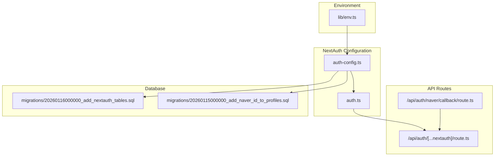
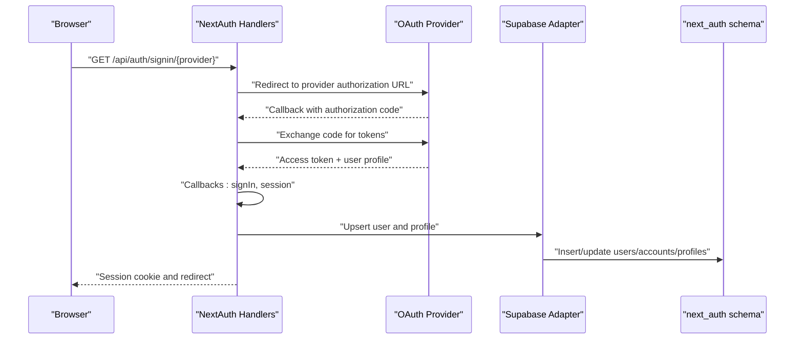
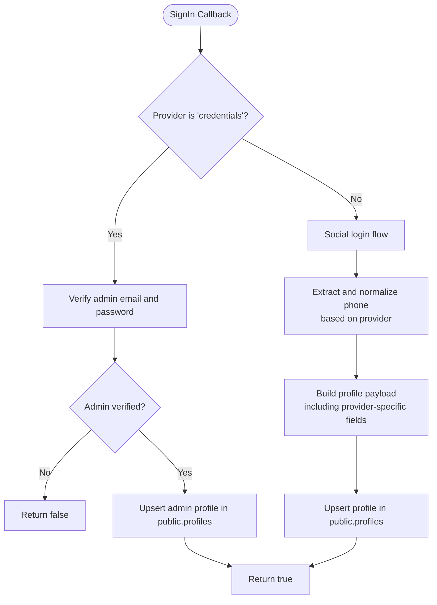
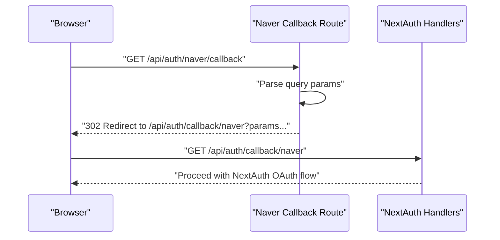
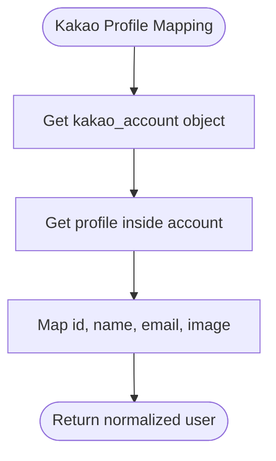
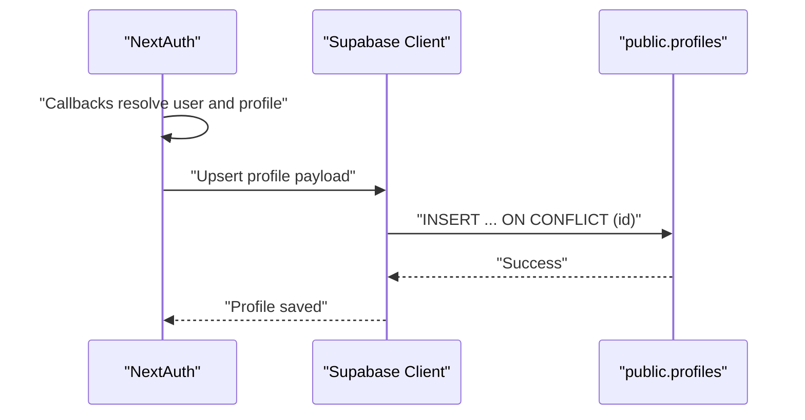
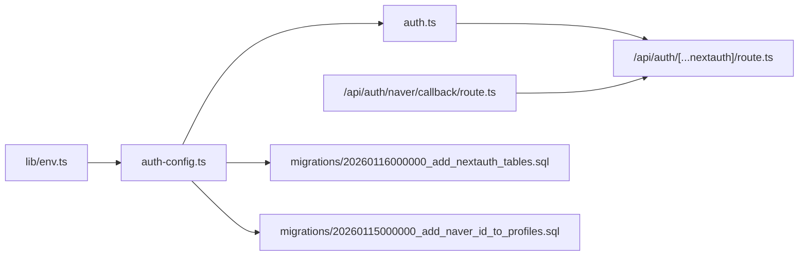

# OAuth Providers Configuration

<cite>
**Referenced Files in This Document**
- [auth-config.ts](file://src/auth-config.ts)
- [auth.ts](file://src/auth.ts)
- [route.ts](file://src/app/api/auth/[...nextauth]/route.ts)
- [callback.route.ts](file://src/app/api/auth/naver/callback/route.ts)
- [next-auth.d.ts](file://src/types/next-auth.d.ts)
- [env.ts](file://src/lib/env.ts)
- [useAuth.ts](file://src/hooks/useAuth.ts)
- [add_nextauth_tables.sql](file://supabase/migrations/20260116000000_add_nextauth_tables.sql)
- [add_naver_id_to_profiles.sql](file://supabase/migrations/20260115000000_add_naver_id_to_profiles.sql)
</cite>

## Table of Contents
1. [Introduction](#introduction)
2. [Project Structure](#project-structure)
3. [Core Components](#core-components)
4. [Architecture Overview](#architecture-overview)
5. [Detailed Component Analysis](#detailed-component-analysis)
6. [Dependency Analysis](#dependency-analysis)
7. [Performance Considerations](#performance-considerations)
8. [Troubleshooting Guide](#troubleshooting-guide)
9. [Conclusion](#conclusion)
10. [Appendices](#appendices)

## Introduction
This document explains the OAuth providers configuration in the authentication system, focusing on NextAuth.js setup for Kakao and Naver. It covers client ID and secret configuration, callback URL handling, scope permissions, provider-specific implementation differences, and the authentication flow. It also provides practical examples for adding new OAuth providers, customizing existing ones, error handling for OAuth failures, token refresh mechanisms, provider-specific user data mapping, security considerations, and production best practices.

## Project Structure
The OAuth configuration centers around a single NextAuth.js configuration file and supporting API routes. Environment variables are validated via a dedicated environment module. Migrations define the database schema used by the Supabase adapter for NextAuth.

**Diagram sources**
- [auth-config.ts](file://src/auth-config.ts#L31-L129)
- [auth.ts](file://src/auth.ts#L1-L5)
- [route.ts](file://src/app/api/auth/[...nextauth]/route.ts#L1-L4)
- [callback.route.ts](file://src/app/api/auth/naver/callback/route.ts#L1-L10)
- [env.ts](file://src/lib/env.ts#L1-L51)
- [add_nextauth_tables.sql](file://supabase/migrations/20260116000000_add_nextauth_tables.sql#L1-L57)
- [add_naver_id_to_profiles.sql](file://supabase/migrations/20260115000000_add_naver_id_to_profiles.sql#L1-L39)

**Section sources**
- [auth-config.ts](file://src/auth-config.ts#L1-L227)
- [auth.ts](file://src/auth.ts#L1-L5)
- [route.ts](file://src/app/api/auth/[...nextauth]/route.ts#L1-L4)
- [callback.route.ts](file://src/app/api/auth/naver/callback/route.ts#L1-L10)
- [env.ts](file://src/lib/env.ts#L1-L51)
- [add_nextauth_tables.sql](file://supabase/migrations/20260116000000_add_nextauth_tables.sql#L1-L57)
- [add_naver_id_to_profiles.sql](file://supabase/migrations/20260115000000_add_naver_id_to_profiles.sql#L1-L39)

## Core Components
- NextAuth configuration with providers:
  - Naver provider configured with client ID, client secret, authorization endpoint, and scope.
  - Kakao provider configured with client ID, client secret, authorization endpoint, and scope.
  - Credentials provider for admin login.
- Adapter and session strategy:
  - Supabase adapter configured with service role key and schema selection.
  - Database-backed sessions.
- Callbacks:
  - signIn callback handles admin credentials and social login profile upsert.
  - session callback enriches session with user ID.
- Environment validation:
  - Zod-based environment schema for Supabase and application URLs.

**Section sources**
- [auth-config.ts](file://src/auth-config.ts#L31-L129)
- [auth.ts](file://src/auth.ts#L1-L5)
- [env.ts](file://src/lib/env.ts#L1-L51)

## Architecture Overview
The OAuth flow integrates NextAuth.js with Supabase for session storage and user profile management. Providers delegate to external identity servers; upon successful authorization, NextAuth invokes callbacks to normalize user data and persist profile information.

**Diagram sources**
- [auth-config.ts](file://src/auth-config.ts#L31-L129)
- [route.ts](file://src/app/api/auth/[...nextauth]/route.ts#L1-L4)
- [add_nextauth_tables.sql](file://supabase/migrations/20260116000000_add_nextauth_tables.sql#L10-L52)

## Detailed Component Analysis

### NextAuth Configuration and Providers
- Providers:
  - Naver: custom authorization endpoint and scope; profile mapping extracts ID, name, email, and image from nested response.
  - Kakao: custom authorization endpoint and scope; profile mapping extracts ID, name, email, and image from nested account/profile.
  - Credentials: admin-only login with controlled email list and password check; creates/returns admin user record.
- Adapter and session:
  - Supabase adapter configured with service role key and schema selection.
  - Database strategy for sessions.
- Callbacks:
  - signIn: admin credentials gating, profile upsert for social logins, phone normalization for Korean providers, and optional Naver ID linkage.
  - session: injects user ID into session.

**Diagram sources**
- [auth-config.ts](file://src/auth-config.ts#L130-L225)

**Section sources**
- [auth-config.ts](file://src/auth-config.ts#L31-L129)
- [auth-config.ts](file://src/auth-config.ts#L130-L225)

### Naver OAuth Provider
- Authorization endpoint and scope:
  - Endpoint configured for Naver authorization.
  - Scope includes name, email, and mobile.
- Profile mapping:
  - Normalizes nested response structure and maps to NextAuth user fields.
- Callback URL handling:
  - Dedicated Naver callback route performs a redirect to NextAuth’s generic callback endpoint.

**Diagram sources**
- [callback.route.ts](file://src/app/api/auth/naver/callback/route.ts#L5-L9)
- [route.ts](file://src/app/api/auth/[...nextauth]/route.ts#L1-L4)

**Section sources**
- [auth-config.ts](file://src/auth-config.ts#L40-L57)
- [callback.route.ts](file://src/app/api/auth/naver/callback/route.ts#L1-L10)

### Kakao OAuth Provider
- Authorization endpoint and scope:
  - Endpoint configured for Kakao authorization.
  - Scope includes profile_nickname and account_email.
- Profile mapping:
  - Normalizes nested account and profile structures and maps to NextAuth user fields.
- Phone normalization:
  - Extracts phone from multiple possible fields and normalizes Korean phone numbers.

**Diagram sources**
- [auth-config.ts](file://src/auth-config.ts#L68-L77)

**Section sources**
- [auth-config.ts](file://src/auth-config.ts#L58-L78)

### Session and Profile Management
- Session callback:
  - Injects user ID into session for downstream client usage.
- Profile upsert:
  - Creates or updates profile in the public schema with admin flag, avatar URL, and provider-specific identifiers.
  - Phone normalization ensures consistent storage for Korean providers.

**Diagram sources**
- [auth-config.ts](file://src/auth-config.ts#L154-L215)
- [add_naver_id_to_profiles.sql](file://supabase/migrations/20260115000000_add_naver_id_to_profiles.sql#L20-L35)

**Section sources**
- [auth-config.ts](file://src/auth-config.ts#L130-L225)
- [add_naver_id_to_profiles.sql](file://supabase/migrations/20260115000000_add_naver_id_to_profiles.sql#L1-L39)

### Environment Configuration and Validation
- Environment variables:
  - Supabase URL and keys, admin emails, and application URL are validated via Zod schema.
- Validation behavior:
  - Logs missing or invalid variables and throws on failure.

**Section sources**
- [env.ts](file://src/lib/env.ts#L1-L51)
- [auth-config.ts](file://src/auth-config.ts#L8-L13)

## Dependency Analysis
- NextAuth configuration depends on:
  - Supabase adapter for database-backed sessions and user/account storage.
  - Provider libraries for OAuth flows.
- API routes depend on NextAuth handlers.
- Database migrations define the schema used by the adapter.

**Diagram sources**
- [env.ts](file://src/lib/env.ts#L1-L51)
- [auth-config.ts](file://src/auth-config.ts#L31-L129)
- [auth.ts](file://src/auth.ts#L1-L5)
- [route.ts](file://src/app/api/auth/[...nextauth]/route.ts#L1-L4)
- [callback.route.ts](file://src/app/api/auth/naver/callback/route.ts#L1-L10)
- [add_nextauth_tables.sql](file://supabase/migrations/20260116000000_add_nextauth_tables.sql#L1-L57)
- [add_naver_id_to_profiles.sql](file://supabase/migrations/20260115000000_add_naver_id_to_profiles.sql#L1-L39)

**Section sources**
- [auth-config.ts](file://src/auth-config.ts#L31-L129)
- [auth.ts](file://src/auth.ts#L1-L5)
- [route.ts](file://src/app/api/auth/[...nextauth]/route.ts#L1-L4)
- [callback.route.ts](file://src/app/api/auth/naver/callback/route.ts#L1-L10)
- [add_nextauth_tables.sql](file://supabase/migrations/20260116000000_add_nextauth_tables.sql#L1-L57)
- [add_naver_id_to_profiles.sql](file://supabase/migrations/20260115000000_add_naver_id_to_profiles.sql#L1-L39)

## Performance Considerations
- Database strategy:
  - Sessions stored in the database reduce memory overhead and enable horizontal scaling.
- Indexes:
  - Migrations create indexes on foreign keys and unique constraints to optimize lookups.
- Token refresh:
  - Access tokens and refresh tokens are persisted; however, automatic refresh is disabled. Implement periodic refresh checks or rely on provider token lifetimes.
- Profile upsert:
  - Upserts minimize write amplification; ensure unique constraints prevent duplicates.

[No sources needed since this section provides general guidance]

## Troubleshooting Guide
- Missing environment variables:
  - The environment validator logs missing or invalid variables and throws an error. Ensure all required variables are present.
- OAuth callback failures:
  - Verify provider client IDs/secrets and scopes match provider configurations.
  - Confirm callback URLs align with NextAuth configuration and deployment domain.
- Profile upsert errors:
  - The signIn callback catches and logs errors during profile creation/upsert; the flow continues to avoid blocking sign-in.
- Session ID mismatch:
  - The session callback ensures the session carries the user ID; confirm client-side session usage matches.

**Section sources**
- [env.ts](file://src/lib/env.ts#L28-L48)
- [auth-config.ts](file://src/auth-config.ts#L11-L13)
- [auth-config.ts](file://src/auth-config.ts#L140-L148)
- [auth-config.ts](file://src/auth-config.ts#L212-L215)
- [auth-config.ts](file://src/auth-config.ts#L219-L224)

## Conclusion
The OAuth configuration leverages NextAuth.js with Supabase adapter to support Naver and Kakao providers, along with an admin credentials provider. It includes provider-specific profile mapping, phone normalization, and robust session management. The setup is designed for production with database-backed sessions, explicit environment validation, and migration-driven schema definition.

[No sources needed since this section summarizes without analyzing specific files]

## Appendices

### Adding a New OAuth Provider
- Steps:
  - Import the provider in the NextAuth configuration.
  - Set clientId and clientSecret from environment variables.
  - Configure authorization endpoint and scope.
  - Define a profile function to map provider-specific fields to NextAuth user fields.
  - Optionally add provider-specific logic in callbacks for phone normalization or additional fields.
- Example reference paths:
  - [auth-config.ts](file://src/auth-config.ts#L39-L78)

**Section sources**
- [auth-config.ts](file://src/auth-config.ts#L39-L78)

### Customizing Existing Providers
- Adjust scopes:
  - Modify authorization.params.scope for Naver and Kakao.
- Change profile mapping:
  - Update profile functions to extract additional fields or rename mapped fields.
- Callback customization:
  - Extend signIn callback to handle new provider-specific attributes or enforce additional checks.
- Example reference paths:
  - [auth-config.ts](file://src/auth-config.ts#L44-L47)
  - [auth-config.ts](file://src/auth-config.ts#L62-L67)
  - [auth-config.ts](file://src/auth-config.ts#L48-L56)
  - [auth-config.ts](file://src/auth-config.ts#L68-L77)
  - [auth-config.ts](file://src/auth-config.ts#L130-L225)

**Section sources**
- [auth-config.ts](file://src/auth-config.ts#L44-L47)
- [auth-config.ts](file://src/auth-config.ts#L62-L67)
- [auth-config.ts](file://src/auth-config.ts#L48-L56)
- [auth-config.ts](file://src/auth-config.ts#L68-L77)
- [auth-config.ts](file://src/auth-config.ts#L130-L225)

### Security Considerations
- Environment variables:
  - Store client secrets securely and restrict access to deployment environments.
- Trust host:
  - trustHost is enabled; ensure deployment runs behind a trusted proxy and HTTPS termination is configured.
- Admin credentials:
  - Restrict admin email list and require a strong admin password.
- Token handling:
  - Persist tokens for session continuity; monitor token expiration and implement refresh strategies.
- Session strategy:
  - Database sessions improve scalability and reduce in-memory state exposure.

**Section sources**
- [auth-config.ts](file://src/auth-config.ts#L37-L38)
- [auth-config.ts](file://src/auth-config.ts#L89-L93)
- [auth-config.ts](file://src/auth-config.ts#L135-L151)

### Production Deployment Checklist
- Environment:
  - Confirm all environment variables are set and validated.
- Database:
  - Apply migrations to create next_auth schema and indexes.
- Providers:
  - Verify client IDs/secrets and callback URLs in provider dashboards.
- Monitoring:
  - Log and alert on OAuth failures and profile upsert errors.
- Session:
  - Confirm database-backed sessions and appropriate TTLs.

**Section sources**
- [env.ts](file://src/lib/env.ts#L28-L48)
- [add_nextauth_tables.sql](file://supabase/migrations/20260116000000_add_nextauth_tables.sql#L1-L57)
- [add_naver_id_to_profiles.sql](file://supabase/migrations/20260115000000_add_naver_id_to_profiles.sql#L1-L39)