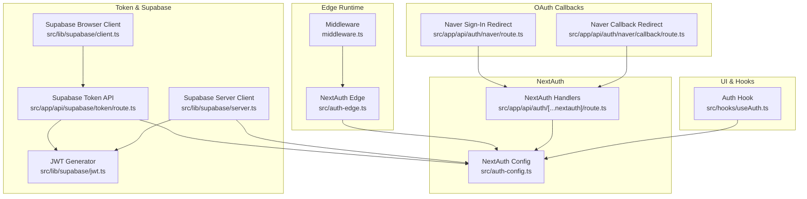
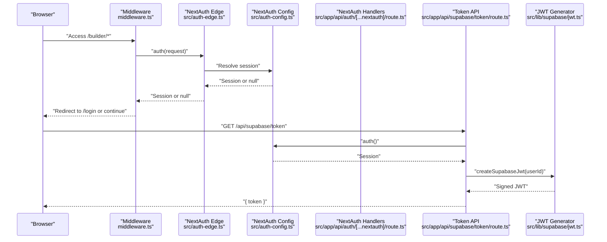
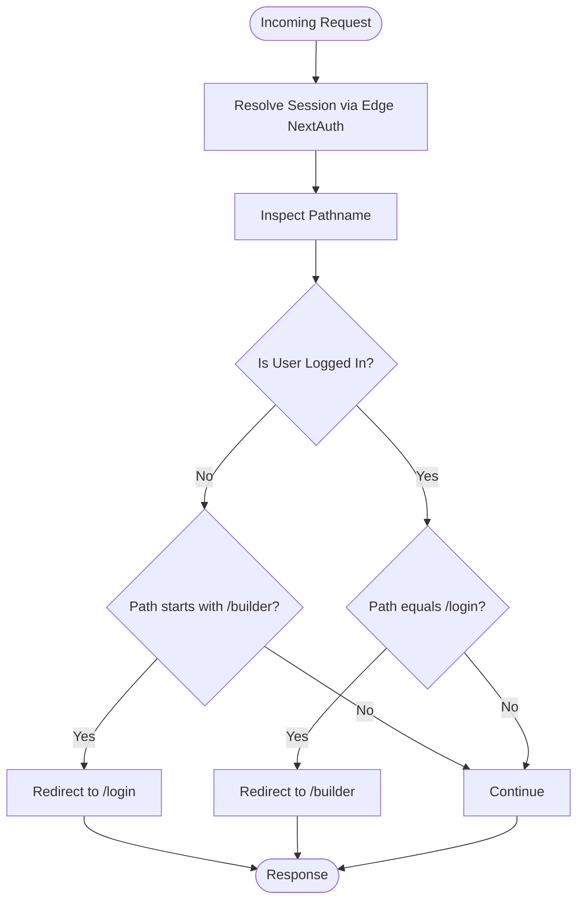
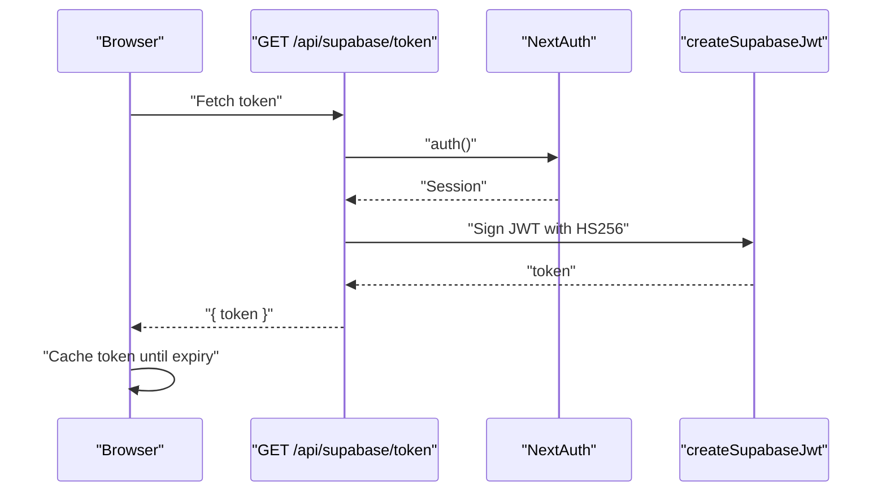
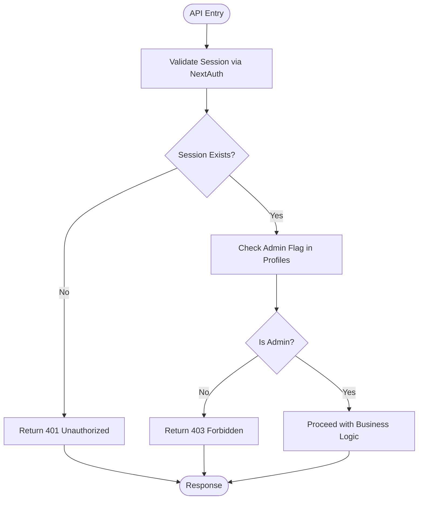
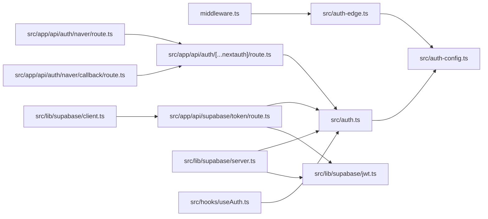

# Security Considerations

<cite>
**Referenced Files in This Document**
- [src/auth.ts](file://src/auth.ts)
- [src/auth-edge.ts](file://src/auth-edge.ts)
- [src/auth-config.ts](file://src/auth-config.ts)
- [middleware.ts](file://middleware.ts)
- [src/app/api/auth/[...nextauth]/route.ts](file://src/app/api/auth/[...nextauth]/route.ts)
- [src/app/api/auth/naver/route.ts](file://src/app/api/auth/naver/route.ts)
- [src/app/api/auth/naver/callback/route.ts](file://src/app/api/auth/naver/callback/route.ts)
- [src/app/api/supabase/token/route.ts](file://src/app/api/supabase/token/route.ts)
- [src/lib/supabase/server.ts](file://src/lib/supabase/server.ts)
- [src/lib/supabase/client.ts](file://src/lib/supabase/client.ts)
- [src/lib/supabase/jwt.ts](file://src/lib/supabase/jwt.ts)
- [src/hooks/useAuth.ts](file://src/hooks/useAuth.ts)
- [src/app/api/admin/invitations/route.ts](file://src/app/api/admin/invitations/route.ts)
- [src/app/api/guests/route.ts](file://src/app/api/guests/route.ts)
- [next.config.ts](file://next.config.ts)
- [supabase/config.toml](file://supabase/config.toml)
</cite>

## Table of Contents
1. [Introduction](#introduction)
2. [Project Structure](#project-structure)
3. [Core Components](#core-components)
4. [Architecture Overview](#architecture-overview)
5. [Detailed Component Analysis](#detailed-component-analysis)
6. [Dependency Analysis](#dependency-analysis)
7. [Performance Considerations](#performance-considerations)
8. [Troubleshooting Guide](#troubleshooting-guide)
9. [Conclusion](#conclusion)
10. [Appendices](#appendices)

## Introduction
This document consolidates authentication security considerations across the system. It focuses on CSRF protection mechanisms, session security headers, secure cookie configuration, middleware-driven authentication enforcement, route protection, token security practices, session timeout configuration, logout handling, OAuth implementation guidance (including state parameter validation and PKCE), and operational controls such as monitoring, rate limiting, and suspicious activity detection. The goal is to provide a practical, code-backed guide for maintaining robust authentication security.

## Project Structure
Authentication spans several layers:
- NextAuth configuration and providers
- Edge and server-side authentication helpers
- Middleware for route protection
- API routes for OAuth callbacks and token issuance
- Supabase client wrappers and JWT generation
- Frontend hooks for session and profile management
- Global security headers and Supabase rate-limiting configuration

**Diagram sources**
- [middleware.ts](file://middleware.ts#L1-L22)
- [src/auth-edge.ts](file://src/auth-edge.ts#L1-L5)
- [src/auth-config.ts](file://src/auth-config.ts#L1-L227)
- [src/app/api/auth/[...nextauth]/route.ts](file://src/app/api/auth/[...nextauth]/route.ts#L1-L4)
- [src/app/api/auth/naver/route.ts](file://src/app/api/auth/naver/route.ts#L1-L10)
- [src/app/api/auth/naver/callback/route.ts](file://src/app/api/auth/naver/callback/route.ts#L1-L10)
- [src/app/api/supabase/token/route.ts](file://src/app/api/supabase/token/route.ts#L1-L16)
- [src/lib/supabase/jwt.ts](file://src/lib/supabase/jwt.ts#L1-L15)
- [src/lib/supabase/server.ts](file://src/lib/supabase/server.ts#L1-L19)
- [src/lib/supabase/client.ts](file://src/lib/supabase/client.ts#L1-L85)
- [src/hooks/useAuth.ts](file://src/hooks/useAuth.ts#L1-L55)

**Section sources**
- [src/auth.ts](file://src/auth.ts#L1-L5)
- [src/auth-edge.ts](file://src/auth-edge.ts#L1-L5)
- [src/auth-config.ts](file://src/auth-config.ts#L1-L227)
- [middleware.ts](file://middleware.ts#L1-L22)
- [src/app/api/auth/[...nextauth]/route.ts](file://src/app/api/auth/[...nextauth]/route.ts#L1-L4)
- [src/app/api/auth/naver/route.ts](file://src/app/api/auth/naver/route.ts#L1-L10)
- [src/app/api/auth/naver/callback/route.ts](file://src/app/api/auth/naver/callback/route.ts#L1-L10)
- [src/app/api/supabase/token/route.ts](file://src/app/api/supabase/token/route.ts#L1-L16)
- [src/lib/supabase/server.ts](file://src/lib/supabase/server.ts#L1-L19)
- [src/lib/supabase/client.ts](file://src/lib/supabase/client.ts#L1-L85)
- [src/lib/supabase/jwt.ts](file://src/lib/supabase/jwt.ts#L1-L15)
- [src/hooks/useAuth.ts](file://src/hooks/useAuth.ts#L1-L55)

## Core Components
- NextAuth configuration defines providers, callbacks, and session strategy. It integrates with Supabase for user storage and profile upserts.
- Edge middleware enforces route protection for builder pages and login redirection logic.
- Supabase token issuance endpoint generates short-lived JWTs for authenticated browser clients.
- Supabase client wrappers manage session persistence and header injection for authenticated requests.
- Frontend hook centralizes session and profile state, including sign-out behavior.

Key security-relevant aspects:
- Session strategy set to database via NextAuth.
- Supabase JWTs are signed with HS256 and expire in 1 hour.
- Supabase client instances disable automatic session persistence and token refresh.
- Middleware redirects unauthenticated users attempting to access protected builder routes.

**Section sources**
- [src/auth-config.ts](file://src/auth-config.ts#L31-L129)
- [src/auth-config.ts](file://src/auth-config.ts#L130-L227)
- [src/auth-edge.ts](file://src/auth-edge.ts#L1-L5)
- [middleware.ts](file://middleware.ts#L4-L17)
- [src/app/api/supabase/token/route.ts](file://src/app/api/supabase/token/route.ts#L5-L15)
- [src/lib/supabase/jwt.ts](file://src/lib/supabase/jwt.ts#L5-L14)
- [src/lib/supabase/server.ts](file://src/lib/supabase/server.ts#L9-L18)
- [src/lib/supabase/client.ts](file://src/lib/supabase/client.ts#L41-L84)
- [src/hooks/useAuth.ts](file://src/hooks/useAuth.ts#L34-L37)

## Architecture Overview
The authentication architecture combines NextAuth for identity and Supabase for backend data and token issuance. Edge middleware protects routes, while API routes handle OAuth redirects and token provisioning.

**Diagram sources**
- [middleware.ts](file://middleware.ts#L4-L17)
- [src/auth-edge.ts](file://src/auth-edge.ts#L1-L5)
- [src/auth-config.ts](file://src/auth-config.ts#L1-L227)
- [src/app/api/auth/[...nextauth]/route.ts](file://src/app/api/auth/[...nextauth]/route.ts#L1-L4)
- [src/app/api/supabase/token/route.ts](file://src/app/api/supabase/token/route.ts#L5-L15)
- [src/lib/supabase/jwt.ts](file://src/lib/supabase/jwt.ts#L5-L14)

## Detailed Component Analysis

### CSRF Protection Mechanisms
- NextAuth’s default CSRF protections rely on SameSite cookies and anti-CSRF tokens managed by the framework. The configuration sets trustHost to true, which affects cookie domain handling and should be reviewed against deployment domains.
- Recommendations:
  - Ensure cookies are set with SameSite=Lax or SameSite=Strict depending on cross-site needs.
  - Verify that the host and origin match NextAuth’s expectations to avoid CSRF bypasses.
  - For custom forms or AJAX endpoints, leverage NextAuth’s built-in CSRF token handling via the framework-provided mechanisms.

Evidence in code:
- NextAuth configuration includes trustHost and provider-specific configurations.

**Section sources**
- [src/auth-config.ts](file://src/auth-config.ts#L31-L129)
- [src/auth-config.ts](file://src/auth-config.ts#L130-L227)

### Session Security Headers
- Global security headers are configured in Next.js to harden transport and rendering:
  - Content-Security-Policy with restrictive defaults and explicit connect-src for safe WebSocket and HTTP origins.
  - X-Frame-Options set to DENY.
  - X-Content-Type-Options set to nosniff.
  - Referrer-Policy set to strict-origin-when-cross-origin.
  - Strict-Transport-Security enforced for HTTPS.
  - Permissions-Policy scoped to geolocation for self.
- These headers apply site-wide and complement session security by reducing XSS and clickjacking risks.

**Section sources**
- [next.config.ts](file://next.config.ts#L54-L86)

### Secure Cookie Configuration
- NextAuth manages cookies internally. The configuration sets trustHost to true, which impacts cookie domain and SameSite behavior. Ensure deployment domains align with cookie settings to prevent leakage or CSRF.
- Recommendations:
  - Set appropriate SameSite and Secure flags for production behind HTTPS.
  - Align NextAuth cookie settings with your domain and subdomain policy.
  - Review cookie expiration and session strategy (database-based) to balance security and UX.

**Section sources**
- [src/auth-config.ts](file://src/auth-config.ts#L31-L129)
- [src/auth-config.ts](file://src/auth-config.ts#L130-L227)

### Authentication Enforcement and Route Protection
- Edge middleware enforces:
  - Redirect unauthenticated users attempting to access builder routes.
  - Redirect authenticated users away from the login page to builder.
- This provides a baseline for protecting sensitive areas.

**Diagram sources**
- [middleware.ts](file://middleware.ts#L4-L17)

**Section sources**
- [middleware.ts](file://middleware.ts#L1-L22)

### Token Security Practices
- Supabase token issuance:
  - Endpoint validates session and issues a signed JWT with HS256.
  - Token audience is set to authenticated, subject is the user ID, and expiration is 1 hour.
  - Browser client caches the token until near expiry and re-fetches via the endpoint.
- Recommendations:
  - Keep token lifetime minimal; 1 hour is reasonable for short-lived browser access.
  - Ensure SUPABASE_JWT_SECRET is strong and rotated periodically.
  - Invalidate tokens on logout by clearing cached tokens and forcing re-authentication.

**Diagram sources**
- [src/app/api/supabase/token/route.ts](file://src/app/api/supabase/token/route.ts#L5-L15)
- [src/lib/supabase/jwt.ts](file://src/lib/supabase/jwt.ts#L5-L14)

**Section sources**
- [src/app/api/supabase/token/route.ts](file://src/app/api/supabase/token/route.ts#L1-L16)
- [src/lib/supabase/jwt.ts](file://src/lib/supabase/jwt.ts#L1-L15)
- [src/lib/supabase/client.ts](file://src/lib/supabase/client.ts#L24-L62)

### Session Timeout Configuration
- NextAuth session strategy is database-based. There is no explicit session maxAge or updateAge in the configuration; timeouts depend on provider defaults and Supabase session handling.
- Supabase client wrappers disable automatic session persistence and token refresh, minimizing long-lived sessions on the client.
- Recommendations:
  - Define session.maxAge and session.updateAge in NextAuth config for explicit control.
  - Align with middleware redirect behavior to ensure timely invalidation of protected routes.

**Section sources**
- [src/auth-config.ts](file://src/auth-config.ts#L37-L37)
- [src/lib/supabase/server.ts](file://src/lib/supabase/server.ts#L14-L17)
- [src/lib/supabase/client.ts](file://src/lib/supabase/client.ts#L71-L77)

### Logout Handling
- Frontend logout clears cached queries and invokes NextAuth’s signOut with a callback URL to the home page.
- Recommendations:
  - Invalidate server-side sessions if applicable.
  - Clear browser cache of tokens and local state.
  - Ensure logout redirects to a safe, public page.

**Section sources**
- [src/hooks/useAuth.ts](file://src/hooks/useAuth.ts#L34-L37)

### Protecting API Routes
- Admin-only route enforces:
  - Session validation via NextAuth.
  - Admin permission checks via Supabase profiles table.
  - Returns 401/403 appropriately.
- Guest route demonstrates:
  - Input validation with Zod.
  - Supabase client creation with optional session for anonymous access.

**Diagram sources**
- [src/app/api/admin/invitations/route.ts](file://src/app/api/admin/invitations/route.ts#L8-L31)

**Section sources**
- [src/app/api/admin/invitations/route.ts](file://src/app/api/admin/invitations/route.ts#L1-L64)
- [src/app/api/guests/route.ts](file://src/app/api/guests/route.ts#L1-L124)
- [src/lib/supabase/server.ts](file://src/lib/supabase/server.ts#L9-L18)

### OAuth Implementation Guidance
- Providers:
  - Naver and Kakao are configured with allowDangerousEmailAccountLinking enabled. This can increase risk if not paired with admin verification and profile upsert safeguards.
  - Authorization scopes are explicitly set for minimal data exposure.
- Callbacks:
  - Naver sign-in and callback routes redirect to NextAuth endpoints, ensuring OAuth flows are handled securely by the framework.
- Recommendations:
  - Validate state parameter on callback to prevent CSRF and replay attacks.
  - Prefer PKCE for public clients to mitigate authorization code interception.
  - Enforce admin email lists and profile upsert policies to limit account takeover risks.

**Section sources**
- [src/auth-config.ts](file://src/auth-config.ts#L39-L78)
- [src/app/api/auth/naver/route.ts](file://src/app/api/auth/naver/route.ts#L1-L10)
- [src/app/api/auth/naver/callback/route.ts](file://src/app/api/auth/naver/callback/route.ts#L1-L10)

### Monitoring, Rate Limiting, and Suspicious Activity Detection
- Supabase rate limits are configured for various auth operations (sign-ups, sign-ins, verifications, SMS/email sends).
- Next.js headers include security hardening that reduces attack surface.
- Recommendations:
  - Monitor auth failure spikes and failed token issuance patterns.
  - Integrate external rate limiting (e.g., CDN or WAF) for brute-force prevention.
  - Add anomaly detection for geographic or device irregularities around login events.

**Section sources**
- [supabase/config.toml](file://supabase/config.toml#L176-L196)
- [next.config.ts](file://next.config.ts#L54-L86)

## Dependency Analysis

**Diagram sources**
- [src/auth.ts](file://src/auth.ts#L1-L5)
- [src/auth-edge.ts](file://src/auth-edge.ts#L1-L5)
- [src/auth-config.ts](file://src/auth-config.ts#L1-L227)
- [middleware.ts](file://middleware.ts#L1-L22)
- [src/app/api/auth/[...nextauth]/route.ts](file://src/app/api/auth/[...nextauth]/route.ts#L1-L4)
- [src/app/api/auth/naver/route.ts](file://src/app/api/auth/naver/route.ts#L1-L10)
- [src/app/api/auth/naver/callback/route.ts](file://src/app/api/auth/naver/callback/route.ts#L1-L10)
- [src/app/api/supabase/token/route.ts](file://src/app/api/supabase/token/route.ts#L1-L16)
- [src/lib/supabase/jwt.ts](file://src/lib/supabase/jwt.ts#L1-L15)
- [src/lib/supabase/server.ts](file://src/lib/supabase/server.ts#L1-L19)
- [src/lib/supabase/client.ts](file://src/lib/supabase/client.ts#L1-L85)
- [src/hooks/useAuth.ts](file://src/hooks/useAuth.ts#L1-L55)

**Section sources**
- [src/auth.ts](file://src/auth.ts#L1-L5)
- [src/auth-edge.ts](file://src/auth-edge.ts#L1-L5)
- [src/auth-config.ts](file://src/auth-config.ts#L1-L227)
- [middleware.ts](file://middleware.ts#L1-L22)
- [src/app/api/auth/[...nextauth]/route.ts](file://src/app/api/auth/[...nextauth]/route.ts#L1-L4)
- [src/app/api/auth/naver/route.ts](file://src/app/api/auth/naver/route.ts#L1-L10)
- [src/app/api/auth/naver/callback/route.ts](file://src/app/api/auth/naver/callback/route.ts#L1-L10)
- [src/app/api/supabase/token/route.ts](file://src/app/api/supabase/token/route.ts#L1-L16)
- [src/lib/supabase/jwt.ts](file://src/lib/supabase/jwt.ts#L1-L15)
- [src/lib/supabase/server.ts](file://src/lib/supabase/server.ts#L1-L19)
- [src/lib/supabase/client.ts](file://src/lib/supabase/client.ts#L1-L85)
- [src/hooks/useAuth.ts](file://src/hooks/useAuth.ts#L1-L55)

## Performance Considerations
- Short-lived JWTs reduce token validity windows and improve security at the cost of more frequent token refreshes.
- Disabling automatic session persistence and token refresh on Supabase clients reduces unnecessary network calls and minimizes long-lived tokens on the client.
- Middleware redirection avoids heavy server work for unauthenticated users, improving perceived performance.

[No sources needed since this section provides general guidance]

## Troubleshooting Guide
Common issues and mitigations:
- Unauthorized or forbidden responses from protected APIs:
  - Verify session resolution via NextAuth and that the user has admin permissions in the profiles table.
- Token fetch failures:
  - Confirm SUPABASE_JWT_SECRET is set and the token endpoint returns 200 OK for authenticated users.
- OAuth callback errors:
  - Ensure state parameter validation and PKCE usage to prevent interception and CSRF.
- Middleware redirect loops:
  - Confirm middleware matcher paths and that logged-in users are redirected away from the login page.

**Section sources**
- [src/app/api/admin/invitations/route.ts](file://src/app/api/admin/invitations/route.ts#L8-L31)
- [src/app/api/supabase/token/route.ts](file://src/app/api/supabase/token/route.ts#L5-L15)
- [src/app/api/auth/naver/callback/route.ts](file://src/app/api/auth/naver/callback/route.ts#L1-L10)
- [middleware.ts](file://middleware.ts#L19-L21)

## Conclusion
The system employs NextAuth for identity management, edge middleware for route protection, and Supabase for backend data and token issuance. Security headers and Supabase rate limits provide additional defense-in-depth. To strengthen CSRF protection, enforce state parameter validation and PKCE for OAuth, and configure explicit session timeouts. Monitor auth attempts and apply rate limiting to detect and deter abuse.

[No sources needed since this section summarizes without analyzing specific files]

## Appendices
- Practical examples:
  - Implementing authentication middleware: see middleware.ts.
  - Protecting API routes: see src/app/api/admin/invitations/route.ts.
  - Securing sensitive operations: see src/app/api/guests/route.ts and Supabase client wrappers.
  - OAuth callback handling: see src/app/api/auth/naver/route.ts and src/app/api/auth/naver/callback/route.ts.

[No sources needed since this section provides general guidance]