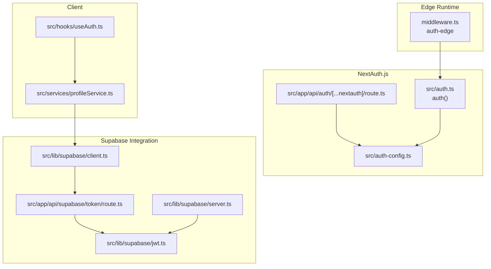
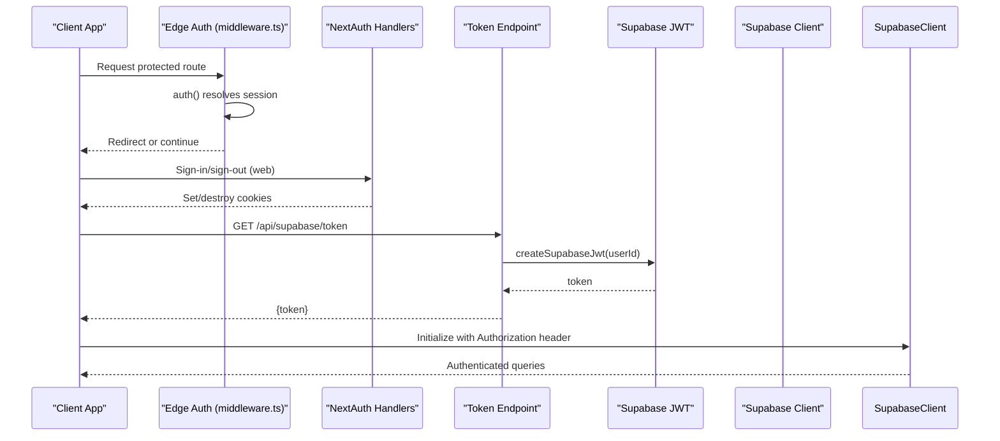
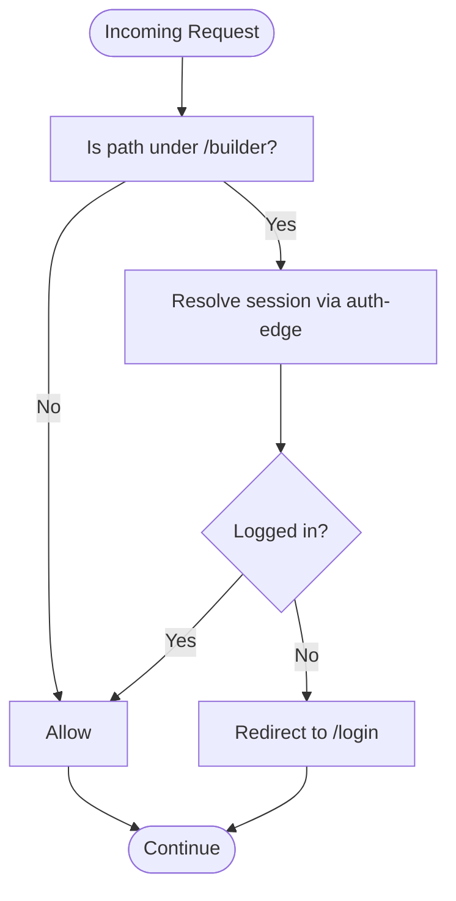
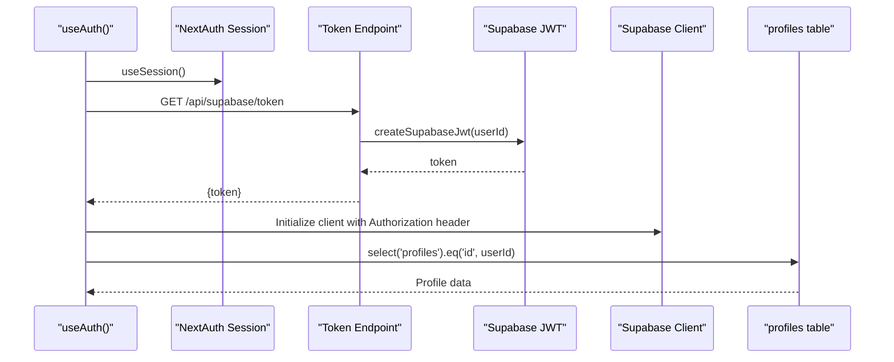
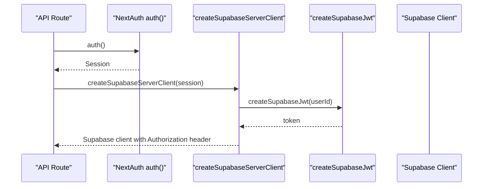
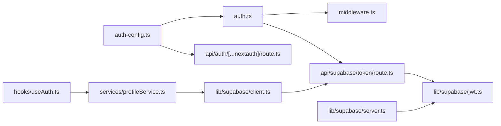

# Session Management

<cite>
**Referenced Files in This Document**
- [src/auth.ts](file://src/auth.ts)
- [src/auth-edge.ts](file://src/auth-edge.ts)
- [src/auth-config.ts](file://src/auth-config.ts)
- [src/app/api/auth/[...nextauth]/route.ts](file://src/app/api/auth/[...nextauth]/route.ts)
- [src/app/api/supabase/token/route.ts](file://src/app/api/supabase/token/route.ts)
- [src/lib/supabase/server.ts](file://src/lib/supabase/server.ts)
- [src/lib/supabase/client.ts](file://src/lib/supabase/client.ts)
- [src/lib/supabase/jwt.ts](file://src/lib/supabase/jwt.ts)
- [middleware.ts](file://middleware.ts)
- [src/hooks/useAuth.ts](file://src/hooks/useAuth.ts)
- [src/types/next-auth.d.ts](file://src/types/next-auth.d.ts)
- [src/services/profileService.ts](file://src/services/profileService.ts)
- [src/app/api/profiles/route.ts](file://src/app/api/profiles/route.ts)
</cite>

## Table of Contents
1. [Introduction](#introduction)
2. [Project Structure](#project-structure)
3. [Core Components](#core-components)
4. [Architecture Overview](#architecture-overview)
5. [Detailed Component Analysis](#detailed-component-analysis)
6. [Dependency Analysis](#dependency-analysis)
7. [Performance Considerations](#performance-considerations)
8. [Troubleshooting Guide](#troubleshooting-guide)
9. [Conclusion](#conclusion)

## Introduction
This document explains session management in the authentication system, focusing on the edge runtime authentication implementation using the auth() function wrapper. It covers session creation, validation, and destruction; server-side session handling; cookie management; session persistence strategies; authentication guards and protected routes; session state synchronization; integration between NextAuth.js sessions and Supabase for user data retrieval; and security measures such as CSRF protection, session regeneration, and timeout handling. Practical examples illustrate guards, protected routes, and session synchronization patterns.

## Project Structure
The authentication system is built around NextAuth.js with a Supabase-backed adapter and a custom JWT strategy for Supabase client initialization. Edge middleware enforces protected routes, while API routes bridge NextAuth sessions to Supabase tokens. Client-side utilities manage Supabase client instantiation with short-lived JWTs.

**Diagram sources**
- [middleware.ts](file://middleware.ts#L1-L22)
- [src/auth.ts](file://src/auth.ts#L1-L5)
- [src/auth-config.ts](file://src/auth-config.ts#L1-L227)
- [src/app/api/auth/[...nextauth]/route.ts](file://src/app/api/auth/[...nextauth]/route.ts#L1-L4)
- [src/lib/supabase/jwt.ts](file://src/lib/supabase/jwt.ts#L1-L15)
- [src/lib/supabase/server.ts](file://src/lib/supabase/server.ts#L1-L19)
- [src/lib/supabase/client.ts](file://src/lib/supabase/client.ts#L1-L85)
- [src/app/api/supabase/token/route.ts](file://src/app/api/supabase/token/route.ts#L1-L16)
- [src/hooks/useAuth.ts](file://src/hooks/useAuth.ts#L1-L55)
- [src/services/profileService.ts](file://src/services/profileService.ts#L1-L101)

**Section sources**
- [src/auth.ts](file://src/auth.ts#L1-L5)
- [src/auth-edge.ts](file://src/auth-edge.ts#L1-L5)
- [src/auth-config.ts](file://src/auth-config.ts#L1-L227)
- [src/app/api/auth/[...nextauth]/route.ts](file://src/app/api/auth/[...nextauth]/route.ts#L1-L4)
- [src/app/api/supabase/token/route.ts](file://src/app/api/supabase/token/route.ts#L1-L16)
- [src/lib/supabase/server.ts](file://src/lib/supabase/server.ts#L1-L19)
- [src/lib/supabase/client.ts](file://src/lib/supabase/client.ts#L1-L85)
- [src/lib/supabase/jwt.ts](file://src/lib/supabase/jwt.ts#L1-L15)
- [middleware.ts](file://middleware.ts#L1-L22)
- [src/hooks/useAuth.ts](file://src/hooks/useAuth.ts#L1-L55)
- [src/services/profileService.ts](file://src/services/profileService.ts#L1-L101)

## Core Components
- NextAuth configuration and providers: Defines the adapter, session strategy, providers, and callbacks for user creation/upsert and session augmentation.
- Edge runtime auth(): Provides auth() for middleware and route guards without exposing handlers.
- Web runtime auth(): Exposes handlers and auth() for web routes.
- Supabase JWT generation: Creates short-lived JWTs scoped to authenticated users.
- Supabase client factories: Server and browser clients configured to use NextAuth sessions and Supabase JWTs.
- Token endpoint: Issues a signed JWT for the current user session.
- Middleware guard: Redirects unauthenticated users attempting to access protected paths.
- Client hooks and services: Manage session state and synchronize profile data with Supabase.

**Section sources**
- [src/auth-config.ts](file://src/auth-config.ts#L31-L227)
- [src/auth-edge.ts](file://src/auth-edge.ts#L1-L5)
- [src/auth.ts](file://src/auth.ts#L1-L5)
- [src/lib/supabase/jwt.ts](file://src/lib/supabase/jwt.ts#L1-L15)
- [src/lib/supabase/server.ts](file://src/lib/supabase/server.ts#L1-L19)
- [src/lib/supabase/client.ts](file://src/lib/supabase/client.ts#L1-L85)
- [src/app/api/supabase/token/route.ts](file://src/app/api/supabase/token/route.ts#L1-L16)
- [middleware.ts](file://middleware.ts#L1-L22)
- [src/hooks/useAuth.ts](file://src/hooks/useAuth.ts#L1-L55)
- [src/services/profileService.ts](file://src/services/profileService.ts#L1-L101)

## Architecture Overview
The system uses NextAuth.js with a database session strategy backed by Supabase. Authentication requests are handled by NextAuth routes. The edge runtime uses auth() to enforce protected routes. For Supabase access, the client obtains a short-lived JWT from a dedicated endpoint and initializes a Supabase client with that token. Profile data is stored in the Supabase public schema and synchronized via client hooks.

**Diagram sources**
- [middleware.ts](file://middleware.ts#L1-L22)
- [src/app/api/auth/[...nextauth]/route.ts](file://src/app/api/auth/[...nextauth]/route.ts#L1-L4)
- [src/app/api/supabase/token/route.ts](file://src/app/api/supabase/token/route.ts#L1-L16)
- [src/lib/supabase/jwt.ts](file://src/lib/supabase/jwt.ts#L1-L15)
- [src/lib/supabase/client.ts](file://src/lib/supabase/client.ts#L1-L85)

## Detailed Component Analysis

### NextAuth Configuration and Providers
- Adapter: Uses SupabaseAdapter to store NextAuth data in the next_auth schema.
- Session strategy: database strategy ensures sessions are persisted server-side.
- Providers: Naver, Kakao, and Credentials (admin login).
- Callbacks:
  - signIn: Upserts user profiles into the public schema; sets admin flags; handles provider-specific profile normalization.
  - session: Augments session.user with the NextAuth user id.

Security and behavior:
- trustHost: Allows NextAuth to operate behind proxies/load balancers.
- Provider configurations include scopes and profile transformations.

**Section sources**
- [src/auth-config.ts](file://src/auth-config.ts#L31-L227)

### Edge Runtime Authentication (auth-edge)
- Exposes auth() for edge environments (middleware).
- Does not export handlers, preventing accidental exposure of NextAuth endpoints in edge contexts.

Usage pattern:
- Used in middleware to guard routes and redirect unauthenticated users.

**Section sources**
- [src/auth-edge.ts](file://src/auth-edge.ts#L1-L5)
- [middleware.ts](file://middleware.ts#L1-L22)

### Web Runtime Authentication (auth)
- Exports handlers and auth() for web routes.
- API route forwards all NextAuth requests to handlers.

Integration:
- Ensures sign-in/sign-out cookies are managed consistently across the app.

**Section sources**
- [src/auth.ts](file://src/auth.ts#L1-L5)
- [src/app/api/auth/[...nextauth]/route.ts](file://src/app/api/auth/[...nextauth]/route.ts#L1-L4)

### Supabase JWT and Token Endpoint
- JWT creation: Generates a short-lived HS256-signed JWT with subject set to the user id and audience "authenticated".
- Token endpoint: Returns a JWT for the currently authenticated user; responds 401 if not logged in.

Client integration:
- Browser client fetches a token and initializes a Supabase client with Authorization header.
- Server factory accepts a NextAuth session and creates a Supabase client using the generated JWT.

**Section sources**
- [src/lib/supabase/jwt.ts](file://src/lib/supabase/jwt.ts#L1-L15)
- [src/app/api/supabase/token/route.ts](file://src/app/api/supabase/token/route.ts#L1-L16)
- [src/lib/supabase/server.ts](file://src/lib/supabase/server.ts#L1-L19)
- [src/lib/supabase/client.ts](file://src/lib/supabase/client.ts#L1-L85)

### Protected Routes and Guards
- Middleware enforces authentication for specific paths (/builder/*) and redirects accordingly.
- Uses edge auth() to resolve session state without relying on cookies in edge.

**Diagram sources**
- [middleware.ts](file://middleware.ts#L1-L22)

**Section sources**
- [middleware.ts](file://middleware.ts#L1-L22)

### Session State Synchronization
- Client hook:
  - Reads NextAuth session via next-auth/react.
  - Fetches profile data from Supabase using a browser client initialized with a fresh token.
  - Provides helpers to refresh profile and sign out.
- Profile service:
  - Retrieves and updates profile records in the public schema.
  - Handles errors gracefully and exposes convenience checks (admin, completeness).

**Diagram sources**
- [src/hooks/useAuth.ts](file://src/hooks/useAuth.ts#L1-L55)
- [src/app/api/supabase/token/route.ts](file://src/app/api/supabase/token/route.ts#L1-L16)
- [src/lib/supabase/jwt.ts](file://src/lib/supabase/jwt.ts#L1-L15)
- [src/lib/supabase/client.ts](file://src/lib/supabase/client.ts#L1-L85)
- [src/services/profileService.ts](file://src/services/profileService.ts#L1-L101)

**Section sources**
- [src/hooks/useAuth.ts](file://src/hooks/useAuth.ts#L1-L55)
- [src/services/profileService.ts](file://src/services/profileService.ts#L1-L101)

### Server-Side Session Handling and Supabase Integration
- Server client factory:
  - Accepts a NextAuth session or resolves it internally.
  - Generates a JWT for the user and initializes a Supabase client with Authorization header.
  - Disables automatic session persistence and token refresh for server-side clients.
- API routes:
  - Validate session via auth().
  - Use server client factory to access Supabase with authenticated credentials.

**Diagram sources**
- [src/app/api/profiles/route.ts](file://src/app/api/profiles/route.ts#L1-L125)
- [src/lib/supabase/server.ts](file://src/lib/supabase/server.ts#L1-L19)
- [src/lib/supabase/jwt.ts](file://src/lib/supabase/jwt.ts#L1-L15)

**Section sources**
- [src/lib/supabase/server.ts](file://src/lib/supabase/server.ts#L1-L19)
- [src/app/api/profiles/route.ts](file://src/app/api/profiles/route.ts#L1-L125)

### Cookie Management and Session Persistence
- NextAuth manages session cookies server-side; the system uses a database session strategy.
- Edge runtime relies on auth() to resolve session state without depending on cookies.
- Supabase clients are initialized per request with short-lived JWTs; persistence is disabled to avoid stale sessions.

**Section sources**
- [src/auth-config.ts](file://src/auth-config.ts#L37-L38)
- [src/lib/supabase/server.ts](file://src/lib/supabase/server.ts#L14-L17)
- [src/lib/supabase/client.ts](file://src/lib/supabase/client.ts#L71-L77)

### Session Security Measures
- CSRF protection: NextAuth.js provides CSRF protection for OAuth flows and forms; ensure anti-CSRF headers are respected by clients.
- Session regeneration: Not explicitly configured; consider rotating session tokens on sensitive actions if needed.
- Timeout handling: NextAuth session timeouts are governed by provider settings; adjust session maxAge as required.
- Short-lived JWTs: Supabase JWTs expire in one hour, reducing risk from leaked tokens.

**Section sources**
- [src/lib/supabase/jwt.ts](file://src/lib/supabase/jwt.ts#L12-L13)
- [src/auth-config.ts](file://src/auth-config.ts#L37-L38)

## Dependency Analysis
The following diagram shows key dependencies among authentication and Supabase components.

**Diagram sources**
- [src/auth-config.ts](file://src/auth-config.ts#L1-L227)
- [src/auth.ts](file://src/auth.ts#L1-L5)
- [src/app/api/auth/[...nextauth]/route.ts](file://src/app/api/auth/[...nextauth]/route.ts#L1-L4)
- [middleware.ts](file://middleware.ts#L1-L22)
- [src/app/api/supabase/token/route.ts](file://src/app/api/supabase/token/route.ts#L1-L16)
- [src/lib/supabase/jwt.ts](file://src/lib/supabase/jwt.ts#L1-L15)
- [src/lib/supabase/server.ts](file://src/lib/supabase/server.ts#L1-L19)
- [src/lib/supabase/client.ts](file://src/lib/supabase/client.ts#L1-L85)
- [src/hooks/useAuth.ts](file://src/hooks/useAuth.ts#L1-L55)
- [src/services/profileService.ts](file://src/services/profileService.ts#L1-L101)

**Section sources**
- [src/auth-config.ts](file://src/auth-config.ts#L1-L227)
- [src/auth.ts](file://src/auth.ts#L1-L5)
- [src/app/api/auth/[...nextauth]/route.ts](file://src/app/api/auth/[...nextauth]/route.ts#L1-L4)
- [src/app/api/supabase/token/route.ts](file://src/app/api/supabase/token/route.ts#L1-L16)
- [src/lib/supabase/jwt.ts](file://src/lib/supabase/jwt.ts#L1-L15)
- [src/lib/supabase/server.ts](file://src/lib/supabase/server.ts#L1-L19)
- [src/lib/supabase/client.ts](file://src/lib/supabase/client.ts#L1-L85)
- [middleware.ts](file://middleware.ts#L1-L22)
- [src/hooks/useAuth.ts](file://src/hooks/useAuth.ts#L1-L55)
- [src/services/profileService.ts](file://src/services/profileService.ts#L1-L101)

## Performance Considerations
- Short-lived JWTs: Reduce token lifetime to minimize exposure; cache tokens client-side until expiration.
- Token caching: Avoid redundant token fetches by checking expiry timestamps and reusing valid tokens.
- Lazy client initialization: Initialize Supabase client only when a token is present to reduce overhead.
- Stale-time queries: Use appropriate staleTime for profile queries to balance freshness and performance.
- Parallelization: Fetch session and request body concurrently in API routes to reduce latency.

[No sources needed since this section provides general guidance]

## Troubleshooting Guide
Common issues and resolutions:
- Unauthorized token request:
  - Symptom: Token endpoint returns 401.
  - Cause: No active NextAuth session.
  - Resolution: Ensure user is signed in; verify auth() resolves a session before requesting a token.
  - Section sources
    - [src/app/api/supabase/token/route.ts](file://src/app/api/supabase/token/route.ts#L9-L11)
- Missing Supabase environment variables:
  - Symptom: Critical error logs during NextAuth initialization.
  - Cause: Missing NEXT_PUBLIC_SUPABASE_URL or SUPABASE_SERVICE_ROLE_KEY.
  - Resolution: Set required environment variables.
  - Section sources
    - [src/auth-config.ts](file://src/auth-config.ts#L11-L13)
- Profile fetch failures:
  - Symptom: Profile service returns null despite existing data.
  - Cause: Errors like "record not found" or table missing are handled gracefully; unexpected errors are logged.
  - Resolution: Verify table existence and row permissions; check network conditions.
  - Section sources
    - [src/services/profileService.ts](file://src/services/profileService.ts#L34-L51)
- Protected route redirect loops:
  - Symptom: Redirects to login or builder repeatedly.
  - Cause: Misconfigured middleware matcher or session resolution issues.
  - Resolution: Confirm middleware matcher and auth-edge usage for protected paths.
  - Section sources
    - [middleware.ts](file://middleware.ts#L19-L22)
- Session not propagating to Supabase:
  - Symptom: Supabase queries fail with unauthorized.
  - Cause: Missing Authorization header or invalid/expired token.
  - Resolution: Ensure token endpoint is called after sign-in and client is re-initialized with the new token.
  - Section sources
    - [src/lib/supabase/client.ts](file://src/lib/supabase/client.ts#L64-L81)
    - [src/app/api/supabase/token/route.ts](file://src/app/api/supabase/token/route.ts#L13-L14)

## Conclusion
The authentication system combines NextAuth.js with a Supabase-backed adapter and a custom JWT strategy for secure, server-managed sessions. Edge middleware enforces protected routes using auth(), while web routes leverage NextAuth handlers. Supabase clients are initialized per request with short-lived JWTs, ensuring minimal risk and predictable behavior. Session state synchronization is handled client-side via hooks and services, enabling seamless integration with user profiles stored in the Supabase public schema. Security is strengthened through CSRF-aware NextAuth flows, short-lived tokens, and careful session handling across edge and web contexts.