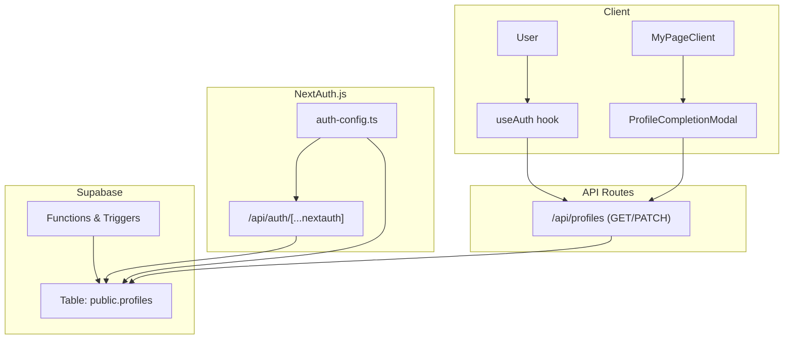
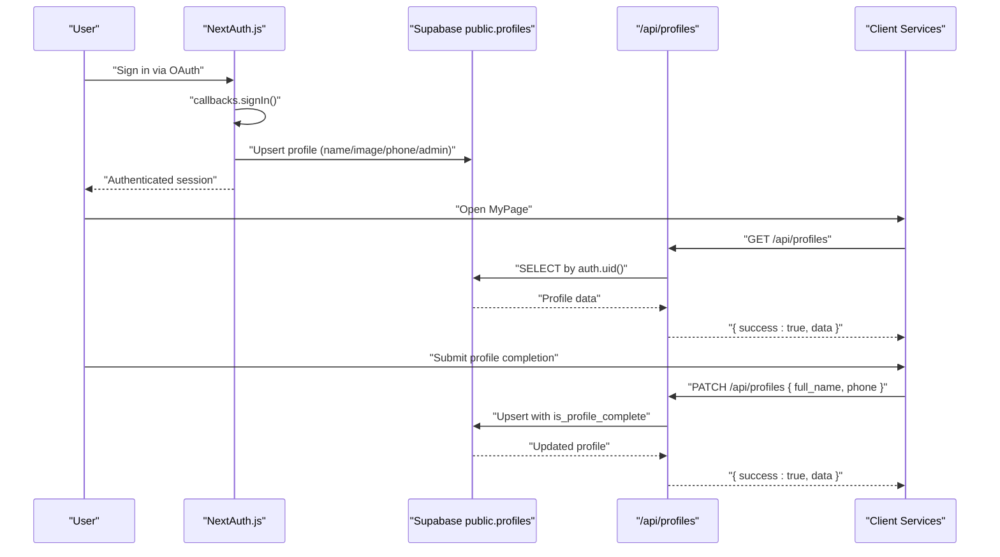
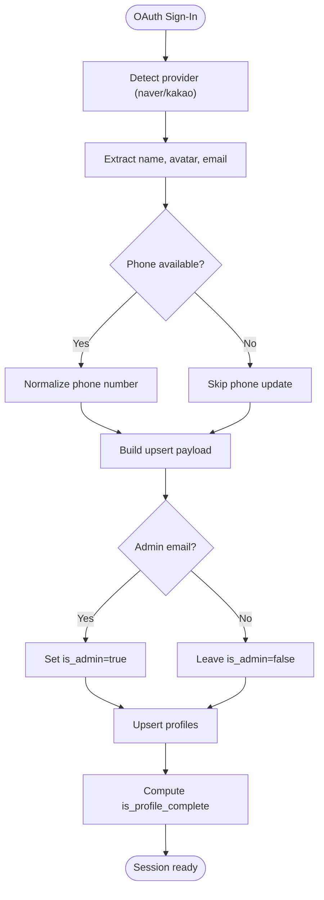
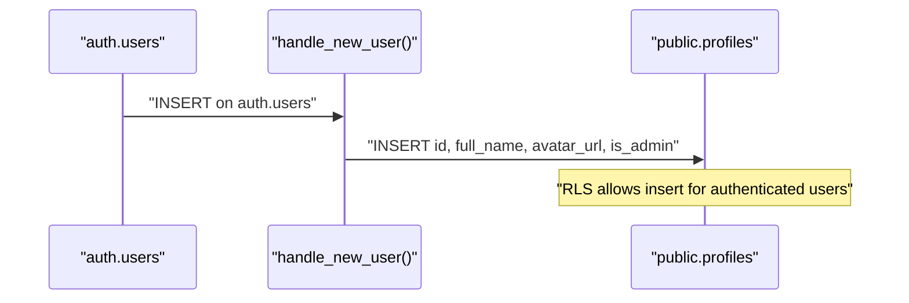
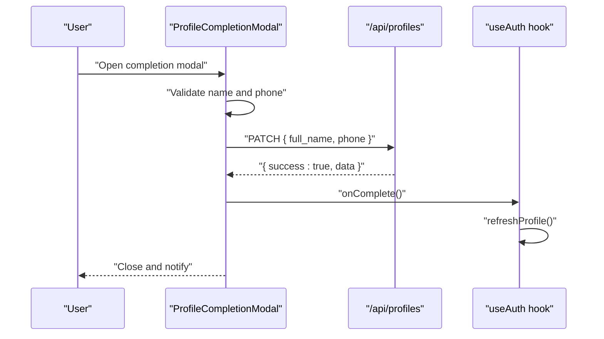
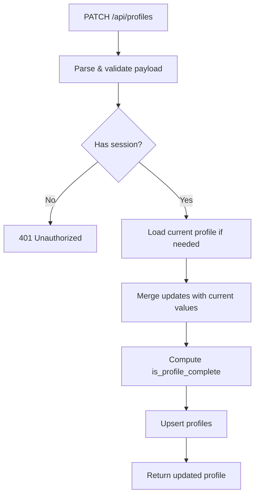
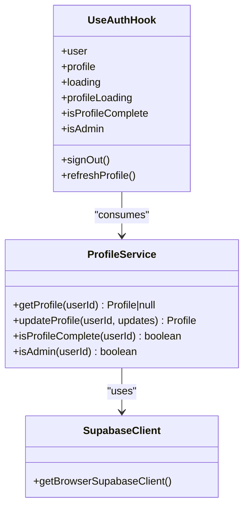
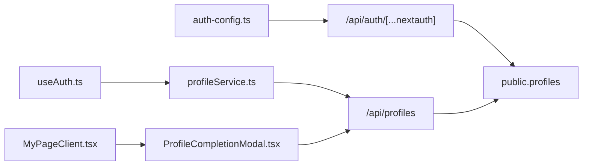
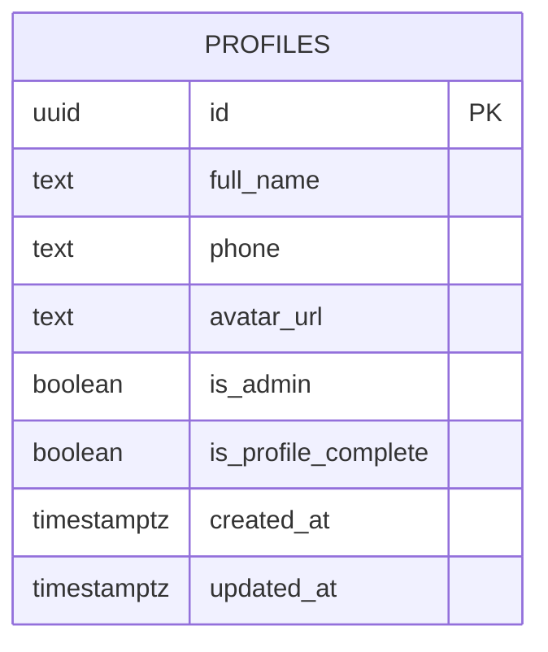

# User Profile Synchronization

<cite>
**Referenced Files in This Document**
- [src/services/profileService.ts](file://src/services/profileService.ts)
- [src/app/api/profiles/route.ts](file://src/app/api/profiles/route.ts)
- [src/lib/supabase/client.ts](file://src/lib/supabase/client.ts)
- [src/lib/supabase/server.ts](file://src/lib/supabase/server.ts)
- [src/components/auth/ProfileCompletionModal.tsx](file://src/components/auth/ProfileCompletionModal.tsx)
- [src/auth-config.ts](file://src/auth-config.ts)
- [src/app/api/auth/[...nextauth]/route.ts](file://src/app/api/auth/[...nextauth]/route.ts)
- [src/app/api/auth/naver/callback/route.ts](file://src/app/api/auth/naver/callback/route.ts)
- [src/hooks/useAuth.ts](file://src/hooks/useAuth.ts)
- [src/app/mypage/page.tsx](file://src/app/mypage/page.tsx)
- [src/app/mypage/MyPageClient.tsx](file://src/app/mypage/MyPageClient.tsx)
- [supabase/migrations/20260114063537_add_profiles_and_approval_requests.sql](file://supabase/migrations/20260114063537_add_profiles_and_approval_requests.sql)
- [supabase/migrations/20260115000000_add_naver_id_to_profiles.sql](file://supabase/migrations/20260115000000_add_naver_id_to_profiles.sql)
</cite>

## Table of Contents
1. [Introduction](#introduction)
2. [Project Structure](#project-structure)
3. [Core Components](#core-components)
4. [Architecture Overview](#architecture-overview)
5. [Detailed Component Analysis](#detailed-component-analysis)
6. [Dependency Analysis](#dependency-analysis)
7. [Performance Considerations](#performance-considerations)
8. [Troubleshooting Guide](#troubleshooting-guide)
9. [Conclusion](#conclusion)
10. [Appendices](#appendices)

## Introduction
This document explains how user profiles are synchronized between OAuth providers and the Supabase database. It covers:
- First-time login profile creation and population from OAuth claims
- User data mapping from Naver and Kakao OAuth providers
- Profile completion workflows and the modal-driven onboarding flow
- Integration between NextAuth.js sessions and Supabase profiles
- Practical profile update operations, validation, and error handling
- Data consistency strategies, synchronization triggers, and privacy considerations
- Guidance for extending profile fields and customizing the completion process

## Project Structure
The profile synchronization spans three layers:
- Authentication layer: NextAuth.js with Supabase adapter and provider-specific profile mapping
- API layer: Next.js routes for profile retrieval and updates
- Client layer: Services, hooks, and UI components for profile completion and onboarding

**Diagram sources**
- [src/hooks/useAuth.ts](file://src/hooks/useAuth.ts#L9-L54)
- [src/components/auth/ProfileCompletionModal.tsx](file://src/components/auth/ProfileCompletionModal.tsx#L1-L134)
- [src/app/mypage/MyPageClient.tsx](file://src/app/mypage/MyPageClient.tsx#L61-L560)
- [src/auth-config.ts](file://src/auth-config.ts#L31-L226)
- [src/app/api/auth/[...nextauth]/route.ts](file://src/app/api/auth/[...nextauth]/route.ts#L1-L4)
- [src/app/api/profiles/route.ts](file://src/app/api/profiles/route.ts#L1-L124)
- [supabase/migrations/20260114063537_add_profiles_and_approval_requests.sql](file://supabase/migrations/20260114063537_add_profiles_and_approval_requests.sql#L18-L107)

**Section sources**
- [src/auth-config.ts](file://src/auth-config.ts#L31-L226)
- [src/app/api/profiles/route.ts](file://src/app/api/profiles/route.ts#L1-L124)
- [src/services/profileService.ts](file://src/services/profileService.ts#L1-L101)
- [src/lib/supabase/client.ts](file://src/lib/supabase/client.ts#L1-L85)
- [src/lib/supabase/server.ts](file://src/lib/supabase/server.ts#L1-L19)
- [src/components/auth/ProfileCompletionModal.tsx](file://src/components/auth/ProfileCompletionModal.tsx#L1-L134)
- [src/hooks/useAuth.ts](file://src/hooks/useAuth.ts#L1-L55)
- [src/app/mypage/MyPageClient.tsx](file://src/app/mypage/MyPageClient.tsx#L61-L560)
- [supabase/migrations/20260114063537_add_profiles_and_approval_requests.sql](file://supabase/migrations/20260114063537_add_profiles_and_approval_requests.sql#L18-L107)

## Core Components
- Profile service: Provides typed profile model, getters, and update operations
- API routes: Secure profile retrieval and upsert/update pipeline with validation
- NextAuth.js configuration: Provider mapping, profile upsert on sign-in, admin handling
- Client-side hooks and modal: Profile completion UX and onboarding flow
- Supabase schema and triggers: Profiles table, RLS policies, automatic profile creation, updated_at trigger

**Section sources**
- [src/services/profileService.ts](file://src/services/profileService.ts#L3-L101)
- [src/app/api/profiles/route.ts](file://src/app/api/profiles/route.ts#L7-L124)
- [src/auth-config.ts](file://src/auth-config.ts#L130-L226)
- [src/components/auth/ProfileCompletionModal.tsx](file://src/components/auth/ProfileCompletionModal.tsx#L13-L134)
- [src/hooks/useAuth.ts](file://src/hooks/useAuth.ts#L9-L54)
- [supabase/migrations/20260114063537_add_profiles_and_approval_requests.sql](file://supabase/migrations/20260114063537_add_profiles_and_approval_requests.sql#L18-L107)

## Architecture Overview
The system integrates OAuth identity with Supabase profiles through two primary flows:
- On first login: NextAuth.js callbacks upsert a profile record and compute completion status
- On subsequent edits: Client calls API routes to update profile fields and toggle completion

**Diagram sources**
- [src/auth-config.ts](file://src/auth-config.ts#L130-L218)
- [src/app/api/profiles/route.ts](file://src/app/api/profiles/route.ts#L13-L124)
- [src/services/profileService.ts](file://src/services/profileService.ts#L26-L91)

## Detailed Component Analysis

### OAuth-to-Supabase Profile Mapping
- Providers: Naver and Kakao
- Mapping logic extracts identifiers, names, emails, avatars, and phone numbers
- Upsert payload sets admin flag based on configured admin emails and conditionally sets phone and completion status only when provider-provided data is present

**Diagram sources**
- [src/auth-config.ts](file://src/auth-config.ts#L154-L218)

**Section sources**
- [src/auth-config.ts](file://src/auth-config.ts#L40-L78)
- [src/auth-config.ts](file://src/auth-config.ts#L154-L218)

### Profile Creation During First Login
- Supabase trigger automatically creates a profile on user signup
- NextAuth.js callbacks enrich the profile with OAuth-derived data and set completion status when applicable

**Diagram sources**
- [supabase/migrations/20260114063537_add_profiles_and_approval_requests.sql](file://supabase/migrations/20260114063537_add_profiles_and_approval_requests.sql#L81-L107)

**Section sources**
- [supabase/migrations/20260114063537_add_profiles_and_approval_requests.sql](file://supabase/migrations/20260114063537_add_profiles_and_approval_requests.sql#L18-L107)
- [src/auth-config.ts](file://src/auth-config.ts#L154-L218)

### Profile Completion Workflow and Modal
- The modal collects name and phone, validates phone format, and submits to the profile API
- On success, the modal signals completion and the client refreshes to reflect updated completion status

**Diagram sources**
- [src/components/auth/ProfileCompletionModal.tsx](file://src/components/auth/ProfileCompletionModal.tsx#L33-L62)
- [src/app/api/profiles/route.ts](file://src/app/api/profiles/route.ts#L56-L124)
- [src/hooks/useAuth.ts](file://src/hooks/useAuth.ts#L29-L32)

**Section sources**
- [src/components/auth/ProfileCompletionModal.tsx](file://src/components/auth/ProfileCompletionModal.tsx#L13-L134)
- [src/hooks/useAuth.ts](file://src/hooks/useAuth.ts#L9-L54)

### API Route: Profile Retrieval and Updates
- GET /api/profiles: Requires session, returns profile or null if not found
- PATCH /api/profiles: Validates payload, merges with existing profile if partial, computes completion, and upserts

**Diagram sources**
- [src/app/api/profiles/route.ts](file://src/app/api/profiles/route.ts#L56-L124)

**Section sources**
- [src/app/api/profiles/route.ts](file://src/app/api/profiles/route.ts#L13-L124)

### Client Integration: NextAuth Sessions and Supabase Profiles
- NextAuth.js manages sessions and delegates profile enrichment to Supabase
- Client-side useAuth hook fetches and caches profile data, exposes completion and admin flags

**Diagram sources**
- [src/services/profileService.ts](file://src/services/profileService.ts#L22-L101)
- [src/hooks/useAuth.ts](file://src/hooks/useAuth.ts#L9-L54)
- [src/lib/supabase/client.ts](file://src/lib/supabase/client.ts#L41-L84)

**Section sources**
- [src/hooks/useAuth.ts](file://src/hooks/useAuth.ts#L9-L54)
- [src/services/profileService.ts](file://src/services/profileService.ts#L22-L101)
- [src/lib/supabase/client.ts](file://src/lib/supabase/client.ts#L1-L85)

### Data Validation and Error Handling
- Payload validation uses schema parsing for field constraints
- Error handling distinguishes Zod errors (400) from unexpected errors (500)
- Client gracefully handles missing or incomplete profiles and network exceptions

**Section sources**
- [src/app/api/profiles/route.ts](file://src/app/api/profiles/route.ts#L7-L124)
- [src/services/profileService.ts](file://src/services/profileService.ts#L26-L52)

### Privacy and Data Consistency
- RLS policies restrict profile access to owners and admins
- Updated-at trigger ensures timestamps are maintained consistently
- Unique index on naver_id supports fast OAuth lookups without exposing sensitive data unnecessarily

**Section sources**
- [supabase/migrations/20260114063537_add_profiles_and_approval_requests.sql](file://supabase/migrations/20260114063537_add_profiles_and_approval_requests.sql#L44-L78)
- [supabase/migrations/20260114063537_add_profiles_and_approval_requests.sql](file://supabase/migrations/20260114063537_add_profiles_and_approval_requests.sql#L189-L211)
- [supabase/migrations/20260115000000_add_naver_id_to_profiles.sql](file://supabase/migrations/20260115000000_add_naver_id_to_profiles.sql#L10-L12)

## Dependency Analysis

**Diagram sources**
- [src/auth-config.ts](file://src/auth-config.ts#L31-L226)
- [src/app/api/auth/[...nextauth]/route.ts](file://src/app/api/auth/[...nextauth]/route.ts#L1-L4)
- [src/app/api/profiles/route.ts](file://src/app/api/profiles/route.ts#L1-L124)
- [src/services/profileService.ts](file://src/services/profileService.ts#L1-L101)
- [src/hooks/useAuth.ts](file://src/hooks/useAuth.ts#L1-L55)
- [src/app/mypage/MyPageClient.tsx](file://src/app/mypage/MyPageClient.tsx#L27-L34)
- [src/components/auth/ProfileCompletionModal.tsx](file://src/components/auth/ProfileCompletionModal.tsx#L1-L134)

**Section sources**
- [src/auth-config.ts](file://src/auth-config.ts#L31-L226)
- [src/app/api/profiles/route.ts](file://src/app/api/profiles/route.ts#L1-L124)
- [src/services/profileService.ts](file://src/services/profileService.ts#L1-L101)
- [src/hooks/useAuth.ts](file://src/hooks/useAuth.ts#L1-L55)
- [src/app/mypage/MyPageClient.tsx](file://src/app/mypage/MyPageClient.tsx#L27-L34)
- [src/components/auth/ProfileCompletionModal.tsx](file://src/components/auth/ProfileCompletionModal.tsx#L1-L134)

## Performance Considerations
- Client-side caching: useAuth caches profile data with a short stale time to reduce redundant requests
- Batched queries: MyPageClient performs parallel queries for admin dashboards to minimize latency
- Minimal payload updates: PATCH merges partial updates with existing values to avoid unnecessary writes

[No sources needed since this section provides general guidance]

## Troubleshooting Guide
Common issues and resolutions:
- Profile not found on first login
  - Cause: Profile not yet created by trigger or callback
  - Resolution: Wait for sign-in callback to upsert; fallback to client-side checks
- Phone number normalization failures
  - Cause: Invalid or international format
  - Resolution: Ensure phone is normalized before submission; client validates format
- 401 Unauthorized on profile API
  - Cause: Missing or invalid session
  - Resolution: Redirect to sign-in; ensure NextAuth cookies/session are intact
- PATCH validation errors
  - Cause: Schema violations (min length, URL format)
  - Resolution: Fix input according to validation rules

**Section sources**
- [src/services/profileService.ts](file://src/services/profileService.ts#L26-L52)
- [src/components/auth/ProfileCompletionModal.tsx](file://src/components/auth/ProfileCompletionModal.tsx#L33-L62)
- [src/app/api/profiles/route.ts](file://src/app/api/profiles/route.ts#L56-L124)

## Conclusion
The system establishes robust synchronization between OAuth identities and Supabase profiles:
- Automatic profile creation on sign-up
- Provider-specific mapping and completion computation
- Secure, validated profile updates via API routes
- A streamlined completion modal and onboarding flow
- Strong privacy controls via RLS and consistent timestamp updates

[No sources needed since this section summarizes without analyzing specific files]

## Appendices

### Profile Data Model

**Diagram sources**
- [supabase/migrations/20260114063537_add_profiles_and_approval_requests.sql](file://supabase/migrations/20260114063537_add_profiles_and_approval_requests.sql#L18-L27)

### Extending Profile Fields
- Add columns to the profiles table and update the upsert payload in NextAuth.js callbacks
- Extend the profile service interface and API route schema to support new fields
- Update the completion logic and modal form to include new fields

**Section sources**
- [src/auth-config.ts](file://src/auth-config.ts#L196-L211)
- [src/app/api/profiles/route.ts](file://src/app/api/profiles/route.ts#L7-L11)
- [src/services/profileService.ts](file://src/services/profileService.ts#L3-L20)

### Customizing the Profile Completion Process
- Modify the modal’s validation rules and required fields
- Adjust completion criteria in the API route and client-side logic
- Integrate additional steps (e.g., terms agreement) before marking completion

**Section sources**
- [src/components/auth/ProfileCompletionModal.tsx](file://src/components/auth/ProfileCompletionModal.tsx#L33-L62)
- [src/app/api/profiles/route.ts](file://src/app/api/profiles/route.ts#L74-L88)
- [src/hooks/useAuth.ts](file://src/hooks/useAuth.ts#L42-L42)