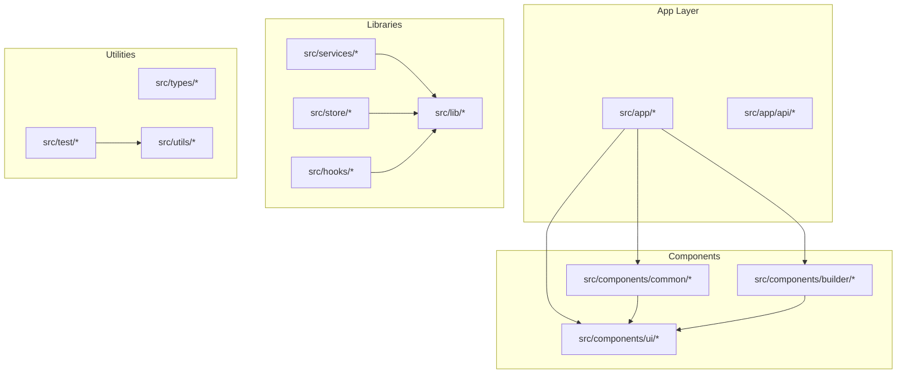
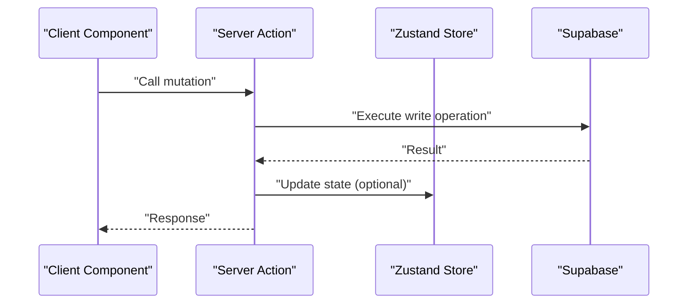
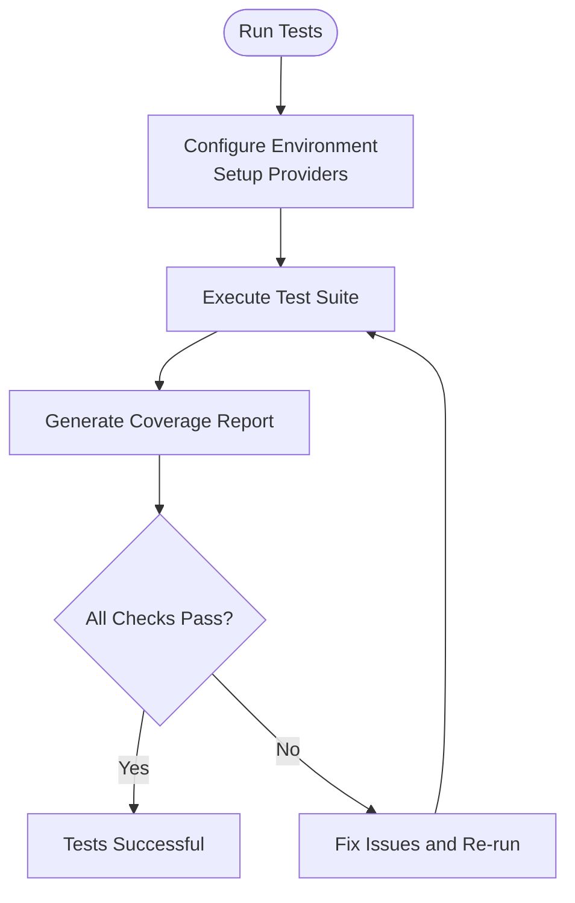

# Contributing Guidelines

<cite>
**Referenced Files in This Document**
- [README.md](file://README.md)
- [ARCHITECTURE.md](file://ARCHITECTURE.md)
- [AGENTS.md](file://AGENTS.md)
- [package.json](file://package.json)
- [eslint.config.mjs](file://eslint.config.mjs)
- [vitest.config.ts](file://vitest.config.ts)
- [vitest.setup.ts](file://vitest.setup.ts)
- [src/test/accessibility.test.ts](file://src/test/accessibility.test.ts)
- [src/lib/actions.ts](file://src/lib/actions.ts)
- [src/services/profileService.ts](file://src/services/profileService.ts)
- [src/app/api/admin/invitations/[id]/route.ts](file://src/app/api/admin/invitations/[id]/route.ts)
- [src/components/common/Header/Header.tsx](file://src/components/common/Header/Header.tsx)
- [src/components/ui/Button/Button.tsx](file://src/components/ui/Button/Button.tsx)
- [src/lib/utils/format.ts](file://src/lib/utils/format.ts)
- [src/hooks/useAuth.ts](file://src/hooks/useAuth.ts)
</cite>

## Table of Contents
1. [Introduction](#introduction)
2. [Project Structure](#project-structure)
3. [Core Components](#core-components)
4. [Architecture Overview](#architecture-overview)
5. [Development Workflow](#development-workflow)
6. [Code Contribution Standards](#code-contribution-standards)
7. [Pull Request Process](#pull-request-process)
8. [Testing Requirements](#testing-requirements)
9. [Documentation Standards](#documentation-standards)
10. [Code Quality and Review](#code-quality-and-review)
11. [Issue Reporting and Community Collaboration](#issue-reporting-and-community-collaboration)
12. [Troubleshooting Guide](#troubleshooting-guide)
13. [Conclusion](#conclusion)

## Introduction
This document defines the development workflow, code conventions, and contribution standards for the project. It consolidates architectural principles, testing requirements, formatting rules, and review expectations to ensure consistent, maintainable, and high-quality contributions across the codebase.

> **CRITICAL: SYNC MANDATE**
> 모든 설정 및 가이드 문서(`.agent`, `.codex`, `.cursor`, `.opencode`, `.cursorrules`, `AGENTS.md`, `README.md`, `ARCHITECTURE.md`)는 항상 동일한 기준을 유지하도록 함께 업데이트되어야 합니다. 한 곳의 규칙이 변경되면 언급된 모든 파일에 해당 변경 사항을 명시하고 동기화하십시오.

## Project Structure
The repository follows a Next.js App Router structure with clear separation of concerns:
- src/app: App Router pages, API routes, and shared layouts
- src/components: Atomic (ui), Molecular (common), and Organism (feature) UI layers
- src/lib: Shared utilities and service integrations
- src/services: Business logic services
- src/store: Zustand state management
- src/hooks: React hooks
- src/types: TypeScript type definitions
- src/utils: Utility functions
- src/test: Accessibility and integration tests
- supabase: Database migrations and configuration

**Diagram sources**
- [ARCHITECTURE.md](file://ARCHITECTURE.md#L100-L145)
- [README.md](file://README.md#L219-L249)

**Section sources**
- [ARCHITECTURE.md](file://ARCHITECTURE.md#L100-L145)
- [README.md](file://README.md#L219-L249)

## Core Components
- Data fetching and mutations strictly use server components and server actions
- UI follows a three-layer component architecture: Atomic (ui), Molecular (common), Organism (feature)
- State management uses Zustand with persistence and URL-mode-aware initialization
- Styling enforces SCSS modules and Radix UI primitives
- Authentication integrates with NextAuth and Supabase

**Section sources**
- [ARCHITECTURE.md](file://ARCHITECTURE.md#L6-L36)
- [ARCHITECTURE.md](file://ARCHITECTURE.md#L100-L145)
- [ARCHITECTURE.md](file://ARCHITECTURE.md#L208-L282)
- [ARCHITECTURE.md](file://ARCHITECTURE.md#L37-L64)
- [src/hooks/useAuth.ts](file://src/hooks/useAuth.ts#L1-L55)

## Architecture Overview
The system emphasizes server-first data fetching, client-only interactivity, and strict component layering. Server Actions replace traditional API routes for mutations, while SCSS modules and Radix UI ensure consistent styling and accessibility.

**Diagram sources**
- [ARCHITECTURE.md](file://ARCHITECTURE.md#L24-L36)
- [src/lib/actions.ts](file://src/lib/actions.ts#L1-L200)
- [src/services/profileService.ts](file://src/services/profileService.ts#L1-L101)

## Development Workflow
- Fork the repository and create a feature branch named feature/{BriefDescription}
- Implement changes following naming and architectural conventions
- Add or update tests and ensure all checks pass locally
- Push the branch and open a Pull Request targeting the main branch
- Address review feedback promptly and keep the PR up to date

**Section sources**
- [README.md](file://README.md#L359-L366)

## Code Contribution Standards
- Naming conventions
  - Components: PascalCase (e.g., UserProfile.tsx)
  - Files/Folders: PascalCase (e.g., UserProfile/UserProfile.tsx)
  - Functions/Variables: camelCase (e.g., getUserData)
  - Types/Interfaces: PascalCase (e.g., ApiResponse)
  - Constants: UPPER_SNAKE_CASE (e.g., MAX_RETRY_COUNT)
- File organization
  - Use path aliases (@/components, @/lib, @/services, @/hooks, @/types)
  - Keep components under 200 lines with single responsibility
  - Prefer explicit return types for exported helpers
- TypeScript usage
  - Strict mode enforced; avoid any
  - Use interface for object shapes and component props
  - Use type for unions, intersections, and mapped types
  - Avoid React.FC; define props explicitly
- React + Next.js patterns
  - Server components by default; use client components only for interactivity
  - Data fetching stays in server components; no client-side fetch on initial render
  - Use Server Actions for mutations
  - Use Next.js Image for images and memoize expensive components
  - Wrap risky UI with ErrorBoundary

**Section sources**
- [AGENTS.md](file://AGENTS.md#L86-L125)
- [ARCHITECTURE.md](file://ARCHITECTURE.md#L100-L145)

## Pull Request Process
- Branch naming: feature/{BriefDescription}
- Commit conventions: feat:, fix:, docs:, style:, refactor:, test:, chore:
- Code review standards
  - Ensure adherence to architectural patterns and component layering
  - Verify TypeScript strictness and type safety
  - Confirm accessibility and performance best practices
  - Validate tests coverage and correctness
- Merge procedures
  - All checks must pass (lint, type-check, tests, coverage)
  - Maintainers review and approve PRs
  - Squash or rebase commits before merging

**Section sources**
- [README.md](file://README.md#L367-L377)
- [AGENTS.md](file://AGENTS.md#L135-L141)

## Testing Requirements
- Test placement
  - Place tests alongside components or in __tests__ folders
  - Use @/test-utils for configured providers
- Test behavior, not implementation details
- Prefer getByRole/getByText over selectors
- Mock external APIs and browser APIs when needed
- Coverage and reporting
  - Use npm run test:coverage to generate reports
  - Exclude generated files and configuration from coverage

**Diagram sources**
- [vitest.config.ts](file://vitest.config.ts#L1-L35)
- [vitest.setup.ts](file://vitest.setup.ts#L1-L6)
- [src/test/accessibility.test.ts](file://src/test/accessibility.test.ts#L1-L112)

**Section sources**
- [AGENTS.md](file://AGENTS.md#L135-L141)
- [vitest.config.ts](file://vitest.config.ts#L1-L35)
- [vitest.setup.ts](file://vitest.setup.ts#L1-L6)
- [src/test/accessibility.test.ts](file://src/test/accessibility.test.ts#L1-L112)

## Documentation Standards
- Inline documentation
  - Exported functions and components should include concise descriptions
  - Complex logic should be explained with brief comments
- TypeDoc-style comments for public APIs
- README updates for new features or breaking changes
- Architecture decisions captured in ARCHITECTURE.md

**Section sources**
- [AGENTS.md](file://AGENTS.md#L135-L141)
- [ARCHITECTURE.md](file://ARCHITECTURE.md#L1-L308)

## Code Quality and Review
- Code quality standards
  - Follow ESLint rules and Core Web Vitals baseline
  - Maintain SCSS modules and Radix UI primitives
  - Avoid unnecessary re-renders; use memoization
- Peer review processes
  - Reviewers check adherence to patterns and accessibility
  - Focus on correctness, performance, and maintainability
- Maintainer responsibilities
  - Gate merges after successful checks and approvals
  - Ensure architectural consistency and long-term health

**Section sources**
- [AGENTS.md](file://AGENTS.md#L126-L147)
- [eslint.config.mjs](file://eslint.config.mjs#L1-L38)
- [ARCHITECTURE.md](file://ARCHITECTURE.md#L91-L98)

## Issue Reporting and Community Collaboration
- Reporting issues
  - Provide clear reproduction steps and expected vs. actual behavior
  - Include environment details (Node.js, package manager, OS)
- Feature requests
  - Describe the problem being solved and proposed solution
  - Include acceptance criteria and potential alternatives
- Community collaboration
  - Use GitHub Discussions for design proposals
  - Engage respectfully and constructively in reviews

**Section sources**
- [README.md](file://README.md#L359-L366)

## Troubleshooting Guide
- Common linting issues
  - Run npm run lint to identify and fix violations
  - Ensure no-undef is off for TS projects as configured
- Test failures
  - Use npm run test:watch for iterative debugging
  - Inspect coverage reports to identify untested paths
- Build and type-check errors
  - Run npm run build and npm run type-check to validate
  - Fix TypeScript errors before opening PRs

**Section sources**
- [eslint.config.mjs](file://eslint.config.mjs#L1-L38)
- [package.json](file://package.json#L1-L107)

## Conclusion
These guidelines establish a consistent, scalable development process. By adhering to naming conventions, architectural patterns, testing requirements, and review standards, contributors help maintain a high-quality, accessible, and performant codebase.