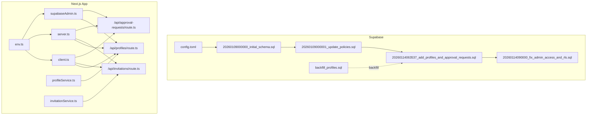
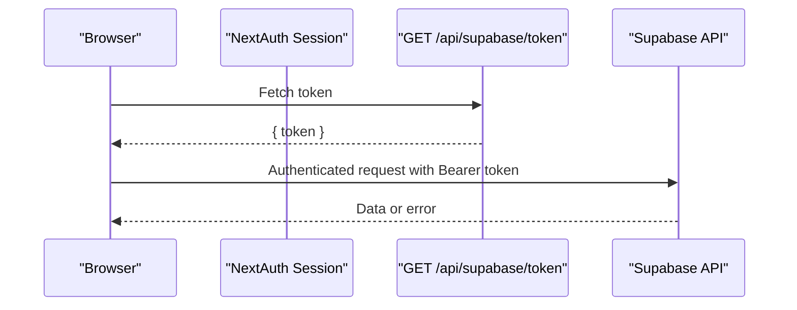
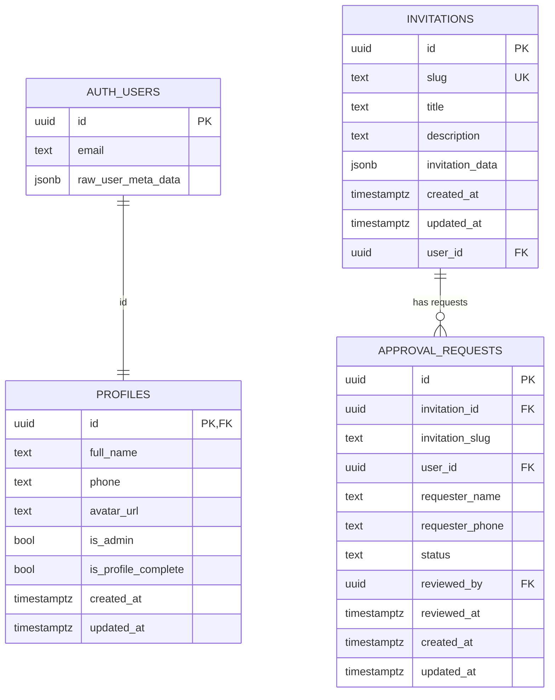
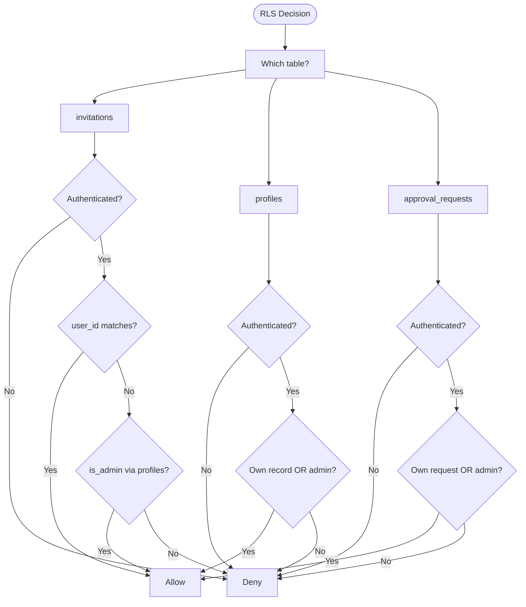
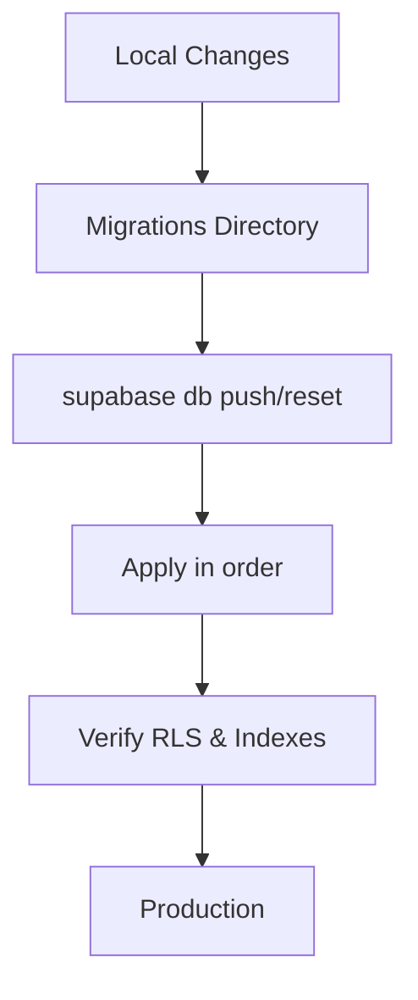
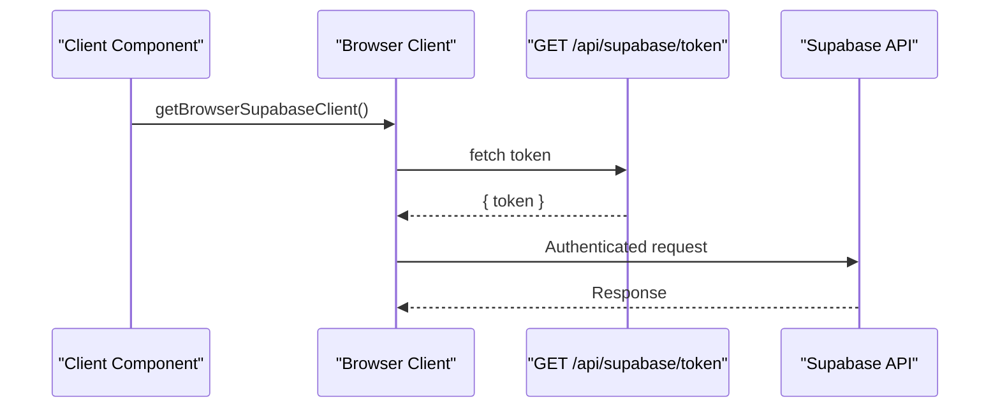
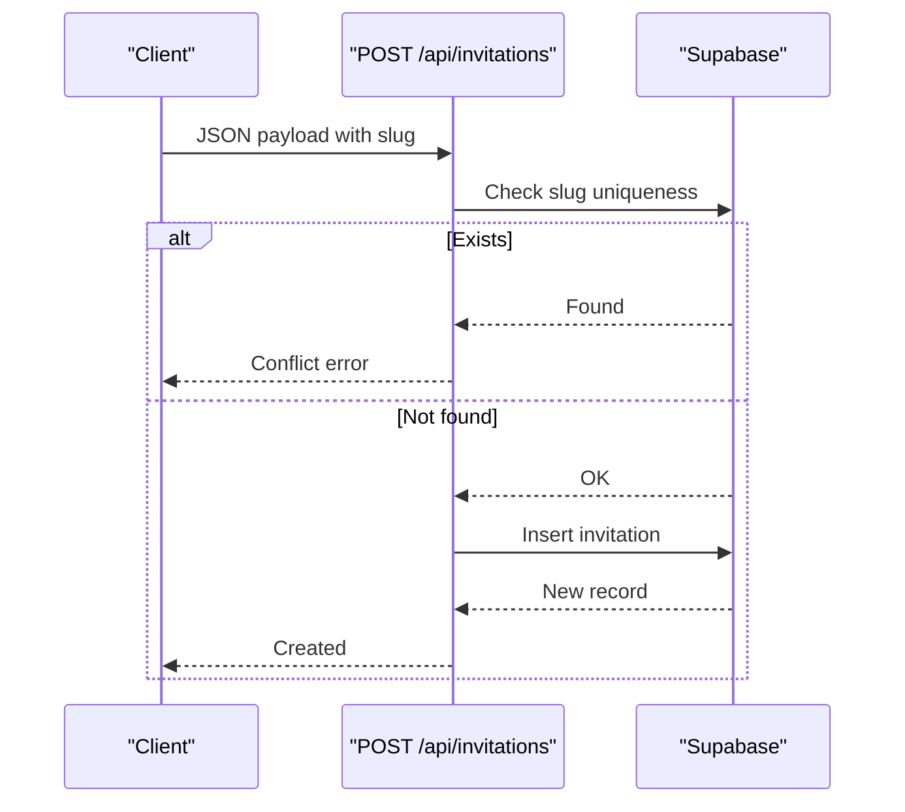
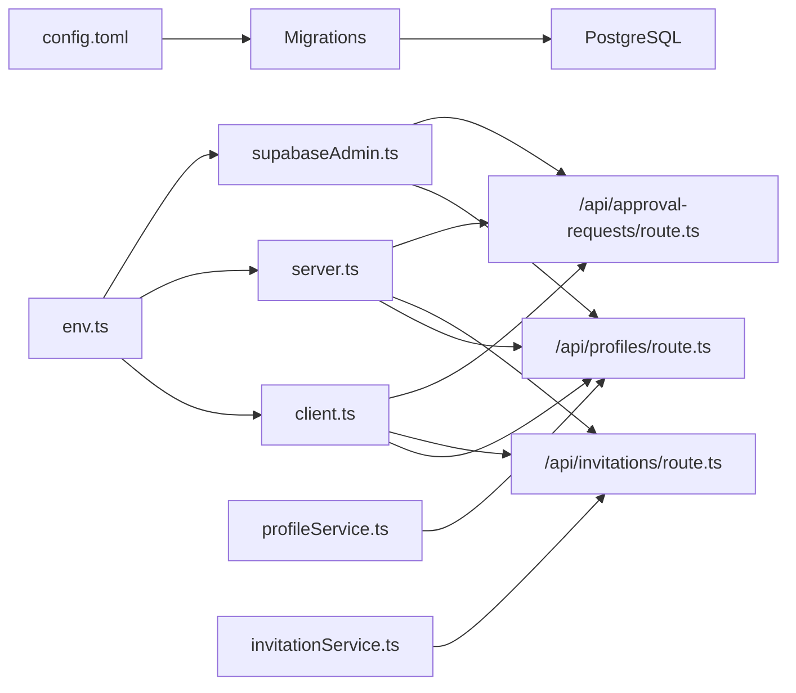

# Database Architecture

<cite>
**Referenced Files in This Document**
- [config.toml](file://supabase/config.toml)
- [20260109000000_initial_schema.sql](file://supabase/migrations/20260109000000_initial_schema.sql)
- [20260109000001_update_policies.sql](file://supabase/migrations/20260109000001_update_policies.sql)
- [20260114063537_add_profiles_and_approval_requests.sql](file://supabase/migrations/20260114063537_add_profiles_and_approval_requests.sql)
- [20260114090000_fix_admin_access_and_rls.sql](file://supabase/migrations/20260114090000_fix_admin_access_and_rls.sql)
- [backfill_profiles.sql](file://supabase/scripts/backfill_profiles.sql)
- [client.ts](file://src/lib/supabase/client.ts)
- [server.ts](file://src/lib/supabase/server.ts)
- [supabaseAdmin.ts](file://src/lib/supabaseAdmin.ts)
- [env.ts](file://src/lib/env.ts)
- [route.ts (profiles)](file://src/app/api/profiles/route.ts)
- [route.ts (invitations)](file://src/app/api/invitations/route.ts)
- [route.ts (approval-requests)](file://src/app/api/approval-requests/route.ts)
- [profileService.ts](file://src/services/profileService.ts)
- [invitationService.ts](file://src/services/invitationService.ts)
</cite>

## Table of Contents
1. [Introduction](#introduction)
2. [Project Structure](#project-structure)
3. [Core Components](#core-components)
4. [Architecture Overview](#architecture-overview)
5. [Detailed Component Analysis](#detailed-component-analysis)
6. [Dependency Analysis](#dependency-analysis)
7. [Performance Considerations](#performance-considerations)
8. [Troubleshooting Guide](#troubleshooting-guide)
9. [Conclusion](#conclusion)
10. [Appendices](#appendices)

## Introduction
This document explains the database architecture for the Supabase-backed wedding invitation application. It covers schema design, Row Level Security (RLS) policies, migration management, client configuration for server-side and browser-side access, query patterns, data integrity constraints, performance considerations, and troubleshooting guidance. The focus is on the core tables for invitations, profiles, and approval requests, along with the policies and triggers that govern access and data consistency.

## Project Structure
The database layer is primarily defined by:
- Supabase configuration and migrations under the supabase directory
- Supabase client initialization and configuration in the Next.js application
- API routes that act as server-side database accessors
- Services that encapsulate client-side database operations

**Diagram sources**
- [config.toml](file://supabase/config.toml#L1-L385)
- [20260109000000_initial_schema.sql](file://supabase/migrations/20260109000000_initial_schema.sql#L1-L52)
- [20260109000001_update_policies.sql](file://supabase/migrations/20260109000001_update_policies.sql#L1-L10)
- [20260114063537_add_profiles_and_approval_requests.sql](file://supabase/migrations/20260114063537_add_profiles_and_approval_requests.sql#L1-L234)
- [20260114090000_fix_admin_access_and_rls.sql](file://supabase/migrations/20260114090000_fix_admin_access_and_rls.sql#L1-L51)
- [backfill_profiles.sql](file://supabase/scripts/backfill_profiles.sql#L1-L32)
- [client.ts](file://src/lib/supabase/client.ts#L1-L85)
- [server.ts](file://src/lib/supabase/server.ts#L1-L19)
- [supabaseAdmin.ts](file://src/lib/supabaseAdmin.ts#L1-L15)
- [route.ts (profiles)](file://src/app/api/profiles/route.ts#L1-L125)
- [route.ts (invitations)](file://src/app/api/invitations/route.ts#L1-L115)
- [route.ts (approval-requests)](file://src/app/api/approval-requests/route.ts#L1-L213)
- [profileService.ts](file://src/services/profileService.ts#L1-L101)
- [invitationService.ts](file://src/services/invitationService.ts#L1-L81)

**Section sources**
- [config.toml](file://supabase/config.toml#L1-L385)
- [client.ts](file://src/lib/supabase/client.ts#L1-L85)
- [server.ts](file://src/lib/supabase/server.ts#L1-L19)
- [supabaseAdmin.ts](file://src/lib/supabaseAdmin.ts#L1-L15)
- [env.ts](file://src/lib/env.ts#L1-L51)

## Core Components
- Supabase configuration defines API exposure, database ports, search_path, and schema visibility.
- Migrations define the schema, RLS policies, indexes, triggers, and helper functions.
- Supabase clients:
  - Browser client: fetches a signed token from the backend and authenticates with Supabase.
  - Server client: creates a Supabase client bound to a NextAuth session via a custom JWT.
  - Admin client: uses the service role key for privileged operations.
- API routes orchestrate database operations with proper validation and error handling.
- Services encapsulate client-side database calls and provide typed interfaces.

**Section sources**
- [config.toml](file://supabase/config.toml#L7-L18)
- [20260114063537_add_profiles_and_approval_requests.sql](file://supabase/migrations/20260114063537_add_profiles_and_approval_requests.sql#L18-L234)
- [client.ts](file://src/lib/supabase/client.ts#L24-L84)
- [server.ts](file://src/lib/supabase/server.ts#L9-L18)
- [supabaseAdmin.ts](file://src/lib/supabaseAdmin.ts#L7-L14)
- [route.ts (profiles)](file://src/app/api/profiles/route.ts#L14-L54)
- [route.ts (invitations)](file://src/app/api/invitations/route.ts#L22-L77)
- [route.ts (approval-requests)](file://src/app/api/approval-requests/route.ts#L17-L89)
- [profileService.ts](file://src/services/profileService.ts#L26-L52)
- [invitationService.ts](file://src/services/invitationService.ts#L10-L35)

## Architecture Overview
The system uses Supabase as the database and auth provider. Clients authenticate via NextAuth and Supabase. Server-side code constructs a Supabase client bound to the authenticated session, while browser code obtains a temporary JWT from the backend to call Supabase APIs. Admin operations use the service role client.

**Diagram sources**
- [client.ts](file://src/lib/supabase/client.ts#L24-L84)
- [server.ts](file://src/lib/supabase/server.ts#L9-L18)

## Detailed Component Analysis

### Database Schema Design
- invitations
  - Purpose: stores invitation records with a unique slug, JSONB payload, and optional user ownership.
  - Constraints: unique slug, foreign key to auth.users via user_id.
  - Indexes: slug lookup.
  - RLS: public select; authenticated users can manage their own; admins can manage all; service role bypass.
- profiles
  - Purpose: extends auth.users with full_name, phone, avatar_url, admin flag, completion flag, timestamps.
  - Constraints: primary key references auth.users(id); NOT NULL checks on timestamps.
  - Triggers: updated_at trigger; automatic profile creation via trigger on auth.users insert.
  - RLS: users can view/update own; admins can view all; insert allowed via trigger with service role context.
- approval_requests
  - Purpose: tracks approval requests per invitation with requester info, status, reviewer metadata.
  - Constraints: foreign keys to invitations and auth.users; status enum-like constraint; timestamps.
  - Indexes: user_id, invitation_id, status for efficient filtering.
  - RLS: users can view/update own; admins can view/update all.

**Diagram sources**
- [20260109000000_initial_schema.sql](file://supabase/migrations/20260109000000_initial_schema.sql#L2-L11)
- [20260114063537_add_profiles_and_approval_requests.sql](file://supabase/migrations/20260114063537_add_profiles_and_approval_requests.sql#L18-L126)

**Section sources**
- [20260109000000_initial_schema.sql](file://supabase/migrations/20260109000000_initial_schema.sql#L1-L52)
- [20260114063537_add_profiles_and_approval_requests.sql](file://supabase/migrations/20260114063537_add_profiles_and_approval_requests.sql#L18-L136)
- [20260114090000_fix_admin_access_and_rls.sql](file://supabase/migrations/20260114090000_fix_admin_access_and_rls.sql#L21-L37)

### Row Level Security (RLS) Policies and Access Control
- invitations
  - Public read: select allowed for everyone.
  - Authenticated users: manage only their own invitations (user_id match).
  - Admins: manage all invitations (via profiles is_admin check).
  - Service role: full access for privileged operations.
- profiles
  - Users: view/update own profile.
  - Insert: allowed during trigger execution (security definer).
  - Admins: view all profiles.
- approval_requests
  - Users: view/update own requests.
  - Admins: view/update all requests.
- Additional policy adjustments ensure admin users can manage invitations and view all profiles.

**Diagram sources**
- [20260109000000_initial_schema.sql](file://supabase/migrations/20260109000000_initial_schema.sql#L16-L31)
- [20260114090000_fix_admin_access_and_rls.sql](file://supabase/migrations/20260114090000_fix_admin_access_and_rls.sql#L21-L50)
- [20260114063537_add_profiles_and_approval_requests.sql](file://supabase/migrations/20260114063537_add_profiles_and_approval_requests.sql#L44-L183)

**Section sources**
- [20260109000000_initial_schema.sql](file://supabase/migrations/20260109000000_initial_schema.sql#L16-L31)
- [20260109000001_update_policies.sql](file://supabase/migrations/20260109000001_update_policies.sql#L4-L9)
- [20260114090000_fix_admin_access_and_rls.sql](file://supabase/migrations/20260114090000_fix_admin_access_and_rls.sql#L21-L50)
- [20260114063537_add_profiles_and_approval_requests.sql](file://supabase/migrations/20260114063537_add_profiles_and_approval_requests.sql#L44-L183)

### Migration Management and Production Deployment
- Migrations are applied in order using the Supabase CLI. The configuration enables migrations and seeding.
- The initial schema sets up invitations, RLS, and storage policies.
- Subsequent migrations add profiles, approval_requests, triggers, indexes, and refined RLS policies.
- Backfill script ensures existing users have profiles populated.
- Production deployment should apply migrations in sequence and verify RLS policies and indexes.

**Diagram sources**
- [config.toml](file://supabase/config.toml#L53-L65)
- [20260109000000_initial_schema.sql](file://supabase/migrations/20260109000000_initial_schema.sql#L1-L52)
- [20260114063537_add_profiles_and_approval_requests.sql](file://supabase/migrations/20260114063537_add_profiles_and_approval_requests.sql#L1-L234)
- [20260114090000_fix_admin_access_and_rls.sql](file://supabase/migrations/20260114090000_fix_admin_access_and_rls.sql#L1-L51)
- [backfill_profiles.sql](file://supabase/scripts/backfill_profiles.sql#L7-L19)

**Section sources**
- [config.toml](file://supabase/config.toml#L53-L65)
- [20260109000000_initial_schema.sql](file://supabase/migrations/20260109000000_initial_schema.sql#L1-L52)
- [20260114063537_add_profiles_and_approval_requests.sql](file://supabase/migrations/20260114063537_add_profiles_and_approval_requests.sql#L1-L234)
- [20260114090000_fix_admin_access_and_rls.sql](file://supabase/migrations/20260114090000_fix_admin_access_and_rls.sql#L1-L51)
- [backfill_profiles.sql](file://supabase/scripts/backfill_profiles.sql#L7-L19)

### Supabase Client Configuration
- Environment validation enforces presence of Supabase URL and anonymous key for the browser.
- Browser client:
  - Fetches a signed token from the backend endpoint.
  - Decodes token expiry and caches the client until token changes or expiry.
  - Uses Authorization header with Bearer token for authenticated requests.
- Server client:
  - Resolves NextAuth session and generates a custom JWT for Supabase.
  - Passes Authorization header to bind Supabase operations to the authenticated user.
- Admin client:
  - Uses service role key to bypass RLS for privileged operations.

**Diagram sources**
- [client.ts](file://src/lib/supabase/client.ts#L24-L84)
- [server.ts](file://src/lib/supabase/server.ts#L9-L18)
- [env.ts](file://src/lib/env.ts#L8-L10)

**Section sources**
- [env.ts](file://src/lib/env.ts#L8-L10)
- [client.ts](file://src/lib/supabase/client.ts#L24-L84)
- [server.ts](file://src/lib/supabase/server.ts#L9-L18)
- [supabaseAdmin.ts](file://src/lib/supabaseAdmin.ts#L7-L14)

### Practical Queries, Relationships, and Integrity Constraints
- Relationship patterns:
  - profiles.id references auth.users(id) with cascade delete.
  - invitations.user_id references auth.users(id) with set null on delete.
  - approval_requests.invitation_id references invitations(id) with cascade delete.
  - approval_requests.user_id references auth.users(id) with cascade delete.
- Integrity constraints:
  - Unique slug in invitations.
  - Status enum-like constraint in approval_requests.
  - NOT NULL timestamps enforced by triggers and defaults.
- Common queries:
  - Get invitation by slug.
  - Upsert invitation with conflict resolution on slug.
  - Insert approval request with de-duplication on pending status.
  - Update invitation_data to toggle isRequestingApproval.
  - Select profiles with admin-aware visibility.

**Diagram sources**
- [route.ts (invitations)](file://src/app/api/invitations/route.ts#L22-L61)

**Section sources**
- [20260114063537_add_profiles_and_approval_requests.sql](file://supabase/migrations/20260114063537_add_profiles_and_approval_requests.sql#L114-L126)
- [route.ts (invitations)](file://src/app/api/invitations/route.ts#L29-L61)
- [route.ts (approval-requests)](file://src/app/api/approval-requests/route.ts#L34-L47)
- [route.ts (profiles)](file://src/app/api/profiles/route.ts#L74-L99)

## Dependency Analysis
- Supabase configuration dictates schema exposure and search_path.
- Migrations define schema, policies, indexes, triggers, and helper functions.
- API routes depend on Supabase clients and enforce validation.
- Services depend on API routes or Supabase clients for data access.
- Admin client is used in API routes requiring elevated privileges.

**Diagram sources**
- [config.toml](file://supabase/config.toml#L13-L15)
- [client.ts](file://src/lib/supabase/client.ts#L1-L85)
- [server.ts](file://src/lib/supabase/server.ts#L1-L19)
- [supabaseAdmin.ts](file://src/lib/supabaseAdmin.ts#L1-L15)
- [route.ts (profiles)](file://src/app/api/profiles/route.ts#L1-L125)
- [route.ts (invitations)](file://src/app/api/invitations/route.ts#L1-L115)
- [route.ts (approval-requests)](file://src/app/api/approval-requests/route.ts#L1-L213)
- [profileService.ts](file://src/services/profileService.ts#L1-L101)
- [invitationService.ts](file://src/services/invitationService.ts#L1-L81)

**Section sources**
- [config.toml](file://supabase/config.toml#L13-L15)
- [client.ts](file://src/lib/supabase/client.ts#L1-L85)
- [server.ts](file://src/lib/supabase/server.ts#L1-L19)
- [supabaseAdmin.ts](file://src/lib/supabaseAdmin.ts#L1-L15)
- [route.ts (profiles)](file://src/app/api/profiles/route.ts#L1-L125)
- [route.ts (invitations)](file://src/app/api/invitations/route.ts#L1-L115)
- [route.ts (approval-requests)](file://src/app/api/approval-requests/route.ts#L1-L213)
- [profileService.ts](file://src/services/profileService.ts#L1-L101)
- [invitationService.ts](file://src/services/invitationService.ts#L1-L81)

## Performance Considerations
- Indexing strategies
  - invitations: index on slug for fast lookups.
  - approval_requests: indexes on user_id, invitation_id, status for filtering and reporting.
- Query optimization
  - Use targeted selects (e.g., specific columns) and single-row retrieval where appropriate.
  - Prefer equality filters on indexed columns (slug, user_id, invitation_id).
  - Batch operations where feasible; leverage upsert with conflict targets.
- Caching patterns
  - Client-side token caching with expiry decoding prevents frequent token refreshes.
  - Consider short-lived caching of frequently accessed invitation slugs and profile data in memory or CDN where applicable.
- Triggers and functions
  - updated_at triggers avoid manual timestamp updates and keep data consistent.
  - Helper functions encapsulate common checks (e.g., profile completeness) to reduce duplication.

[No sources needed since this section provides general guidance]

## Troubleshooting Guide
- Database connectivity issues
  - Verify NEXT_PUBLIC_SUPABASE_URL and NEXT_PUBLIC_SUPABASE_ANON_KEY are present and valid.
  - Confirm Supabase CLI is configured and migrations are applied.
- Migration failures
  - Review migration order and resolve conflicts (e.g., duplicate indexes, policy names).
  - Ensure service role key is set for admin operations.
- RLS access denied
  - Confirm user is authenticated and owns the resource or is admin.
  - Check that profiles is_admin flag is set; use backfill script if needed.
- API errors
  - Inspect API route responses for validation errors and server errors.
  - For profile fetch, note that missing records return null safely in services.

**Section sources**
- [env.ts](file://src/lib/env.ts#L28-L50)
- [20260114090000_fix_admin_access_and_rls.sql](file://supabase/migrations/20260114090000_fix_admin_access_and_rls.sql#L8-L14)
- [backfill_profiles.sql](file://supabase/scripts/backfill_profiles.sql#L7-L19)
- [route.ts (profiles)](file://src/app/api/profiles/route.ts#L34-L44)
- [profileService.ts](file://src/services/profileService.ts#L35-L51)

## Conclusion
The database architecture leverages Supabase’s schema, RLS, and auth capabilities to provide secure, scalable data access. Migrations define clear schema evolution, while client configurations enable robust server-side and browser-side interactions. Carefully designed policies and indexes ensure both security and performance, and the API routes and services encapsulate reliable data operations.

[No sources needed since this section summarizes without analyzing specific files]

## Appendices

### Appendix A: Supabase Configuration Highlights
- API schemas exposed include public and graphql_public; next_auth schema is also exposed.
- Database major version and health timeout are configured.
- Migrations and seeding are enabled; seed path points to a seed file.

**Section sources**
- [config.toml](file://supabase/config.toml#L13-L15)
- [config.toml](file://supabase/config.toml#L36-L36)
- [config.toml](file://supabase/config.toml#L53-L65)

### Appendix B: Key Migration Highlights
- Initial schema establishes invitations table, RLS, and storage policies.
- Profiles and approval_requests tables are added with triggers, indexes, and RLS.
- Admin access and RLS are refined to allow admin privileges.
- Backfill script ensures historical users have profiles.

**Section sources**
- [20260109000000_initial_schema.sql](file://supabase/migrations/20260109000000_initial_schema.sql#L1-L52)
- [20260114063537_add_profiles_and_approval_requests.sql](file://supabase/migrations/20260114063537_add_profiles_and_approval_requests.sql#L1-L234)
- [20260114090000_fix_admin_access_and_rls.sql](file://supabase/migrations/20260114090000_fix_admin_access_and_rls.sql#L1-L51)
- [backfill_profiles.sql](file://supabase/scripts/backfill_profiles.sql#L7-L19)