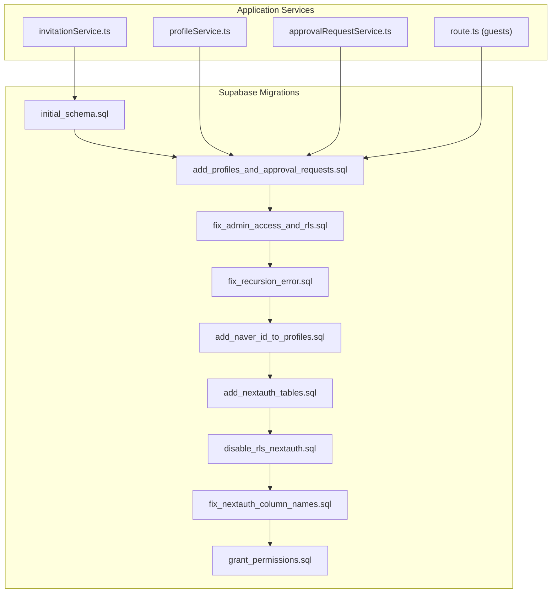
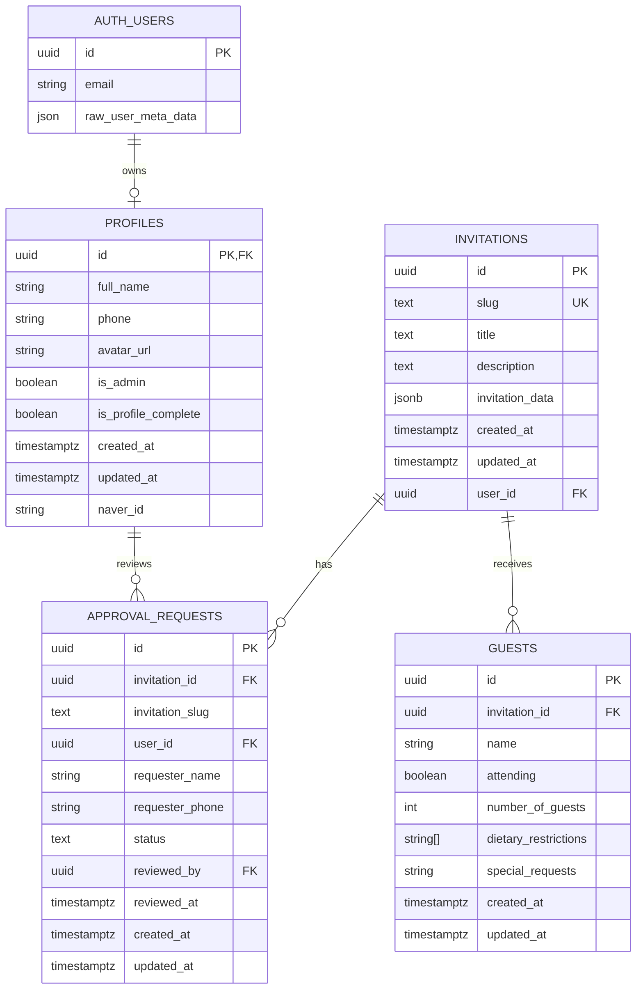
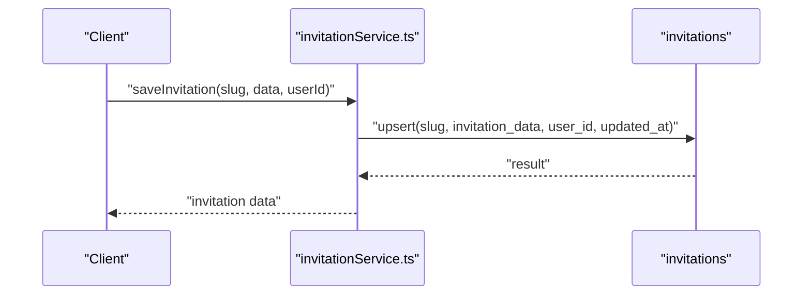
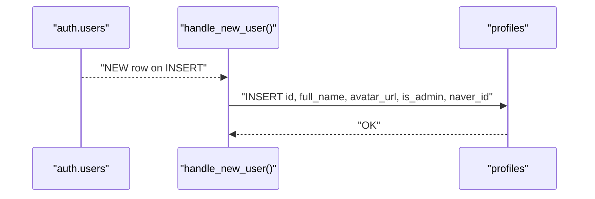
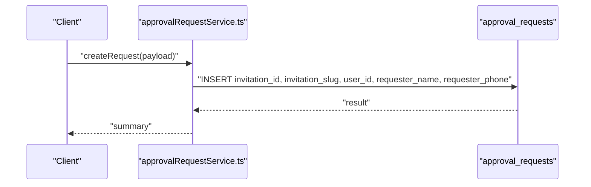
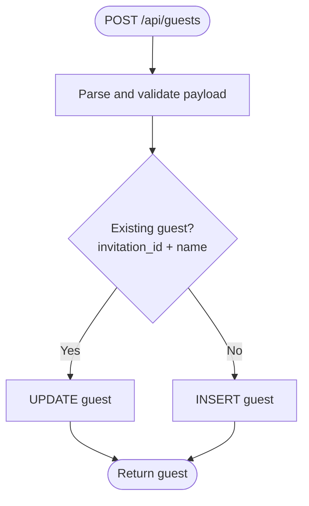
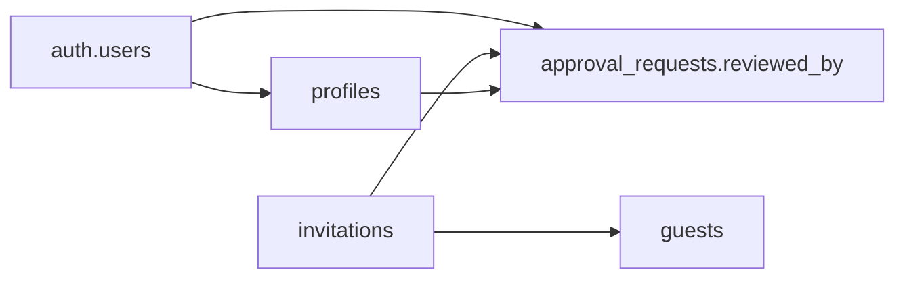

# Database Schema Design

<cite>
**Referenced Files in This Document**
- [20260109000000_initial_schema.sql](file://supabase/migrations/20260109000000_initial_schema.sql)
- [20260114063537_add_profiles_and_approval_requests.sql](file://supabase/migrations/20260114063537_add_profiles_and_approval_requests.sql)
- [20260114090000_fix_admin_access_and_rls.sql](file://supabase/migrations/20260114090000_fix_admin_access_and_rls.sql)
- [20260114100000_fix_recursion_error.sql](file://supabase/migrations/20260114100000_fix_recursion_error.sql)
- [20260115000000_add_naver_id_to_profiles.sql](file://supabase/migrations/20260115000000_add_naver_id_to_profiles.sql)
- [20260116000000_add_nextauth_tables.sql](file://supabase/migrations/20260116000000_add_nextauth_tables.sql)
- [20260116000001_disable_rls_nextauth.sql](file://supabase/migrations/20260116000001_disable_rls_nextauth.sql)
- [20260116000002_fix_nextauth_column_names.sql](file://supabase/migrations/20260116000002_fix_nextauth_column_names.sql)
- [20260117000000_grant_permissions.sql](file://supabase/migrations/20260117000000_grant_permissions.sql)
- [route.ts](file://src/app/api/guests/route.ts)
- [invitationService.ts](file://src/services/invitationService.ts)
- [profileService.ts](file://src/services/profileService.ts)
- [approvalRequestService.ts](file://src/services/approvalRequestService.ts)
</cite>

## Table of Contents
1. [Introduction](#introduction)
2. [Project Structure](#project-structure)
3. [Core Components](#core-components)
4. [Architecture Overview](#architecture-overview)
5. [Detailed Component Analysis](#detailed-component-analysis)
6. [Dependency Analysis](#dependency-analysis)
7. [Performance Considerations](#performance-considerations)
8. [Troubleshooting Guide](#troubleshooting-guide)
9. [Conclusion](#conclusion)
10. [Appendices](#appendices)

## Introduction
This document describes the database schema design for the wedding invitation platform. It focuses on the core entities and relationships among invitations, profiles, approval_requests, and supporting infrastructure. It explains primary and foreign keys, indexes, row-level security (RLS) policies, default values, constraints, and validation rules embedded in the schema. Practical insertion and retrieval patterns are included, along with diagrams that illustrate how the schema supports the application’s core functionality.

## Project Structure
The schema is defined primarily through Supabase SQL migrations. The application code interacts with these tables through API routes and services.

**Diagram sources**
- [20260109000000_initial_schema.sql](file://supabase/migrations/20260109000000_initial_schema.sql#L1-L52)
- [20260114063537_add_profiles_and_approval_requests.sql](file://supabase/migrations/20260114063537_add_profiles_and_approval_requests.sql#L1-L234)
- [20260114090000_fix_admin_access_and_rls.sql](file://supabase/migrations/20260114090000_fix_admin_access_and_rls.sql#L1-L51)
- [20260114100000_fix_recursion_error.sql](file://supabase/migrations/20260114100000_fix_recursion_error.sql#L1-L81)
- [20260115000000_add_naver_id_to_profiles.sql](file://supabase/migrations/20260115000000_add_naver_id_to_profiles.sql#L1-L39)
- [20260116000000_add_nextauth_tables.sql](file://supabase/migrations/20260116000000_add_nextauth_tables.sql#L1-L57)
- [20260116000001_disable_rls_nextauth.sql](file://supabase/migrations/20260116000001_disable_rls_nextauth.sql#L1-L6)
- [20260116000002_fix_nextauth_column_names.sql](file://supabase/migrations/20260116000002_fix_nextauth_column_names.sql#L1-L43)
- [20260117000000_grant_permissions.sql](file://supabase/migrations/20260117000000_grant_permissions.sql#L1-L7)

**Section sources**
- [20260109000000_initial_schema.sql](file://supabase/migrations/20260109000000_initial_schema.sql#L1-L52)
- [20260114063537_add_profiles_and_approval_requests.sql](file://supabase/migrations/20260114063537_add_profiles_and_approval_requests.sql#L1-L234)
- [20260116000000_add_nextauth_tables.sql](file://supabase/migrations/20260116000000_add_nextauth_tables.sql#L1-L57)

## Core Components
This section documents the main tables and their roles in the system.

- invitations
  - Purpose: Stores invitation records with a unique slug, title/description, JSON-formatted invitation data, and ownership linkage to users.
  - Primary key: id (UUID)
  - Foreign keys: user_id references auth.users(id) with ON DELETE SET NULL
  - Unique constraints: slug
  - Indexes: idx_invitations_slug
  - Defaults: id defaults to gen_random_uuid(), created_at/updated_at default to current time
  - RLS: Public SELECT allowed; authenticated users can manage their own; admins can manage all
  - Business logic: Updated-at handled by triggers; storage buckets configured for media

- profiles
  - Purpose: Extends auth.users with additional fields (e.g., full_name, phone, avatar_url, admin flag, completion flag, optional Naver OAuth id).
  - Primary key: id (UUID) referencing auth.users(id) with ON DELETE CASCADE
  - Defaults: created_at/updated_at default to current time; is_admin defaults to false; is_profile_complete defaults to false
  - Unique constraints: naver_id (unique index with WHERE clause)
  - Triggers: handle_updated_at updates updated_at on change
  - RLS: Users can view/update own; admins can view all; insert allowed via trigger with service role
  - Functions: handle_new_user creates profile on sign-up; is_profile_complete checks completeness

- approval_requests
  - Purpose: Tracks approval requests for invitations submitted by users.
  - Primary key: id (UUID)
  - Foreign keys: invitation_id references invitations(id) CASCADE; user_id references auth.users(id) CASCADE; reviewed_by references auth.users(id)
  - Constraints: status CHECK in ('pending','approved','rejected'); invitation_slug mirrors invitations.slug
  - Defaults: status defaults to 'pending'; created_at/updated_at default to current time
  - Indexes: idx_approval_requests_user_id, idx_approval_requests_invitation_id, idx_approval_requests_status
  - Triggers: handle_updated_at updates updated_at on change
  - RLS: Users can view/update own; admins can view/update all

- guests (referenced by API)
  - Purpose: Captures guest responses for an invitation (name, attending, number of guests, dietary restrictions, special requests).
  - Evidence: API route references a guests table and performs inserts/updates/selects.
  - Constraints: numberOfGuests constrained by service logic; name uniqueness per invitation enforced by application logic.
  - Defaults: created_at/updated_at managed by application.
  - Indexes: implicit unique combination enforced by application logic; application sorts by created_at desc.

**Section sources**
- [20260109000000_initial_schema.sql](file://supabase/migrations/20260109000000_initial_schema.sql#L1-L52)
- [20260114063537_add_profiles_and_approval_requests.sql](file://supabase/migrations/20260114063537_add_profiles_and_approval_requests.sql#L18-L126)
- [20260114090000_fix_admin_access_and_rls.sql](file://supabase/migrations/20260114090000_fix_admin_access_and_rls.sql#L20-L50)
- [20260114100000_fix_recursion_error.sql](file://supabase/migrations/20260114100000_fix_recursion_error.sql#L12-L81)
- [20260115000000_add_naver_id_to_profiles.sql](file://supabase/migrations/20260115000000_add_naver_id_to_profiles.sql#L5-L39)
- [route.ts](file://src/app/api/guests/route.ts#L1-L123)

## Architecture Overview
The schema enforces separation of concerns:
- invitations encapsulate presentation and content
- profiles extend identity and permissions
- approval_requests mediate administrative review
- guests capture external responses

**Diagram sources**
- [20260109000000_initial_schema.sql](file://supabase/migrations/20260109000000_initial_schema.sql#L2-L11)
- [20260114063537_add_profiles_and_approval_requests.sql](file://supabase/migrations/20260114063537_add_profiles_and_approval_requests.sql#L18-L126)
- [route.ts](file://src/app/api/guests/route.ts#L23-L60)

## Detailed Component Analysis

### invitations
- Keys and relationships
  - Primary key: id
  - Foreign key: user_id -> auth.users(id) ON DELETE SET NULL
  - Unique: slug
  - Index: idx_invitations_slug
- Defaults and timestamps
  - id defaults to gen_random_uuid()
  - created_at/updated_at default to NOW()
- RLS and policies
  - Public SELECT allowed
  - Authenticated users can manage their own (using auth.uid() = user_id)
  - Admins can manage all (policy updated to use helper function to avoid recursion)
- Business logic
  - Updated-at handled by triggers
  - Storage bucket configured for media access

**Diagram sources**
- [invitationService.ts](file://src/services/invitationService.ts#L10-L24)
- [20260109000000_initial_schema.sql](file://supabase/migrations/20260109000000_initial_schema.sql#L1-L52)

**Section sources**
- [20260109000000_initial_schema.sql](file://supabase/migrations/20260109000000_initial_schema.sql#L1-L52)
- [20260114090000_fix_admin_access_and_rls.sql](file://supabase/migrations/20260114090000_fix_admin_access_and_rls.sql#L20-L50)
- [20260114100000_fix_recursion_error.sql](file://supabase/migrations/20260114100000_fix_recursion_error.sql#L38-L50)

### profiles
- Keys and relationships
  - Primary key: id (references auth.users(id))
  - Unique: naver_id (unique index with WHERE naver_id IS NOT NULL)
- Defaults and timestamps
  - created_at/updated_at default to NOW()
  - is_admin defaults to false
  - is_profile_complete defaults to false
- RLS and policies
  - Users can view/update own
  - Admins can view all
  - Insert allowed via trigger with service role
- Triggers and functions
  - handle_updated_at updates updated_at
  - handle_new_user auto-creates profile on sign-up; sets admin flag for specific email; includes naver_id
  - is_profile_complete checks full_name and phone presence

**Diagram sources**
- [20260114063537_add_profiles_and_approval_requests.sql](file://supabase/migrations/20260114063537_add_profiles_and_approval_requests.sql#L81-L107)
- [20260115000000_add_naver_id_to_profiles.sql](file://supabase/migrations/20260115000000_add_naver_id_to_profiles.sql#L14-L38)

**Section sources**
- [20260114063537_add_profiles_and_approval_requests.sql](file://supabase/migrations/20260114063537_add_profiles_and_approval_requests.sql#L18-L78)
- [20260115000000_add_naver_id_to_profiles.sql](file://supabase/migrations/20260115000000_add_naver_id_to_profiles.sql#L5-L39)
- [20260114090000_fix_admin_access_and_rls.sql](file://supabase/migrations/20260114090000_fix_admin_access_and_rls.sql#L39-L50)

### approval_requests
- Keys and relationships
  - Primary key: id
  - Foreign keys: invitation_id -> invitations(id) CASCADE; user_id -> auth.users(id) CASCADE; reviewed_by -> auth.users(id)
  - Unique: invitation_slug mirrors invitations.slug
  - Indexes: idx_approval_requests_user_id, idx_approval_requests_invitation_id, idx_approval_requests_status
- Defaults and constraints
  - status defaults to 'pending' with CHECK in ('pending','approved','rejected')
  - created_at/updated_at default to NOW()
- RLS and policies
  - Users can view own
  - Users can create own
  - Admins can view/update all (policy updated to use helper function to avoid recursion)
- Triggers
  - handle_updated_at updates updated_at

**Diagram sources**
- [approvalRequestService.ts](file://src/services/approvalRequestService.ts#L14-L27)
- [20260114063537_add_profiles_and_approval_requests.sql](file://supabase/migrations/20260114063537_add_profiles_and_approval_requests.sql#L114-L126)

**Section sources**
- [20260114063537_add_profiles_and_approval_requests.sql](file://supabase/migrations/20260114063537_add_profiles_and_approval_requests.sql#L114-L184)
- [20260114100000_fix_recursion_error.sql](file://supabase/migrations/20260114100000_fix_recursion_error.sql#L52-L81)

### guests
- Keys and relationships
  - Primary key: id
  - Foreign key: invitation_id -> invitations(id)
- Application-level constraints
  - invitationId must be a valid UUID
  - name must be non-empty
  - numberOfGuests constrained between 0 and 10
  - dietaryRestrictions and specialRequests optional arrays/text
- Behavior
  - Upsert pattern: if a guest with the same invitation_id and name exists, update; otherwise insert
  - Retrieval sorted by created_at descending

**Diagram sources**
- [route.ts](file://src/app/api/guests/route.ts#L15-L86)

**Section sources**
- [route.ts](file://src/app/api/guests/route.ts#L1-L123)

### Additional Infrastructure: NextAuth Tables
- Purpose: Support authentication integrations (OAuth providers) alongside Supabase auth.
- Schema: next_auth
- Tables: users, accounts, sessions, verification_tokens
- Constraints: unique identifiers per provider; foreign keys to users
- Permissions: granted to service_role and postgres

**Section sources**
- [20260116000000_add_nextauth_tables.sql](file://supabase/migrations/20260116000000_add_nextauth_tables.sql#L1-L57)
- [20260116000001_disable_rls_nextauth.sql](file://supabase/migrations/20260116000001_disable_rls_nextauth.sql#L1-L6)
- [20260116000002_fix_nextauth_column_names.sql](file://supabase/migrations/20260116000002_fix_nextauth_column_names.sql#L1-L43)
- [20260117000000_grant_permissions.sql](file://supabase/migrations/20260117000000_grant_permissions.sql#L1-L7)

## Dependency Analysis
- invitations.user_id depends on auth.users
- profiles.id depends on auth.users
- approval_requests.invitation_id depends on invitations
- approval_requests.user_id depends on auth.users
- approval_requests.reviewed_by depends on auth.users
- guests.invitation_id depends on invitations
- RLS policies depend on profiles.is_admin via helper function to prevent recursion

**Diagram sources**
- [20260109000000_initial_schema.sql](file://supabase/migrations/20260109000000_initial_schema.sql#L10)
- [20260114063537_add_profiles_and_approval_requests.sql](file://supabase/migrations/20260114063537_add_profiles_and_approval_requests.sql#L116-L122)
- [20260114100000_fix_recursion_error.sql](file://supabase/migrations/20260114100000_fix_recursion_error.sql#L12-L24)

**Section sources**
- [20260109000000_initial_schema.sql](file://supabase/migrations/20260109000000_initial_schema.sql#L10)
- [20260114063537_add_profiles_and_approval_requests.sql](file://supabase/migrations/20260114063537_add_profiles_and_approval_requests.sql#L116-L122)
- [20260114100000_fix_recursion_error.sql](file://supabase/migrations/20260114100000_fix_recursion_error.sql#L12-L24)

## Performance Considerations
- Indexes
  - invitations.slug: optimized for slug lookups
  - approval_requests indices: user_id, invitation_id, status: support filtering and reporting
- Triggers
  - handle_updated_at avoids redundant application logic and ensures consistent updated_at
- RLS
  - Helper function check_is_admin prevents recursive policy evaluation and improves maintainability
- Storage
  - Storage bucket configured for public media access and service role management

[No sources needed since this section provides general guidance]

## Troubleshooting Guide
- Infinite recursion in RLS
  - Symptom: Stack overflow when checking admin status within RLS policies on profiles
  - Resolution: Use SECURITY DEFINER helper function check_is_admin() to bypass RLS during admin checks
- Admin access to invitations
  - Symptom: Admins could not manage invitations
  - Resolution: Update policy to use check_is_admin() helper
- Guest duplication
  - Symptom: Duplicate entries for same guest under an invitation
  - Resolution: Application enforces uniqueness by invitation_id + name; ensure consistent client-side validation

**Section sources**
- [20260114100000_fix_recursion_error.sql](file://supabase/migrations/20260114100000_fix_recursion_error.sql#L12-L24)
- [20260114090000_fix_admin_access_and_rls.sql](file://supabase/migrations/20260114090000_fix_admin_access_and_rls.sql#L20-L50)
- [route.ts](file://src/app/api/guests/route.ts#L22-L50)

## Conclusion
The schema establishes a clear separation between invitations, user profiles, approval workflows, and guest responses. It leverages Supabase’s RLS, triggers, and indexes to enforce security, consistency, and performance. The design supports the application’s core functionality by enabling authenticated users to manage their invitations, administrators to oversee approval requests, and external guests to submit responses.

[No sources needed since this section summarizes without analyzing specific files]

## Appendices

### Field Reference and Constraints Summary
- invitations
  - id: UUID, PK, default gen_random_uuid()
  - slug: TEXT, UNIQUE, NOT NULL
  - title: TEXT
  - description: TEXT
  - invitation_data: JSONB, NOT NULL, default '{}'
  - created_at/updated_at: TIMESTAMPTZ, default NOW()
  - user_id: UUID, FK to auth.users(id) ON DELETE SET NULL
- profiles
  - id: UUID, PK, FK to auth.users(id) ON DELETE CASCADE
  - full_name: TEXT
  - phone: TEXT
  - avatar_url: TEXT
  - is_admin: BOOLEAN, default FALSE
  - is_profile_complete: BOOLEAN, default FALSE
  - naver_id: TEXT (unique index with WHERE naver_id IS NOT NULL)
  - created_at/updated_at: TIMESTAMPTZ, default NOW()
- approval_requests
  - id: UUID, PK
  - invitation_id: UUID, FK to invitations(id) CASCADE
  - invitation_slug: TEXT
  - user_id: UUID, FK to auth.users(id) CASCADE
  - requester_name: TEXT, NOT NULL
  - requester_phone: TEXT, NOT NULL
  - status: TEXT, CHECK IN ('pending','approved','rejected'), default 'pending'
  - reviewed_by: UUID, FK to auth.users(id)
  - reviewed_at: TIMESTAMPTZ
  - created_at/updated_at: TIMESTAMPTZ, default NOW()

**Section sources**
- [20260109000000_initial_schema.sql](file://supabase/migrations/20260109000000_initial_schema.sql#L2-L11)
- [20260114063537_add_profiles_and_approval_requests.sql](file://supabase/migrations/20260114063537_add_profiles_and_approval_requests.sql#L18-L126)
- [20260115000000_add_naver_id_to_profiles.sql](file://supabase/migrations/20260115000000_add_naver_id_to_profiles.sql#L5-L12)