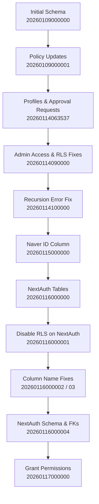
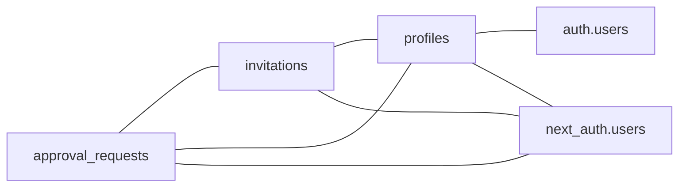

# Migration Management

<cite>
**Referenced Files in This Document**
- [20260109000000_initial_schema.sql](file://supabase/migrations/20260109000000_initial_schema.sql)
- [20260109000001_update_policies.sql](file://supabase/migrations/20260109000001_update_policies.sql)
- [20260114063537_add_profiles_and_approval_requests.sql](file://supabase/migrations/20260114063537_add_profiles_and_approval_requests.sql)
- [20260114090000_fix_admin_access_and_rls.sql](file://supabase/migrations/20260114090000_fix_admin_access_and_rls.sql)
- [20260114100000_fix_recursion_error.sql](file://supabase/migrations/20260114100000_fix_recursion_error.sql)
- [20260115000000_add_naver_id_to_profiles.sql](file://supabase/migrations/20260115000000_add_naver_id_to_profiles.sql)
- [20260116000000_add_nextauth_tables.sql](file://supabase/migrations/20260116000000_add_nextauth_tables.sql)
- [20260116000001_disable_rls_nextauth.sql](file://supabase/migrations/20260116000001_disable_rls_nextauth.sql)
- [20260116000002_fix_nextauth_column_names.sql](file://supabase/migrations/20260116000002_fix_nextauth_column_names.sql)
- [20260116000003_fix_nextauth_column_names_v2.sql](file://supabase/migrations/20260116000003_fix_nextauth_column_names_v2.sql)
- [20260116000004_create_nextauth_schema.sql](file://supabase/migrations/20260116000004_create_nextauth_schema.sql)
- [20260117000000_grant_permissions.sql](file://supabase/migrations/20260117000000_grant_permissions.sql)
- [backfill_profiles.sql](file://supabase/scripts/backfill_profiles.sql)
- [config.toml](file://supabase/config.toml)
- [grant_auth.sql](file://grant_auth.sql)
</cite>

## Table of Contents
1. [Introduction](#introduction)
2. [Project Structure](#project-structure)
3. [Core Components](#core-components)
4. [Architecture Overview](#architecture-overview)
5. [Detailed Component Analysis](#detailed-component-analysis)
6. [Dependency Analysis](#dependency-analysis)
7. [Performance Considerations](#performance-considerations)
8. [Troubleshooting Guide](#troubleshooting-guide)
9. [Conclusion](#conclusion)
10. [Appendices](#appendices)

## Introduction
This document explains the migration management system for database schema evolution and deployment in this project. It covers the sequential migration files, their purposes, and how they evolve the schema over time. It also documents the migration workflow from development to production, naming conventions, version control practices, rollback strategies, and practical examples for creating new migrations, handling data backfills, and managing production deployments. Finally, it describes the relationship between migrations and Supabase CLI commands, seed data management, and database initialization processes.

## Project Structure
The migration system lives under the Supabase configuration directory and consists of:
- A set of SQL migration files in chronological order
- A configuration file controlling migration and seeding behavior
- A script for backfilling legacy data into new schema constructs
- Additional grants for service roles

```mermaid
graph TB
subgraph "Supabase Configuration"
CFG["config.toml"]
MIG["migrations/"]
SCR["scripts/"]
end
MIG0["20260109000000_initial_schema.sql"]
MIG1["20260109000001_update_policies.sql"]
MIG2["20260114063537_add_profiles_and_approval_requests.sql"]
MIG3["20260114090000_fix_admin_access_and_rls.sql"]
MIG4["20260114100000_fix_recursion_error.sql"]
MIG5["20260115000000_add_naver_id_to_profiles.sql"]
MIG6["20260116000000_add_nextauth_tables.sql"]
MIG7["20260116000001_disable_rls_nextauth.sql"]
MIG8["20260116000002_fix_nextauth_column_names.sql"]
MIG9["20260116000003_fix_nextauth_column_names_v2.sql"]
MIG10["20260116000004_create_nextauth_schema.sql"]
MIG11["20260117000000_grant_permissions.sql"]
SCR0["backfill_profiles.sql"]
CFG --> MIG
MIG --> MIG0
MIG --> MIG1
MIG --> MIG2
MIG --> MIG3
MIG --> MIG4
MIG --> MIG5
MIG --> MIG6
MIG --> MIG7
MIG --> MIG8
MIG --> MIG9
MIG --> MIG10
MIG --> MIG11
SCR --> SCR0
```

**Diagram sources**
- [config.toml](file://supabase/config.toml#L53-L66)
- [20260109000000_initial_schema.sql](file://supabase/migrations/20260109000000_initial_schema.sql#L1-L52)
- [20260109000001_update_policies.sql](file://supabase/migrations/20260109000001_update_policies.sql#L1-L10)
- [20260114063537_add_profiles_and_approval_requests.sql](file://supabase/migrations/20260114063537_add_profiles_and_approval_requests.sql#L1-L234)
- [20260114090000_fix_admin_access_and_rls.sql](file://supabase/migrations/20260114090000_fix_admin_access_and_rls.sql#L1-L51)
- [20260114100000_fix_recursion_error.sql](file://supabase/migrations/20260114100000_fix_recursion_error.sql#L1-L81)
- [20260115000000_add_naver_id_to_profiles.sql](file://supabase/migrations/20260115000000_add_naver_id_to_profiles.sql#L1-L39)
- [20260116000000_add_nextauth_tables.sql](file://supabase/migrations/20260116000000_add_nextauth_tables.sql#L1-L57)
- [20260116000001_disable_rls_nextauth.sql](file://supabase/migrations/20260116000001_disable_rls_nextauth.sql#L1-L6)
- [20260116000002_fix_nextauth_column_names.sql](file://supabase/migrations/20260116000002_fix_nextauth_column_names.sql#L1-L43)
- [20260116000003_fix_nextauth_column_names_v2.sql](file://supabase/migrations/20260116000003_fix_nextauth_column_names_v2.sql#L1-L43)
- [20260116000004_create_nextauth_schema.sql](file://supabase/migrations/20260116000004_create_nextauth_schema.sql#L1-L100)
- [20260117000000_grant_permissions.sql](file://supabase/migrations/20260117000000_grant_permissions.sql#L1-L7)
- [backfill_profiles.sql](file://supabase/scripts/backfill_profiles.sql#L1-L32)

**Section sources**
- [config.toml](file://supabase/config.toml#L53-L66)

## Core Components
- Sequential migration files define schema evolution in strict chronological order. Each file encapsulates idempotent changes and is designed to be safe to apply repeatedly.
- The configuration file controls whether migrations are enabled, where they are loaded from, and whether seeds are executed after migrations.
- A dedicated backfill script initializes historical data into newly introduced schema constructs.
- Permissions and grants ensure service roles can operate on new schemas.

Key responsibilities:
- Define and evolve tables, indexes, policies, triggers, and functions
- Maintain backward compatibility and idempotency
- Support safe roll-forward and controlled roll-back strategies
- Integrate with Supabase CLI for local and remote deployments

**Section sources**
- [config.toml](file://supabase/config.toml#L53-L66)
- [backfill_profiles.sql](file://supabase/scripts/backfill_profiles.sql#L1-L32)

## Architecture Overview
The migration architecture follows a linear, time-based sequence. Each migration builds upon the previous state, adding tables, policies, triggers, and functions while preserving existing data and relationships.

**Diagram sources**
- [20260109000000_initial_schema.sql](file://supabase/migrations/20260109000000_initial_schema.sql#L1-L52)
- [20260109000001_update_policies.sql](file://supabase/migrations/20260109000001_update_policies.sql#L1-L10)
- [20260114063537_add_profiles_and_approval_requests.sql](file://supabase/migrations/20260114063537_add_profiles_and_approval_requests.sql#L1-L234)
- [20260114090000_fix_admin_access_and_rls.sql](file://supabase/migrations/20260114090000_fix_admin_access_and_rls.sql#L1-L51)
- [20260114100000_fix_recursion_error.sql](file://supabase/migrations/20260114100000_fix_recursion_error.sql#L1-L81)
- [20260115000000_add_naver_id_to_profiles.sql](file://supabase/migrations/20260115000000_add_naver_id_to_profiles.sql#L1-L39)
- [20260116000000_add_nextauth_tables.sql](file://supabase/migrations/20260116000000_add_nextauth_tables.sql#L1-L57)
- [20260116000001_disable_rls_nextauth.sql](file://supabase/migrations/20260116000001_disable_rls_nextauth.sql#L1-L6)
- [20260116000002_fix_nextauth_column_names.sql](file://supabase/migrations/20260116000002_fix_nextauth_column_names.sql#L1-L43)
- [20260116000003_fix_nextauth_column_names_v2.sql](file://supabase/migrations/20260116000003_fix_nextauth_column_names_v2.sql#L1-L43)
- [20260116000004_create_nextauth_schema.sql](file://supabase/migrations/20260116000004_create_nextauth_schema.sql#L1-L100)
- [20260117000000_grant_permissions.sql](file://supabase/migrations/20260117000000_grant_permissions.sql#L1-L7)

## Detailed Component Analysis

### Initial Schema (20260109000000)
Purpose:
- Establish the foundational invitations table with Row Level Security (RLS)
- Create storage bucket and policies for public image access
- Provide basic indexes for slug lookups

Key elements:
- Table definition with UUID primary key, JSONB data field, timestamps, and optional user foreign key
- RLS policies enabling public reads and authenticated writes for owners
- Storage bucket creation and public access policies

Operational notes:
- Idempotent creation using “IF NOT EXISTS”
- Index on slug for efficient lookups

**Section sources**
- [20260109000000_initial_schema.sql](file://supabase/migrations/20260109000000_initial_schema.sql#L1-L52)

### Policy Updates (20260109000001)
Purpose:
- Refine and rename the initial policy for managing invitations
- Improve clarity and maintainability of access rules

Key elements:
- Policy renamed and updated to reflect intended semantics
- Maintains authenticated user ownership controls

**Section sources**
- [20260109000001_update_policies.sql](file://supabase/migrations/20260109000001_update_policies.sql#L1-L10)

### Profiles and Approval Requests (20260114063537)
Purpose:
- Introduce profiles and approval_requests tables
- Automate profile creation via trigger on user signup
- Enforce comprehensive RLS policies
- Add helper functions and updated_at triggers

Key elements:
- Profiles table linked to auth.users with admin flag and completion tracking
- Trigger and function to auto-create profiles on user signup
- Approval requests table with status tracking and admin review
- Helper function to check profile completeness
- Updated_at triggers for automatic timestamp updates

Best practices applied:
- Idempotent statements
- RLS-enabled tables with granular policies
- Secure function definitions and triggers

**Section sources**
- [20260114063537_add_profiles_and_approval_requests.sql](file://supabase/migrations/20260114063537_add_profiles_and_approval_requests.sql#L1-L234)

### Admin Access and RLS Fixes (20260114090000)
Purpose:
- Grant admin users expanded access to invitations
- Backfill admin flag for existing users
- Adjust RLS policies to include admin permissions

Key elements:
- Update profiles to mark admin@test.com as admin
- Modify invitations policy to allow admin write access
- Adjust profiles policy to allow admins to view all records

**Section sources**
- [20260114090000_fix_admin_access_and_rls.sql](file://supabase/migrations/20260114090000_fix_admin_access_and_rls.sql#L1-L51)

### Recursion Error Fix (20260114100000)
Purpose:
- Resolve infinite recursion in RLS policies
- Use a SECURITY DEFINER function to safely check admin status

Key elements:
- Create a function to check admin status bypassing RLS
- Update policies to use the function instead of direct recursive queries

**Section sources**
- [20260114100000_fix_recursion_error.sql](file://supabase/migrations/20260114100000_fix_recursion_error.sql#L1-L81)

### Naver ID Column (20260115000000)
Purpose:
- Add a unique column for Naver OAuth user identifiers
- Enhance the user creation trigger to capture Naver ID

Key elements:
- New column with unique index
- Updated trigger to populate Naver ID and handle conflicts

**Section sources**
- [20260115000000_add_naver_id_to_profiles.sql](file://supabase/migrations/20260115000000_add_naver_id_to_profiles.sql#L1-L39)

### NextAuth Tables (20260116000000)
Purpose:
- Create NextAuth-compatible tables within a dedicated schema
- Prepare for external authentication integration

Key elements:
- Users, accounts, sessions, and verification tokens tables
- Unique constraints and indexes for performance
- Extension enablement for UUID generation

**Section sources**
- [20260116000000_add_nextauth_tables.sql](file://supabase/migrations/20260116000000_add_nextauth_tables.sql#L1-L57)

### Disable RLS on NextAuth (20260116000001)
Purpose:
- Disable RLS on NextAuth tables to allow service_role access
- Align with NextAuth adapter expectations

Key elements:
- Disable RLS on all NextAuth tables

**Section sources**
- [20260116000001_disable_rls_nextauth.sql](file://supabase/migrations/20260116000001_disable_rls_nextauth.sql#L1-L6)

### Column Name Fixes (20260116000002, 20260116000003)
Purpose:
- Normalize column names to match NextAuth adapter expectations
- Ensure compatibility across environments

Key elements:
- Conditional ALTER TABLE statements to rename columns if present
- Idempotent operation using information_schema checks

**Section sources**
- [20260116000002_fix_nextauth_column_names.sql](file://supabase/migrations/20260116000002_fix_nextauth_column_names.sql#L1-L43)
- [20260116000003_fix_nextauth_column_names_v2.sql](file://supabase/migrations/20260116000003_fix_nextauth_column_names_v2.sql#L1-L43)

### NextAuth Schema & Foreign Keys (20260116000004)
Purpose:
- Finalize NextAuth schema and migrate data
- Update foreign keys to reference NextAuth users

Key elements:
- Ensure next_auth schema exists and tables match adapter expectations
- Insert users from auth.users into next_auth.users
- Drop and recreate foreign keys to point to next_auth.users
- Disable RLS on NextAuth tables

**Section sources**
- [20260116000004_create_nextauth_schema.sql](file://supabase/migrations/20260116000004_create_nextauth_schema.sql#L1-L100)

### Grant Permissions (20260117000000)
Purpose:
- Grant service_role and postgres access to the next_auth schema
- Enable full operations on tables and sequences

Key elements:
- USAGE and ALL grants on schema and objects

**Section sources**
- [20260117000000_grant_permissions.sql](file://supabase/migrations/20260117000000_grant_permissions.sql#L1-L7)

### Backfill Profiles (supabase/scripts/backfill_profiles.sql)
Purpose:
- Populate profiles for existing users after introducing the profiles table
- Capture metadata and set admin flags for specific users

Key elements:
- INSERT with ON CONFLICT handling
- Metadata extraction from auth.users raw_user_meta_data
- Verification query to confirm results

**Section sources**
- [backfill_profiles.sql](file://supabase/scripts/backfill_profiles.sql#L1-L32)

## Dependency Analysis
The migrations form a strict dependency chain where later migrations rely on earlier schema constructs. The following diagram shows the primary dependencies among key components:

**Diagram sources**
- [20260114063537_add_profiles_and_approval_requests.sql](file://supabase/migrations/20260114063537_add_profiles_and_approval_requests.sql#L114-L126)
- [20260114090000_fix_admin_access_and_rls.sql](file://supabase/migrations/20260114090000_fix_admin_access_and_rls.sql#L12-L14)
- [20260116000004_create_nextauth_schema.sql](file://supabase/migrations/20260116000004_create_nextauth_schema.sql#L81-L99)

**Section sources**
- [20260114063537_add_profiles_and_approval_requests.sql](file://supabase/migrations/20260114063537_add_profiles_and_approval_requests.sql#L114-L126)
- [20260116000004_create_nextauth_schema.sql](file://supabase/migrations/20260116000004_create_nextauth_schema.sql#L81-L99)

## Performance Considerations
- Indexes: Ensure appropriate indexes exist for frequent lookup columns (e.g., invitations.slug, approval_requests indices) to minimize query cost.
- Triggers: Updated_at triggers are lightweight but should be reviewed for impact on write-heavy workloads.
- Policies: Keep RLS policies concise; the use of helper functions reduces recursion risk and improves maintainability.
- Backfills: Use targeted backfill scripts to avoid blocking operations; schedule during low-traffic periods.

[No sources needed since this section provides general guidance]

## Troubleshooting Guide
Common issues and resolutions:
- Infinite recursion in RLS: Resolved by using a SECURITY DEFINER helper function to check admin status.
- Policy conflicts: Ensure policies are idempotent and use DROP POLICY IF EXISTS before CREATE to avoid conflicts.
- NextAuth mismatches: Use column name fix migrations to align with adapter expectations.
- Permission errors: Verify grants to service_role and postgres on the next_auth schema.

**Section sources**
- [20260114100000_fix_recursion_error.sql](file://supabase/migrations/20260114100000_fix_recursion_error.sql#L12-L24)
- [20260116000002_fix_nextauth_column_names.sql](file://supabase/migrations/20260116000002_fix_nextauth_column_names.sql#L1-L43)
- [20260117000000_grant_permissions.sql](file://supabase/migrations/20260117000000_grant_permissions.sql#L1-L7)

## Conclusion
This migration system provides a robust, idempotent, and auditable path for evolving the database schema. By following the established naming conventions, applying changes sequentially, and leveraging helper functions and backfill scripts, teams can confidently deploy schema changes across environments. The configuration file ensures consistent behavior for migrations and seeds, while the documented rollback strategies and troubleshooting steps support safe operations in production.

[No sources needed since this section summarizes without analyzing specific files]

## Appendices

### Migration Naming Conventions and Version Control Practices
- Format: YYYYMMDDHHMMSS_<description>.sql
- Purpose: Chronological ordering and human-readable descriptions
- Idempotency: Use IF NOT EXISTS and DROP ... IF EXISTS where applicable
- Atomicity: Group related changes in a single migration file
- Review: Include comments explaining intent and best practices

**Section sources**
- [20260109000000_initial_schema.sql](file://supabase/migrations/20260109000000_initial_schema.sql#L1-L10)
- [20260114063537_add_profiles_and_approval_requests.sql](file://supabase/migrations/20260114063537_add_profiles_and_approval_requests.sql#L1-L10)

### Rollback Strategies
- Forward-only approach: Prefer adding new migrations to fix issues rather than rolling back
- Controlled rollbacks: If necessary, revert by creating a new migration that undoes specific changes
- Data safety: Use transactions and idempotent statements to minimize risk

[No sources needed since this section provides general guidance]

### Practical Examples

#### Creating a New Migration
- Steps:
  - Create a new file with a timestamp prefix under supabase/migrations
  - Implement idempotent schema changes
  - Add indexes, triggers, and policies as needed
  - Commit and push to version control

**Section sources**
- [20260115000000_add_naver_id_to_profiles.sql](file://supabase/migrations/20260115000000_add_naver_id_to_profiles.sql#L1-L12)

#### Handling Data Backfill Operations
- Steps:
  - Write a targeted script to migrate historical data
  - Use ON CONFLICT handling to avoid duplicates
  - Validate results with a verification query
  - Schedule during maintenance windows

**Section sources**
- [backfill_profiles.sql](file://supabase/scripts/backfill_profiles.sql#L1-L32)

#### Managing Production Deployments
- Steps:
  - Review migration sequence and dependencies
  - Test locally with supabase db push
  - Apply migrations to staging first
  - Monitor logs and run verification queries
  - Apply to production with minimal downtime

**Section sources**
- [config.toml](file://supabase/config.toml#L53-L66)

### Relationship to Supabase CLI and Seed Data
- CLI commands:
  - supabase db push: Applies migrations and seeds according to configuration
  - supabase db reset: Resets database and re-applies migrations and seeds
- Configuration:
  - Migrations enabled and managed via db.migrations
  - Seeds enabled and configured via db.seed with sql_paths

**Section sources**
- [config.toml](file://supabase/config.toml#L53-L66)

### Database Initialization Processes
- Initialization flow:
  - Apply migrations in order
  - Execute seed data if enabled
  - Verify schema and data integrity
  - Confirm RLS policies and permissions

**Section sources**
- [config.toml](file://supabase/config.toml#L60-L66)
- [20260117000000_grant_permissions.sql](file://supabase/migrations/20260117000000_grant_permissions.sql#L1-L7)