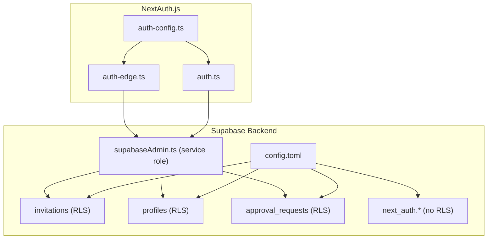
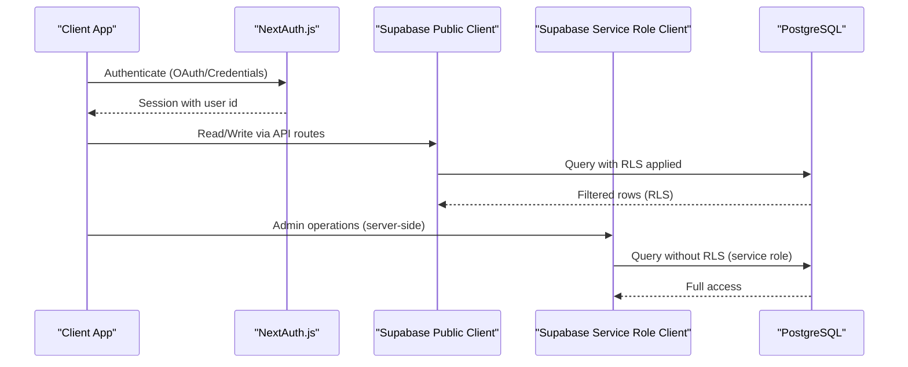
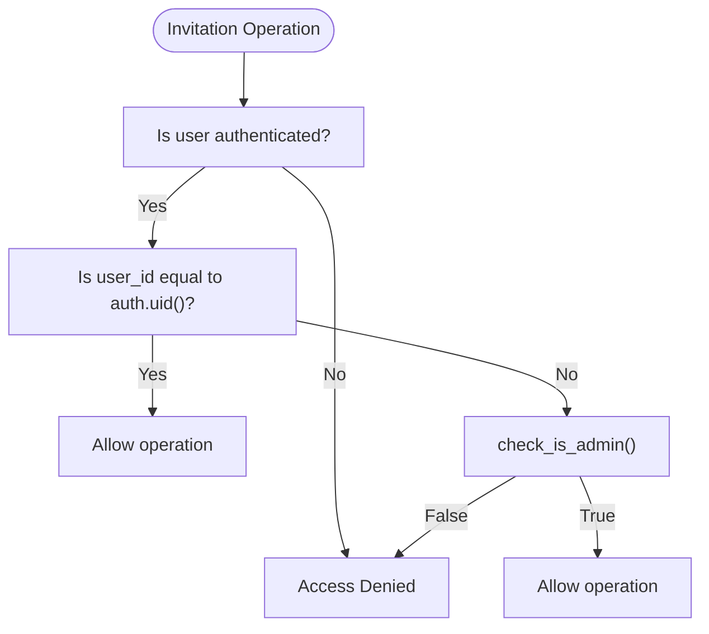
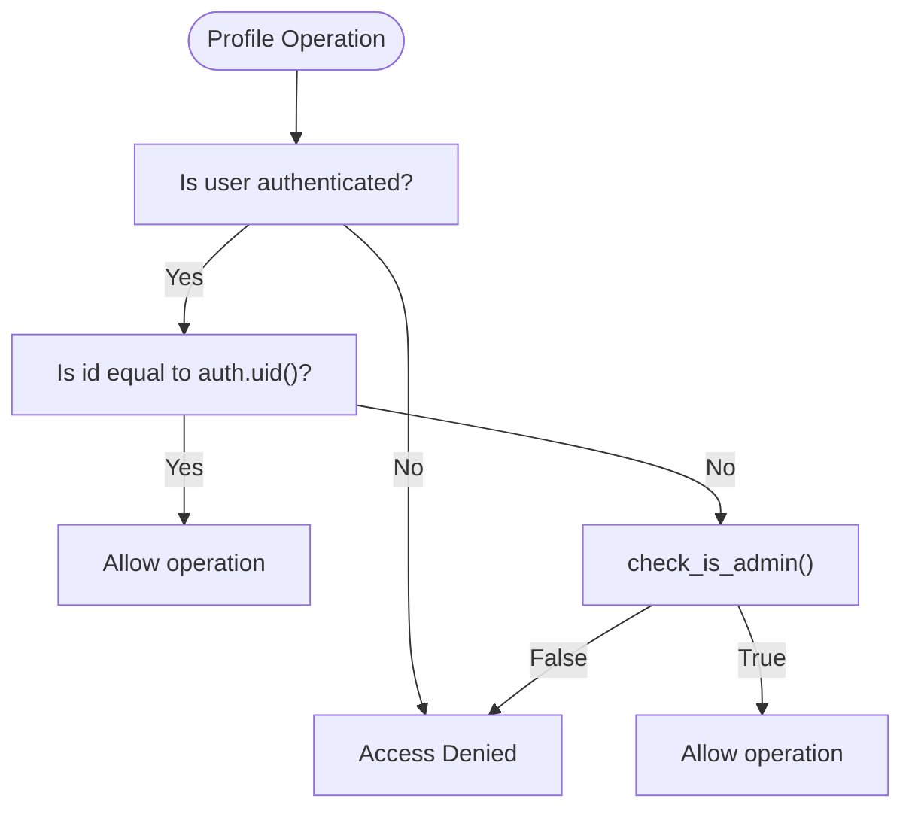
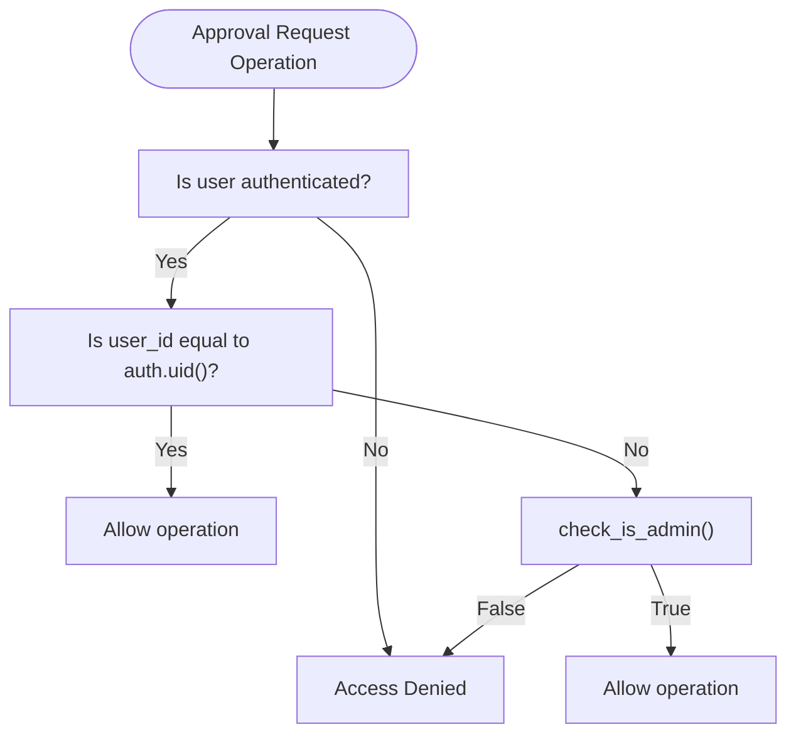
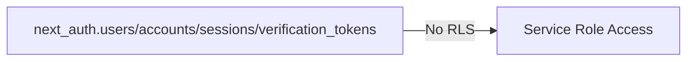
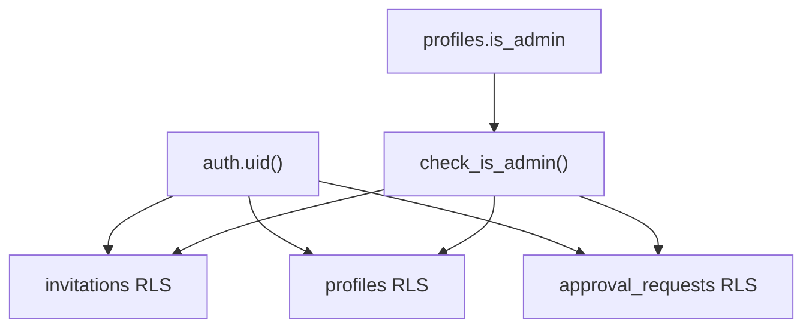

# Row Level Security (RLS)

<cite>
**Referenced Files in This Document**
- [supabase/config.toml](file://supabase/config.toml)
- [supabase/migrations/20260109000000_initial_schema.sql](file://supabase/migrations/20260109000000_initial_schema.sql)
- [supabase/migrations/20260109000001_update_policies.sql](file://supabase/migrations/20260109000001_update_policies.sql)
- [supabase/migrations/20260114063537_add_profiles_and_approval_requests.sql](file://supabase/migrations/20260114063537_add_profiles_and_approval_requests.sql)
- [supabase/migrations/20260114090000_fix_admin_access_and_rls.sql](file://supabase/migrations/20260114090000_fix_admin_access_and_rls.sql)
- [supabase/migrations/20260114100000_fix_recursion_error.sql](file://supabase/migrations/20260114100000_fix_recursion_error.sql)
- [supabase/migrations/20260115000000_add_naver_id_to_profiles.sql](file://supabase/migrations/20260115000000_add_naver_id_to_profiles.sql)
- [supabase/migrations/20260116000001_disable_rls_nextauth.sql](file://supabase/migrations/20260116000001_disable_rls_nextauth.sql)
- [src/auth-config.ts](file://src/auth-config.ts)
- [src/auth.ts](file://src/auth.ts)
- [src/auth-edge.ts](file://src/auth-edge.ts)
- [src/lib/supabaseAdmin.ts](file://src/lib/supabaseAdmin.ts)
</cite>

## Table of Contents
1. [Introduction](#introduction)
2. [Project Structure](#project-structure)
3. [Core Components](#core-components)
4. [Architecture Overview](#architecture-overview)
5. [Detailed Component Analysis](#detailed-component-analysis)
6. [Dependency Analysis](#dependency-analysis)
7. [Performance Considerations](#performance-considerations)
8. [Troubleshooting Guide](#troubleshooting-guide)
9. [Conclusion](#conclusion)

## Introduction
This document explains the Row Level Security (RLS) policies implemented in the application’s Supabase backend and how they integrate with NextAuth.js authentication. It focuses on access control for four key tables: invitations, profiles, approval_requests, and the NextAuth-related tables under the next_auth schema. The policies ensure that:
- Users can only access and modify their own data.
- Admins have elevated permissions to view and manage all records.
- RLS integrates seamlessly with NextAuth.js via Supabase Adapter and service-role clients.
- Policies avoid recursion and maintain predictable performance.

## Project Structure
The RLS policies are defined in Supabase migration files and enforced by PostgreSQL row-level security. Authentication is handled by NextAuth.js with Supabase Adapter, storing session and user metadata in the next_auth schema. The application uses a service role client for server-side operations and enforces RLS on public tables.

**Diagram sources**
- [supabase/config.toml](file://supabase/config.toml#L13-L15)
- [supabase/migrations/20260109000000_initial_schema.sql](file://supabase/migrations/20260109000000_initial_schema.sql#L13-L14)
- [supabase/migrations/20260114063537_add_profiles_and_approval_requests.sql](file://supabase/migrations/20260114063537_add_profiles_and_approval_requests.sql#L37-L38)
- [supabase/migrations/20260116000001_disable_rls_nextauth.sql](file://supabase/migrations/20260116000001_disable_rls_nextauth.sql#L1-L6)
- [src/auth-config.ts](file://src/auth-config.ts#L33-L36)
- [src/auth.ts](file://src/auth.ts#L1-L5)
- [src/auth-edge.ts](file://src/auth-edge.ts#L1-L5)
- [src/lib/supabaseAdmin.ts](file://src/lib/supabaseAdmin.ts#L1-L15)

**Section sources**
- [supabase/config.toml](file://supabase/config.toml#L13-L15)
- [src/auth-config.ts](file://src/auth-config.ts#L33-L36)
- [src/lib/supabaseAdmin.ts](file://src/lib/supabaseAdmin.ts#L1-L15)

## Core Components
- Supabase RLS policies on invitations, profiles, and approval_requests define who can access and modify data.
- NextAuth.js with Supabase Adapter manages authentication and stores session data in next_auth schema.
- Service role client (supabaseAdmin) bypasses RLS for privileged server-side operations.
- A helper function is used to safely check admin status without causing recursion.

**Section sources**
- [supabase/migrations/20260109000000_initial_schema.sql](file://supabase/migrations/20260109000000_initial_schema.sql#L13-L14)
- [supabase/migrations/20260114063537_add_profiles_and_approval_requests.sql](file://supabase/migrations/20260114063537_add_profiles_and_approval_requests.sql#L37-L38)
- [supabase/migrations/20260114100000_fix_recursion_error.sql](file://supabase/migrations/20260114100000_fix_recursion_error.sql#L9-L24)
- [supabase/migrations/20260116000001_disable_rls_nextauth.sql](file://supabase/migrations/20260116000001_disable_rls_nextauth.sql#L1-L6)
- [src/auth-config.ts](file://src/auth-config.ts#L33-L36)
- [src/lib/supabaseAdmin.ts](file://src/lib/supabaseAdmin.ts#L1-L15)

## Architecture Overview
The authorization model combines NextAuth.js authentication with Supabase RLS:
- Authenticated users operate within RLS-restricted contexts.
- Admin users gain elevated permissions via profiles.is_admin checked through a secure helper function.
- Service role client performs administrative tasks outside RLS constraints.

**Diagram sources**
- [src/auth.ts](file://src/auth.ts#L1-L5)
- [src/auth-config.ts](file://src/auth-config.ts#L33-L36)
- [src/lib/supabaseAdmin.ts](file://src/lib/supabaseAdmin.ts#L1-L15)
- [supabase/migrations/20260114100000_fix_recursion_error.sql](file://supabase/migrations/20260114100000_fix_recursion_error.sql#L9-L24)

## Detailed Component Analysis

### Invitations Table RLS
Purpose: Control access to invitation records. Users can manage only their own invitations; admins can manage all.

Policy logic:
- Users can select/update/delete/insert only where user_id equals the authenticated user id.
- Admins can perform all operations if the authenticated user is marked admin in profiles.

Security considerations:
- Uses a helper function to check admin status to avoid recursion.
- Service role retains broad access for administrative tasks.

**Diagram sources**
- [supabase/migrations/20260114090000_fix_admin_access_and_rls.sql](file://supabase/migrations/20260114090000_fix_admin_access_and_rls.sql#L21-L37)
- [supabase/migrations/20260114100000_fix_recursion_error.sql](file://supabase/migrations/20260114100000_fix_recursion_error.sql#L40-L50)

**Section sources**
- [supabase/migrations/20260109000000_initial_schema.sql](file://supabase/migrations/20260109000000_initial_schema.sql#L13-L14)
- [supabase/migrations/20260109000001_update_policies.sql](file://supabase/migrations/20260109000001_update_policies.sql#L4-L9)
- [supabase/migrations/20260114090000_fix_admin_access_and_rls.sql](file://supabase/migrations/20260114090000_fix_admin_access_and_rls.sql#L16-L37)
- [supabase/migrations/20260114100000_fix_recursion_error.sql](file://supabase/migrations/20260114100000_fix_recursion_error.sql#L37-L50)

### Profiles Table RLS
Purpose: Enforce personal profile ownership and admin visibility.

Policy logic:
- Users can view/update only their own profile.
- Admins can view all profiles using a helper function to avoid recursion.
- Insert is allowed for authenticated users’ own profiles (via trigger/service role).

**Diagram sources**
- [supabase/migrations/20260114063537_add_profiles_and_approval_requests.sql](file://supabase/migrations/20260114063537_add_profiles_and_approval_requests.sql#L44-L73)
- [supabase/migrations/20260114100000_fix_recursion_error.sql](file://supabase/migrations/20260114100000_fix_recursion_error.sql#L26-L35)

**Section sources**
- [supabase/migrations/20260114063537_add_profiles_and_approval_requests.sql](file://supabase/migrations/20260114063537_add_profiles_and_approval_requests.sql#L37-L73)
- [supabase/migrations/20260114100000_fix_recursion_error.sql](file://supabase/migrations/20260114100000_fix_recursion_error.sql#L9-L35)

### Approval Requests Table RLS
Purpose: Control access to approval requests for invitations.

Policy logic:
- Users can view/select/create only their own requests.
- Admins can view and update all requests using the helper function.

**Diagram sources**
- [supabase/migrations/20260114063537_add_profiles_and_approval_requests.sql](file://supabase/migrations/20260114063537_add_profiles_and_approval_requests.sql#L145-L183)
- [supabase/migrations/20260114100000_fix_recursion_error.sql](file://supabase/migrations/20260114100000_fix_recursion_error.sql#L52-L80)

**Section sources**
- [supabase/migrations/20260114063537_add_profiles_and_approval_requests.sql](file://supabase/migrations/20260114063537_add_profiles_and_approval_requests.sql#L138-L183)
- [supabase/migrations/20260114100000_fix_recursion_error.sql](file://supabase/migrations/20260114100000_fix_recursion_error.sql#L52-L80)

### NextAuth.js Tables (next_auth schema)
Purpose: Store NextAuth.js session and user data. RLS is disabled to allow service role access.

Key points:
- next_auth schema is configured for NextAuth.js.
- RLS is disabled on next_auth tables to permit administrative operations.
- Auth.js adapter uses Supabase service role credentials to manage sessions.

**Diagram sources**
- [supabase/config.toml](file://supabase/config.toml#L13)
- [supabase/migrations/20260116000001_disable_rls_nextauth.sql](file://supabase/migrations/20260116000001_disable_rls_nextauth.sql#L1-L6)
- [src/auth-config.ts](file://src/auth-config.ts#L33-L36)

**Section sources**
- [supabase/config.toml](file://supabase/config.toml#L13-L15)
- [supabase/migrations/20260116000001_disable_rls_nextauth.sql](file://supabase/migrations/20260116000001_disable_rls_nextauth.sql#L1-L6)
- [src/auth-config.ts](file://src/auth-config.ts#L33-L36)

## Dependency Analysis
- RLS policies depend on the authenticated user id (auth.uid()) and the profiles.is_admin flag.
- The helper function check_is_admin() is central to avoiding recursion and enabling admin checks across tables.
- NextAuth.js integrates with Supabase via the adapter and service role client.
- Service role client bypasses RLS for privileged operations.

**Diagram sources**
- [supabase/migrations/20260114100000_fix_recursion_error.sql](file://supabase/migrations/20260114100000_fix_recursion_error.sql#L9-L24)
- [supabase/migrations/20260114090000_fix_admin_access_and_rls.sql](file://supabase/migrations/20260114090000_fix_admin_access_and_rls.sql#L24-L36)

**Section sources**
- [supabase/migrations/20260114100000_fix_recursion_error.sql](file://supabase/migrations/20260114100000_fix_recursion_error.sql#L9-L24)
- [supabase/migrations/20260114090000_fix_admin_access_and_rls.sql](file://supabase/migrations/20260114090000_fix_admin_access_and_rls.sql#L24-L36)

## Performance Considerations
- Keep RLS expressions simple and indexed where possible (e.g., indexes on user_id and slug).
- Use helper functions for admin checks to avoid repeated subqueries and recursion.
- Prefer service role client for bulk administrative tasks to bypass RLS overhead.
- Monitor query plans for complex joins involving RLS-enabled tables.

[No sources needed since this section provides general guidance]

## Troubleshooting Guide
Common issues and resolutions:
- Unauthorized access errors:
  - Verify the authenticated user id matches the record’s user_id.
  - Confirm the user is not missing admin privileges; ensure profiles.is_admin is set.
  - Check that the helper function is used for admin checks to avoid recursion.
- Admin cannot view all records:
  - Ensure the helper function is invoked in policies for tables that previously queried profiles directly.
  - Confirm the admin email is included in the configured admin list.
- NextAuth session inconsistencies:
  - Ensure the next_auth schema is enabled and RLS is disabled for next_auth tables.
  - Confirm the service role key is correctly configured for the adapter and clients.

**Section sources**
- [supabase/migrations/20260114100000_fix_recursion_error.sql](file://supabase/migrations/20260114100000_fix_recursion_error.sql#L9-L24)
- [supabase/migrations/20260116000001_disable_rls_nextauth.sql](file://supabase/migrations/20260116000001_disable_rls_nextauth.sql#L1-L6)
- [src/auth-config.ts](file://src/auth-config.ts#L25-L28)

## Conclusion
The application’s RLS policies provide a robust authorization model:
- Users access only their own data.
- Admins gain elevated permissions via a secure helper function that avoids recursion.
- NextAuth.js integrates cleanly with Supabase Adapter and service role clients.
- The design balances security, performance, and maintainability across invitations, profiles, and approval_requests, while ensuring administrative tasks remain efficient.

[No sources needed since this section summarizes without analyzing specific files]