# Supabase Client Configuration

<cite>
**Referenced Files in This Document**
- [src/lib/supabase.ts](file://src/lib/supabase.ts)
- [src/lib/supabase/client.ts](file://src/lib/supabase/client.ts)
- [src/lib/supabase/server.ts](file://src/lib/supabase/server.ts)
- [src/lib/supabase/jwt.ts](file://src/lib/supabase/jwt.ts)
- [src/lib/supabaseAdmin.ts](file://src/lib/supabaseAdmin.ts)
- [src/lib/env.ts](file://src/lib/env.ts)
- [src/app/api/supabase/token/route.ts](file://src/app/api/supabase/token/route.ts)
- [src/auth-config.ts](file://src/auth-config.ts)
- [src/auth.ts](file://src/auth.ts)
- [src/services/profileService.ts](file://src/services/profileService.ts)
- [src/services/invitationService.ts](file://src/services/invitationService.ts)
- [src/hooks/useAuth.ts](file://src/hooks/useAuth.ts)
- [middleware.ts](file://middleware.ts)
- [supabase/migrations/20260109000000_initial_schema.sql](file://supabase/migrations/20260109000000_initial_schema.sql)
- [supabase/migrations/20260114063537_add_profiles_and_approval_requests.sql](file://supabase/migrations/20260114063537_add_profiles_and_approval_requests.sql)
</cite>

## Table of Contents
1. [Introduction](#introduction)
2. [Project Structure](#project-structure)
3. [Core Components](#core-components)
4. [Architecture Overview](#architecture-overview)
5. [Detailed Component Analysis](#detailed-component-analysis)
6. [Dependency Analysis](#dependency-analysis)
7. [Performance Considerations](#performance-considerations)
8. [Troubleshooting Guide](#troubleshooting-guide)
9. [Conclusion](#conclusion)
10. [Appendices](#appendices)

## Introduction
This document explains how the application configures and uses Supabase clients for secure database connectivity across server-side and client-side contexts. It covers three primary client configurations:
- Admin database client for server-side operations
- Browser client for client-side database access
- Server-side client that attaches a signed JWT for authenticated requests

It also documents authentication mechanisms, connection behavior, security considerations, configuration options, environment variables, best practices, practical operation examples, error handling strategies, and performance optimization techniques. Finally, it ties client configuration to the application’s security model enforced by Row Level Security (RLS) and NextAuth.

## Project Structure
The Supabase client configuration is organized around dedicated modules and services:
- Client initialization and caching logic live under src/lib/supabase/*
- Admin client initialization lives under src/lib/supabaseAdmin.ts
- Environment validation resides under src/lib/env.ts
- Token issuance for browser clients is handled by src/app/api/supabase/token/route.ts
- JWT generation for authenticated Supabase requests is under src/lib/supabase/jwt.ts
- Authentication configuration (NextAuth) is under src/auth-config.ts and exposed via src/auth.ts
- Services demonstrate client usage for database operations under src/services/*
- Hooks integrate authentication state and profile queries under src/hooks/useAuth.ts
- Middleware enforces protected routes based on authentication state under middleware.ts
- Database schema and RLS policies are defined in supabase/migrations/*

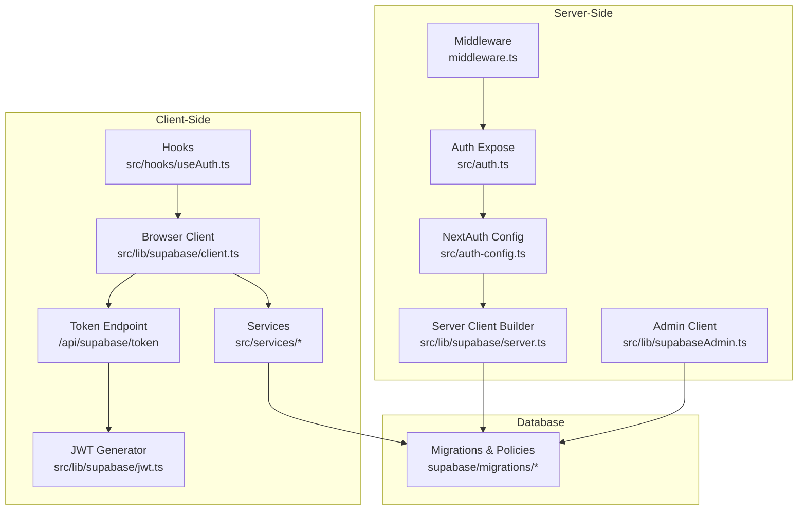

**Diagram sources**
- [src/lib/supabase/client.ts](file://src/lib/supabase/client.ts#L1-L85)
- [src/app/api/supabase/token/route.ts](file://src/app/api/supabase/token/route.ts#L1-L16)
- [src/lib/supabase/jwt.ts](file://src/lib/supabase/jwt.ts#L1-L15)
- [src/lib/supabaseAdmin.ts](file://src/lib/supabaseAdmin.ts#L1-L15)
- [src/lib/supabase/server.ts](file://src/lib/supabase/server.ts#L1-L19)
- [src/auth-config.ts](file://src/auth-config.ts#L1-L227)
- [src/auth.ts](file://src/auth.ts#L1-L5)
- [middleware.ts](file://middleware.ts#L1-L22)
- [supabase/migrations/20260109000000_initial_schema.sql](file://supabase/migrations/20260109000000_initial_schema.sql#L1-L52)
- [supabase/migrations/20260114063537_add_profiles_and_approval_requests.sql](file://supabase/migrations/20260114063537_add_profiles_and_approval_requests.sql#L1-L234)

**Section sources**
- [src/lib/supabase.ts](file://src/lib/supabase.ts#L1-L2)
- [src/lib/supabase/client.ts](file://src/lib/supabase/client.ts#L1-L85)
- [src/lib/supabaseAdmin.ts](file://src/lib/supabaseAdmin.ts#L1-L15)
- [src/lib/supabase/server.ts](file://src/lib/supabase/server.ts#L1-L19)
- [src/lib/supabase/jwt.ts](file://src/lib/supabase/jwt.ts#L1-L15)
- [src/lib/env.ts](file://src/lib/env.ts#L1-L51)
- [src/app/api/supabase/token/route.ts](file://src/app/api/supabase/token/route.ts#L1-L16)
- [src/auth-config.ts](file://src/auth-config.ts#L1-L227)
- [src/auth.ts](file://src/auth.ts#L1-L5)
- [src/services/profileService.ts](file://src/services/profileService.ts#L1-L101)
- [src/services/invitationService.ts](file://src/services/invitationService.ts#L1-L81)
- [src/hooks/useAuth.ts](file://src/hooks/useAuth.ts#L1-L55)
- [middleware.ts](file://middleware.ts#L1-L22)
- [supabase/migrations/20260109000000_initial_schema.sql](file://supabase/migrations/20260109000000_initial_schema.sql#L1-L52)
- [supabase/migrations/20260114063537_add_profiles_and_approval_requests.sql](file://supabase/migrations/20260114063537_add_profiles_and_approval_requests.sql#L1-L234)

## Core Components
- Browser client initialization and caching:
  - Initializes a per-token Supabase client using the anonymous key and optional Authorization header.
  - Fetches a short-lived JWT from the server endpoint and caches it until expiration.
  - Prevents frequent reinitialization by maintaining a cached client instance keyed by token.
- Admin client:
  - Server-side-only client configured with the service role key for privileged operations.
  - Disables automatic token refresh and session persistence.
- Server client builder:
  - Accepts a NextAuth session, generates a signed JWT, and creates a Supabase client with an Authorization header.
- Token endpoint:
  - Validates NextAuth session, extracts user ID, and returns a signed JWT for Supabase access.
- JWT generator:
  - Produces a signed HS256 JWT with a configurable secret and a fixed expiration.
- Environment validation:
  - Enforces presence and shape of Supabase-related environment variables using Zod.
- Authentication configuration:
  - Integrates NextAuth with Supabase Adapter and provider configs.
  - Upserts user profiles and admin flags upon sign-in.
- Services:
  - Demonstrate client usage for profile retrieval and invitation CRUD operations.
- Hooks:
  - Manage authentication state and profile queries with React Query.

**Section sources**
- [src/lib/supabase/client.ts](file://src/lib/supabase/client.ts#L1-L85)
- [src/lib/supabaseAdmin.ts](file://src/lib/supabaseAdmin.ts#L1-L15)
- [src/lib/supabase/server.ts](file://src/lib/supabase/server.ts#L1-L19)
- [src/app/api/supabase/token/route.ts](file://src/app/api/supabase/token/route.ts#L1-L16)
- [src/lib/supabase/jwt.ts](file://src/lib/supabase/jwt.ts#L1-L15)
- [src/lib/env.ts](file://src/lib/env.ts#L1-L51)
- [src/auth-config.ts](file://src/auth-config.ts#L1-L227)
- [src/services/profileService.ts](file://src/services/profileService.ts#L1-L101)
- [src/services/invitationService.ts](file://src/services/invitationService.ts#L1-L81)
- [src/hooks/useAuth.ts](file://src/hooks/useAuth.ts#L1-L55)

## Architecture Overview
The system separates concerns across client and server:
- Client-side:
  - Uses the anonymous key and a temporary bearer token obtained from the server.
  - The token endpoint validates the NextAuth session and returns a signed JWT.
- Server-side:
  - Admin client uses the service role key for privileged operations.
  - Server client builder attaches a signed JWT to requests for authenticated access.
- Database:
  - RLS policies enforce row-level access control for tables like invitations, profiles, and approval_requests.

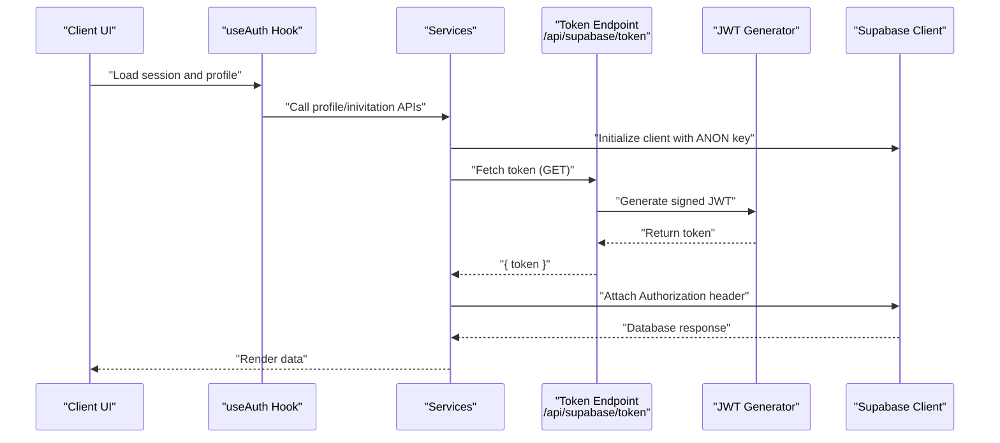

**Diagram sources**
- [src/hooks/useAuth.ts](file://src/hooks/useAuth.ts#L1-L55)
- [src/services/profileService.ts](file://src/services/profileService.ts#L1-L101)
- [src/services/invitationService.ts](file://src/services/invitationService.ts#L1-L81)
- [src/app/api/supabase/token/route.ts](file://src/app/api/supabase/token/route.ts#L1-L16)
- [src/lib/supabase/jwt.ts](file://src/lib/supabase/jwt.ts#L1-L15)
- [src/lib/supabase/client.ts](file://src/lib/supabase/client.ts#L1-L85)

## Detailed Component Analysis

### Browser Client Initialization and Caching
- Purpose:
  - Provide a cached Supabase client instance configured with the anonymous key.
  - Dynamically attach an Authorization header when a valid token exists.
- Behavior:
  - Decodes JWT expiry to determine validity window.
  - Debounces token fetch requests using a pending promise.
  - Re-creates the client only when the token changes or is newly acquired.
  - Disables session persistence and auto-refresh for client-side usage.
- Token acquisition:
  - Calls the token endpoint to obtain a signed JWT tied to the current NextAuth session.
- Practical usage:
  - Services import the browser client factory and use it for database operations.

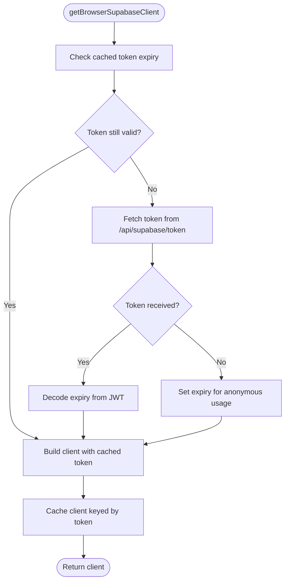

**Diagram sources**
- [src/lib/supabase/client.ts](file://src/lib/supabase/client.ts#L1-L85)

**Section sources**
- [src/lib/supabase/client.ts](file://src/lib/supabase/client.ts#L1-L85)

### Token Endpoint and JWT Generation
- Token endpoint:
  - Requires a valid NextAuth session.
  - Extracts the user ID and returns a signed JWT for Supabase access.
- JWT generation:
  - Uses a shared secret to sign a JWT with subject (user ID) and expiration.
  - Designed for short-lived access to Supabase resources.

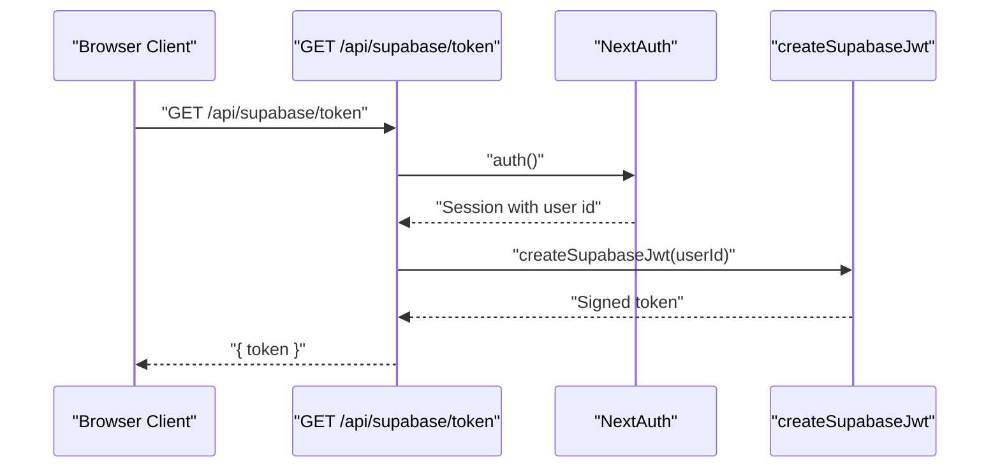

**Diagram sources**
- [src/app/api/supabase/token/route.ts](file://src/app/api/supabase/token/route.ts#L1-L16)
- [src/lib/supabase/jwt.ts](file://src/lib/supabase/jwt.ts#L1-L15)

**Section sources**
- [src/app/api/supabase/token/route.ts](file://src/app/api/supabase/token/route.ts#L1-L16)
- [src/lib/supabase/jwt.ts](file://src/lib/supabase/jwt.ts#L1-L15)

### Server Client Builder
- Purpose:
  - Create a Supabase client for server-side usage with an attached Authorization header derived from a NextAuth session.
- Behavior:
  - Resolves session either from provided argument or via auth().
  - Generates a signed JWT and attaches it to the client options.
  - Disables session persistence and auto-refresh.

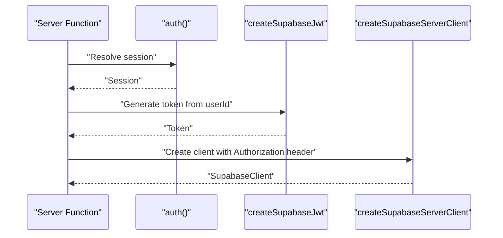

**Diagram sources**
- [src/lib/supabase/server.ts](file://src/lib/supabase/server.ts#L1-L19)
- [src/lib/supabase/jwt.ts](file://src/lib/supabase/jwt.ts#L1-L15)
- [src/auth.ts](file://src/auth.ts#L1-L5)

**Section sources**
- [src/lib/supabase/server.ts](file://src/lib/supabase/server.ts#L1-L19)
- [src/lib/supabase/jwt.ts](file://src/lib/supabase/jwt.ts#L1-L15)
- [src/auth.ts](file://src/auth.ts#L1-L5)

### Admin Client
- Purpose:
  - Provide a server-side-only client configured with the service role key for privileged operations.
- Behavior:
  - Disables automatic token refresh and session persistence.
  - Intended for API routes, Server Actions, and server components.

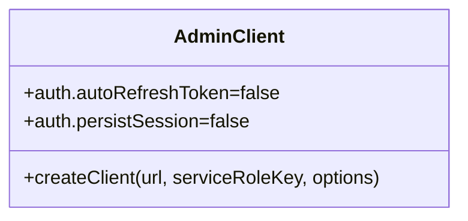

**Diagram sources**
- [src/lib/supabaseAdmin.ts](file://src/lib/supabaseAdmin.ts#L1-L15)

**Section sources**
- [src/lib/supabaseAdmin.ts](file://src/lib/supabaseAdmin.ts#L1-L15)

### Environment Validation
- Purpose:
  - Validate and parse environment variables at runtime using Zod.
- Supabase variables validated:
  - NEXT_PUBLIC_SUPABASE_URL
  - NEXT_PUBLIC_SUPABASE_ANON_KEY
- Additional validations:
  - Other environment variables for maps, Sentry, and app URL.

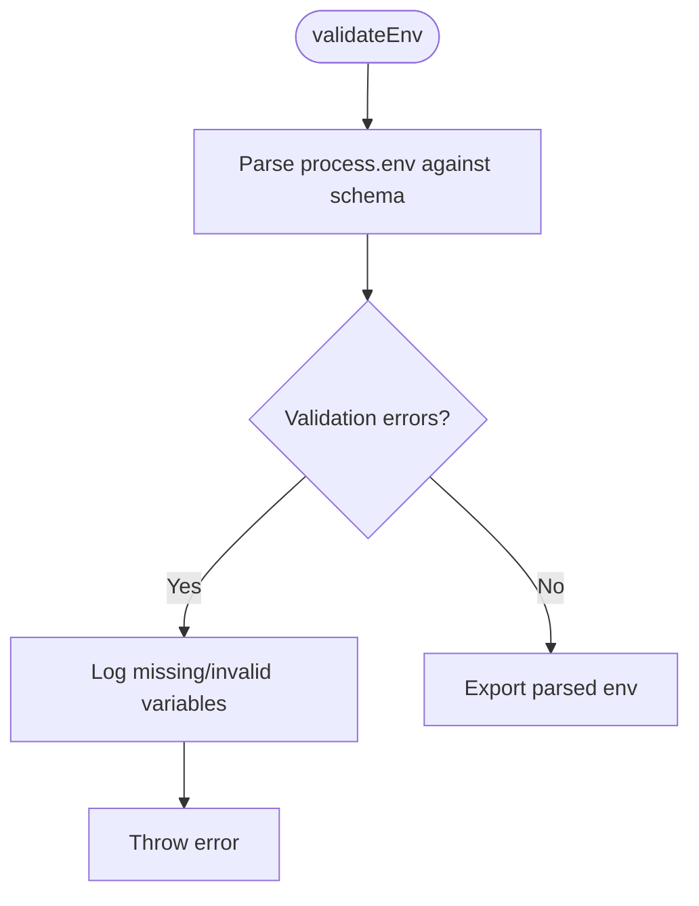

**Diagram sources**
- [src/lib/env.ts](file://src/lib/env.ts#L1-L51)

**Section sources**
- [src/lib/env.ts](file://src/lib/env.ts#L1-L51)

### Authentication Configuration and Profile Management
- NextAuth integration:
  - Uses Supabase Adapter with separate clients for next_auth and public schemas.
  - Providers include Naver, Kakao, and Credentials (admin).
- Profile management:
  - On sign-in, upserts profile data into the public schema.
  - Sets admin flag for configured emails.
- Session handling:
  - Strategy uses database sessions.
  - Trusts host configuration for production deployments.

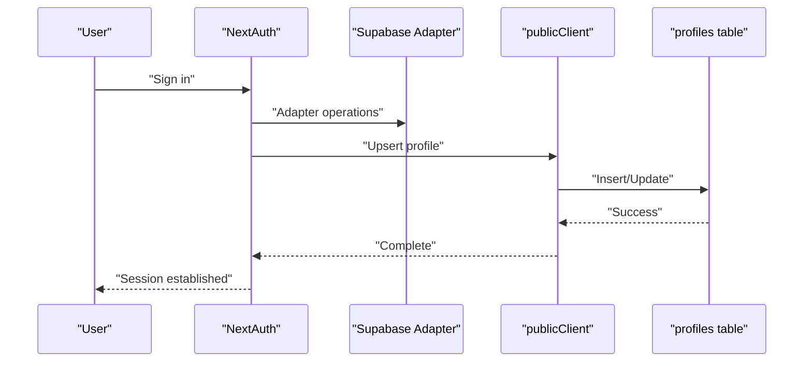

**Diagram sources**
- [src/auth-config.ts](file://src/auth-config.ts#L1-L227)

**Section sources**
- [src/auth-config.ts](file://src/auth-config.ts#L1-L227)

### Practical Examples of Database Operations
- Client-side profile retrieval:
  - Uses the browser client to select a profile by user ID.
  - Handles specific PostgREST error codes to avoid crashes.
- Invitation CRUD:
  - Saves, lists, retrieves, and deletes invitations using the browser client.
  - Admin invitation listing uses a dedicated API route.
- Profile updates:
  - Updates profile via a PATCH request to the backend API.

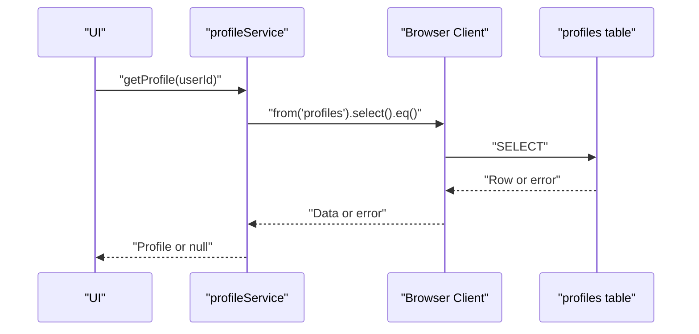

**Diagram sources**
- [src/services/profileService.ts](file://src/services/profileService.ts#L1-L101)
- [src/lib/supabase/client.ts](file://src/lib/supabase/client.ts#L1-L85)

**Section sources**
- [src/services/profileService.ts](file://src/services/profileService.ts#L1-L101)
- [src/services/invitationService.ts](file://src/services/invitationService.ts#L1-L81)

### Relationship Between Client Configuration and Security Model
- RLS policies:
  - Invitations: authenticated users can manage their own invitations; public read allowed.
  - Profiles: authenticated users can view/update their own; admins can view all.
  - Approval requests: users can view/create their own; admins can view/update all.
- Client roles:
  - Browser client: anonymous key + short-lived JWT for authenticated access.
  - Server client: signed JWT for authenticated server-to-database access.
  - Admin client: service role key for privileged operations.
- Middleware enforcement:
  - Protects builder routes and redirects unauthenticated users.

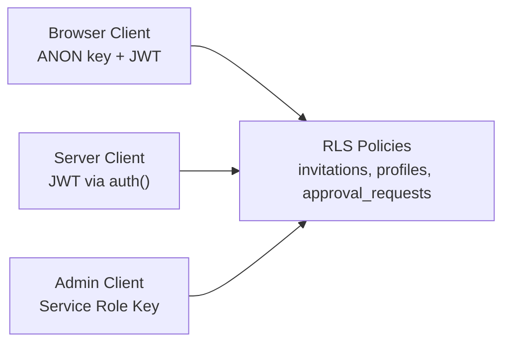

**Diagram sources**
- [supabase/migrations/20260109000000_initial_schema.sql](file://supabase/migrations/20260109000000_initial_schema.sql#L1-L52)
- [supabase/migrations/20260114063537_add_profiles_and_approval_requests.sql](file://supabase/migrations/20260114063537_add_profiles_and_approval_requests.sql#L1-L234)
- [src/lib/supabase/client.ts](file://src/lib/supabase/client.ts#L1-L85)
- [src/lib/supabase/server.ts](file://src/lib/supabase/server.ts#L1-L19)
- [src/lib/supabaseAdmin.ts](file://src/lib/supabaseAdmin.ts#L1-L15)

**Section sources**
- [supabase/migrations/20260109000000_initial_schema.sql](file://supabase/migrations/20260109000000_initial_schema.sql#L1-L52)
- [supabase/migrations/20260114063537_add_profiles_and_approval_requests.sql](file://supabase/migrations/20260114063537_add_profiles_and_approval_requests.sql#L1-L234)
- [src/lib/supabase/client.ts](file://src/lib/supabase/client.ts#L1-L85)
- [src/lib/supabase/server.ts](file://src/lib/supabase/server.ts#L1-L19)
- [src/lib/supabaseAdmin.ts](file://src/lib/supabaseAdmin.ts#L1-L15)

## Dependency Analysis
- Client initialization depends on:
  - Environment variables for URLs and keys.
  - Token endpoint for JWT issuance.
  - JWT generator for signed tokens.
- Services depend on:
  - Browser client factory for database operations.
  - API routes for admin operations.
- Authentication depends on:
  - NextAuth configuration and adapter.
  - Supabase clients for provider and profile management.
- Middleware depends on:
  - NextAuth edge handler for route protection.

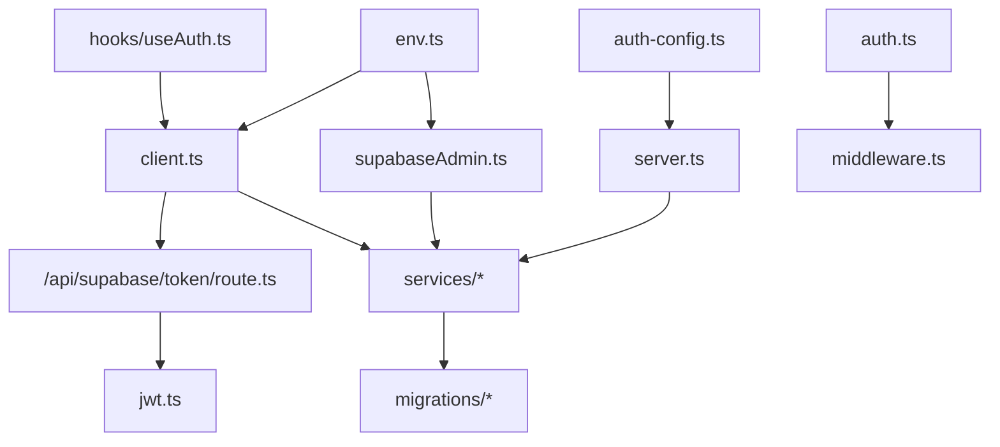

**Diagram sources**
- [src/lib/env.ts](file://src/lib/env.ts#L1-L51)
- [src/lib/supabaseAdmin.ts](file://src/lib/supabaseAdmin.ts#L1-L15)
- [src/lib/supabase/client.ts](file://src/lib/supabase/client.ts#L1-L85)
- [src/lib/supabase/server.ts](file://src/lib/supabase/server.ts#L1-L19)
- [src/lib/supabase/jwt.ts](file://src/lib/supabase/jwt.ts#L1-L15)
- [src/app/api/supabase/token/route.ts](file://src/app/api/supabase/token/route.ts#L1-L16)
- [src/auth-config.ts](file://src/auth-config.ts#L1-L227)
- [src/auth.ts](file://src/auth.ts#L1-L5)
- [src/hooks/useAuth.ts](file://src/hooks/useAuth.ts#L1-L55)
- [src/services/profileService.ts](file://src/services/profileService.ts#L1-L101)
- [src/services/invitationService.ts](file://src/services/invitationService.ts#L1-L81)
- [middleware.ts](file://middleware.ts#L1-L22)
- [supabase/migrations/20260109000000_initial_schema.sql](file://supabase/migrations/20260109000000_initial_schema.sql#L1-L52)
- [supabase/migrations/20260114063537_add_profiles_and_approval_requests.sql](file://supabase/migrations/20260114063537_add_profiles_and_approval_requests.sql#L1-L234)

**Section sources**
- [src/lib/env.ts](file://src/lib/env.ts#L1-L51)
- [src/lib/supabaseAdmin.ts](file://src/lib/supabaseAdmin.ts#L1-L15)
- [src/lib/supabase/client.ts](file://src/lib/supabase/client.ts#L1-L85)
- [src/lib/supabase/server.ts](file://src/lib/supabase/server.ts#L1-L19)
- [src/lib/supabase/jwt.ts](file://src/lib/supabase/jwt.ts#L1-L15)
- [src/app/api/supabase/token/route.ts](file://src/app/api/supabase/token/route.ts#L1-L16)
- [src/auth-config.ts](file://src/auth-config.ts#L1-L227)
- [src/auth.ts](file://src/auth.ts#L1-L5)
- [src/hooks/useAuth.ts](file://src/hooks/useAuth.ts#L1-L55)
- [src/services/profileService.ts](file://src/services/profileService.ts#L1-L101)
- [src/services/invitationService.ts](file://src/services/invitationService.ts#L1-L81)
- [middleware.ts](file://middleware.ts#L1-L22)
- [supabase/migrations/20260109000000_initial_schema.sql](file://supabase/migrations/20260109000000_initial_schema.sql#L1-L52)
- [supabase/migrations/20260114063537_add_profiles_and_approval_requests.sql](file://supabase/migrations/20260114063537_add_profiles_and_approval_requests.sql#L1-L234)

## Performance Considerations
- Client caching:
  - Browser client caches the Supabase instance keyed by token to avoid repeated initialization.
- Token caching:
  - Uses decoded expiry to defer unnecessary token refreshes.
  - Anonymous fallback sets a conservative expiry to prevent spamming.
- Debounced token requests:
  - A pending tokenRequest avoids concurrent token fetches.
- Minimal client options:
  - Disables autoRefreshToken and persistSession to reduce overhead on the client.
- Service-level batching:
  - Prefer single queries with appropriate indexes (e.g., slug index) to minimize round trips.
- Middleware redirection:
  - Redirects unauthenticated users away from protected routes to avoid wasted client work.

[No sources needed since this section provides general guidance]

## Troubleshooting Guide
- Missing or invalid environment variables:
  - The environment validator logs missing variables and throws an error if validation fails.
- Unauthorized token requests:
  - The token endpoint returns 401 when there is no session; the browser client treats this as a missing token and retries later.
- Database errors:
  - Services handle specific PostgREST error codes (e.g., record not found) and log unexpected errors without crashing.
- Admin client availability:
  - The admin client is null when the service role key is not present; guard server-side code accordingly.
- Middleware redirect loops:
  - Ensure login and builder routes are correctly matched and that the redirect logic does not cause infinite loops.

**Section sources**
- [src/lib/env.ts](file://src/lib/env.ts#L1-L51)
- [src/app/api/supabase/token/route.ts](file://src/app/api/supabase/token/route.ts#L1-L16)
- [src/lib/supabase/client.ts](file://src/lib/supabase/client.ts#L1-L85)
- [src/services/profileService.ts](file://src/services/profileService.ts#L1-L101)
- [src/lib/supabaseAdmin.ts](file://src/lib/supabaseAdmin.ts#L1-L15)
- [middleware.ts](file://middleware.ts#L1-L22)

## Conclusion
The application employs a layered Supabase client strategy:
- Browser client for authenticated client-side operations with short-lived JWTs.
- Server client builder for server-side authenticated requests.
- Admin client for privileged server-side tasks.
Security is enforced through RLS policies and NextAuth integration, while environment validation and middleware protect routes. Services encapsulate database operations with robust error handling and performance-conscious caching.

[No sources needed since this section summarizes without analyzing specific files]

## Appendices

### Configuration Options and Environment Variables
- Required environment variables:
  - NEXT_PUBLIC_SUPABASE_URL
  - NEXT_PUBLIC_SUPABASE_ANON_KEY
  - SUPABASE_SERVICE_ROLE_KEY (for admin client)
  - SUPABASE_JWT_SECRET (for JWT signing)
  - ADMIN_EMAILS (comma-separated admin emails)
  - ADMIN_PASSWORD (for admin credentials provider)
  - Provider credentials (NAVER_CLIENT_ID/SECRET, KAKAO_CLIENT_ID/SECRET)
- Optional environment variables:
  - NEXT_PUBLIC_KAKAO_MAP_KEY
  - NEXT_PUBLIC_NAVER_MAP_CLIENT_ID
  - NEXT_PUBLIC_APP_URL
  - NEXT_PUBLIC_SENTRY_* and SENTRY_* for monitoring

**Section sources**
- [src/lib/env.ts](file://src/lib/env.ts#L1-L51)
- [src/lib/supabaseAdmin.ts](file://src/lib/supabaseAdmin.ts#L1-L15)
- [src/lib/supabase/jwt.ts](file://src/lib/supabase/jwt.ts#L1-L15)
- [src/auth-config.ts](file://src/auth-config.ts#L1-L227)

### Best Practices for Database Connectivity
- Use the browser client for authenticated UI interactions; avoid embedding secrets in the client bundle.
- Use the server client builder for server-side authenticated operations to keep secrets server-side.
- Use the admin client only for privileged server-side tasks; never expose it to the client.
- Keep token lifetimes short and rely on the token endpoint to refresh as needed.
- Leverage RLS policies to enforce row-level access control.
- Validate environment variables at startup and fail fast on misconfiguration.
- Cache clients and tokens judiciously to reduce initialization overhead.

[No sources needed since this section provides general guidance]