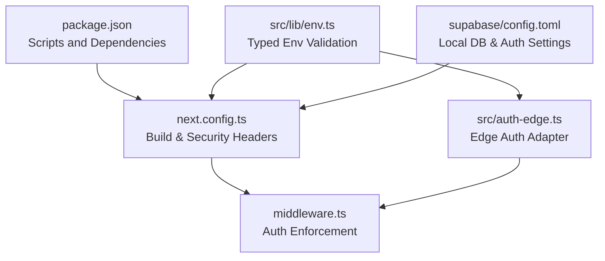
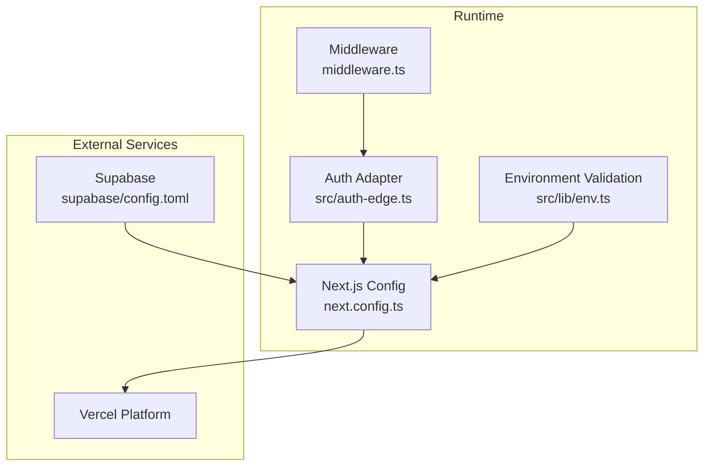
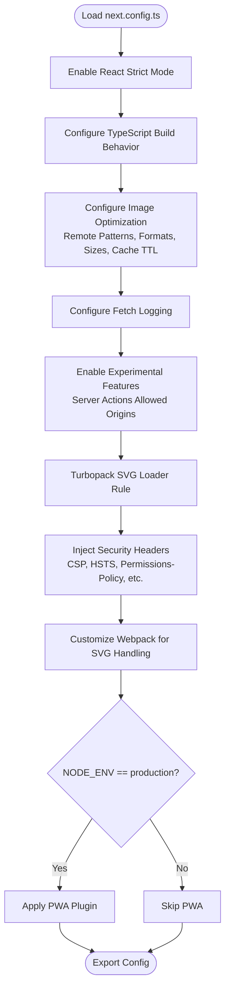
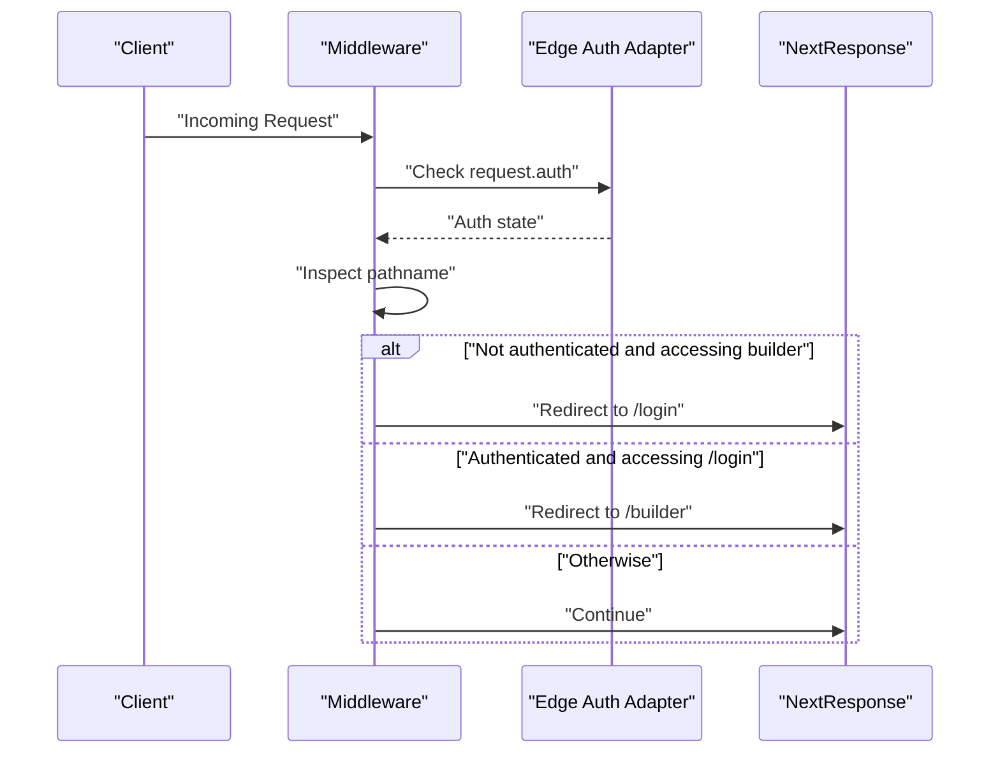
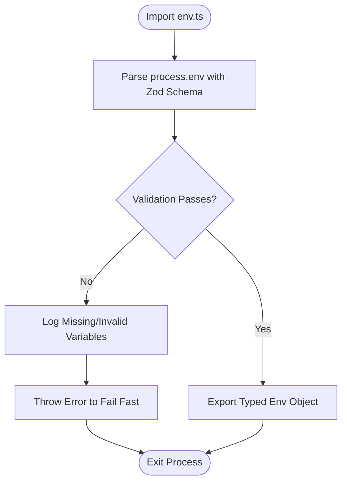
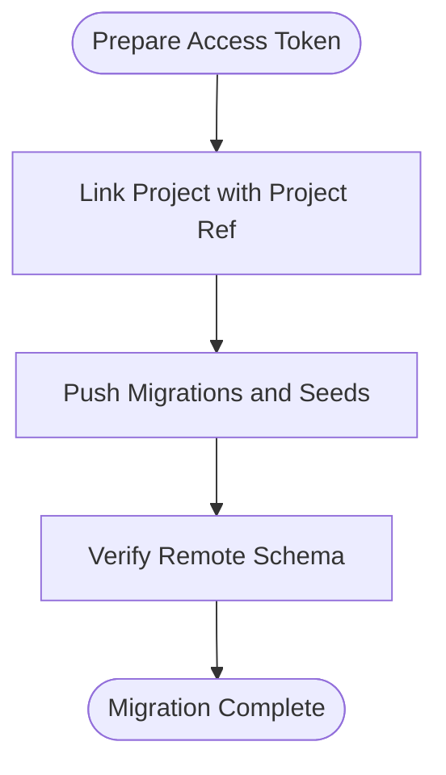
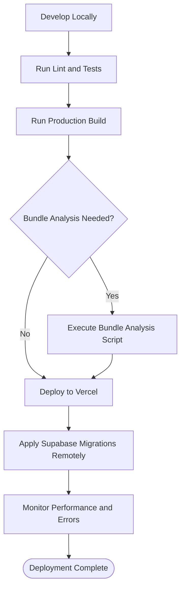
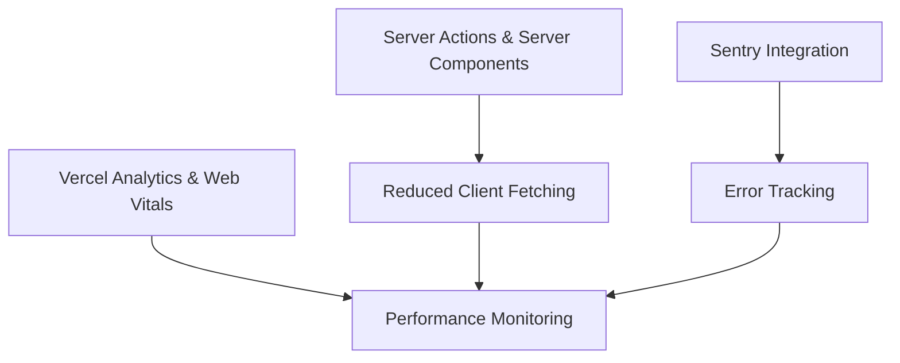
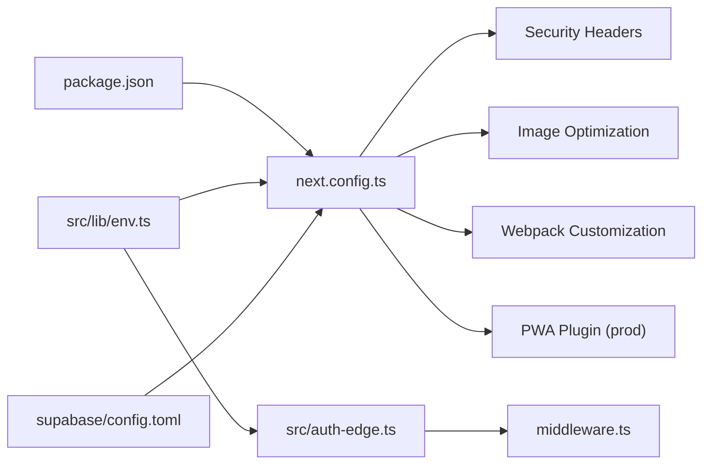

# Deployment and DevOps

<cite>
**Referenced Files in This Document**
- [package.json](file://package.json)
- [next.config.ts](file://next.config.ts)
- [middleware.ts](file://middleware.ts)
- [src/lib/env.ts](file://src/lib/env.ts)
- [src/auth-edge.ts](file://src/auth-edge.ts)
- [src/auth.ts](file://src/auth.ts)
- [ARCHITECTURE.md](file://ARCHITECTURE.md)
- [README.md](file://README.md)
- [supabase/config.toml](file://supabase/config.toml)
</cite>

## Table of Contents
1. [Introduction](#introduction)
2. [Project Structure](#project-structure)
3. [Core Components](#core-components)
4. [Architecture Overview](#architecture-overview)
5. [Detailed Component Analysis](#detailed-component-analysis)
6. [Dependency Analysis](#dependency-analysis)
7. [Performance Considerations](#performance-considerations)
8. [Troubleshooting Guide](#troubleshooting-guide)
9. [Conclusion](#conclusion)
10. [Appendices](#appendices)

## Introduction
This document provides a comprehensive guide to deployment and DevOps for the project, focusing on Next.js build configuration, production deployment strategies, middleware-based request processing and security enforcement, environment variable management, and operational monitoring. It synthesizes configuration files and architectural guidance to help teams build, validate, deploy, and operate the application reliably across environments.

## Project Structure
The repository follows a Next.js App Router structure with a dedicated configuration for build-time optimizations, middleware for request processing, and environment validation. Key areas include:
- Build and runtime configuration via Next.js configuration
- Middleware enforcing authentication and routing rules
- Environment variable validation and typed access
- Supabase configuration for local development and remote migration
- Architectural patterns emphasizing server components, server actions, and performance-first strategies

**Diagram sources**
- [package.json](file://package.json#L1-L107)
- [next.config.ts](file://next.config.ts#L1-L110)
- [middleware.ts](file://middleware.ts#L1-L22)
- [src/lib/env.ts](file://src/lib/env.ts#L1-L51)
- [src/auth-edge.ts](file://src/auth-edge.ts#L1-L5)
- [supabase/config.toml](file://supabase/config.toml#L1-L385)

**Section sources**
- [package.json](file://package.json#L1-L107)
- [next.config.ts](file://next.config.ts#L1-L110)
- [middleware.ts](file://middleware.ts#L1-L22)
- [src/lib/env.ts](file://src/lib/env.ts#L1-L51)
- [src/auth-edge.ts](file://src/auth-edge.ts#L1-L5)
- [supabase/config.toml](file://supabase/config.toml#L1-L385)

## Core Components
- Build configuration and security headers: Next.js configuration defines strict mode, image optimization, CSP, HSTS, permissions policy, and PWA integration for production.
- Middleware-based authentication: Enforces access control for builder pages and login redirection logic.
- Environment validation: Zod-based schema validates environment variables at startup and logs missing/invalid keys.
- Supabase configuration: Local development settings and remote migration guidance for database schema and seeds.

**Section sources**
- [next.config.ts](file://next.config.ts#L1-L110)
- [middleware.ts](file://middleware.ts#L1-L22)
- [src/lib/env.ts](file://src/lib/env.ts#L1-L51)
- [supabase/config.toml](file://supabase/config.toml#L1-L385)

## Architecture Overview
The deployment architecture integrates Next.js build-time optimizations, middleware-driven request processing, and environment-aware runtime behavior. The following diagram maps the primary components and their interactions during a typical production deployment.

**Diagram sources**
- [middleware.ts](file://middleware.ts#L1-L22)
- [src/auth-edge.ts](file://src/auth-edge.ts#L1-L5)
- [next.config.ts](file://next.config.ts#L1-L110)
- [src/lib/env.ts](file://src/lib/env.ts#L1-L51)
- [supabase/config.toml](file://supabase/config.toml#L1-L385)

## Detailed Component Analysis

### Next.js Build Configuration and Optimizations
Key aspects of the build configuration include:
- React Strict Mode enabled for stricter checks
- TypeScript build validation controlled via configuration
- Image optimization settings for remote patterns, formats, sizes, and caching
- Logging configuration for fetches
- Experimental server actions with allowed origins
- Turbopack SVG loader rule for efficient asset handling
- Security headers via dynamic headers (CSP, X-Frame-Options, X-Content-Type-Options, Referrer-Policy, DNS prefetch, HSTS, Permissions-Policy)
- Webpack customization for SVG handling
- Conditional PWA registration for production builds

**Diagram sources**
- [next.config.ts](file://next.config.ts#L1-L110)

**Section sources**
- [next.config.ts](file://next.config.ts#L1-L110)

### Middleware Implementation for Request Processing and Security
The middleware enforces:
- Authentication checks using the edge-compatible auth adapter
- Redirects for unauthenticated users attempting to access builder routes
- Redirects for authenticated users visiting the login page
- Matcher configuration targeting builder and login paths

**Diagram sources**
- [middleware.ts](file://middleware.ts#L1-L22)
- [src/auth-edge.ts](file://src/auth-edge.ts#L1-L5)

**Section sources**
- [middleware.ts](file://middleware.ts#L1-L22)
- [src/auth-edge.ts](file://src/auth-edge.ts#L1-L5)

### Environment Variable Management and Secrets Handling
Environment validation uses a Zod schema to enforce required variables and optional ones for analytics and maps. The validator:
- Parses process environment variables
- Logs missing or invalid variables
- Throws on validation failure to fail fast at startup
- Provides a strongly-typed env object for the rest of the app

**Diagram sources**
- [src/lib/env.ts](file://src/lib/env.ts#L1-L51)

**Section sources**
- [src/lib/env.ts](file://src/lib/env.ts#L1-L51)

### Supabase Configuration and Remote Migration
Supabase configuration controls local development services, authentication, and storage. The repository also documents remote migration steps for applying schema and seeds to a remote Supabase project without Docker.

**Diagram sources**
- [supabase/config.toml](file://supabase/config.toml#L1-L385)
- [README.md](file://README.md#L193-L218)

**Section sources**
- [supabase/config.toml](file://supabase/config.toml#L1-L385)
- [README.md](file://README.md#L193-L218)

### Deployment Pipeline and CI/CD Integration
Recommended deployment pipeline:
- Build and start commands for production
- Optional bundle analysis for optimization insights
- Vercel deployment via project import and environment variable configuration
- Local Supabase migration for database schema and seeds

**Diagram sources**
- [package.json](file://package.json#L5-L16)
- [README.md](file://README.md#L338-L358)
- [README.md](file://README.md#L193-L218)

**Section sources**
- [package.json](file://package.json#L5-L16)
- [README.md](file://README.md#L338-L358)
- [README.md](file://README.md#L193-L218)

### Monitoring Strategies, Error Tracking, and Performance Optimization
Monitoring and optimization practices:
- Use Vercel Analytics and Web Vitals for runtime telemetry
- Integrate Sentry for error tracking and performance monitoring
- Apply Core Web Vitals-based optimizations and server-centric rendering patterns
- Employ server actions and server components to minimize client-side fetching and improve caching strategies

**Section sources**
- [.cursorrules](file://.cursorrules#L158-L193)
- [ARCHITECTURE.md](file://ARCHITECTURE.md#L251-L318)

## Dependency Analysis
The following diagram highlights key dependencies among configuration and runtime components.

**Diagram sources**
- [package.json](file://package.json#L1-L107)
- [next.config.ts](file://next.config.ts#L1-L110)
- [src/lib/env.ts](file://src/lib/env.ts#L1-L51)
- [src/auth-edge.ts](file://src/auth-edge.ts#L1-L5)
- [middleware.ts](file://middleware.ts#L1-L22)
- [supabase/config.toml](file://supabase/config.toml#L1-L385)

**Section sources**
- [package.json](file://package.json#L1-L107)
- [next.config.ts](file://next.config.ts#L1-L110)
- [src/lib/env.ts](file://src/lib/env.ts#L1-L51)
- [src/auth-edge.ts](file://src/auth-edge.ts#L1-L5)
- [middleware.ts](file://middleware.ts#L1-L22)
- [supabase/config.toml](file://supabase/config.toml#L1-L385)

## Performance Considerations
- Prefer server components and server actions to reduce client-side work and improve caching.
- Use ISR/SSR strategies to balance freshness and performance.
- Optimize images with Next.js Image and appropriate formats (WebP/AVIF).
- Minimize client bundles and leverage dynamic imports for heavy components.
- Monitor Core Web Vitals and adjust rendering and asset strategies accordingly.

[No sources needed since this section provides general guidance]

## Troubleshooting Guide
Common deployment and runtime issues:
- Missing or invalid environment variables: The environment validator logs missing/invalid keys and throws to fail fast. Ensure all required variables are present and correctly typed.
- Middleware redirect loops: Verify matcher configuration and auth state to avoid unintended redirects between builder and login routes.
- Supabase migration failures: Confirm access token and project ref, then re-link and push migrations.
- Build failures: Run type checks and linting prior to building; use bundle analysis to identify oversized dependencies.

**Section sources**
- [src/lib/env.ts](file://src/lib/env.ts#L28-L48)
- [middleware.ts](file://middleware.ts#L19-L21)
- [README.md](file://README.md#L193-L218)

## Conclusion
By leveraging Next.js’s build configuration, middleware-based security enforcement, robust environment validation, and Supabase-backed data services, the project achieves a production-grade deployment posture. Combined with Vercel analytics, Sentry error tracking, and performance-focused patterns, teams can confidently iterate and scale the application while maintaining reliability and observability.

[No sources needed since this section summarizes without analyzing specific files]

## Appendices

### Practical Examples Index
- Build optimization and bundle analysis: See scripts and guidance in the package and README.
- Environment variable management: See typed validation in environment library.
- Supabase remote migration: See migration steps in README and local configuration in Supabase config.

**Section sources**
- [package.json](file://package.json#L5-L16)
- [README.md](file://README.md#L170-L218)
- [src/lib/env.ts](file://src/lib/env.ts#L1-L51)
- [supabase/config.toml](file://supabase/config.toml#L1-L385)