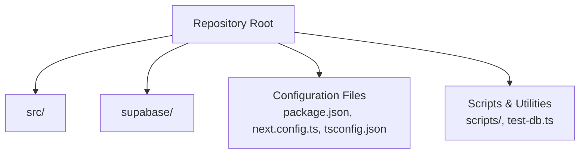
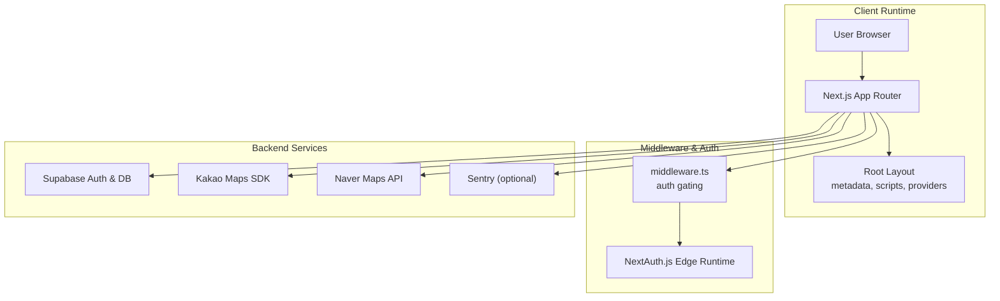
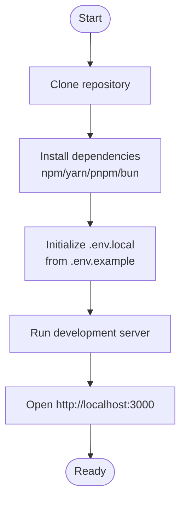
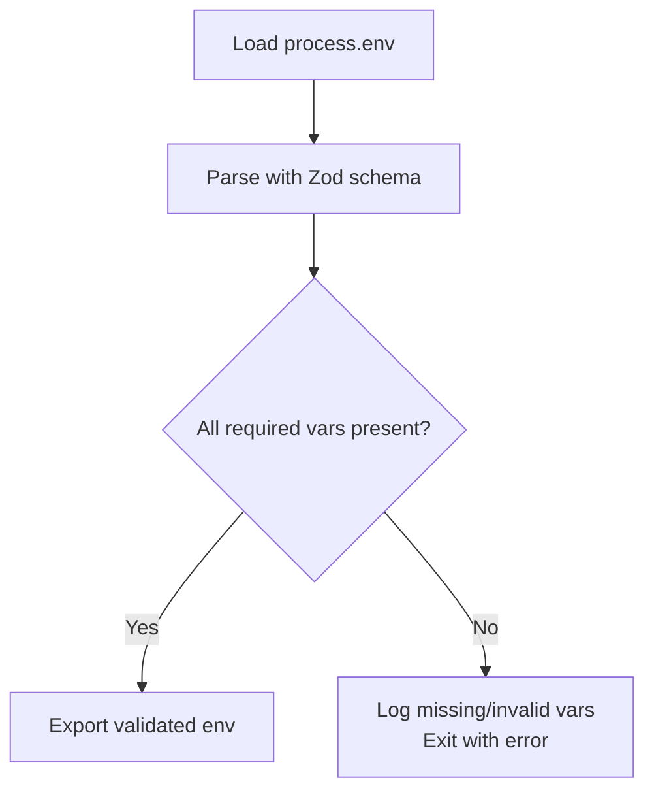
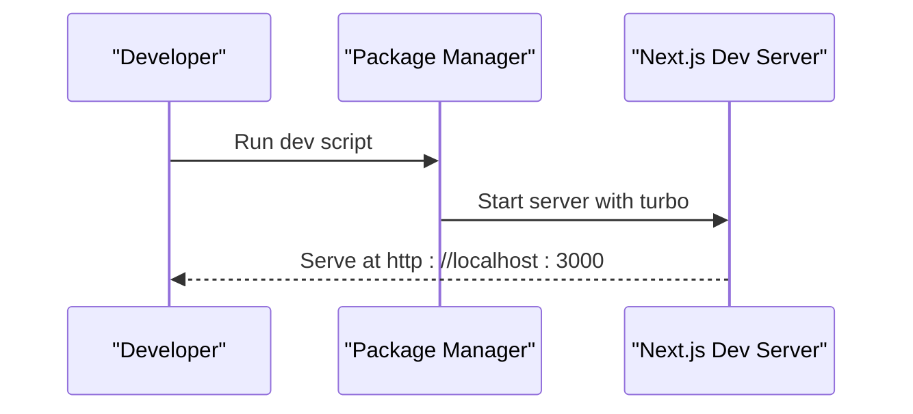
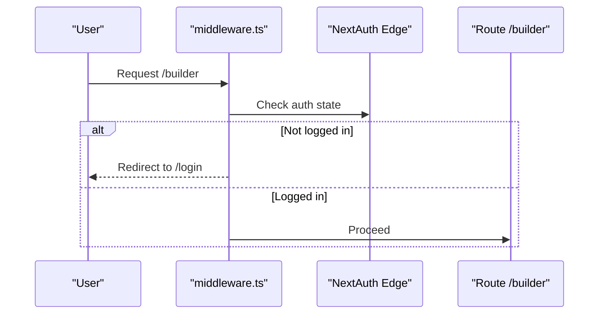
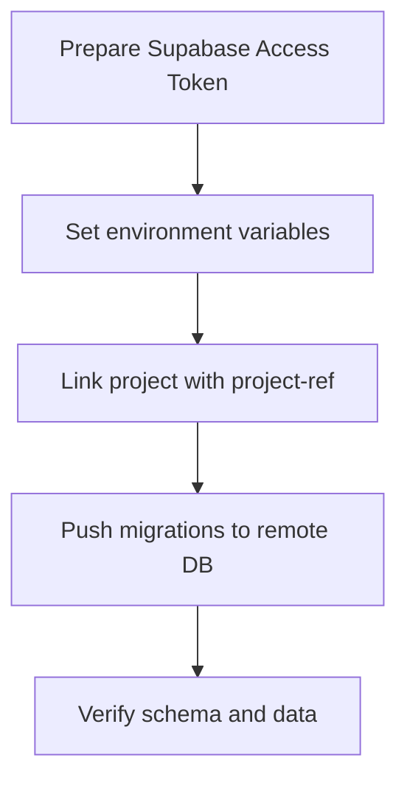
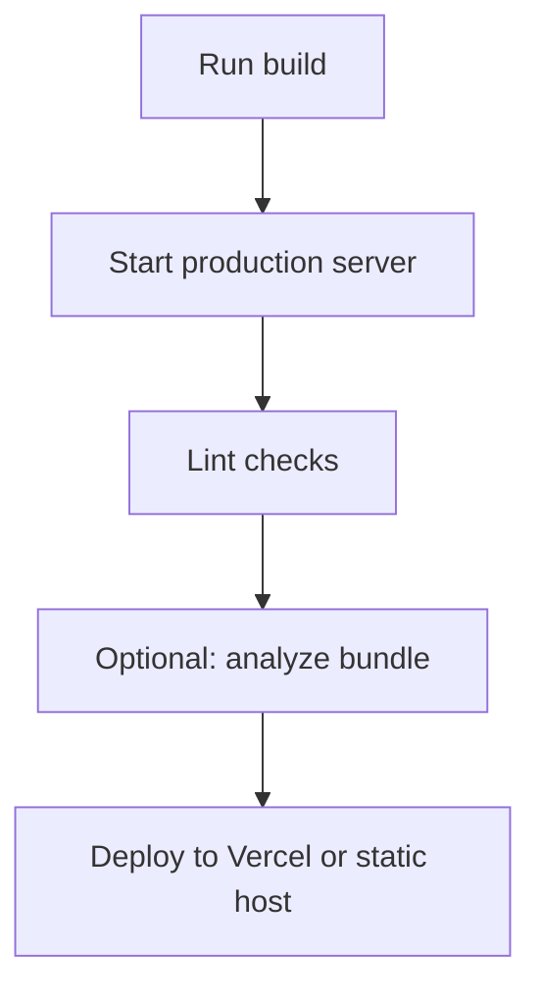
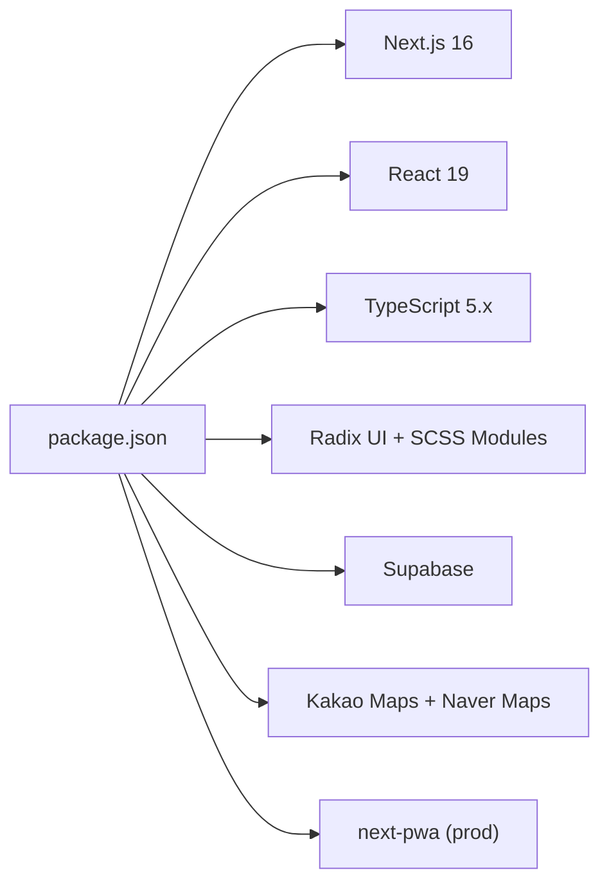

# Getting Started

<cite>
**Referenced Files in This Document**
- [README.md](file://README.md)
- [package.json](file://package.json)
- [next.config.ts](file://next.config.ts)
- [tsconfig.json](file://tsconfig.json)
- [src/lib/env.ts](file://src/lib/env.ts)
- [src/app/layout.tsx](file://src/app/layout.tsx)
- [middleware.ts](file://middleware.ts)
- [supabase/config.toml](file://supabase/config.toml)
- [src/lib/supabase/client.ts](file://src/lib/supabase/client.ts)
- [src/lib/supabase/server.ts](file://src/lib/supabase/server.ts)
- [src/lib/supabaseAdmin.ts](file://src/lib/supabaseAdmin.ts)
- [test-db.ts](file://test-db.ts)
</cite>

## Table of Contents
1. [Introduction](#introduction)
2. [Project Structure](#project-structure)
3. [Core Components](#core-components)
4. [Architecture Overview](#architecture-overview)
5. [Detailed Component Analysis](#detailed-component-analysis)
6. [Dependency Analysis](#dependency-analysis)
7. [Performance Considerations](#performance-considerations)
8. [Troubleshooting Guide](#troubleshooting-guide)
9. [Conclusion](#conclusion)
10. [Appendices](#appendices)

## Introduction
This guide helps you set up the Banana Wedding development environment from scratch. It covers prerequisites, installation, environment configuration, running the development server, and preparing for deployment. It also includes troubleshooting tips and verification steps to ensure everything works as expected.

## Project Structure
Banana Wedding is a Next.js 16 App Router application written in TypeScript with modern UI primitives and integrations for maps, authentication, and Supabase. The repository includes:
- Application code under src/
- Supabase configuration under supabase/
- Build and runtime configuration files (Next.js, TypeScript, ESLint)
- Scripts for local tasks and database operations

**Section sources**
- [README.md](file://README.md#L219-L249)

## Core Components
- Next.js 16 App Router with React 19 and TypeScript strict mode
- Supabase for authentication and database
- Radix UI primitives and SCSS Modules for UI
- Map integrations for Kakao Maps and Naver Maps
- Optional Sentry for error monitoring
- PWA support via next-pwa

**Section sources**
- [README.md](file://README.md#L80-L109)
- [package.json](file://package.json#L17-L75)
- [next.config.ts](file://next.config.ts#L1-L110)
- [tsconfig.json](file://tsconfig.json#L1-L102)

## Architecture Overview
The application uses a server-first architecture with server components, server actions, and middleware for routing and authentication. Supabase provides authentication and database access, while environment variables control feature flags and external service keys.

**Diagram sources**
- [src/app/layout.tsx](file://src/app/layout.tsx#L1-L156)
- [middleware.ts](file://middleware.ts#L1-L22)
- [src/lib/supabase/client.ts](file://src/lib/supabase/client.ts#L1-L39)
- [src/lib/supabase/server.ts](file://src/lib/supabase/server.ts#L1-L18)
- [src/lib/supabaseAdmin.ts](file://src/lib/supabaseAdmin.ts#L1-L14)

**Section sources**
- [src/app/layout.tsx](file://src/app/layout.tsx#L1-L156)
- [middleware.ts](file://middleware.ts#L1-L22)

## Detailed Component Analysis

### Prerequisites and Supported Tools
- Node.js: 18.17+ (LTS recommended)
- Package managers: npm, yarn, pnpm, bun
- Operating systems: Windows, macOS, Linux
- Optional: Bun for fastest installs (latest)

These requirements are enforced by the project’s scripts and tooling.

**Section sources**
- [README.md](file://README.md#L112-L119)
- [package.json](file://package.json#L5-L16)

### Installation Steps
1. Clone the repository
2. Install dependencies using your preferred package manager
3. Copy environment variables example to local file
4. Start the development server

**Section sources**
- [README.md](file://README.md#L120-L168)

### Environment Variable Configuration (.env.local)
The application validates environment variables at runtime. Required variables include:
- Supabase: NEXT_PUBLIC_SUPABASE_URL, NEXT_PUBLIC_SUPABASE_ANON_KEY
- Maps: NEXT_PUBLIC_KAKAO_MAP_KEY, NEXT_PUBLIC_NAVER_MAP_CLIENT_ID
- Application: NEXT_PUBLIC_APP_URL
- Optional: Sentry variables (NEXT_PUBLIC_SENTRY_DSN, SENTRY_DSN, SENTRY_ORG, SENTRY_PROJECT, SENTRY_AUTH_TOKEN)
- Optional: Supabase service role key for admin operations (SUPABASE_SERVICE_ROLE_KEY)

Validation logic enforces presence and types; missing or invalid variables will cause startup errors with a list of missing keys.

**Diagram sources**
- [src/lib/env.ts](file://src/lib/env.ts#L1-L51)

**Section sources**
- [src/lib/env.ts](file://src/lib/env.ts#L1-L51)
- [README.md](file://README.md#L145-L150)

### Running the Development Server
- Use the dev script from your chosen package manager
- The server starts on http://localhost:3000 by default

**Section sources**
- [README.md](file://README.md#L152-L168)
- [package.json](file://package.json#L5-L16)

### Authentication and Middleware
- Authentication is handled by NextAuth.js with edge runtime
- Middleware redirects unauthenticated users away from protected routes like /builder
- Login redirects to /builder when already logged in

**Diagram sources**
- [middleware.ts](file://middleware.ts#L1-L22)

**Section sources**
- [middleware.ts](file://middleware.ts#L1-L22)
- [src/app/layout.tsx](file://src/app/layout.tsx#L87-L99)

### Supabase Setup and Remote Migration
- The project supports remote migration to a Supabase project without local Docker
- Prepare Supabase Access Token and database password
- Link the project and push migrations
- Local Supabase CLI configuration is provided under supabase/

**Section sources**
- [README.md](file://README.md#L193-L218)
- [supabase/config.toml](file://supabase/config.toml#L1-L385)

### Testing Database Connectivity Locally
A helper script demonstrates connecting to Supabase using .env.local variables and querying a specific table. Use it to verify your Supabase configuration.

**Section sources**
- [test-db.ts](file://test-db.ts#L1-L29)

### Deployment Preparation
- Build the project for production
- Start the production server
- Run linter and optional bundle analysis
- Deploy to Vercel or a static hosting provider

**Section sources**
- [README.md](file://README.md#L170-L191)
- [README.md](file://README.md#L338-L357)

## Dependency Analysis
The project relies on Next.js 16, React 19, TypeScript, Radix UI, SCSS Modules, Supabase, and map SDKs. The configuration enforces strict TypeScript settings and includes PWA support in production.

**Diagram sources**
- [package.json](file://package.json#L17-L75)
- [next.config.ts](file://next.config.ts#L100-L107)
- [tsconfig.json](file://tsconfig.json#L1-L102)

**Section sources**
- [package.json](file://package.json#L17-L75)
- [next.config.ts](file://next.config.ts#L1-L110)
- [tsconfig.json](file://tsconfig.json#L1-L102)

## Performance Considerations
- Use Next.js 16 App Router with server components and server actions
- Leverage image optimization and responsive image sizes
- Minimize client-side JavaScript; rely on server rendering
- Use memoization and selective re-renders
- Analyze bundles and remove unused dependencies

[No sources needed since this section provides general guidance]

## Troubleshooting Guide
Common setup issues and resolutions:
- Missing environment variables
  - Symptom: Startup fails with a list of missing variables
  - Fix: Copy .env.example to .env.local and fill in required values
- Supabase connectivity errors
  - Symptom: Database queries fail or auth errors occur
  - Fix: Verify NEXT_PUBLIC_SUPABASE_URL, NEXT_PUBLIC_SUPABASE_ANON_KEY, and SUPABASE_SERVICE_ROLE_KEY; run test-db.ts to validate
- Map SDK initialization failures
  - Symptom: Maps not rendering or console errors
  - Fix: Ensure NEXT_PUBLIC_KAKAO_MAP_KEY and NEXT_PUBLIC_NAVER_MAP_CLIENT_ID are set
- Authentication loops
  - Symptom: Redirects between /login and /builder
  - Fix: Confirm middleware matcher and NextAuth configuration; ensure cookies/session work in development
- PWA not registering
  - Symptom: App does not install or update
  - Fix: Confirm production build and next-pwa configuration

Verification steps:
- Confirm development server runs at http://localhost:3000
- Check browser console for initialization errors
- Validate environment variables are loaded by inspecting runtime logs
- Test Supabase connectivity using the provided script

**Section sources**
- [src/lib/env.ts](file://src/lib/env.ts#L28-L48)
- [test-db.ts](file://test-db.ts#L1-L29)
- [README.md](file://README.md#L145-L150)
- [middleware.ts](file://middleware.ts#L1-L22)

## Conclusion
You now have the essentials to set up Banana Wedding locally, configure environment variables, run the development server, and prepare for deployment. Use the troubleshooting guide to resolve common issues and verify your setup at each stage.

## Appendices

### Quick Reference: Environment Variables
- Required
  - NEXT_PUBLIC_SUPABASE_URL
  - NEXT_PUBLIC_SUPABASE_ANON_KEY
- Optional
  - NEXT_PUBLIC_KAKAO_MAP_KEY
  - NEXT_PUBLIC_NAVER_MAP_CLIENT_ID
  - NEXT_PUBLIC_APP_URL
  - NEXT_PUBLIC_SENTRY_DSN, SENTRY_DSN, SENTRY_ORG, SENTRY_PROJECT, SENTRY_AUTH_TOKEN
  - SUPABASE_SERVICE_ROLE_KEY (for admin operations)

**Section sources**
- [src/lib/env.ts](file://src/lib/env.ts#L3-L24)