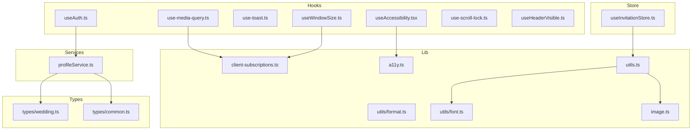
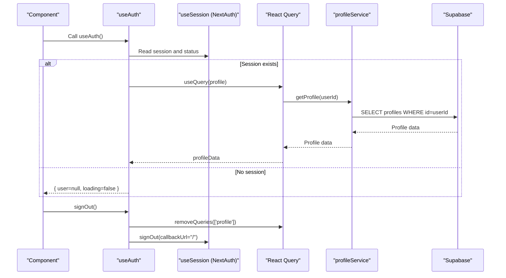
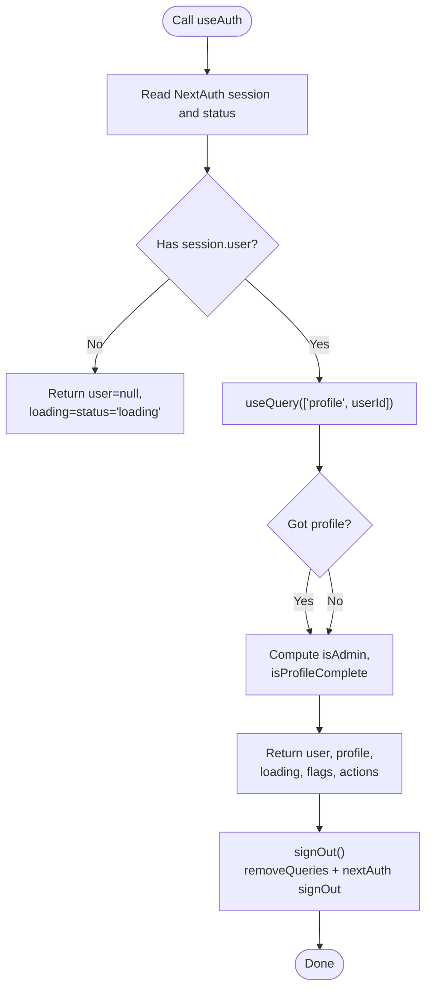
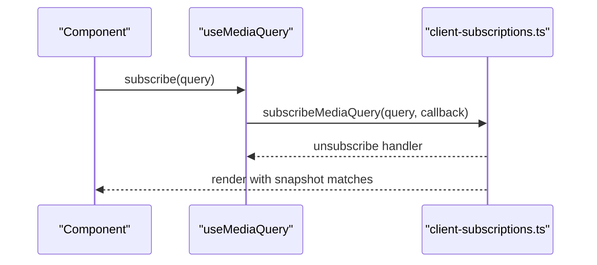
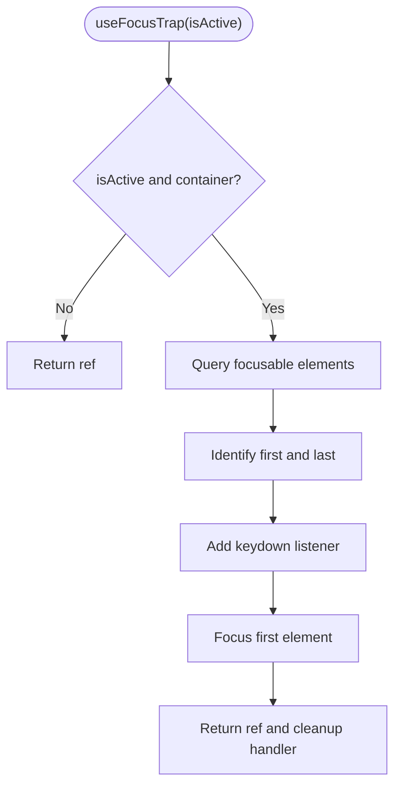
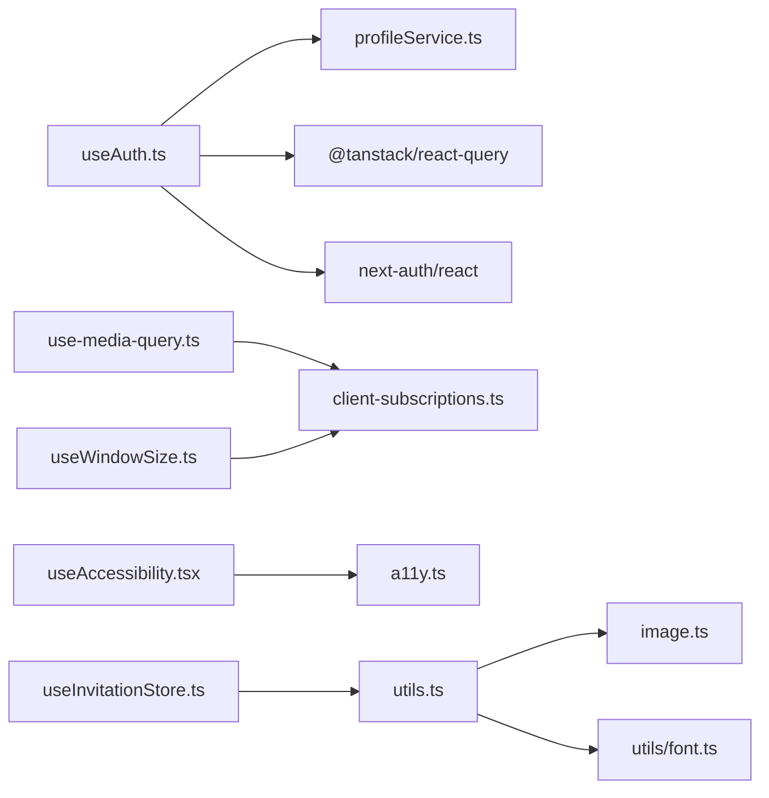

# Hooks and Utilities

<cite>
**Referenced Files in This Document**
- [useAuth.ts](file://src/hooks/useAuth.ts)
- [use-media-query.ts](file://src/hooks/use-media-query.ts)
- [use-toast.ts](file://src/hooks/use-toast.ts)
- [useWindowSize.ts](file://src/hooks/useWindowSize.ts)
- [useAccessibility.tsx](file://src/hooks/useAccessibility.tsx)
- [use-scroll-lock.ts](file://src/hooks/use-scroll-lock.ts)
- [useHeaderVisible.ts](file://src/hooks/useHeaderVisible.ts)
- [client-subscriptions.ts](file://src/lib/client-subscriptions.ts)
- [format.ts](file://src/lib/utils/format.ts)
- [utils.ts](file://src/lib/utils.ts)
- [image.ts](file://src/lib/image.ts)
- [font.ts](file://src/lib/utils/font.ts)
- [common.ts](file://src/types/common.ts)
- [wedding.ts](file://src/types/wedding.ts)
- [a11y.ts](file://src/lib/a11y.ts)
- [useInvitationStore.ts](file://src/store/useInvitationStore.ts)
- [profileService.ts](file://src/services/profileService.ts)
</cite>

## Table of Contents
1. [Introduction](#introduction)
2. [Project Structure](#project-structure)
3. [Core Components](#core-components)
4. [Architecture Overview](#architecture-overview)
5. [Detailed Component Analysis](#detailed-component-analysis)
6. [Dependency Analysis](#dependency-analysis)
7. [Performance Considerations](#performance-considerations)
8. [Troubleshooting Guide](#troubleshooting-guide)
9. [Conclusion](#conclusion)
10. [Appendices](#appendices)

## Introduction
This document explains the hooks and utilities system used across the application. It focuses on custom React hooks such as useAuth, useMediaQuery, useToast, useWindowSize, accessibility helpers, scroll locking, header visibility, and internal client subscriptions. It also documents utility functions for formatting, image processing, and data manipulation, along with TypeScript type definitions that enforce type safety. Practical usage patterns, performance optimization techniques, and guidelines for extending the system consistently are included.

## Project Structure
The hooks and utilities are organized by domain and responsibility:
- Hooks: located under src/hooks for reusable React logic
- Client subscriptions: centralized event subscriptions for SSR-safe external stores under src/lib/client-subscriptions.ts
- Utilities: under src/lib/utils for formatting, general utilities, image helpers, and font helpers
- Types: under src/types for shared type definitions and branded domain types
- Services: under src/services for data access (e.g., profileService)
- Store: under src/store for state management (e.g., useInvitationStore)

**Diagram sources**
- [useAuth.ts](file://src/hooks/useAuth.ts#L1-L55)
- [use-media-query.ts](file://src/hooks/use-media-query.ts#L1-L16)
- [use-toast.ts](file://src/hooks/use-toast.ts#L1-L34)
- [useWindowSize.ts](file://src/hooks/useWindowSize.ts#L1-L15)
- [useAccessibility.tsx](file://src/hooks/useAccessibility.tsx#L1-L77)
- [use-scroll-lock.ts](file://src/hooks/use-scroll-lock.ts#L1-L69)
- [useHeaderVisible.ts](file://src/hooks/useHeaderVisible.ts#L1-L61)
- [client-subscriptions.ts](file://src/lib/client-subscriptions.ts#L1-L94)
- [format.ts](file://src/lib/utils/format.ts#L1-L41)
- [utils.ts](file://src/lib/utils.ts#L1-L294)
- [image.ts](file://src/lib/image.ts#L1-L4)
- [font.ts](file://src/lib/utils/font.ts#L1-L57)
- [a11y.ts](file://src/lib/a11y.ts#L1-L20)
- [useInvitationStore.ts](file://src/store/useInvitationStore.ts#L1-L534)
- [profileService.ts](file://src/services/profileService.ts#L1-L101)
- [common.ts](file://src/types/common.ts#L1-L235)
- [wedding.ts](file://src/types/wedding.ts#L1-L389)

**Section sources**
- [useAuth.ts](file://src/hooks/useAuth.ts#L1-L55)
- [use-media-query.ts](file://src/hooks/use-media-query.ts#L1-L16)
- [use-toast.ts](file://src/hooks/use-toast.ts#L1-L34)
- [useWindowSize.ts](file://src/hooks/useWindowSize.ts#L1-L15)
- [useAccessibility.tsx](file://src/hooks/useAccessibility.tsx#L1-L77)
- [use-scroll-lock.ts](file://src/hooks/use-scroll-lock.ts#L1-L69)
- [useHeaderVisible.ts](file://src/hooks/useHeaderVisible.ts#L1-L61)
- [client-subscriptions.ts](file://src/lib/client-subscriptions.ts#L1-L94)
- [format.ts](file://src/lib/utils/format.ts#L1-L41)
- [utils.ts](file://src/lib/utils.ts#L1-L294)
- [image.ts](file://src/lib/image.ts#L1-L4)
- [font.ts](file://src/lib/utils/font.ts#L1-L57)
- [a11y.ts](file://src/lib/a11y.ts#L1-L20)
- [useInvitationStore.ts](file://src/store/useInvitationStore.ts#L1-L534)
- [profileService.ts](file://src/services/profileService.ts#L1-L101)
- [common.ts](file://src/types/common.ts#L1-L235)
- [wedding.ts](file://src/types/wedding.ts#L1-L389)

## Core Components
This section summarizes the primary hooks and utilities and their responsibilities.

- useAuth: Centralizes NextAuth session and profile data fetching with React Query, exposing loading states, admin flags, and profile completeness checks.
- useMediaQuery: SSR-safe media query subscription using useSyncExternalStore and a shared subscription registry.
- useToast: Thin wrapper around a toast library with typed props and variants.
- useWindowSize: SSR-safe window width retrieval via useSyncExternalStore and a shared subscription mechanism.
- useAccessibility: Accessibility primitives including skip links, focus trap, and screen-reader announcements.
- useScrollLock: Locks/unlocks page scrolling with optional container scoping and restoration of scroll position.
- useHeaderVisible: Controls header visibility during scroll with thresholds and animation frame batching.
- client-subscriptions: Shared subscription registry for window resize and media queries.
- Formatting utilities: Date/time formatting helpers for Korean locales and weekday names.
- General utilities: Text manipulation, validation, async retries, image compression/dimension extraction, device detection, and localStorage helpers.
- Image utilities: Blob URL detection and image processing helpers.
- Font utilities: Theme font mapping and dynamic style generation.
- Types: Common and domain-specific types, branded identifiers, and discriminated unions.

**Section sources**
- [useAuth.ts](file://src/hooks/useAuth.ts#L9-L54)
- [use-media-query.ts](file://src/hooks/use-media-query.ts#L4-L15)
- [use-toast.ts](file://src/hooks/use-toast.ts#L26-L31)
- [useWindowSize.ts](file://src/hooks/useWindowSize.ts#L8-L14)
- [useAccessibility.tsx](file://src/hooks/useAccessibility.tsx#L11-L76)
- [use-scroll-lock.ts](file://src/hooks/use-scroll-lock.ts#L8-L67)
- [useHeaderVisible.ts](file://src/hooks/useHeaderVisible.ts#L3-L59)
- [client-subscriptions.ts](file://src/lib/client-subscriptions.ts#L12-L93)
- [format.ts](file://src/lib/utils/format.ts#L5-L40)
- [utils.ts](file://src/lib/utils.ts#L5-L294)
- [image.ts](file://src/lib/image.ts#L1-L4)
- [font.ts](file://src/lib/utils/font.ts#L1-L57)
- [common.ts](file://src/types/common.ts#L1-L235)
- [wedding.ts](file://src/types/wedding.ts#L1-L389)

## Architecture Overview
The hooks and utilities integrate with React Query for data fetching, a toast library for notifications, and a shared subscription layer for SSR-safe external stores. Type definitions provide strong guarantees across the system.

**Diagram sources**
- [useAuth.ts](file://src/hooks/useAuth.ts#L9-L54)
- [profileService.ts](file://src/services/profileService.ts#L26-L52)

## Detailed Component Analysis

### useAuth Hook
Purpose:
- Manage NextAuth session state and hydrate profile data via React Query.
- Provide computed flags (admin, profile completeness) and actions (refresh, sign out).

Key behaviors:
- Uses React Query to cache and refetch profile data with a stale time.
- Clears cached profile queries on sign out.
- Computes derived flags from session and profile.

**Diagram sources**
- [useAuth.ts](file://src/hooks/useAuth.ts#L9-L54)
- [profileService.ts](file://src/services/profileService.ts#L26-L52)

**Section sources**
- [useAuth.ts](file://src/hooks/useAuth.ts#L9-L54)
- [profileService.ts](file://src/services/profileService.ts#L22-L101)

### useMediaQuery Hook
Purpose:
- Provide an SSR-safe way to track media query matches using useSyncExternalStore.
- Reuse a single subscription registry to avoid duplicate listeners.

Implementation highlights:
- Subscribes via a shared registry and reads snapshot values.
- Returns a boolean representing match state.

**Diagram sources**
- [use-media-query.ts](file://src/hooks/use-media-query.ts#L4-L15)
- [client-subscriptions.ts](file://src/lib/client-subscriptions.ts#L71-L88)

**Section sources**
- [use-media-query.ts](file://src/hooks/use-media-query.ts#L4-L15)
- [client-subscriptions.ts](file://src/lib/client-subscriptions.ts#L37-L88)

### useToast Hook
Purpose:
- Provide a typed toast interface with convenience variants and dismissal.

Usage pattern:
- Call useToast() to get toast and dismiss.
- Pass title, description, variant, and additional options to toast.

**Section sources**
- [use-toast.ts](file://src/hooks/use-toast.ts#L26-L31)

### useWindowSize Hook
Purpose:
- Provide SSR-safe window width via useSyncExternalStore and a shared subscription.

Behavior:
- Uses a snapshot getter and a subscription registry for efficient updates.

**Section sources**
- [useWindowSize.ts](file://src/hooks/useWindowSize.ts#L8-L14)
- [client-subscriptions.ts](file://src/lib/client-subscriptions.ts#L12-L35)

### Accessibility Hooks and Utilities
Components:
- SkipLink: Accessible anchor for keyboard navigation.
- useFocusTrap: Trap focus within a container and cycle focus on Tab.
- announceToScreenReader: Announce messages to assistive technologies.

Supporting utilities:
- FOCUSABLE_SELECTOR and focusFirstFocusable: Define focusable elements and focus the first one.

**Diagram sources**
- [useAccessibility.tsx](file://src/hooks/useAccessibility.tsx#L22-L62)
- [a11y.ts](file://src/lib/a11y.ts#L1-L20)

**Section sources**
- [useAccessibility.tsx](file://src/hooks/useAccessibility.tsx#L11-L76)
- [a11y.ts](file://src/lib/a11y.ts#L1-L20)

### useScrollLock Hook
Purpose:
- Lock page scrolling with optional container scoping and restore previous scroll position.

Highlights:
- Persists scroll position using a data attribute.
- Supports selecting a container sibling or the root element.
- Adds/removes overflow styles and restores scroll on unmount.

**Section sources**
- [use-scroll-lock.ts](file://src/hooks/use-scroll-lock.ts#L8-L67)

### useHeaderVisible Hook
Purpose:
- Control header visibility during scroll with thresholds and requestAnimationFrame batching.

Behavior:
- Ignores small scroll deltas below a threshold.
- Shows header at the top regardless of direction.
- Uses either window or a target element’s scrollTop.

**Section sources**
- [useHeaderVisible.ts](file://src/hooks/useHeaderVisible.ts#L3-L59)

### Utility Functions: Formatting
Functions:
- formatDate, formatShortDate: Format dates for display.
- formatTime: Convert 24-hour time to 12-hour with AM/PM.
- getWeekday, getWeekdayKr: Retrieve day names.

Complexity:
- O(1) per call; minimal allocations.

**Section sources**
- [format.ts](file://src/lib/utils/format.ts#L5-L40)

### Utility Functions: General
Categories and highlights:
- Text: truncateText, capitalizeFirst, kebabToCamel, camelToKebab.
- Validation: isValidEmail, isValidPhone, isValidUrl.
- Phone formatting: formatPhoneNumber (Korean patterns).
- Arrays: groupBy, sortBy.
- Objects: pick, omit, isEmpty.
- Async: sleep, retry with exponential backoff.
- Images: getImageDimensions, compressImage.
- Colors: hexToRgb, rgbToHex.
- Storage: getStorageItem, setStorageItem.
- URL: getQueryParam, setQueryParam.
- Devices: isMobile, isIOS, isAndroid.

Complexity:
- Sorting and grouping are O(n log n) and O(n) respectively.
- Image processing is asynchronous and depends on file size.

**Section sources**
- [utils.ts](file://src/lib/utils.ts#L5-L294)

### Utility Functions: Image
- isBlobUrl: Detect blob URLs.

**Section sources**
- [image.ts](file://src/lib/image.ts#L1-L4)

### Utility Functions: Fonts
- ThemeFont union and mapping to CSS variables.
- getFontVar and getFontStyle: Generate dynamic font styles and overrides.

**Section sources**
- [font.ts](file://src/lib/utils/font.ts#L1-L57)

### TypeScript Type Definitions
Common types:
- Prettify, Brand, LoadingState, ApiResponse, PaginatedResponse.
- FormField, FormState.
- BaseEvent, WeddingEvent.
- ImageFile, ImageUploadOptions.
- ValidationRule, ValidationSchema.
- BaseComponentProps, AsyncComponentProps.
- ThemeColors, ThemeTypography, Theme.
- SEOProps, AppError, AnalyticsEvent, PageViewEvent.
- FeatureFlags, Environment.
- Generic and array/object helpers.
- Discriminated unions.

Domain types:
- Branded IDs (WeddingId, GuestId, InvitationId, AccountId).
- Core structures: Wedding, Person, Ceremony, Reception, Venue, Address, ContactInfo, Menu, SeatingArrangement, Table.
- Guest, PersonalInfo, Invitation, RSVP, Relationship, PlusOne.
- Preferences: Theme, ColorPalette, FloralDesign, Lighting, Music, MusicSelection, Song.
- Style, Restrictions, Budget, GuestCount, Timing, VendorRestrictions, Customs, Traditions/Rituals.
- Enums and union types for relations, relationships, and selections.
- Utility types: WeddingSummary, InvitationPreview.
- Validation types: WeddingValidation, errors/warnings.

Benefits:
- Strong compile-time guarantees for props, state, and service payloads.
- Reduced runtime errors and improved IDE support.

**Section sources**
- [common.ts](file://src/types/common.ts#L1-L235)
- [wedding.ts](file://src/types/wedding.ts#L1-L389)

## Dependency Analysis
The hooks and utilities depend on:
- React Query for caching and refetching profile data.
- NextAuth for session management.
- A toast library for notifications.
- A shared subscription layer for SSR-safe external stores.
- Supabase client for profile data access.
- Zustand for local state persistence and composition.

**Diagram sources**
- [useAuth.ts](file://src/hooks/useAuth.ts#L3-L7)
- [use-media-query.ts](file://src/hooks/use-media-query.ts#L1-L2)
- [useWindowSize.ts](file://src/hooks/useWindowSize.ts#L1-L2)
- [client-subscriptions.ts](file://src/lib/client-subscriptions.ts#L1-L94)
- [useAccessibility.tsx](file://src/hooks/useAccessibility.tsx#L3-L4)
- [a11y.ts](file://src/lib/a11y.ts#L1-L2)
- [utils.ts](file://src/lib/utils.ts#L1-L7)
- [image.ts](file://src/lib/image.ts#L1-L4)
- [font.ts](file://src/lib/utils/font.ts#L1-L57)
- [useInvitationStore.ts](file://src/store/useInvitationStore.ts#L1-L2)

**Section sources**
- [useAuth.ts](file://src/hooks/useAuth.ts#L3-L7)
- [use-media-query.ts](file://src/hooks/use-media-query.ts#L1-L2)
- [useWindowSize.ts](file://src/hooks/useWindowSize.ts#L1-L2)
- [client-subscriptions.ts](file://src/lib/client-subscriptions.ts#L1-L94)
- [useAccessibility.tsx](file://src/hooks/useAccessibility.tsx#L3-L4)
- [a11y.ts](file://src/lib/a11y.ts#L1-L2)
- [utils.ts](file://src/lib/utils.ts#L1-L7)
- [image.ts](file://src/lib/image.ts#L1-L4)
- [font.ts](file://src/lib/utils/font.ts#L1-L57)
- [useInvitationStore.ts](file://src/store/useInvitationStore.ts#L1-L2)

## Performance Considerations
Patterns and techniques observed:
- Memoization and stable callbacks:
  - useAuth uses useCallback for refreshProfile to avoid unnecessary re-renders when dependencies are unchanged.
- Dependency management:
  - Hooks consistently pass stable arrays/objects to useEffect/useCallback dependencies to prevent leaks and extra work.
- Efficient rendering:
  - useHeaderVisible batches scroll updates with requestAnimationFrame and ignores minor scroll deltas.
- SSR-safe subscriptions:
  - useMediaQuery and useWindowSize rely on useSyncExternalStore with a shared subscription registry to minimize updates and avoid hydration mismatches.
- Caching and stale times:
  - useAuth sets a short stale time for profile queries to balance freshness and performance.
- Asynchronous retries:
  - utils.retry implements exponential backoff to reduce load on transient failures.
- Image processing:
  - Compression and dimension extraction are asynchronous and offload work to the browser; consider debouncing triggers and limiting concurrent operations.

Recommendations:
- Prefer useSyncExternalStore for external stores requiring SSR compatibility.
- Keep subscription registries centralized to avoid duplicate listeners.
- Use stable refs and callbacks for handlers that cross component boundaries.
- Debounce expensive listeners (e.g., resize) and throttle scroll handlers.

**Section sources**
- [useAuth.ts](file://src/hooks/useAuth.ts#L29-L32)
- [useHeaderVisible.ts](file://src/hooks/useHeaderVisible.ts#L48-L53)
- [client-subscriptions.ts](file://src/lib/client-subscriptions.ts#L12-L35)
- [utils.ts](file://src/lib/utils.ts#L155-L174)

## Troubleshooting Guide
Common issues and resolutions:
- useAuth profile not loading:
  - Ensure the session.userId is present and the queryKey includes the ID.
  - Verify the enabled condition and staleTime settings.
- useMediaQuery or useWindowSize not updating:
  - Confirm the subscription registry is initialized and listeners are attached.
  - Check SSR fallbacks and server snapshots.
- Accessibility focus trap not working:
  - Ensure isActive is true and the container has focusable elements.
  - Verify the keydown listener is attached and cleaned up.
- useScrollLock not restoring scroll:
  - Confirm the data attribute storing scrollY is present and window.scrollTo is called on cleanup.
- Toast not appearing:
  - Verify the toast function receives a non-empty title or description and that the variant is supported.

**Section sources**
- [useAuth.ts](file://src/hooks/useAuth.ts#L19-L27)
- [client-subscriptions.ts](file://src/lib/client-subscriptions.ts#L12-L35)
- [useAccessibility.tsx](file://src/hooks/useAccessibility.tsx#L22-L62)
- [use-scroll-lock.ts](file://src/hooks/use-scroll-lock.ts#L38-L66)
- [use-toast.ts](file://src/hooks/use-toast.ts#L13-L24)

## Conclusion
The hooks and utilities system emphasizes type safety, SSR compatibility, and performance. Custom hooks encapsulate cross-cutting concerns like authentication, accessibility, and responsive behavior, while utilities provide robust formatting, validation, and image processing capabilities. Centralized subscriptions and typed definitions help maintain consistency and reliability across the application.

## Appendices

### Practical Usage Examples (by reference)
- Authentication:
  - Consume useAuth in a page to guard routes and render profile-dependent UI.
  - Use signOut to clear cached queries and redirect to home.
  - Reference: [useAuth.ts](file://src/hooks/useAuth.ts#L9-L54), [profileService.ts](file://src/services/profileService.ts#L26-L52)
- Media queries:
  - Track breakpoint changes with useMediaQuery for responsive layouts.
  - Reference: [use-media-query.ts](file://src/hooks/use-media-query.ts#L4-L15), [client-subscriptions.ts](file://src/lib/client-subscriptions.ts#L71-L88)
- Toast notifications:
  - Display success or destructive messages via useToast.
  - Reference: [use-toast.ts](file://src/hooks/use-toast.ts#L26-L31)
- Window size:
  - React to width changes with useWindowSize for responsive components.
  - Reference: [useWindowSize.ts](file://src/hooks/useWindowSize.ts#L8-L14), [client-subscriptions.ts](file://src/lib/client-subscriptions.ts#L12-L35)
- Accessibility:
  - Add a SkipLink and useFocusTrap for modal/dialog content.
  - Reference: [useAccessibility.tsx](file://src/hooks/useAccessibility.tsx#L11-L76), [a11y.ts](file://src/lib/a11y.ts#L1-L20)
- Scroll lock:
  - Lock scrolling during modals with useScrollLock.
  - Reference: [use-scroll-lock.ts](file://src/hooks/use-scroll-lock.ts#L8-L67)
- Header visibility:
  - Hide/show header on scroll with thresholds.
  - Reference: [useHeaderVisible.ts](file://src/hooks/useHeaderVisible.ts#L3-L59)
- Formatting:
  - Format dates and times for display.
  - Reference: [format.ts](file://src/lib/utils/format.ts#L5-L40)
- General utilities:
  - Validate inputs, format phone numbers, compress images, detect devices.
  - Reference: [utils.ts](file://src/lib/utils.ts#L54-L294)
- Image utilities:
  - Detect blob URLs and process images.
  - Reference: [image.ts](file://src/lib/image.ts#L1-L4)
- Fonts:
  - Map theme fonts to CSS variables and compute styles.
  - Reference: [font.ts](file://src/lib/utils/font.ts#L1-L57)
- Types:
  - Use branded IDs and domain types for safer APIs.
  - Reference: [common.ts](file://src/types/common.ts#L1-L235), [wedding.ts](file://src/types/wedding.ts#L1-L389)
- State management:
  - Persist and compose invitation state with useInvitationStore.
  - Reference: [useInvitationStore.ts](file://src/store/useInvitationStore.ts#L1-L534)

### Guidelines for Creating New Hooks and Utilities
- Naming and placement:
  - Place hooks under src/hooks and utilities under src/lib/utils.
- SSR compatibility:
  - Use useSyncExternalStore for external stores and provide server snapshots.
- Dependencies:
  - Keep hooks free of side effects; centralize subscriptions in client-subscriptions.ts.
- Type safety:
  - Define explicit props and return types; leverage branded types and discriminated unions.
- Performance:
  - Use memoization and stable callbacks; debounce/throttle heavy listeners.
- Accessibility:
  - Follow WCAG practices: focus management, skip links, ARIA roles for announcements.
- Testing:
  - Provide unit tests for utility functions and integration tests for hooks.