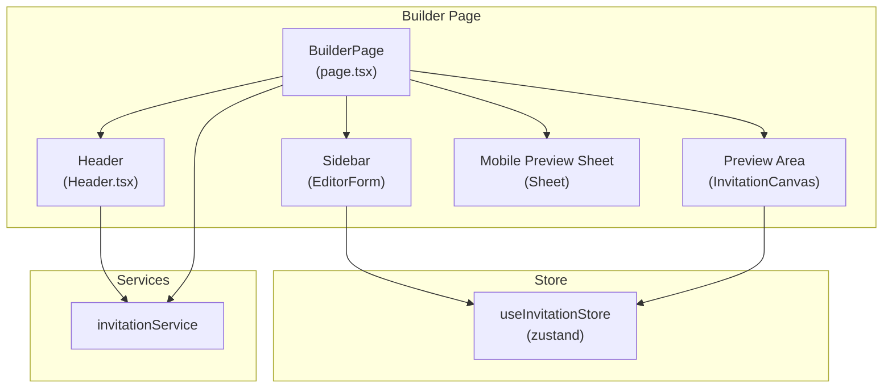
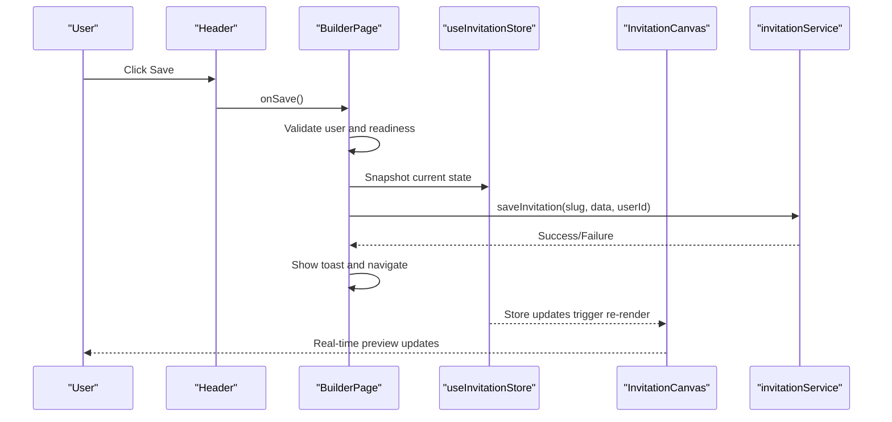
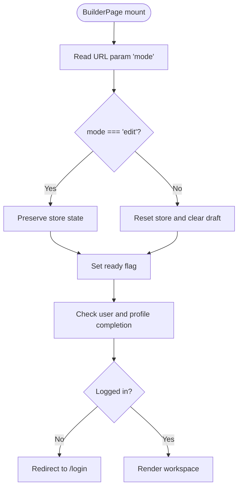
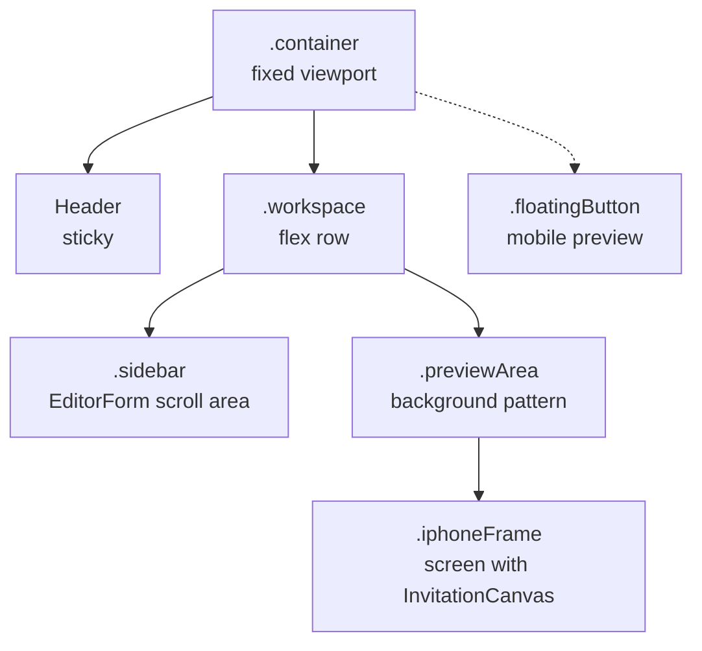
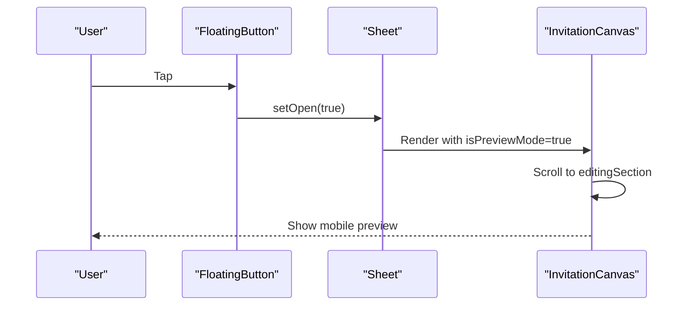
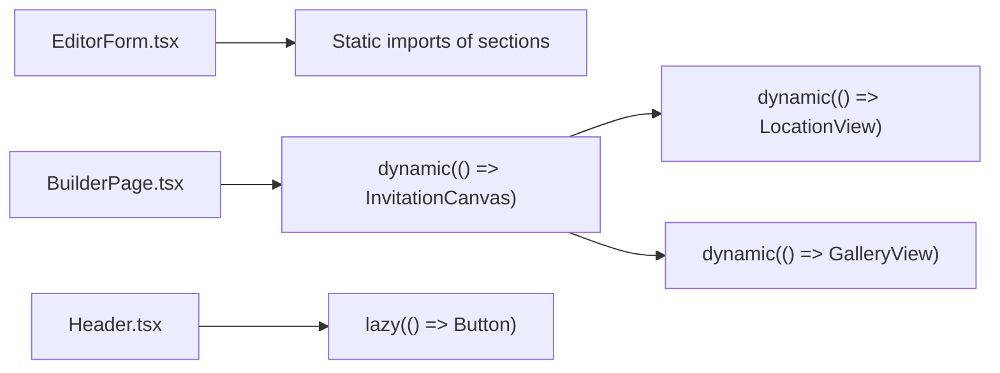
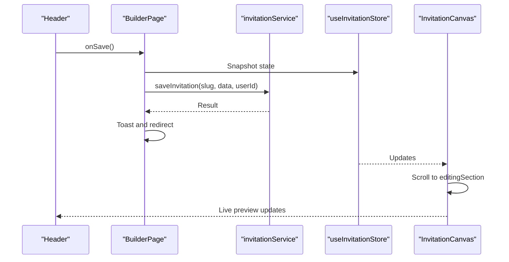
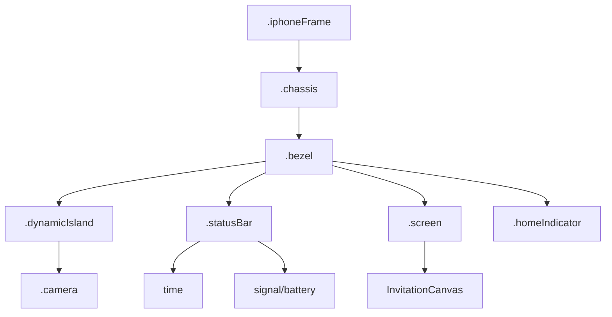
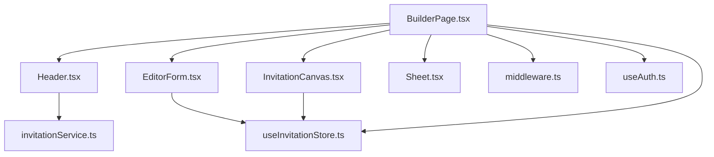

# Builder Page Architecture

<cite>
**Referenced Files in This Document**
- [src/app/builder/page.tsx](file://src/app/builder/page.tsx)
- [src/app/builder/BuilderPage.module.scss](file://src/app/builder/BuilderPage.module.scss)
- [src/components/common/Header/Header.tsx](file://src/components/common/Header/Header.tsx)
- [src/components/common/Header/Header.module.scss](file://src/components/common/Header/Header.module.scss)
- [src/components/common/EditorForm/EditorForm.tsx](file://src/components/common/EditorForm/EditorForm.tsx)
- [src/components/common/EditorForm/EditorForm.module.scss](file://src/components/common/EditorForm/EditorForm.module.scss)
- [src/components/preview/InvitationCanvas.tsx](file://src/components/preview/InvitationCanvas.tsx)
- [src/components/preview/sections/MainScreenView.tsx](file://src/components/preview/sections/MainScreenView.tsx)
- [src/components/ui/Sheet/Sheet.tsx](file://src/components/ui/Sheet/Sheet.tsx)
- [src/store/useInvitationStore.ts](file://src/store/useInvitationStore.ts)
- [src/hooks/useAuth.ts](file://src/hooks/useAuth.ts)
- [src/services/invitationService.ts](file://src/services/invitationService.ts)
- [middleware.ts](file://middleware.ts)
</cite>

## Table of Contents
1. [Introduction](#introduction)
2. [Project Structure](#project-structure)
3. [Core Components](#core-components)
4. [Architecture Overview](#architecture-overview)
5. [Detailed Component Analysis](#detailed-component-analysis)
6. [Dependency Analysis](#dependency-analysis)
7. [Performance Considerations](#performance-considerations)
8. [Troubleshooting Guide](#troubleshooting-guide)
9. [Conclusion](#conclusion)

## Introduction
This document explains the builder page architecture for the main invitation creation interface. It covers the dual-mode operation (edit/new) controlled by URL parameters, authentication guards, and session management. It documents the responsive design with a desktop sidebar editor and mobile preview, the floating action button for mobile preview access, and the sheet-based drawer system. It also details dynamic imports for performance optimization and suspense handling, the workspace layout with scroll areas and background patterns, iPhone frame simulation, and the integration between header controls, save functionality, and real-time preview updates.

## Project Structure
The builder page is organized around a single-page application with a fixed container, a sticky header, a two-column workspace (sidebar + preview), and a mobile preview drawer. The sidebar contains an editable form backed by a centralized store. The preview area renders a realistic iPhone mockup containing the InvitationCanvas, which reflects live changes from the store.

**Diagram sources**
- [src/app/builder/page.tsx](file://src/app/builder/page.tsx#L42-L232)
- [src/components/common/Header/Header.tsx](file://src/components/common/Header/Header.tsx#L26-L196)
- [src/components/common/EditorForm/EditorForm.tsx](file://src/components/common/EditorForm/EditorForm.tsx#L35-L109)
- [src/components/preview/InvitationCanvas.tsx](file://src/components/preview/InvitationCanvas.tsx#L462-L469)
- [src/components/ui/Sheet/Sheet.tsx](file://src/components/ui/Sheet/Sheet.tsx#L9-L138)
- [src/store/useInvitationStore.ts](file://src/store/useInvitationStore.ts#L373-L534)
- [src/services/invitationService.ts](file://src/services/invitationService.ts#L9-L24)

**Section sources**
- [src/app/builder/page.tsx](file://src/app/builder/page.tsx#L1-L232)
- [src/app/builder/BuilderPage.module.scss](file://src/app/builder/BuilderPage.module.scss#L1-L425)

## Core Components
- BuilderPage: Orchestrates dual-mode initialization (edit/new), authentication guards, save flow, and renders the workspace and mobile preview drawer.
- Header: Provides navigation, save, and logout actions with preloaded buttons and reset dialogs.
- EditorForm: Renders a collapsible accordion of builder sections bound to the store.
- InvitationCanvas: Renders the invitation preview inside an iPhone mockup with dynamic imports and scroll-to-section behavior.
- Sheet: Implements a right-side drawer for mobile preview with focus management and custom close button.
- useInvitationStore: Centralized state for all invitation data, setters, and UI flags.
- invitationService: Persists invitation data to Supabase.
- middleware: Enforces authentication for protected routes.

**Section sources**
- [src/app/builder/page.tsx](file://src/app/builder/page.tsx#L42-L232)
- [src/components/common/Header/Header.tsx](file://src/components/common/Header/Header.tsx#L26-L196)
- [src/components/common/EditorForm/EditorForm.tsx](file://src/components/common/EditorForm/EditorForm.tsx#L35-L109)
- [src/components/preview/InvitationCanvas.tsx](file://src/components/preview/InvitationCanvas.tsx#L462-L469)
- [src/components/ui/Sheet/Sheet.tsx](file://src/components/ui/Sheet/Sheet.tsx#L9-L138)
- [src/store/useInvitationStore.ts](file://src/store/useInvitationStore.ts#L373-L534)
- [src/services/invitationService.ts](file://src/services/invitationService.ts#L9-L24)
- [middleware.ts](file://middleware.ts#L4-L17)

## Architecture Overview
The builder follows a unidirectional data flow:
- User edits fields in the sidebar (EditorForm).
- Zustand store updates atomically via setters.
- InvitationCanvas subscribes to store slices and re-renders sections.
- Header triggers save via invitationService, persists to Supabase, and navigates to MyPage.

**Diagram sources**
- [src/components/common/Header/Header.tsx](file://src/components/common/Header/Header.tsx#L75-L85)
- [src/app/builder/page.tsx](file://src/app/builder/page.tsx#L87-L127)
- [src/store/useInvitationStore.ts](file://src/store/useInvitationStore.ts#L373-L534)
- [src/components/preview/InvitationCanvas.tsx](file://src/components/preview/InvitationCanvas.tsx#L462-L469)
- [src/services/invitationService.ts](file://src/services/invitationService.ts#L10-L24)

## Detailed Component Analysis

### Dual-Mode Operation (Edit/New) and Authentication Guards
- URL-driven mode: The BuilderPage reads the mode URL parameter to decide initialization behavior. When mode equals edit, it preserves existing store state; otherwise, it resets the store and clears drafts.
- Authentication guard: Middleware redirects unauthenticated users away from /builder to /login and vice versa. Client-side guard in BuilderPage additionally checks profile completion and redirects to login if needed.
- Session management: The useAuth hook integrates NextAuth session and profile queries, exposing isProfileComplete and isAdmin flags used by save logic.

**Diagram sources**
- [src/app/builder/page.tsx](file://src/app/builder/page.tsx#L57-L76)
- [middleware.ts](file://middleware.ts#L4-L17)
- [src/hooks/useAuth.ts](file://src/hooks/useAuth.ts#L9-L55)

**Section sources**
- [src/app/builder/page.tsx](file://src/app/builder/page.tsx#L57-L76)
- [middleware.ts](file://middleware.ts#L4-L17)
- [src/hooks/useAuth.ts](file://src/hooks/useAuth.ts#L9-L55)

### Workspace Layout, Scroll Areas, and Background Patterns
- Fixed container with sticky header occupies the full viewport.
- Sidebar (desktop: 480px wide) hosts the EditorForm with a custom scroll area and hidden OS scrollbar.
- Preview area displays a background pattern and centers the iPhone mockup with a label.
- Desktop hides the preview area until >= 1024px; mobile preview is accessed via a floating action button.

**Diagram sources**
- [src/app/builder/BuilderPage.module.scss](file://src/app/builder/BuilderPage.module.scss#L3-L116)
- [src/app/builder/BuilderPage.module.scss](file://src/app/builder/BuilderPage.module.scss#L118-L313)

**Section sources**
- [src/app/builder/BuilderPage.module.scss](file://src/app/builder/BuilderPage.module.scss#L3-L116)
- [src/app/builder/BuilderPage.module.scss](file://src/app/builder/BuilderPage.module.scss#L118-L313)

### Mobile Preview Drawer and Floating Action Button
- Floating action button appears on small screens and opens a Sheet drawer with the mobile preview.
- Sheet uses Radix UI primitives with a portal, overlay, and custom close button positioned absolutely.
- The drawer renders InvitationCanvas in preview mode and scrolls to the active editing section upon opening.

**Diagram sources**
- [src/app/builder/page.tsx](file://src/app/builder/page.tsx#L190-L221)
- [src/components/ui/Sheet/Sheet.tsx](file://src/components/ui/Sheet/Sheet.tsx#L35-L78)
- [src/components/preview/InvitationCanvas.tsx](file://src/components/preview/InvitationCanvas.tsx#L215-L288)

**Section sources**
- [src/app/builder/page.tsx](file://src/app/builder/page.tsx#L190-L221)
- [src/components/ui/Sheet/Sheet.tsx](file://src/components/ui/Sheet/Sheet.tsx#L35-L78)
- [src/components/preview/InvitationCanvas.tsx](file://src/components/preview/InvitationCanvas.tsx#L215-L288)

### Dynamic Imports, Suspense, and Performance Optimization
- InvitationCanvas is dynamically imported to defer heavy rendering until needed.
- EditorForm statically imports section components to avoid CSS chunk splitting warnings.
- InvitationCanvas uses dynamic imports for LocationView and GalleryView with SSR disabled and skeleton loaders.
- Header lazily loads Button to avoid preload warnings for modal usage.
- The store merges persisted state with defaults and deep merges nested objects to maintain compatibility.

**Diagram sources**
- [src/components/common/EditorForm/EditorForm.tsx](file://src/components/common/EditorForm/EditorForm.tsx#L10-L21)
- [src/app/builder/page.tsx](file://src/app/builder/page.tsx#L10-L17)
- [src/components/preview/InvitationCanvas.tsx](file://src/components/preview/InvitationCanvas.tsx#L21-L26)
- [src/components/common/Header/Header.tsx](file://src/components/common/Header/Header.tsx#L17-L18)

**Section sources**
- [src/components/common/EditorForm/EditorForm.tsx](file://src/components/common/EditorForm/EditorForm.tsx#L10-L21)
- [src/app/builder/page.tsx](file://src/app/builder/page.tsx#L10-L17)
- [src/components/preview/InvitationCanvas.tsx](file://src/components/preview/InvitationCanvas.tsx#L21-L26)
- [src/components/common/Header/Header.tsx](file://src/components/common/Header/Header.tsx#L17-L18)
- [src/store/useInvitationStore.ts](file://src/store/useInvitationStore.ts#L491-L530)

### Integration Between Header Controls, Save Functionality, and Real-Time Preview
- Header exposes onSave and onLogin callbacks; save validates upload status and delegates to BuilderPage.
- BuilderPage’s save handler:
  - Ensures user is logged in and store is ready.
  - Generates a slug if missing.
  - Prevents edits to approved/requesting invitations for non-admins.
  - Calls invitationService.saveInvitation and navigates to MyPage on success.
- Real-time preview:
  - InvitationCanvas subscribes to store slices and scrolls to the active editing section.
  - Uses a readiness flag and delayed reveal to avoid jank during drawer animations.

**Diagram sources**
- [src/components/common/Header/Header.tsx](file://src/components/common/Header/Header.tsx#L75-L85)
- [src/app/builder/page.tsx](file://src/app/builder/page.tsx#L87-L127)
- [src/services/invitationService.ts](file://src/services/invitationService.ts#L10-L24)
- [src/components/preview/InvitationCanvas.tsx](file://src/components/preview/InvitationCanvas.tsx#L215-L288)

**Section sources**
- [src/components/common/Header/Header.tsx](file://src/components/common/Header/Header.tsx#L75-L85)
- [src/app/builder/page.tsx](file://src/app/builder/page.tsx#L87-L127)
- [src/services/invitationService.ts](file://src/services/invitationService.ts#L10-L24)
- [src/components/preview/InvitationCanvas.tsx](file://src/components/preview/InvitationCanvas.tsx#L215-L288)

### iPhone Frame Simulation and Visual Design
- The iPhone mockup is implemented purely with CSS, including dynamic notch, camera bump, status bar, and home indicator.
- The screen area hosts the InvitationCanvas with a subtle scaling transform and z-index stacking to ensure content remains above background patterns.

**Diagram sources**
- [src/app/builder/BuilderPage.module.scss](file://src/app/builder/BuilderPage.module.scss#L118-L313)

**Section sources**
- [src/app/builder/BuilderPage.module.scss](file://src/app/builder/BuilderPage.module.scss#L118-L313)

### Responsive Design Implementation
- Desktop: Sidebar is always visible; preview area is shown when viewport width >= 1024px.
- Mobile: Preview area is hidden; a floating action button opens a right-side Sheet drawer with a constrained width.
- Scroll areas: Sidebar scroll area uses hidden OS scrollbar and custom padding to accommodate the FAB on small screens.

**Section sources**
- [src/app/builder/BuilderPage.module.scss](file://src/app/builder/BuilderPage.module.scss#L33-L116)

## Dependency Analysis
The builder page composes several subsystems with clear boundaries:
- UI: Header, EditorForm, Sheet, and InvitationCanvas.
- State: useInvitationStore with persistence and merge logic.
- Services: invitationService for Supabase operations.
- Routing/Auth: middleware.ts and useAuth hook.

**Diagram sources**
- [src/app/builder/page.tsx](file://src/app/builder/page.tsx#L42-L232)
- [src/components/common/Header/Header.tsx](file://src/components/common/Header/Header.tsx#L26-L196)
- [src/components/common/EditorForm/EditorForm.tsx](file://src/components/common/EditorForm/EditorForm.tsx#L35-L109)
- [src/components/preview/InvitationCanvas.tsx](file://src/components/preview/InvitationCanvas.tsx#L462-L469)
- [src/components/ui/Sheet/Sheet.tsx](file://src/components/ui/Sheet/Sheet.tsx#L9-L138)
- [src/store/useInvitationStore.ts](file://src/store/useInvitationStore.ts#L373-L534)
- [src/services/invitationService.ts](file://src/services/invitationService.ts#L9-L24)
- [middleware.ts](file://middleware.ts#L4-L17)
- [src/hooks/useAuth.ts](file://src/hooks/useAuth.ts#L9-L55)

**Section sources**
- [src/app/builder/page.tsx](file://src/app/builder/page.tsx#L42-L232)
- [src/store/useInvitationStore.ts](file://src/store/useInvitationStore.ts#L373-L534)
- [src/services/invitationService.ts](file://src/services/invitationService.ts#L9-L24)
- [middleware.ts](file://middleware.ts#L4-L17)
- [src/hooks/useAuth.ts](file://src/hooks/useAuth.ts#L9-L55)

## Performance Considerations
- Dynamic imports: Defer heavy components (InvitationCanvas, LocationView, GalleryView) to reduce initial bundle size and improve TTI.
- Suspense: Wrap potentially slow components with Suspense to avoid blocking the UI.
- Store granularity: useShallow selectors minimize re-renders by subscribing to specific slices.
- Scroll optimization: InvitationCanvas delays reveal until drawer animation completes to prevent layout thrashing.
- Static imports: EditorForm static imports prevent CSS chunk warnings and improve perceived load time.

[No sources needed since this section provides general guidance]

## Troubleshooting Guide
- Save fails silently: Verify user presence and store readiness before saving; ensure slug generation occurs when missing.
- Approved/requesting invitations cannot be edited: Non-admin users are blocked from editing; check isAdmin and state flags.
- Mobile preview not scrolling to section: Confirm editingSection is set and InvitationCanvas waits for DOM measurement before scrolling.
- Login loop or redirect: Check middleware matcher and useAuth profile completion logic; ensure profile is complete before accessing builder.
- Heavy layout shifts on drawer open: The canvas defers readiness until after drawer animation completes; verify the 350ms delay logic.

**Section sources**
- [src/app/builder/page.tsx](file://src/app/builder/page.tsx#L87-L127)
- [src/components/preview/InvitationCanvas.tsx](file://src/components/preview/InvitationCanvas.tsx#L254-L288)
- [middleware.ts](file://middleware.ts#L4-L17)
- [src/hooks/useAuth.ts](file://src/hooks/useAuth.ts#L9-L55)

## Conclusion
The builder page architecture combines a responsive, dual-mode editing experience with robust authentication, real-time preview updates, and performance-conscious rendering. The separation of concerns across Header, EditorForm, InvitationCanvas, and the store enables scalable development and maintenance. The sheet-based mobile drawer and iPhone mockup deliver a polished user experience across devices.