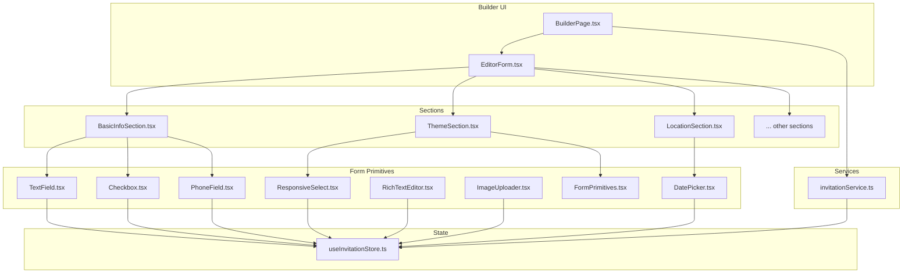
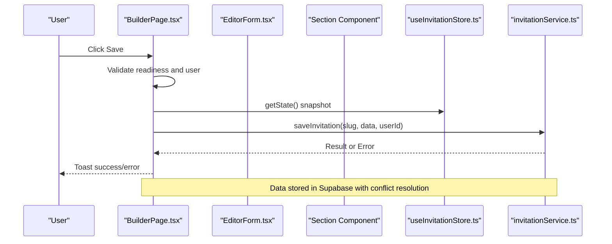
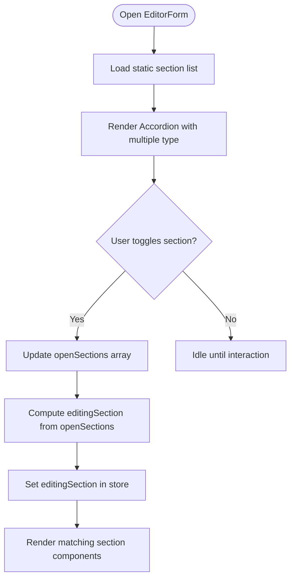
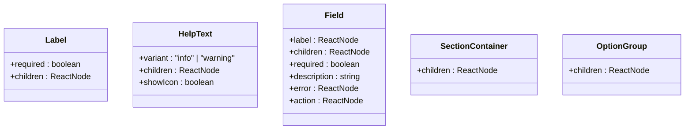
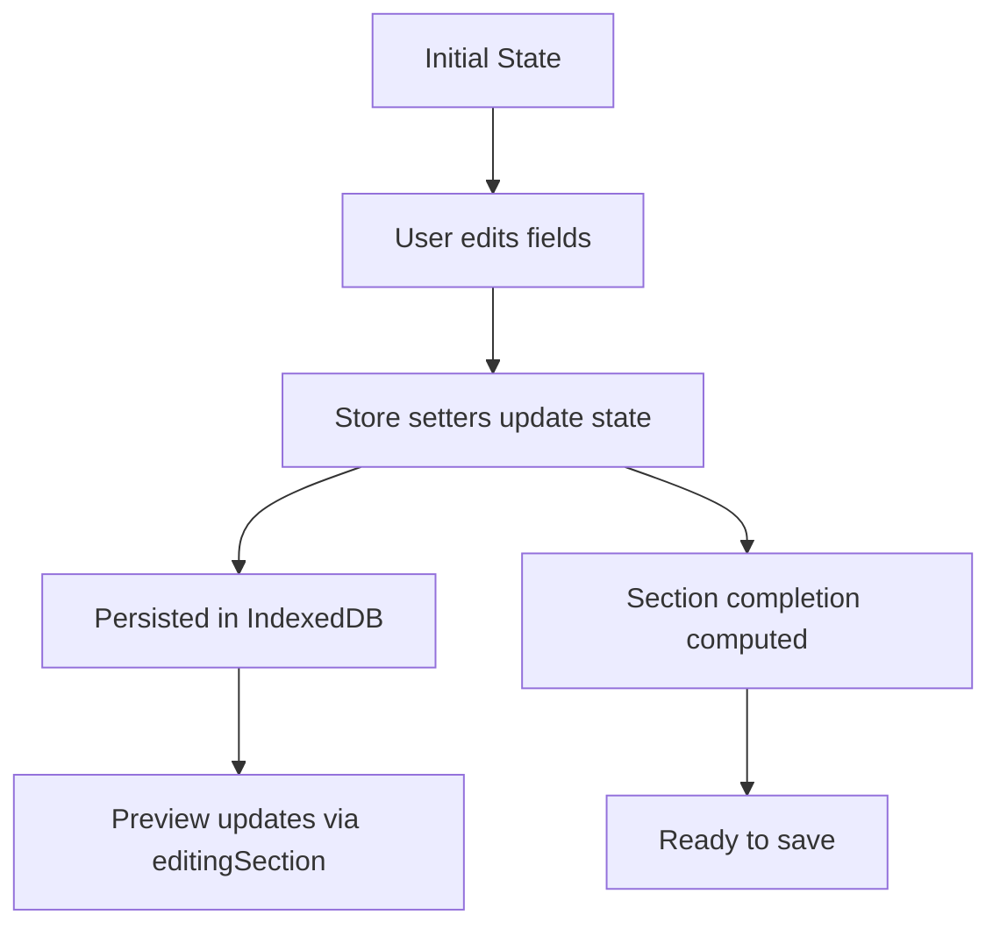
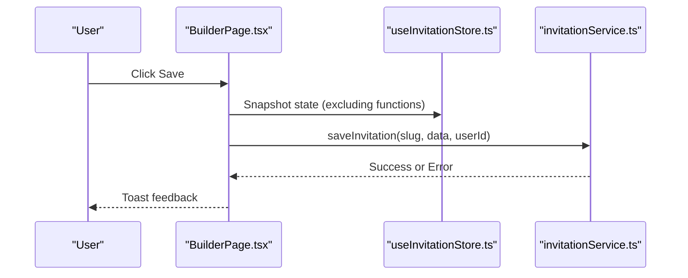
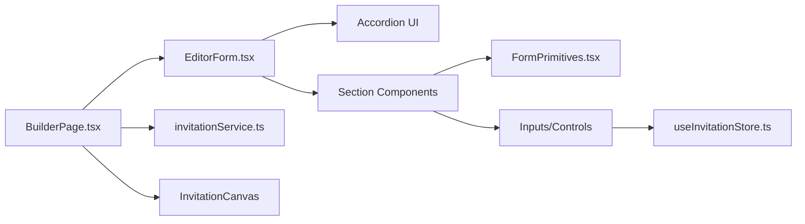

# Editor Form System

<cite>
**Referenced Files in This Document**
- [EditorForm.tsx](file://src/components/common/EditorForm/EditorForm.tsx)
- [FormPrimitives.tsx](file://src/components/common/FormPrimitives/FormPrimitives.tsx)
- [useInvitationStore.ts](file://src/store/useInvitationStore.ts)
- [BuilderPage.tsx](file://src/app/builder/page.tsx)
- [TextField.tsx](file://src/components/common/TextField/TextField.tsx)
- [DatePicker.tsx](file://src/components/common/DatePicker/DatePicker.tsx)
- [RichTextEditor.tsx](file://src/components/common/RichTextEditor/RichTextEditor.tsx)
- [ImageUploader.tsx](file://src/components/common/ImageUploader/ImageUploader.tsx)
- [ResponsiveSelect.tsx](file://src/components/common/ResponsiveSelect/ResponsiveSelect.tsx)
- [PhoneField.tsx](file://src/components/common/PhoneField/PhoneField.tsx)
- [Checkbox.tsx](file://src/components/common/Checkbox/Checkbox.tsx)
- [BasicInfoSection.tsx](file://src/components/builder/sections/BasicInfoSection.tsx)
- [ThemeSection.tsx](file://src/components/builder/sections/ThemeSection.tsx)
- [LocationSection.tsx](file://src/components/builder/sections/LocationSection.tsx)
- [invitationService.ts](file://src/services/invitationService.ts)
- [builder.ts](file://src/types/builder.ts)
</cite>

## Table of Contents
1. [Introduction](#introduction)
2. [Project Structure](#project-structure)
3. [Core Components](#core-components)
4. [Architecture Overview](#architecture-overview)
5. [Detailed Component Analysis](#detailed-component-analysis)
6. [Dependency Analysis](#dependency-analysis)
7. [Performance Considerations](#performance-considerations)
8. [Troubleshooting Guide](#troubleshooting-guide)
9. [Conclusion](#conclusion)
10. [Appendices](#appendices)

## Introduction
This document explains the editor form system that powers the section-based editing interface for wedding invitations. It covers dynamic section rendering, validation patterns, real-time feedback, form primitives (inputs, selects, date pickers, rich text editors), state management, accessibility, responsive layouts, and submission workflows. It also documents integration with the invitation store, collaboration-friendly features, and mobile UX patterns.

## Project Structure
The editor form system centers around a dynamic accordion of editable sections. Each section encapsulates related fields and updates the shared invitation state via a centralized store. Supporting components provide form primitives, date/time selection, rich text editing, and image uploads. The builder page orchestrates saving, previews, and mobile optimization.

**Diagram sources**
- [BuilderPage.tsx](file://src/app/builder/page.tsx#L42-L223)
- [EditorForm.tsx](file://src/components/common/EditorForm/EditorForm.tsx#L35-L104)
- [BasicInfoSection.tsx](file://src/components/builder/sections/BasicInfoSection.tsx#L15-L131)
- [ThemeSection.tsx](file://src/components/builder/sections/ThemeSection.tsx#L22-L133)
- [LocationSection.tsx](file://src/components/builder/sections/LocationSection.tsx#L8-L22)
- [useInvitationStore.ts](file://src/store/useInvitationStore.ts#L373-L534)
- [FormPrimitives.tsx](file://src/components/common/FormPrimitives/FormPrimitives.tsx#L13-L118)
- [TextField.tsx](file://src/components/common/TextField/TextField.tsx#L18-L77)
- [ResponsiveSelect.tsx](file://src/components/common/ResponsiveSelect/ResponsiveSelect.tsx#L42-L182)
- [DatePicker.tsx](file://src/components/common/DatePicker/DatePicker.tsx#L29-L116)
- [RichTextEditor.tsx](file://src/components/common/RichTextEditor/RichTextEditor.tsx#L30-L173)
- [ImageUploader.tsx](file://src/components/common/ImageUploader/ImageUploader.tsx#L27-L199)
- [PhoneField.tsx](file://src/components/common/PhoneField/PhoneField.tsx#L10-L40)
- [Checkbox.tsx](file://src/components/common/Checkbox/Checkbox.tsx#L41-L113)
- [invitationService.ts](file://src/services/invitationService.ts#L9-L81)

**Section sources**
- [EditorForm.tsx](file://src/components/common/EditorForm/EditorForm.tsx#L22-L33)
- [BuilderPage.tsx](file://src/app/builder/page.tsx#L10-L17)

## Core Components
- EditorForm: Renders a dynamic accordion of sections, manages which sections are open, and tracks the currently edited section for live preview updates.
- FormPrimitives: Provides reusable primitives for labels, help text, field containers, and option groups.
- useInvitationStore: Centralized state for all invitation data, setters for each field, UI flags (editingSection), and persistence via IndexedDB.
- Section components: Encapsulate domain-specific fields (e.g., BasicInfoSection, ThemeSection, LocationSection) and bind to the store.
- Form primitives: Input fields, selects, date picker, rich text editor, image uploader, phone field, and checkbox.

Key responsibilities:
- Dynamic rendering: Sections are mapped and rendered conditionally based on accordion state.
- Real-time feedback: Editing section tracking updates the preview canvas instantly.
- Validation patterns: Sections compute completion status from required fields; primitive wrappers support error states and help text.
- Accessibility: Labels, ARIA attributes, keyboard navigation, and focus management for mobile drawers and modals.

**Section sources**
- [EditorForm.tsx](file://src/components/common/EditorForm/EditorForm.tsx#L35-L104)
- [FormPrimitives.tsx](file://src/components/common/FormPrimitives/FormPrimitives.tsx#L13-L118)
- [useInvitationStore.ts](file://src/store/useInvitationStore.ts#L4-L230)

## Architecture Overview
The system follows a unidirectional data flow:
- UI components read from the store and dispatch updates via setters.
- The store persists state locally and exposes derived UI flags.
- The builder page orchestrates saving, previewing, and mobile drawer interactions.

**Diagram sources**
- [BuilderPage.tsx](file://src/app/builder/page.tsx#L87-L127)
- [invitationService.ts](file://src/services/invitationService.ts#L10-L24)
- [useInvitationStore.ts](file://src/store/useInvitationStore.ts#L373-L474)

## Detailed Component Analysis

### EditorForm: Dynamic Section Rendering and Live Editing
- Maintains open sections and determines the current editing section to drive preview updates.
- Uses an accordion to render sections dynamically and avoids hydration mismatches by deferring initial render.
- Prevents icon pop-in by importing section components statically.

**Diagram sources**
- [EditorForm.tsx](file://src/components/common/EditorForm/EditorForm.tsx#L35-L59)

**Section sources**
- [EditorForm.tsx](file://src/components/common/EditorForm/EditorForm.tsx#L35-L104)

### Form Primitives: Labels, Help Text, Field Groups, and Option Groups
- Label: Adds optional asterisk for required fields.
- HelpText: Variants for info and warning with optional icons.
- Field: Container for label, children, description, and error messaging.
- SectionContainer and OptionGroup: Layout helpers for section and grouped options.

**Diagram sources**
- [FormPrimitives.tsx](file://src/components/common/FormPrimitives/FormPrimitives.tsx#L13-L118)

**Section sources**
- [FormPrimitives.tsx](file://src/components/common/FormPrimitives/FormPrimitives.tsx#L13-L118)

### Form Inputs and Controls

#### TextField
- Single-line or multi-line text area with label, help text, error state, and optional right-aligned adornment.
- Integrates with shared Input/Textarea components and applies error styling.

**Section sources**
- [TextField.tsx](file://src/components/common/TextField/TextField.tsx#L18-L77)

#### ResponsiveSelect
- Desktop: Standard select with trigger and content.
- Mobile: Drawer-based selection with optimized scrolling and focus management.
- Supports optimistic UI updates and ARIA descriptions.

**Section sources**
- [ResponsiveSelect.tsx](file://src/components/common/ResponsiveSelect/ResponsiveSelect.tsx#L42-L182)

#### DatePicker
- Desktop: Popover-triggered calendar.
- Mobile: Drawer-triggered calendar with focus management to avoid aria-hidden warnings.
- Parses and formats dates to ISO string.

**Section sources**
- [DatePicker.tsx](file://src/components/common/DatePicker/DatePicker.tsx#L29-L116)

#### RichTextEditor
- TipTap-powered editor with toolbar controls for bold, italic, underline, color, and highlight.
- Uses useEditorState to track active states reactively.
- Accepts placeholder and minimum height configuration.

**Section sources**
- [RichTextEditor.tsx](file://src/components/common/RichTextEditor/RichTextEditor.tsx#L30-L173)

#### ImageUploader
- Optimistic UI: shows blob URL immediately upon selection.
- Background upload to storage; reverts on failure and cleans up blob URLs.
- Supports aspect ratio modes and ratio toggling.

**Section sources**
- [ImageUploader.tsx](file://src/components/common/ImageUploader/ImageUploader.tsx#L27-L199)

#### PhoneField
- Formats phone numbers as the user types and optionally displays an icon.

**Section sources**
- [PhoneField.tsx](file://src/components/common/PhoneField/PhoneField.tsx#L10-L40)

#### Checkbox
- Supports circle and line variants with controlled/uncontrolled modes and legacy onChange compatibility.

**Section sources**
- [Checkbox.tsx](file://src/components/common/Checkbox/Checkbox.tsx#L41-L113)

### Section Components: Examples and Patterns

#### BasicInfoSection
- Two-person profile fields with parent details and deceased toggles.
- Completion flag computed from required fields.

**Section sources**
- [BasicInfoSection.tsx](file://src/components/builder/sections/BasicInfoSection.tsx#L15-L131)

#### ThemeSection
- Color pickers, font selection, font scaling, background pattern, and background color selection.
- Uses segmented controls and responsive select.

**Section sources**
- [ThemeSection.tsx](file://src/components/builder/sections/ThemeSection.tsx#L22-L133)

#### LocationSection
- Conditional rendering of content only when the section is open.
- Completion flag based on address presence.

**Section sources**
- [LocationSection.tsx](file://src/components/builder/sections/LocationSection.tsx#L8-L22)

### State Management and Validation Patterns
- Centralized state via zustand with persistence in IndexedDB.
- Each field has a dedicated setter; nested objects are merged carefully during hydration.
- UI flags include editingSection for live preview and isUploading for global upload state.
- Sections compute completion status based on required fields.

**Diagram sources**
- [useInvitationStore.ts](file://src/store/useInvitationStore.ts#L373-L534)
- [EditorForm.tsx](file://src/components/common/EditorForm/EditorForm.tsx#L44-L59)

**Section sources**
- [useInvitationStore.ts](file://src/store/useInvitationStore.ts#L4-L230)
- [useInvitationStore.ts](file://src/store/useInvitationStore.ts#L373-L534)

### Submission Workflow and Collaboration-Friendly Features
- BuilderPage handles authentication guard, draft slug generation, and save flow.
- Saves invitation data to Supabase with upsert and conflict handling.
- Prevents editing when approval is requested or granted (non-admin).
- Uses optimistic UI for image uploads and global upload indicator.

**Diagram sources**
- [BuilderPage.tsx](file://src/app/builder/page.tsx#L87-L127)
- [invitationService.ts](file://src/services/invitationService.ts#L10-L24)

**Section sources**
- [BuilderPage.tsx](file://src/app/builder/page.tsx#L87-L127)
- [invitationService.ts](file://src/services/invitationService.ts#L10-L24)

### Accessibility Features
- Labels associated with inputs via htmlFor/id.
- ARIA descriptions and screen-reader-only text in mobile drawers.
- Focus management on drawer open to move focus inside the drawer.
- Keyboard navigation and visible focus states in selects and buttons.
- Semantic markup and proper heading hierarchy in sections.

**Section sources**
- [TextField.tsx](file://src/components/common/TextField/TextField.tsx#L18-L77)
- [ResponsiveSelect.tsx](file://src/components/common/ResponsiveSelect/ResponsiveSelect.tsx#L137-L140)
- [DatePicker.tsx](file://src/components/common/DatePicker/DatePicker.tsx#L82-L87)

### Responsive Layouts and Mobile Optimization
- Mobile-first drawer-based components for selects and date pickers.
- Optimized preview with a mobile frame and a floating action button to open a slide-out drawer.
- Adaptive component behavior based on media queries.

**Section sources**
- [ResponsiveSelect.tsx](file://src/components/common/ResponsiveSelect/ResponsiveSelect.tsx#L52-L54)
- [DatePicker.tsx](file://src/components/common/DatePicker/DatePicker.tsx#L30-L31)
- [BuilderPage.tsx](file://src/app/builder/page.tsx#L190-L221)

### Conditional Rendering and Dynamic Field Generation
- Sections render only when open to reduce DOM and improve performance.
- Some sections expose child components (e.g., LocationSectionContent) for modular rendering.
- Dynamic section list enables easy addition/removal of sections.

**Section sources**
- [EditorForm.tsx](file://src/components/common/EditorForm/EditorForm.tsx#L94-L100)
- [LocationSection.tsx](file://src/components/builder/sections/LocationSection.tsx#L19)

## Dependency Analysis
- EditorForm depends on:
  - Accordion UI component
  - Static imports of section components
  - useInvitationStore for editingSection and state subscription
- Section components depend on:
  - Form primitives and form controls
  - useInvitationStore for getters/setters
  - AccordionItem wrapper for UI behavior
- BuilderPage depends on:
  - EditorForm
  - InvitationCanvas for preview
  - invitationService for save operations
  - Zustand shallow selectors for minimal re-renders

**Diagram sources**
- [EditorForm.tsx](file://src/components/common/EditorForm/EditorForm.tsx#L5-L20)
- [BuilderPage.tsx](file://src/app/builder/page.tsx#L22-L35)
- [useInvitationStore.ts](file://src/store/useInvitationStore.ts#L373-L474)

**Section sources**
- [EditorForm.tsx](file://src/components/common/EditorForm/EditorForm.tsx#L5-L20)
- [BuilderPage.tsx](file://src/app/builder/page.tsx#L22-L35)

## Performance Considerations
- Memoization: Section components and EditorForm use memoization to prevent unnecessary re-renders.
- Deferred rendering: Initial skeleton loading prevents layout shifts and improves perceived performance.
- Optimistic UI: ImageUploader updates immediately with a blob URL while uploading continues.
- Selective state updates: Shallow selectors minimize re-renders in consumers.
- IndexedDB persistence: Higher capacity than localStorage for large datasets.

[No sources needed since this section provides general guidance]

## Troubleshooting Guide
Common issues and resolutions:
- Saving fails due to missing user: Guard checks redirect to login; ensure authentication state is present.
- Save blocked when approval is requested/approved: Non-admin users cannot edit; inform users and guide them to admin if necessary.
- Image upload errors: UI reverts to previous value and shows a destructive toast; check network and storage permissions.
- Drawer focus issues: Auto-focus logic ensures focus moves inside the drawer on open; verify refs and scroll areas.
- Date parsing/formatting: Ensure date strings conform to ISO format; Picker handles conversion internally.

**Section sources**
- [BuilderPage.tsx](file://src/app/builder/page.tsx#L87-L127)
- [ImageUploader.tsx](file://src/components/common/ImageUploader/ImageUploader.tsx#L63-L73)
- [DatePicker.tsx](file://src/components/common/DatePicker/DatePicker.tsx#L37-L42)

## Conclusion
The editor form system combines a modular, section-based UI with robust state management, responsive controls, and accessibility-first patterns. It supports real-time previews, optimistic updates, and safe submission workflows, enabling creators to build beautiful invitations efficiently across devices.

[No sources needed since this section summarizes without analyzing specific files]

## Appendices

### API Definitions: Invitation Save
- Endpoint: Upsert invitation by slug
- Method: PUT/POST
- Request body: { slug, invitation_data, user_id, updated_at }
- Response: Stored record or error

**Section sources**
- [invitationService.ts](file://src/services/invitationService.ts#L10-L24)

### Types: Section Props
- value: Unique identifier for the accordion item
- isOpen: Boolean indicating whether the section is expanded

**Section sources**
- [builder.ts](file://src/types/builder.ts#L12-L15)