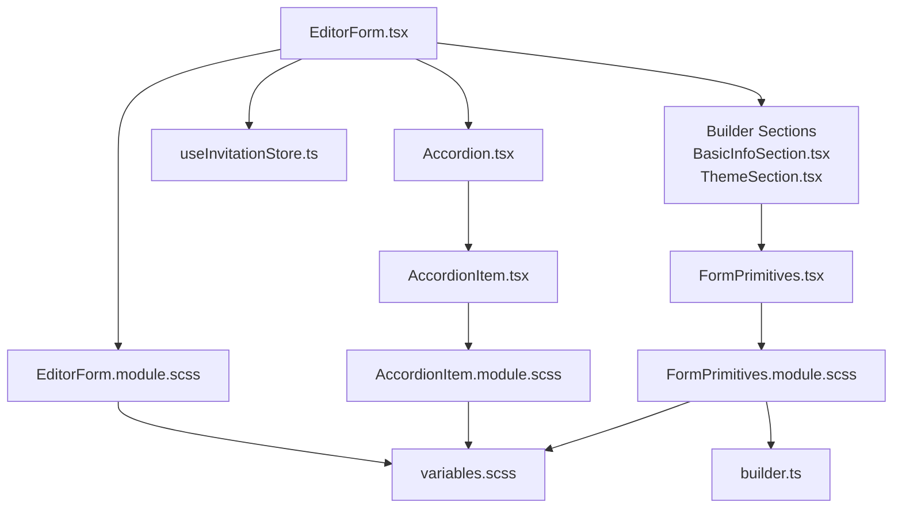
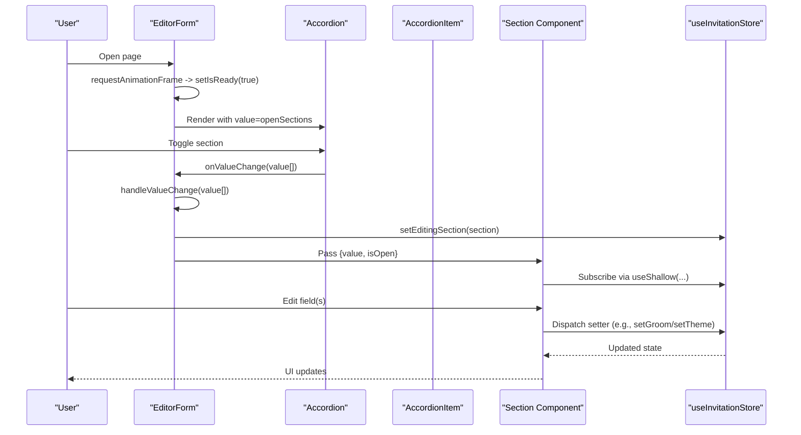
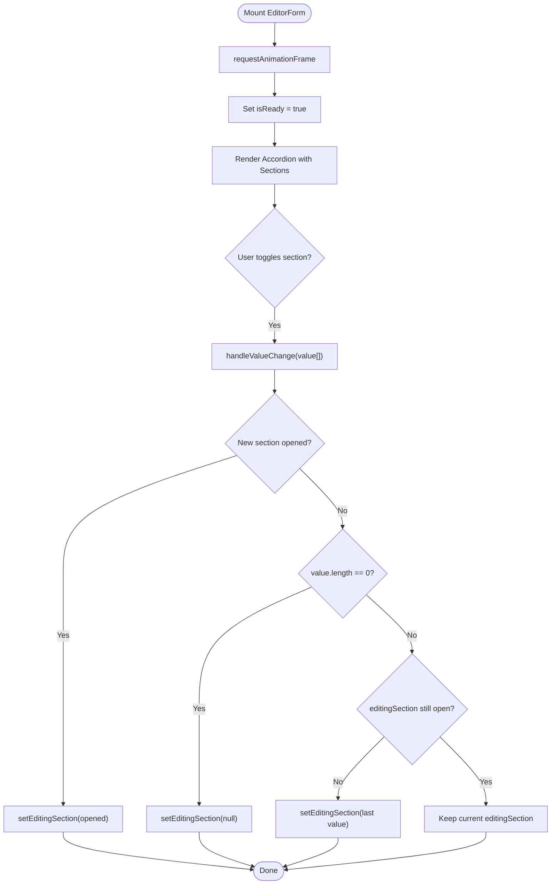
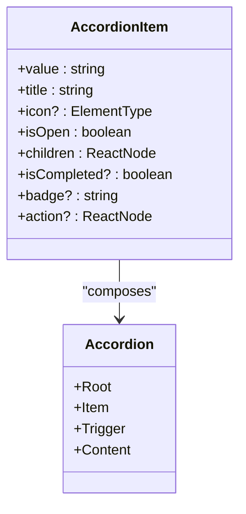
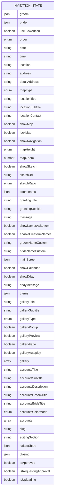
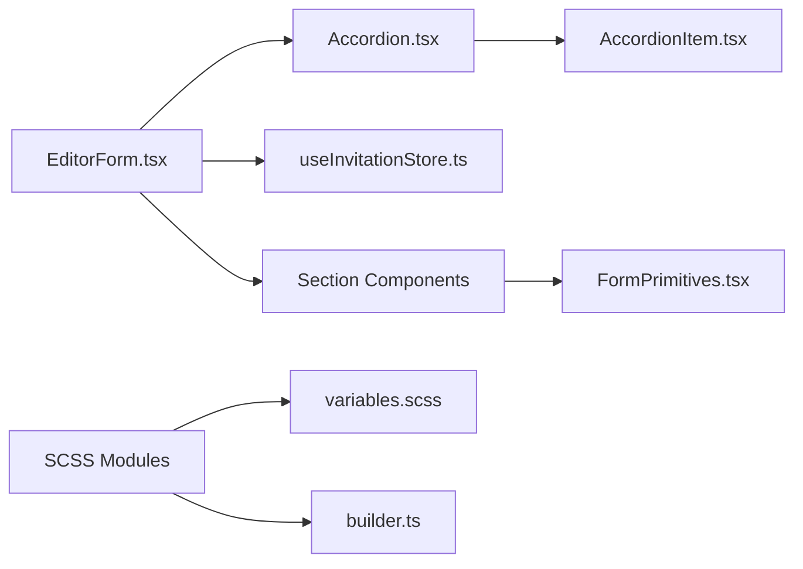

# Form Architecture

<cite>
**Referenced Files in This Document**
- [EditorForm.tsx](file://src/components/common/EditorForm/EditorForm.tsx)
- [EditorForm.module.scss](file://src/components/common/EditorForm/EditorForm.module.scss)
- [index.ts](file://src/components/common/EditorForm/index.ts)
- [useInvitationStore.ts](file://src/store/useInvitationStore.ts)
- [BasicInfoSection.tsx](file://src/components/builder/sections/BasicInfoSection.tsx)
- [ThemeSection.tsx](file://src/components/builder/sections/ThemeSection.tsx)
- [Accordion.tsx](file://src/components/ui/Accordion/Accordion.tsx)
- [AccordionItem.tsx](file://src/components/common/AccordionItem/AccordionItem.tsx)
- [AccordionItem.module.scss](file://src/components/common/AccordionItem/AccordionItem.module.scss)
- [FormPrimitives.tsx](file://src/components/common/FormPrimitives/FormPrimitives.tsx)
- [FormPrimitives.module.scss](file://src/components/common/FormPrimitives/FormPrimitives.module.scss)
- [builder.ts](file://src/styles/_builder.scss)
- [variables.scss](file://src/styles/_variables.scss)
- [a11y.ts](file://src/lib/a11y.ts)
- [builder.ts](file://src/types/builder.ts)
</cite>

## Table of Contents
1. [Introduction](#introduction)
2. [Project Structure](#project-structure)
3. [Core Components](#core-components)
4. [Architecture Overview](#architecture-overview)
5. [Detailed Component Analysis](#detailed-component-analysis)
6. [Dependency Analysis](#dependency-analysis)
7. [Performance Considerations](#performance-considerations)
8. [Troubleshooting Guide](#troubleshooting-guide)
9. [Conclusion](#conclusion)
10. [Appendices](#appendices)

## Introduction
This document explains the form architecture centered on the EditorForm component. It covers the component hierarchy, prop interfaces, state management integration with the invitation store, form container logic, section rendering mechanisms, validation coordination, SCSS module structure, responsive design patterns, accessibility compliance, lifecycle and performance optimizations, and memory management strategies. Examples include form initialization, state synchronization with the invitation store, and error boundary handling.

## Project Structure
The form architecture is organized around a reusable EditorForm container that orchestrates multiple builder sections. Each section encapsulates a domain-specific form area and integrates with a shared Zustand store for state persistence and synchronization.

**Diagram sources**
- [EditorForm.tsx](file://src/components/common/EditorForm/EditorForm.tsx#L1-L109)
- [Accordion.tsx](file://src/components/ui/Accordion/Accordion.tsx#L1-L55)
- [AccordionItem.tsx](file://src/components/common/AccordionItem/AccordionItem.tsx#L1-L107)
- [AccordionItem.module.scss](file://src/components/common/AccordionItem/AccordionItem.module.scss#L1-L136)
- [EditorForm.module.scss](file://src/components/common/EditorForm/EditorForm.module.scss#L1-L80)
- [FormPrimitives.tsx](file://src/components/common/FormPrimitives/FormPrimitives.tsx#L1-L119)
- [FormPrimitives.module.scss](file://src/components/common/FormPrimitives/FormPrimitives.module.scss#L1-L80)
- [builder.ts](file://src/styles/_builder.scss#L1-L200)
- [variables.scss](file://src/styles/_variables.scss#L1-L200)
- [BasicInfoSection.tsx](file://src/components/builder/sections/BasicInfoSection.tsx#L1-L134)
- [ThemeSection.tsx](file://src/components/builder/sections/ThemeSection.tsx#L1-L136)

**Section sources**
- [EditorForm.tsx](file://src/components/common/EditorForm/EditorForm.tsx#L1-L109)
- [Accordion.tsx](file://src/components/ui/Accordion/Accordion.tsx#L1-L55)
- [AccordionItem.tsx](file://src/components/common/AccordionItem/AccordionItem.tsx#L1-L107)
- [EditorForm.module.scss](file://src/components/common/EditorForm/EditorForm.module.scss#L1-L80)
- [FormPrimitives.tsx](file://src/components/common/FormPrimitives/FormPrimitives.tsx#L1-L119)
- [FormPrimitives.module.scss](file://src/components/common/FormPrimitives/FormPrimitives.module.scss#L1-L80)
- [builder.ts](file://src/styles/_builder.scss#L1-L200)
- [variables.scss](file://src/styles/_variables.scss#L1-L200)
- [BasicInfoSection.tsx](file://src/components/builder/sections/BasicInfoSection.tsx#L1-L134)
- [ThemeSection.tsx](file://src/components/builder/sections/ThemeSection.tsx#L1-L136)

## Core Components
- EditorForm: Orchestrates the form container, manages accordion state, and renders sections. It integrates with the invitation store to synchronize the currently edited section and defers rendering until assets are ready.
- Section Components: Encapsulate domain-specific forms (e.g., BasicInfoSection, ThemeSection) and subscribe to relevant parts of the store via shallow selectors.
- Accordion and AccordionItem: Provide collapsible UI with smooth scrolling and accessible triggers.
- FormPrimitives: Reusable primitives for labels, help text, fields, and section containers.
- useInvitationStore: Centralized state for the entire invitation model with persistence and deep merge support.

Key responsibilities:
- Prop interfaces: SectionProps define value and isOpen for each section.
- State management: Zustand store exposes setters for each domain and UI state (e.g., editingSection).
- Rendering: EditorForm maps a static list of sections to their components and passes props.
- Validation: Sections compute completion status and can surface errors via FormPrimitives.

**Section sources**
- [EditorForm.tsx](file://src/components/common/EditorForm/EditorForm.tsx#L22-L33)
- [builder.ts](file://src/types/builder.ts#L12-L15)
- [useInvitationStore.ts](file://src/store/useInvitationStore.ts#L4-L230)
- [BasicInfoSection.tsx](file://src/components/builder/sections/BasicInfoSection.tsx#L15-L30)
- [ThemeSection.tsx](file://src/components/builder/sections/ThemeSection.tsx#L22-L33)
- [Accordion.tsx](file://src/components/ui/Accordion/Accordion.tsx#L9-L54)
- [AccordionItem.tsx](file://src/components/common/AccordionItem/AccordionItem.tsx#L12-L34)
- [FormPrimitives.tsx](file://src/components/common/FormPrimitives/FormPrimitives.tsx#L56-L93)

## Architecture Overview
The EditorForm composes a multiple-accordion container and renders a fixed list of sections. Each section subscribes to the store using shallow selectors to minimize re-renders. The store persists state to IndexedDB with a merge strategy to handle evolving schemas.

**Diagram sources**
- [EditorForm.tsx](file://src/components/common/EditorForm/EditorForm.tsx#L35-L65)
- [Accordion.tsx](file://src/components/ui/Accordion/Accordion.tsx#L9-L54)
- [AccordionItem.tsx](file://src/components/common/AccordionItem/AccordionItem.tsx#L38-L51)
- [BasicInfoSection.tsx](file://src/components/builder/sections/BasicInfoSection.tsx#L16-L21)
- [ThemeSection.tsx](file://src/components/builder/sections/ThemeSection.tsx#L23-L24)
- [useInvitationStore.ts](file://src/store/useInvitationStore.ts#L373-L473)

## Detailed Component Analysis

### EditorForm Component
- Purpose: Container for the entire editor form. Manages accordion open state, initial readiness, and delegates rendering to sections.
- Props: None (no incoming props). Uses internal state for openSections and isReady.
- State management:
  - openSections: Tracks which sections are expanded.
  - editingSection: Synchronized with the store to reflect the currently edited section.
- Lifecycle:
  - Uses requestAnimationFrame to delay rendering until after initial asset load, preventing icon pop-in.
  - Memoized to avoid unnecessary re-renders.
- Rendering:
  - Renders a skeleton loader while initializing.
  - Once ready, renders an Accordion with multiple items and maps SECTIONS to their components.
- Validation coordination:
  - Sections compute completion status and can surface errors via FormPrimitives.Field.
  - No centralized validator is present; sections manage their own validation feedback.

**Diagram sources**
- [EditorForm.tsx](file://src/components/common/EditorForm/EditorForm.tsx#L44-L59)

**Section sources**
- [EditorForm.tsx](file://src/components/common/EditorForm/EditorForm.tsx#L35-L104)
- [EditorForm.module.scss](file://src/components/common/EditorForm/EditorForm.module.scss#L15-L80)

### Section Components (Examples)
- BasicInfoSection:
  - Subscribes to groom/bride and parent details.
  - Provides editable fields for names and parent information with completion checks.
- ThemeSection:
  - Subscribes to theme settings and exposes controls for colors, fonts, patterns, and background.

Both components:
- Accept SectionProps (value, isOpen).
- Use shallow selectors to subscribe to store slices.
- Render using FormPrimitives.Field and SectionContainer.
- Surface completion status to AccordionItem.

**Section sources**
- [BasicInfoSection.tsx](file://src/components/builder/sections/BasicInfoSection.tsx#L15-L130)
- [ThemeSection.tsx](file://src/components/builder/sections/ThemeSection.tsx#L22-L131)
- [FormPrimitives.tsx](file://src/components/common/FormPrimitives/FormPrimitives.tsx#L56-L93)

### Accordion and AccordionItem
- Accordion: Root component built on Radix UI with forward refs for item, trigger, and content.
- AccordionItem: Wraps Radix primitives with custom trigger, chevron rotation, auto-scroll behavior, and action overlays.
- Accessibility: Uses semantic headers and triggers; supports keyboard navigation via Radix.

**Diagram sources**
- [Accordion.tsx](file://src/components/ui/Accordion/Accordion.tsx#L9-L54)
- [AccordionItem.tsx](file://src/components/common/AccordionItem/AccordionItem.tsx#L23-L104)

**Section sources**
- [Accordion.tsx](file://src/components/ui/Accordion/Accordion.tsx#L1-L55)
- [AccordionItem.tsx](file://src/components/common/AccordionItem/AccordionItem.tsx#L1-L107)
- [AccordionItem.module.scss](file://src/components/common/AccordionItem/AccordionItem.module.scss#L24-L119)

### FormPrimitives
Reusable building blocks for form fields:
- Label: Optional required indicator.
- HelpText: Info or warning variants with optional icons.
- Field: Groups label, description, error messages, and children.
- SectionContainer: Applies builder-specific spacing and layout.
- OptionGroup: Stack-like grouping for options.

**Section sources**
- [FormPrimitives.tsx](file://src/components/common/FormPrimitives/FormPrimitives.tsx#L1-L119)
- [FormPrimitives.module.scss](file://src/components/common/FormPrimitives/FormPrimitives.module.scss#L1-L80)
- [builder.ts](file://src/styles/_builder.scss#L1-L200)

### State Model and Initialization
- useInvitationStore:
  - Defines a comprehensive InvitationState interface covering all domains (basic info, theme, gallery, accounts, etc.).
  - Exposes setters for each domain and UI state (e.g., editingSection).
  - Persists to IndexedDB using idb-keyval with a merge strategy to handle schema evolution.
  - Provides an INITIAL_STATE with sensible defaults.

**Diagram sources**
- [useInvitationStore.ts](file://src/store/useInvitationStore.ts#L4-L230)
- [useInvitationStore.ts](file://src/store/useInvitationStore.ts#L244-L371)

**Section sources**
- [useInvitationStore.ts](file://src/store/useInvitationStore.ts#L1-L534)

## Dependency Analysis
- EditorForm depends on:
  - Radix Accordion for collapsible UI.
  - useInvitationStore for state and editingSection synchronization.
  - Static imports of section components to ensure immediate loading.
- Section components depend on:
  - useInvitationStore with shallow selectors.
  - FormPrimitives for consistent field rendering.
- Styles depend on:
  - variables.scss for theme tokens.
  - builder.scss mixins for section layouts.

**Diagram sources**
- [EditorForm.tsx](file://src/components/common/EditorForm/EditorForm.tsx#L1-L21)
- [Accordion.tsx](file://src/components/ui/Accordion/Accordion.tsx#L1-L8)
- [AccordionItem.tsx](file://src/components/common/AccordionItem/AccordionItem.tsx#L1-L10)
- [FormPrimitives.tsx](file://src/components/common/FormPrimitives/FormPrimitives.tsx#L1-L5)
- [EditorForm.module.scss](file://src/components/common/EditorForm/EditorForm.module.scss#L1-L79)
- [AccordionItem.module.scss](file://src/components/common/AccordionItem/AccordionItem.module.scss#L1-L136)
- [FormPrimitives.module.scss](file://src/components/common/FormPrimitives/FormPrimitives.module.scss#L1-L80)
- [variables.scss](file://src/styles/_variables.scss#L1-L200)
- [builder.ts](file://src/styles/_builder.scss#L1-L200)

**Section sources**
- [EditorForm.tsx](file://src/components/common/EditorForm/EditorForm.tsx#L1-L21)
- [Accordion.tsx](file://src/components/ui/Accordion/Accordion.tsx#L1-L8)
- [AccordionItem.tsx](file://src/components/common/AccordionItem/AccordionItem.tsx#L1-L10)
- [FormPrimitives.tsx](file://src/components/common/FormPrimitives/FormPrimitives.tsx#L1-L5)
- [EditorForm.module.scss](file://src/components/common/EditorForm/EditorForm.module.scss#L1-L79)
- [AccordionItem.module.scss](file://src/components/common/AccordionItem/AccordionItem.module.scss#L1-L136)
- [FormPrimitives.module.scss](file://src/components/common/FormPrimitives/FormPrimitives.module.scss#L1-L80)
- [variables.scss](file://src/styles/_variables.scss#L1-L200)
- [builder.ts](file://src/styles/_builder.scss#L1-L200)

## Performance Considerations
- Memoization:
  - EditorForm is memoized to prevent re-rendering when unrelated store slices change.
  - Section components are memoized to limit re-renders.
- Selective subscriptions:
  - useShallow is used to subscribe only to specific slices of the store.
- Deferred rendering:
  - requestAnimationFrame delays rendering until after initial asset load to avoid icon pop-in.
- Minimal DOM updates:
  - AccordionItem uses a single overlay trigger and optimized chevron rotation.
- Persistence:
  - IndexedDB-backed persistence avoids blocking the main thread during serialization.

Recommendations:
- Keep section components pure and avoid heavy computations in render.
- Batch store updates when multiple fields change.
- Consider debouncing expensive operations (e.g., image uploads).

**Section sources**
- [EditorForm.tsx](file://src/components/common/EditorForm/EditorForm.tsx#L35-L65)
- [BasicInfoSection.tsx](file://src/components/builder/sections/BasicInfoSection.tsx#L16-L21)
- [AccordionItem.tsx](file://src/components/common/AccordionItem/AccordionItem.tsx#L38-L51)
- [useInvitationStore.ts](file://src/store/useInvitationStore.ts#L474-L533)

## Troubleshooting Guide
- No section opens or closes:
  - Verify Accordion type is "multiple" and onValueChange is wired to handleValueChange.
- Editing section not updating:
  - Ensure setEditingSection is called with the newly opened section key.
- Validation not visible:
  - Use FormPrimitives.Field with error prop to surface validation messages.
- Accessibility issues:
  - Confirm AccordionItem uses semantic headers and triggers; verify keyboard navigation via Radix.
- Focus management:
  - Use focusFirstFocusable from a11y utilities to programmatically focus the first interactive element inside a newly opened section.

**Section sources**
- [EditorForm.tsx](file://src/components/common/EditorForm/EditorForm.tsx#L88-L93)
- [Accordion.tsx](file://src/components/ui/Accordion/Accordion.tsx#L27-L36)
- [FormPrimitives.tsx](file://src/components/common/FormPrimitives/FormPrimitives.tsx#L67-L93)
- [a11y.ts](file://src/lib/a11y.ts#L4-L19)

## Conclusion
The EditorForm architecture cleanly separates concerns between container orchestration, section-specific logic, and shared UI primitives. It leverages Zustand for efficient state management, Radix Accordion for accessible collapsible UI, and SCSS modules for consistent styling. Sections compute their own completion and validation feedback, while the container synchronizes the editing context. Performance is optimized through memoization, selective subscriptions, and deferred rendering.

## Appendices

### Form Initialization and State Synchronization
- Initialization:
  - INITIAL_STATE provides default values for all domains.
  - Persisted state merges with current state using a deep merge strategy.
- Synchronization:
  - EditorForm sets editingSection when a new section is opened.
  - Sections subscribe to their respective store slices using shallow selectors.

**Section sources**
- [useInvitationStore.ts](file://src/store/useInvitationStore.ts#L244-L371)
- [useInvitationStore.ts](file://src/store/useInvitationStore.ts#L491-L530)
- [EditorForm.tsx](file://src/components/common/EditorForm/EditorForm.tsx#L44-L59)

### SCSS Module Structure and Responsive Patterns
- EditorForm.module.scss:
  - Wrapper and list layout with animation.
  - Skeleton loading styles for smooth UX.
- AccordionItem.module.scss:
  - Trigger overlay, chevron rotation, and content wrapper.
  - Responsive paddings and media queries.
- FormPrimitives.module.scss:
  - Field layout, help text, and section container styles.
  - Mixes with builder.scss for consistent spacing.
- variables.scss:
  - Shared color tokens and typography scales.

**Section sources**
- [EditorForm.module.scss](file://src/components/common/EditorForm/EditorForm.module.scss#L1-L80)
- [AccordionItem.module.scss](file://src/components/common/AccordionItem/AccordionItem.module.scss#L1-L136)
- [FormPrimitives.module.scss](file://src/components/common/FormPrimitives/FormPrimitives.module.scss#L1-L80)
- [variables.scss](file://src/styles/_variables.scss#L1-L200)
- [builder.ts](file://src/styles/_builder.scss#L1-L200)

### Accessibility Compliance
- Keyboard navigation:
  - Radix Accordion provides native keyboard support.
- Focus management:
  - Auto-scroll to newly opened sections; focusFirstFocusable utility helps place focus inside content areas.
- Semantic markup:
  - Proper header and trigger semantics in AccordionItem.

**Section sources**
- [Accordion.tsx](file://src/components/ui/Accordion/Accordion.tsx#L27-L36)
- [AccordionItem.tsx](file://src/components/common/AccordionItem/AccordionItem.tsx#L38-L51)
- [a11y.ts](file://src/lib/a11y.ts#L4-L19)