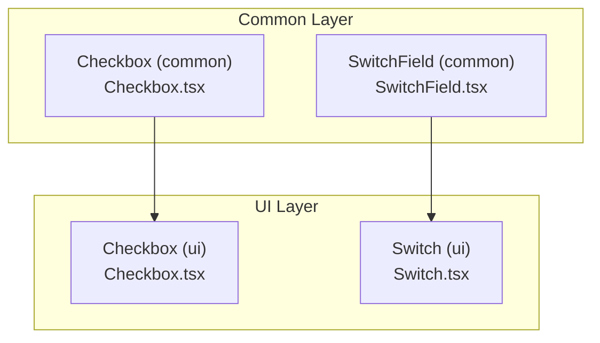
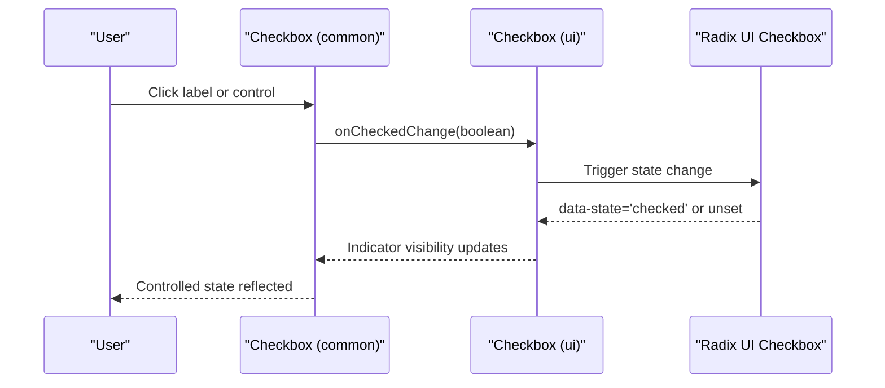
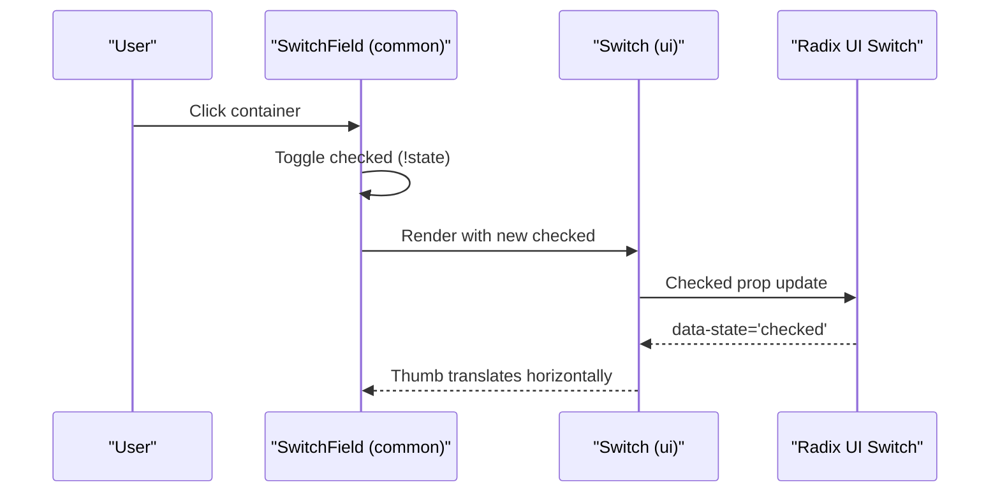
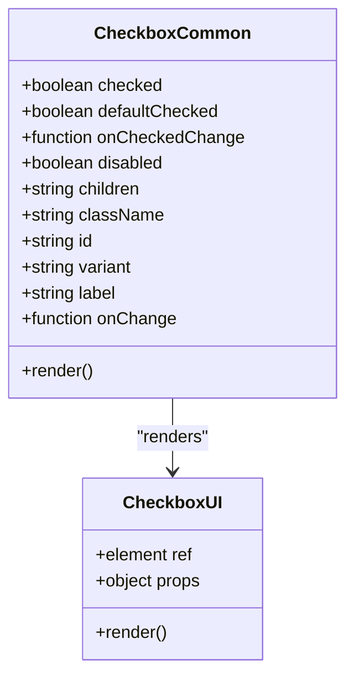
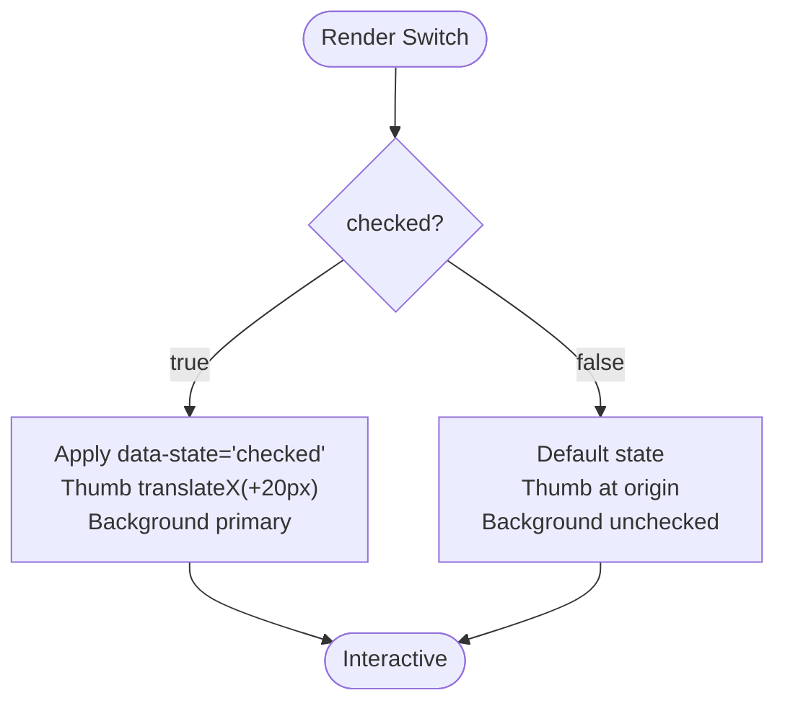
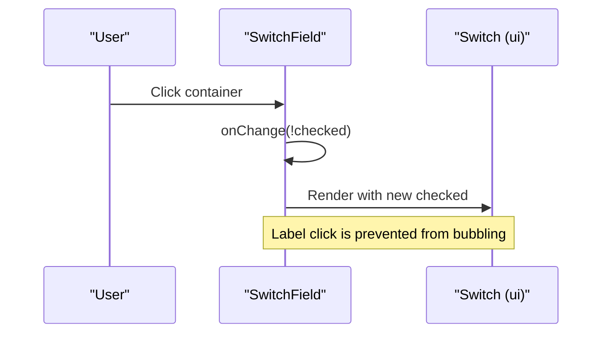
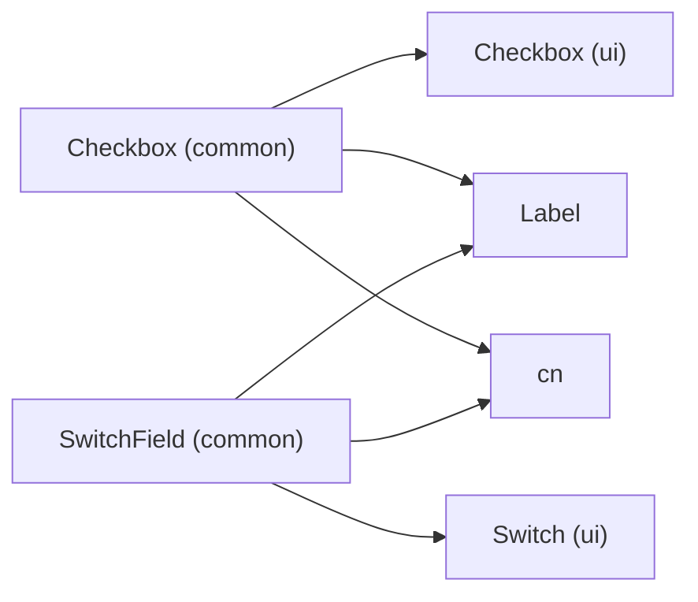

# Checkbox and Switch Components

<cite>
**Referenced Files in This Document**
- [Checkbox.tsx](file://src/components/common/Checkbox/Checkbox.tsx)
- [Checkbox.module.scss](file://src/components/common/Checkbox/Checkbox.module.scss)
- [Checkbox.tsx](file://src/components/ui/Checkbox/Checkbox.tsx)
- [Checkbox.module.scss](file://src/components/ui/Checkbox/Checkbox.module.scss)
- [Switch.tsx](file://src/components/ui/Switch/Switch.tsx)
- [Switch.module.scss](file://src/components/ui/Switch/Switch.module.scss)
- [SwitchField.tsx](file://src/components/common/SwitchField/SwitchField.tsx)
- [SwitchField.module.scss](file://src/components/common/SwitchField/SwitchField.module.scss)
- [FormPrimitives.tsx](file://src/components/common/FormPrimitives/FormPrimitives.tsx)
</cite>

## Table of Contents
1. [Introduction](#introduction)
2. [Project Structure](#project-structure)
3. [Core Components](#core-components)
4. [Architecture Overview](#architecture-overview)
5. [Detailed Component Analysis](#detailed-component-analysis)
6. [Dependency Analysis](#dependency-analysis)
7. [Performance Considerations](#performance-considerations)
8. [Troubleshooting Guide](#troubleshooting-guide)
9. [Conclusion](#conclusion)
10. [Appendices](#appendices)

## Introduction
This document provides comprehensive documentation for Checkbox and Switch components with a focus on boolean input handling and toggle controls. It covers component props, visual design patterns, animations, state management, accessibility, responsive design, and form integration patterns. It also documents indeterminate states, grouped checkboxes, switch positioning, and customization options.

## Project Structure
The Checkbox and Switch components are organized into two layers:
- UI primitives: low-level, reusable components built on Radix UI primitives with Tailwind-style SCSS styling.
- Common wrappers: higher-level components that add labeling, legacy compatibility, and optional compound component patterns.

**Diagram sources**
- [Checkbox.tsx](file://src/components/common/Checkbox/Checkbox.tsx#L1-L113)
- [SwitchField.tsx](file://src/components/common/SwitchField/SwitchField.tsx#L1-L48)
- [Checkbox.tsx](file://src/components/ui/Checkbox/Checkbox.tsx#L1-L28)
- [Switch.tsx](file://src/components/ui/Switch/Switch.tsx#L1-L25)

**Section sources**
- [Checkbox.tsx](file://src/components/common/Checkbox/Checkbox.tsx#L1-L113)
- [SwitchField.tsx](file://src/components/common/SwitchField/SwitchField.tsx#L1-L48)
- [Checkbox.tsx](file://src/components/ui/Checkbox/Checkbox.tsx#L1-L28)
- [Switch.tsx](file://src/components/ui/Switch/Switch.tsx#L1-L25)

## Core Components
- Checkbox (common): Provides controlled/uncontrolled boolean state, label association, variant selection (circle/line), and legacy onChange compatibility. It composes the UI Checkbox and a Label.
- Checkbox (ui): Low-level primitive built on Radix UI with indicator icon and state-driven styles.
- Switch (ui): Low-level toggle primitive built on Radix UI with animated thumb and state-driven background.
- SwitchField (common): Higher-level field wrapper that pairs a label with a Switch and supports click-to-toggle behavior.

Key props summary:
- Checkbox (common):
  - checked, defaultChecked, onCheckedChange, disabled, children, className, id, variant, label, onChange
- Checkbox (ui):
  - Inherits Radix UI Checkbox props (e.g., checked, defaultChecked, onCheckedChange, disabled)
- Switch (ui):
  - Inherits Radix UI Switch props (e.g., checked, defaultChecked, onCheckedChange, disabled)
- SwitchField (common):
  - checked, onChange, label, className, disabled

**Section sources**
- [Checkbox.tsx](file://src/components/common/Checkbox/Checkbox.tsx#L18-L39)
- [Checkbox.tsx](file://src/components/ui/Checkbox/Checkbox.tsx#L9-L25)
- [Switch.tsx](file://src/components/ui/Switch/Switch.tsx#L8-L22)
- [SwitchField.tsx](file://src/components/common/SwitchField/SwitchField.tsx#L6-L12)

## Architecture Overview
The Checkbox and Switch components follow a layered architecture:
- UI primitives encapsulate Radix UI roots and indicators/thumbs.
- Common wrappers add UX concerns like labeling, legacy compatibility, and click-to-toggle behavior.
- Styles are scoped to component modules with shared variables and mixins.

**Diagram sources**
- [Checkbox.tsx](file://src/components/common/Checkbox/Checkbox.tsx#L53-L84)
- [Checkbox.tsx](file://src/components/ui/Checkbox/Checkbox.tsx#L12-L24)

**Diagram sources**
- [SwitchField.tsx](file://src/components/common/SwitchField/SwitchField.tsx#L22-L47)
- [Switch.tsx](file://src/components/ui/Switch/Switch.tsx#L11-L21)

## Detailed Component Analysis

### Checkbox Component
- Purpose: Boolean toggle with label and variant support.
- Props:
  - checked, defaultChecked, onCheckedChange, disabled, children, className, id, variant, label, onChange
- Behavior:
  - Generates a unique id if none provided.
  - Emulates legacy onChange to accept either boolean or event-like payload.
  - Applies circle variant by adding a rounded-full class to the inner UI Checkbox.
- Accessibility:
  - Associates label via htmlFor using the generated or provided id.
  - Inherits focus-visible ring from shared mixins.
- Visual design:
  - Small square or circle indicator with checkmark icon.
  - Transitions for hover/focus and checked state fill.
  - Disabled state reduces opacity and cursor to not-allowed.
- Variants:
  - line: default square corners.
  - circle: adds rounded-full to the control.

**Diagram sources**
- [Checkbox.tsx](file://src/components/common/Checkbox/Checkbox.tsx#L41-L84)
- [Checkbox.tsx](file://src/components/ui/Checkbox/Checkbox.tsx#L9-L25)

**Section sources**
- [Checkbox.tsx](file://src/components/common/Checkbox/Checkbox.tsx#L18-L39)
- [Checkbox.tsx](file://src/components/common/Checkbox/Checkbox.tsx#L53-L84)
- [Checkbox.module.scss](file://src/components/common/Checkbox/Checkbox.module.scss#L3-L24)
- [Checkbox.tsx](file://src/components/ui/Checkbox/Checkbox.tsx#L12-L24)
- [Checkbox.module.scss](file://src/components/ui/Checkbox/Checkbox.module.scss#L4-L46)

### Switch Component
- Purpose: Binary toggle control with animated thumb.
- Props:
  - Inherits Radix UI Switch props (e.g., checked, defaultChecked, onCheckedChange, disabled).
- Behavior:
  - Thumb translates horizontally based on checked state.
  - Background color changes on checked state.
- Accessibility:
  - Inherits focus-visible ring from shared mixins.
- Visual design:
  - Fixed dimensions for root and thumb.
  - Smooth cubic-bezier transitions for background and thumb movement.

**Diagram sources**
- [Switch.tsx](file://src/components/ui/Switch/Switch.tsx#L11-L21)
- [Switch.module.scss](file://src/components/ui/Switch/Switch.module.scss#L4-L53)

**Section sources**
- [Switch.tsx](file://src/components/ui/Switch/Switch.tsx#L8-L22)
- [Switch.module.scss](file://src/components/ui/Switch/Switch.module.scss#L4-L53)

### SwitchField Component
- Purpose: Field wrapper that pairs a label with a Switch and enables click-to-toggle behavior.
- Props:
  - checked, onChange, label, className, disabled
- Behavior:
  - Container onClick toggles checked when not disabled.
  - Label click is prevented from triggering double toggles.
  - Switch receives pointer-events:none to avoid double-triggering.
- Accessibility:
  - Uses shared Label component for proper association.
  - Keyboard users can still operate the Switch directly.

**Diagram sources**
- [SwitchField.tsx](file://src/components/common/SwitchField/SwitchField.tsx#L14-L47)
- [SwitchField.module.scss](file://src/components/common/SwitchField/SwitchField.module.scss#L3-L51)

**Section sources**
- [SwitchField.tsx](file://src/components/common/SwitchField/SwitchField.tsx#L6-L12)
- [SwitchField.tsx](file://src/components/common/SwitchField/SwitchField.tsx#L22-L47)
- [SwitchField.module.scss](file://src/components/common/SwitchField/SwitchField.module.scss#L3-L51)

### Indeterminate States
- Current implementation:
  - Checkbox (ui) uses Radix UI’s data-state='checked' for visual state.
  - No explicit indeterminate prop is exposed in the common Checkbox wrapper.
- Recommendation:
  - To support indeterminate visuals, expose an indeterminate prop in the common wrapper and forward it to the underlying Radix UI component. This would enable a third visual state (e.g., dash or line) while maintaining boolean semantics at the application level.

**Section sources**
- [Checkbox.tsx](file://src/components/ui/Checkbox/Checkbox.tsx#L12-L24)
- [Checkbox.tsx](file://src/components/common/Checkbox/Checkbox.tsx#L67-L74)

### Grouped Checkboxes
- Pattern:
  - Use a shared state array or set to track multiple selections.
  - Render individual Checkbox components with unique ids and controlled checked states.
  - Apply a common container with a fieldset/legend pattern for accessibility.
- Accessibility:
  - Wrap items in a fieldset with a legend.
  - Use aria-describedby for help text and error messages.

**Section sources**
- [FormPrimitives.tsx](file://src/components/common/FormPrimitives/FormPrimitives.tsx#L54-L93)

### Switch Positioning and Layout
- SwitchField provides a horizontal layout with label and switch aligned.
- Use className to customize spacing and alignment as needed.

**Section sources**
- [SwitchField.module.scss](file://src/components/common/SwitchField/SwitchField.module.scss#L3-L28)

### Responsive Design and Touch Targets
- Checkbox:
  - Control size is fixed (1rem x 1rem) with grid centering.
  - Label spacing is 0.5rem; ensure adequate touch target spacing around the control.
- Switch:
  - Root dimensions are fixed (50px x 30px), suitable for touch targets.
  - Thumb size and translation are proportionally designed for easy activation.
- Recommendations:
  - Ensure minimum 44px touch targets for mobile.
  - Add extra padding/margins around controls for dense forms.

**Section sources**
- [Checkbox.module.scss](file://src/components/ui/Checkbox/Checkbox.module.scss#L10-L12)
- [Switch.module.scss](file://src/components/ui/Switch/Switch.module.scss#L6-L7)

### Cross-Platform Consistency
- Both components rely on Radix UI primitives, ensuring consistent keyboard behavior and ARIA attributes across platforms.
- Shared focus-ring mixin ensures consistent focus styles.

**Section sources**
- [Checkbox.module.scss](file://src/components/ui/Checkbox/Checkbox.module.scss#L21)
- [Switch.module.scss](file://src/components/ui/Switch/Switch.module.scss#L17)

### Form Integration and Validation
- Checkbox:
  - Use controlled props (checked + onCheckedChange) for form state.
  - Combine with FormPrimitives.Field to attach labels, help text, and error messages.
- Switch:
  - Use SwitchField for labeled toggles in forms.
  - Pair with validation libraries by passing error text to Field.description or errorMessage.
- Example patterns:
  - Group multiple checkboxes under a single Field with a legend.
  - Use onChange handlers to update form state and trigger validation.

**Section sources**
- [FormPrimitives.tsx](file://src/components/common/FormPrimitives/FormPrimitives.tsx#L54-L93)
- [SwitchField.tsx](file://src/components/common/SwitchField/SwitchField.tsx#L14-L47)

### Accessibility Features
- ARIA and keyboard:
  - Radix UI primitives provide ARIA attributes and keyboard navigation out-of-the-box.
  - Focus ring is applied via shared mixins for visible focus states.
- Screen reader support:
  - Label association via htmlFor ensures screen readers announce labels.
  - Disabled states reduce opacity and cursor to indicate non-interactive state.
- Recommendations:
  - Provide concise labels and optional help text.
  - Use Field.description for contextual hints; errorMessage for validation feedback.

**Section sources**
- [Checkbox.tsx](file://src/components/common/Checkbox/Checkbox.tsx#L75-L82)
- [Checkbox.module.scss](file://src/components/common/Checkbox/Checkbox.module.scss#L16-L20)
- [Checkbox.module.scss](file://src/components/ui/Checkbox/Checkbox.module.scss#L24-L27)
- [Switch.module.scss](file://src/components/ui/Switch/Switch.module.scss#L20-L23)

### Animation and Visual Feedback
- Checkbox:
  - Transition for hover/focus and checked fill.
  - Indicator icon uses a fixed size and stroke width.
- Switch:
  - Background color transition and thumb translateX with cubic-bezier timing.
- Customization:
  - Adjust transition duration and easing in module styles.
  - Modify sizes by overriding width/height and padding.

**Section sources**
- [Checkbox.module.scss](file://src/components/ui/Checkbox/Checkbox.module.scss#L18)
- [Switch.module.scss](file://src/components/ui/Switch/Switch.module.scss#L13)
- [Switch.module.scss](file://src/components/ui/Switch/Switch.module.scss#L46)

### State Management Approaches
- Controlled vs uncontrolled:
  - Checkbox supports both checked and defaultChecked for controlled/uncontrolled usage.
  - SwitchField manages state externally and passes checked to Switch.
- Compound component pattern:
  - Checkbox exposes Circle and Line variants as nested components for ergonomic usage.

**Section sources**
- [Checkbox.tsx](file://src/components/common/Checkbox/Checkbox.tsx#L20-L22)
- [Checkbox.tsx](file://src/components/common/Checkbox/Checkbox.tsx#L108-L112)

## Dependency Analysis
- Checkbox (common) depends on:
  - Checkbox (ui) for the primitive control.
  - Label for accessible labeling.
  - cn for conditional class merging.
- SwitchField depends on:
  - Switch (ui) for the toggle control.
  - Label for accessible labeling.
  - cn for conditional class merging.

**Diagram sources**
- [Checkbox.tsx](file://src/components/common/Checkbox/Checkbox.tsx#L1-L8)
- [SwitchField.tsx](file://src/components/common/SwitchField/SwitchField.tsx#L1-L4)

**Section sources**
- [Checkbox.tsx](file://src/components/common/Checkbox/Checkbox.tsx#L1-L8)
- [SwitchField.tsx](file://src/components/common/SwitchField/SwitchField.tsx#L1-L4)

## Performance Considerations
- Prefer controlled components for predictable rendering and fewer re-renders.
- Avoid unnecessary re-renders by memoizing handlers and props.
- Keep label text concise to minimize layout thrashing.
- Use fixed sizes for Switch to prevent layout shifts during animations.

## Troubleshooting Guide
- Checkbox not reflecting state:
  - Ensure checked is passed to the common Checkbox wrapper; otherwise, defaultChecked is used only initially.
- Legacy onChange expectations:
  - The common wrapper forwards boolean values to both onCheckedChange and optional onChange for backward compatibility.
- Switch not animating:
  - Verify data-state='checked' is present on the root element and CSS transitions are not overridden.
- Label not focusing control:
  - Confirm id is set or generated and htmlFor matches the control id.

**Section sources**
- [Checkbox.tsx](file://src/components/common/Checkbox/Checkbox.tsx#L53-L60)
- [Switch.tsx](file://src/components/ui/Switch/Switch.tsx#L11-L21)

## Conclusion
Checkbox and Switch components provide robust, accessible, and visually consistent boolean controls. The common wrappers offer ergonomic APIs and legacy compatibility, while the UI primitives ensure cross-platform consistency and strong accessibility defaults. By leveraging Field wrappers and shared styles, teams can build responsive, validated forms with consistent behavior across devices.

## Appendices
- Customization checklist:
  - Adjust sizes in module styles for brand guidelines.
  - Override transitions and easing for product-specific feel.
  - Use className to integrate with layout systems (e.g., spacing, alignment).
- Best practices:
  - Always pair labels with controls for accessibility.
  - Use Field for consistent spacing and messaging.
  - Test keyboard navigation and screen reader announcements.