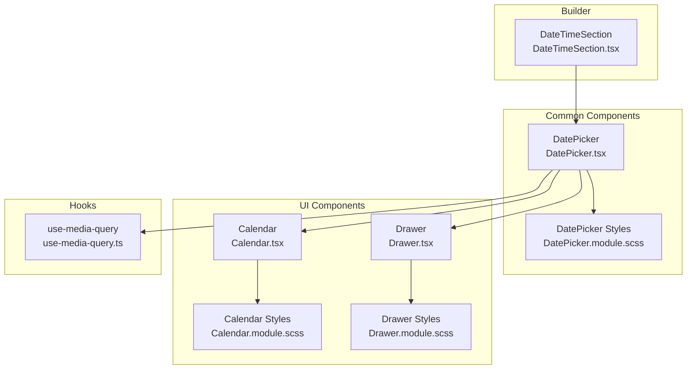
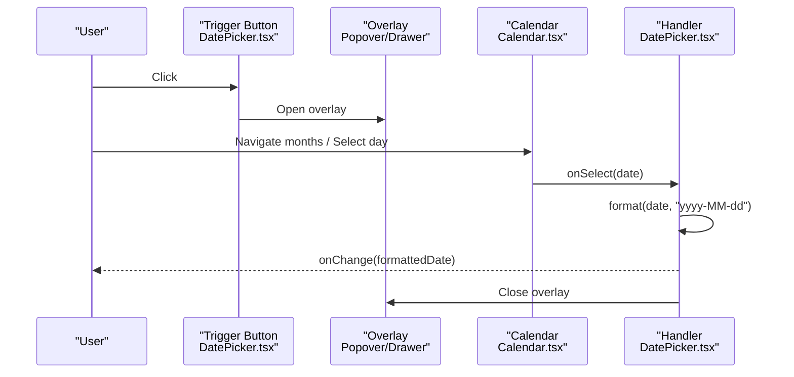
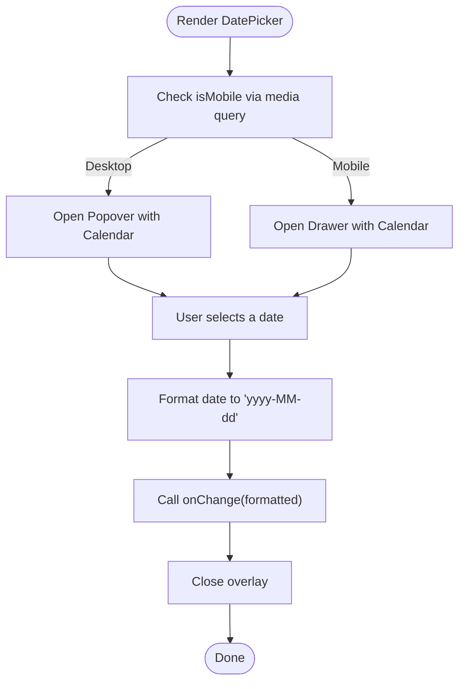
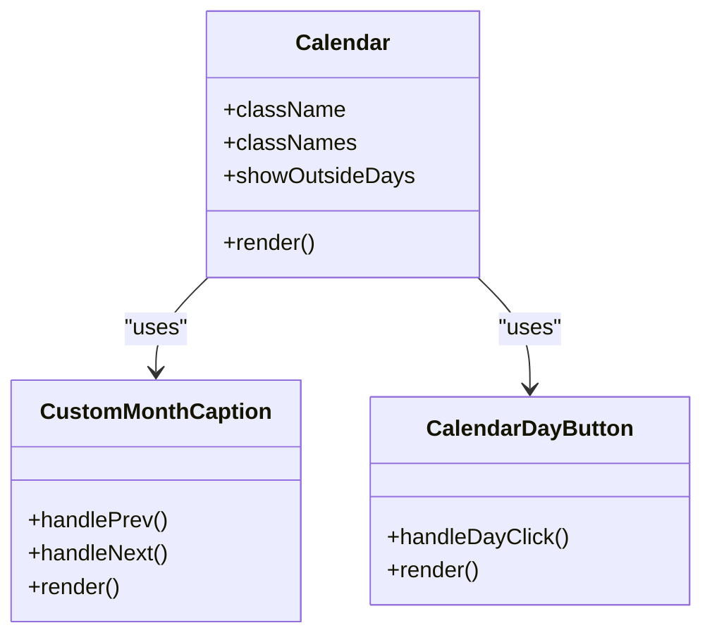
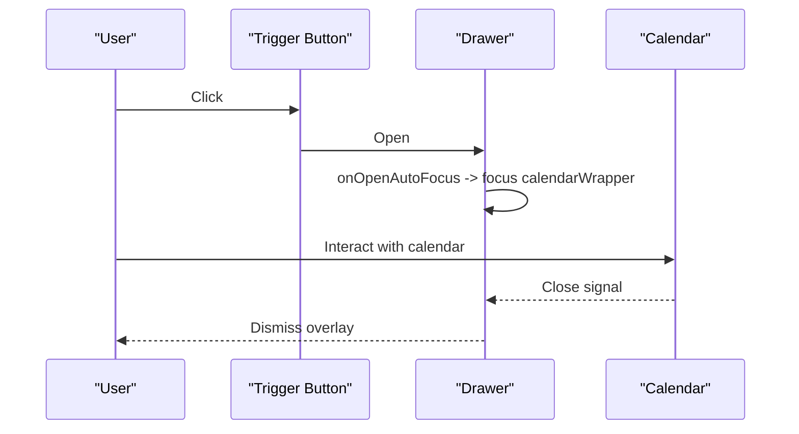
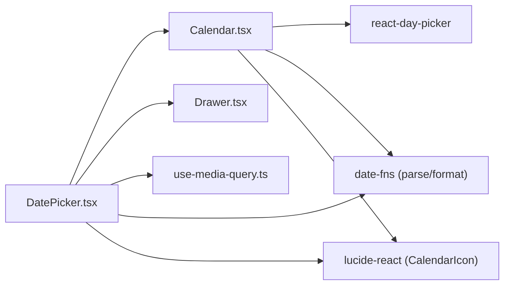

# DatePicker Component

<cite>
**Referenced Files in This Document**
- [DatePicker.tsx](file://src/components/common/DatePicker/DatePicker.tsx)
- [DatePicker.module.scss](file://src/components/common/DatePicker/DatePicker.module.scss)
- [index.ts](file://src/components/common/DatePicker/index.ts)
- [Calendar.tsx](file://src/components/ui/Calendar/Calendar.tsx)
- [Calendar.module.scss](file://src/components/ui/Calendar/Calendar.module.scss)
- [Drawer.tsx](file://src/components/ui/Drawer/Drawer.tsx)
- [Drawer.module.scss](file://src/components/ui/Drawer/Drawer.module.scss)
- [DateTimeSection.tsx](file://src/components/builder/sections/DateTimeSection.tsx)
- [use-media-query.ts](file://src/hooks/use-media-query.ts)
- [format.ts](file://src/lib/utils/format.ts)
- [globals.scss](file://src/app/globals.scss)
- [useAccessibility.tsx](file://src/hooks/useAccessibility.tsx)
</cite>

## Table of Contents
1. [Introduction](#introduction)
2. [Project Structure](#project-structure)
3. [Core Components](#core-components)
4. [Architecture Overview](#architecture-overview)
5. [Detailed Component Analysis](#detailed-component-analysis)
6. [Dependency Analysis](#dependency-analysis)
7. [Performance Considerations](#performance-considerations)
8. [Troubleshooting Guide](#troubleshooting-guide)
9. [Conclusion](#conclusion)

## Introduction
This document provides comprehensive documentation for the DatePicker component used for date selection and calendar interaction. It covers component props, calendar interface implementation, date formatting patterns, timezone handling, responsive layout for desktop and mobile, touch interactions, keyboard navigation, accessibility features, browser compatibility, performance optimizations, and customization options.

## Project Structure
The DatePicker component is implemented as a reusable UI primitive located under the common components directory. It integrates with a shared Calendar component and a Drawer-based mobile overlay. The component is consumed within the builder section for selecting event dates.

**Diagram sources**
- [DatePicker.tsx](file://src/components/common/DatePicker/DatePicker.tsx#L1-L116)
- [Calendar.tsx](file://src/components/ui/Calendar/Calendar.tsx#L1-L174)
- [Drawer.tsx](file://src/components/ui/Drawer/Drawer.tsx#L1-L132)
- [use-media-query.ts](file://src/hooks/use-media-query.ts#L1-L16)
- [DateTimeSection.tsx](file://src/components/builder/sections/DateTimeSection.tsx#L1-L95)

**Section sources**
- [DatePicker.tsx](file://src/components/common/DatePicker/DatePicker.tsx#L1-L116)
- [Calendar.tsx](file://src/components/ui/Calendar/Calendar.tsx#L1-L174)
- [Drawer.tsx](file://src/components/ui/Drawer/Drawer.tsx#L1-L132)
- [use-media-query.ts](file://src/hooks/use-media-query.ts#L1-L16)
- [DateTimeSection.tsx](file://src/components/builder/sections/DateTimeSection.tsx#L1-L95)

## Core Components
- DatePicker: A controlled input that opens either a popover (desktop) or a drawer (mobile) containing a Calendar for single date selection. It formats the selected date as an ISO-like string and supports Korean localization.
- Calendar: A styled wrapper around react-day-picker with custom month caption, navigation buttons, and day button behavior. It applies Korean locale and custom CSS modules.
- Drawer: A mobile-first overlay component used to present the calendar on small screens with a native slide-up presentation.

Key props and behaviors:
- value: Accepts a string date in a specific internal format and displays it localized.
- onChange: Receives a string date in the same internal format.
- className and placeholder: Optional styling and placeholder text.
- Locale: Uses Korean locale for both display and navigation labels.
- Responsive behavior: Uses a media query hook to switch between Popover and Drawer.

**Section sources**
- [DatePicker.tsx](file://src/components/common/DatePicker/DatePicker.tsx#L22-L42)
- [Calendar.tsx](file://src/components/ui/Calendar/Calendar.tsx#L14-L53)
- [Drawer.tsx](file://src/components/ui/Drawer/Drawer.tsx#L8-L16)

## Architecture Overview
The DatePicker composes a trigger button and a calendar overlay. On desktop, a Popover hosts the Calendar; on mobile, a Drawer does so. The Calendar delegates navigation and day selection to react-day-picker while applying custom styling and behavior.

**Diagram sources**
- [DatePicker.tsx](file://src/components/common/DatePicker/DatePicker.tsx#L37-L42)
- [Calendar.tsx](file://src/components/ui/Calendar/Calendar.tsx#L116-L171)

## Detailed Component Analysis

### DatePicker Component
- Purpose: Single date picker with responsive popover/drawer overlays and Korean localization.
- Props:
  - value: string (internal date format)
  - onChange: (value: string) => void
  - className?: string
  - placeholder?: string
- Behavior:
  - Parses the incoming string to a Date object using a strict parser.
  - Formats the display using a localized pattern.
  - Uses a media query to decide desktop vs mobile rendering.
  - On desktop: Popover with Calendar.
  - On mobile: Drawer with Calendar and focus management.
  - Closes the overlay after a selection is made.

**Diagram sources**
- [DatePicker.tsx](file://src/components/common/DatePicker/DatePicker.tsx#L29-L114)

**Section sources**
- [DatePicker.tsx](file://src/components/common/DatePicker/DatePicker.tsx#L22-L114)
- [DatePicker.module.scss](file://src/components/common/DatePicker/DatePicker.module.scss#L1-L72)
- [use-media-query.ts](file://src/hooks/use-media-query.ts#L1-L16)

### Calendar Component
- Purpose: Styled calendar built on react-day-picker with custom navigation and day button behavior.
- Features:
  - Korean locale applied globally.
  - Custom month caption with previous/next buttons and aria labels.
  - Day buttons adjust focus when marked as focused.
  - Outside days (previous/next month) click navigates instead of selecting.
  - Special styling for Sundays and Saturdays.
  - Disabled state and today indicator.

**Diagram sources**
- [Calendar.tsx](file://src/components/ui/Calendar/Calendar.tsx#L14-L171)

**Section sources**
- [Calendar.tsx](file://src/components/ui/Calendar/Calendar.tsx#L14-L171)
- [Calendar.module.scss](file://src/components/ui/Calendar/Calendar.module.scss#L1-L242)

### Drawer Component (Mobile Overlay)
- Purpose: Provides a native-like slide-up overlay on mobile devices.
- Features:
  - Scales background optionally.
  - Includes a handle for drag gestures.
  - Focus management to move focus into the drawer on open.
  - Scroll area for content.

**Diagram sources**
- [DatePicker.tsx](file://src/components/common/DatePicker/DatePicker.tsx#L77-L114)
- [Drawer.tsx](file://src/components/ui/Drawer/Drawer.tsx#L37-L56)

**Section sources**
- [Drawer.tsx](file://src/components/ui/Drawer/Drawer.tsx#L1-L132)
- [Drawer.module.scss](file://src/components/ui/Drawer/Drawer.module.scss#L1-L89)

### Usage Example in Builder
- The DatePicker is integrated into the DateTimeSection for selecting an event date and pairing with a time picker.
- It updates the invitation store’s date field upon selection.

**Section sources**
- [DateTimeSection.tsx](file://src/components/builder/sections/DateTimeSection.tsx#L40-L61)

### Date Formatting and Localization
- Internal storage format: The component expects and emits a date string in a specific internal format.
- Display formatting: Uses a localized pattern for Korean display.
- Utility functions: Additional formatting helpers exist for preview and display elsewhere in the app.

**Section sources**
- [DatePicker.tsx](file://src/components/common/DatePicker/DatePicker.tsx#L34-L53)
- [Calendar.tsx](file://src/components/ui/Calendar/Calendar.tsx#L79-L83)
- [format.ts](file://src/lib/utils/format.ts#L5-L40)

### Accessibility and Screen Reader Support
- Drawer overlay sets aria-describedby to undefined and manages focus into the calendar wrapper to avoid aria-hidden warnings.
- Drawer content sets tabIndex to -1 to enable focus targeting.
- Calendar month caption buttons include aria-label attributes for navigation.
- Global styles define motion and interaction characteristics suitable for touch interfaces.

**Section sources**
- [DatePicker.tsx](file://src/components/common/DatePicker/DatePicker.tsx#L80-L110)
- [Drawer.tsx](file://src/components/ui/Drawer/Drawer.tsx#L37-L56)
- [Calendar.tsx](file://src/components/ui/Calendar/Calendar.tsx#L88-L110)
- [globals.scss](file://src/app/globals.scss#L30-L92)

### Responsive Layout and Mobile Touch Interactions
- Desktop: Popover overlay aligned to the trigger.
- Mobile: Drawer slides up with a handle and scrollable content area.
- Navigation: Outside days click triggers month navigation instead of selection.
- Touch-friendly buttons with hover and active states.

**Section sources**
- [DatePicker.module.scss](file://src/components/common/DatePicker/DatePicker.module.scss#L46-L67)
- [Calendar.module.scss](file://src/components/ui/Calendar/Calendar.module.scss#L64-L96)
- [Calendar.tsx](file://src/components/ui/Calendar/Calendar.tsx#L135-L150)

### Keyboard Navigation Support
- CalendarDayButton ensures focused days receive programmatic focus.
- DrawerContent sets tabIndex to -1 to allow focus management into the calendar wrapper.
- Global body styles improve touch interaction and reduce unwanted highlights.

**Section sources**
- [Calendar.tsx](file://src/components/ui/Calendar/Calendar.tsx#L121-L129)
- [Drawer.tsx](file://src/components/ui/Drawer/Drawer.tsx#L46-L50)
- [globals.scss](file://src/app/globals.scss#L50-L87)

### Browser Compatibility and Performance
- SSR-safe media queries via a dedicated hook.
- Minimal re-renders: Controlled component with local state only for overlay visibility.
- Efficient rendering: Calendar uses fixed weeks and hides default nav controls.

**Section sources**
- [use-media-query.ts](file://src/hooks/use-media-query.ts#L1-L16)
- [Calendar.tsx](file://src/components/ui/Calendar/Calendar.tsx#L38-L52)

### Customization Options
- Styling: Extensive SCSS modules allow theme-level customization of colors, typography, spacing, and animations.
- Behavior: Calendar exposes classNames and props to customize appearance and interaction.
- Locale: The component uses Korean locale; to adapt to other locales, update the locale import and related formatting.

**Section sources**
- [DatePicker.module.scss](file://src/components/common/DatePicker/DatePicker.module.scss#L1-L72)
- [Calendar.module.scss](file://src/components/ui/Calendar/Calendar.module.scss#L1-L242)
- [Calendar.tsx](file://src/components/ui/Calendar/Calendar.tsx#L43-L49)

## Dependency Analysis
The DatePicker depends on:
- Calendar for the interactive calendar UI.
- Drawer for mobile presentation.
- use-media-query for responsive behavior.
- date-fns for parsing and formatting.
- lucide-react icons for visual cues.

**Diagram sources**
- [DatePicker.tsx](file://src/components/common/DatePicker/DatePicker.tsx#L3-L11)
- [Calendar.tsx](file://src/components/ui/Calendar/Calendar.tsx#L8-L11)

**Section sources**
- [DatePicker.tsx](file://src/components/common/DatePicker/DatePicker.tsx#L1-L21)
- [Calendar.tsx](file://src/components/ui/Calendar/Calendar.tsx#L1-L12)

## Performance Considerations
- Parsing and formatting: The component parses the incoming value and formats selections using date-fns. Keep the value prop synchronized to avoid repeated conversions.
- Rendering: Calendar renders a fixed number of weeks and hides default navigation to minimize DOM overhead.
- Media queries: The hook subscribes to media query changes efficiently without causing layout thrashing.
- Mobile overlay: Drawer content is only mounted when open, reducing memory footprint on small screens.

[No sources needed since this section provides general guidance]

## Troubleshooting Guide
- Selected date not updating:
  - Ensure the parent passes a value in the expected internal format and calls onChange with a properly formatted string.
- Calendar not visible on mobile:
  - Verify the overlay is open and focus is moved into the calendar wrapper on open.
- Incorrect date display:
  - Confirm the locale is set to Korean and the display format matches expectations.
- Keyboard navigation issues:
  - Ensure the calendar wrapper receives focus on drawer open and that focused days are programmatically focused.

**Section sources**
- [DatePicker.tsx](file://src/components/common/DatePicker/DatePicker.tsx#L34-L42)
- [Calendar.tsx](file://src/components/ui/Calendar/Calendar.tsx#L121-L129)
- [Drawer.tsx](file://src/components/ui/Drawer/Drawer.tsx#L37-L56)

## Conclusion
The DatePicker component offers a robust, accessible, and responsive solution for date selection. It integrates seamlessly with the Calendar and Drawer components, supports Korean localization, and provides a clean API for consumers. Its design emphasizes usability across devices, accessibility, and maintainability through modular styling and clear separation of concerns.