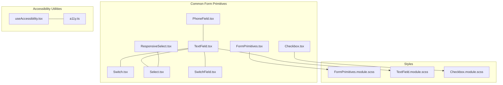
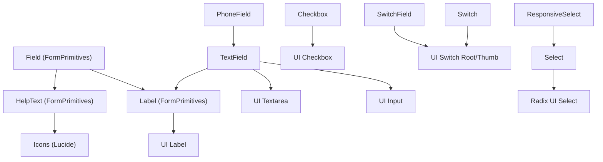
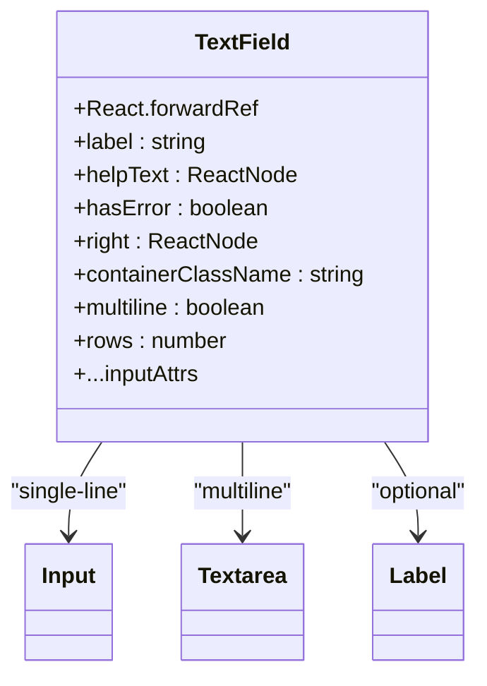
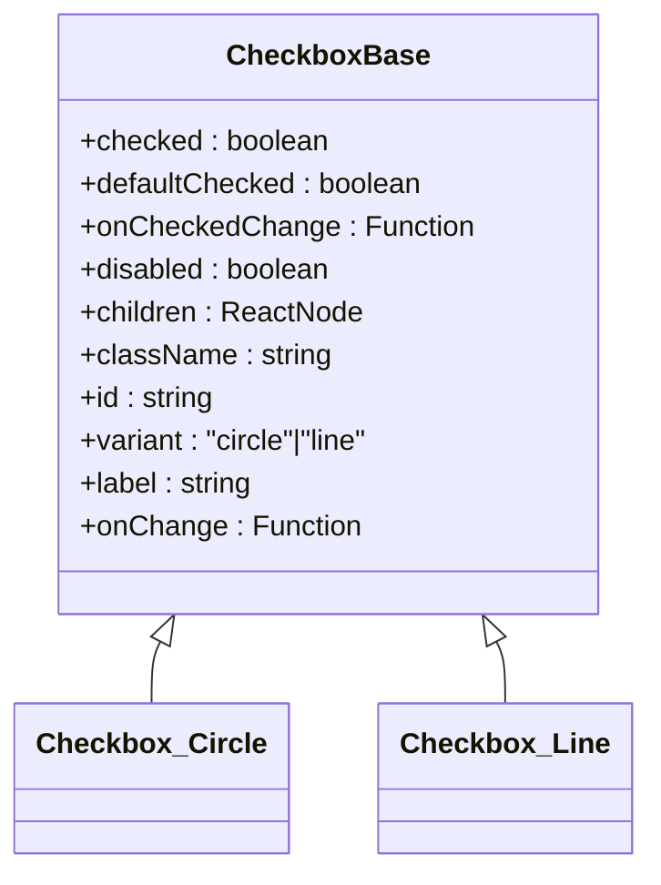
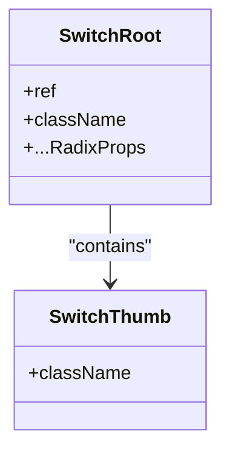
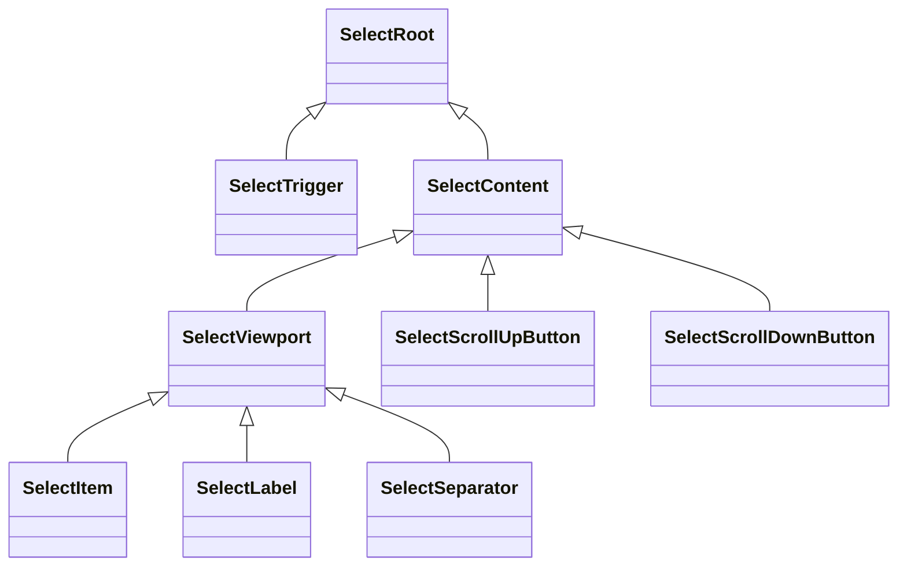
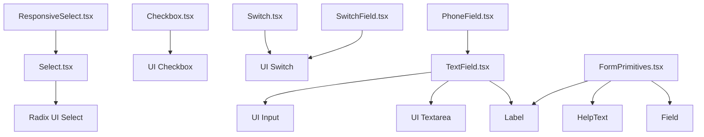

# Form Primitives

<cite>
**Referenced Files in This Document**
- [FormPrimitives.tsx](file://src/components/common/FormPrimitives/FormPrimitives.tsx)
- [FormPrimitives.module.scss](file://src/components/common/FormPrimitives/FormPrimitives.module.scss)
- [TextField.tsx](file://src/components/common/TextField/TextField.tsx)
- [TextField.module.scss](file://src/components/common/TextField/TextField.module.scss)
- [Checkbox.tsx](file://src/components/common/Checkbox/Checkbox.tsx)
- [Checkbox.module.scss](file://src/components/common/Checkbox/Checkbox.module.scss)
- [Switch.tsx](file://src/components/ui/Switch/Switch.tsx)
- [Select.tsx](file://src/components/ui/Select/Select.tsx)
- [SwitchField.tsx](file://src/components/common/SwitchField/SwitchField.tsx)
- [ResponsiveSelect.tsx](file://src/components/common/ResponsiveSelect/ResponsiveSelect.tsx)
- [PhoneField.tsx](file://src/components/common/PhoneField/PhoneField.tsx)
- [a11y.ts](file://src/lib/a11y.ts)
- [useAccessibility.tsx](file://src/hooks/useAccessibility.tsx)
- [accessibility.test.ts](file://src/test/accessibility.test.ts)
</cite>

## Table of Contents
1. [Introduction](#introduction)
2. [Project Structure](#project-structure)
3. [Core Components](#core-components)
4. [Architecture Overview](#architecture-overview)
5. [Detailed Component Analysis](#detailed-component-analysis)
6. [Dependency Analysis](#dependency-analysis)
7. [Performance Considerations](#performance-considerations)
8. [Troubleshooting Guide](#troubleshooting-guide)
9. [Conclusion](#conclusion)
10. [Appendices](#appendices)

## Introduction
This document describes the form primitives library used to build reusable, accessible, and responsive input components. It focuses on the foundational building blocks: Label, HelpText, Field, SectionContainer, OptionGroup, and the concrete inputs: TextField, Checkbox, Switch, and Select. It also covers validation patterns, error messaging, accessibility features, responsive design, and integration patterns for form submission workflows.

## Project Structure
The form primitives are organized under a shared common components directory with dedicated modules for each primitive and supporting styles. The primitives integrate with UI primitives from the application’s UI toolkit and leverage shared SCSS modules for consistent spacing and typography.

**Diagram sources**
- [FormPrimitives.tsx](file://src/components/common/FormPrimitives/FormPrimitives.tsx#L1-L119)
- [TextField.tsx](file://src/components/common/TextField/TextField.tsx#L1-L77)
- [Checkbox.tsx](file://src/components/common/Checkbox/Checkbox.tsx#L1-L113)
- [Switch.tsx](file://src/components/ui/Switch/Switch.tsx#L1-L25)
- [Select.tsx](file://src/components/ui/Select/Select.tsx#L1-L181)
- [SwitchField.tsx](file://src/components/common/SwitchField/SwitchField.tsx#L1-L48)
- [ResponsiveSelect.tsx](file://src/components/common/ResponsiveSelect/ResponsiveSelect.tsx#L1-L182)
- [PhoneField.tsx](file://src/components/common/PhoneField/PhoneField.tsx#L1-L40)
- [FormPrimitives.module.scss](file://src/components/common/FormPrimitives/FormPrimitives.module.scss#L1-L80)
- [TextField.module.scss](file://src/components/common/TextField/TextField.module.scss#L1-L47)
- [Checkbox.module.scss](file://src/components/common/Checkbox/Checkbox.module.scss#L1-L25)
- [a11y.ts](file://src/lib/a11y.ts#L1-L20)
- [useAccessibility.tsx](file://src/hooks/useAccessibility.tsx#L1-L77)

**Section sources**
- [FormPrimitives.tsx](file://src/components/common/FormPrimitives/FormPrimitives.tsx#L1-L119)
- [TextField.tsx](file://src/components/common/TextField/TextField.tsx#L1-L77)
- [Checkbox.tsx](file://src/components/common/Checkbox/Checkbox.tsx#L1-L113)
- [Switch.tsx](file://src/components/ui/Switch/Switch.tsx#L1-L25)
- [Select.tsx](file://src/components/ui/Select/Select.tsx#L1-L181)
- [SwitchField.tsx](file://src/components/common/SwitchField/SwitchField.tsx#L1-L48)
- [ResponsiveSelect.tsx](file://src/components/common/ResponsiveSelect/ResponsiveSelect.tsx#L1-L182)
- [PhoneField.tsx](file://src/components/common/PhoneField/PhoneField.tsx#L1-L40)
- [FormPrimitives.module.scss](file://src/components/common/FormPrimitives/FormPrimitives.module.scss#L1-L80)
- [TextField.module.scss](file://src/components/common/TextField/TextField.module.scss#L1-L47)
- [Checkbox.module.scss](file://src/components/common/Checkbox/Checkbox.module.scss#L1-L25)
- [a11y.ts](file://src/lib/a11y.ts#L1-L20)
- [useAccessibility.tsx](file://src/hooks/useAccessibility.tsx#L1-L77)

## Core Components
This section documents the base form primitives and their roles in composing forms.

- Label: Renders a label with optional required indicator and forwards props to the underlying UI label component.
- HelpText: Provides contextual help text with info or warning variants and optional icons.
- Field: A form group container that composes label, child input(s), description, and error messaging.
- SectionContainer: Wraps groups of fields for consistent spacing and layout.
- OptionGroup: Groups related options for radio buttons or similar controls.

These primitives standardize labeling, spacing, and error presentation across the application.

**Section sources**
- [FormPrimitives.tsx](file://src/components/common/FormPrimitives/FormPrimitives.tsx#L9-L20)
- [FormPrimitives.tsx](file://src/components/common/FormPrimitives/FormPrimitives.tsx#L24-L52)
- [FormPrimitives.tsx](file://src/components/common/FormPrimitives/FormPrimitives.tsx#L56-L93)
- [FormPrimitives.tsx](file://src/components/common/FormPrimitives/FormPrimitives.tsx#L97-L108)
- [FormPrimitives.tsx](file://src/components/common/FormPrimitives/FormPrimitives.tsx#L112-L118)

## Architecture Overview
The form primitives layer builds on UI primitives and shared styles. Inputs like TextField delegate to UI Input/Textarea and expose consistent props for labels, help text, and error states. Validation and accessibility utilities are integrated at the component and hook level.

**Diagram sources**
- [FormPrimitives.tsx](file://src/components/common/FormPrimitives/FormPrimitives.tsx#L9-L93)
- [TextField.tsx](file://src/components/common/TextField/TextField.tsx#L1-L77)
- [Checkbox.tsx](file://src/components/common/Checkbox/Checkbox.tsx#L1-L113)
- [Switch.tsx](file://src/components/ui/Switch/Switch.tsx#L1-L25)
- [Select.tsx](file://src/components/ui/Select/Select.tsx#L1-L181)
- [SwitchField.tsx](file://src/components/common/SwitchField/SwitchField.tsx#L1-L48)
- [ResponsiveSelect.tsx](file://src/components/common/ResponsiveSelect/ResponsiveSelect.tsx#L1-L182)
- [PhoneField.tsx](file://src/components/common/PhoneField/PhoneField.tsx#L1-L40)

## Detailed Component Analysis

### TextField
TextField is a composite input that supports single-line and multi-line modes, optional right-side adornments, and integrated label/help/error presentation. It delegates to UI Input or UI Textarea depending on multiline prop and applies error styling when hasError is true.

Key behaviors:
- Accepts standard input attributes via forwardRef.
- Applies error styles and label color when hasError is true.
- Supports multiline via a textarea wrapper.
- Right adornment is positioned absolutely and disabled pointer events.

Props summary:
- label: string | undefined
- helpText: ReactNode | undefined
- hasError: boolean | undefined
- right: ReactNode | undefined
- containerClassName: string | undefined
- multiline: boolean | undefined
- rows: number | undefined
- Inherits standard input attributes (id, name, disabled, onFocus, onBlur, etc.)

Styling highlights:
- Right adornment padding and absolute positioning.
- Error state border and focus-visible ring replacement.
- Help text color adapts to error state.

Integration patterns:
- Combine with Field to provide label, description, and error messaging.
- Use with PhoneField for phone number formatting and icon.

**Section sources**
- [TextField.tsx](file://src/components/common/TextField/TextField.tsx#L8-L77)
- [TextField.module.scss](file://src/components/common/TextField/TextField.module.scss#L1-L47)

#### TextField Class Diagram

**Diagram sources**
- [TextField.tsx](file://src/components/common/TextField/TextField.tsx#L18-L77)

### Checkbox
Checkbox exposes a compound component pattern with Circle and Line variants. It supports controlled and uncontrolled states, legacy onChange compatibility, and integrates with a UI Checkbox component. The label is clickable and respects disabled state.

Props summary:
- checked: boolean | undefined
- defaultChecked: boolean | undefined
- onCheckedChange: (boolean) => void | undefined
- disabled: boolean | undefined
- children: ReactNode | undefined
- className: string | undefined
- id: string | undefined
- variant: 'circle' | 'line' | undefined
- label: string | undefined
- onChange: (boolean) => void | undefined

Behavior:
- Generates a unique id if none provided.
- Emulates legacy onChange signatures for backward compatibility.
- Applies circle variant class for rounded visuals.

**Section sources**
- [Checkbox.tsx](file://src/components/common/Checkbox/Checkbox.tsx#L18-L113)
- [Checkbox.module.scss](file://src/components/common/Checkbox/Checkbox.module.scss#L1-L25)

#### Checkbox Class Diagram

**Diagram sources**
- [Checkbox.tsx](file://src/components/common/Checkbox/Checkbox.tsx#L41-L113)

### Switch
Switch is a thin wrapper around Radix UI’s Switch, exposing a forwardRef root and thumb. It is used standalone or within SwitchField for labeled toggles.

Props summary:
- Inherits all Radix Switch primitive props (checked, onCheckedChange, disabled, etc.).

**Section sources**
- [Switch.tsx](file://src/components/ui/Switch/Switch.tsx#L8-L24)

#### Switch Class Diagram

**Diagram sources**
- [Switch.tsx](file://src/components/ui/Switch/Switch.tsx#L11-L21)

### Select
Select is a comprehensive wrapper around Radix UI Select, providing Trigger, Content, Item, Label, and Scroll buttons. It manages viewport fading during scroll and integrates icons for chevrons and selection indicators.

Key behaviors:
- Content dynamically computes top/bottom fade based on scroll position.
- Uses ResizeObserver to update state after content changes.
- Portal-based rendering for overlay behavior.

Props summary:
- Select, SelectGroup, SelectValue, SelectTrigger, SelectContent, SelectLabel, SelectItem, SelectSeparator, SelectScrollUpButton, SelectScrollDownButton.

**Section sources**
- [Select.tsx](file://src/components/ui/Select/Select.tsx#L9-L181)

#### Select Class Diagram

**Diagram sources**
- [Select.tsx](file://src/components/ui/Select/Select.tsx#L9-L181)

### SwitchField
SwitchField wraps a Switch with a label and container, enabling click-to-toggle behavior while respecting disabled state. It prevents double-triggering by stopping propagation on label clicks.

Props summary:
- checked: boolean
- onChange: (boolean) => void
- label: string | undefined
- className: string | undefined
- disabled: boolean | undefined

**Section sources**
- [SwitchField.tsx](file://src/components/common/SwitchField/SwitchField.tsx#L6-L48)

### ResponsiveSelect
ResponsiveSelect provides a desktop Select and a mobile Drawer-based picker. On mobile, it centers the selected item in the viewport after opening and supports keyboard navigation with focus management.

Key behaviors:
- Uses media query to switch between desktop and mobile experiences.
- Maintains optimistic value to reflect immediate user selection.
- Scrolls selected item into view on open.
- Focuses the selected or first item on open auto-focus.

Props summary:
- value: T
- options: { label: string; value: T }[]
- onChange: (value: T) => void
- placeholder: string | undefined
- className: string | undefined
- labelClassName: string | undefined
- label: string | undefined
- modalTitle: string

**Section sources**
- [ResponsiveSelect.tsx](file://src/components/common/ResponsiveSelect/ResponsiveSelect.tsx#L31-L182)

### PhoneField
PhoneField is a specialized TextField that formats phone numbers and optionally displays a phone icon on the right side. It intercepts change events to normalize input.

Props summary:
- showIcon: boolean
- Inherits TextField props

Behavior:
- Formats input using a utility function.
- Passes formatted value to parent onChange via a modified event.

**Section sources**
- [PhoneField.tsx](file://src/components/common/PhoneField/PhoneField.tsx#L6-L40)

## Dependency Analysis
The form primitives depend on:
- UI primitives (Input, Textarea, Checkbox, Switch, Select) from the application’s UI toolkit.
- Shared styles for consistent spacing and typography.
- Accessibility utilities for focus management and screen-reader announcements.

**Diagram sources**
- [TextField.tsx](file://src/components/common/TextField/TextField.tsx#L1-L77)
- [Checkbox.tsx](file://src/components/common/Checkbox/Checkbox.tsx#L1-L113)
- [Switch.tsx](file://src/components/ui/Switch/Switch.tsx#L1-L25)
- [Select.tsx](file://src/components/ui/Select/Select.tsx#L1-L181)
- [SwitchField.tsx](file://src/components/common/SwitchField/SwitchField.tsx#L1-L48)
- [ResponsiveSelect.tsx](file://src/components/common/ResponsiveSelect/ResponsiveSelect.tsx#L1-L182)
- [PhoneField.tsx](file://src/components/common/PhoneField/PhoneField.tsx#L1-L40)
- [FormPrimitives.tsx](file://src/components/common/FormPrimitives/FormPrimitives.tsx#L1-L119)

**Section sources**
- [TextField.tsx](file://src/components/common/TextField/TextField.tsx#L1-L77)
- [Checkbox.tsx](file://src/components/common/Checkbox/Checkbox.tsx#L1-L113)
- [Switch.tsx](file://src/components/ui/Switch/Switch.tsx#L1-L25)
- [Select.tsx](file://src/components/ui/Select/Select.tsx#L1-L181)
- [SwitchField.tsx](file://src/components/common/SwitchField/SwitchField.tsx#L1-L48)
- [ResponsiveSelect.tsx](file://src/components/common/ResponsiveSelect/ResponsiveSelect.tsx#L1-L182)
- [PhoneField.tsx](file://src/components/common/PhoneField/PhoneField.tsx#L1-L40)
- [FormPrimitives.tsx](file://src/components/common/FormPrimitives/FormPrimitives.tsx#L1-L119)

## Performance Considerations
- Minimize re-renders by controlling inputs with stable refs and avoiding unnecessary prop churn.
- Use optimistic updates (as seen in ResponsiveSelect) to improve perceived performance.
- Defer heavy computations in onChange handlers; consider throttling for real-time formatting.
- Prefer composition over deep nesting to keep render trees shallow.

## Troubleshooting Guide
Common issues and resolutions:
- Label not associated with input: Ensure id/name is passed to TextField so Label htmlFor matches.
- Error state not visible: Confirm hasError is set and styles apply error borders and focus rings.
- Checkbox not updating: Verify controlled vs uncontrolled usage and that onCheckedChange is supplied.
- Select dropdown not scrolling properly: Check viewport refs and scroll handlers are attached.
- Mobile drawer not focusing selected item: Confirm open state and refs are initialized before scroll-to-center logic.

Accessibility checks:
- Verify focus trap activation and tab order using focusable selectors.
- Announce dynamic messages to screen readers using live region utilities.
- Ensure skip links and ARIA landmarks are present in complex forms.

**Section sources**
- [a11y.ts](file://src/lib/a11y.ts#L1-L20)
- [useAccessibility.tsx](file://src/hooks/useAccessibility.tsx#L22-L77)
- [accessibility.test.ts](file://src/test/accessibility.test.ts#L1-L112)

## Conclusion
The form primitives library provides a cohesive, accessible, and responsive foundation for building forms. By composing Label, HelpText, Field, and SectionContainer with robust inputs like TextField, Checkbox, Switch, and Select, developers can maintain consistent UX and accessibility across the application. Integration with responsive patterns (e.g., ResponsiveSelect) and accessibility utilities ensures optimal experiences on all devices and assistive technologies.

## Appendices

### Validation Patterns and Error Messaging
- Use Field to wrap inputs and pass error messages for consistent presentation.
- Apply hasError on TextField to visually indicate invalid states.
- Display HelpText with warning variant for guidance and warnings.
- Combine Label required asterisk with Field description for clarity.

### Keyboard Navigation and Screen Reader Support
- Ensure all interactive elements are focusable and reachable via Tab.
- Use focus traps for modals and drawers.
- Announce state changes to screen readers using live regions.
- Provide skip links for efficient navigation.

### Styling Customization Options
- Override containerClassName and className on TextField and other primitives.
- Leverage shared SCSS variables for consistent spacing and colors.
- Extend styles for custom adornments or layouts.

### Integration Patterns
- Compose Field with TextField for labeled inputs.
- Wrap Switch with SwitchField for labeled toggles.
- Use ResponsiveSelect for options that vary by device size.
- Use PhoneField for formatted phone inputs with icons.