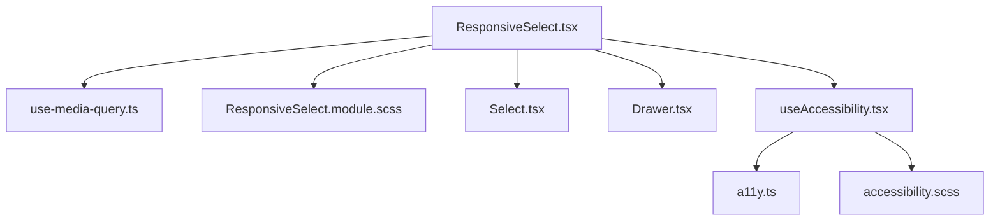
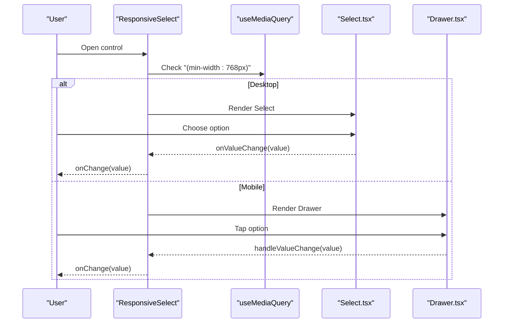
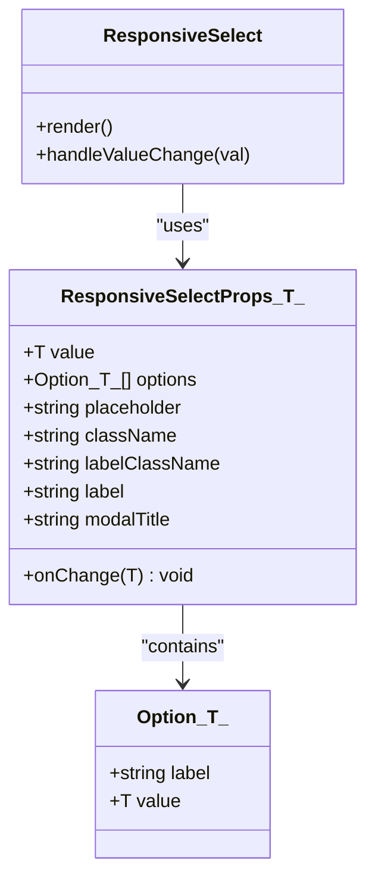
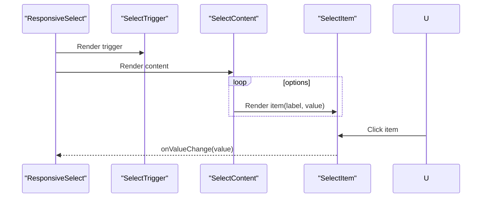
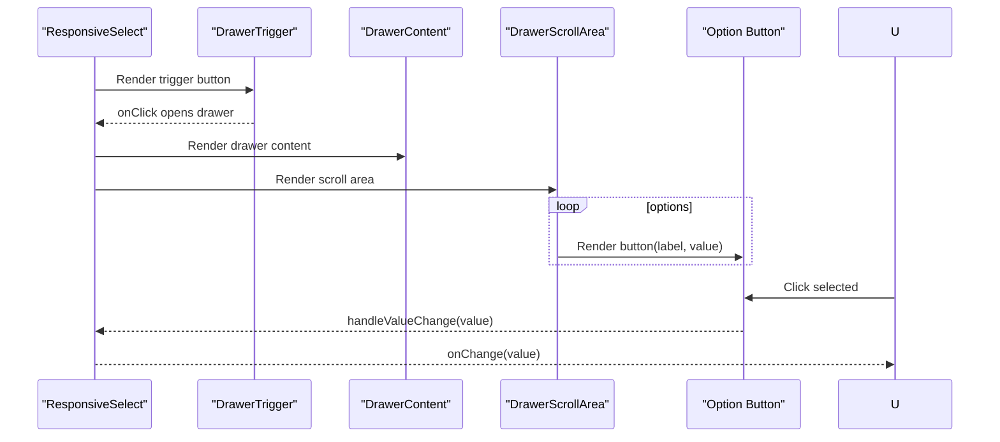
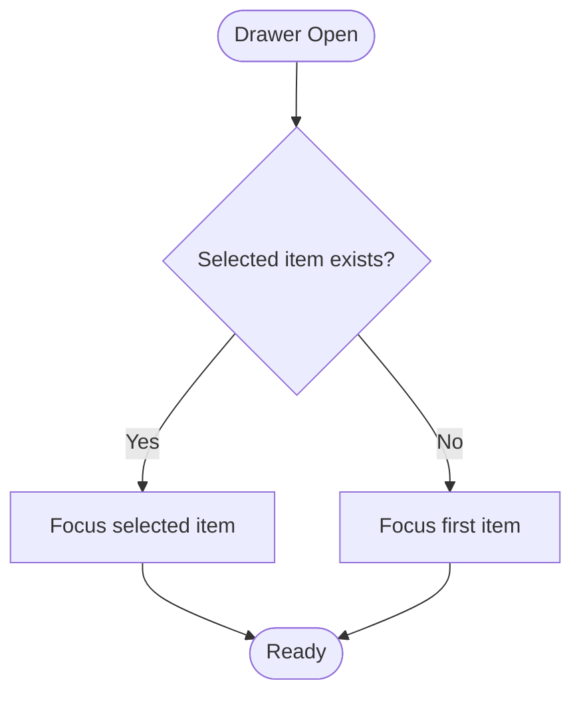
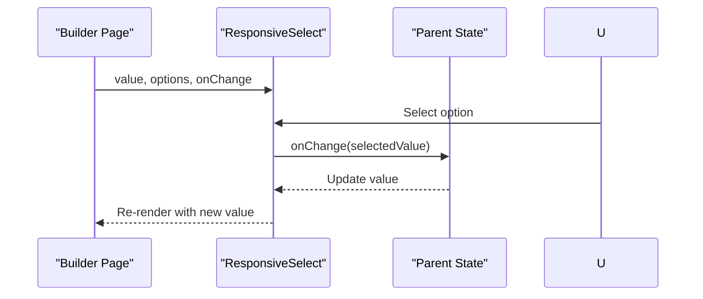
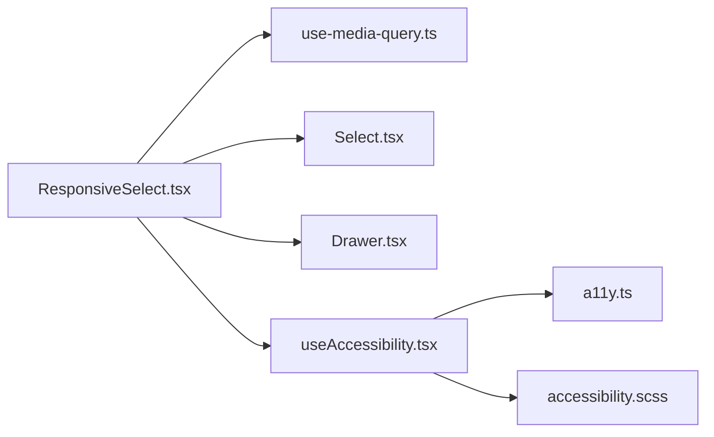

# ResponsiveSelect Component

<cite>
**Referenced Files in This Document**
- [ResponsiveSelect.tsx](file://src/components/common/ResponsiveSelect/ResponsiveSelect.tsx)
- [ResponsiveSelect.module.scss](file://src/components/common/ResponsiveSelect/ResponsiveSelect.module.scss)
- [Select.tsx](file://src/components/ui/Select/Select.tsx)
- [Drawer.tsx](file://src/components/ui/Drawer/Drawer.tsx)
- [use-media-query.ts](file://src/hooks/use-media-query.ts)
- [useAccessibility.tsx](file://src/hooks/useAccessibility.tsx)
- [a11y.ts](file://src/lib/a11y.ts)
- [accessibility.scss](file://src/styles/_accessibility.scss)
- [AccountsSection.tsx](file://src/components/builder/sections/AccountsSection.tsx)
- [ThemeSection.tsx](file://src/components/builder/sections/ThemeSection.tsx)
- [TimePicker.tsx](file://src/components/common/TimePicker/TimePicker.tsx)
</cite>

## Table of Contents
1. [Introduction](#introduction)
2. [Project Structure](#project-structure)
3. [Core Components](#core-components)
4. [Architecture Overview](#architecture-overview)
5. [Detailed Component Analysis](#detailed-component-analysis)
6. [Dependency Analysis](#dependency-analysis)
7. [Performance Considerations](#performance-considerations)
8. [Troubleshooting Guide](#troubleshooting-guide)
9. [Conclusion](#conclusion)
10. [Appendices](#appendices)

## Introduction
ResponsiveSelect is a flexible dropdown selection component designed for adaptive layouts across desktop and mobile devices. It seamlessly switches between a desktop-native select and a mobile drawer interface, ensuring optimal usability on all screen sizes. The component supports single-value selection, custom option rendering, and integrates with accessibility best practices including ARIA attributes and keyboard navigation.

## Project Structure
ResponsiveSelect resides under the common components directory and composes UI primitives for desktop and mobile experiences. It leverages a media query hook for responsive behavior and integrates with shared accessibility utilities.

**Diagram sources**
- [ResponsiveSelect.tsx](file://src/components/common/ResponsiveSelect/ResponsiveSelect.tsx#L1-L182)
- [use-media-query.ts](file://src/hooks/use-media-query.ts#L1-L16)
- [ResponsiveSelect.module.scss](file://src/components/common/ResponsiveSelect/ResponsiveSelect.module.scss#L1-L92)
- [Select.tsx](file://src/components/ui/Select/Select.tsx#L1-L181)
- [Drawer.tsx](file://src/components/ui/Drawer/Drawer.tsx#L1-L132)
- [useAccessibility.tsx](file://src/hooks/useAccessibility.tsx#L1-L77)
- [a11y.ts](file://src/lib/a11y.ts#L1-L20)
- [accessibility.scss](file://src/styles/_accessibility.scss#L1-L34)

**Section sources**
- [ResponsiveSelect.tsx](file://src/components/common/ResponsiveSelect/ResponsiveSelect.tsx#L1-L182)
- [use-media-query.ts](file://src/hooks/use-media-query.ts#L1-L16)

## Core Components
- Props
  - value: Selected value matching the Option.value type
  - options: Array of Option objects with label and value
  - onChange: Callback invoked with the new value when selection changes
  - placeholder: Optional placeholder text shown when no selection exists
  - className: Optional container class name
  - labelClassName: Optional label class name
  - label: Optional label text rendered above the control
  - modalTitle: Optional title for the mobile drawer header
- Behavior
  - Desktop: Uses a native-like select with Radix Select primitives
  - Mobile: Uses a drawer-based interface with scroll area and option buttons
  - Optimistic updates: Updates the UI immediately upon selection while awaiting the parent’s state reconciliation
  - Auto-focus: On open, focuses the selected item or the first item in the drawer

**Section sources**
- [ResponsiveSelect.tsx](file://src/components/common/ResponsiveSelect/ResponsiveSelect.tsx#L31-L51)
- [ResponsiveSelect.tsx](file://src/components/common/ResponsiveSelect/ResponsiveSelect.tsx#L101-L180)

## Architecture Overview
The component orchestrates responsive behavior by detecting screen size and rendering either a desktop select or a mobile drawer. It delegates styling to SCSS modules and integrates with shared UI primitives.

**Diagram sources**
- [ResponsiveSelect.tsx](file://src/components/common/ResponsiveSelect/ResponsiveSelect.tsx#L52-L99)
- [Select.tsx](file://src/components/ui/Select/Select.tsx#L1-L181)
- [Drawer.tsx](file://src/components/ui/Drawer/Drawer.tsx#L1-L132)
- [use-media-query.ts](file://src/hooks/use-media-query.ts#L1-L16)

## Detailed Component Analysis

### Props and Options Model
- Option<T> defines label and value pairs
- ResponsiveSelectProps<T> accepts generic string or number values
- Desktop and mobile renderers share the same option model

**Diagram sources**
- [ResponsiveSelect.tsx](file://src/components/common/ResponsiveSelect/ResponsiveSelect.tsx#L26-L51)

**Section sources**
- [ResponsiveSelect.tsx](file://src/components/common/ResponsiveSelect/ResponsiveSelect.tsx#L26-L51)

### Desktop Renderer (Radix Select)
- Renders a trigger and content portal
- Uses SelectItem components for each option
- Supports scroll indicators and fade overlays via viewport observers

**Diagram sources**
- [ResponsiveSelect.tsx](file://src/components/common/ResponsiveSelect/ResponsiveSelect.tsx#L102-L118)
- [Select.tsx](file://src/components/ui/Select/Select.tsx#L15-L155)

**Section sources**
- [ResponsiveSelect.tsx](file://src/components/common/ResponsiveSelect/ResponsiveSelect.tsx#L102-L118)
- [Select.tsx](file://src/components/ui/Select/Select.tsx#L61-L124)

### Mobile Renderer (Drawer)
- Uses Drawer for slide-up modal on small screens
- Renders option buttons with selection indicator
- Centers selected item in viewport on open

**Diagram sources**
- [ResponsiveSelect.tsx](file://src/components/common/ResponsiveSelect/ResponsiveSelect.tsx#L121-L180)
- [Drawer.tsx](file://src/components/ui/Drawer/Drawer.tsx#L37-L117)

**Section sources**
- [ResponsiveSelect.tsx](file://src/components/common/ResponsiveSelect/ResponsiveSelect.tsx#L121-L180)
- [Drawer.tsx](file://src/components/ui/Drawer/Drawer.tsx#L37-L117)

### Keyboard Navigation and Accessibility
- Drawer auto-focuses the selected or first item on open
- Screen-reader-only descriptions are provided for assistive technologies
- Focus management utilities support accessible modals and traps

**Diagram sources**
- [ResponsiveSelect.tsx](file://src/components/common/ResponsiveSelect/ResponsiveSelect.tsx#L137-L140)
- [Drawer.tsx](file://src/components/ui/Drawer/Drawer.tsx#L46-L50)
- [useAccessibility.tsx](file://src/hooks/useAccessibility.tsx#L22-L62)
- [a11y.ts](file://src/lib/a11y.ts#L1-L20)
- [accessibility.scss](file://src/styles/_accessibility.scss#L1-L34)

**Section sources**
- [ResponsiveSelect.tsx](file://src/components/common/ResponsiveSelect/ResponsiveSelect.tsx#L137-L140)
- [Drawer.tsx](file://src/components/ui/Drawer/Drawer.tsx#L46-L50)
- [useAccessibility.tsx](file://src/hooks/useAccessibility.tsx#L22-L62)
- [a11y.ts](file://src/lib/a11y.ts#L1-L20)
- [accessibility.scss](file://src/styles/_accessibility.scss#L1-L34)

### Examples and Usage Patterns
- Single-select mode
  - AccountsSection demonstrates relationship selection with a predefined set of options
  - ThemeSection shows font selection with a static options array
- Custom option rendering
  - No custom renderer is implemented; labels are plain text
- Async option loading
  - Not implemented in the current component; options are expected to be provided synchronously

**Diagram sources**
- [AccountsSection.tsx](file://src/components/builder/sections/AccountsSection.tsx#L204-L222)
- [ThemeSection.tsx](file://src/components/builder/sections/ThemeSection.tsx#L62-L77)
- [ResponsiveSelect.tsx](file://src/components/common/ResponsiveSelect/ResponsiveSelect.tsx#L68-L75)

**Section sources**
- [AccountsSection.tsx](file://src/components/builder/sections/AccountsSection.tsx#L204-L222)
- [ThemeSection.tsx](file://src/components/builder/sections/ThemeSection.tsx#L62-L77)
- [TimePicker.tsx](file://src/components/common/TimePicker/TimePicker.tsx#L80-L100)

## Dependency Analysis
ResponsiveSelect depends on:
- Media query detection for responsive branching
- UI primitives for desktop and mobile interfaces
- Accessibility utilities for focus management and screen reader support

**Diagram sources**
- [ResponsiveSelect.tsx](file://src/components/common/ResponsiveSelect/ResponsiveSelect.tsx#L1-L25)
- [use-media-query.ts](file://src/hooks/use-media-query.ts#L1-L16)
- [Select.tsx](file://src/components/ui/Select/Select.tsx#L1-L10)
- [Drawer.tsx](file://src/components/ui/Drawer/Drawer.tsx#L1-L6)
- [useAccessibility.tsx](file://src/hooks/useAccessibility.tsx#L1-L4)
- [a11y.ts](file://src/lib/a11y.ts#L1-L20)
- [accessibility.scss](file://src/styles/_accessibility.scss#L1-L34)

**Section sources**
- [ResponsiveSelect.tsx](file://src/components/common/ResponsiveSelect/ResponsiveSelect.tsx#L1-L25)
- [use-media-query.ts](file://src/hooks/use-media-query.ts#L1-L16)
- [Select.tsx](file://src/components/ui/Select/Select.tsx#L1-L10)
- [Drawer.tsx](file://src/components/ui/Drawer/Drawer.tsx#L1-L6)
- [useAccessibility.tsx](file://src/hooks/useAccessibility.tsx#L1-L4)
- [a11y.ts](file://src/lib/a11y.ts#L1-L20)
- [accessibility.scss](file://src/styles/_accessibility.scss#L1-L34)

## Performance Considerations
- Rendering cost
  - Desktop: Uses lightweight Radix Select items; minimal overhead
  - Mobile: Renders a list of buttons; consider virtualization for very large lists
- Scroll behavior
  - On open, the drawer scrolls the selected item into view; a small delay prevents layout thrashing
- Optimistic updates
  - Immediate UI feedback reduces perceived latency during selection changes
- Recommendations
  - For large option sets, implement pagination or search to reduce DOM nodes
  - Debounce search/filter callbacks to avoid excessive re-renders
  - Prefer memoized option arrays to prevent unnecessary renders

**Section sources**
- [ResponsiveSelect.tsx](file://src/components/common/ResponsiveSelect/ResponsiveSelect.tsx#L77-L99)
- [Select.tsx](file://src/components/ui/Select/Select.tsx#L61-L94)

## Troubleshooting Guide
- Selected item not visible on open
  - Ensure the scroll area ref is attached and the selected item ref is set
  - Verify the container and item heights are measurable
- Drawer does not auto-focus
  - Confirm the onOpenAutoFocus handler is present and refs are initialized
- Accessibility issues
  - Verify screen-reader-only descriptions are rendered
  - Ensure focus trap is applied when the drawer is used within other modals
- Styling inconsistencies
  - Check that module styles are imported and not overridden by global styles
  - Confirm media query breakpoint aligns with your design tokens

**Section sources**
- [ResponsiveSelect.tsx](file://src/components/common/ResponsiveSelect/ResponsiveSelect.tsx#L137-L140)
- [Drawer.tsx](file://src/components/ui/Drawer/Drawer.tsx#L46-L50)
- [useAccessibility.tsx](file://src/hooks/useAccessibility.tsx#L22-L62)
- [accessibility.scss](file://src/styles/_accessibility.scss#L1-L34)

## Conclusion
ResponsiveSelect delivers a cohesive selection experience across devices by combining a desktop-native select with a mobile-friendly drawer. Its responsive branching, optimistic updates, and accessibility features make it suitable for forms and configuration panels. Extending it with async loading, search, and virtualization would further improve performance for large datasets.

## Appendices

### Props Reference
- value: Selected value matching Option.value
- options: Array of Option objects
- onChange: Called with the new value on selection change
- placeholder: Text shown when no selection exists
- className: Container class name
- labelClassName: Label class name
- label: Text label rendered above the control
- modalTitle: Title for the mobile drawer header

**Section sources**
- [ResponsiveSelect.tsx](file://src/components/common/ResponsiveSelect/ResponsiveSelect.tsx#L31-L51)

### Responsive Behavior
- Breakpoint: 768px
- Desktop: Select with scroll indicators and fade overlays
- Mobile: Drawer with scroll area and centered selection

**Section sources**
- [ResponsiveSelect.tsx](file://src/components/common/ResponsiveSelect/ResponsiveSelect.tsx#L52-L119)
- [use-media-query.ts](file://src/hooks/use-media-query.ts#L4-L15)

### Accessibility Features
- ARIA attributes: Drawer content and descriptions
- Screen reader support: Visually hidden descriptions
- Keyboard navigation: Auto-focus on open, focus trap utilities

**Section sources**
- [ResponsiveSelect.tsx](file://src/components/common/ResponsiveSelect/ResponsiveSelect.tsx#L146-L148)
- [Drawer.tsx](file://src/components/ui/Drawer/Drawer.tsx#L46-L50)
- [useAccessibility.tsx](file://src/hooks/useAccessibility.tsx#L22-L62)
- [a11y.ts](file://src/lib/a11y.ts#L1-L20)
- [accessibility.scss](file://src/styles/_accessibility.scss#L1-L34)