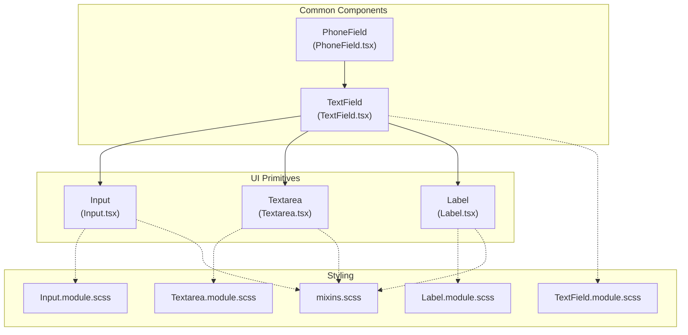
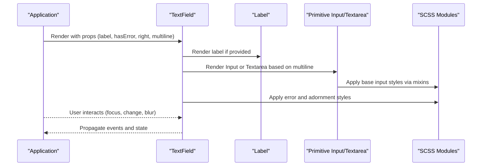
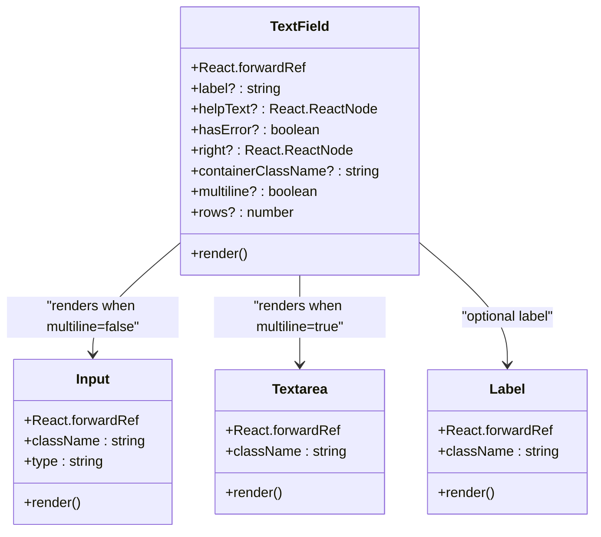
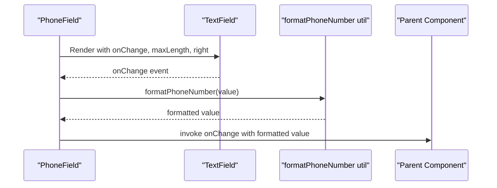
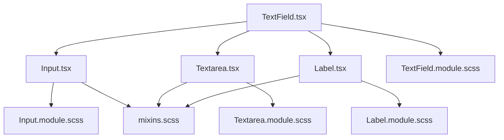

# TextField Component

<cite>
**Referenced Files in This Document**
- [TextField.tsx](file://src/components/common/TextField/TextField.tsx)
- [TextField.module.scss](file://src/components/common/TextField/TextField.module.scss)
- [index.ts](file://src/components/common/TextField/index.ts)
- [Input.tsx](file://src/components/ui/Input/Input.tsx)
- [Input.module.scss](file://src/components/ui/Input/Input.module.scss)
- [Textarea.tsx](file://src/components/ui/Textarea/Textarea.tsx)
- [Textarea.module.scss](file://src/components/ui/Textarea/Textarea.module.scss)
- [Label.tsx](file://src/components/ui/Label/Label.tsx)
- [Label.module.scss](file://src/components/ui/Label/Label.module.scss)
- [PhoneField.tsx](file://src/components/common/PhoneField/PhoneField.tsx)
- [FormPrimitives.tsx](file://src/components/common/FormPrimitives/FormPrimitives.tsx)
- [mixins.scss](file://src/styles/_mixins.scss)
- [AccountsSection.tsx](file://src/components/builder/sections/AccountsSection.tsx)
- [BasicInfoSection.tsx](file://src/components/builder/sections/BasicInfoSection.tsx)
</cite>

## Table of Contents
1. [Introduction](#introduction)
2. [Project Structure](#project-structure)
3. [Core Components](#core-components)
4. [Architecture Overview](#architecture-overview)
5. [Detailed Component Analysis](#detailed-component-analysis)
6. [Dependency Analysis](#dependency-analysis)
7. [Performance Considerations](#performance-considerations)
8. [Troubleshooting Guide](#troubleshooting-guide)
9. [Conclusion](#conclusion)

## Introduction
This document provides comprehensive documentation for the TextField component, focusing on text input handling and validation. It explains the component's props, validation states, error display mechanisms, and character counting features. It also details the styling system using SCSS modules, responsive design implementations, and mobile optimization strategies. Examples of different input types (text, email, password), validation rules, and integration with form validation libraries are included. Accessibility features such as ARIA labels, keyboard navigation, and screen reader support are addressed, along with focus management, auto-completion handling, and cross-browser compatibility considerations.

## Project Structure
The TextField component is part of the common components library and integrates with UI primitives for input, textarea, and label. It is designed to be reusable across the application and supports both single-line and multi-line text inputs.

**Diagram sources**
- [TextField.tsx](file://src/components/common/TextField/TextField.tsx#L1-L77)
- [PhoneField.tsx](file://src/components/common/PhoneField/PhoneField.tsx#L1-L39)
- [Input.tsx](file://src/components/ui/Input/Input.tsx#L1-L21)
- [Textarea.tsx](file://src/components/ui/Textarea/Textarea.tsx#L1-L20)
- [Label.tsx](file://src/components/ui/Label/Label.tsx#L1-L21)
- [TextField.module.scss](file://src/components/common/TextField/TextField.module.scss#L1-L47)
- [Input.module.scss](file://src/components/ui/Input/Input.module.scss#L1-L36)
- [Textarea.module.scss](file://src/components/ui/Textarea/Textarea.module.scss#L1-L24)
- [Label.module.scss](file://src/components/ui/Label/Label.module.scss#L1-L22)
- [mixins.scss](file://src/styles/_mixins.scss#L1-L278)

**Section sources**
- [TextField.tsx](file://src/components/common/TextField/TextField.tsx#L1-L77)
- [index.ts](file://src/components/common/TextField/index.ts#L1-L2)

## Core Components
The TextField component serves as a wrapper around Input and Textarea primitives, adding label, help text, error states, and optional right-side adornments. It supports:
- Single-line input via Input primitive
- Multi-line input via Textarea primitive
- Optional label rendering
- Help text display
- Error state styling
- Right-side adornment support (e.g., icons)
- Container-level styling customization

Key props include:
- value: Controlled value for the input
- onChange: Event handler for input changes
- placeholder: Placeholder text
- label: Label text for accessibility and UX
- hasError: Boolean flag to indicate validation errors
- right: React node for right-side adornment
- containerClassName: Additional container styling
- multiline: Boolean to enable multi-line mode
- rows: Number of visible text rows in multi-line mode

Validation patterns and error display:
- Error state is applied via hasError prop and reflected in both label and input styling
- Error-specific styles are defined in the component's SCSS module

Character counting:
- The component does not implement built-in character counting; however, it supports maxLength through inherited props from the underlying Input primitive

Integration with form validation libraries:
- The component exposes standard React input props, enabling integration with libraries such as React Hook Form, Formik, and Yup
- Validation feedback can be passed via hasError and helpText props

**Section sources**
- [TextField.tsx](file://src/components/common/TextField/TextField.tsx#L8-L16)
- [TextField.tsx](file://src/components/common/TextField/TextField.tsx#L18-L76)
- [TextField.module.scss](file://src/components/common/TextField/TextField.module.scss#L22-L46)
- [Input.tsx](file://src/components/ui/Input/Input.tsx#L5-L17)

## Architecture Overview
The TextField component composes three primary UI primitives: Input, Textarea, and Label. It conditionally renders either Input or Textarea based on the multiline prop. An optional right-side adornment is positioned absolutely within the input wrapper. Styling is handled through SCSS modules with shared mixins for consistent base styles.

**Diagram sources**
- [TextField.tsx](file://src/components/common/TextField/TextField.tsx#L35-L71)
- [Input.tsx](file://src/components/ui/Input/Input.tsx#L8-L16)
- [Textarea.tsx](file://src/components/ui/Textarea/Textarea.tsx#L5-L15)
- [Label.tsx](file://src/components/ui/Label/Label.tsx#L8-L16)
- [mixins.scss](file://src/styles/_mixins.scss#L127-L141)

## Detailed Component Analysis

### TextField Component
The TextField component is a forward-ref-enabled wrapper that:
- Accepts all standard input attributes plus custom props for label, help text, error state, adornment, and multi-line support
- Dynamically selects Input or Textarea based on multiline
- Applies error styling when hasError is true
- Supports right-side adornments for icons or buttons
- Renders help text below the input field

**Diagram sources**
- [TextField.tsx](file://src/components/common/TextField/TextField.tsx#L18-L76)
- [Input.tsx](file://src/components/ui/Input/Input.tsx#L5-L17)
- [Textarea.tsx](file://src/components/ui/Textarea/Textarea.tsx#L5-L15)
- [Label.tsx](file://src/components/ui/Label/Label.tsx#L8-L16)

**Section sources**
- [TextField.tsx](file://src/components/common/TextField/TextField.tsx#L8-L16)
- [TextField.tsx](file://src/components/common/TextField/TextField.tsx#L18-L76)
- [TextField.module.scss](file://src/components/common/TextField/TextField.module.scss#L3-L46)

### Input and Textarea Primitives
The Input and Textarea primitives provide base styling and behavior:
- Input: Forward-ref enabled input element with base styles and file input specializations
- Textarea: Forward-ref enabled textarea element with base styles and transitions

Both components leverage shared mixins for consistent focus, placeholder, hover, and disabled states.

**Section sources**
- [Input.tsx](file://src/components/ui/Input/Input.tsx#L5-L17)
- [Input.module.scss](file://src/components/ui/Input/Input.module.scss#L4-L35)
- [Textarea.tsx](file://src/components/ui/Textarea/Textarea.tsx#L5-L15)
- [Textarea.module.scss](file://src/components/ui/Textarea/Textarea.module.scss#L4-L23)
- [mixins.scss](file://src/styles/_mixins.scss#L127-L158)

### Label Primitive
The Label primitive wraps Radix UI's label component and applies consistent styling for disabled states and general typography.

**Section sources**
- [Label.tsx](file://src/components/ui/Label/Label.tsx#L8-L16)
- [Label.module.scss](file://src/components/ui/Label/Label.module.scss#L4-L21)

### PhoneField Integration
PhoneField demonstrates advanced input handling by wrapping TextField and applying phone number formatting while preserving the original event interface for parent handlers.

**Diagram sources**
- [PhoneField.tsx](file://src/components/common/PhoneField/PhoneField.tsx#L10-L35)

**Section sources**
- [PhoneField.tsx](file://src/components/common/PhoneField/PhoneField.tsx#L6-L35)

### Usage Examples Across the Application
TextField is extensively used across builder sections for various input scenarios:
- Basic information sections with text inputs for names and parental details
- Accounts section with multiple text inputs for bank details and relations
- Rich text editor integration within form fields

These usages demonstrate:
- Single-line text inputs with placeholders and controlled values
- Multi-line text areas for descriptions
- Integration with form state management and validation

**Section sources**
- [AccountsSection.tsx](file://src/components/builder/sections/AccountsSection.tsx#L123-L135)
- [AccountsSection.tsx](file://src/components/builder/sections/AccountsSection.tsx#L226-L258)
- [BasicInfoSection.tsx](file://src/components/builder/sections/BasicInfoSection.tsx#L35-L41)
- [BasicInfoSection.tsx](file://src/components/builder/sections/BasicInfoSection.tsx#L45-L76)
- [BasicInfoSection.tsx](file://src/components/builder/sections/BasicInfoSection.tsx#L84-L90)

## Dependency Analysis
The TextField component depends on UI primitives and SCSS modules for consistent styling. The dependency graph highlights the composition and styling relationships.

**Diagram sources**
- [TextField.tsx](file://src/components/common/TextField/TextField.tsx#L1-L6)
- [Input.tsx](file://src/components/ui/Input/Input.tsx#L1-L3)
- [Textarea.tsx](file://src/components/ui/Textarea/Textarea.tsx#L1-L3)
- [Label.tsx](file://src/components/ui/Label/Label.tsx#L1-L6)
- [TextField.module.scss](file://src/components/common/TextField/TextField.module.scss#L1)
- [Input.module.scss](file://src/components/ui/Input/Input.module.scss#L1)
- [Textarea.module.scss](file://src/components/ui/Textarea/Textarea.module.scss#L1)
- [Label.module.scss](file://src/components/ui/Label/Label.module.scss#L1)
- [mixins.scss](file://src/styles/_mixins.scss#L1)

**Section sources**
- [TextField.tsx](file://src/components/common/TextField/TextField.tsx#L1-L6)
- [Input.tsx](file://src/components/ui/Input/Input.tsx#L1-L3)
- [Textarea.tsx](file://src/components/ui/Textarea/Textarea.tsx#L1-L3)
- [Label.tsx](file://src/components/ui/Label/Label.tsx#L1-L6)

## Performance Considerations
- Minimal re-renders: TextField uses forwardRef and passes props directly to primitives, avoiding unnecessary wrappers
- Conditional rendering: Input vs Textarea is determined by a single prop, minimizing branching overhead
- CSS modules: Scoped styles prevent cascade-related performance issues
- Mixins: Shared base styles reduce duplication and improve maintainability

## Troubleshooting Guide
Common issues and resolutions:
- Error state not visible: Ensure hasError is passed and styles are applied correctly
- Adornment not aligned: Verify right prop is provided and padding adjustments are applied
- Multi-line input not rendering: Confirm multiline prop is true and rows prop is set appropriately
- Label not associated: Ensure id or name is provided so the label's htmlFor matches the input id

**Section sources**
- [TextField.tsx](file://src/components/common/TextField/TextField.tsx#L18-L76)
- [TextField.module.scss](file://src/components/common/TextField/TextField.module.scss#L13-L46)

## Conclusion
The TextField component provides a robust, accessible, and flexible foundation for text input handling across the application. Its integration with UI primitives, SCSS modules, and shared mixins ensures consistent styling and behavior. The component supports validation feedback, adornments, and multi-line inputs, while remaining compatible with popular form validation libraries. By following the guidelines and examples outlined in this document, developers can effectively implement and customize TextField for diverse input scenarios.