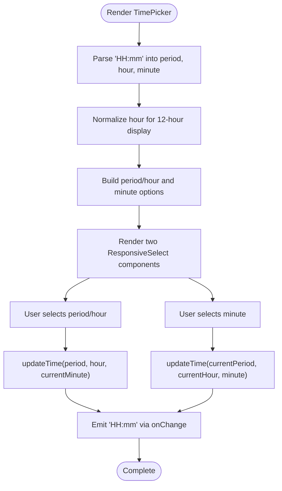

# TimePicker Component

<cite>
**Referenced Files in This Document**
- [TimePicker.tsx](file://src/components/common/TimePicker/TimePicker.tsx)
- [TimePicker.module.scss](file://src/components/common/TimePicker/TimePicker.module.scss)
- [ResponsiveSelect.tsx](file://src/components/common/ResponsiveSelect/ResponsiveSelect.tsx)
- [ResponsiveSelect.module.scss](file://src/components/common/ResponsiveSelect/ResponsiveSelect.module.scss)
- [DateTimeSection.tsx](file://src/components/builder/sections/DateTimeSection.tsx)
- [DatePicker.tsx](file://src/components/common/DatePicker/DatePicker.tsx)
- [useInvitationStore.ts](file://src/store/useInvitationStore.ts)
- [variables.scss](file://src/styles/_variables.scss)
- [CalendarSectionView.tsx](file://src/components/preview/sections/CalendarSectionView.tsx)
</cite>

## Table of Contents
1. [Introduction](#introduction)
2. [Project Structure](#project-structure)
3. [Core Components](#core-components)
4. [Architecture Overview](#architecture-overview)
5. [Detailed Component Analysis](#detailed-component-analysis)
6. [Dependency Analysis](#dependency-analysis)
7. [Performance Considerations](#performance-considerations)
8. [Troubleshooting Guide](#troubleshooting-guide)
9. [Conclusion](#conclusion)

## Introduction
The TimePicker component provides a localized, mobile-first time selection interface optimized for Korean-speaking users. It supports 12-hour time display with AM/PM selection and 10-minute interval minutes, integrates seamlessly with the form builder, and follows responsive design patterns for desktop and mobile experiences. The component emits time values in 24-hour format ("HH:mm") via its onChange handler, enabling straightforward integration with date-time workflows.

## Project Structure
The TimePicker resides under the common components directory alongside a responsive select abstraction and is integrated into the builder's date-time section. Styling leverages shared SCSS variables for consistent spacing and typography.

**Diagram sources**
- [TimePicker.tsx](file://src/components/common/TimePicker/TimePicker.tsx#L1-L104)
- [ResponsiveSelect.tsx](file://src/components/common/ResponsiveSelect/ResponsiveSelect.tsx#L1-L182)
- [TimePicker.module.scss](file://src/components/common/TimePicker/TimePicker.module.scss#L1-L22)
- [DateTimeSection.tsx](file://src/components/builder/sections/DateTimeSection.tsx#L1-L95)
- [useInvitationStore.ts](file://src/store/useInvitationStore.ts#L1-L534)
- [variables.scss](file://src/styles/_variables.scss#L1-L127)

**Section sources**
- [TimePicker.tsx](file://src/components/common/TimePicker/TimePicker.tsx#L1-L104)
- [ResponsiveSelect.tsx](file://src/components/common/ResponsiveSelect/ResponsiveSelect.tsx#L1-L182)
- [TimePicker.module.scss](file://src/components/common/TimePicker/TimePicker.module.scss#L1-L22)
- [DateTimeSection.tsx](file://src/components/builder/sections/DateTimeSection.tsx#L1-L95)
- [useInvitationStore.ts](file://src/store/useInvitationStore.ts#L1-L534)
- [variables.scss](file://src/styles/_variables.scss#L1-L127)

## Core Components
- TimePicker: Renders two cascading selects for period/hour and minutes, converts values to 24-hour format, and emits updates.
- ResponsiveSelect: Provides a unified desktop dropdown and mobile drawer interface with accessible semantics and keyboard navigation.
- DateTimeSection: Integrates TimePicker with DatePicker and application state via the invitation store.

Key props and behaviors:
- Props: value (string "HH:mm"), onChange (callback), className (optional), placeholder (optional).
- Behavior: Parses incoming time, normalizes to 12-hour display, restricts hours to morning and afternoon ranges, and emits 24-hour formatted time strings.

**Section sources**
- [TimePicker.tsx](file://src/components/common/TimePicker/TimePicker.tsx#L8-L13)
- [TimePicker.tsx](file://src/components/common/TimePicker/TimePicker.tsx#L17-L58)
- [ResponsiveSelect.tsx](file://src/components/common/ResponsiveSelect/ResponsiveSelect.tsx#L31-L51)
- [DateTimeSection.tsx](file://src/components/builder/sections/DateTimeSection.tsx#L56-L60)

## Architecture Overview
The TimePicker composes two ResponsiveSelect instances: one for period/hour and another for minutes. On change, it computes a 24-hour time string and invokes the provided onChange callback. The builder section binds the component to the invitation store for persistent state.

**Diagram sources**
- [TimePicker.tsx](file://src/components/common/TimePicker/TimePicker.tsx#L37-L58)
- [ResponsiveSelect.tsx](file://src/components/common/ResponsiveSelect/ResponsiveSelect.tsx#L68-L75)
- [DateTimeSection.tsx](file://src/components/builder/sections/DateTimeSection.tsx#L56-L60)
- [useInvitationStore.ts](file://src/store/useInvitationStore.ts#L135-L137)

## Detailed Component Analysis

### TimePicker Implementation
The component parses the incoming "HH:mm" value, determines AM/PM, normalizes the hour for display, and constructs a 24-hour string when either period/hour or minute changes. It defines localized hour ranges for morning and afternoon and minute increments of 10 minutes.

**Diagram sources**
- [TimePicker.tsx](file://src/components/common/TimePicker/TimePicker.tsx#L17-L58)
- [TimePicker.tsx](file://src/components/common/TimePicker/TimePicker.tsx#L60-L75)

**Section sources**
- [TimePicker.tsx](file://src/components/common/TimePicker/TimePicker.tsx#L17-L58)
- [TimePicker.tsx](file://src/components/common/TimePicker/TimePicker.tsx#L60-L75)

### ResponsiveSelect Integration
ResponsiveSelect adapts to device size: desktop uses a dropdown, while mobile uses a drawer. It manages optimistic value updates, scroll positioning for the selected item, and accessibility attributes including a visible title and a visually hidden description for screen readers.

**Diagram sources**
- [ResponsiveSelect.tsx](file://src/components/common/ResponsiveSelect/ResponsiveSelect.tsx#L26-L51)
- [ResponsiveSelect.tsx](file://src/components/common/ResponsiveSelect/ResponsiveSelect.tsx#L101-L118)
- [ResponsiveSelect.tsx](file://src/components/common/ResponsiveSelect/ResponsiveSelect.tsx#L121-L181)

**Section sources**
- [ResponsiveSelect.tsx](file://src/components/common/ResponsiveSelect/ResponsiveSelect.tsx#L101-L118)
- [ResponsiveSelect.tsx](file://src/components/common/ResponsiveSelect/ResponsiveSelect.tsx#L121-L181)

### Styling and Layout
The TimePicker container uses flex layout with proportional widths for the hour selector and fixed width for minutes, ensuring a balanced and readable interface. Shared SCSS variables define spacing, typography, and color tokens.

**Diagram sources**
- [TimePicker.module.scss](file://src/components/common/TimePicker/TimePicker.module.scss#L3-L21)
- [variables.scss](file://src/styles/_variables.scss#L88-L96)

**Section sources**
- [TimePicker.module.scss](file://src/components/common/TimePicker/TimePicker.module.scss#L3-L21)
- [variables.scss](file://src/styles/_variables.scss#L88-L96)

### Integration with DatePicker and Store
The builder's DateTimeSection pairs TimePicker with DatePicker and persists selections to the invitation store. The store maintains date and time as strings, enabling straightforward formatting and display.

**Diagram sources**
- [DateTimeSection.tsx](file://src/components/builder/sections/DateTimeSection.tsx#L50-L60)
- [DatePicker.tsx](file://src/components/common/DatePicker/DatePicker.tsx#L29-L42)
- [useInvitationStore.ts](file://src/store/useInvitationStore.ts#L135-L137)

**Section sources**
- [DateTimeSection.tsx](file://src/components/builder/sections/DateTimeSection.tsx#L50-L60)
- [DatePicker.tsx](file://src/components/common/DatePicker/DatePicker.tsx#L29-L42)
- [useInvitationStore.ts](file://src/store/useInvitationStore.ts#L135-L137)

## Dependency Analysis
- TimePicker depends on ResponsiveSelect for the underlying selection UI.
- TimePicker emits 24-hour time strings suitable for downstream processing.
- DateTimeSection orchestrates TimePicker and DatePicker and writes to the invitation store.
- The store exposes setters for date and time, enabling centralized state management.

**Diagram sources**
- [TimePicker.tsx](file://src/components/common/TimePicker/TimePicker.tsx#L4-L6)
- [ResponsiveSelect.tsx](file://src/components/common/ResponsiveSelect/ResponsiveSelect.tsx#L1-L24)
- [DateTimeSection.tsx](file://src/components/builder/sections/DateTimeSection.tsx#L10-L11)
- [useInvitationStore.ts](file://src/store/useInvitationStore.ts#L135-L137)

**Section sources**
- [TimePicker.tsx](file://src/components/common/TimePicker/TimePicker.tsx#L4-L6)
- [ResponsiveSelect.tsx](file://src/components/common/ResponsiveSelect/ResponsiveSelect.tsx#L1-L24)
- [DateTimeSection.tsx](file://src/components/builder/sections/DateTimeSection.tsx#L10-L11)
- [useInvitationStore.ts](file://src/store/useInvitationStore.ts#L135-L137)

## Performance Considerations
- Rendering cost: TimePicker is a lightweight client component with minimal state; it recomputes options based on fixed arrays, avoiding heavy computations.
- Memoization: The surrounding section uses React.memo to prevent unnecessary re-renders when props are shallow equal.
- Hydration: Keep client components scoped to minimize hydration overhead; TimePicker is already marked as a client component.
- Bundle size: Reuse shared UI primitives (ResponsiveSelect) to avoid duplication and reduce bundle weight.

[No sources needed since this section provides general guidance]

## Troubleshooting Guide
- Invalid time format: Ensure the value prop adheres to "HH:mm". If empty, the component defaults to a safe time for display.
- Incorrect AM/PM conversion: Verify that the input hour falls within expected ranges; the component normalizes hours for 12-hour display.
- Minutes not updating: Confirm that the minute option array includes the desired increments; the component currently uses 10-minute steps.
- Localization labels: The component uses Korean labels for periods and minutes; ensure consumers localize accordingly if targeting other locales.
- Accessibility: On mobile, the drawer includes a visible title and a visually hidden description to aid screen readers.

**Section sources**
- [TimePicker.tsx](file://src/components/common/TimePicker/TimePicker.tsx#L17-L58)
- [TimePicker.tsx](file://src/components/common/TimePicker/TimePicker.tsx#L60-L75)
- [ResponsiveSelect.tsx](file://src/components/common/ResponsiveSelect/ResponsiveSelect.tsx#L142-L148)
- [ResponsiveSelect.module.scss](file://src/components/common/ResponsiveSelect/ResponsiveSelect.module.scss#L89-L91)

## Conclusion
The TimePicker component delivers a robust, localized time selection experience with a clean separation of concerns. It leverages a responsive select abstraction for cross-device usability, emits standardized 24-hour time strings, and integrates smoothly with the application's form builder and state store. Its design emphasizes simplicity, accessibility, and maintainability, making it easy to extend or adapt for broader localization needs.