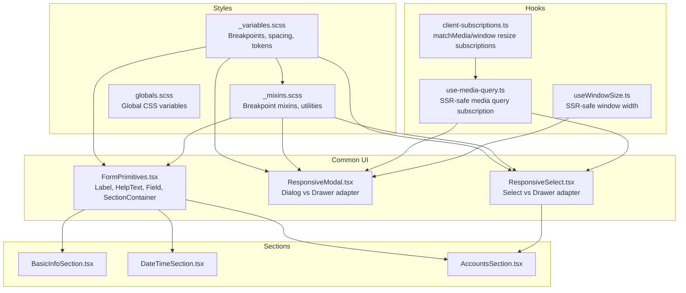
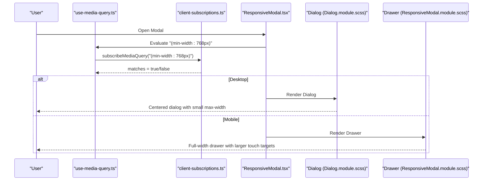
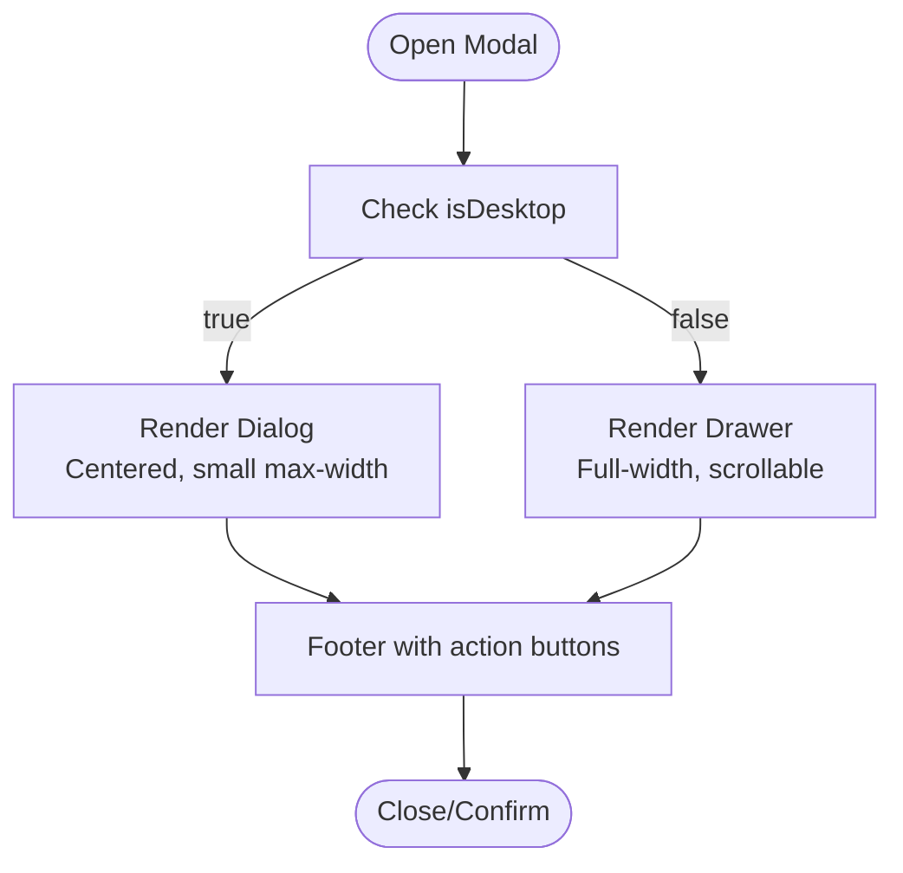
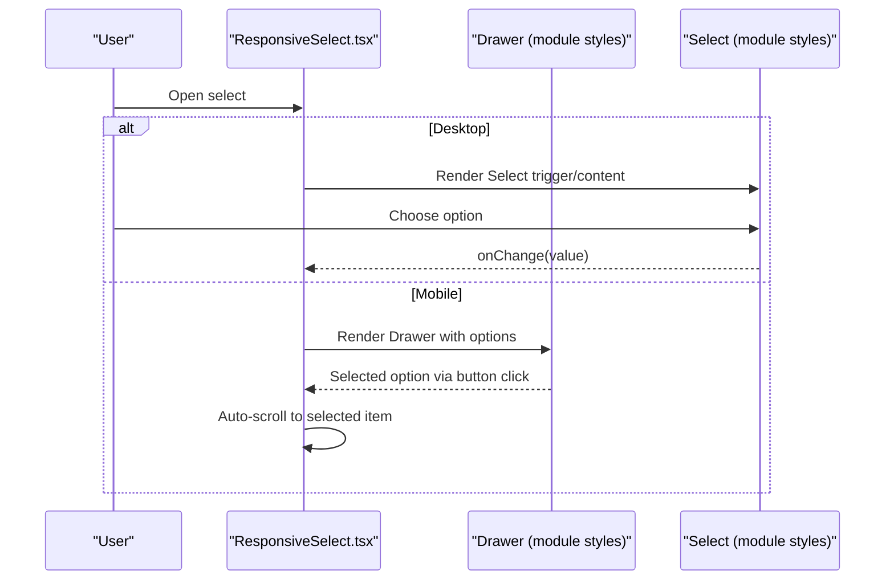
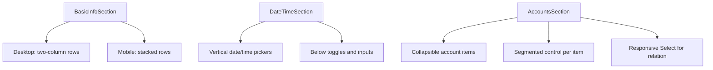
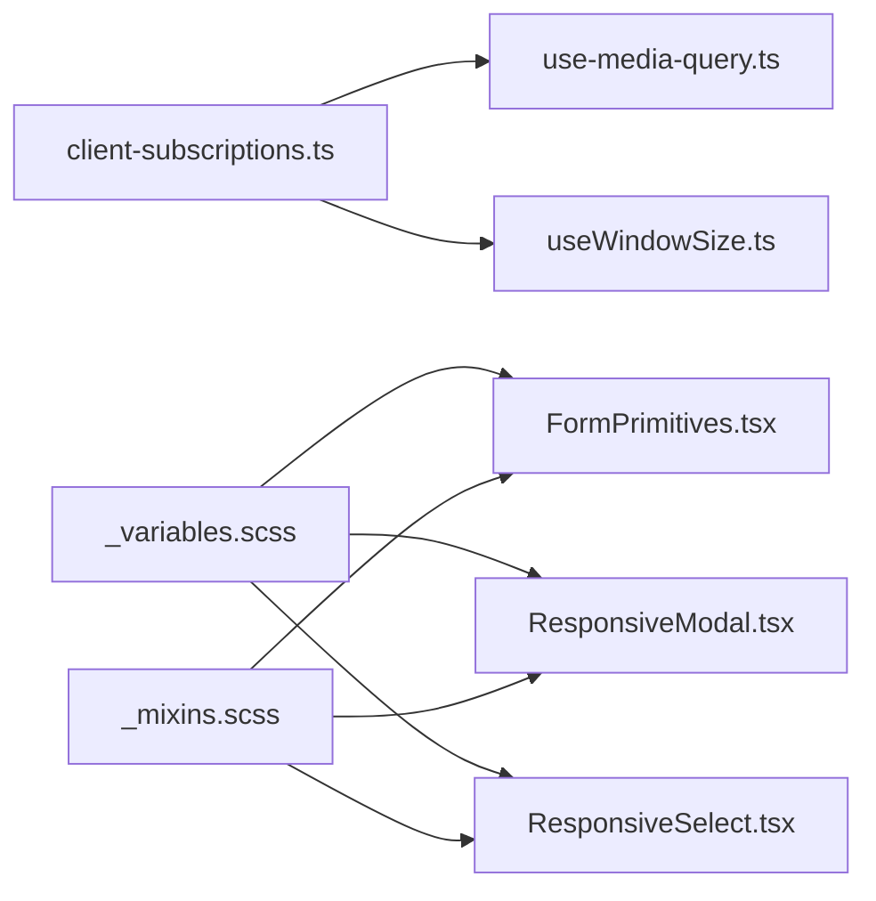

# Responsive Design

<cite>
**Referenced Files in This Document**
- [src/styles/_variables.scss](file://src/styles/_variables.scss)
- [src/styles/_mixins.scss](file://src/styles/_mixins.scss)
- [src/styles/globals.scss](file://src/styles/globals.scss)
- [src/hooks/use-media-query.ts](file://src/hooks/use-media-query.ts)
- [src/hooks/useWindowSize.ts](file://src/hooks/useWindowSize.ts)
- [src/lib/client-subscriptions.ts](file://src/lib/client-subscriptions.ts)
- [src/components/common/FormPrimitives/FormPrimitives.tsx](file://src/components/common/FormPrimitives/FormPrimitives.tsx)
- [src/components/common/FormPrimitives/FormPrimitives.module.scss](file://src/components/common/FormPrimitives/FormPrimitives.module.scss)
- [src/components/common/ResponsiveModal/ResponsiveModal.tsx](file://src/components/common/ResponsiveModal/ResponsiveModal.tsx)
- [src/components/common/ResponsiveModal/ResponsiveModal.module.scss](file://src/components/common/ResponsiveModal/ResponsiveModal.module.scss)
- [src/components/common/ResponsiveSelect/ResponsiveSelect.tsx](file://src/components/common/ResponsiveSelect/ResponsiveSelect.tsx)
- [src/components/common/ResponsiveSelect/ResponsiveSelect.module.scss](file://src/components/common/ResponsiveSelect/ResponsiveSelect.module.scss)
- [src/components/ui/Dialog/Dialog.module.scss](file://src/components/ui/Dialog/Dialog.module.scss)
- [src/components/builder/sections/AccountsSection.tsx](file://src/components/builder/sections/AccountsSection.tsx)
- [src/components/builder/sections/BasicInfoSection.tsx](file://src/components/builder/sections/BasicInfoSection.tsx)
- [src/components/builder/sections/DateTimeSection.tsx](file://src/components/builder/sections/DateTimeSection.tsx)
</cite>

## Table of Contents
1. [Introduction](#introduction)
2. [Project Structure](#project-structure)
3. [Core Components](#core-components)
4. [Architecture Overview](#architecture-overview)
5. [Detailed Component Analysis](#detailed-component-analysis)
6. [Dependency Analysis](#dependency-analysis)
7. [Performance Considerations](#performance-considerations)
8. [Troubleshooting Guide](#troubleshooting-guide)
9. [Conclusion](#conclusion)

## Introduction
This document explains the responsive design implementation for adaptive form layouts and mobile optimization. It covers breakpoint strategies, flexible grid systems, component scaling patterns, and the mobile-first approach. It documents touch-friendly interactions, viewport adaptation, modal responsiveness, select component adaptations, and layout reflow mechanisms. It also includes examples of responsive form sections, adaptive validation displays, and mobile-specific UX patterns, along with CSS-in-JS integration via CSS Modules, media query patterns, and performance considerations for different device classes.

## Project Structure
The responsive system centers around:
- Shared SCSS variables and mixins for breakpoints, spacing, typography, and component base styles
- React hooks that safely subscribe to media queries and window size with SSR compatibility
- Reusable UI primitives for forms and modals that adapt to screen sizes
- Section components that demonstrate responsive layouts and adaptive controls

**Diagram sources**
- [src/styles/_variables.scss](file://src/styles/_variables.scss#L94-L96)
- [src/styles/_mixins.scss](file://src/styles/_mixins.scss#L6-L16)
- [src/hooks/use-media-query.ts](file://src/hooks/use-media-query.ts#L1-L16)
- [src/hooks/useWindowSize.ts](file://src/hooks/useWindowSize.ts#L1-L15)
- [src/lib/client-subscriptions.ts](file://src/lib/client-subscriptions.ts#L1-L94)
- [src/components/common/FormPrimitives/FormPrimitives.tsx](file://src/components/common/FormPrimitives/FormPrimitives.tsx#L1-L119)
- [src/components/common/ResponsiveModal/ResponsiveModal.tsx](file://src/components/common/ResponsiveModal/ResponsiveModal.tsx#L1-L229)
- [src/components/common/ResponsiveSelect/ResponsiveSelect.tsx](file://src/components/common/ResponsiveSelect/ResponsiveSelect.tsx#L1-L182)
- [src/components/builder/sections/BasicInfoSection.tsx](file://src/components/builder/sections/BasicInfoSection.tsx#L1-L134)
- [src/components/builder/sections/DateTimeSection.tsx](file://src/components/builder/sections/DateTimeSection.tsx#L1-L95)
- [src/components/builder/sections/AccountsSection.tsx](file://src/components/builder/sections/AccountsSection.tsx#L1-L305)

**Section sources**
- [src/styles/_variables.scss](file://src/styles/_variables.scss#L94-L96)
- [src/styles/_mixins.scss](file://src/styles/_mixins.scss#L6-L16)
- [src/hooks/use-media-query.ts](file://src/hooks/use-media-query.ts#L1-L16)
- [src/hooks/useWindowSize.ts](file://src/hooks/useWindowSize.ts#L1-L15)
- [src/lib/client-subscriptions.ts](file://src/lib/client-subscriptions.ts#L1-L94)

## Core Components
- Breakpoints and tokens: A single mobile breakpoint is defined and used consistently across components.
- Utility mixins: Provide reusable breakpoint mixins and component base styles.
- SSR-safe hooks: Subscribe to media queries and window size without hydration mismatches.
- Form primitives: Provide consistent spacing, labels, help text, and field containers.
- Adaptive modals: Render Dialog on desktop and Drawer on mobile.
- Adaptive selects: Render native Select on desktop and a Drawer-based option picker on mobile.

Key implementation references:
- Breakpoints and canvas width tokens: [src/styles/_variables.scss](file://src/styles/_variables.scss#L94-L96)
- Breakpoint mixins: [src/styles/_mixins.scss](file://src/styles/_mixins.scss#L6-L16)
- SSR-safe media query hook: [src/hooks/use-media-query.ts](file://src/hooks/use-media-query.ts#L1-L16)
- Window size hook: [src/hooks/useWindowSize.ts](file://src/hooks/useWindowSize.ts#L1-L15)
- Media query subscriptions: [src/lib/client-subscriptions.ts](file://src/lib/client-subscriptions.ts#L71-L93)
- Form primitives: [src/components/common/FormPrimitives/FormPrimitives.tsx](file://src/components/common/FormPrimitives/FormPrimitives.tsx#L1-L119)
- Responsive modal: [src/components/common/ResponsiveModal/ResponsiveModal.tsx](file://src/components/common/ResponsiveModal/ResponsiveModal.tsx#L73-L158)
- Responsive select: [src/components/common/ResponsiveSelect/ResponsiveSelect.tsx](file://src/components/common/ResponsiveSelect/ResponsiveSelect.tsx#L52-L118)

**Section sources**
- [src/styles/_variables.scss](file://src/styles/_variables.scss#L94-L96)
- [src/styles/_mixins.scss](file://src/styles/_mixins.scss#L6-L16)
- [src/hooks/use-media-query.ts](file://src/hooks/use-media-query.ts#L1-L16)
- [src/hooks/useWindowSize.ts](file://src/hooks/useWindowSize.ts#L1-L15)
- [src/lib/client-subscriptions.ts](file://src/lib/client-subscriptions.ts#L71-L93)
- [src/components/common/FormPrimitives/FormPrimitives.tsx](file://src/components/common/FormPrimitives/FormPrimitives.tsx#L1-L119)
- [src/components/common/ResponsiveModal/ResponsiveModal.tsx](file://src/components/common/ResponsiveModal/ResponsiveModal.tsx#L73-L158)
- [src/components/common/ResponsiveSelect/ResponsiveSelect.tsx](file://src/components/common/ResponsiveSelect/ResponsiveSelect.tsx#L52-L118)

## Architecture Overview
The responsive architecture follows a mobile-first strategy:
- Define a single breakpoint threshold for switching between desktop and mobile experiences.
- Use SSR-safe hooks to detect the device class and render the appropriate component tree.
- Apply SCSS mixins and tokens to maintain consistent spacing, typography, and component sizing.
- For modals and selects, swap UI patterns at the boundary while preserving props contracts.

**Diagram sources**
- [src/hooks/use-media-query.ts](file://src/hooks/use-media-query.ts#L1-L16)
- [src/lib/client-subscriptions.ts](file://src/lib/client-subscriptions.ts#L71-L93)
- [src/components/common/ResponsiveModal/ResponsiveModal.tsx](file://src/components/common/ResponsiveModal/ResponsiveModal.tsx#L73-L158)
- [src/components/ui/Dialog/Dialog.module.scss](file://src/components/ui/Dialog/Dialog.module.scss#L20-L43)
- [src/components/common/ResponsiveModal/ResponsiveModal.module.scss](file://src/components/common/ResponsiveModal/ResponsiveModal.module.scss#L8-L25)

## Detailed Component Analysis

### Breakpoint Strategy and Flexible Grid Systems
- Single breakpoint: The project defines a single mobile threshold and uses it to switch between desktop and mobile experiences.
- Consistent spacing and typography: SCSS variables define spacing units and font sizes that scale appropriately across devices.
- Flex utilities: Mixins encapsulate flex layouts and alignment for consistent grid-like behavior.

Implementation references:
- Breakpoint definition: [src/styles/_variables.scss](file://src/styles/_variables.scss#L94-L96)
- Breakpoint mixins: [src/styles/_mixins.scss](file://src/styles/_mixins.scss#L6-L16)
- Spacing and typography tokens: [src/styles/_variables.scss](file://src/styles/_variables.scss#L88-L84)
- Flex utilities: [src/styles/_mixins.scss](file://src/styles/_mixins.scss#L39-L56)

**Section sources**
- [src/styles/_variables.scss](file://src/styles/_variables.scss#L94-L96)
- [src/styles/_mixins.scss](file://src/styles/_mixins.scss#L6-L16)
- [src/styles/_variables.scss](file://src/styles/_variables.scss#L88-L84)
- [src/styles/_mixins.scss](file://src/styles/_mixins.scss#L39-L56)

### Mobile-First Approach and Viewport Adaptation
- Mobile-first rendering: Components default to mobile variants and upgrade to desktop variants at the breakpoint.
- SSR-safe detection: Hooks wrap matchMedia and window resize events to avoid hydration mismatches.
- Touch-friendly targets: Larger buttons and interactive areas on mobile; smaller, precise interactions on desktop.

Implementation references:
- Hook usage in modal: [src/components/common/ResponsiveModal/ResponsiveModal.tsx](file://src/components/common/ResponsiveModal/ResponsiveModal.tsx#L73-L74)
- Hook usage in select: [src/components/common/ResponsiveSelect/ResponsiveSelect.tsx](file://src/components/common/ResponsiveSelect/ResponsiveSelect.tsx#L52-L53)
- SSR-safe media query hook: [src/hooks/use-media-query.ts](file://src/hooks/use-media-query.ts#L1-L16)
- Window size hook: [src/hooks/useWindowSize.ts](file://src/hooks/useWindowSize.ts#L1-L15)
- Subscriptions: [src/lib/client-subscriptions.ts](file://src/lib/client-subscriptions.ts#L71-L93)

**Section sources**
- [src/components/common/ResponsiveModal/ResponsiveModal.tsx](file://src/components/common/ResponsiveModal/ResponsiveModal.tsx#L73-L74)
- [src/components/common/ResponsiveSelect/ResponsiveSelect.tsx](file://src/components/common/ResponsiveSelect/ResponsiveSelect.tsx#L52-L53)
- [src/hooks/use-media-query.ts](file://src/hooks/use-media-query.ts#L1-L16)
- [src/hooks/useWindowSize.ts](file://src/hooks/useWindowSize.ts#L1-L15)
- [src/lib/client-subscriptions.ts](file://src/lib/client-subscriptions.ts#L71-L93)

### Modal Responsiveness: Dialog vs Drawer
- Desktop: Dialog with centered content and constrained max-width.
- Mobile: Drawer with full-width layout, larger touch targets, and scrollable content area.
- Accessibility: Proper focus management and ARIA attributes maintained across variants.

**Diagram sources**
- [src/components/common/ResponsiveModal/ResponsiveModal.tsx](file://src/components/common/ResponsiveModal/ResponsiveModal.tsx#L73-L158)
- [src/components/ui/Dialog/Dialog.module.scss](file://src/components/ui/Dialog/Dialog.module.scss#L20-L43)
- [src/components/common/ResponsiveModal/ResponsiveModal.module.scss](file://src/components/common/ResponsiveModal/ResponsiveModal.module.scss#L8-L25)

**Section sources**
- [src/components/common/ResponsiveModal/ResponsiveModal.tsx](file://src/components/common/ResponsiveModal/ResponsiveModal.tsx#L73-L158)
- [src/components/ui/Dialog/Dialog.module.scss](file://src/components/ui/Dialog/Dialog.module.scss#L20-L43)
- [src/components/common/ResponsiveModal/ResponsiveModal.module.scss](file://src/components/common/ResponsiveModal/ResponsiveModal.module.scss#L8-L25)

### Select Component Adaptations
- Desktop: Native Select with standard trigger and dropdown content.
- Mobile: Drawer-based option list with large touch targets, selected state highlighting, and auto-scroll to the current selection.
- Accessibility: Proper focus management and ARIA descriptions.

**Diagram sources**
- [src/components/common/ResponsiveSelect/ResponsiveSelect.tsx](file://src/components/common/ResponsiveSelect/ResponsiveSelect.tsx#L52-L118)
- [src/components/common/ResponsiveSelect/ResponsiveSelect.module.scss](file://src/components/common/ResponsiveSelect/ResponsiveSelect.module.scss#L11-L21)
- [src/components/common/ResponsiveSelect/ResponsiveSelect.module.scss](file://src/components/common/ResponsiveSelect/ResponsiveSelect.module.scss#L28-L52)

**Section sources**
- [src/components/common/ResponsiveSelect/ResponsiveSelect.tsx](file://src/components/common/ResponsiveSelect/ResponsiveSelect.tsx#L52-L118)
- [src/components/common/ResponsiveSelect/ResponsiveSelect.module.scss](file://src/components/common/ResponsiveSelect/ResponsiveSelect.module.scss#L11-L21)
- [src/components/common/ResponsiveSelect/ResponsiveSelect.module.scss](file://src/components/common/ResponsiveSelect/ResponsiveSelect.module.scss#L28-L52)

### Layout Reflow Mechanisms in Form Sections
- BasicInfoSection: Two-column rows on desktop, stacked rows on mobile; compact spacing for parent fields.
- DateTimeSection: Date/time pickers arranged vertically; optional toggles below the inputs.
- AccountsSection: Collapsible account items with segmented controls and responsive select for relation types; grouped fields stack on small screens.

**Diagram sources**
- [src/components/builder/sections/BasicInfoSection.tsx](file://src/components/builder/sections/BasicInfoSection.tsx#L33-L78)
- [src/components/builder/sections/DateTimeSection.tsx](file://src/components/builder/sections/DateTimeSection.tsx#L50-L88)
- [src/components/builder/sections/AccountsSection.tsx](file://src/components/builder/sections/AccountsSection.tsx#L148-L275)

**Section sources**
- [src/components/builder/sections/BasicInfoSection.tsx](file://src/components/builder/sections/BasicInfoSection.tsx#L33-L78)
- [src/components/builder/sections/DateTimeSection.tsx](file://src/components/builder/sections/DateTimeSection.tsx#L50-L88)
- [src/components/builder/sections/AccountsSection.tsx](file://src/components/builder/sections/AccountsSection.tsx#L148-L275)

### Adaptive Validation Displays and Help Text
- FormPrimitives provide a Field wrapper that renders label, help text, and error messages with consistent spacing and typography.
- Error messages are styled with a warning color and reduced font size for small screens.
- Help text supports both informational and warning variants with optional icons.

Implementation references:
- Field and error rendering: [src/components/common/FormPrimitives/FormPrimitives.tsx](file://src/components/common/FormPrimitives/FormPrimitives.tsx#L67-L93)
- Error and help styles: [src/components/common/FormPrimitives/FormPrimitives.module.scss](file://src/components/common/FormPrimitives/FormPrimitives.module.scss#L61-L70)
- Help text styling: [src/components/common/FormPrimitives/FormPrimitives.module.scss](file://src/components/common/FormPrimitives/FormPrimitives.module.scss#L13-L27)

**Section sources**
- [src/components/common/FormPrimitives/FormPrimitives.tsx](file://src/components/common/FormPrimitives/FormPrimitives.tsx#L67-L93)
- [src/components/common/FormPrimitives/FormPrimitives.module.scss](file://src/components/common/FormPrimitives/FormPrimitives.module.scss#L61-L70)
- [src/components/common/FormPrimitives/FormPrimitives.module.scss](file://src/components/common/FormPrimitives/FormPrimitives.module.scss#L13-L27)

### Touch-Friendly Interactions
- Larger touch targets: Buttons and interactive elements increase in height on mobile variants.
- Drawer-based navigation: Mobile uses drawers for complex selections and modals to improve touch accessibility.
- Focus and accessibility: Focus rings and ARIA attributes are preserved across desktop and mobile variants.

Implementation references:
- Dialog button heights: [src/components/ui/Dialog/Dialog.module.scss](file://src/components/ui/Dialog/Dialog.module.scss#L112-L114)
- Drawer button heights: [src/components/common/ResponsiveModal/ResponsiveModal.module.scss](file://src/components/common/ResponsiveModal/ResponsiveModal.module.scss#L118-L121)
- Select trigger and option items: [src/components/common/ResponsiveSelect/ResponsiveSelect.module.scss](file://src/components/common/ResponsiveSelect/ResponsiveSelect.module.scss#L11-L21), [src/components/common/ResponsiveSelect/ResponsiveSelect.module.scss](file://src/components/common/ResponsiveSelect/ResponsiveSelect.module.scss#L28-L52)

**Section sources**
- [src/components/ui/Dialog/Dialog.module.scss](file://src/components/ui/Dialog/Dialog.module.scss#L112-L114)
- [src/components/common/ResponsiveModal/ResponsiveModal.module.scss](file://src/components/common/ResponsiveModal/ResponsiveModal.module.scss#L118-L121)
- [src/components/common/ResponsiveSelect/ResponsiveSelect.module.scss](file://src/components/common/ResponsiveSelect/ResponsiveSelect.module.scss#L11-L21)
- [src/components/common/ResponsiveSelect/ResponsiveSelect.module.scss](file://src/components/common/ResponsiveSelect/ResponsiveSelect.module.scss#L28-L52)

### CSS-in-JS Integration and Media Query Patterns
- CSS Modules: Component styles are scoped and imported by components.
- SCSS variables and mixins: Provide shared tokens and reusable styles.
- Media queries: Implemented via matchMedia subscriptions for SSR-safe behavior.

Implementation references:
- CSS Modules imports: [src/components/common/ResponsiveModal/ResponsiveModal.tsx](file://src/components/common/ResponsiveModal/ResponsiveModal.tsx#L24-L24), [src/components/common/ResponsiveSelect/ResponsiveSelect.tsx](file://src/components/common/ResponsiveSelect/ResponsiveSelect.tsx#L24-L24)
- SCSS variables and mixins: [src/styles/_variables.scss](file://src/styles/_variables.scss#L94-L96), [src/styles/_mixins.scss](file://src/styles/_mixins.scss#L6-L16)
- SSR-safe media queries: [src/hooks/use-media-query.ts](file://src/hooks/use-media-query.ts#L1-L16), [src/lib/client-subscriptions.ts](file://src/lib/client-subscriptions.ts#L71-L93)

**Section sources**
- [src/components/common/ResponsiveModal/ResponsiveModal.tsx](file://src/components/common/ResponsiveModal/ResponsiveModal.tsx#L24-L24)
- [src/components/common/ResponsiveSelect/ResponsiveSelect.tsx](file://src/components/common/ResponsiveSelect/ResponsiveSelect.tsx#L24-L24)
- [src/styles/_variables.scss](file://src/styles/_variables.scss#L94-L96)
- [src/styles/_mixins.scss](file://src/styles/_mixins.scss#L6-L16)
- [src/hooks/use-media-query.ts](file://src/hooks/use-media-query.ts#L1-L16)
- [src/lib/client-subscriptions.ts](file://src/lib/client-subscriptions.ts#L71-L93)

## Dependency Analysis
The responsive system relies on a small set of cohesive dependencies:
- Hooks depend on client-subscriptions for matchMedia/window events
- Components depend on SCSS variables and mixins for consistent tokens
- Form primitives and adaptive components share common spacing and typography tokens

**Diagram sources**
- [src/lib/client-subscriptions.ts](file://src/lib/client-subscriptions.ts#L1-L94)
- [src/hooks/use-media-query.ts](file://src/hooks/use-media-query.ts#L1-L16)
- [src/hooks/useWindowSize.ts](file://src/hooks/useWindowSize.ts#L1-L15)
- [src/styles/_variables.scss](file://src/styles/_variables.scss#L94-L96)
- [src/styles/_mixins.scss](file://src/styles/_mixins.scss#L6-L16)
- [src/components/common/FormPrimitives/FormPrimitives.tsx](file://src/components/common/FormPrimitives/FormPrimitives.tsx#L1-L119)
- [src/components/common/ResponsiveModal/ResponsiveModal.tsx](file://src/components/common/ResponsiveModal/ResponsiveModal.tsx#L1-L229)
- [src/components/common/ResponsiveSelect/ResponsiveSelect.tsx](file://src/components/common/ResponsiveSelect/ResponsiveSelect.tsx#L1-L182)

**Section sources**
- [src/lib/client-subscriptions.ts](file://src/lib/client-subscriptions.ts#L1-L94)
- [src/hooks/use-media-query.ts](file://src/hooks/use-media-query.ts#L1-L16)
- [src/hooks/useWindowSize.ts](file://src/hooks/useWindowSize.ts#L1-L15)
- [src/styles/_variables.scss](file://src/styles/_variables.scss#L94-L96)
- [src/styles/_mixins.scss](file://src/styles/_mixins.scss#L6-L16)
- [src/components/common/FormPrimitives/FormPrimitives.tsx](file://src/components/common/FormPrimitives/FormPrimitives.tsx#L1-L119)
- [src/components/common/ResponsiveModal/ResponsiveModal.tsx](file://src/components/common/ResponsiveModal/ResponsiveModal.tsx#L1-L229)
- [src/components/common/ResponsiveSelect/ResponsiveSelect.tsx](file://src/components/common/ResponsiveSelect/ResponsiveSelect.tsx#L1-L182)

## Performance Considerations
- Efficient media query subscriptions: matchMedia listeners are reused and cleaned up to minimize memory and event overhead.
- Minimal re-renders: Adaptive components compute device class once and rely on stable hooks.
- CSS Modules scoping: Reduces global style conflicts and improves cacheability.
- Drawer auto-scroll: Debounced scroll-to-selected logic prevents excessive layout thrashing.
- SSR safety: Hooks avoid hydrating with incorrect initial values by deferring mount decisions.

Recommendations:
- Prefer CSS Modules for component styles to reduce cascade and improve build-time optimizations.
- Keep media query subscriptions minimal and reuse matchMedia entries.
- Use virtualization for long lists inside drawers/modals when applicable.
- Avoid heavy animations during rapid viewport changes; leverage CSS transitions and transforms.

**Section sources**
- [src/lib/client-subscriptions.ts](file://src/lib/client-subscriptions.ts#L44-L88)
- [src/components/common/ResponsiveSelect/ResponsiveSelect.tsx](file://src/components/common/ResponsiveSelect/ResponsiveSelect.tsx#L77-L99)
- [src/hooks/use-media-query.ts](file://src/hooks/use-media-query.ts#L1-L16)
- [src/hooks/useWindowSize.ts](file://src/hooks/useWindowSize.ts#L1-L15)

## Troubleshooting Guide
Common issues and resolutions:
- Hydration mismatch on initial load: Ensure adaptive components guard initial render until mounted and rely on SSR-safe hooks.
- Incorrect initial device class: Verify the breakpoint threshold and that hooks return consistent values after hydration.
- Drawer not scrolling to selected item: Confirm refs are attached and scroll logic runs after open autoFocus.
- Focus ring not visible: Ensure focus ring mixin is applied to interactive elements in both desktop and mobile variants.
- Large touch targets on desktop: Adjust module styles to preserve desktop-specific sizing while keeping mobile targets large.

Helpful references:
- SSR-safe media query hook: [src/hooks/use-media-query.ts](file://src/hooks/use-media-query.ts#L1-L16)
- Drawer scroll-to-selected: [src/components/common/ResponsiveSelect/ResponsiveSelect.tsx](file://src/components/common/ResponsiveSelect/ResponsiveSelect.tsx#L77-L99)
- Focus ring mixin: [src/styles/_mixins.scss](file://src/styles/_mixins.scss#L70-L75)
- Dialog focus ring usage: [src/components/ui/Dialog/Dialog.module.scss](file://src/components/ui/Dialog/Dialog.module.scss#L87-L87)

**Section sources**
- [src/hooks/use-media-query.ts](file://src/hooks/use-media-query.ts#L1-L16)
- [src/components/common/ResponsiveSelect/ResponsiveSelect.tsx](file://src/components/common/ResponsiveSelect/ResponsiveSelect.tsx#L77-L99)
- [src/styles/_mixins.scss](file://src/styles/_mixins.scss#L70-L75)
- [src/components/ui/Dialog/Dialog.module.scss](file://src/components/ui/Dialog/Dialog.module.scss#L87-L87)

## Conclusion
The project implements a clean, mobile-first responsive design by combining a single breakpoint threshold, SSR-safe media query hooks, and adaptive UI patterns. CSS Modules and SCSS mixins ensure consistent spacing, typography, and component styling across desktop and mobile. The adaptive modal and select components provide optimal touch interactions on mobile while preserving precision on desktop. The form primitives standardize validation and help text presentation, and the section components demonstrate practical layout reflow patterns. Together, these patterns deliver a robust, performant, and accessible responsive experience.