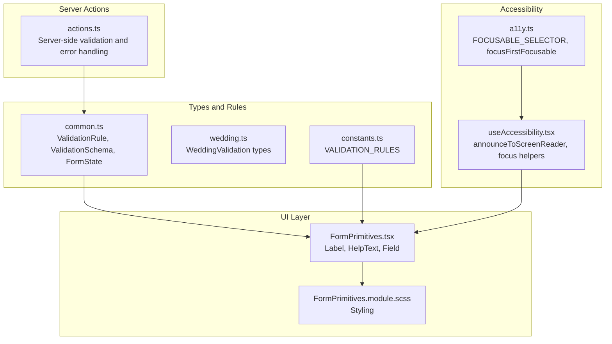
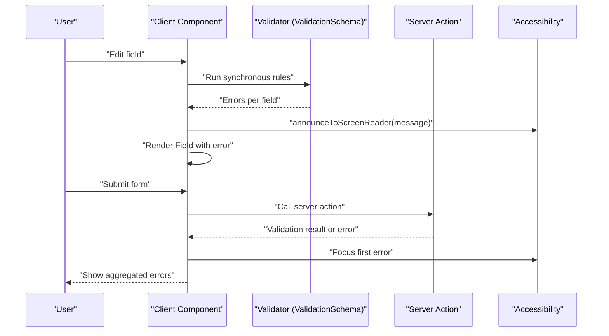
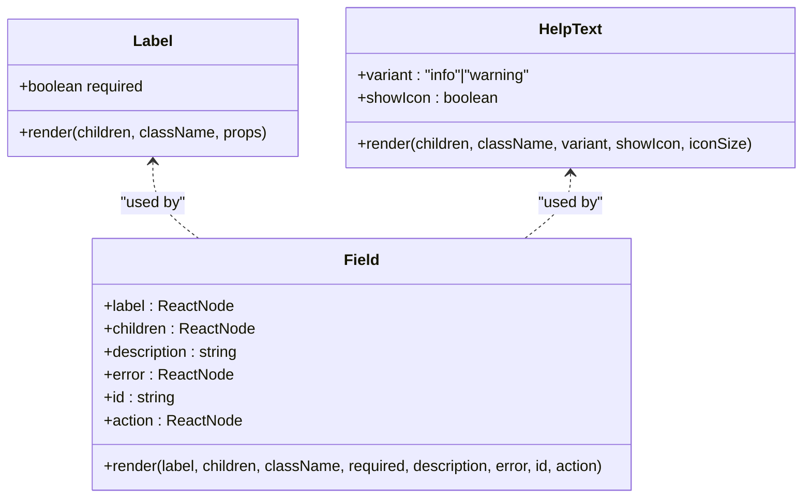
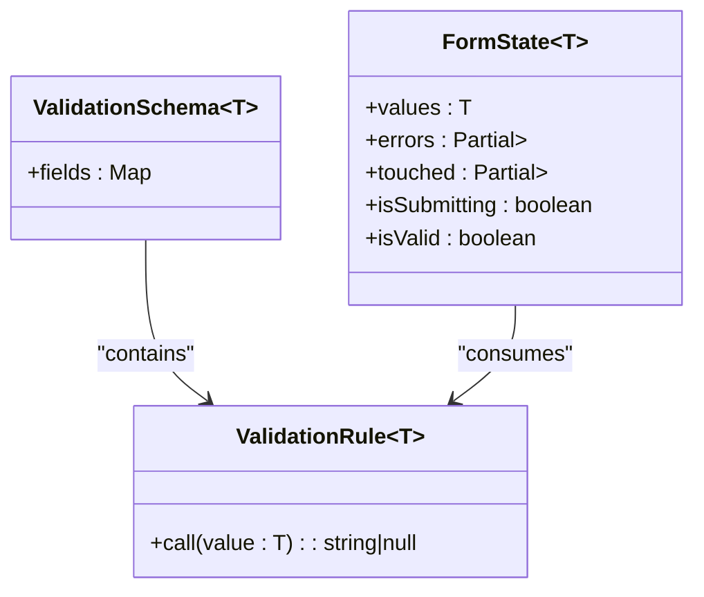
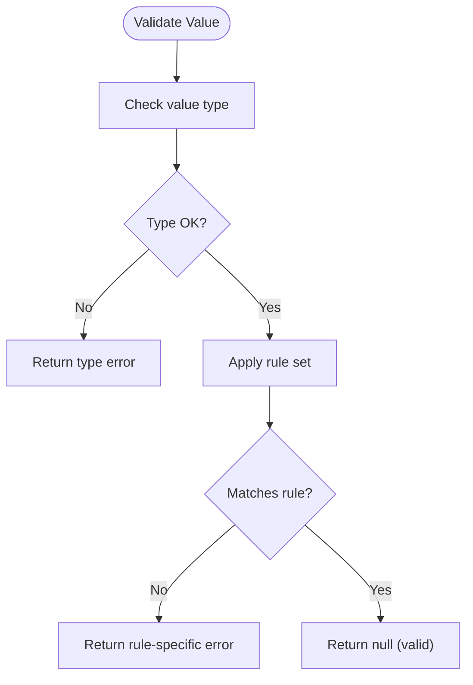
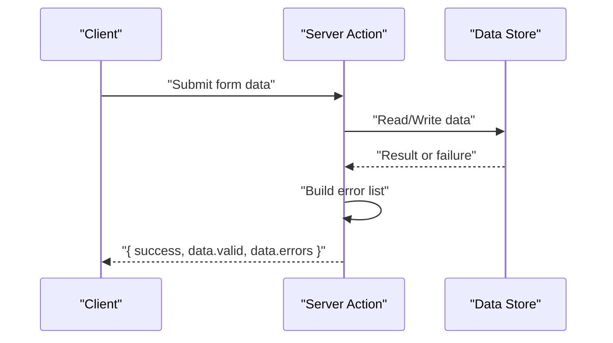
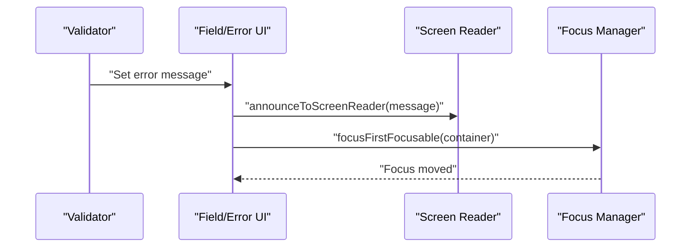
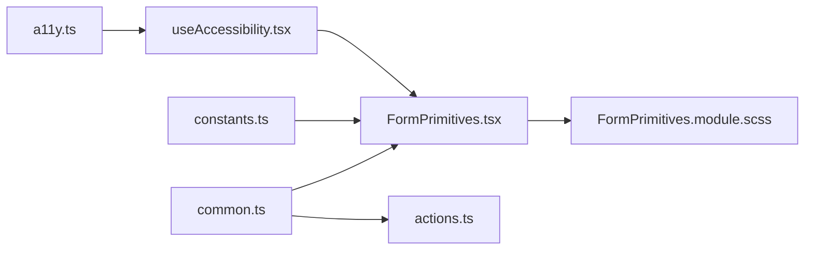

# Validation System

<cite>
**Referenced Files in This Document**
- [FormPrimitives.tsx](file://src/components/common/FormPrimitives/FormPrimitives.tsx)
- [FormPrimitives.module.scss](file://src/components/common/FormPrimitives/FormPrimitives.module.scss)
- [constants.ts](file://src/lib/constants.ts)
- [common.ts](file://src/types/common.ts)
- [wedding.ts](file://src/types/wedding.ts)
- [actions.ts](file://src/lib/actions.ts)
- [useAccessibility.tsx](file://src/hooks/useAccessibility.tsx)
- [a11y.ts](file://src/lib/a11y.ts)
- [BuilderPage.module.scss](file://src/app/builder/BuilderPage.module.scss)
</cite>

## Table of Contents
1. [Introduction](#introduction)
2. [Project Structure](#project-structure)
3. [Core Components](#core-components)
4. [Architecture Overview](#architecture-overview)
5. [Detailed Component Analysis](#detailed-component-analysis)
6. [Dependency Analysis](#dependency-analysis)
7. [Performance Considerations](#performance-considerations)
8. [Troubleshooting Guide](#troubleshooting-guide)
9. [Conclusion](#conclusion)

## Introduction
This document describes the validation system for form validation patterns and error handling mechanisms in the project. It explains the validation architecture, rule definitions, and error propagation throughout the form hierarchy. It also documents real-time validation feedback, conditional validation rules, asynchronous validation patterns, error message localization, validation timing strategies, and user experience considerations. Finally, it covers integration with accessibility features, screen reader announcements, and error focus management.

## Project Structure
The validation system spans several layers:
- UI primitives for form fields and error rendering
- Type definitions for validation schemas and form state
- Constants and rules for built-in validations
- Server actions for backend validation and error handling
- Accessibility utilities for screen reader announcements and focus management

**Diagram sources**
- [FormPrimitives.tsx](file://src/components/common/FormPrimitives/FormPrimitives.tsx#L1-L100)
- [FormPrimitives.module.scss](file://src/components/common/FormPrimitives/FormPrimitives.module.scss#L1-L80)
- [common.ts](file://src/types/common.ts#L32-L80)
- [wedding.ts](file://src/types/wedding.ts#L372-L389)
- [constants.ts](file://src/lib/constants.ts#L30-L46)
- [actions.ts](file://src/lib/actions.ts#L172-L200)
- [useAccessibility.tsx](file://src/hooks/useAccessibility.tsx#L64-L76)
- [a11y.ts](file://src/lib/a11y.ts#L1-L19)

**Section sources**
- [FormPrimitives.tsx](file://src/components/common/FormPrimitives/FormPrimitives.tsx#L1-L100)
- [FormPrimitives.module.scss](file://src/components/common/FormPrimitives/FormPrimitives.module.scss#L1-L80)
- [common.ts](file://src/types/common.ts#L32-L80)
- [wedding.ts](file://src/types/wedding.ts#L372-L389)
- [constants.ts](file://src/lib/constants.ts#L30-L46)
- [actions.ts](file://src/lib/actions.ts#L172-L200)
- [useAccessibility.tsx](file://src/hooks/useAccessibility.tsx#L64-L76)
- [a11y.ts](file://src/lib/a11y.ts#L1-L19)

## Core Components
- Form primitives: Label, HelpText, and Field encapsulate labeling, help text, and error presentation.
- Validation types: ValidationRule and ValidationSchema define the contract for synchronous validators and per-field rule lists.
- Built-in rules: VALIDATION_RULES centralizes common constraints for names, messages, phone, and email.
- Form state: FormState tracks values, errors, touched flags, submission state, and validity.
- Server actions: Server-side validation aggregates errors and wraps them in a response shape.
- Accessibility: Screen reader announcements and focus helpers support inclusive error handling.

**Section sources**
- [FormPrimitives.tsx](file://src/components/common/FormPrimitives/FormPrimitives.tsx#L13-L93)
- [common.ts](file://src/types/common.ts#L32-L80)
- [constants.ts](file://src/lib/constants.ts#L30-L46)
- [actions.ts](file://src/lib/actions.ts#L172-L200)
- [useAccessibility.tsx](file://src/hooks/useAccessibility.tsx#L64-L76)

## Architecture Overview
The validation architecture combines:
- Synchronous validation via ValidationSchema and ValidationRule
- Asynchronous validation via server actions and retry utilities
- Real-time feedback through Field and HelpText
- Accessibility-driven error presentation and focus management

**Diagram sources**
- [common.ts](file://src/types/common.ts#L32-L80)
- [actions.ts](file://src/lib/actions.ts#L172-L200)
- [useAccessibility.tsx](file://src/hooks/useAccessibility.tsx#L64-L76)

## Detailed Component Analysis

### Form Primitives
The FormPrimitives module defines reusable UI elements for forms:
- Label: Renders labels with optional required indicator.
- HelpText: Displays contextual info or warnings with icons.
- Field: Groups label, control, description, and error messages, applying appropriate styles.

These primitives propagate errors from validation to the UI and support accessibility by associating labels with controls via htmlFor.

**Diagram sources**
- [FormPrimitives.tsx](file://src/components/common/FormPrimitives/FormPrimitives.tsx#L13-L93)

**Section sources**
- [FormPrimitives.tsx](file://src/components/common/FormPrimitives/FormPrimitives.tsx#L13-L93)
- [FormPrimitives.module.scss](file://src/components/common/FormPrimitives/FormPrimitives.module.scss#L4-L80)

### Validation Types and Schema
ValidationRule and ValidationSchema define a composable synchronous validation model:
- ValidationRule<T> accepts a value and returns a string error message or null.
- ValidationSchema<T> maps field names to arrays of ValidationRule functions.

FormState<T> tracks values, errors, touched flags, submission state, and overall validity, enabling real-time feedback and conditional logic.

**Diagram sources**
- [common.ts](file://src/types/common.ts#L32-L80)

**Section sources**
- [common.ts](file://src/types/common.ts#L32-L80)

### Built-in Validation Rules
VALIDATION_RULES centralizes common constraints:
- Name length limits
- Message length limits
- Phone pattern
- Email pattern

These constants can be composed into ValidationSchema entries to enforce consistent rules across forms.

**Diagram sources**
- [constants.ts](file://src/lib/constants.ts#L30-L46)

**Section sources**
- [constants.ts](file://src/lib/constants.ts#L30-L46)

### Server-Side Validation and Error Handling
Server actions perform backend validation and return structured responses:
- Aggregate field-level errors into a normalized shape
- Wrap errors in a consistent response envelope
- Provide a helper to normalize unknown errors into user-friendly messages

This enables robust async validation and centralized error handling.

**Diagram sources**
- [actions.ts](file://src/lib/actions.ts#L172-L200)

**Section sources**
- [actions.ts](file://src/lib/actions.ts#L172-L200)

### Accessibility and Error Focus Management
Accessibility utilities support inclusive validation experiences:
- announceToScreenReader creates a live region element to announce validation messages to assistive technologies
- focusFirstFocusable focuses the first focusable element within a container
- FOCUSABLE_SELECTOR identifies focusable elements for traps and navigation

These utilities integrate with validation to ensure errors are announced and focus is managed appropriately after validation runs.

**Diagram sources**
- [useAccessibility.tsx](file://src/hooks/useAccessibility.tsx#L64-L76)
- [a11y.ts](file://src/lib/a11y.ts#L1-L19)

**Section sources**
- [useAccessibility.tsx](file://src/hooks/useAccessibility.tsx#L64-L76)
- [a11y.ts](file://src/lib/a11y.ts#L1-L19)

### Validation Timing Strategies
- On-change validation: Run synchronous rules immediately as users edit fields to provide real-time feedback.
- On-blur validation: Trigger additional checks when a field loses focus to reduce noise during typing.
- Submit-time validation: Aggregate all errors and present a consolidated summary.
- Async validation: Debounce or batch async checks (e.g., uniqueness) and surface results alongside sync errors.

These strategies balance responsiveness with performance and user experience.

[No sources needed since this section provides general guidance]

### Conditional Validation Rules
Conditional rules can be implemented by composing ValidationRule functions:
- Gate subsequent rules based on other field values
- Dynamically adjust min/max lengths or patterns depending on selections
- Chain dependent validations (e.g., require alternate contact if primary is empty)

Compose ValidationRule arrays in ValidationSchema to express chains and conditions.

**Section sources**
- [common.ts](file://src/types/common.ts#L75-L79)

### Async Validation Patterns
Async validation typically follows:
- Debounce user input before invoking server actions
- Surface pending states while awaiting results
- Merge async errors with sync errors in FormState
- Retry failed async checks with exponential backoff

Retry utilities and server actions provide the building blocks for resilient async validation.

**Section sources**
- [actions.ts](file://src/lib/actions.ts#L172-L200)
- [lib/utils.ts](file://src/lib/utils.ts#L150-L171)

### Error Message Localization
Localization can be achieved by:
- Storing localized messages keyed by rule identifiers
- Resolving messages from a locale-aware lookup function
- Using field-specific keys for dynamic parts (e.g., min/max values)
- Ensuring messages are concise and actionable

[No sources needed since this section provides general guidance]

### Real-Time Feedback and UX Considerations
- Render Field with error messages immediately upon validation
- Use HelpText to provide hints and context alongside errors
- Avoid overwhelming users with too many simultaneous errors; consider debouncing
- Provide clear visual hierarchy: warnings vs. errors
- Ensure keyboard and screen reader compatibility

**Section sources**
- [FormPrimitives.tsx](file://src/components/common/FormPrimitives/FormPrimitives.tsx#L67-L93)
- [FormPrimitives.module.scss](file://src/components/common/FormPrimitives/FormPrimitives.module.scss#L66-L70)

### Custom Validators and Validation Chaining
- Define ValidationRule functions for domain-specific checks
- Compose multiple rules per field to implement chaining
- Use ValidationSchema to register rule chains per field
- Keep rules pure and deterministic for reliable caching and testing

**Section sources**
- [common.ts](file://src/types/common.ts#L75-L79)

### Form-Wide Validation States
- Compute isValid from FormState based on presence of errors and submission state
- Track isSubmitting to disable submit buttons and prevent duplicate submissions
- Maintain touched flags to decide when to show errors (e.g., after blur or submit)
- Aggregate errors into a flat list for summary displays

**Section sources**
- [common.ts](file://src/types/common.ts#L38-L44)

### Integration with Accessibility Features
- Announce validation messages to screen readers using aria-live regions
- Focus the first error container or control after validation completes
- Provide skip links and focus traps for modal-like builders
- Ensure labels and descriptions are associated with inputs for assistive technologies

**Section sources**
- [useAccessibility.tsx](file://src/hooks/useAccessibility.tsx#L64-L76)
- [a11y.ts](file://src/lib/a11y.ts#L1-L19)
- [BuilderPage.module.scss](file://src/app/builder/BuilderPage.module.scss#L1-L425)

## Dependency Analysis
The validation system exhibits layered dependencies:
- UI primitives depend on styling and react components
- Types define contracts consumed by components and server actions
- Rules and schemas are independent and reusable
- Server actions depend on types and return normalized responses
- Accessibility utilities are standalone but integrated into UI flows

**Diagram sources**
- [FormPrimitives.tsx](file://src/components/common/FormPrimitives/FormPrimitives.tsx#L1-L100)
- [FormPrimitives.module.scss](file://src/components/common/FormPrimitives/FormPrimitives.module.scss#L1-L80)
- [common.ts](file://src/types/common.ts#L32-L80)
- [constants.ts](file://src/lib/constants.ts#L30-L46)
- [actions.ts](file://src/lib/actions.ts#L172-L200)
- [useAccessibility.tsx](file://src/hooks/useAccessibility.tsx#L64-L76)
- [a11y.ts](file://src/lib/a11y.ts#L1-L19)

**Section sources**
- [FormPrimitives.tsx](file://src/components/common/FormPrimitives/FormPrimitives.tsx#L1-L100)
- [common.ts](file://src/types/common.ts#L32-L80)
- [constants.ts](file://src/lib/constants.ts#L30-L46)
- [actions.ts](file://src/lib/actions.ts#L172-L200)
- [useAccessibility.tsx](file://src/hooks/useAccessibility.tsx#L64-L76)
- [a11y.ts](file://src/lib/a11y.ts#L1-L19)

## Performance Considerations
- Debounce expensive async validations to avoid excessive network calls
- Memoize computed errors and touched states to minimize re-renders
- Batch UI updates after validation to reduce layout thrashing
- Prefer client-side validations for cheap checks; reserve server actions for expensive or cross-entity checks

[No sources needed since this section provides general guidance]

## Troubleshooting Guide
- If errors are not announced to screen readers, verify announceToScreenReader is called and the DOM element is appended and removed correctly.
- If focus does not move to the first error, confirm focusFirstFocusable receives a valid container and that the container includes focusable elements.
- If server action errors are not surfaced, check handleServerActionError normalization and ensure the response shape matches expectations.
- If Field does not render errors, verify error prop is passed and styles apply correctly.

**Section sources**
- [useAccessibility.tsx](file://src/hooks/useAccessibility.tsx#L64-L76)
- [a11y.ts](file://src/lib/a11y.ts#L4-L19)
- [actions.ts](file://src/lib/actions.ts#L191-L200)
- [FormPrimitives.tsx](file://src/components/common/FormPrimitives/FormPrimitives.tsx#L85-L89)

## Conclusion
The validation system integrates synchronous and asynchronous validation with real-time feedback and strong accessibility support. By leveraging ValidationSchema and ValidationRule, composing conditional and chained validators, and coordinating with server actions and accessibility utilities, the system delivers a responsive, inclusive, and maintainable form validation experience.