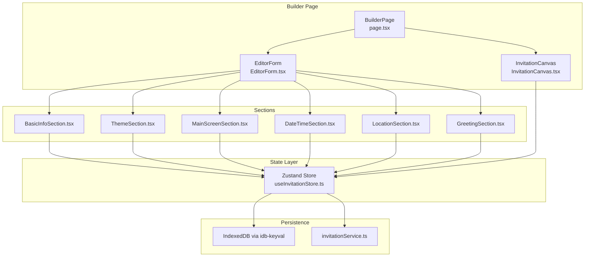
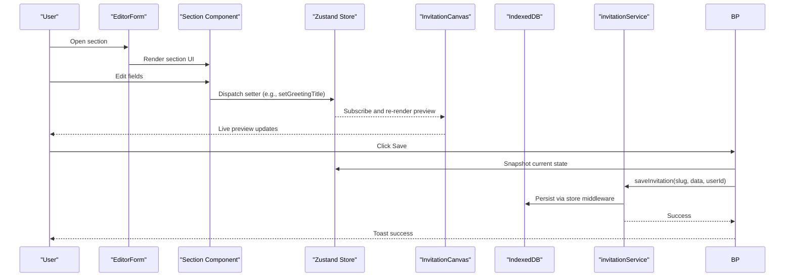
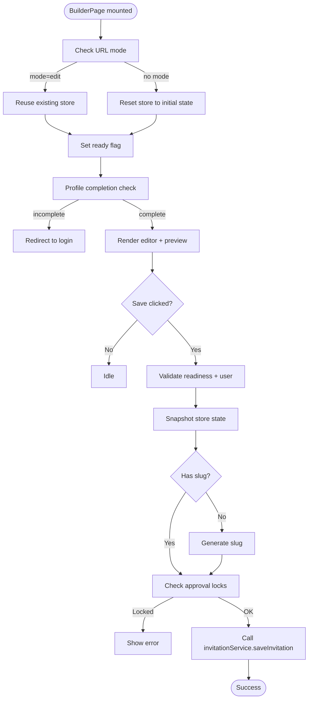
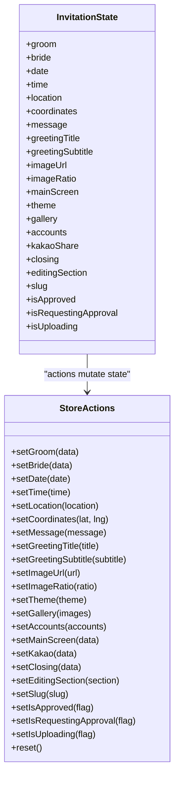
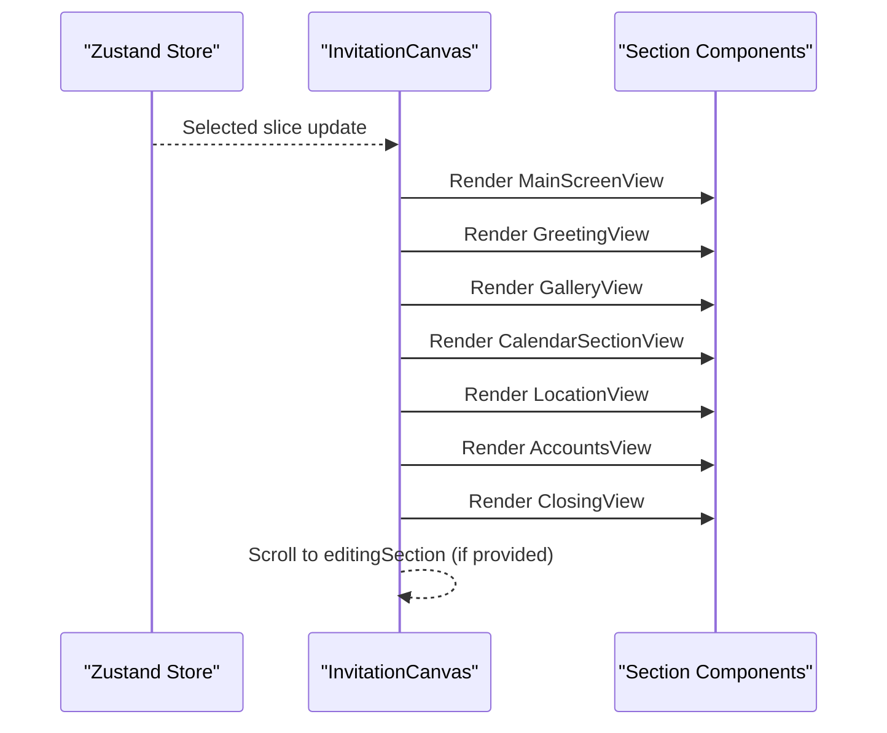
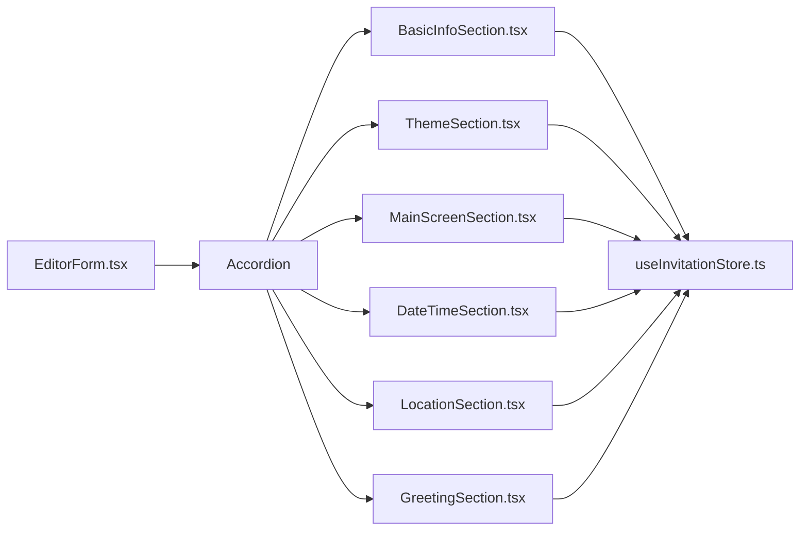
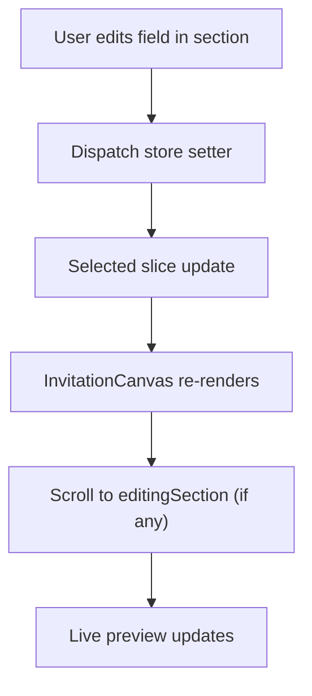
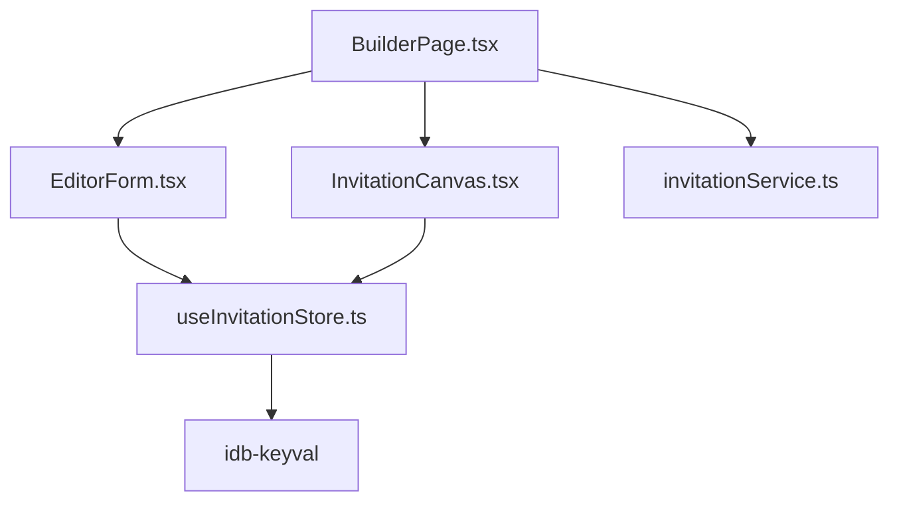

# Invitation Builder System

<cite>
**Referenced Files in This Document**
- [page.tsx](file://src/app/builder/page.tsx)
- [BuilderPage.module.scss](file://src/app/builder/BuilderPage.module.scss)
- [useInvitationStore.ts](file://src/store/useInvitationStore.ts)
- [InvitationCanvas.tsx](file://src/components/preview/InvitationCanvas.tsx)
- [PreviewAccordion.tsx](file://src/components/preview/PreviewAccordion.tsx)
- [EditorForm.tsx](file://src/components/common/EditorForm/EditorForm.tsx)
- [BasicInfoSection.tsx](file://src/components/builder/sections/BasicInfoSection.tsx)
- [MainScreenSection.tsx](file://src/components/builder/sections/MainScreenSection.tsx)
- [ThemeSection.tsx](file://src/components/builder/sections/ThemeSection.tsx)
- [DateTimeSection.tsx](file://src/components/builder/sections/DateTimeSection.tsx)
- [LocationSection.tsx](file://src/components/builder/sections/LocationSection.tsx)
- [GreetingSection.tsx](file://src/components/builder/sections/GreetingSection.tsx)
- [invitationService.ts](file://src/services/invitationService.ts)
- [builder.ts](file://src/types/builder.ts)
</cite>

## Table of Contents
1. [Introduction](#introduction)
2. [Project Structure](#project-structure)
3. [Core Components](#core-components)
4. [Architecture Overview](#architecture-overview)
5. [Detailed Component Analysis](#detailed-component-analysis)
6. [Dependency Analysis](#dependency-analysis)
7. [Performance Considerations](#performance-considerations)
8. [Troubleshooting Guide](#troubleshooting-guide)
9. [Conclusion](#conclusion)

## Introduction
This document explains the real-time invitation creation interface built with a section-based editing approach and live preview. It covers the builder page architecture, state management using a Zustand store with IndexedDB persistence, URL-based mode differentiation, and the real-time preview pipeline that propagates changes from form inputs to visual representation. It also documents the modular section system enabling extensibility, user experience considerations such as mobile-first design and responsive editing, and collaborative editing readiness.

## Project Structure
The builder system centers around a single-page application with a sidebar editor and a live preview area. The editor is composed of modular sections, each mapped to a specific part of the invitation (e.g., basic info, theme, greeting, gallery). The preview renders a mobile-frame simulation and dynamically reflects the current state from the store.

**Diagram sources**
- [page.tsx](file://src/app/builder/page.tsx#L42-L223)
- [EditorForm.tsx](file://src/components/common/EditorForm/EditorForm.tsx#L35-L104)
- [InvitationCanvas.tsx](file://src/components/preview/InvitationCanvas.tsx#L455-L468)
- [useInvitationStore.ts](file://src/store/useInvitationStore.ts#L373-L533)
- [invitationService.ts](file://src/services/invitationService.ts#L9-L24)

**Section sources**
- [page.tsx](file://src/app/builder/page.tsx#L1-L232)
- [EditorForm.tsx](file://src/components/common/EditorForm/EditorForm.tsx#L1-L109)

## Core Components
- Builder page orchestrator: Initializes mode, guards auth, renders sidebar/editor and preview, and handles saving.
- Zustand store: Centralized state with IndexedDB persistence and merge strategy for evolving schemas.
- InvitationCanvas: Live preview renderer that maps store state to visual sections.
- EditorForm: Aggregates modular sections and manages which section is currently edited.
- Modular sections: Each section encapsulates a domain (basic info, theme, greeting, etc.) and updates the store.

Key responsibilities:
- Real-time propagation: Changes in sections update the store; the preview subscribes to store slices and re-renders.
- Persistence: Store persists to IndexedDB; server sync handled by service layer.
- Mode differentiation: URL parameter determines whether to reset store or reuse existing data.

**Section sources**
- [useInvitationStore.ts](file://src/store/useInvitationStore.ts#L1-L534)
- [InvitationCanvas.tsx](file://src/components/preview/InvitationCanvas.tsx#L1-L469)
- [EditorForm.tsx](file://src/components/common/EditorForm/EditorForm.tsx#L1-L109)
- [page.tsx](file://src/app/builder/page.tsx#L42-L223)

## Architecture Overview
The system follows a unidirectional data flow:
- Users edit sections in the sidebar.
- Each section writes to the Zustand store.
- InvitationCanvas subscribes to relevant store slices and renders the invitation.
- Saving persists to IndexedDB and optionally syncs to the backend.

**Diagram sources**
- [page.tsx](file://src/app/builder/page.tsx#L87-L127)
- [EditorForm.tsx](file://src/components/common/EditorForm/EditorForm.tsx#L35-L104)
- [useInvitationStore.ts](file://src/store/useInvitationStore.ts#L373-L533)
- [InvitationCanvas.tsx](file://src/components/preview/InvitationCanvas.tsx#L455-L468)
- [invitationService.ts](file://src/services/invitationService.ts#L9-L24)

## Detailed Component Analysis

### Builder Page (Real-Time Editing Surface)
- Mode differentiation: Uses URL parameter to decide whether to reset store or reuse existing data.
- Authentication guard: Redirects to login if profile is incomplete.
- Mobile-first preview: Desktop shows a framed preview; mobile opens a drawer overlay.
- Save workflow: Validates readiness, snapshots store, generates slug if missing, checks approval locks, and persists.

**Diagram sources**
- [page.tsx](file://src/app/builder/page.tsx#L60-L127)

**Section sources**
- [page.tsx](file://src/app/builder/page.tsx#L42-L223)
- [BuilderPage.module.scss](file://src/app/builder/BuilderPage.module.scss#L1-L425)

### Zustand Store and IndexedDB Persistence
- State shape: Comprehensive domain model for invitation metadata, theme, sections, and UI flags.
- Persistence: Middleware stores state in IndexedDB via idb-keyval with JSON serialization.
- Merge strategy: Ensures backward compatibility when new fields are added.
- Actions: Granular setters per domain (e.g., setGreetingTitle, setTheme, setMainScreen).
- UI state: Tracks the currently edited section to drive preview focus.

**Diagram sources**
- [useInvitationStore.ts](file://src/store/useInvitationStore.ts#L4-L230)

**Section sources**
- [useInvitationStore.ts](file://src/store/useInvitationStore.ts#L373-L533)

### InvitationCanvas (Live Preview Renderer)
- Selective subscription: Extracts only necessary fields from the store to minimize re-renders.
- Section ordering: Renders sections in a fixed order (main screen, greeting, gallery, calendar/DDay, location, accounts, closing).
- Editing focus: Scrolls to the currently edited section; smooth scroll for desktop, delayed reveal for mobile drawer.
- Effects and overlays: Applies theme effects and optional watermarks for unapproved live pages.

**Diagram sources**
- [InvitationCanvas.tsx](file://src/components/preview/InvitationCanvas.tsx#L91-L144)
- [InvitationCanvas.tsx](file://src/components/preview/InvitationCanvas.tsx#L316-L430)

**Section sources**
- [InvitationCanvas.tsx](file://src/components/preview/InvitationCanvas.tsx#L1-L469)

### EditorForm and Modular Sections
- Composition: EditorForm statically imports all sections and renders them in a single accordion.
- Editing state: Tracks which section is open and sets the current editing section accordingly.
- Section contracts: Each section receives isOpen and value props and uses shallow selectors to subscribe to store.

**Diagram sources**
- [EditorForm.tsx](file://src/components/common/EditorForm/EditorForm.tsx#L22-L33)
- [EditorForm.tsx](file://src/components/common/EditorForm/EditorForm.tsx#L88-L101)

**Section sources**
- [EditorForm.tsx](file://src/components/common/EditorForm/EditorForm.tsx#L1-L109)
- [BasicInfoSection.tsx](file://src/components/builder/sections/BasicInfoSection.tsx#L1-L134)
- [ThemeSection.tsx](file://src/components/builder/sections/ThemeSection.tsx#L1-L136)
- [MainScreenSection.tsx](file://src/components/builder/sections/MainScreenSection.tsx#L1-L60)
- [DateTimeSection.tsx](file://src/components/builder/sections/DateTimeSection.tsx#L1-L95)
- [LocationSection.tsx](file://src/components/builder/sections/LocationSection.tsx#L1-L25)
- [GreetingSection.tsx](file://src/components/builder/sections/GreetingSection.tsx#L1-L199)

### Real-Time Preview Workflow
- From input to visual: Each section’s input triggers a Zustand setter; InvitationCanvas subscribes to the relevant slice and re-renders the matching section.
- Mobile preview: A sheet overlay displays a scaled mobile frame with a close button; scroll behavior is optimized for drawer animations.
- Accessibility: Uses semantic markup and ARIA labels for preview controls.

**Diagram sources**
- [EditorForm.tsx](file://src/components/common/EditorForm/EditorForm.tsx#L44-L59)
- [InvitationCanvas.tsx](file://src/components/preview/InvitationCanvas.tsx#L216-L288)

**Section sources**
- [InvitationCanvas.tsx](file://src/components/preview/InvitationCanvas.tsx#L150-L288)
- [EditorForm.tsx](file://src/components/common/EditorForm/EditorForm.tsx#L35-L65)

### State Synchronization Patterns
- Shallow selection: Sections use shallow selectors to subscribe to only the fields they need, reducing unnecessary re-renders.
- Editing focus: The store tracks editingSection; the preview scrolls to the relevant section for immediate feedback.
- Merge strategy: When restoring from IndexedDB, the store merges persisted fields with current defaults to support schema evolution.

**Section sources**
- [EditorForm.tsx](file://src/components/common/EditorForm/EditorForm.tsx#L38-L41)
- [useInvitationStore.ts](file://src/store/useInvitationStore.ts#L491-L530)

### Practical Examples: Section Editing Workflows
- Theme customization: Changing font, accent color, or background pattern immediately updates the preview canvas via theme slice.
- Greeting composition: Editing title/subtitle/content in the greeting section updates the preview in real time.
- Gallery management: Adding/removing images updates the gallery section; preview reflects changes instantly.
- Location configuration: Updating address and map options toggles visibility and navigation in the location section.

**Section sources**
- [ThemeSection.tsx](file://src/components/builder/sections/ThemeSection.tsx#L22-L136)
- [GreetingSection.tsx](file://src/components/builder/sections/GreetingSection.tsx#L24-L199)
- [InvitationCanvas.tsx](file://src/components/preview/InvitationCanvas.tsx#L350-L362)

### Collaborative Editing Considerations
- Current state: Single-user local editing with IndexedDB persistence.
- Extension points: The store and service layer are designed for future enhancements (e.g., real-time sync, conflict resolution, presence indicators).
- Data boundaries: Invitation data is normalized and persisted via service methods, enabling potential multi-client scenarios.

**Section sources**
- [invitationService.ts](file://src/services/invitationService.ts#L9-L24)
- [useInvitationStore.ts](file://src/store/useInvitationStore.ts#L474-L533)

## Dependency Analysis
- BuilderPage depends on EditorForm and InvitationCanvas, and interacts with the store and services.
- EditorForm depends on modular section components and the store for state.
- InvitationCanvas depends on the store and renders section components.
- Services depend on Supabase client and expose save/get operations.

**Diagram sources**
- [page.tsx](file://src/app/builder/page.tsx#L24-L28)
- [EditorForm.tsx](file://src/components/common/EditorForm/EditorForm.tsx#L10-L21)
- [InvitationCanvas.tsx](file://src/components/preview/InvitationCanvas.tsx#L6-L18)
- [useInvitationStore.ts](file://src/store/useInvitationStore.ts#L2-L2)
- [invitationService.ts](file://src/services/invitationService.ts#L4-L7)

**Section sources**
- [page.tsx](file://src/app/builder/page.tsx#L1-L232)
- [EditorForm.tsx](file://src/components/common/EditorForm/EditorForm.tsx#L1-L109)
- [InvitationCanvas.tsx](file://src/components/preview/InvitationCanvas.tsx#L1-L469)
- [useInvitationStore.ts](file://src/store/useInvitationStore.ts#L1-L534)
- [invitationService.ts](file://src/services/invitationService.ts#L1-L81)

## Performance Considerations
- Memoization: InvitationCanvasContent and section components are memoized to avoid redundant renders.
- Selective subscriptions: Shallow selectors limit re-renders to affected components.
- Dynamic imports: Heavy preview components are dynamically imported to reduce initial bundle size.
- Scroll optimization: Preview uses stable offsets and delayed reveal for drawer animations to prevent layout thrash.
- IndexedDB limits: IndexedDB storage supports larger payloads compared to localStorage, enabling richer galleries.

[No sources needed since this section provides general guidance]

## Troubleshooting Guide
- Preview not updating: Verify the section is open and the editingSection is set; ensure shallow selectors are used in sections.
- Mobile preview blank: Confirm the drawer is open and the preview is not hidden behind z-index stacking; check for errors in dynamic imports.
- Save fails: Check user authentication, approval locks, and network connectivity; inspect service error handling.
- Data lost after refresh: Confirm IndexedDB persistence is available and the merge strategy is functioning.

**Section sources**
- [InvitationCanvas.tsx](file://src/components/preview/InvitationCanvas.tsx#L216-L288)
- [EditorForm.tsx](file://src/components/common/EditorForm/EditorForm.tsx#L44-L59)
- [invitationService.ts](file://src/services/invitationService.ts#L9-L24)

## Conclusion
The invitation builder combines a modular, section-based editor with a real-time preview powered by Zustand and IndexedDB. The system emphasizes responsiveness, mobile-first design, and extensibility. With shallow selectors, selective subscriptions, and optimized scroll behavior, it delivers a smooth editing experience. The store’s merge strategy and service layer provide a foundation for future enhancements such as collaborative editing and advanced sharing features.