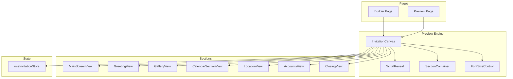
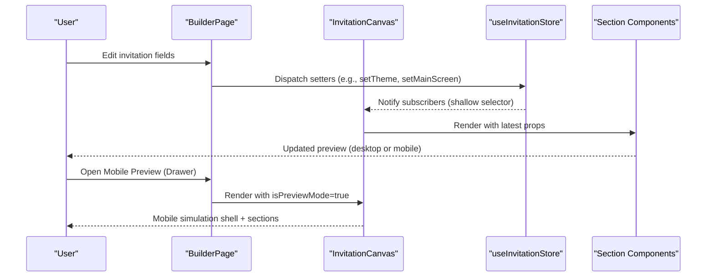
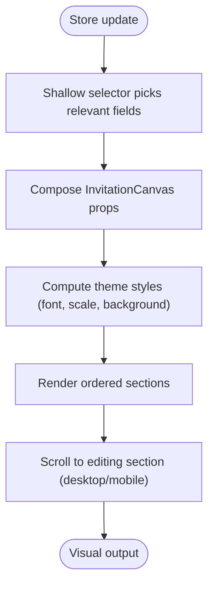
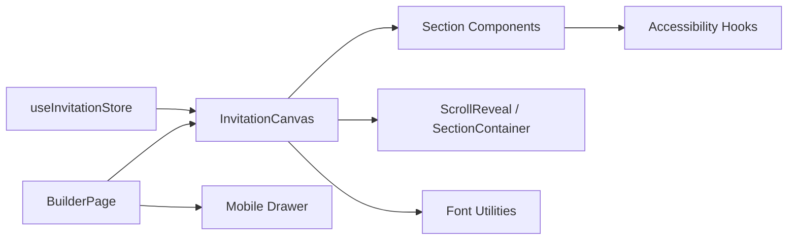

# Real-time Preview System

<cite>
**Referenced Files in This Document**
- [src/app/preview/page.tsx](file://src/app/preview/page.tsx)
- [src/components/preview/InvitationCanvas.tsx](file://src/components/preview/InvitationCanvas.tsx)
- [src/store/useInvitationStore.ts](file://src/store/useInvitationStore.ts)
- [src/app/builder/page.tsx](file://src/app/builder/page.tsx)
- [src/components/preview/sections/MainScreenView.tsx](file://src/components/preview/sections/MainScreenView.tsx)
- [src/components/preview/sections/GreetingView.tsx](file://src/components/preview/sections/GreetingView.tsx)
- [src/components/preview/sections/GalleryView.tsx](file://src/components/preview/sections/GalleryView.tsx)
- [src/components/preview/sections/CalendarSectionView.tsx](file://src/components/preview/sections/CalendarSectionView.tsx)
- [src/components/preview/sections/LocationView.tsx](file://src/components/preview/sections/LocationView.tsx)
- [src/components/preview/sections/AccountsView.tsx](file://src/components/preview/sections/AccountsView.tsx)
- [src/components/preview/sections/ClosingView.tsx](file://src/components/preview/sections/ClosingView.tsx)
- [src/components/preview/ScrollReveal.tsx](file://src/components/preview/ScrollReveal.tsx)
- [src/components/preview/SectionContainer.tsx](file://src/components/preview/SectionContainer.tsx)
- [src/components/preview/PreviewAccordion.tsx](file://src/components/preview/PreviewAccordion.tsx)
- [src/components/preview/elements/FontSizeControl/index.tsx](file://src/components/preview/elements/FontSizeControl/index.tsx)
- [src/lib/utils/font.ts](file://src/lib/utils/font.ts)
- [src/constants/motion.ts](file://src/constants/motion.ts)
- [src/hooks/use-media-query.ts](file://src/hooks/use-media-query.ts)
- [src/components/preview/InvitationCanvas.module.scss](file://src/components/preview/InvitationCanvas.module.scss)
</cite>

## Table of Contents
1. [Introduction](#introduction)
2. [Project Structure](#project-structure)
3. [Core Components](#core-components)
4. [Architecture Overview](#architecture-overview)
5. [Detailed Component Analysis](#detailed-component-analysis)
6. [Dependency Analysis](#dependency-analysis)
7. [Performance Considerations](#performance-considerations)
8. [Troubleshooting Guide](#troubleshooting-guide)
9. [Conclusion](#conclusion)

## Introduction
This document explains the real-time preview system for dynamic invitation rendering. It focuses on the InvitationCanvas component, section rendering pipeline, mobile simulation, preview modes (desktop vs. mobile), responsive scaling, performance optimizations, and integration with the builder interface. It also covers customization points, animations, interactive elements, real-time updates, collaborative editing considerations, debugging, performance monitoring, and cross-platform compatibility.

## Project Structure
The preview system is organized around a central InvitationCanvas that composes multiple presentation-focused section components. The builder page integrates the preview with a mobile simulator and real-time updates from the Zustand store.

**Diagram sources**
- [src/app/preview/page.tsx](file://src/app/preview/page.tsx#L1-L10)
- [src/app/builder/page.tsx](file://src/app/builder/page.tsx#L1-L232)
- [src/components/preview/InvitationCanvas.tsx](file://src/components/preview/InvitationCanvas.tsx#L1-L469)
- [src/store/useInvitationStore.ts](file://src/store/useInvitationStore.ts#L1-L534)

**Section sources**
- [src/app/preview/page.tsx](file://src/app/preview/page.tsx#L1-L10)
- [src/app/builder/page.tsx](file://src/app/builder/page.tsx#L1-L232)

## Core Components
- InvitationCanvas: Central renderer that subscribes to the Zustand store, composes sections, manages scroll-to-section behavior, applies theme styles, and renders mobile simulation shells.
- Section components: Presentational components for each logical section (main screen, greeting, gallery, calendar/date, location/map, accounts, closing).
- ScrollReveal and SectionContainer: Provide entrance animations and consistent section layout.
- FontSizeControl: Adjusts font scale in preview mode.
- useInvitationStore: Global state for all invitation data, setters, and UI flags.

Key responsibilities:
- Real-time updates: Changes in the store trigger re-renders of InvitationCanvas and sections.
- Preview modes: Desktop preview in the builder and mobile preview in a drawer/sheet.
- Mobile simulation: Builder wraps the preview in a device frame and a drawer for mobile view.
- Responsive scaling: Font scale and theme-driven styles adapt to different contexts.

**Section sources**
- [src/components/preview/InvitationCanvas.tsx](file://src/components/preview/InvitationCanvas.tsx#L1-L469)
- [src/store/useInvitationStore.ts](file://src/store/useInvitationStore.ts#L1-L534)
- [src/components/preview/elements/FontSizeControl/index.tsx](file://src/components/preview/elements/FontSizeControl/index.tsx#L1-L67)

## Architecture Overview
The preview pipeline flows from store state to visual output through a strict composition hierarchy. The builder page controls preview modes and passes editing context to InvitationCanvas.

**Diagram sources**
- [src/app/builder/page.tsx](file://src/app/builder/page.tsx#L1-L232)
- [src/components/preview/InvitationCanvas.tsx](file://src/components/preview/InvitationCanvas.tsx#L1-L469)
- [src/store/useInvitationStore.ts](file://src/store/useInvitationStore.ts#L1-L534)

## Detailed Component Analysis

### InvitationCanvas: Rendering Engine
Responsibilities:
- Subscribe to store via shallow selector to minimize re-renders.
- Compose sections in a fixed order: main screen, greeting, gallery, calendar/DDay, location, accounts, closing.
- Manage scroll-to-section behavior for both desktop and mobile preview modes.
- Apply theme styles (font family, scale, background, effects).
- Render watermarks for unapproved live pages and modal portal root for overlays.
- Provide a FontSizeControl for preview-only adjustments.

Preview modes:
- Desktop preview: Full-width canvas with desktop scroll behavior.
- Mobile preview: Simulated device shell and drawer-based preview with isPreviewMode flag.

Performance optimizations:
- Memoization of composed content and derived styles.
- Conditional dynamic imports for heavy components (gallery, location map).
- Controlled initial reveal timing to avoid layout jitter during animated drawers.

Interactive elements:
- Editing section scrolling with stable offsets relative to scroll container.
- Watermark overlay for unapproved pages.
- Modal portal root for lightboxes and dialogs.

**Section sources**
- [src/components/preview/InvitationCanvas.tsx](file://src/components/preview/InvitationCanvas.tsx#L1-L469)
- [src/components/preview/InvitationCanvas.module.scss](file://src/components/preview/InvitationCanvas.module.scss#L1-L73)

### Section Rendering Pipeline
Each section receives only the props it needs, enabling strong decoupling and testability. The pipeline:
- Store state → Shallow selector → InvitationCanvas props → Section component → DOM.

Representative sections:
- MainScreenView: Renders header, photo area, and bottom info with layout variants and effects.
- GreetingView: Displays invitation message, optional image, and family relation blocks.
- GalleryView: Supports swiper, thumbnail, and grid layouts with lightbox modal and accessibility hooks.
- CalendarSectionView: Renders a calendar grid and D-Day countdown with token replacement.
- LocationView: Renders place info, map (dynamic), navigation links, and optional sketch.
- AccountsView: Displays gift account lists in expandable accordions.
- ClosingView: Final message, optional image, and sharing actions.

Animation and entrance:
- ScrollReveal observes sections and toggles visibility when intersecting.
- Respect reduced motion preferences via media query hook.

**Section sources**
- [src/components/preview/sections/MainScreenView.tsx](file://src/components/preview/sections/MainScreenView.tsx#L1-L402)
- [src/components/preview/sections/GreetingView.tsx](file://src/components/preview/sections/GreetingView.tsx#L1-L158)
- [src/components/preview/sections/GalleryView.tsx](file://src/components/preview/sections/GalleryView.tsx#L1-L310)
- [src/components/preview/sections/CalendarSectionView.tsx](file://src/components/preview/sections/CalendarSectionView.tsx#L1-L236)
- [src/components/preview/sections/LocationView.tsx](file://src/components/preview/sections/LocationView.tsx#L1-L206)
- [src/components/preview/sections/AccountsView.tsx](file://src/components/preview/sections/AccountsView.tsx#L1-L127)
- [src/components/preview/sections/ClosingView.tsx](file://src/components/preview/sections/ClosingView.tsx#L1-L197)
- [src/components/preview/ScrollReveal.tsx](file://src/components/preview/ScrollReveal.tsx#L1-L64)
- [src/components/preview/SectionContainer.tsx](file://src/components/preview/SectionContainer.tsx#L1-L50)
- [src/hooks/use-media-query.ts](file://src/hooks/use-media-query.ts#L1-L16)

### Mobile Simulation Features
The builder page simulates a mobile device with a physical frame and a drawer-based mobile preview:
- Device frame with status bar, dynamic island, and home indicator.
- Floating action button opens a right-side drawer containing the mobile preview.
- InvitationCanvas renders with isPreviewMode=true and editingSection context.

Responsive scaling:
- Font scale controlled via FontSizeControl in preview mode.
- Theme font selection applied globally via CSS variables.

Accessibility:
- Focus traps for modals.
- Reduced motion detection to disable entrance animations.
- Toast notifications for user actions (copy, share).

**Section sources**
- [src/app/builder/page.tsx](file://src/app/builder/page.tsx#L1-L232)
- [src/components/preview/elements/FontSizeControl/index.tsx](file://src/components/preview/elements/FontSizeControl/index.tsx#L1-L67)
- [src/lib/utils/font.ts](file://src/lib/utils/font.ts#L1-L57)
- [src/constants/motion.ts](file://src/constants/motion.ts#L1-L7)

### Preview Modes and Real-time Updates
Desktop preview:
- Live updates as the user edits fields in the builder sidebar.
- Editing section scrolls into view automatically.

Mobile preview:
- Drawer-based preview with isPreviewMode semantics.
- Same store-driven updates, but styled for mobile viewport.

Collaborative editing:
- The store persists state and merges new fields, supporting incremental schema evolution.
- Consider adding real-time synchronization layers (e.g., presence indicators, conflict resolution) at the application boundary if extending collaboration features.

**Section sources**
- [src/app/builder/page.tsx](file://src/app/builder/page.tsx#L1-L232)
- [src/store/useInvitationStore.ts](file://src/store/useInvitationStore.ts#L1-L534)

### Rendering Pipeline Details

**Diagram sources**
- [src/components/preview/InvitationCanvas.tsx](file://src/components/preview/InvitationCanvas.tsx#L91-L144)
- [src/lib/utils/font.ts](file://src/lib/utils/font.ts#L34-L56)

## Dependency Analysis
- InvitationCanvas depends on:
  - Zustand store via shallow selector.
  - Section components and shared UI primitives.
  - Dynamic imports for heavy components (gallery, location map).
  - Font utilities for theme application.
- Section components depend on:
  - Shared containers and animations.
  - Media queries for reduced motion.
  - Accessibility hooks for modals and focus management.
- Builder page orchestrates:
  - Dynamic InvitationCanvas import.
  - Mobile drawer and device shell.
  - Real-time save and navigation.

**Diagram sources**
- [src/store/useInvitationStore.ts](file://src/store/useInvitationStore.ts#L1-L534)
- [src/components/preview/InvitationCanvas.tsx](file://src/components/preview/InvitationCanvas.tsx#L1-L469)
- [src/app/builder/page.tsx](file://src/app/builder/page.tsx#L1-L232)

**Section sources**
- [src/store/useInvitationStore.ts](file://src/store/useInvitationStore.ts#L1-L534)
- [src/components/preview/InvitationCanvas.tsx](file://src/components/preview/InvitationCanvas.tsx#L1-L469)
- [src/app/builder/page.tsx](file://src/app/builder/page.tsx#L1-L232)

## Performance Considerations
- Selective reactivity:
  - Shallow selector ensures only relevant fields trigger re-renders.
- Memoization:
  - InvitationCanvasContent and section components are memoized to avoid unnecessary work.
- Dynamic imports:
  - Gallery and map components are loaded lazily to reduce initial bundle size.
- Animation safeguards:
  - Reduced motion preference disables entrance animations.
  - Initial scroll waits for layout stability to prevent layout thrashing.
- Rendering optimizations:
  - CSS transforms and translate3d hints improve compositing.
  - Fixed ratios and aspect ratio containers prevent layout shifts.
- Storage persistence:
  - IndexedDB-backed persistence avoids localStorage limitations and supports larger datasets.

Recommendations:
- Virtualize heavy galleries if the number of images grows significantly.
- Debounce scroll-to-section logic for rapid edits.
- Consider preloading critical assets for smoother transitions.

**Section sources**
- [src/components/preview/InvitationCanvas.tsx](file://src/components/preview/InvitationCanvas.tsx#L91-L144)
- [src/components/preview/ScrollReveal.tsx](file://src/components/preview/ScrollReveal.tsx#L1-L64)
- [src/hooks/use-media-query.ts](file://src/hooks/use-media-query.ts#L1-L16)

## Troubleshooting Guide
Common issues and resolutions:
- Preview not updating:
  - Verify store setters are called and shallow selector includes the affected field.
  - Confirm InvitationCanvas is subscribed to the store and not memoized away.
- Scroll-to-section fails:
  - Ensure the target section ID exists and the scroll container is mounted.
  - Check that initial scroll waits for portal and layout readiness.
- Mobile preview looks incorrect:
  - Confirm isPreviewMode flag is passed and editingSection is set appropriately.
  - Validate device shell and drawer are present in the builder layout.
- Animations feel janky:
  - Disable reduced motion in system settings to confirm.
  - Ensure initial scroll delay aligns with drawer animation duration.
- Watermark appears unexpectedly:
  - Check isApproved flag and isPreviewMode flag logic.
- Gallery or map not loading:
  - Confirm dynamic import loading states and network availability.
- Sharing issues:
  - Verify Kakao SDK initialization and app key configuration.

Debugging tips:
- Add logging around selector usage and scroll-to-section logic.
- Temporarily disable animations to isolate layout problems.
- Use browser devtools to inspect computed styles and intersection observer behavior.

**Section sources**
- [src/components/preview/InvitationCanvas.tsx](file://src/components/preview/InvitationCanvas.tsx#L215-L288)
- [src/components/preview/sections/LocationView.tsx](file://src/components/preview/sections/LocationView.tsx#L78-L94)
- [src/components/preview/sections/ClosingView.tsx](file://src/components/preview/sections/ClosingView.tsx#L63-L116)

## Conclusion
The real-time preview system centers on InvitationCanvas, which efficiently composes themed sections, manages scroll behavior, and adapts to both desktop and mobile contexts. Its integration with the builder interface enables seamless real-time updates, while performance optimizations and accessibility safeguards ensure a smooth user experience. Extending collaboration features would involve integrating real-time synchronization at the application boundary, building upon the existing store-driven architecture.