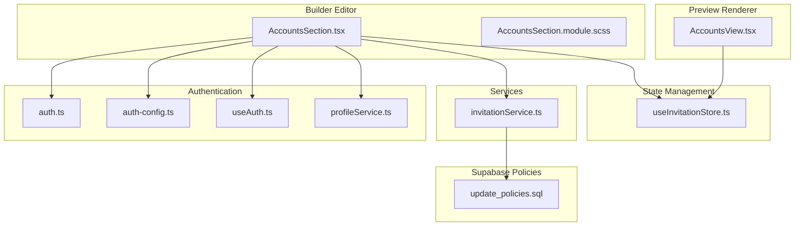
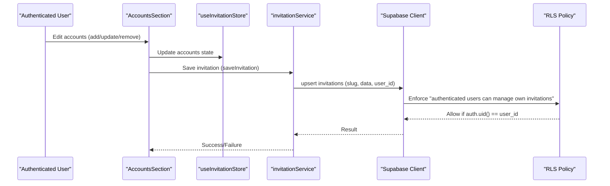
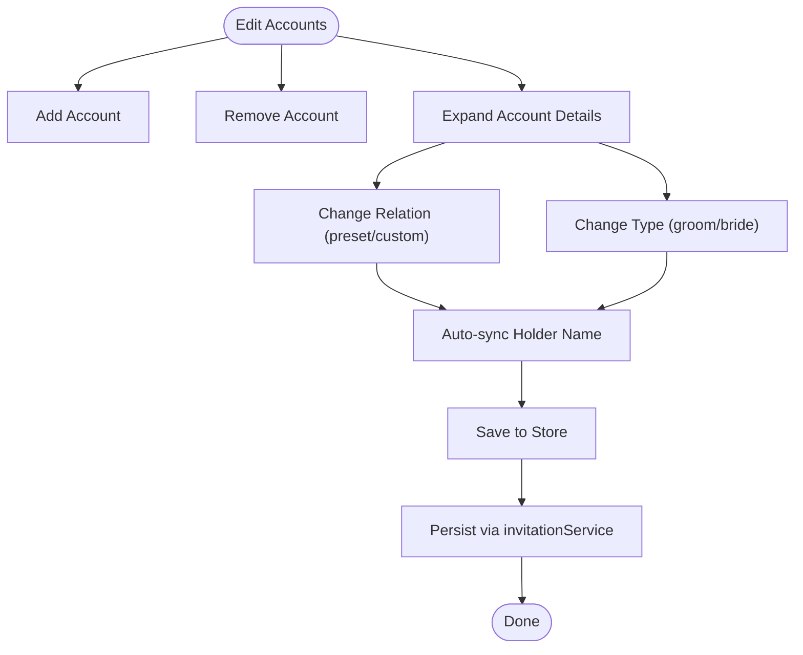
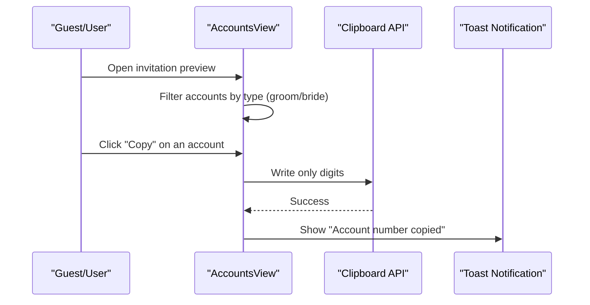
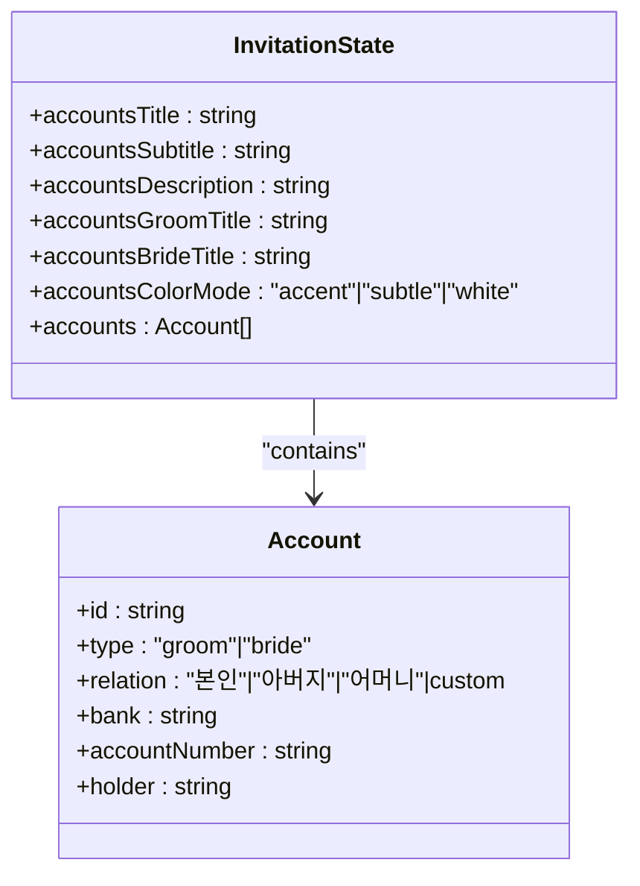
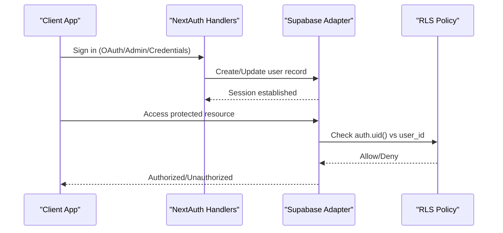
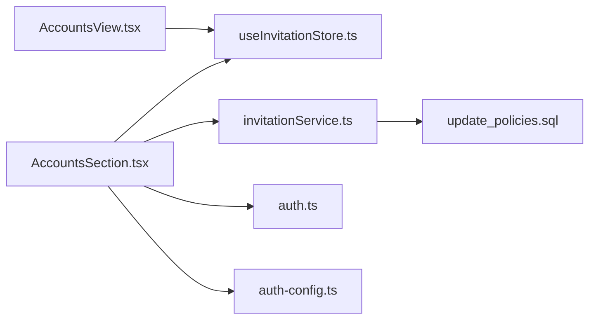

# Accounts Section

<cite>
**Referenced Files in This Document**
- [AccountsSection.tsx](file://src/components/builder/sections/AccountsSection.tsx)
- [AccountsSection.module.scss](file://src/components/builder/sections/AccountsSection.module.scss)
- [AccountsView.tsx](file://src/components/preview/sections/AccountsView.tsx)
- [useInvitationStore.ts](file://src/store/useInvitationStore.ts)
- [invitationService.ts](file://src/services/invitationService.ts)
- [client.ts](file://src/lib/supabase/client.ts)
- [auth.ts](file://src/auth.ts)
- [auth-config.ts](file://src/auth-config.ts)
- [useAuth.ts](file://src/hooks/useAuth.ts)
- [profileService.ts](file://src/services/profileService.ts)
- [route.ts](file://src/app/api/admin/invitations/route.ts)
- [route.ts](file://src/app/api/auth/[...nextauth]/route.ts)
- [update_policies.sql](file://supabase/migrations/20260109000001_update_policies.sql)
</cite>

## Table of Contents
1. [Introduction](#introduction)
2. [Project Structure](#project-structure)
3. [Core Components](#core-components)
4. [Architecture Overview](#architecture-overview)
5. [Detailed Component Analysis](#detailed-component-analysis)
6. [Dependency Analysis](#dependency-analysis)
7. [Performance Considerations](#performance-considerations)
8. [Troubleshooting Guide](#troubleshooting-guide)
9. [Conclusion](#conclusion)

## Introduction
The Accounts Section component manages account information for gift money collection in wedding invitations. It enables users to define multiple bank accounts with relationship indicators, automatically synchronize holder names based on groom/bride profiles, and present formatted account lists in both editor and preview modes. This document explains the component's role in account management, user account linking, invitation access controls, and its integration with the authentication and authorization systems.

## Project Structure
The Accounts Section spans three primary areas:
- Builder editor: interactive form for managing accounts and appearance settings
- Preview renderer: presentation layer for displaying grouped account lists
- Store/state: centralized state management for account data and UI preferences
- Authentication and authorization: session-based access control and invitation ownership policies

**Diagram sources**
- [AccountsSection.tsx](file://src/components/builder/sections/AccountsSection.tsx#L1-L305)
- [AccountsSection.module.scss](file://src/components/builder/sections/AccountsSection.module.scss#L1-L140)
- [AccountsView.tsx](file://src/components/preview/sections/AccountsView.tsx#L1-L127)
- [useInvitationStore.ts](file://src/store/useInvitationStore.ts#L1-L534)
- [invitationService.ts](file://src/services/invitationService.ts#L1-L81)
- [auth.ts](file://src/auth.ts#L1-L5)
- [auth-config.ts](file://src/auth-config.ts#L1-L227)
- [useAuth.ts](file://src/hooks/useAuth.ts#L1-L55)
- [profileService.ts](file://src/services/profileService.ts#L1-L101)
- [update_policies.sql](file://supabase/migrations/20260109000001_update_policies.sql#L1-L9)

**Section sources**
- [AccountsSection.tsx](file://src/components/builder/sections/AccountsSection.tsx#L1-L305)
- [AccountsView.tsx](file://src/components/preview/sections/AccountsView.tsx#L1-L127)
- [useInvitationStore.ts](file://src/store/useInvitationStore.ts#L113-L128)

## Core Components
- AccountsSection (Builder): Provides an accordion-based editor for managing multiple accounts, including type selection (groom/bride), relation presets, automatic holder synchronization, and appearance settings.
- AccountsView (Preview): Renders grouped account lists with copy-to-clipboard functionality for account numbers and supports color-mode customization.
- Zustand Store: Centralizes account-related state, including titles, descriptions, grouping titles, color mode, and the array of accounts with typed fields.
- Services and Auth: Invitation persistence, authentication/session management, and authorization policies ensure only authorized users can modify their invitations.

**Section sources**
- [AccountsSection.tsx](file://src/components/builder/sections/AccountsSection.tsx#L19-L304)
- [AccountsView.tsx](file://src/components/preview/sections/AccountsView.tsx#L36-L126)
- [useInvitationStore.ts](file://src/store/useInvitationStore.ts#L113-L128)

## Architecture Overview
The Accounts Section integrates with the invitation lifecycle and authentication system:

**Diagram sources**
- [AccountsSection.tsx](file://src/components/builder/sections/AccountsSection.tsx#L58-L77)
- [invitationService.ts](file://src/services/invitationService.ts#L10-L24)
- [client.ts](file://src/lib/supabase/client.ts#L41-L84)
- [update_policies.sql](file://supabase/migrations/20260109000001_update_policies.sql#L4-L9)

## Detailed Component Analysis

### AccountsSection (Builder)
Responsibilities:
- Manage multiple accounts with fields: type (groom/bride), relation (preset or custom), bank, holder, and account number.
- Automatically synchronize holder names based on current groom/bride profile data when relation is "self/father/mother".
- Provide appearance settings: section titles, description, group titles per side, and color mode.
- Persist changes via invitationService and rely on RLS to enforce ownership.

Key behaviors:
- Add/remove accounts and toggle expanded detail view per item.
- Relation change triggers holder name recalculation using profile-derived names.
- Rich text editor for description is shown only when section is open.

**Diagram sources**
- [AccountsSection.tsx](file://src/components/builder/sections/AccountsSection.tsx#L58-L113)
- [AccountsSection.tsx](file://src/components/builder/sections/AccountsSection.tsx#L88-L104)
- [invitationService.ts](file://src/services/invitationService.ts#L10-L24)

**Section sources**
- [AccountsSection.tsx](file://src/components/builder/sections/AccountsSection.tsx#L19-L304)
- [AccountsSection.module.scss](file://src/components/builder/sections/AccountsSection.module.scss#L8-L140)

### AccountsView (Preview)
Responsibilities:
- Render two grouped sections (groom/bride) when accounts exist.
- Display relation, bank/holder, and masked account numbers with copy-to-clipboard.
- Apply color-mode and accent color for visual consistency.

User interactions:
- Clicking "Copy" copies only digits of the account number to clipboard and shows a toast notification.

**Diagram sources**
- [AccountsView.tsx](file://src/components/preview/sections/AccountsView.tsx#L53-L59)

**Section sources**
- [AccountsView.tsx](file://src/components/preview/sections/AccountsView.tsx#L36-L126)

### State Model and Store Integration
The store defines the shape of account data and exposes setters for all account-related fields. The AccountsSection reads and writes to this store, ensuring consistent state across the builder and preview.

**Diagram sources**
- [useInvitationStore.ts](file://src/store/useInvitationStore.ts#L113-L128)

**Section sources**
- [useInvitationStore.ts](file://src/store/useInvitationStore.ts#L113-L128)

### Authentication and Access Controls
- Authentication: NextAuth with Supabase adapter, supporting OAuth providers and admin credentials. Session strategy uses database-backed sessions.
- Authorization: Supabase Row Level Security (RLS) policy ensures authenticated users can only manage invitations where user_id matches their auth.uid().
- Admin access: Dedicated API endpoint validates admin status via profile flag and service role client.

**Diagram sources**
- [auth.ts](file://src/auth.ts#L1-L5)
- [auth-config.ts](file://src/auth-config.ts#L31-L227)
- [update_policies.sql](file://supabase/migrations/20260109000001_update_policies.sql#L4-L9)

**Section sources**
- [auth.ts](file://src/auth.ts#L1-L5)
- [auth-config.ts](file://src/auth-config.ts#L31-L227)
- [useAuth.ts](file://src/hooks/useAuth.ts#L9-L54)
- [profileService.ts](file://src/services/profileService.ts#L22-L101)
- [route.ts](file://src/app/api/admin/invitations/route.ts#L8-L31)

## Dependency Analysis
- AccountsSection depends on:
  - useInvitationStore for state management
  - invitationService for persistence
  - NextAuth for session and identity
  - Supabase client for authenticated requests
- AccountsView depends on:
  - useInvitationStore for rendering
  - Clipboard API and toast notifications for UX
- Supabase policies enforce:
  - Ownership-based access control for invitations
  - Admin-only access to administrative endpoints

**Diagram sources**
- [AccountsSection.tsx](file://src/components/builder/sections/AccountsSection.tsx#L1-L17)
- [AccountsView.tsx](file://src/components/preview/sections/AccountsView.tsx#L1-L8)
- [useInvitationStore.ts](file://src/store/useInvitationStore.ts#L1-L5)
- [invitationService.ts](file://src/services/invitationService.ts#L1-L7)
- [auth.ts](file://src/auth.ts#L1-L5)
- [auth-config.ts](file://src/auth-config.ts#L1-L227)
- [update_policies.sql](file://supabase/migrations/20260109000001_update_policies.sql#L1-L9)

**Section sources**
- [AccountsSection.tsx](file://src/components/builder/sections/AccountsSection.tsx#L1-L17)
- [AccountsView.tsx](file://src/components/preview/sections/AccountsView.tsx#L1-L8)
- [invitationService.ts](file://src/services/invitationService.ts#L1-L7)
- [update_policies.sql](file://supabase/migrations/20260109000001_update_policies.sql#L4-L9)

## Performance Considerations
- Client-side token caching: The Supabase browser client caches tokens and refreshes only when nearing expiration, reducing redundant network calls.
- Zustand persistence: Uses IndexedDB-backed persistence to avoid localStorage limitations and improve reliability for larger invitation data.
- Conditional rendering: Rich text editor and section-specific UI are rendered only when the section is open, minimizing DOM overhead.

[No sources needed since this section provides general guidance]

## Troubleshooting Guide
Common issues and resolutions:
- Unauthorized access when saving invitations:
  - Verify the user is authenticated and that the session user_id matches the invitation's user_id enforced by the RLS policy.
- Missing profile data affecting holder name sync:
  - Ensure the user profile is complete (full_name and phone) so relation-based holder names can be derived.
- Admin endpoint errors:
  - Confirm the user has the admin flag in the profiles table and that the service role key is configured.

**Section sources**
- [update_policies.sql](file://supabase/migrations/20260109000001_update_policies.sql#L4-L9)
- [profileService.ts](file://src/services/profileService.ts#L86-L99)
- [route.ts](file://src/app/api/admin/invitations/route.ts#L8-L31)

## Conclusion
The Accounts Section provides a robust, user-friendly mechanism for managing gift account information within wedding invitations. It integrates tightly with the state store, preview renderer, and authentication system to ensure secure, accurate, and visually consistent presentation. The combination of automatic holder name synchronization, flexible relation presets, and strong access controls makes it suitable for collaborative and shared invitation workflows while maintaining clear ownership boundaries.