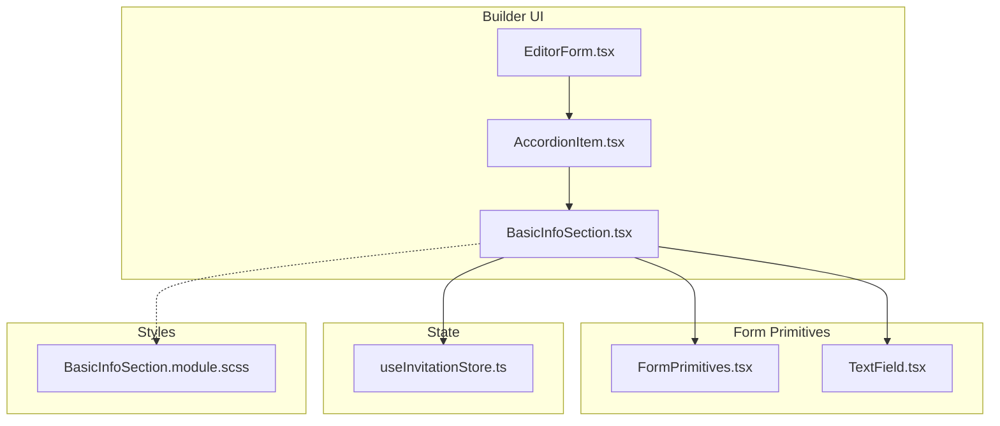
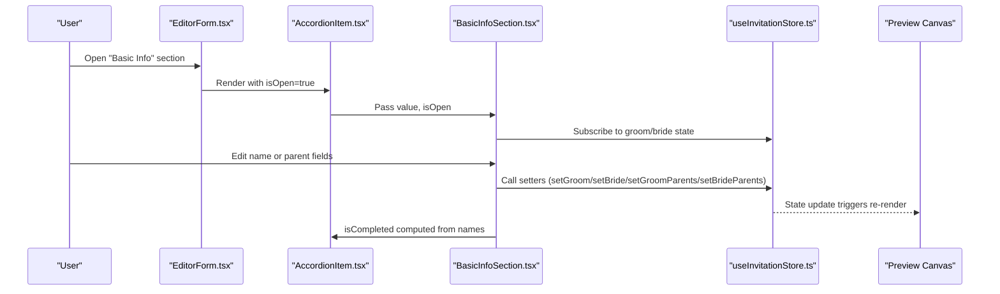
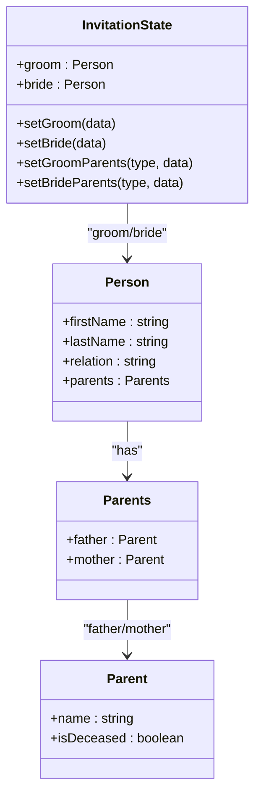
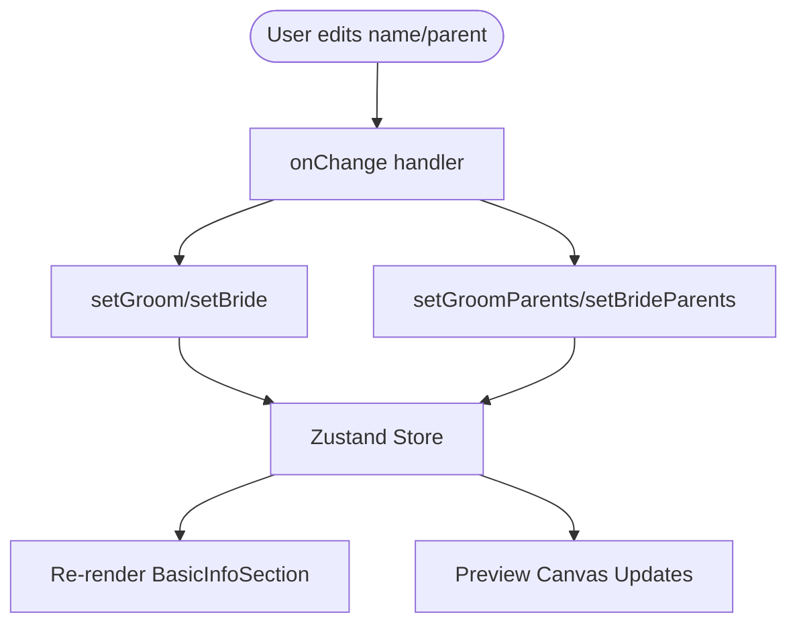
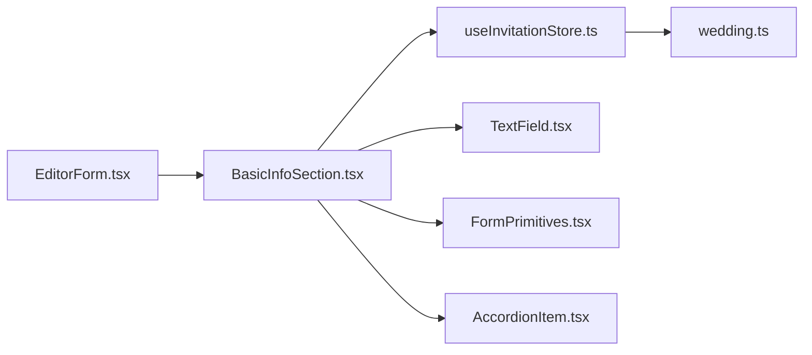

# Basic Information Section

<cite>
**Referenced Files in This Document**
- [BasicInfoSection.tsx](file://src/components/builder/sections/BasicInfoSection.tsx)
- [BasicInfoSection.module.scss](file://src/components/builder/sections/BasicInfoSection.module.scss)
- [useInvitationStore.ts](file://src/store/useInvitationStore.ts)
- [TextField.tsx](file://src/components/common/TextField/TextField.tsx)
- [FormPrimitives.tsx](file://src/components/common/FormPrimitives/FormPrimitives.tsx)
- [AccordionItem.tsx](file://src/components/common/AccordionItem/AccordionItem.tsx)
- [EditorForm.tsx](file://src/components/common/EditorForm/EditorForm.tsx)
- [builder.page.tsx](file://src/app/builder/page.tsx)
- [wedding.ts](file://src/types/wedding.ts)
- [a11y.ts](file://src/lib/a11y.ts)
- [useAccessibility.tsx](file://src/hooks/useAccessibility.tsx)
- [accessibility.scss](file://src/styles/_accessibility.scss)
</cite>

## Table of Contents
1. [Introduction](#introduction)
2. [Project Structure](#project-structure)
3. [Core Components](#core-components)
4. [Architecture Overview](#architecture-overview)
5. [Detailed Component Analysis](#detailed-component-analysis)
6. [Dependency Analysis](#dependency-analysis)
7. [Performance Considerations](#performance-considerations)
8. [Troubleshooting Guide](#troubleshooting-guide)
9. [Conclusion](#conclusion)

## Introduction
The Basic Information Section component captures essential wedding couple details for the invitation builder. It collects the groom and bride’s names, their parents’ names, and indicates parent deceased status via toggle buttons. The component integrates with the overall builder through the EditorForm accordion system and persists data into a centralized Zustand store. This document explains the form structure, input handling, data binding, validation considerations, accessibility, responsive design, and integration with state management.

## Project Structure
The Basic Information Section resides under the builder sections and is composed of:
- A section component that renders two person groups (groom and bride) with parent fields
- A store module that defines state shapes and setters for names and parent details
- Shared primitives for labels, fields, and containers
- A text input primitive with optional multiline support
- An accordion wrapper for section presentation and completion state

**Diagram sources**
- [EditorForm.tsx](file://src/components/common/EditorForm/EditorForm.tsx#L35-L104)
- [AccordionItem.tsx](file://src/components/common/AccordionItem/AccordionItem.tsx#L23-L106)
- [BasicInfoSection.tsx](file://src/components/builder/sections/BasicInfoSection.tsx#L15-L131)
- [FormPrimitives.tsx](file://src/components/common/FormPrimitives/FormPrimitives.tsx#L54-L119)
- [TextField.tsx](file://src/components/common/TextField/TextField.tsx#L18-L77)
- [useInvitationStore.ts](file://src/store/useInvitationStore.ts#L4-L230)
- [BasicInfoSection.module.scss](file://src/components/builder/sections/BasicInfoSection.module.scss#L1-L24)

**Section sources**
- [EditorForm.tsx](file://src/components/common/EditorForm/EditorForm.tsx#L10-L33)
- [BasicInfoSection.tsx](file://src/components/builder/sections/BasicInfoSection.tsx#L1-L134)
- [useInvitationStore.ts](file://src/store/useInvitationStore.ts#L4-L230)

## Core Components
- BasicInfoSection: Renders the groom and bride forms, parent fields, and deceased toggles. Uses shallow selectors to subscribe to only the relevant parts of the store.
- TextField: A reusable input primitive supporting single-line and multiline modes with label, help text, and error state.
- FormPrimitives: Provides Field and SectionContainer wrappers for consistent spacing and labeling.
- AccordionItem: Wraps the section with expand/collapse behavior and completion indicator.
- useInvitationStore: Centralized state for names, relations, and parent details with setters.

Key responsibilities:
- Capture names and parents for both sides
- Toggle parent deceased status
- Bind to store for persistence and preview updates
- Provide completion state based on presence of names

**Section sources**
- [BasicInfoSection.tsx](file://src/components/builder/sections/BasicInfoSection.tsx#L15-L131)
- [TextField.tsx](file://src/components/common/TextField/TextField.tsx#L18-L77)
- [FormPrimitives.tsx](file://src/components/common/FormPrimitives/FormPrimitives.tsx#L54-L119)
- [AccordionItem.tsx](file://src/components/common/AccordionItem/AccordionItem.tsx#L23-L106)
- [useInvitationStore.ts](file://src/store/useInvitationStore.ts#L4-L230)

## Architecture Overview
The Basic Information Section participates in the builder’s accordion-driven editing workflow. The EditorForm manages which sections are open and signals the currently edited section to the preview canvas. Changes propagate to the store via controlled inputs and setters.

**Diagram sources**
- [EditorForm.tsx](file://src/components/common/EditorForm/EditorForm.tsx#L35-L104)
- [AccordionItem.tsx](file://src/components/common/AccordionItem/AccordionItem.tsx#L23-L106)
- [BasicInfoSection.tsx](file://src/components/builder/sections/BasicInfoSection.tsx#L15-L131)
- [useInvitationStore.ts](file://src/store/useInvitationStore.ts#L378-L397)
- [builder.page.tsx](file://src/app/builder/page.tsx#L42-L127)

## Detailed Component Analysis

### BasicInfoSection Component
Purpose:
- Collects groom and bride names and parents’ names
- Allows toggling parent deceased status
- Computes completion state based on names

Props:
- value: string (used by AccordionItem)
- isOpen: boolean (controls visibility and auto-scroll)

State bindings:
- Subscribes to groom and bride names and parents via shallow selectors
- Uses setters to update names and parent details

Rendering logic:
- Two main Field groups: one for groom, one for bride
- Each group includes:
  - Full-width row for combined last and first name
  - Compact rows for father and mother with name input and deceased toggle button
- Completion state is derived from whether both groom and bride have first names

Accessibility:
- Uses shared Label and Input primitives for proper labeling and focus styles
- Deceased toggle buttons reflect current state via variant and text styling

Responsive design:
- Uses CSS Grid with templates for full and compact layouts
- Full row for names, compact two-column layout for name + deceased toggle

Data binding patterns:
- Controlled inputs bound to store state
- onChange handlers call setters with partial updates
- Parents are updated via dedicated setters per side and parent type

Validation considerations:
- Completion depends on non-empty first names for both sides
- No explicit client-side validation is implemented in this component; validation would be added at the store or service layer if needed

Integration with builder:
- Wrapped by AccordionItem for expand/collapse and completion badge
- Included in EditorForm’s section list
- Editing state is tracked by EditorForm and passed to the preview canvas

**Section sources**
- [BasicInfoSection.tsx](file://src/components/builder/sections/BasicInfoSection.tsx#L15-L131)
- [BasicInfoSection.module.scss](file://src/components/builder/sections/BasicInfoSection.module.scss#L4-L24)
- [useInvitationStore.ts](file://src/store/useInvitationStore.ts#L13-L23)
- [useInvitationStore.ts](file://src/store/useInvitationStore.ts#L378-L397)
- [EditorForm.tsx](file://src/components/common/EditorForm/EditorForm.tsx#L22-L33)
- [AccordionItem.tsx](file://src/components/common/AccordionItem/AccordionItem.tsx#L23-L34)

#### Class Diagram: State Model

**Diagram sources**
- [useInvitationStore.ts](file://src/store/useInvitationStore.ts#L4-L23)
- [useInvitationStore.ts](file://src/store/useInvitationStore.ts#L244-L371)
- [wedding.ts](file://src/types/wedding.ts#L23-L40)

### TextField Primitive
Purpose:
- Unified input wrapper supporting single-line and multiline
- Optional label, help text, error state, and right-aligned adornment

Usage in BasicInfoSection:
- Used for name inputs and parent name inputs
- Deceased toggle buttons are separate Button components styled inline

Accessibility:
- Proper htmlFor association via id/name
- Focus styles inherited from shared styles

**Section sources**
- [TextField.tsx](file://src/components/common/TextField/TextField.tsx#L18-L77)

### FormPrimitives
Purpose:
- Field: Groups label, help text, and children with optional description and error
- SectionContainer: Wraps section content for consistent spacing

Usage:
- BasicInfoSection uses Field for labeled rows and SectionContainer for grouping

**Section sources**
- [FormPrimitives.tsx](file://src/components/common/FormPrimitives/FormPrimitives.tsx#L54-L119)

### AccordionItem
Purpose:
- Presents the section with a header, chevron, and collapsible content area
- Computes completion state and supports auto-scroll when opened

Integration:
- BasicInfoSection passes isCompleted based on name presence
- EditorForm controls isOpen and tracks editingSection

**Section sources**
- [AccordionItem.tsx](file://src/components/common/AccordionItem/AccordionItem.tsx#L23-L106)

### Store Integration and Data Flow
- BasicInfoSection subscribes to state slices for groom and bride
- onChange handlers call setters that merge partial updates into state
- The store exposes setters for:
  - setGroom(data)
  - setBride(data)
  - setGroomParents(type, data)
  - setBrideParents(type, data)

**Diagram sources**
- [BasicInfoSection.tsx](file://src/components/builder/sections/BasicInfoSection.tsx#L36-L125)
- [useInvitationStore.ts](file://src/store/useInvitationStore.ts#L378-L397)

**Section sources**
- [useInvitationStore.ts](file://src/store/useInvitationStore.ts#L378-L397)

### Accessibility and Responsive Design
Accessibility:
- Focus management and focus traps are available via shared utilities and hooks
- Shared focus-visible styles ensure visible focus indicators
- Proper labeling via TextField and Label primitives

Responsive design:
- CSS Grid templates define full-width for names and compact two-column for name + deceased toggle
- Styles adapt to mobile and desktop layouts through shared builder mixins

**Section sources**
- [a11y.ts](file://src/lib/a11y.ts#L1-L20)
- [useAccessibility.tsx](file://src/hooks/useAccessibility.tsx#L22-L62)
- [accessibility.scss](file://src/styles/_accessibility.scss#L13-L33)
- [BasicInfoSection.module.scss](file://src/components/builder/sections/BasicInfoSection.module.scss#L12-L24)

## Dependency Analysis
- BasicInfoSection depends on:
  - useInvitationStore for state and setters
  - TextField for inputs
  - FormPrimitives for Field and SectionContainer
  - AccordionItem for section presentation
- EditorForm composes BasicInfoSection and manages its lifecycle
- The store defines the domain model for Person and Parent

**Diagram sources**
- [BasicInfoSection.tsx](file://src/components/builder/sections/BasicInfoSection.tsx#L15-L131)
- [useInvitationStore.ts](file://src/store/useInvitationStore.ts#L4-L230)
- [TextField.tsx](file://src/components/common/TextField/TextField.tsx#L18-L77)
- [FormPrimitives.tsx](file://src/components/common/FormPrimitives/FormPrimitives.tsx#L54-L119)
- [AccordionItem.tsx](file://src/components/common/AccordionItem/AccordionItem.tsx#L23-L106)
- [EditorForm.tsx](file://src/components/common/EditorForm/EditorForm.tsx#L35-L104)
- [wedding.ts](file://src/types/wedding.ts#L23-L40)

**Section sources**
- [EditorForm.tsx](file://src/components/common/EditorForm/EditorForm.tsx#L35-L104)
- [BasicInfoSection.tsx](file://src/components/builder/sections/BasicInfoSection.tsx#L15-L131)
- [useInvitationStore.ts](file://src/store/useInvitationStore.ts#L4-L230)

## Performance Considerations
- Memoization: BasicInfoSection is wrapped with React.memo to avoid unnecessary re-renders when unrelated store slices change.
- Selective subscription: Shallow selectors reduce re-renders by subscribing only to specific state branches.
- Controlled inputs: Direct binding to store minimizes intermediate state and ensures predictable updates.

Recommendations:
- Keep input handlers pure and avoid heavy computations in onChange
- Consider debouncing for long-running validations if added later

**Section sources**
- [BasicInfoSection.tsx](file://src/components/builder/sections/BasicInfoSection.tsx#L15-L16)
- [useInvitationStore.ts](file://src/store/useInvitationStore.ts#L378-L397)

## Troubleshooting Guide
Common issues and resolutions:
- Names not updating:
  - Verify onChange handlers call the correct setters
  - Ensure shallow selectors are used to subscribe to the intended state slices
- Deceased toggle not reflecting state:
  - Confirm variant and styling logic matches the isDeceased flag
- Completion badge not appearing:
  - Ensure both groom.firstName and bride.firstName are non-empty
- Accessibility concerns:
  - Confirm labels are associated with inputs via id/name
  - Use shared focus-visible styles and ensure focus traps are applied when needed

**Section sources**
- [BasicInfoSection.tsx](file://src/components/builder/sections/BasicInfoSection.tsx#L29-L29)
- [TextField.tsx](file://src/components/common/TextField/TextField.tsx#L18-L44)
- [accessibility.scss](file://src/styles/_accessibility.scss#L13-L33)

## Conclusion
The Basic Information Section provides a focused, accessible, and responsive form for capturing essential wedding couple details. Its integration with the EditorForm and Zustand store enables seamless editing and real-time preview updates. The component’s controlled inputs, shallow subscriptions, and reusable primitives contribute to maintainable and performant code. Future enhancements could include client-side validation and richer accessibility features as needed.