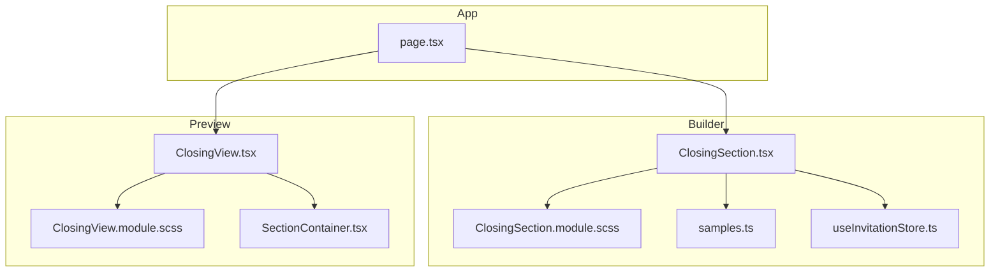
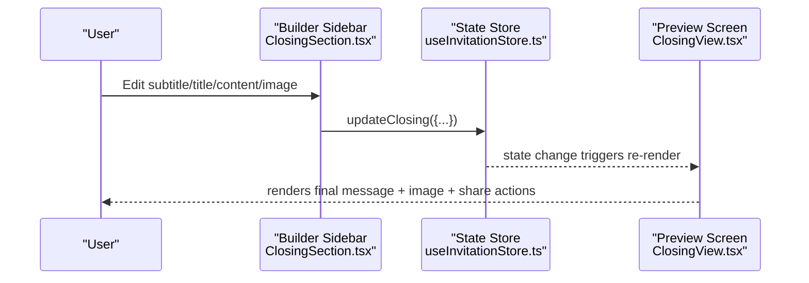
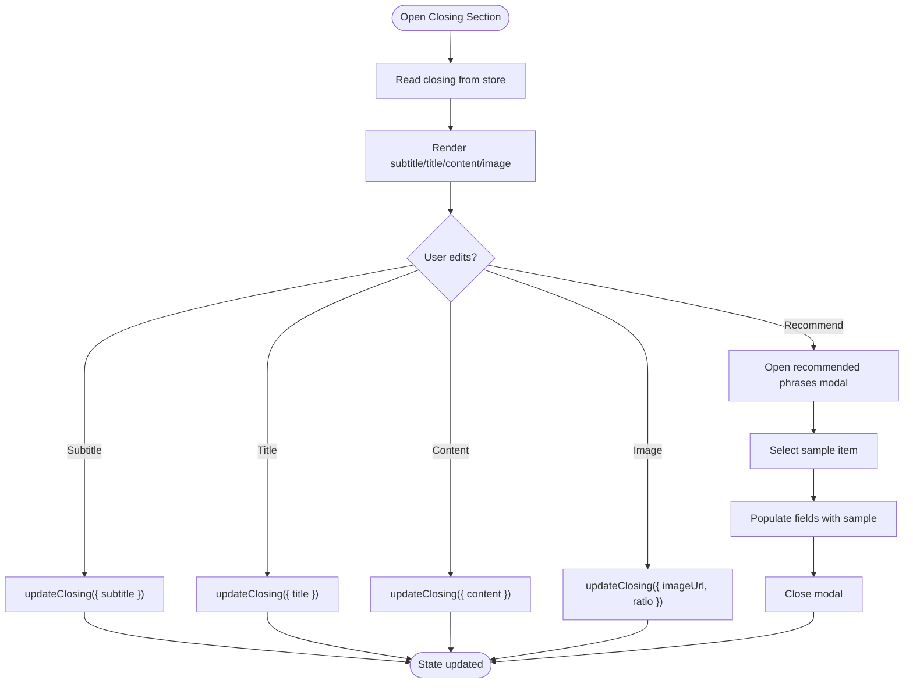
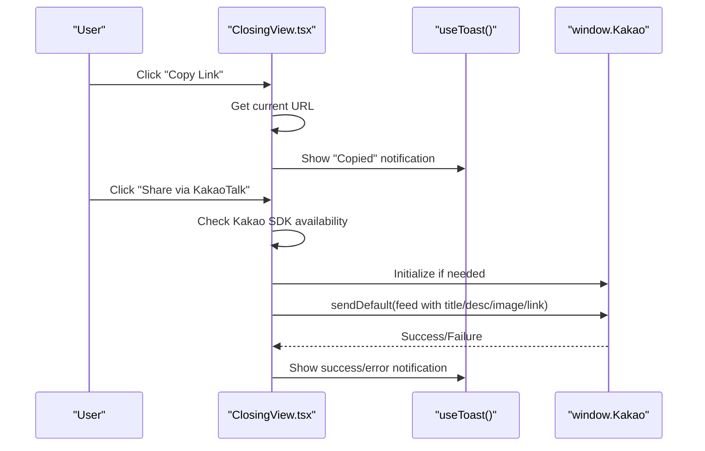
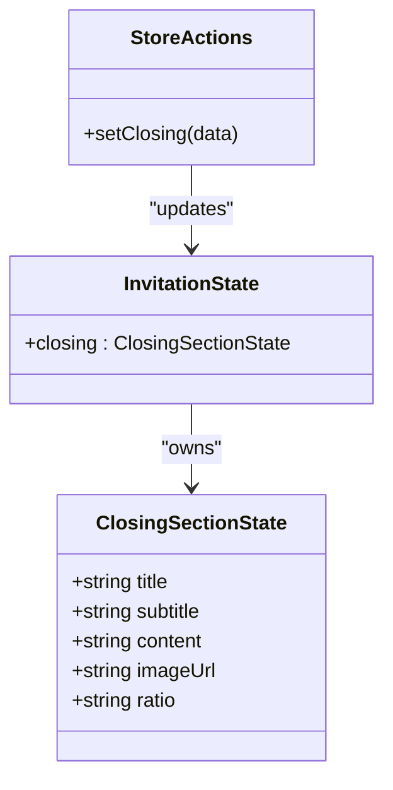
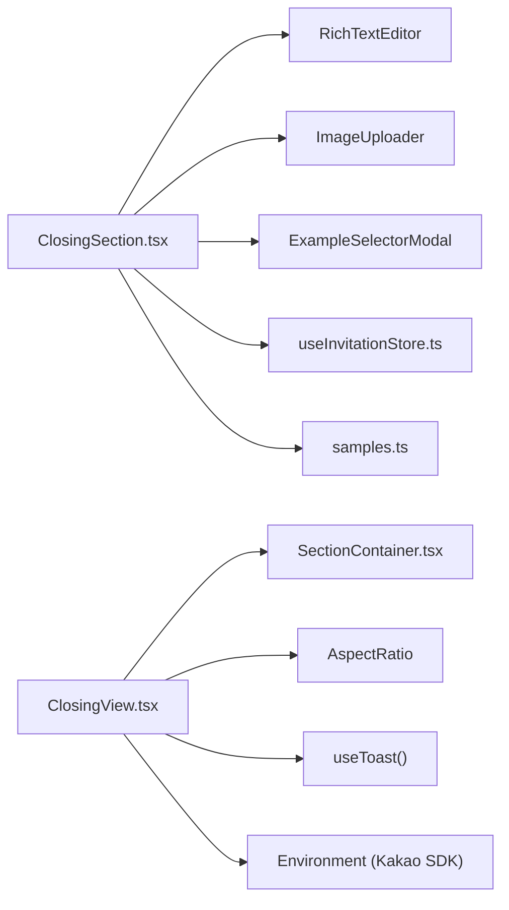

# Closing Section

<cite>
**Referenced Files in This Document**
- [ClosingSection.tsx](file://src/components/builder/sections/ClosingSection.tsx)
- [ClosingSection.module.scss](file://src/components/builder/sections/ClosingSection.module.scss)
- [ClosingView.tsx](file://src/components/preview/sections/ClosingView.tsx)
- [ClosingView.module.scss](file://src/components/preview/sections/ClosingView.module.scss)
- [useInvitationStore.ts](file://src/store/useInvitationStore.ts)
- [samples.ts](file://src/constants/samples.ts)
- [SectionContainer.tsx](file://src/components/preview/SectionContainer.tsx)
- [page.tsx](file://src/app/builder/page.tsx)
</cite>

## Table of Contents
1. [Introduction](#introduction)
2. [Project Structure](#project-structure)
3. [Core Components](#core-components)
4. [Architecture Overview](#architecture-overview)
5. [Detailed Component Analysis](#detailed-component-analysis)
6. [Dependency Analysis](#dependency-analysis)
7. [Performance Considerations](#performance-considerations)
8. [Troubleshooting Guide](#troubleshooting-guide)
9. [Conclusion](#conclusion)

## Introduction
The Closing Section component completes the invitation experience by allowing creators to finalize messaging, optionally include a closing illustration, and provide sharing actions. It integrates tightly with the invitation state via a centralized store, supports recommended phrase suggestions, and renders a responsive preview tailored for mobile devices. This document explains the message system, final remarks handling, signature-like presentation, and how the closing content contributes to the invitation’s completion within the builder and preview flows.

## Project Structure
The Closing Section spans two primary areas:
- Builder form: interactive controls for title, subtitle, rich text content, and optional image with ratio selection.
- Preview view: a presentational component that renders the final message, optional image, and social sharing actions.

**Diagram sources**
- [ClosingSection.tsx](file://src/components/builder/sections/ClosingSection.tsx#L25-L106)
- [ClosingSection.module.scss](file://src/components/builder/sections/ClosingSection.module.scss#L1-L103)
- [ClosingView.tsx](file://src/components/preview/sections/ClosingView.tsx#L37-L196)
- [ClosingView.module.scss](file://src/components/preview/sections/ClosingView.module.scss#L1-L101)
- [useInvitationStore.ts](file://src/store/useInvitationStore.ts#L204-L212)
- [samples.ts](file://src/constants/samples.ts#L33-L49)
- [SectionContainer.tsx](file://src/components/preview/SectionContainer.tsx#L21-L45)
- [page.tsx](file://src/app/builder/page.tsx#L131-L188)

**Section sources**
- [ClosingSection.tsx](file://src/components/builder/sections/ClosingSection.tsx#L25-L106)
- [ClosingView.tsx](file://src/components/preview/sections/ClosingView.tsx#L37-L196)
- [useInvitationStore.ts](file://src/store/useInvitationStore.ts#L204-L212)
- [samples.ts](file://src/constants/samples.ts#L33-L49)
- [SectionContainer.tsx](file://src/components/preview/SectionContainer.tsx#L21-L45)
- [page.tsx](file://src/app/builder/page.tsx#L131-L188)

## Core Components
- Builder form: provides editable fields for subtitle, title, rich text content, and an optional image with ratio control. Includes a “Recommended Phrases” action to populate suggested messages.
- Preview view: displays the final message, optional image with fixed/auto ratio, and sharing actions (KakaoTalk and link copy).

Key capabilities:
- Message formatting: rich text editor for expressive final remarks.
- Personalization: subtitle/title fields enable thematic framing; image ratio allows flexible presentation.
- Signature display: the preview emphasizes the message area as the closing statement; optional image enhances visual closure.
- Sharing: one-touch sharing to KakaoTalk and clipboard copy of the invitation URL.

**Section sources**
- [ClosingSection.tsx](file://src/components/builder/sections/ClosingSection.tsx#L58-L92)
- [ClosingView.tsx](file://src/components/preview/sections/ClosingView.tsx#L118-L191)
- [useInvitationStore.ts](file://src/store/useInvitationStore.ts#L204-L212)

## Architecture Overview
The Closing Section participates in the builder/preview lifecycle:
- Builder: user edits fields; updates are stored in the centralized state.
- Preview: reads the latest state to render the final message, optional image, and sharing controls.
- Integration: the builder page hosts both the editor and preview; the preview is responsive and optimized for mobile.

**Diagram sources**
- [ClosingSection.tsx](file://src/components/builder/sections/ClosingSection.tsx#L25-L40)
- [useInvitationStore.ts](file://src/store/useInvitationStore.ts#L469-L469)
- [ClosingView.tsx](file://src/components/preview/sections/ClosingView.tsx#L37-L52)

## Detailed Component Analysis

### Builder: ClosingSection
Responsibilities:
- Manage local UI state for the modal toggle.
- Bind to the centralized invitation state for closing content.
- Provide inputs for subtitle, title, rich text content, and image upload with ratio selection.
- Offer a recommended phrases modal populated from shared samples.

State management:
- Reads and writes to the closing section of the invitation state.
- Uses shallow selector to subscribe only to the closing slice for efficient updates.

User interactions:
- Text field updates call a partial updater to the store.
- Rich text editor emits HTML content for the message body.
- Image uploader persists the selected image URL and ratio preference.
- Recommended phrases modal populates fields with curated examples.

**Diagram sources**
- [ClosingSection.tsx](file://src/components/builder/sections/ClosingSection.tsx#L25-L106)
- [useInvitationStore.ts](file://src/store/useInvitationStore.ts#L204-L212)
- [samples.ts](file://src/constants/samples.ts#L33-L49)

**Section sources**
- [ClosingSection.tsx](file://src/components/builder/sections/ClosingSection.tsx#L25-L106)
- [ClosingSection.module.scss](file://src/components/builder/sections/ClosingSection.module.scss#L40-L103)
- [useInvitationStore.ts](file://src/store/useInvitationStore.ts#L204-L212)
- [samples.ts](file://src/constants/samples.ts#L33-L49)

### Preview: ClosingView
Responsibilities:
- Render the final message area with optional image.
- Support fixed/auto aspect ratio for the image.
- Provide share actions: KakaoTalk and link copy.
- Use a shared section container for consistent spacing and entrance animation.

Behavior:
- If no image is provided, the message area adjusts its margins for optimal readability.
- If an image is provided, it renders inside a ratio-aware container using an aspect ratio component.
- Sharing actions:
  - Link copy: copies the current page URL to the clipboard and shows a toast notification.
  - KakaoTalk share: initializes the Kakao SDK if needed, composes a feed with title, description, and image, and opens the share dialog.

**Diagram sources**
- [ClosingView.tsx](file://src/components/preview/sections/ClosingView.tsx#L55-L116)
- [ClosingView.module.scss](file://src/components/preview/sections/ClosingView.module.scss#L65-L100)

**Section sources**
- [ClosingView.tsx](file://src/components/preview/sections/ClosingView.tsx#L37-L196)
- [ClosingView.module.scss](file://src/components/preview/sections/ClosingView.module.scss#L4-L101)
- [SectionContainer.tsx](file://src/components/preview/SectionContainer.tsx#L21-L45)

### State Model: InvitationState.closing
The closing section state is part of the centralized invitation state. It includes:
- title: primary closing headline
- subtitle: secondary framing line
- content: rich text HTML for the final remarks
- imageUrl: optional image URL
- ratio: fixed or auto aspect ratio for the image

Actions:
- setClosing: partial updater merges provided fields into the current closing state.

**Diagram sources**
- [useInvitationStore.ts](file://src/store/useInvitationStore.ts#L204-L212)
- [useInvitationStore.ts](file://src/store/useInvitationStore.ts#L469-L469)

**Section sources**
- [useInvitationStore.ts](file://src/store/useInvitationStore.ts#L204-L212)
- [useInvitationStore.ts](file://src/store/useInvitationStore.ts#L469-L469)

### Integration with Invitation Flow
- Builder page hosts the editor and preview panes. The sidebar renders the ClosingSection, while the preview pane renders ClosingView.
- The preview is responsive and optimized for mobile; the section container applies entrance animations and consistent spacing.
- Saving the invitation persists the entire state, including the closing section, ensuring the final message and image appear in the published invitation.

**Section sources**
- [page.tsx](file://src/app/builder/page.tsx#L131-L188)
- [SectionContainer.tsx](file://src/components/preview/SectionContainer.tsx#L21-L45)

## Dependency Analysis
- ClosingSection depends on:
  - RichTextEditor for content editing
  - ImageUploader for optional image selection
  - ExampleSelectorModal for recommended phrases
  - useInvitationStore for state updates
  - samples.ts for phrase templates
- ClosingView depends on:
  - SectionContainer for layout and animation
  - AspectRatio for image sizing
  - useToast for user feedback
  - Environment configuration for Kakao SDK initialization

**Diagram sources**
- [ClosingSection.tsx](file://src/components/builder/sections/ClosingSection.tsx#L4-L21)
- [ClosingView.tsx](file://src/components/preview/sections/ClosingView.tsx#L1-L15)
- [useInvitationStore.ts](file://src/store/useInvitationStore.ts#L204-L212)
- [samples.ts](file://src/constants/samples.ts#L33-L49)

**Section sources**
- [ClosingSection.tsx](file://src/components/builder/sections/ClosingSection.tsx#L4-L21)
- [ClosingView.tsx](file://src/components/preview/sections/ClosingView.tsx#L1-L15)
- [useInvitationStore.ts](file://src/store/useInvitationStore.ts#L204-L212)
- [samples.ts](file://src/constants/samples.ts#L33-L49)

## Performance Considerations
- Client-side rendering: Both builder and preview components are client-side, enabling immediate interactivity and responsive previews.
- Conditional rendering: The image section only renders when an image URL exists, reducing unnecessary DOM nodes.
- Lazy loading: RichTextEditor and ExampleSelectorModal are dynamically imported to minimize initial bundle size.
- State updates: Shallow selectors limit re-renders to the closing section slice, improving performance in larger applications.
- Image optimization: The preview uses Next.js Image with blob handling for dynamic URLs and appropriate sizing attributes.

[No sources needed since this section provides general guidance]

## Troubleshooting Guide
Common issues and resolutions:
- KakaoTalk share not working:
  - Ensure the Kakao SDK is initialized and available. The preview checks for SDK presence and shows an error toast if initialization fails.
  - Verify the NEXT_PUBLIC_KAKAO_APP_KEY environment variable is configured.
- Link copy not functioning:
  - Clipboard API requires secure contexts (HTTPS). Test on a secure deployment.
- Rich text content not rendering:
  - The preview uses a safe innerHTML pattern. Ensure the content is valid HTML and avoid script tags.
- Image not appearing:
  - Confirm the image URL is accessible and not blocked by CORS. Blob URLs are supported with explicit handling.

**Section sources**
- [ClosingView.tsx](file://src/components/preview/sections/ClosingView.tsx#L63-L116)

## Conclusion
The Closing Section provides a focused, state-driven mechanism to craft the invitation’s final message, optionally enhance it with imagery, and offer convenient sharing options. Its integration with the centralized store ensures seamless synchronization between the builder and preview, while responsive design and dynamic imports maintain a smooth user experience across devices.