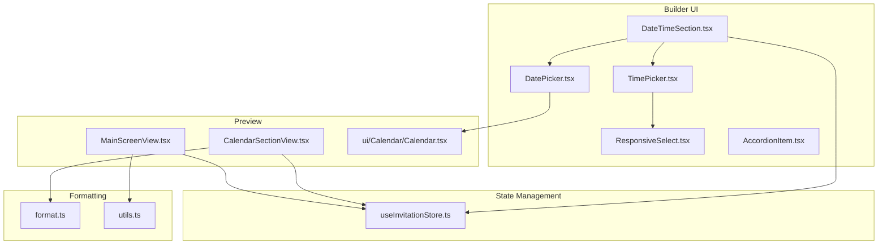
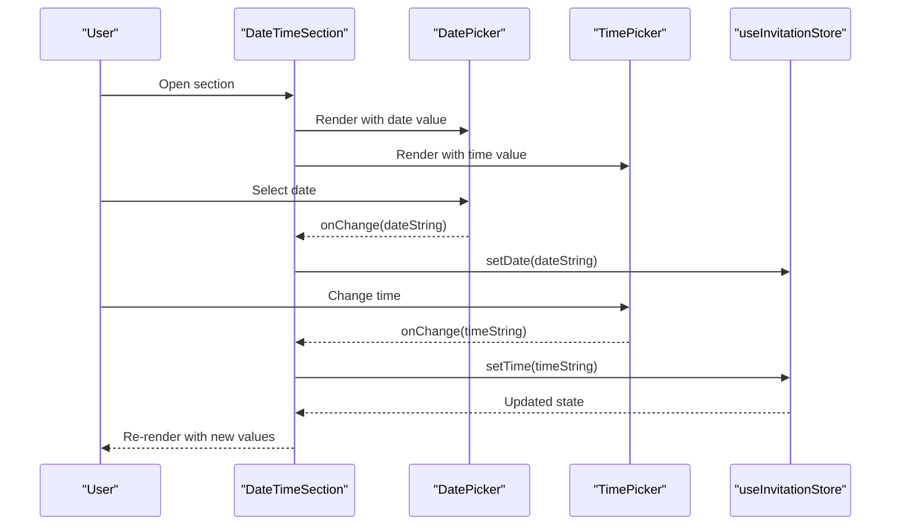
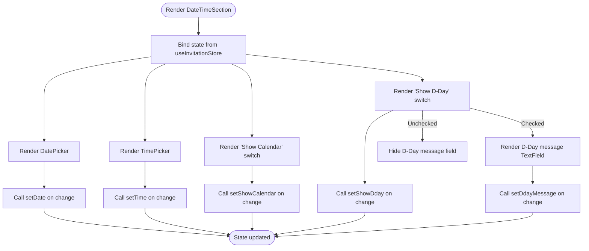
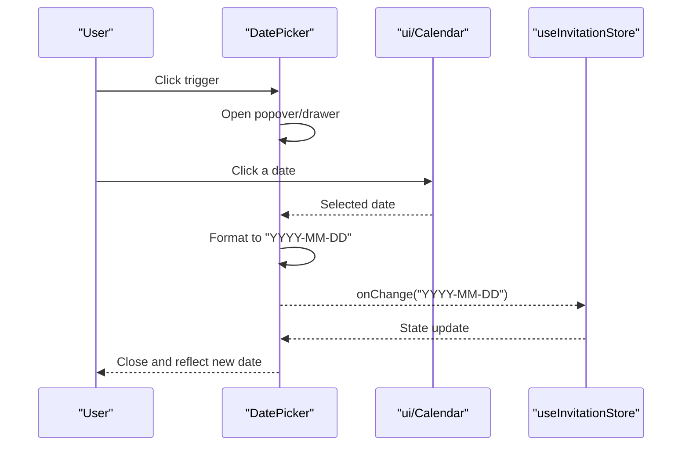
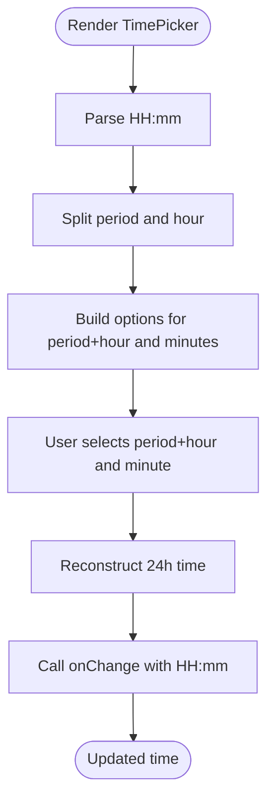
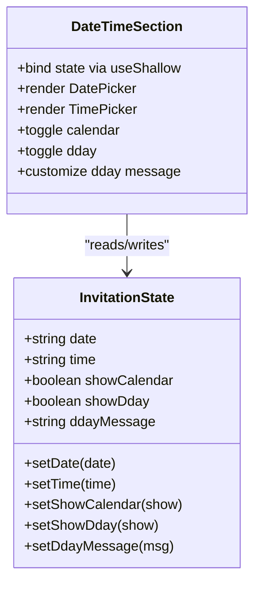
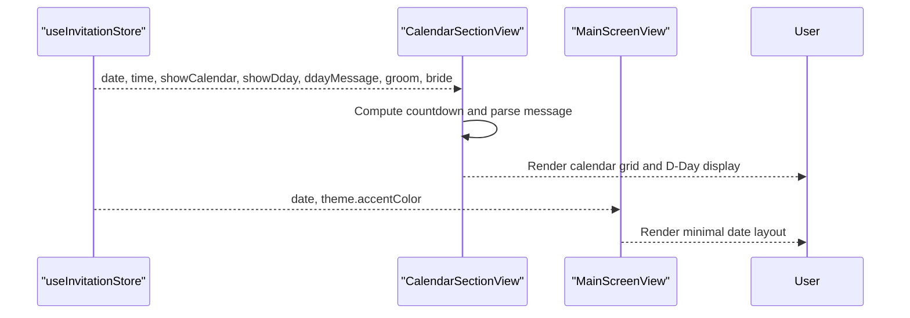
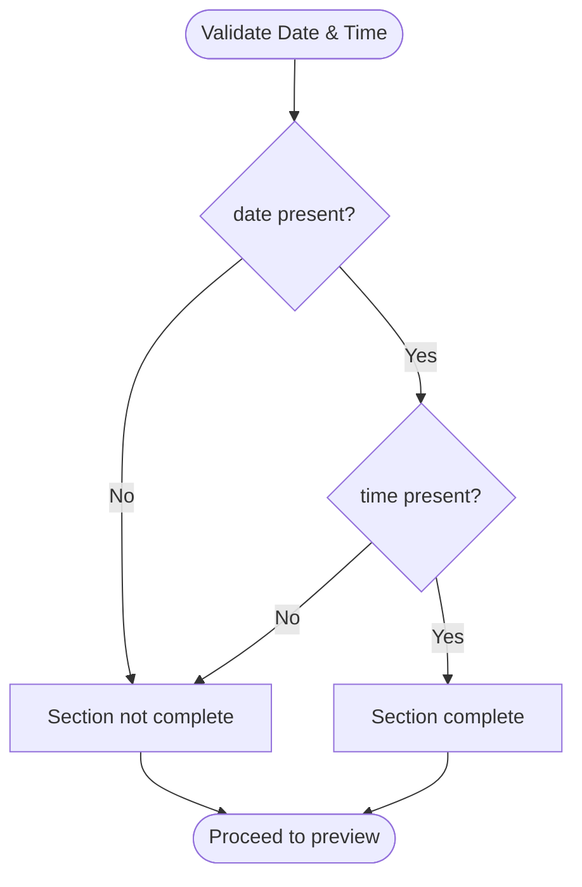
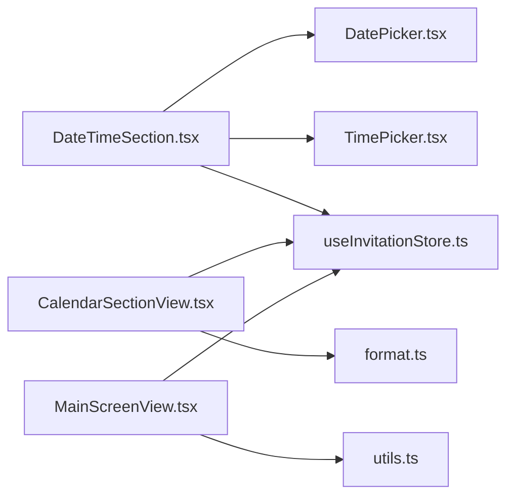

# Date & Time Section

<cite>
**Referenced Files in This Document**
- [DateTimeSection.tsx](file://src/components/builder/sections/DateTimeSection.tsx)
- [DateTimeSection.module.scss](file://src/components/builder/sections/DateTimeSection.module.scss)
- [DatePicker.tsx](file://src/components/common/DatePicker/DatePicker.tsx)
- [TimePicker.tsx](file://src/components/common/TimePicker/TimePicker.tsx)
- [ResponsiveSelect.tsx](file://src/components/common/ResponsiveSelect/ResponsiveSelect.tsx)
- [AccordionItem.tsx](file://src/components/common/AccordionItem/AccordionItem.tsx)
- [useInvitationStore.ts](file://src/store/useInvitationStore.ts)
- [format.ts](file://src/lib/utils/format.ts)
- [utils.ts](file://src/lib/utils.ts)
- [CalendarSectionView.tsx](file://src/components/preview/sections/CalendarSectionView.tsx)
- [MainScreenView.tsx](file://src/components/preview/sections/MainScreenView.tsx)
- [Calendar.tsx](file://src/components/ui/Calendar/Calendar.tsx)
- [useAccessibility.tsx](file://src/hooks/useAccessibility.tsx)
</cite>

## Table of Contents
1. [Introduction](#introduction)
2. [Project Structure](#project-structure)
3. [Core Components](#core-components)
4. [Architecture Overview](#architecture-overview)
5. [Detailed Component Analysis](#detailed-component-analysis)
6. [Dependency Analysis](#dependency-analysis)
7. [Performance Considerations](#performance-considerations)
8. [Troubleshooting Guide](#troubleshooting-guide)
9. [Conclusion](#conclusion)

## Introduction
This document explains the Date & Time Section component used in the invitation builder. It covers the datetime picker implementation, timezone handling, validation logic, integration with formatting utilities, and how the component affects the overall invitation display. It also documents the component’s props interface, state management via a centralized store, and accessibility features.

## Project Structure
The Date & Time Section is part of the builder UI and integrates with reusable date/time pickers, a shared store, and preview components.

**Diagram sources**
- [DateTimeSection.tsx](file://src/components/builder/sections/DateTimeSection.tsx#L1-L95)
- [DatePicker.tsx](file://src/components/common/DatePicker/DatePicker.tsx#L1-L116)
- [TimePicker.tsx](file://src/components/common/TimePicker/TimePicker.tsx#L1-L103)
- [ResponsiveSelect.tsx](file://src/components/common/ResponsiveSelect/ResponsiveSelect.tsx#L1-L182)
- [AccordionItem.tsx](file://src/components/common/AccordionItem/AccordionItem.tsx#L1-L107)
- [useInvitationStore.ts](file://src/store/useInvitationStore.ts#L1-L534)
- [format.ts](file://src/lib/utils/format.ts#L1-L40)
- [utils.ts](file://src/lib/utils.ts#L1-L43)
- [CalendarSectionView.tsx](file://src/components/preview/sections/CalendarSectionView.tsx#L1-L236)
- [MainScreenView.tsx](file://src/components/preview/sections/MainScreenView.tsx#L150-L170)
- [Calendar.tsx](file://src/components/ui/Calendar/Calendar.tsx#L55-L146)

**Section sources**
- [DateTimeSection.tsx](file://src/components/builder/sections/DateTimeSection.tsx#L1-L95)
- [DatePicker.tsx](file://src/components/common/DatePicker/DatePicker.tsx#L1-L116)
- [TimePicker.tsx](file://src/components/common/TimePicker/TimePicker.tsx#L1-L103)
- [useInvitationStore.ts](file://src/store/useInvitationStore.ts#L1-L534)

## Core Components
- DateTimeSection: The builder section that renders date and time pickers, calendar and D-Day toggles, and optional D-Day message customization.
- DatePicker: A responsive date picker using a popover on desktop and a drawer on mobile, powered by a calendar component.
- TimePicker: A responsive time picker using a 12-hour layout with period and minute selection.
- ResponsiveSelect: A shared component that switches between desktop select and a mobile drawer.
- useInvitationStore: Centralized state for date, time, and display options (calendar and D-Day visibility and message).
- CalendarSectionView: Preview component that renders the calendar grid and D-Day countdown.
- Formatting utilities: Functions to format date/time and compute D-Day.

**Section sources**
- [DateTimeSection.tsx](file://src/components/builder/sections/DateTimeSection.tsx#L15-L92)
- [DatePicker.tsx](file://src/components/common/DatePicker/DatePicker.tsx#L22-L42)
- [TimePicker.tsx](file://src/components/common/TimePicker/TimePicker.tsx#L8-L58)
- [ResponsiveSelect.tsx](file://src/components/common/ResponsiveSelect/ResponsiveSelect.tsx#L31-L75)
- [useInvitationStore.ts](file://src/store/useInvitationStore.ts#L27-L87)
- [CalendarSectionView.tsx](file://src/components/preview/sections/CalendarSectionView.tsx#L26-L101)

## Architecture Overview
The Date & Time Section is a controlled UI that updates the shared invitation state. The preview components consume this state to render the calendar and D-Day countdown.

**Diagram sources**
- [DateTimeSection.tsx](file://src/components/builder/sections/DateTimeSection.tsx#L40-L61)
- [DatePicker.tsx](file://src/components/common/DatePicker/DatePicker.tsx#L37-L42)
- [TimePicker.tsx](file://src/components/common/TimePicker/TimePicker.tsx#L37-L58)
- [useInvitationStore.ts](file://src/store/useInvitationStore.ts#L400-L401)

## Detailed Component Analysis

### DateTimeSection
- Purpose: Provides a builder section to set the wedding date and time, and configure calendar/D-Day display options.
- Props: Inherits SectionProps (isOpen, value) from the builder framework.
- State bindings: Uses shallow selector to bind date, time, showCalendar, showDday, and ddayMessage from the store.
- UI composition:
  - DatePicker for date selection.
  - TimePicker for time selection.
  - Switches for calendar and D-Day visibility.
  - Optional TextField for customizing the D-Day message template.
- Completion indicator: Marked complete when both date and time are present.

**Diagram sources**
- [DateTimeSection.tsx](file://src/components/builder/sections/DateTimeSection.tsx#L15-L92)
- [useInvitationStore.ts](file://src/store/useInvitationStore.ts#L27-L38)

**Section sources**
- [DateTimeSection.tsx](file://src/components/builder/sections/DateTimeSection.tsx#L15-L92)
- [DateTimeSection.module.scss](file://src/components/builder/sections/DateTimeSection.module.scss#L1-L51)

### DatePicker
- Purpose: Allows selecting a date with a localized calendar.
- Behavior:
  - Desktop: Popover with Calendar.
  - Mobile: Drawer with Calendar.
  - Accepts a date string (YYYY-MM-DD) and emits a date string on change.
- Accessibility:
  - Drawer header includes screen-reader-only descriptions.
  - Focus management ensures keyboard navigation inside drawers.
- Localization: Uses Korean locale for display.

**Diagram sources**
- [DatePicker.tsx](file://src/components/common/DatePicker/DatePicker.tsx#L29-L42)
- [Calendar.tsx](file://src/components/ui/Calendar/Calendar.tsx#L55-L100)

**Section sources**
- [DatePicker.tsx](file://src/components/common/DatePicker/DatePicker.tsx#L29-L115)

### TimePicker
- Purpose: Allows selecting time in 12-hour increments with AM/PM and 10-minute intervals.
- Behavior:
  - Parses current HH:mm value.
  - Splits into period, hour, and minute.
  - Reconstructs 24-hour time string on change.
- Options:
  - Hours: 7 AM – 12 AM and 1 PM – 10 PM.
  - Minutes: 00, 10, 20, 30, 40, 50.

**Diagram sources**
- [TimePicker.tsx](file://src/components/common/TimePicker/TimePicker.tsx#L17-L58)

**Section sources**
- [TimePicker.tsx](file://src/components/common/TimePicker/TimePicker.tsx#L17-L103)

### ResponsiveSelect
- Purpose: Shared component that renders a desktop select or a mobile drawer depending on viewport.
- Accessibility:
  - Drawer includes a title and screen-reader-only description.
  - Focus is programmatically moved into the drawer on open.
  - Keyboard navigation and focus trapping support.

**Section sources**
- [ResponsiveSelect.tsx](file://src/components/common/ResponsiveSelect/ResponsiveSelect.tsx#L42-L181)

### State Management (useInvitationStore)
- Fields used by the Date & Time Section:
  - date: string (YYYY-MM-DD)
  - time: string (HH:mm)
  - showCalendar: boolean
  - showDday: boolean
  - ddayMessage: string
- Initial defaults:
  - date: 100 days in the future from current date.
  - time: "12:00".
  - showCalendar: true.
  - showDday: true.
  - ddayMessage: template string with placeholders.

**Diagram sources**
- [useInvitationStore.ts](file://src/store/useInvitationStore.ts#L4-L87)
- [DateTimeSection.tsx](file://src/components/builder/sections/DateTimeSection.tsx#L15-L38)

**Section sources**
- [useInvitationStore.ts](file://src/store/useInvitationStore.ts#L27-L87)
- [useInvitationStore.ts](file://src/store/useInvitationStore.ts#L238-L242)
- [useInvitationStore.ts](file://src/store/useInvitationStore.ts#L326-L328)

### Preview Integration
- CalendarSectionView:
  - Consumes date, time, showCalendar, showDday, ddayMessage, groom, bride, and accentColor.
  - Computes countdown and parses D-Day message tokens.
  - Renders a monthly calendar grid highlighting the wedding day.
- MainScreenView:
  - Displays date in a minimal layout with year/month/day boxes and weekday text.

**Diagram sources**
- [CalendarSectionView.tsx](file://src/components/preview/sections/CalendarSectionView.tsx#L26-L101)
- [MainScreenView.tsx](file://src/components/preview/sections/MainScreenView.tsx#L150-L170)

**Section sources**
- [CalendarSectionView.tsx](file://src/components/preview/sections/CalendarSectionView.tsx#L26-L236)
- [MainScreenView.tsx](file://src/components/preview/sections/MainScreenView.tsx#L150-L170)

### Validation Logic
- Presence validation:
  - The section is marked complete when both date and time are truthy.
- Range validation:
  - The underlying calendar restricts selection to valid dates.
  - No explicit future-only constraint is enforced in the date picker; defaults are set to a future date in the store initialization.
- D-Day message validation:
  - The preview replaces placeholders and sanitizes redundant tokens to avoid duplication.

**Diagram sources**
- [DateTimeSection.tsx](file://src/components/builder/sections/DateTimeSection.tsx#L46-L46)

**Section sources**
- [DateTimeSection.tsx](file://src/components/builder/sections/DateTimeSection.tsx#L46-L46)
- [useInvitationStore.ts](file://src/store/useInvitationStore.ts#L238-L242)
- [CalendarSectionView.tsx](file://src/components/preview/sections/CalendarSectionView.tsx#L80-L101)

### Timezone Handling
- The date/time values are stored as strings:
  - date: ISO-like string (YYYY-MM-DD).
  - time: 24-hour string (HH:mm).
- Preview rendering:
  - CalendarSectionView constructs a Date object from date and time for display and countdown calculations.
  - No explicit timezone conversion is applied; the local browser timezone is used implicitly.
- Recommendation:
  - To support international guests, consider storing an explicit timezone offset and converting the Date object accordingly in preview components.

**Section sources**
- [useInvitationStore.ts](file://src/store/useInvitationStore.ts#L28-L29)
- [CalendarSectionView.tsx](file://src/components/preview/sections/CalendarSectionView.tsx#L38-L51)

### Formatting Utilities
- format.ts:
  - formatDate(dateString): Formats to "YYYY. MM. DD".
  - formatShortDate(dateString): Formats to "MM.DD".
  - formatTime(timeString): Converts to 12-hour with AM/PM.
  - getWeekday(dateString): Returns English weekday name.
  - getWeekdayKr(dateString): Returns Korean weekday name.
- utils.ts:
  - formatDate(Date | string, options?): Localizes to Korean locale.
  - formatTime(string): Converts to 12-hour with AM/PM.
  - calculateDday(Date): Computes days between today and target date.

**Section sources**
- [format.ts](file://src/lib/utils/format.ts#L5-L40)
- [utils.ts](file://src/lib/utils.ts#L9-L23)
- [utils.ts](file://src/lib/utils.ts#L25-L33)

### Accessibility Features
- DatePicker:
  - Drawer includes a title and screen-reader-only description.
  - Focus is programmatically moved into the drawer on open to avoid aria-hidden warnings.
- TimePicker:
  - Uses ResponsiveSelect for accessible desktop/mobile controls.
- General:
  - useAccessibility provides skip links and focus trap utilities for broader app accessibility.

**Section sources**
- [DatePicker.tsx](file://src/components/common/DatePicker/DatePicker.tsx#L77-L114)
- [ResponsiveSelect.tsx](file://src/components/common/ResponsiveSelect/ResponsiveSelect.tsx#L136-L149)
- [useAccessibility.tsx](file://src/hooks/useAccessibility.tsx#L11-L20)

## Dependency Analysis
- DateTimeSection depends on:
  - DatePicker and TimePicker for input.
  - useInvitationStore for state.
  - AccordionItem for section UI.
- Preview components depend on:
  - useInvitationStore for data.
  - Formatting utilities for display.

**Diagram sources**
- [DateTimeSection.tsx](file://src/components/builder/sections/DateTimeSection.tsx#L1-L14)
- [useInvitationStore.ts](file://src/store/useInvitationStore.ts#L1-L534)
- [CalendarSectionView.tsx](file://src/components/preview/sections/CalendarSectionView.tsx#L1-L236)
- [MainScreenView.tsx](file://src/components/preview/sections/MainScreenView.tsx#L150-L170)
- [format.ts](file://src/lib/utils/format.ts#L1-L40)
- [utils.ts](file://src/lib/utils.ts#L1-L43)

**Section sources**
- [DateTimeSection.tsx](file://src/components/builder/sections/DateTimeSection.tsx#L1-L14)
- [useInvitationStore.ts](file://src/store/useInvitationStore.ts#L1-L534)

## Performance Considerations
- Memoization:
  - CalendarSectionView uses useMemo for computed values (e.g., parsed D-Day message, calendar grid).
- Rendering:
  - DatePicker and TimePicker are lightweight; avoid unnecessary re-renders by keeping values in the store.
- Storage:
  - The store persists to IndexedDB via a JSON storage adapter, minimizing re-computation after reloads.

**Section sources**
- [CalendarSectionView.tsx](file://src/components/preview/sections/CalendarSectionView.tsx#L79-L124)
- [useInvitationStore.ts](file://src/store/useInvitationStore.ts#L474-L533)

## Troubleshooting Guide
- Date/time not updating:
  - Ensure the store setters are called with valid strings (YYYY-MM-DD for date, HH:mm for time).
- D-Day message not rendering:
  - Verify ddayMessage contains placeholders and that groom/bride names are set.
- Calendar not visible:
  - Confirm showCalendar is enabled; otherwise the calendar section is not rendered.
- Timezone confusion:
  - The preview uses local time; if displaying internationally, convert the Date object to the intended timezone before rendering.

**Section sources**
- [CalendarSectionView.tsx](file://src/components/preview/sections/CalendarSectionView.tsx#L144-L147)
- [CalendarSectionView.tsx](file://src/components/preview/sections/CalendarSectionView.tsx#L80-L101)

## Conclusion
The Date & Time Section integrates a robust date/time picker with a centralized store and preview components. It supports calendar and D-Day display toggles, customizable messages, and accessible UI patterns. For international audiences, consider adding explicit timezone handling in preview components to ensure accurate date/time presentation.