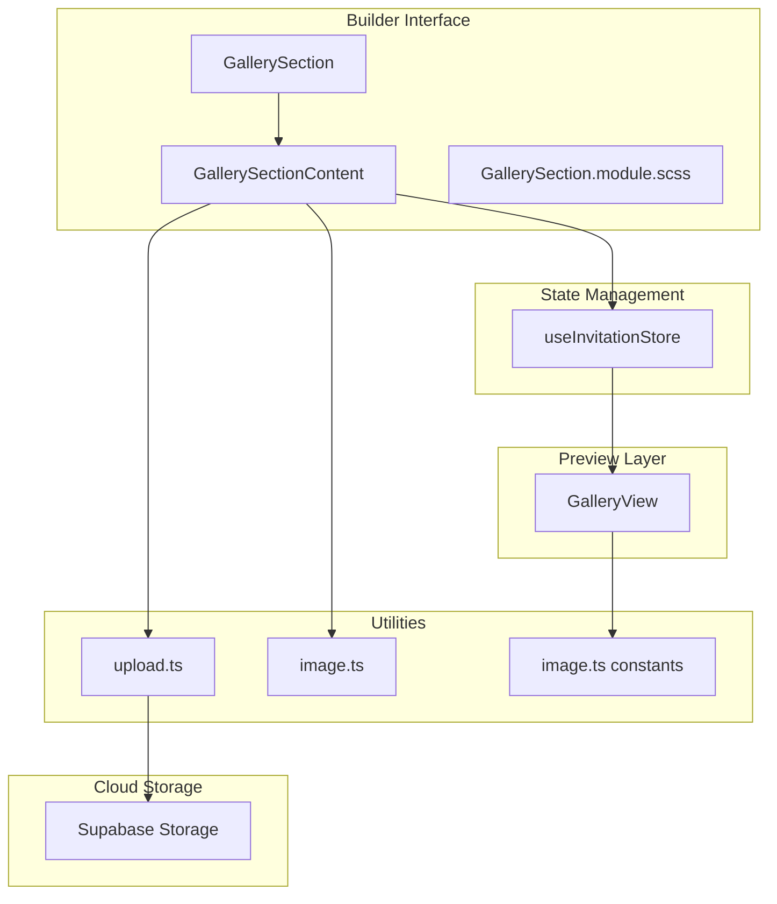
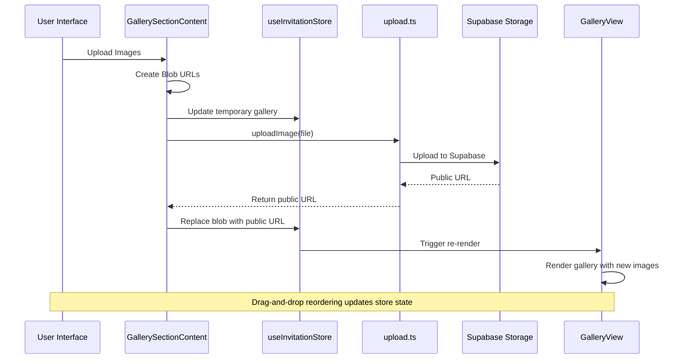
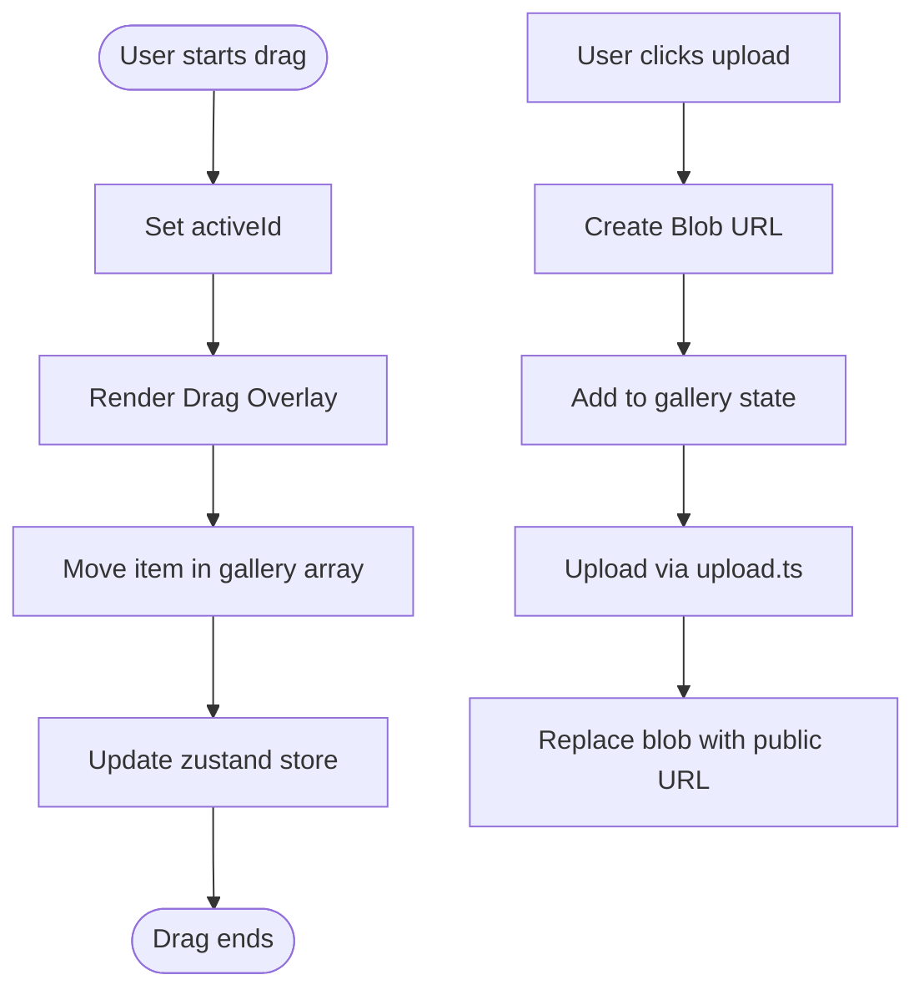
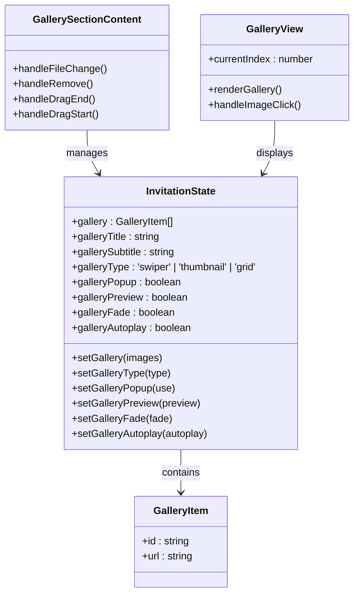

# Gallery Section

<cite>
**Referenced Files in This Document**
- [GallerySection.tsx](file://src/components/builder/sections/GallerySection.tsx)
- [GallerySectionContent.tsx](file://src/components/builder/sections/GallerySectionContent.tsx)
- [GallerySection.module.scss](file://src/components/builder/sections/GallerySection.module.scss)
- [GalleryView.tsx](file://src/components/preview/sections/GalleryView.tsx)
- [useInvitationStore.ts](file://src/store/useInvitationStore.ts)
- [upload.ts](file://src/utils/upload.ts)
- [image.ts](file://src/lib/image.ts)
- [image.ts](file://src/constants/image.ts)
- [page.tsx](file://src/app/builder/page.tsx)
</cite>

## Table of Contents
1. [Introduction](#introduction)
2. [Project Structure](#project-structure)
3. [Core Components](#core-components)
4. [Architecture Overview](#architecture-overview)
5. [Detailed Component Analysis](#detailed-component-analysis)
6. [Dependency Analysis](#dependency-analysis)
7. [Performance Considerations](#performance-considerations)
8. [Troubleshooting Guide](#troubleshooting-guide)
9. [Conclusion](#conclusion)

## Introduction
The Gallery Section component enables users to manage and display photo galleries within wedding invitations. It provides a comprehensive image upload system, drag-and-drop reordering, responsive gallery layouts, and seamless integration with cloud storage. The component consists of two primary parts: the GallerySection (builder UI) and GallerySectionContent (image management), along with the GalleryView component for preview and presentation.

## Project Structure
The gallery functionality spans multiple layers of the application architecture:



**Diagram sources**
- [GallerySection.tsx](file://src/components/builder/sections/GallerySection.tsx#L1-L25)
- [GallerySectionContent.tsx](file://src/components/builder/sections/GallerySectionContent.tsx#L1-L369)
- [useInvitationStore.ts](file://src/store/useInvitationStore.ts#L103-L111)
- [GalleryView.tsx](file://src/components/preview/sections/GalleryView.tsx#L1-L310)

**Section sources**
- [GallerySection.tsx](file://src/components/builder/sections/GallerySection.tsx#L1-L25)
- [GallerySectionContent.tsx](file://src/components/builder/sections/GallerySectionContent.tsx#L1-L369)
- [useInvitationStore.ts](file://src/store/useInvitationStore.ts#L103-L111)

## Core Components
The gallery system comprises three main components working in concert:

### GallerySection (Builder UI)
The GallerySection serves as the accordion wrapper that manages visibility and completion state of the gallery section. It integrates with the zustand store to access gallery data and controls when the content renders.

### GallerySectionContent (Image Management)
This component provides the complete image management interface including:
- Drag-and-drop reordering with visual feedback
- Batch image uploads with progress indication
- Individual image removal
- Gallery configuration options
- Responsive grid layout

### GalleryView (Preview/Presentation)
The GalleryView component renders the gallery in preview mode with multiple layout options and interactive features.

**Section sources**
- [GallerySection.tsx](file://src/components/builder/sections/GallerySection.tsx#L9-L22)
- [GallerySectionContent.tsx](file://src/components/builder/sections/GallerySectionContent.tsx#L106-L368)
- [GalleryView.tsx](file://src/components/preview/sections/GalleryView.tsx#L50-L309)

## Architecture Overview
The gallery architecture follows a clear separation of concerns with distinct layers for building, state management, and presentation:



**Diagram sources**
- [GallerySectionContent.tsx](file://src/components/builder/sections/GallerySectionContent.tsx#L162-L205)
- [upload.ts](file://src/utils/upload.ts#L10-L38)
- [useInvitationStore.ts](file://src/store/useInvitationStore.ts#L433-L440)

## Detailed Component Analysis

### GallerySectionContent Component
The GallerySectionContent component is the heart of the gallery management system, implementing sophisticated drag-and-drop functionality and image optimization.

#### Drag-and-Drop Implementation
The component uses @dnd-kit for robust drag-and-drop interactions:



**Diagram sources**
- [GallerySectionContent.tsx](file://src/components/builder/sections/GallerySectionContent.tsx#L211-L226)
- [GallerySectionContent.tsx](file://src/components/builder/sections/GallerySectionContent.tsx#L162-L205)

#### Image Upload Pipeline
The upload system implements an optimistic UI pattern for immediate feedback:

1. **Immediate Preview**: Creates Blob URLs for instant visual feedback
2. **Background Upload**: Asynchronously uploads to Supabase Storage
3. **State Synchronization**: Updates store with real URLs upon completion
4. **Error Handling**: Reverts to previous state on upload failures

#### Responsive Layout System
The component adapts its grid layout based on screen size:
- Mobile: 3-column grid
- Desktop: 4-column grid
- Touch-friendly sizing with aspect ratios maintained

**Section sources**
- [GallerySectionContent.tsx](file://src/components/builder/sections/GallerySectionContent.tsx#L106-L368)
- [GallerySection.module.scss](file://src/components/builder/sections/GallerySection.module.scss#L33-L43)

### GalleryView Component
The preview component renders galleries with multiple layout modes and interactive features:

#### Layout Modes
1. **Swiper Mode**: Full-screen slider with navigation controls
2. **Thumbnail Mode**: Main gallery with thumbnail navigation
3. **Grid Mode**: Responsive grid layout

#### Interactive Features
- Lightbox modal with keyboard navigation
- Autoplay functionality for slideshow mode
- Fade effects and preview modes
- Focus management for accessibility

**Section sources**
- [GalleryView.tsx](file://src/components/preview/sections/GalleryView.tsx#L126-L224)
- [GalleryView.tsx](file://src/components/preview/sections/GalleryView.tsx#L242-L302)

### State Management Integration
The gallery state is managed through zustand with comprehensive configuration options:



**Diagram sources**
- [useInvitationStore.ts](file://src/store/useInvitationStore.ts#L103-L111)
- [useInvitationStore.ts](file://src/store/useInvitationStore.ts#L433-L440)
- [GallerySectionContent.tsx](file://src/components/builder/sections/GallerySectionContent.tsx#L106-L368)

**Section sources**
- [useInvitationStore.ts](file://src/store/useInvitationStore.ts#L103-L111)
- [useInvitationStore.ts](file://src/store/useInvitationStore.ts#L433-L440)

## Dependency Analysis
The gallery system has well-defined dependencies that support scalability and maintainability:

```mermaid
graph LR
subgraph "External Dependencies"
DnDKit[@dnd-kit/core]
Sortable[@dnd-kit/sortable]
Swiper[swiper]
Zustand[zustand]
NextImage[next/image]
end
subgraph "Internal Dependencies"
Store[useInvitationStore]
Upload[upload.ts]
ImageUtils[image.ts]
ImageSizes[image.ts constants]
end
subgraph "UI Components"
Accordion[AccordionItem]
FormPrimitives[FormPrimitives]
Toast[use-toast]
end
GallerySection --> Accordion
GallerySectionContent --> DnDKit
GallerySectionContent --> Sortable
GallerySectionContent --> Store
GallerySectionContent --> Upload
GallerySectionContent --> Toast
GalleryView --> Swiper
GalleryView --> ImageSizes
GalleryView --> NextImage
GalleryView --> Store
```

**Diagram sources**
- [GallerySection.tsx](file://src/components/builder/sections/GallerySection.tsx#L1-L8)
- [GallerySectionContent.tsx](file://src/components/builder/sections/GallerySectionContent.tsx#L13-L34)
- [GalleryView.tsx](file://src/components/preview/sections/GalleryView.tsx#L7-L15)

**Section sources**
- [GallerySection.tsx](file://src/components/builder/sections/GallerySection.tsx#L1-L8)
- [GallerySectionContent.tsx](file://src/components/builder/sections/GallerySectionContent.tsx#L13-L34)
- [GalleryView.tsx](file://src/components/preview/sections/GalleryView.tsx#L7-L15)

## Performance Considerations

### Image Optimization
The system implements several optimization strategies:

1. **Responsive Image Sizes**: Different image sizes for various breakpoints
2. **Lazy Loading**: Next.js Image component handles lazy loading automatically
3. **Blob URL Management**: Temporary URLs are revoked to prevent memory leaks
4. **Optimistic UI**: Immediate feedback during uploads reduces perceived latency

### Memory Management
- Blob URLs are cleaned up after successful uploads
- Drag overlay uses lightweight DOM manipulation
- Store updates are batched to minimize re-renders

### Mobile Experience
- Touch-friendly drag thresholds (8px distance)
- Adaptive grid layouts for different screen sizes
- Optimized swiper configurations for mobile devices
- Focus management for keyboard navigation

**Section sources**
- [image.ts](file://src/constants/image.ts#L1-L9)
- [GallerySectionContent.tsx](file://src/components/builder/sections/GallerySectionContent.tsx#L189-L205)
- [GallerySection.module.scss](file://src/components/builder/sections/GallerySection.module.scss#L154-L170)

## Troubleshooting Guide

### Upload Issues
Common upload problems and solutions:

1. **Upload Failures**: The system automatically reverts to previous state and shows error notifications
2. **Memory Leaks**: Blob URLs are automatically revoked after upload completion
3. **Large Files**: Consider implementing client-side compression before upload

### Drag-and-Drop Problems
- Ensure proper sensor configuration with activation constraints
- Verify sortable context items match gallery state
- Check for conflicting CSS pointer-events

### Preview Issues
- Lightbox modal requires proper portal mounting
- Swiper instances need proper cleanup on unmount
- Focus trap requires accessible markup structure

**Section sources**
- [GallerySectionContent.tsx](file://src/components/builder/sections/GallerySectionContent.tsx#L197-L201)
- [GalleryView.tsx](file://src/components/preview/sections/GalleryView.tsx#L96-L124)

## Conclusion
The Gallery Section component provides a comprehensive solution for managing photo galleries in wedding invitations. Its architecture balances user experience with technical robustness, offering intuitive drag-and-drop management, responsive layouts, and seamless cloud integration. The system's modular design ensures maintainability while providing excellent performance characteristics for both desktop and mobile environments.

The implementation demonstrates best practices in state management, component composition, and user interface design, making it a model example for similar media management systems.