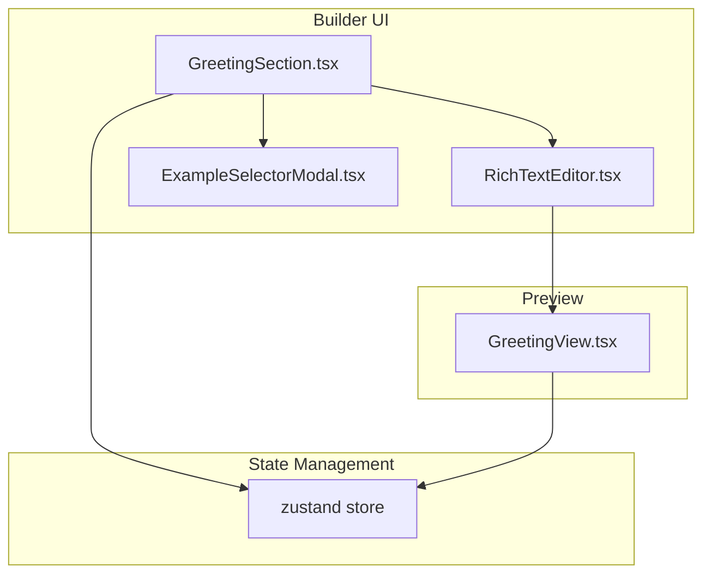
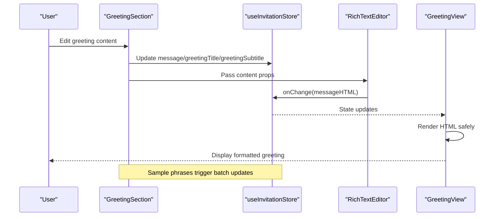
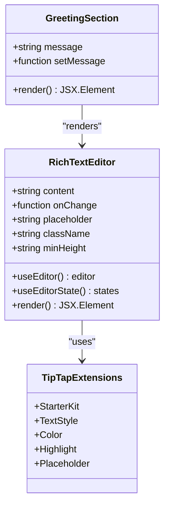
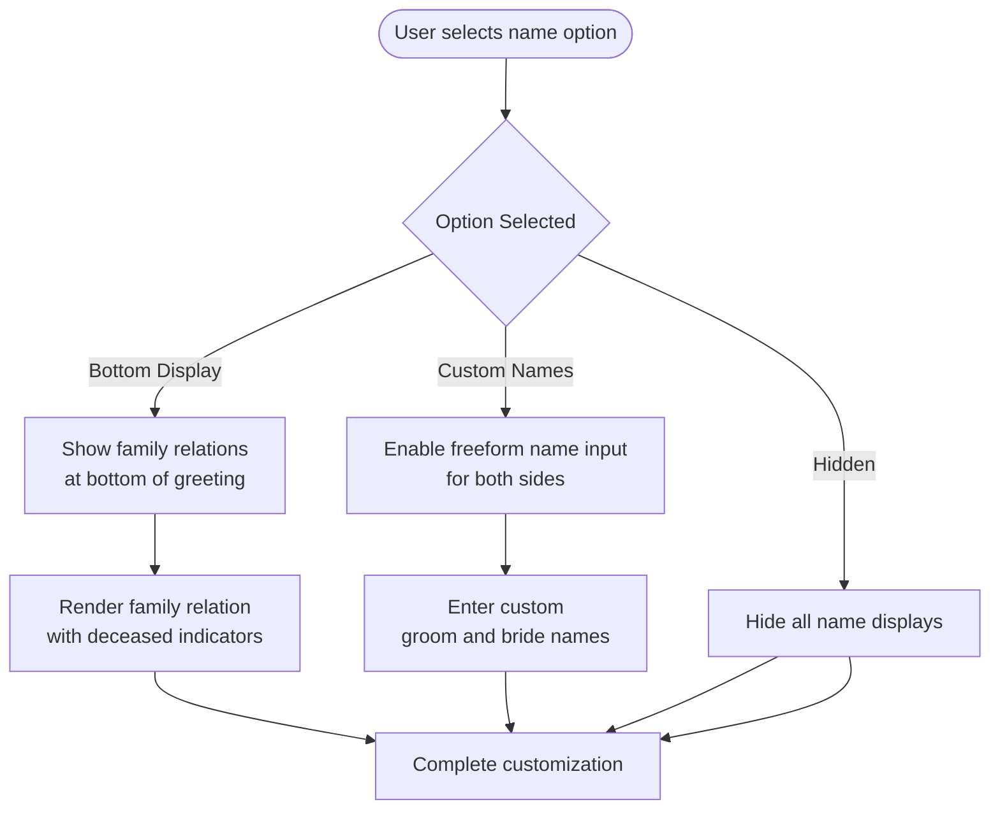
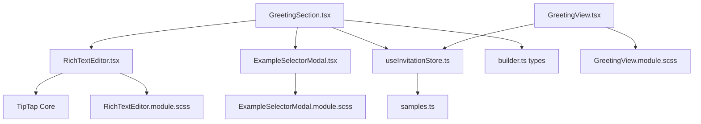

# Greeting Section

<cite>
**Referenced Files in This Document**
- [GreetingSection.tsx](file://src/components/builder/sections/GreetingSection.tsx)
- [GreetingSection.module.scss](file://src/components/builder/sections/GreetingSection.module.scss)
- [RichTextEditor.tsx](file://src/components/common/RichTextEditor/RichTextEditor.tsx)
- [RichTextEditor.module.scss](file://src/components/common/RichTextEditor/RichTextEditor.module.scss)
- [GreetingView.tsx](file://src/components/preview/sections/GreetingView.tsx)
- [GreetingView.module.scss](file://src/components/preview/sections/GreetingView.module.scss)
- [useInvitationStore.ts](file://src/store/useInvitationStore.ts)
- [samples.ts](file://src/constants/samples.ts)
- [ExampleSelectorModal.tsx](file://src/components/common/ExampleSelectorModal/ExampleSelectorModal.tsx)
- [ExampleSelectorModal.module.scss](file://src/components/common/ExampleSelectorModal/ExampleSelectorModal.module.scss)
- [builder.ts](file://src/types/builder.ts)
</cite>

## Table of Contents
1. [Introduction](#introduction)
2. [Project Structure](#project-structure)
3. [Core Components](#core-components)
4. [Architecture Overview](#architecture-overview)
5. [Detailed Component Analysis](#detailed-component-analysis)
6. [Dependency Analysis](#dependency-analysis)
7. [Performance Considerations](#performance-considerations)
8. [Troubleshooting Guide](#troubleshooting-guide)
9. [Conclusion](#conclusion)

## Introduction
The Greeting Section component provides a comprehensive system for crafting personalized invitation messages. It integrates a rich text editor with advanced formatting capabilities, offers curated sample phrases for inspiration, and supports flexible content presentation options including photo integration and customizable name displays. This document explains the greeting text editing system, rich text formatting features, content customization options, and how the component integrates with the rich text editor to produce the final invitation preview.

## Project Structure
The Greeting Section spans three primary areas:
- Builder UI: Interactive editing interface with rich text formatting and customization controls
- Rich Text Engine: TipTap-based editor with toolbar and formatting extensions
- Preview Rendering: Final presentation layer that renders formatted HTML safely

**Diagram sources**
- [GreetingSection.tsx](file://src/components/builder/sections/GreetingSection.tsx#L1-L199)
- [RichTextEditor.tsx](file://src/components/common/RichTextEditor/RichTextEditor.tsx#L1-L173)
- [ExampleSelectorModal.tsx](file://src/components/common/ExampleSelectorModal/ExampleSelectorModal.tsx#L1-L108)
- [useInvitationStore.ts](file://src/store/useInvitationStore.ts#L1-L534)
- [GreetingView.tsx](file://src/components/preview/sections/GreetingView.tsx#L1-L158)

**Section sources**
- [GreetingSection.tsx](file://src/components/builder/sections/GreetingSection.tsx#L1-L199)
- [useInvitationStore.ts](file://src/store/useInvitationStore.ts#L1-L534)

## Core Components
The Greeting Section consists of several interconnected components:

### Builder Interface
- GreetingSection: Main builder component managing state and UI controls
- RichTextEditor: TipTap-powered editor with formatting toolbar
- ExampleSelectorModal: Curated phrase selection modal

### State Management
- useInvitationStore: Centralized state for greeting content, formatting options, and preview data

### Preview Rendering
- GreetingView: Final presentation component rendering formatted HTML safely

**Section sources**
- [GreetingSection.tsx](file://src/components/builder/sections/GreetingSection.tsx#L24-L199)
- [useInvitationStore.ts](file://src/store/useInvitationStore.ts#L4-L62)
- [GreetingView.tsx](file://src/components/preview/sections/GreetingView.tsx#L23-L58)

## Architecture Overview
The Greeting Section follows a unidirectional data flow from the builder to the preview:

**Diagram sources**
- [GreetingSection.tsx](file://src/components/builder/sections/GreetingSection.tsx#L67-L72)
- [RichTextEditor.tsx](file://src/components/common/RichTextEditor/RichTextEditor.tsx#L53-L55)
- [useInvitationStore.ts](file://src/store/useInvitationStore.ts#L420-L422)
- [GreetingView.tsx](file://src/components/preview/sections/GreetingView.tsx#L98-L100)

## Detailed Component Analysis

### Rich Text Editor Integration
The Greeting Section integrates a sophisticated rich text editor built on TipTap:

#### Editor Features
- **Formatting Toolbar**: Bold, italic, underline, color, and highlight tools
- **Brand Color Support**: Customizable accent color for text highlighting
- **Placeholder System**: Contextual hints for content creation
- **State Synchronization**: Real-time synchronization between editor and store

#### Implementation Details
The editor uses TipTap extensions for core formatting and integrates with the store via controlled props and callbacks:

**Diagram sources**
- [RichTextEditor.tsx](file://src/components/common/RichTextEditor/RichTextEditor.tsx#L22-L61)
- [GreetingSection.tsx](file://src/components/builder/sections/GreetingSection.tsx#L127-L135)

#### Formatting Capabilities
The editor supports:
- **Text Formatting**: Bold, italic, underline
- **Color Customization**: Brand color and highlight functionality
- **HTML Content**: Full HTML preservation for complex layouts
- **Responsive Design**: Adaptive toolbar and content area

**Section sources**
- [RichTextEditor.tsx](file://src/components/common/RichTextEditor/RichTextEditor.tsx#L30-L146)
- [RichTextEditor.module.scss](file://src/components/common/RichTextEditor/RichTextEditor.module.scss#L18-L95)

### Content Customization Options
The Greeting Section provides extensive customization through multiple UI controls:

#### Name Display Options
Users can choose between three name display modes:
- **Bottom Display**: Standard family relation display
- **Custom Names**: Free-form text input for personalized phrasing
- **Hidden**: No name display

**Diagram sources**
- [GreetingSection.tsx](file://src/components/builder/sections/GreetingSection.tsx#L74-L87)
- [GreetingSection.tsx](file://src/components/builder/sections/GreetingSection.tsx#L150-L183)

#### Photo Integration
The component supports optional image attachment with flexible aspect ratios:
- **Fixed Ratio**: Maintains 800:550 aspect ratio
- **Auto Ratio**: Adapts to image dimensions
- **Upload Controls**: Integrated image uploader with ratio selection

**Section sources**
- [GreetingSection.tsx](file://src/components/builder/sections/GreetingSection.tsx#L137-L148)
- [GreetingView.tsx](file://src/components/preview/sections/GreetingView.tsx#L102-L135)

### Sample Phrase System
The Greeting Section includes a curated collection of sample phrases to inspire users:

#### Sample Collection
The system provides three professionally crafted greeting samples covering:
- Traditional Korean wedding sentiments
- Modern romantic expressions
- Formal invitation language

#### Selection Workflow
Users can browse and apply samples with a single click, automatically populating title, subtitle, and content fields.

**Section sources**
- [samples.ts](file://src/constants/samples.ts#L12-L28)
- [GreetingSection.tsx](file://src/components/builder/sections/GreetingSection.tsx#L67-L72)
- [ExampleSelectorModal.tsx](file://src/components/common/ExampleSelectorModal/ExampleSelectorModal.tsx#L77-L104)

### State Management and Validation
The component leverages a centralized store for consistent state management:

#### Store Properties
Key greeting-related state includes:
- **Content Fields**: message, greetingTitle, greetingSubtitle
- **Media Settings**: greetingImage, greetingRatio
- **Display Options**: showNamesAtBottom, enableFreeformNames
- **Custom Names**: groomNameCustom, brideNameCustom

#### Validation Logic
The component implements basic validation through:
- **Completion Tracking**: Section completion based on content length
- **Conditional Rendering**: Dynamic UI based on selected options
- **Safe HTML Rendering**: Prevention of XSS through controlled HTML injection

**Section sources**
- [useInvitationStore.ts](file://src/store/useInvitationStore.ts#L50-L62)
- [GreetingSection.tsx](file://src/components/builder/sections/GreetingSection.tsx#L96-L96)
- [GreetingView.tsx](file://src/components/preview/sections/GreetingView.tsx#L98-L100)

### Preview Rendering System
The final greeting presentation maintains formatting while ensuring safety:

#### HTML Rendering
The preview component safely renders HTML content using:
- **dangerouslySetInnerHTML**: Controlled injection of formatted content
- **CSS Class Application**: Consistent styling with rich-text-content class
- **Dynamic Content Areas**: Conditional rendering based on user selections

#### Responsive Design
The preview adapts to various screen sizes while maintaining:
- **Typography Scaling**: Responsive font sizing
- **Layout Flexibility**: Centered content with appropriate spacing
- **Image Handling**: Proper aspect ratio maintenance

**Section sources**
- [GreetingView.tsx](file://src/components/preview/sections/GreetingView.tsx#L96-L151)
- [GreetingView.module.scss](file://src/components/preview/sections/GreetingView.module.scss#L9-L62)

## Dependency Analysis
The Greeting Section has well-defined dependencies that support modularity and maintainability:

**Diagram sources**
- [GreetingSection.tsx](file://src/components/builder/sections/GreetingSection.tsx#L1-L20)
- [RichTextEditor.tsx](file://src/components/common/RichTextEditor/RichTextEditor.tsx#L1-L20)
- [ExampleSelectorModal.tsx](file://src/components/common/ExampleSelectorModal/ExampleSelectorModal.tsx#L1-L5)
- [useInvitationStore.ts](file://src/store/useInvitationStore.ts#L1-L2)
- [GreetingView.tsx](file://src/components/preview/sections/GreetingView.tsx#L1-L11)

### Component Coupling
- **Low Coupling**: Each component has a single responsibility
- **Clear Interfaces**: Well-defined prop contracts and event handlers
- **Shared Dependencies**: Common utilities and stylesheets

### External Dependencies
- **TipTap**: Rich text editing framework
- **Lucide Icons**: UI iconography
- **Zustand**: State management library
- **Next.js**: SSR and dynamic imports

**Section sources**
- [GreetingSection.tsx](file://src/components/builder/sections/GreetingSection.tsx#L1-L20)
- [RichTextEditor.tsx](file://src/components/common/RichTextEditor/RichTextEditor.tsx#L1-L20)

## Performance Considerations
The Greeting Section is designed with performance in mind:

### Rendering Optimizations
- **Memoization**: Preview component uses React.memo for efficient re-renders
- **Conditional Rendering**: Content only renders when section is open
- **Dynamic Imports**: Modal components loaded on-demand

### Memory Management
- **Store Persistence**: IndexedDB-backed persistence prevents memory leaks
- **Efficient State Updates**: Minimal state updates through targeted setters
- **Lazy Loading**: Rich text editor initialized only when needed

### Accessibility
- **Keyboard Navigation**: Full keyboard support for all interactive elements
- **Screen Reader Support**: Proper ARIA labels and semantic markup
- **Focus Management**: Logical tab order and focus trapping

## Troubleshooting Guide

### Common Issues and Solutions

#### Rich Text Editor Not Responding
- **Cause**: Editor initialization timing
- **Solution**: Ensure editor is properly mounted and content is synchronized

#### HTML Content Not Rendering
- **Cause**: Unsafe HTML content or missing CSS classes
- **Solution**: Verify HTML is properly sanitized and rich-text-content class is applied

#### State Not Persisting
- **Cause**: Store configuration issues
- **Solution**: Check IndexedDB availability and storage configuration

#### Sample Phrase Selection Failing
- **Cause**: Type mismatch in sample data
- **Solution**: Ensure sample items conform to SamplePhraseItem interface

**Section sources**
- [GreetingSection.tsx](file://src/components/builder/sections/GreetingSection.tsx#L84-L88)
- [GreetingView.tsx](file://src/components/preview/sections/GreetingView.tsx#L98-L100)
- [useInvitationStore.ts](file://src/store/useInvitationStore.ts#L474-L533)

## Conclusion
The Greeting Section component provides a robust, extensible solution for creating personalized wedding invitation messages. Its integration of a powerful rich text editor, curated sample phrases, and flexible customization options creates a comprehensive authoring experience. The component's architecture ensures maintainability, performance, and accessibility while providing users with the tools needed to craft meaningful, visually appealing greeting content that translates seamlessly to the final invitation preview.

The system successfully balances user-friendly editing capabilities with technical reliability, offering both creative flexibility and structural consistency essential for wedding invitation design.