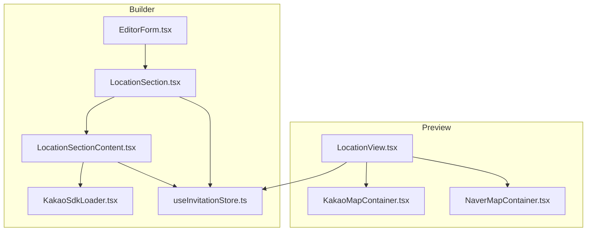
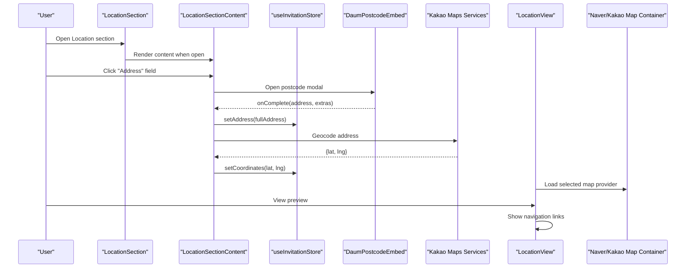
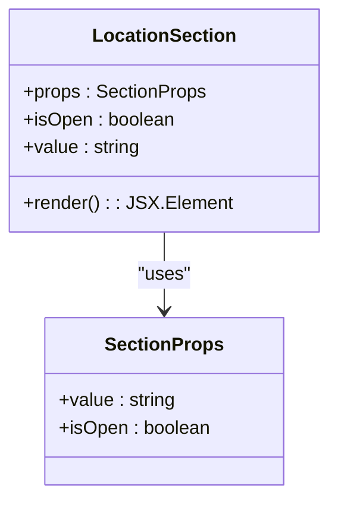
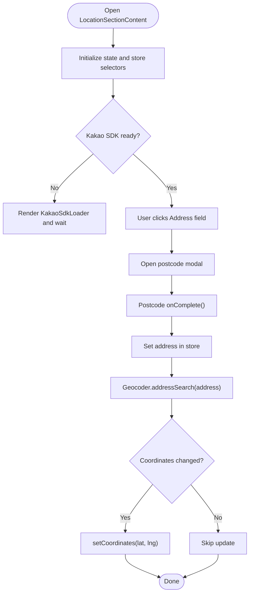
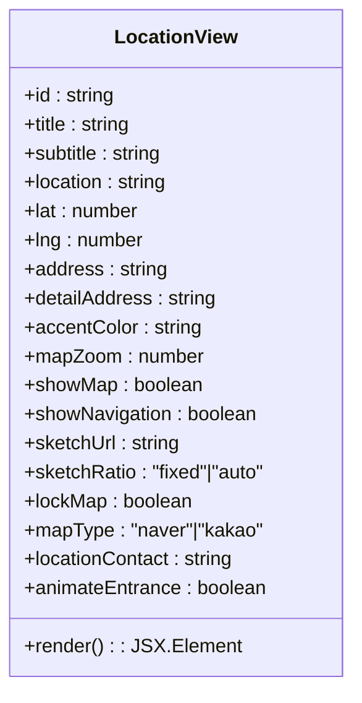
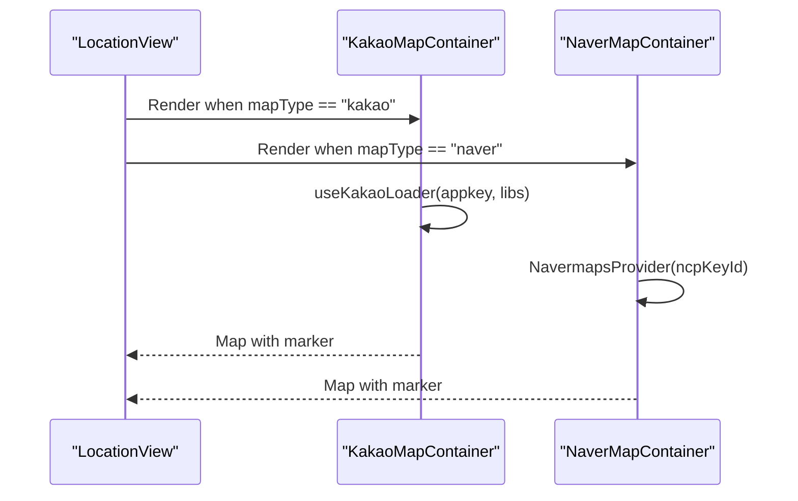
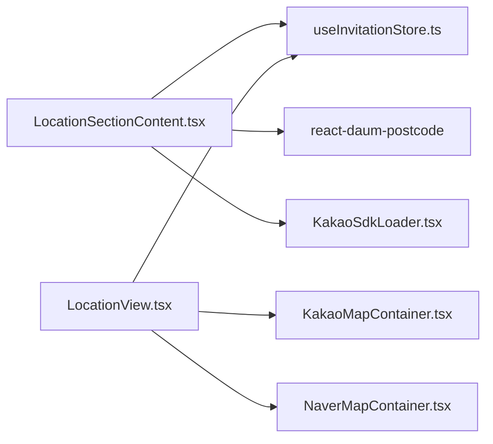

# Location Section

<cite>
**Referenced Files in This Document**
- [LocationSection.tsx](file://src/components/builder/sections/LocationSection.tsx)
- [LocationSectionContent.tsx](file://src/components/builder/sections/LocationSectionContent.tsx)
- [LocationSection.module.scss](file://src/components/builder/sections/LocationSection.module.scss)
- [LocationView.tsx](file://src/components/preview/sections/LocationView.tsx)
- [KakaoMapContainer.tsx](file://src/components/preview/sections/maps/KakaoMapContainer.tsx)
- [NaverMapContainer.tsx](file://src/components/preview/sections/maps/NaverMapContainer.tsx)
- [KakaoSdkLoader.tsx](file://src/components/builder/sections/KakaoSdkLoader.tsx)
- [useInvitationStore.ts](file://src/store/useInvitationStore.ts)
- [EditorForm.tsx](file://src/components/common/EditorForm/EditorForm.tsx)
- [builder.ts](file://src/types/builder.ts)
</cite>

## Table of Contents
1. [Introduction](#introduction)
2. [Project Structure](#project-structure)
3. [Core Components](#core-components)
4. [Architecture Overview](#architecture-overview)
5. [Detailed Component Analysis](#detailed-component-analysis)
6. [Dependency Analysis](#dependency-analysis)
7. [Performance Considerations](#performance-considerations)
8. [Troubleshooting Guide](#troubleshooting-guide)
9. [Conclusion](#conclusion)

## Introduction
The Location Section enables users to configure venue information, address search, map integration, and navigation features for wedding invitations. It consists of two primary parts:
- LocationSection: The builder-side accordion section that controls visibility and completion state.
- LocationSectionContent: The interactive form that captures venue details, address, map preferences, and triggers map SDK initialization.

The preview counterpart (LocationView) renders the final location display with either Naver or Kakao maps, navigation links, and optional venue sketch imagery.

## Project Structure
The Location Section spans builder and preview layers:
- Builder: LocationSection and LocationSectionContent manage form inputs, address search, map SDK loading, and state persistence.
- Preview: LocationView renders the final location display with dynamic map containers and navigation actions.



**Diagram sources**
- [LocationSection.tsx](file://src/components/builder/sections/LocationSection.tsx#L1-L25)
- [LocationSectionContent.tsx](file://src/components/builder/sections/LocationSectionContent.tsx#L1-L260)
- [KakaoSdkLoader.tsx](file://src/components/builder/sections/KakaoSdkLoader.tsx#L1-L33)
- [useInvitationStore.ts](file://src/store/useInvitationStore.ts#L1-L534)
- [EditorForm.tsx](file://src/components/common/EditorForm/EditorForm.tsx#L1-L109)
- [LocationView.tsx](file://src/components/preview/sections/LocationView.tsx#L1-L206)
- [KakaoMapContainer.tsx](file://src/components/preview/sections/maps/KakaoMapContainer.tsx#L1-L54)
- [NaverMapContainer.tsx](file://src/components/preview/sections/maps/NaverMapContainer.tsx#L1-L34)

**Section sources**
- [LocationSection.tsx](file://src/components/builder/sections/LocationSection.tsx#L1-L25)
- [LocationSectionContent.tsx](file://src/components/builder/sections/LocationSectionContent.tsx#L1-L260)
- [LocationView.tsx](file://src/components/preview/sections/LocationView.tsx#L1-L206)
- [EditorForm.tsx](file://src/components/common/EditorForm/EditorForm.tsx#L1-L109)

## Core Components
- LocationSection: A builder accordion item that wraps LocationSectionContent. It reads the current address from the store to determine completion state and renders the content only when open.
- LocationSectionContent: The form that collects:
  - Subtitle and title for the location section
  - Venue name and floor/hall details
  - Contact phone number
  - Address search via Daum Postcode embed
  - Map type selection (Naver or Kakao)
  - Map toggles (show map, lock map, show navigation)
  - Map height and zoom level
  - Coordinates derived from address geocoding
- LocationView: The preview renderer that displays:
  - Venue name and address
  - Optional contact link
  - Interactive map container (Naver or Kakao)
  - Navigation links to Kakao/Naver maps
  - Optional venue sketch image

Key store fields used by LocationSectionContent and LocationView:
- location, locationTitle, locationSubtitle, address, detailAddress, locationContact
- showMap, lockMap, showNavigation, mapHeight, mapZoom, mapType, coordinates

**Section sources**
- [LocationSection.tsx](file://src/components/builder/sections/LocationSection.tsx#L8-L22)
- [LocationSectionContent.tsx](file://src/components/builder/sections/LocationSectionContent.tsx#L24-L79)
- [useInvitationStore.ts](file://src/store/useInvitationStore.ts#L4-L48)
- [LocationView.tsx](file://src/components/preview/sections/LocationView.tsx#L18-L37)

## Architecture Overview
The Location Section integrates builder and preview layers with map SDKs and external services:
- Builder form updates Zustand store state.
- Address search uses react-daum-postcode to populate address and detail fields.
- Geocoding converts the address to coordinates using Kakao Maps SDK services.
- Preview dynamically loads Naver or Kakao map containers based on user settings.
- Navigation links open Kakao/Naver map search in a new tab.



**Diagram sources**
- [LocationSection.tsx](file://src/components/builder/sections/LocationSection.tsx#L11-L21)
- [LocationSectionContent.tsx](file://src/components/builder/sections/LocationSectionContent.tsx#L105-L130)
- [useInvitationStore.ts](file://src/store/useInvitationStore.ts#L138-L151)
- [KakaoSdkLoader.tsx](file://src/components/builder/sections/KakaoSdkLoader.tsx#L11-L29)
- [LocationView.tsx](file://src/components/preview/sections/LocationView.tsx#L80-L94)
- [KakaoMapContainer.tsx](file://src/components/preview/sections/maps/KakaoMapContainer.tsx#L15-L52)
- [NaverMapContainer.tsx](file://src/components/preview/sections/maps/NaverMapContainer.tsx#L13-L32)

## Detailed Component Analysis

### LocationSection (Builder Accordion)
- Purpose: Wraps LocationSectionContent inside an AccordionItem.
- Completion indicator: Uses the presence of address to mark completion.
- Props: value, isOpen from SectionProps.



**Diagram sources**
- [LocationSection.tsx](file://src/components/builder/sections/LocationSection.tsx#L8-L22)
- [builder.ts](file://src/types/builder.ts#L12-L15)

**Section sources**
- [LocationSection.tsx](file://src/components/builder/sections/LocationSection.tsx#L8-L22)
- [builder.ts](file://src/types/builder.ts#L12-L15)

### LocationSectionContent (Builder Form)
- Responsibilities:
  - Manage local state for UI toggles and modal visibility.
  - Integrate Daum Postcode embed for address search.
  - Initialize Kakao SDK loader and geocode address to coordinates.
  - Persist all location-related fields to the store.
- Key interactions:
  - Address search opens a responsive modal containing the postcode embed.
  - On completion, the form sets address and closes the modal.
  - When Kakao SDK is ready, geocoding runs and updates coordinates if changed.
  - Map type, toggles, height, and zoom are controlled via segmented controls and switches.



**Diagram sources**
- [LocationSectionContent.tsx](file://src/components/builder/sections/LocationSectionContent.tsx#L86-L103)
- [LocationSectionContent.tsx](file://src/components/builder/sections/LocationSectionContent.tsx#L105-L130)
- [KakaoSdkLoader.tsx](file://src/components/builder/sections/KakaoSdkLoader.tsx#L11-L29)

**Section sources**
- [LocationSectionContent.tsx](file://src/components/builder/sections/LocationSectionContent.tsx#L24-L79)
- [LocationSectionContent.tsx](file://src/components/builder/sections/LocationSectionContent.tsx#L86-L103)
- [LocationSectionContent.tsx](file://src/components/builder/sections/LocationSectionContent.tsx#L105-L130)
- [LocationSectionContent.tsx](file://src/components/builder/sections/LocationSectionContent.tsx#L132-L258)

### LocationView (Preview Renderer)
- Renders the final location display with:
  - Title and subtitle
  - Venue name and address (with optional detail)
  - Optional contact link
  - Map container (Naver or Kakao) with zoom and lock settings
  - Navigation buttons to Kakao/Naver map search
  - Optional venue sketch image with fixed/auto aspect ratio



**Diagram sources**
- [LocationView.tsx](file://src/components/preview/sections/LocationView.tsx#L18-L37)

**Section sources**
- [LocationView.tsx](file://src/components/preview/sections/LocationView.tsx#L58-L201)

### Map Containers (Preview)
- KakaoMapContainer: Dynamically loads Kakao Maps SDK, initializes geocoder services, and renders a marker at the given coordinates with adjustable zoom and drag/zoom locks.
- NaverMapContainer: Dynamically loads Naver Maps SDK and renders a marker with similar lock controls.



**Diagram sources**
- [LocationView.tsx](file://src/components/preview/sections/LocationView.tsx#L48-L56)
- [KakaoMapContainer.tsx](file://src/components/preview/sections/maps/KakaoMapContainer.tsx#L15-L52)
- [NaverMapContainer.tsx](file://src/components/preview/sections/maps/NaverMapContainer.tsx#L13-L32)

**Section sources**
- [KakaoMapContainer.tsx](file://src/components/preview/sections/maps/KakaoMapContainer.tsx#L15-L52)
- [NaverMapContainer.tsx](file://src/components/preview/sections/maps/NaverMapContainer.tsx#L13-L32)

### Store Integration
- LocationSectionContent selects a subset of store fields and setters using shallow selector to minimize re-renders.
- The store persists all location-related fields, including coordinates, enabling seamless preview synchronization.

```mermaid
classDiagram
class useInvitationStore {
+location : string
+locationTitle : string
+locationSubtitle : string
+address : string
+detailAddress : string
+locationContact : string
+showMap : boolean
+lockMap : boolean
+showNavigation : boolean
+mapHeight : "default"|"small"
+mapZoom : number
+mapType : "kakao"|"naver"
+coordinates : {lat, lng}
+setLocation()
+setLocationTitle()
+setLocationSubtitle()
+setAddress()
+setDetailAddress()
+setLocationContact()
+setShowMap()
+setLockMap()
+setShowNavigation()
+setMapHeight()
+setMapZoom()
+setMapType()
+setCoordinates()
}
```

**Diagram sources**
- [useInvitationStore.ts](file://src/store/useInvitationStore.ts#L4-L48)
- [useInvitationStore.ts](file://src/store/useInvitationStore.ts#L142-L154)

**Section sources**
- [LocationSectionContent.tsx](file://src/components/builder/sections/LocationSectionContent.tsx#L52-L79)
- [useInvitationStore.ts](file://src/store/useInvitationStore.ts#L4-L48)
- [useInvitationStore.ts](file://src/store/useInvitationStore.ts#L142-L154)

## Dependency Analysis
- Builder-to-Preview coupling:
  - LocationSectionContent writes to the store; LocationView reads from the same store to render the preview.
  - Map type selection influences which map container is rendered in the preview.
- SDK dependencies:
  - Kakao Maps SDK: Loader, geocoder services, and map rendering.
  - Naver Maps SDK: Provider and map rendering.
- UI primitives:
  - TextField, SegmentedControl, SwitchField, PhoneField, and ResponsiveModal are used in the builder form.
  - Dynamic imports ensure SDKs load only when needed.



**Diagram sources**
- [LocationSectionContent.tsx](file://src/components/builder/sections/LocationSectionContent.tsx#L17-L22)
- [useInvitationStore.ts](file://src/store/useInvitationStore.ts#L1-L534)
- [LocationView.tsx](file://src/components/preview/sections/LocationView.tsx#L48-L56)

**Section sources**
- [LocationSectionContent.tsx](file://src/components/builder/sections/LocationSectionContent.tsx#L17-L22)
- [LocationView.tsx](file://src/components/preview/sections/LocationView.tsx#L48-L56)

## Performance Considerations
- Dynamic imports: Kakao SDK loader and map containers are dynamically imported to reduce initial bundle size and avoid SSR issues.
- Shallow selectors: LocationSectionContent uses shallow selectors to limit re-renders when only part of the store changes.
- Conditional rendering: The form content is only mounted when the accordion is open, reducing unnecessary DOM nodes.
- Geocoding throttling: Coordinates are only updated if the new result differs from the stored coordinates by a small threshold.

## Troubleshooting Guide
- Kakao SDK not loading:
  - Ensure NEXT_PUBLIC_KAKAO_APP_KEY is configured. The loader reports errors and prevents map rendering until resolved.
- Address search not returning results:
  - Verify the address format and confirm that the geocoder service is available. The component logs when SDK is ready before attempting geocoding.
- Map not displaying in preview:
  - Confirm mapType is set to a supported provider and that coordinates are present in the store.
- Navigation links not opening:
  - Check that showNavigation is enabled and that the browser allows opening new tabs.

**Section sources**
- [KakaoSdkLoader.tsx](file://src/components/builder/sections/KakaoSdkLoader.tsx#L11-L29)
- [KakaoMapContainer.tsx](file://src/components/preview/sections/maps/KakaoMapContainer.tsx#L15-L40)
- [LocationView.tsx](file://src/components/preview/sections/LocationView.tsx#L80-L94)

## Conclusion
The Location Section provides a robust, modular system for configuring venue information and maps across the builder and preview environments. It integrates seamlessly with Kakao and Naver map providers, supports address validation via geocoding, and offers flexible UI controls for map presentation and navigation. The use of dynamic imports and shallow selectors ensures efficient rendering and optimal user experience.