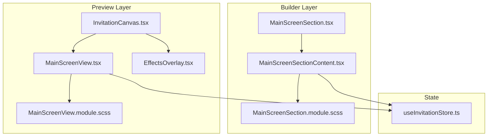
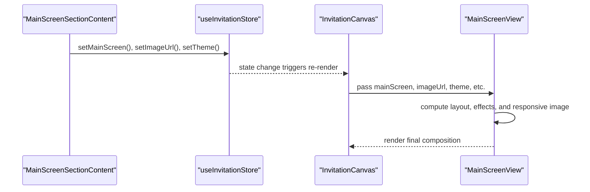
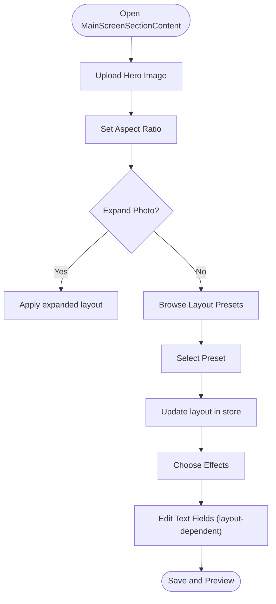
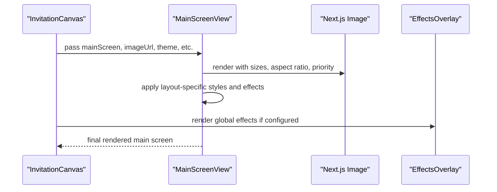
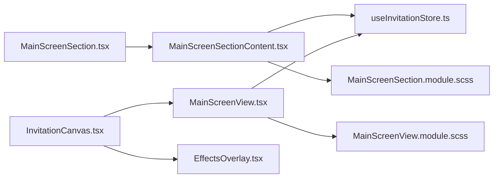

# Main Screen Section

<cite>
**Referenced Files in This Document**
- [MainScreenSection.tsx](file://src/components/builder/sections/MainScreenSection.tsx)
- [MainScreenSectionContent.tsx](file://src/components/builder/sections/MainScreenSectionContent.tsx)
- [MainScreenSection.module.scss](file://src/components/builder/sections/MainScreenSection.module.scss)
- [MainScreenView.tsx](file://src/components/preview/sections/MainScreenView.tsx)
- [MainScreenView.module.scss](file://src/components/preview/sections/MainScreenView.module.scss)
- [EffectsOverlay.tsx](file://src/components/preview/sections/EffectsOverlay.tsx)
- [InvitationCanvas.tsx](file://src/components/preview/InvitationCanvas.tsx)
- [useInvitationStore.ts](file://src/store/useInvitationStore.ts)
- [image.ts](file://src/constants/image.ts)
- [image.ts](file://src/lib/image.ts)
- [builder.ts](file://src/types/builder.ts)
- [SectionContainer.tsx](file://src/components/preview/SectionContainer.tsx)
- [use-media-query.ts](file://src/hooks/use-media-query.ts)
</cite>

## Table of Contents
1. [Introduction](#introduction)
2. [Project Structure](#project-structure)
3. [Core Components](#core-components)
4. [Architecture Overview](#architecture-overview)
5. [Detailed Component Analysis](#detailed-component-analysis)
6. [Dependency Analysis](#dependency-analysis)
7. [Performance Considerations](#performance-considerations)
8. [Troubleshooting Guide](#troubleshooting-guide)
9. [Conclusion](#conclusion)

## Introduction
This document explains the Main Screen Section and its content subcomponent, focusing on hero image handling, main screen customization, and responsive design. It documents how the MainScreenSectionContent component renders the primary invitation display and how the main component manages screen layouts. It also covers integration with the preview system, image optimization, background effects, mobile-first patterns, and performance considerations.

## Project Structure
The Main Screen Section spans two layers:
- Builder UI: allows designers to configure the main screen visuals and copy.
- Preview rendering: displays the final composition with responsive behavior and effects.

**Diagram sources**
- [MainScreenSection.tsx](file://src/components/builder/sections/MainScreenSection.tsx#L18-L59)
- [MainScreenSectionContent.tsx](file://src/components/builder/sections/MainScreenSectionContent.tsx#L54-L385)
- [MainScreenSection.module.scss](file://src/components/builder/sections/MainScreenSection.module.scss#L1-L315)
- [InvitationCanvas.tsx](file://src/components/preview/InvitationCanvas.tsx#L310-L329)
- [MainScreenView.tsx](file://src/components/preview/sections/MainScreenView.tsx#L113-L402)
- [MainScreenView.module.scss](file://src/components/preview/sections/MainScreenView.module.scss#L1-L500)
- [EffectsOverlay.tsx](file://src/components/preview/sections/EffectsOverlay.tsx#L73-L168)
- [useInvitationStore.ts](file://src/store/useInvitationStore.ts#L62-L81)

**Section sources**
- [MainScreenSection.tsx](file://src/components/builder/sections/MainScreenSection.tsx#L1-L60)
- [MainScreenSectionContent.tsx](file://src/components/builder/sections/MainScreenSectionContent.tsx#L1-L385)
- [InvitationCanvas.tsx](file://src/components/preview/InvitationCanvas.tsx#L1-L469)

## Core Components
- MainScreenSection: Builder accordion wrapper that toggles the MainScreenSectionContent panel and integrates a sample title selector.
- MainScreenSectionContent: Interactive form for hero image selection, layout presets, effects, and text customization per layout.
- MainScreenView: Preview renderer for the main screen, handling responsive images, layout variants, and visual effects.
- EffectsOverlay: Optional animated overlays (cherry blossom or snow) integrated into the preview canvas.
- useInvitationStore: Centralized state for main screen configuration, theme, and image metadata.

Key responsibilities:
- Hero image handling: upload, aspect ratio control, expand option, and Next.js Image optimization.
- Main screen customization: layout presets, photo shapes, background effects, and text fields.
- Responsive design: CSS masks, aspect ratios, and size hints for optimal rendering across devices.
- Preview integration: seamless rendering within the InvitationCanvas with optional global effects.

**Section sources**
- [MainScreenSection.tsx](file://src/components/builder/sections/MainScreenSection.tsx#L18-L59)
- [MainScreenSectionContent.tsx](file://src/components/builder/sections/MainScreenSectionContent.tsx#L54-L385)
- [MainScreenView.tsx](file://src/components/preview/sections/MainScreenView.tsx#L113-L402)
- [EffectsOverlay.tsx](file://src/components/preview/sections/EffectsOverlay.tsx#L73-L168)
- [useInvitationStore.ts](file://src/store/useInvitationStore.ts#L62-L81)

## Architecture Overview
The Main Screen Section follows a unidirectional data flow:
- Builder updates the Zustand store via setters.
- Preview reads from the store and renders the MainScreenView with responsive sizing and effects.
- Optional EffectsOverlay applies global animations.

**Diagram sources**
- [MainScreenSectionContent.tsx](file://src/components/builder/sections/MainScreenSectionContent.tsx#L54-L385)
- [useInvitationStore.ts](file://src/store/useInvitationStore.ts#L448-L448)
- [InvitationCanvas.tsx](file://src/components/preview/InvitationCanvas.tsx#L315-L329)
- [MainScreenView.tsx](file://src/components/preview/sections/MainScreenView.tsx#L113-L402)

## Detailed Component Analysis

### MainScreenSection (Builder Accordion)
Responsibilities:
- Wraps the content panel in an accordion with an action button to open the sample title selector.
- Uses the store to determine completion state based on whether an image URL is present.
- Conditionally renders the content only when the accordion is open.

Integration highlights:
- Uses SectionProps for consistent accordion behavior.
- Dynamically imports the modal to avoid SSR issues.

**Section sources**
- [MainScreenSection.tsx](file://src/components/builder/sections/MainScreenSection.tsx#L18-L59)
- [builder.ts](file://src/types/builder.ts#L12-L15)

### MainScreenSectionContent (Builder Form)
Responsibilities:
- Manages hero image upload with aspect ratio control and expand option.
- Presents a horizontal scroller of layout presets with dynamic masking.
- Provides segmented controls for effects and layout-specific fields.
- Updates the store via shallow selectors for efficient re-renders.

Key behaviors:
- Style preset selection updates the layout and centers the chosen preset in the carousel.
- Conditional fields appear based on the selected layout (e.g., classic image shape, minimal connector text, english title/subtitle, korean top/bottom phrases).
- Uses Swiper for a native-like horizontal scrolling experience with momentum and edge detection.

**Diagram sources**
- [MainScreenSectionContent.tsx](file://src/components/builder/sections/MainScreenSectionContent.tsx#L54-L385)

**Section sources**
- [MainScreenSectionContent.tsx](file://src/components/builder/sections/MainScreenSectionContent.tsx#L54-L385)
- [MainScreenSection.module.scss](file://src/components/builder/sections/MainScreenSection.module.scss#L48-L146)

### MainScreenView (Preview Renderer)
Responsibilities:
- Renders the main screen according to the current store state.
- Handles responsive image sizing and aspect ratios.
- Applies layout-specific styling, borders, gradients, and ripple effects.
- Formats and displays date/place text with rich HTML support.

Hero image handling:
- Uses Next.js Image with appropriate sizes hints for responsive delivery.
- Supports fixed/auto aspect ratio modes and fill/full coverage modes.
- Uses blob URL detection to bypass optimization for local uploads.

Effects and overlays:
- Mist effect uses a mask gradient to simulate softness.
- Ripple effect uses layered SVG waves with parallax animation.
- Frame layout adds a decorative border overlay.
- Fill layout uses absolute positioning with gradient overlay for text readability.

**Diagram sources**
- [InvitationCanvas.tsx](file://src/components/preview/InvitationCanvas.tsx#L315-L329)
- [MainScreenView.tsx](file://src/components/preview/sections/MainScreenView.tsx#L278-L338)
- [EffectsOverlay.tsx](file://src/components/preview/sections/EffectsOverlay.tsx#L73-L168)

**Section sources**
- [MainScreenView.tsx](file://src/components/preview/sections/MainScreenView.tsx#L113-L402)
- [MainScreenView.module.scss](file://src/components/preview/sections/MainScreenView.module.scss#L202-L343)
- [image.ts](file://src/constants/image.ts#L1-L9)
- [image.ts](file://src/lib/image.ts#L1-L4)

### EffectsOverlay (Preview Effects)
Responsibilities:
- Renders cherry blossom or snow particle systems.
- Supports effect-only-on-main mode for subtle integration.
- Generates randomized particle properties for natural motion.

Integration:
- Consumed by InvitationCanvas and controlled by theme settings.

**Section sources**
- [EffectsOverlay.tsx](file://src/components/preview/sections/EffectsOverlay.tsx#L73-L168)
- [InvitationCanvas.tsx](file://src/components/preview/InvitationCanvas.tsx#L310-L313)

### Responsive Design and Mobile-First Patterns
Responsive strategies:
- CSS masks on the preset carousel provide directional affordances on edges.
- Aspect ratio modes switch between fixed 4:5 and auto-fit behavior.
- Fill layout uses absolute positioning with gradient overlays for legibility.
- Rich text date/place area supports line breaks and pre-wrapping.
- Media queries and a custom hook enable SSR-safe responsive logic.

Mobile-first patterns:
- Default sizes favor compact layouts on small screens.
- Horizontal scrolling presets adapt to viewport width.
- Fixed aspect ratio is preferred for portrait hero images on mobile.

**Section sources**
- [MainScreenSection.module.scss](file://src/components/builder/sections/MainScreenSection.module.scss#L48-L74)
- [MainScreenView.module.scss](file://src/components/preview/sections/MainScreenView.module.scss#L8-L15)
- [MainScreenView.module.scss](file://src/components/preview/sections/MainScreenView.module.scss#L202-L254)
- [MainScreenView.module.scss](file://src/components/preview/sections/MainScreenView.module.scss#L345-L353)
- [use-media-query.ts](file://src/hooks/use-media-query.ts#L1-L16)

## Dependency Analysis
Component relationships:
- MainScreenSection depends on SectionProps and dynamically imports the sample selector modal.
- MainScreenSectionContent depends on the store for state and UI primitives for forms.
- MainScreenView depends on the store and Next.js Image for optimization.
- InvitationCanvas composes MainScreenView and EffectsOverlay, orchestrating the preview.

**Diagram sources**
- [MainScreenSection.tsx](file://src/components/builder/sections/MainScreenSection.tsx#L1-L60)
- [MainScreenSectionContent.tsx](file://src/components/builder/sections/MainScreenSectionContent.tsx#L1-L385)
- [useInvitationStore.ts](file://src/store/useInvitationStore.ts#L1-L534)
- [InvitationCanvas.tsx](file://src/components/preview/InvitationCanvas.tsx#L1-L469)
- [MainScreenView.tsx](file://src/components/preview/sections/MainScreenView.tsx#L1-L402)
- [EffectsOverlay.tsx](file://src/components/preview/sections/EffectsOverlay.tsx#L1-L168)
- [MainScreenSection.module.scss](file://src/components/builder/sections/MainScreenSection.module.scss#L1-L315)
- [MainScreenView.module.scss](file://src/components/preview/sections/MainScreenView.module.scss#L1-L500)

**Section sources**
- [MainScreenSection.tsx](file://src/components/builder/sections/MainScreenSection.tsx#L1-L60)
- [MainScreenSectionContent.tsx](file://src/components/builder/sections/MainScreenSectionContent.tsx#L1-L385)
- [MainScreenView.tsx](file://src/components/preview/sections/MainScreenView.tsx#L1-L402)
- [InvitationCanvas.tsx](file://src/components/preview/InvitationCanvas.tsx#L1-L469)
- [useInvitationStore.ts](file://src/store/useInvitationStore.ts#L1-L534)

## Performance Considerations
- Image optimization:
  - Next.js Image is used with appropriate sizes hints for different breakpoints.
  - Priority is set for hero images to improve Core Web Vitals.
  - Blob URLs bypass optimization to support local uploads.
- Rendering efficiency:
  - Shallow selectors minimize re-renders in the builder content.
  - Memoization in preview components avoids unnecessary recomputation.
  - Dynamic imports reduce initial bundle size for modals and galleries.
- Effects:
  - Animated overlays are optional and offload work to the browser when disabled.
  - Ripple effect uses lightweight SVG and CSS transforms.
- Accessibility and UX:
  - Scroll reveal animations are configurable.
  - Contrast-aware color application for overlays and text.

Recommendations:
- Prefer fixed aspect ratio for hero images to reduce layout shifts.
- Keep effect choices aligned with device capabilities (disable on low-end devices).
- Use lazy loading for galleries and non-critical assets.

**Section sources**
- [MainScreenView.tsx](file://src/components/preview/sections/MainScreenView.tsx#L285-L314)
- [image.ts](file://src/constants/image.ts#L1-L9)
- [image.ts](file://src/lib/image.ts#L1-L4)
- [MainScreenSectionContent.tsx](file://src/components/builder/sections/MainScreenSectionContent.tsx#L74-L74)
- [InvitationCanvas.tsx](file://src/components/preview/InvitationCanvas.tsx#L455-L468)

## Troubleshooting Guide
Common issues and resolutions:
- Image not appearing:
  - Verify imageUrl is set and not a blob URL when optimization is expected.
  - Confirm imageRatio mode matches the intended layout (fixed vs auto).
- Layout looks incorrect on mobile:
  - Ensure the preset carousel is centered on the selected item.
  - Check that the fill/layout variant is appropriate for portrait images.
- Effects not visible:
  - Confirm theme.effect is set and effectOnlyOnMain is configured as desired.
  - Verify the overlay is rendered before the main screen content.
- Text overlaps or misaligned:
  - Adjust the andText connector and layout-specific spacing.
  - Use the rich text date/place area to ensure proper line breaks.

Validation points:
- Store state keys for main screen and theme are correctly updated.
- SectionContainer wraps content consistently for preview sections.

**Section sources**
- [MainScreenView.tsx](file://src/components/preview/sections/MainScreenView.tsx#L113-L402)
- [MainScreenSectionContent.tsx](file://src/components/builder/sections/MainScreenSectionContent.tsx#L54-L385)
- [useInvitationStore.ts](file://src/store/useInvitationStore.ts#L62-L101)
- [SectionContainer.tsx](file://src/components/preview/SectionContainer.tsx#L21-L49)

## Conclusion
The Main Screen Section provides a robust, customizable hero presentation with strong builder-to-preview integration. Its responsive design, optimized image handling, and optional visual effects deliver a polished user experience across devices. By leveraging the store-driven architecture and carefully tuned preview rendering, teams can efficiently iterate on layouts while maintaining performance and accessibility.