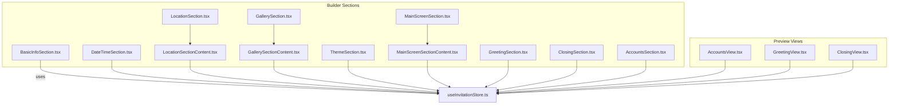
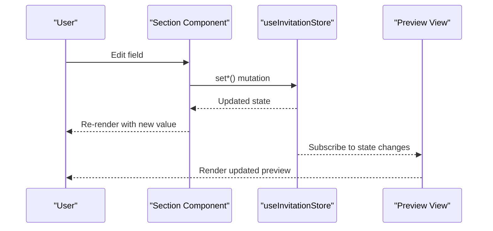
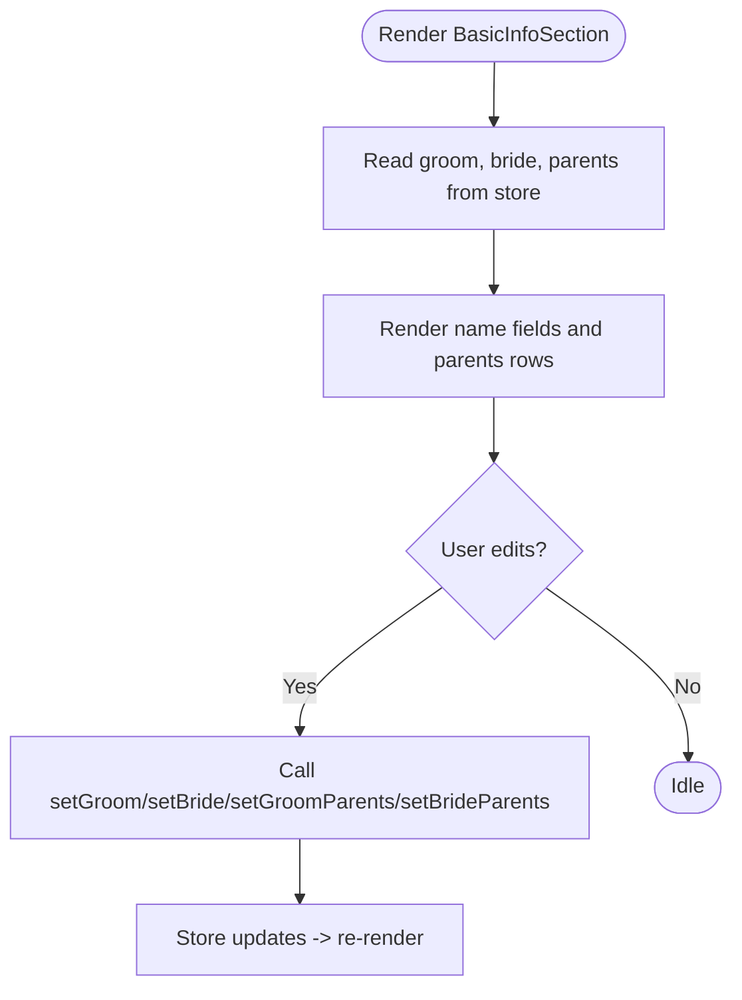
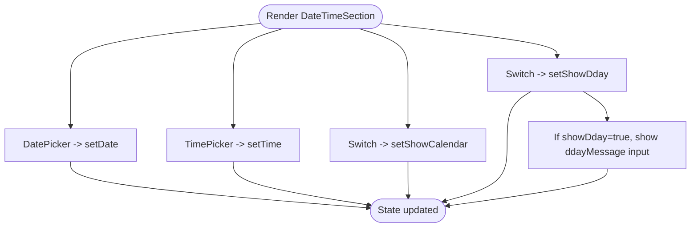
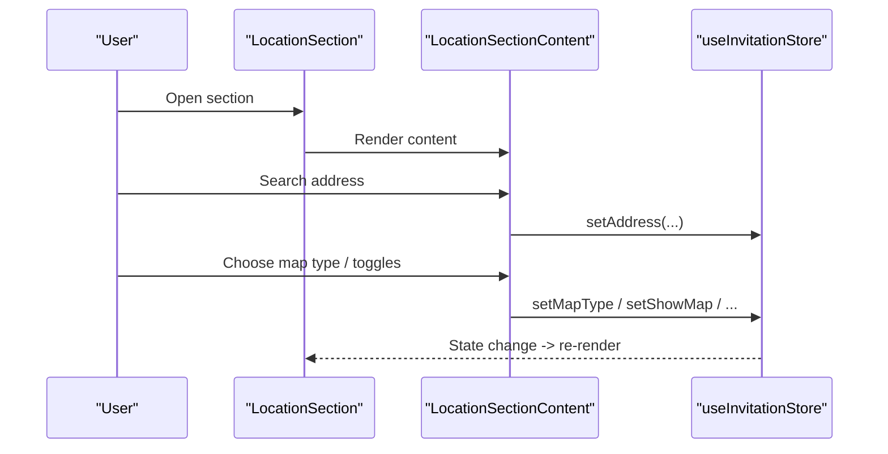
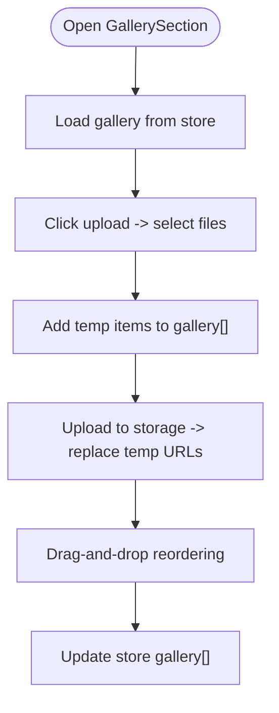
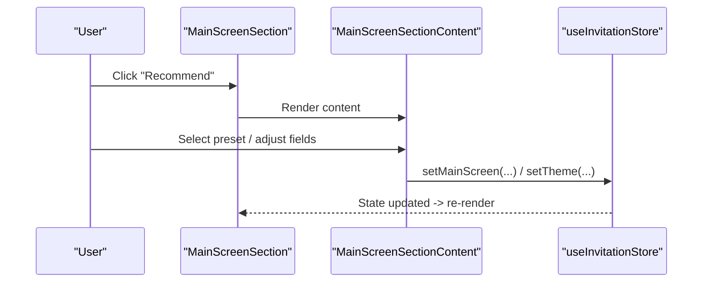
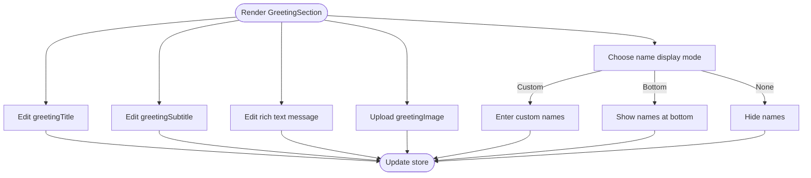
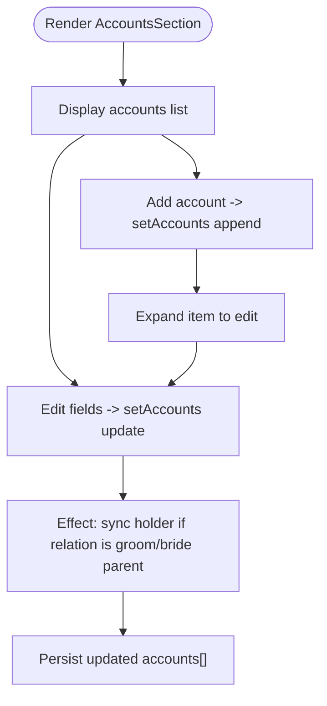
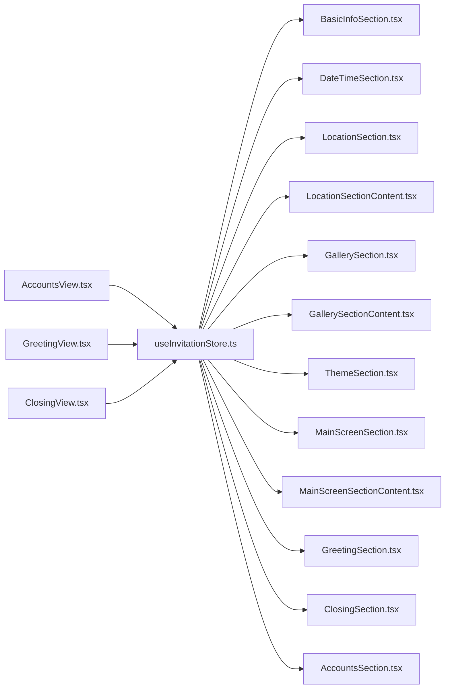

# Section Components

<cite>
**Referenced Files in This Document**
- [BasicInfoSection.tsx](file://src/components/builder/sections/BasicInfoSection.tsx)
- [DateTimeSection.tsx](file://src/components/builder/sections/DateTimeSection.tsx)
- [LocationSection.tsx](file://src/components/builder/sections/LocationSection.tsx)
- [LocationSectionContent.tsx](file://src/components/builder/sections/LocationSectionContent.tsx)
- [GallerySection.tsx](file://src/components/builder/sections/GallerySection.tsx)
- [GallerySectionContent.tsx](file://src/components/builder/sections/GallerySectionContent.tsx)
- [ThemeSection.tsx](file://src/components/builder/sections/ThemeSection.tsx)
- [MainScreenSection.tsx](file://src/components/builder/sections/MainScreenSection.tsx)
- [MainScreenSectionContent.tsx](file://src/components/builder/sections/MainScreenSectionContent.tsx)
- [GreetingSection.tsx](file://src/components/builder/sections/GreetingSection.tsx)
- [ClosingSection.tsx](file://src/components/builder/sections/ClosingSection.tsx)
- [AccountsSection.tsx](file://src/components/builder/sections/AccountsSection.tsx)
- [builder.ts](file://src/types/builder.ts)
- [useInvitationStore.ts](file://src/store/useInvitationStore.ts)
- [AccountsView.tsx](file://src/components/preview/sections/AccountsView.tsx)
- [GreetingView.tsx](file://src/components/preview/sections/GreetingView.tsx)
- [ClosingView.tsx](file://src/components/preview/sections/ClosingView.tsx)
</cite>

## Table of Contents
1. [Introduction](#introduction)
2. [Project Structure](#project-structure)
3. [Core Components](#core-components)
4. [Architecture Overview](#architecture-overview)
5. [Detailed Component Analysis](#detailed-component-analysis)
6. [Dependency Analysis](#dependency-analysis)
7. [Performance Considerations](#performance-considerations)
8. [Troubleshooting Guide](#troubleshooting-guide)
9. [Conclusion](#conclusion)

## Introduction
This document explains the modular section components that compose the invitation builder. Each section encapsulates a distinct invitation element (e.g., basic names, date/time, location, gallery, theme, main screen, greeting, closing, accounts). Sections are built with a shared props contract, Zustand-backed state, reusable form primitives, and optional preview variants. The goal is to help developers understand how sections are structured, how state flows through them, how to customize them, and how they integrate into the overall invitation.

## Project Structure
The section components live under the builder’s sections directory and are paired with preview-only presentation components. Each builder section composes:
- An accordion wrapper that controls visibility and completion state
- A content component (where applicable) that renders the editable fields
- A preview view counterpart that renders the same data without editability

**Diagram sources**
- [BasicInfoSection.tsx](file://src/components/builder/sections/BasicInfoSection.tsx#L15-L131)
- [DateTimeSection.tsx](file://src/components/builder/sections/DateTimeSection.tsx#L15-L92)
- [LocationSection.tsx](file://src/components/builder/sections/LocationSection.tsx#L8-L22)
- [LocationSectionContent.tsx](file://src/components/builder/sections/LocationSectionContent.tsx#L24-L259)
- [GallerySection.tsx](file://src/components/builder/sections/GallerySection.tsx#L9-L22)
- [GallerySectionContent.tsx](file://src/components/builder/sections/GallerySectionContent.tsx#L106-L368)
- [ThemeSection.tsx](file://src/components/builder/sections/ThemeSection.tsx#L22-L133)
- [MainScreenSection.tsx](file://src/components/builder/sections/MainScreenSection.tsx#L18-L59)
- [MainScreenSectionContent.tsx](file://src/components/builder/sections/MainScreenSectionContent.tsx#L54-L384)
- [GreetingSection.tsx](file://src/components/builder/sections/GreetingSection.tsx#L24-L198)
- [ClosingSection.tsx](file://src/components/builder/sections/ClosingSection.tsx#L25-L106)
- [AccountsSection.tsx](file://src/components/builder/sections/AccountsSection.tsx#L19-L304)
- [AccountsView.tsx](file://src/components/preview/sections/AccountsView.tsx#L36-L126)
- [GreetingView.tsx](file://src/components/preview/sections/GreetingView.tsx#L43-L157)
- [ClosingView.tsx](file://src/components/preview/sections/ClosingView.tsx#L37-L196)
- [useInvitationStore.ts](file://src/store/useInvitationStore.ts#L4-L230)

**Section sources**
- [BasicInfoSection.tsx](file://src/components/builder/sections/BasicInfoSection.tsx#L1-L134)
- [DateTimeSection.tsx](file://src/components/builder/sections/DateTimeSection.tsx#L1-L95)
- [LocationSection.tsx](file://src/components/builder/sections/LocationSection.tsx#L1-L25)
- [LocationSectionContent.tsx](file://src/components/builder/sections/LocationSectionContent.tsx#L1-L260)
- [GallerySection.tsx](file://src/components/builder/sections/GallerySection.tsx#L1-L25)
- [GallerySectionContent.tsx](file://src/components/builder/sections/GallerySectionContent.tsx#L1-L369)
- [ThemeSection.tsx](file://src/components/builder/sections/ThemeSection.tsx#L1-L136)
- [MainScreenSection.tsx](file://src/components/builder/sections/MainScreenSection.tsx#L1-L60)
- [MainScreenSectionContent.tsx](file://src/components/builder/sections/MainScreenSectionContent.tsx#L1-L385)
- [GreetingSection.tsx](file://src/components/builder/sections/GreetingSection.tsx#L1-L199)
- [ClosingSection.tsx](file://src/components/builder/sections/ClosingSection.tsx#L1-L107)
- [AccountsSection.tsx](file://src/components/builder/sections/AccountsSection.tsx#L1-L305)
- [AccountsView.tsx](file://src/components/preview/sections/AccountsView.tsx#L1-L127)
- [GreetingView.tsx](file://src/components/preview/sections/GreetingView.tsx#L1-L158)
- [ClosingView.tsx](file://src/components/preview/sections/ClosingView.tsx#L1-L197)
- [useInvitationStore.ts](file://src/store/useInvitationStore.ts#L1-L534)

## Core Components
- Shared props contract: Each section receives a consistent shape via the SectionProps interface, ensuring uniform behavior across sections.
- State management: All sections read and write to a centralized Zustand store, enabling cross-section synchronization and persistence.
- Rendering model: Sections wrap their content in an accordion container that reflects completion status and toggles visibility.

Key shared interfaces and store shapes:
- SectionProps: value, isOpen
- InvitationState: comprehensive state for all sections and UI flags
- Preview views: presentational components mirroring builder data

**Section sources**
- [builder.ts](file://src/types/builder.ts#L12-L15)
- [useInvitationStore.ts](file://src/store/useInvitationStore.ts#L4-L230)

## Architecture Overview
The builder sections follow a layered architecture:
- UI Layer: Each section is a React component with memoization for performance.
- State Layer: Zustand store holds all invitation data and exposes setters.
- Presentation Layer: Preview components render the same data without editability.

**Diagram sources**
- [BasicInfoSection.tsx](file://src/components/builder/sections/BasicInfoSection.tsx#L16-L21)
- [GreetingSection.tsx](file://src/components/builder/sections/GreetingSection.tsx#L44-L63)
- [useInvitationStore.ts](file://src/store/useInvitationStore.ts#L373-L473)
- [GreetingView.tsx](file://src/components/preview/sections/GreetingView.tsx#L43-L58)

## Detailed Component Analysis

### BasicInfoSection
- Purpose: Capture groom/bride names and parents’ names/death status.
- Props: SectionProps (value, isOpen)
- State bindings: Uses shallow selectors to subscribe to groom, bride, and their parents.
- Completion: Marked complete when both groom and bride have first names.
- Rendering: Two-person forms with “deceased” toggles per parent.

**Diagram sources**
- [BasicInfoSection.tsx](file://src/components/builder/sections/BasicInfoSection.tsx#L15-L131)
- [useInvitationStore.ts](file://src/store/useInvitationStore.ts#L129-L137)

**Section sources**
- [BasicInfoSection.tsx](file://src/components/builder/sections/BasicInfoSection.tsx#L1-L134)
- [useInvitationStore.ts](file://src/store/useInvitationStore.ts#L4-L230)

### DateTimeSection
- Purpose: Configure wedding date, time, calendar visibility, and D-Day display.
- Props: SectionProps
- State bindings: date, time, showCalendar, showDday, ddayMessage.
- Completion: Complete when date and time are set.
- Rendering: Date/time pickers, switches, and conditional D-Day message input.

**Diagram sources**
- [DateTimeSection.tsx](file://src/components/builder/sections/DateTimeSection.tsx#L15-L92)
- [useInvitationStore.ts](file://src/store/useInvitationStore.ts#L135-L137)

**Section sources**
- [DateTimeSection.tsx](file://src/components/builder/sections/DateTimeSection.tsx#L1-L95)
- [useInvitationStore.ts](file://src/store/useInvitationStore.ts#L83-L87)

### LocationSection + LocationSectionContent
- Purpose: Enter venue name, address, contact, and map options.
- Props: SectionProps
- Composition: Parent section wraps a content component that handles address search, map type selection, and map settings.
- Completion: Complete when address exists.
- Rendering: Venue name, detail room, phone, map type selector, map toggles, height, and zoom.

**Diagram sources**
- [LocationSection.tsx](file://src/components/builder/sections/LocationSection.tsx#L8-L22)
- [LocationSectionContent.tsx](file://src/components/builder/sections/LocationSectionContent.tsx#L24-L259)
- [useInvitationStore.ts](file://src/store/useInvitationStore.ts#L142-L154)

**Section sources**
- [LocationSection.tsx](file://src/components/builder/sections/LocationSection.tsx#L1-L25)
- [LocationSectionContent.tsx](file://src/components/builder/sections/LocationSectionContent.tsx#L1-L260)
- [useInvitationStore.ts](file://src/store/useInvitationStore.ts#L34-L48)

### GallerySection + GallerySectionContent
- Purpose: Manage photo gallery with drag-to-reorder, upload, and preview options.
- Props: SectionProps
- Composition: Parent section delegates to content component.
- State bindings: gallery[], galleryTitle, gallerySubtitle, galleryType, galleryPopup, galleryPreview, galleryFade, galleryAutoplay.
- Rendering: Grid of sortable items, upload button, and feature toggles.

**Diagram sources**
- [GallerySection.tsx](file://src/components/builder/sections/GallerySection.tsx#L9-L22)
- [GallerySectionContent.tsx](file://src/components/builder/sections/GallerySectionContent.tsx#L106-L368)
- [useInvitationStore.ts](file://src/store/useInvitationStore.ts#L103-L111)

**Section sources**
- [GallerySection.tsx](file://src/components/builder/sections/GallerySection.tsx#L1-L25)
- [GallerySectionContent.tsx](file://src/components/builder/sections/GallerySectionContent.tsx#L1-L369)
- [useInvitationStore.ts](file://src/store/useInvitationStore.ts#L103-L111)

### ThemeSection
- Purpose: Customize typography, colors, background pattern, and global effects.
- Props: SectionProps
- State bindings: theme fields (font, backgroundColor, accentColor, fontScale, pattern, effect).
- Rendering: Preset color chips, font selector, segmented controls for sizes and patterns.

**Section sources**
- [ThemeSection.tsx](file://src/components/builder/sections/ThemeSection.tsx#L1-L136)
- [useInvitationStore.ts](file://src/store/useInvitationStore.ts#L88-L101)

### MainScreenSection + MainScreenSectionContent
- Purpose: Configure main screen image, layout presets, and effects.
- Props: SectionProps
- Composition: Parent section adds header action to open a sample modal; content renders image uploader, style presets, and layout-specific fields.
- State bindings: mainScreen, theme, image, ratios, and layout-specific fields.
- Rendering: Image uploader, horizontal swiper of style presets, and conditional fields per layout.

**Diagram sources**
- [MainScreenSection.tsx](file://src/components/builder/sections/MainScreenSection.tsx#L18-L59)
- [MainScreenSectionContent.tsx](file://src/components/builder/sections/MainScreenSectionContent.tsx#L54-L384)
- [useInvitationStore.ts](file://src/store/useInvitationStore.ts#L62-L81)

**Section sources**
- [MainScreenSection.tsx](file://src/components/builder/sections/MainScreenSection.tsx#L1-L60)
- [MainScreenSectionContent.tsx](file://src/components/builder/sections/MainScreenSectionContent.tsx#L1-L385)
- [useInvitationStore.ts](file://src/store/useInvitationStore.ts#L62-L81)

### GreetingSection
- Purpose: Compose the invitation greeting with rich text, optional image, and name display modes.
- Props: SectionProps
- State bindings: greetingTitle, greetingSubtitle, message, greetingImage, greetingRatio, name display options.
- Rendering: Title/subtitle, rich text editor, image uploader, and segmented controls for name display modes.

**Diagram sources**
- [GreetingSection.tsx](file://src/components/builder/sections/GreetingSection.tsx#L24-L198)
- [useInvitationStore.ts](file://src/store/useInvitationStore.ts#L50-L61)

**Section sources**
- [GreetingSection.tsx](file://src/components/builder/sections/GreetingSection.tsx#L1-L199)
- [useInvitationStore.ts](file://src/store/useInvitationStore.ts#L50-L61)

### ClosingSection
- Purpose: Final message, optional image, and sharing actions.
- Props: SectionProps
- State bindings: closing fields (title, subtitle, content, imageUrl, ratio).
- Rendering: Title/subtitle, rich text editor, image uploader, and share actions.

**Section sources**
- [ClosingSection.tsx](file://src/components/builder/sections/ClosingSection.tsx#L1-L107)
- [useInvitationStore.ts](file://src/store/useInvitationStore.ts#L204-L212)

### AccountsSection
- Purpose: Manage gift account lists with automatic holder sync based on groom/bride relations.
- Props: SectionProps
- State bindings: accounts[], accountsTitle, accountsSubtitle, accountsDescription, accountsGroomTitle, accountsBrideTitle, accountsColorMode.
- Rendering: Expandable account items with type/relation/bank/account holder fields; auto-syncs holder when related person info changes.

**Diagram sources**
- [AccountsSection.tsx](file://src/components/builder/sections/AccountsSection.tsx#L19-L304)
- [useInvitationStore.ts](file://src/store/useInvitationStore.ts#L113-L127)

**Section sources**
- [AccountsSection.tsx](file://src/components/builder/sections/AccountsSection.tsx#L1-L305)
- [useInvitationStore.ts](file://src/store/useInvitationStore.ts#L113-L127)

## Dependency Analysis
- Shared dependencies:
  - SectionProps interface ensures consistent props across sections.
  - Zustand store provides a single source of truth for all invitation data.
  - Common UI primitives (AccordionItem, Field, SectionContainer, etc.) unify styling and behavior.
- Cross-section dependencies:
  - Main screen layout affects how names and dates appear; preview components reflect these choices.
  - AccountsSection auto-syncs holders based on groom/bride state.
  - LocationSectionContent integrates external map SDKs and address search.

**Diagram sources**
- [useInvitationStore.ts](file://src/store/useInvitationStore.ts#L1-L534)
- [AccountsView.tsx](file://src/components/preview/sections/AccountsView.tsx#L36-L126)
- [GreetingView.tsx](file://src/components/preview/sections/GreetingView.tsx#L43-L157)
- [ClosingView.tsx](file://src/components/preview/sections/ClosingView.tsx#L37-L196)

**Section sources**
- [builder.ts](file://src/types/builder.ts#L12-L15)
- [useInvitationStore.ts](file://src/store/useInvitationStore.ts#L1-L534)

## Performance Considerations
- Memoization: Sections are wrapped with React.memo to avoid unnecessary re-renders when props are unchanged.
- Selective subscriptions: Components use shallow selectors to subscribe only to relevant slices of state, minimizing re-renders.
- Conditional rendering: Sections render content only when open, reducing DOM work.
- Drag-and-drop: GallerySectionContent uses @dnd-kit with pointer and keyboard sensors; ensure minimal work in sensors and handlers.
- Dynamic imports: Some components (e.g., rich text editor, map SDK loader) are loaded dynamically to reduce initial bundle size.

[No sources needed since this section provides general guidance]

## Troubleshooting Guide
- Section not completing:
  - Verify isCompleted logic matches required fields (e.g., BasicInfo requires groom and bride first names; DateTime requires date and time).
- Gallery uploads failing:
  - Check upload module import and network errors; confirm temporary blob URLs are replaced after successful uploads.
- Map not updating:
  - Ensure SDK readiness and address geocoding are triggered after address changes.
- Accounts holder not syncing:
  - Confirm relation is one of groom/bride parents; effect runs when related state changes.

**Section sources**
- [BasicInfoSection.tsx](file://src/components/builder/sections/BasicInfoSection.tsx#L29-L29)
- [DateTimeSection.tsx](file://src/components/builder/sections/DateTimeSection.tsx#L46-L46)
- [GallerySectionContent.tsx](file://src/components/builder/sections/GallerySectionContent.tsx#L189-L204)
- [LocationSectionContent.tsx](file://src/components/builder/sections/LocationSectionContent.tsx#L86-L103)
- [AccountsSection.tsx](file://src/components/builder/sections/AccountsSection.tsx#L87-L104)

## Conclusion
The section components system is a cohesive, state-driven architecture that separates concerns between editing and presentation. By adhering to a shared props contract and a centralized store, each section remains modular, testable, and easy to extend. Preview components mirror builder data, ensuring consistency across the editing and viewing experiences.