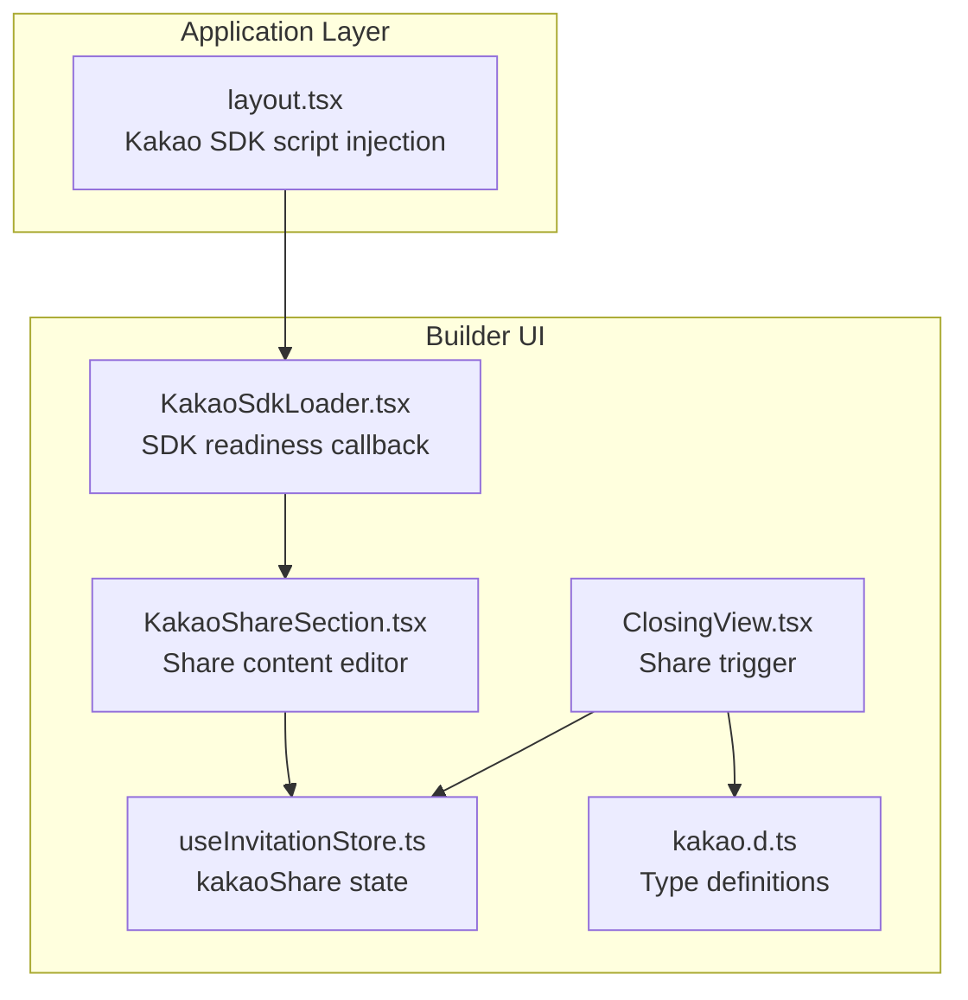
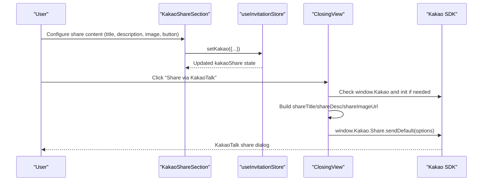
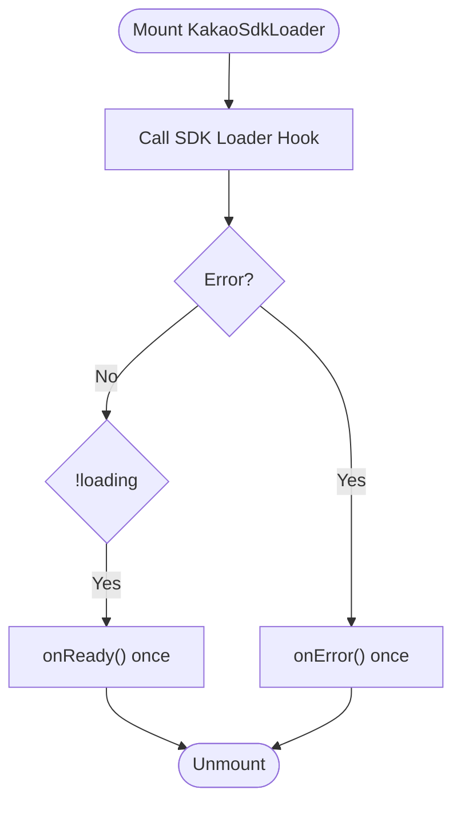
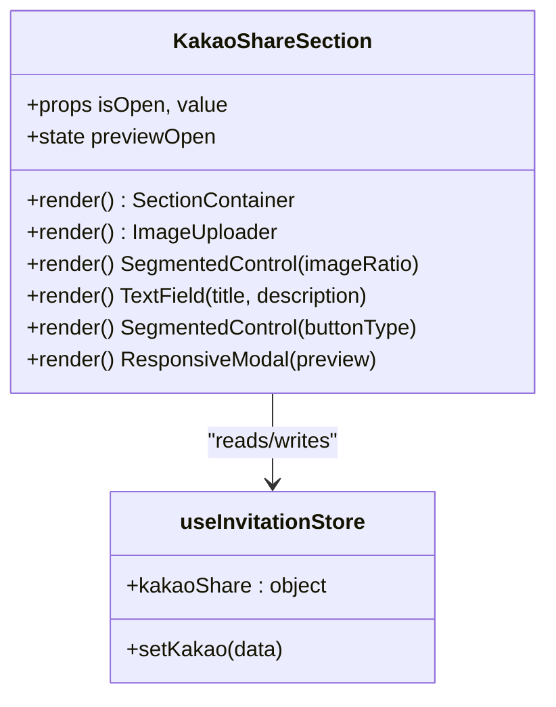
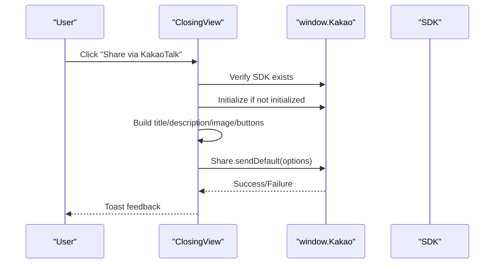
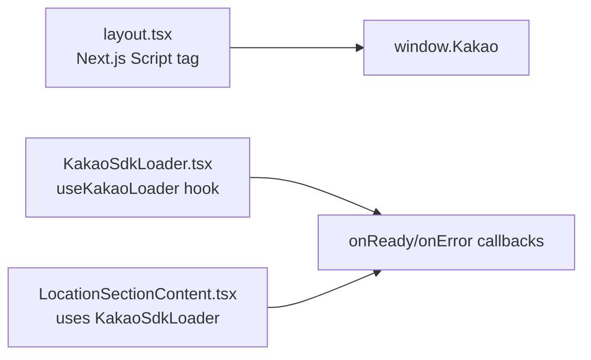
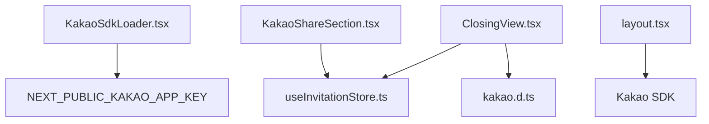

# Social Sharing Section

<cite>
**Referenced Files in This Document**
- [KakaoSdkLoader.tsx](file://src/components/builder/sections/KakaoSdkLoader.tsx)
- [KakaoShareSection.tsx](file://src/components/builder/sections/KakaoShareSection.tsx)
- [ClosingView.tsx](file://src/components/preview/sections/ClosingView.tsx)
- [useInvitationStore.ts](file://src/store/useInvitationStore.ts)
- [layout.tsx](file://src/app/layout.tsx)
- [kakao.d.ts](file://src/types/kakao.d.ts)
- [LocationSectionContent.tsx](file://src/components/builder/sections/LocationSectionContent.tsx)
- [KakaoShareSection.module.scss](file://src/components/builder/sections/KakaoShareSection.module.scss)
</cite>

## Table of Contents
1. [Introduction](#introduction)
2. [Project Structure](#project-structure)
3. [Core Components](#core-components)
4. [Architecture Overview](#architecture-overview)
5. [Detailed Component Analysis](#detailed-component-analysis)
6. [Dependency Analysis](#dependency-analysis)
7. [Performance Considerations](#performance-considerations)
8. [Troubleshooting Guide](#troubleshooting-guide)
9. [Conclusion](#conclusion)

## Introduction
This document explains the Social Sharing Section components with a focus on KakaoTalk integration. It covers how the Kakao SDK is loaded and initialized, how the social sharing UI is built, and how the sharing functionality is triggered. It also documents the KakaoSdkLoader component's role in managing external SDK dependencies and the KakaoShareSection's implementation of share content configuration. Examples of sharing triggers, content preparation, and user experience patterns are included, along with integration patterns for social media APIs and error handling strategies.

## Project Structure
The social sharing functionality spans three primary areas:
- SDK loading and initialization at the application level
- Builder UI for configuring share content
- Preview section that triggers KakaoTalk sharing

**Diagram sources**
- [layout.tsx](file://src/app/layout.tsx#L87-L99)
- [KakaoSdkLoader.tsx](file://src/components/builder/sections/KakaoSdkLoader.tsx#L1-L33)
- [KakaoShareSection.tsx](file://src/components/builder/sections/KakaoShareSection.tsx#L1-L153)
- [ClosingView.tsx](file://src/components/preview/sections/ClosingView.tsx#L63-L116)
- [useInvitationStore.ts](file://src/store/useInvitationStore.ts#L193-L202)
- [kakao.d.ts](file://src/types/kakao.d.ts#L268-L301)

**Section sources**
- [layout.tsx](file://src/app/layout.tsx#L87-L99)
- [KakaoSdkLoader.tsx](file://src/components/builder/sections/KakaoSdkLoader.tsx#L1-L33)
- [KakaoShareSection.tsx](file://src/components/builder/sections/KakaoShareSection.tsx#L1-L153)
- [ClosingView.tsx](file://src/components/preview/sections/ClosingView.tsx#L63-L116)
- [useInvitationStore.ts](file://src/store/useInvitationStore.ts#L193-L202)
- [kakao.d.ts](file://src/types/kakao.d.ts#L268-L301)

## Core Components
- KakaoSdkLoader: Manages SDK loading lifecycle and emits ready/error callbacks.
- KakaoShareSection: Provides a form to configure share content (title, description, image, button type) and a live preview modal.
- ClosingView: Implements the share trigger that prepares content and invokes the Kakao SDK.
- useInvitationStore: Centralizes the kakaoShare state and setters.
- kakao.d.ts: Declares Kakao SDK types and interfaces for TypeScript safety.

Key responsibilities:
- SDK loading: Ensures Kakao SDK is available before sharing.
- Content preparation: Builds share payload from store state and page context.
- Error handling: Validates SDK presence, initialization, and API availability.

**Section sources**
- [KakaoSdkLoader.tsx](file://src/components/builder/sections/KakaoSdkLoader.tsx#L11-L32)
- [KakaoShareSection.tsx](file://src/components/builder/sections/KakaoShareSection.tsx#L22-L99)
- [ClosingView.tsx](file://src/components/preview/sections/ClosingView.tsx#L63-L116)
- [useInvitationStore.ts](file://src/store/useInvitationStore.ts#L193-L202)
- [kakao.d.ts](file://src/types/kakao.d.ts#L268-L301)

## Architecture Overview
The sharing flow integrates three layers:
- Application-level SDK injection via Next.js Script
- Builder-level share content configuration
- Preview-level share trigger with content preparation

**Diagram sources**
- [KakaoShareSection.tsx](file://src/components/builder/sections/KakaoShareSection.tsx#L47-L96)
- [useInvitationStore.ts](file://src/store/useInvitationStore.ts#L456-L467)
- [ClosingView.tsx](file://src/components/preview/sections/ClosingView.tsx#L63-L116)
- [kakao.d.ts](file://src/types/kakao.d.ts#L271-L280)

## Detailed Component Analysis

### KakaoSdkLoader Component
Purpose:
- Load Kakao Maps SDK with required libraries and notify readiness or errors.
- Provide a hook-like callback pattern for downstream components.

Implementation highlights:
- Uses a dedicated SDK loader hook to manage loading state and error.
- Emits onReady/onError exactly once using a ref guard.
- Reads NEXT_PUBLIC_KAKAO_APP_KEY from environment.

Integration pattern:
- Dynamically imported in sections that require Kakao Maps services (e.g., LocationSectionContent).
- Used in builder UI to ensure SDK availability before geocoding/address lookup.

**Diagram sources**
- [KakaoSdkLoader.tsx](file://src/components/builder/sections/KakaoSdkLoader.tsx#L11-L32)

**Section sources**
- [KakaoSdkLoader.tsx](file://src/components/builder/sections/KakaoSdkLoader.tsx#L1-L33)
- [LocationSectionContent.tsx](file://src/components/builder/sections/LocationSectionContent.tsx#L18-L134)

### KakaoShareSection Component
Purpose:
- Allow users to configure share content for KakaoTalk previews and actual shares.

Key UI elements:
- Image uploader with aspect ratio controls (portrait/landscape).
- Text fields for title and description with character limits.
- Button style selector (location/rsvp/none).
- Live preview modal showing how the feed card appears in KakaoTalk.

State management:
- Reads and writes to kakaoShare via useInvitationStore.
- Uses segmented controls and form primitives for consistent UX.

**Diagram sources**
- [KakaoShareSection.tsx](file://src/components/builder/sections/KakaoShareSection.tsx#L22-L99)
- [useInvitationStore.ts](file://src/store/useInvitationStore.ts#L193-L202)

**Section sources**
- [KakaoShareSection.tsx](file://src/components/builder/sections/KakaoShareSection.tsx#L1-L153)
- [KakaoShareSection.module.scss](file://src/components/builder/sections/KakaoShareSection.module.scss#L82-L153)
- [useInvitationStore.ts](file://src/store/useInvitationStore.ts#L193-L202)

### ClosingView Share Trigger
Purpose:
- Provide a user-triggered share action that builds the payload and calls the Kakao SDK.

Content preparation:
- Validates SDK presence and initializes if needed.
- Constructs shareTitle, shareDesc, and shareImageUrl from store and page context.
- Conditionally adds a button based on buttonType.

Error handling:
- Checks for SDK readiness and API availability.
- Catches exceptions during share invocation and displays user-friendly messages.

**Diagram sources**
- [ClosingView.tsx](file://src/components/preview/sections/ClosingView.tsx#L63-L116)
- [kakao.d.ts](file://src/types/kakao.d.ts#L271-L280)

**Section sources**
- [ClosingView.tsx](file://src/components/preview/sections/ClosingView.tsx#L63-L116)
- [kakao.d.ts](file://src/types/kakao.d.ts#L283-L301)

### SDK Loading Mechanism and Initialization
Two complementary mechanisms ensure the SDK is ready:
- Application-level script injection in layout.tsx
- Component-level loader for specific sections (e.g., LocationSectionContent)

**Diagram sources**
- [layout.tsx](file://src/app/layout.tsx#L87-L99)
- [KakaoSdkLoader.tsx](file://src/components/builder/sections/KakaoSdkLoader.tsx#L13-L16)
- [LocationSectionContent.tsx](file://src/components/builder/sections/LocationSectionContent.tsx#L18-L134)

**Section sources**
- [layout.tsx](file://src/app/layout.tsx#L87-L99)
- [KakaoSdkLoader.tsx](file://src/components/builder/sections/KakaoSdkLoader.tsx#L1-L33)
- [LocationSectionContent.tsx](file://src/components/builder/sections/LocationSectionContent.tsx#L18-L134)

## Dependency Analysis
- KakaoSdkLoader depends on react-kakao-maps-sdk for SDK loading and on environment variables for the app key.
- KakaoShareSection depends on useInvitationStore for state and on UI primitives for form controls.
- ClosingView depends on window.Kakao APIs and on useInvitationStore for optional overrides.
- kakao.d.ts provides type-safe access to window.Kakao.Share and related interfaces.

**Diagram sources**
- [KakaoSdkLoader.tsx](file://src/components/builder/sections/KakaoSdkLoader.tsx#L13-L16)
- [KakaoShareSection.tsx](file://src/components/builder/sections/KakaoShareSection.tsx#L23-L24)
- [useInvitationStore.ts](file://src/store/useInvitationStore.ts#L193-L202)
- [ClosingView.tsx](file://src/components/preview/sections/ClosingView.tsx#L63-L116)
- [kakao.d.ts](file://src/types/kakao.d.ts#L268-L301)
- [layout.tsx](file://src/app/layout.tsx#L87-L99)

**Section sources**
- [KakaoSdkLoader.tsx](file://src/components/builder/sections/KakaoSdkLoader.tsx#L1-L33)
- [KakaoShareSection.tsx](file://src/components/builder/sections/KakaoShareSection.tsx#L1-L153)
- [ClosingView.tsx](file://src/components/preview/sections/ClosingView.tsx#L63-L116)
- [useInvitationStore.ts](file://src/store/useInvitationStore.ts#L193-L202)
- [kakao.d.ts](file://src/types/kakao.d.ts#L268-L301)
- [layout.tsx](file://src/app/layout.tsx#L87-L99)

## Performance Considerations
- Defer SDK loading until interactive: The SDK script uses strategy="afterInteractive" and the loader defers heavy operations until ready.
- Conditional rendering: The share preview modal is only rendered when opened, minimizing DOM overhead.
- Minimal re-renders: KakaoShareSection uses shallow selectors to avoid unnecessary updates.
- Lazy loading of heavy components: Dynamic imports are used for modals and postcode embeds.

## Troubleshooting Guide
Common issues and resolutions:
- SDK not initialized: ClosingView checks window.Kakao.isInitialized and initializes if missing. Ensure NEXT_PUBLIC_KAKAO_APP_KEY is set.
- Share API unavailable: ClosingView validates window.Kakao.Share.sendDefault and shows a user-friendly error.
- SDK loading delays: Use KakaoSdkLoader.onReady to gate dependent features (e.g., geocoding).
- Environment configuration: Confirm the app key is present in the environment and that the layout injects the SDK script.

Error handling patterns:
- SDK readiness: Use KakaoSdkLoader to coordinate readiness across sections.
- Runtime errors: Wrap share invocation in try/catch and display toast notifications.
- Fallback content: Provide defaults for title/description/image when store values are empty.

**Section sources**
- [ClosingView.tsx](file://src/components/preview/sections/ClosingView.tsx#L63-L116)
- [KakaoSdkLoader.tsx](file://src/components/builder/sections/KakaoSdkLoader.tsx#L18-L29)
- [layout.tsx](file://src/app/layout.tsx#L87-L99)

## Conclusion
The Social Sharing Section combines a robust SDK loading strategy with a configurable share content editor and a reliable share trigger. KakaoSdkLoader ensures the SDK is ready before use, KakaoShareSection enables intuitive content authoring, and ClosingView delivers a seamless sharing experience with strong error handling. Together, these components provide a cohesive, user-friendly KakaoTalk integration suitable for digital invitations.