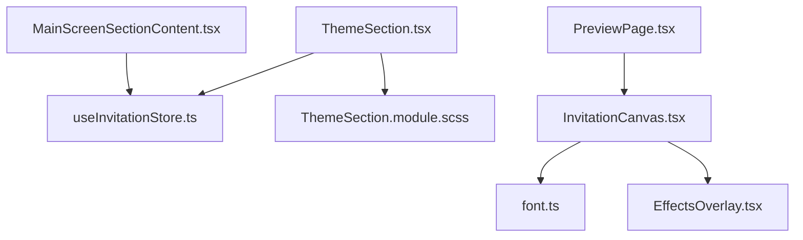
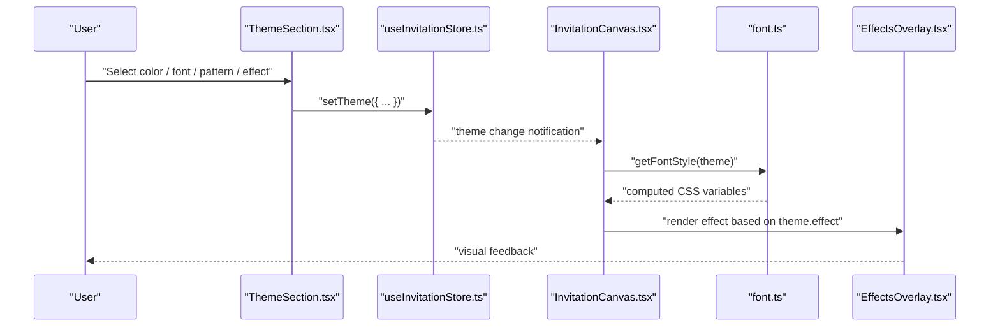
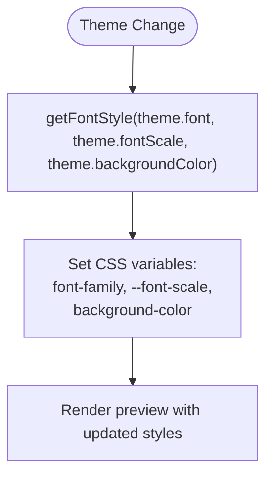
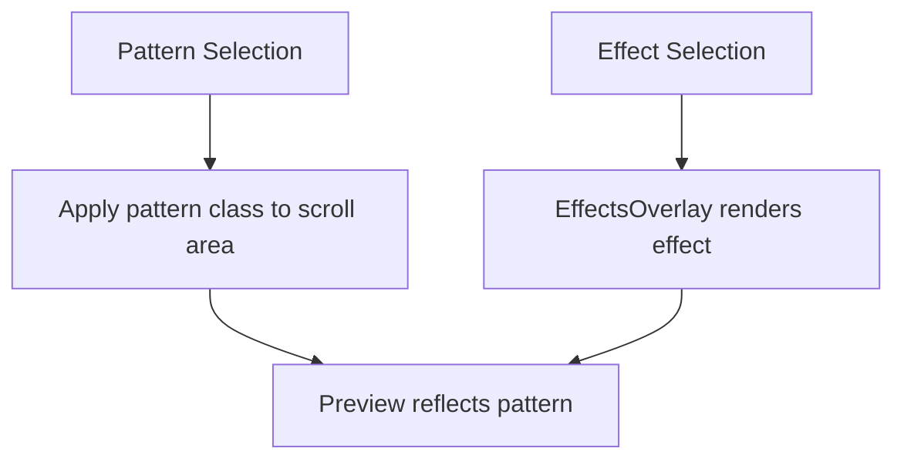
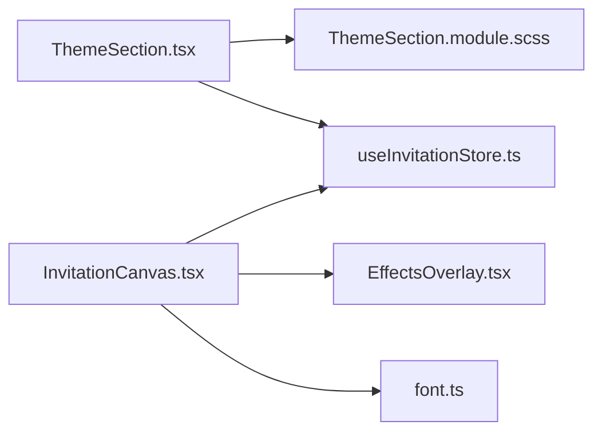

# Theme Section

<cite>
**Referenced Files in This Document**
- [ThemeSection.tsx](file://src/components/builder/sections/ThemeSection.tsx)
- [ThemeSection.module.scss](file://src/components/builder/sections/ThemeSection.module.scss)
- [useInvitationStore.ts](file://src/store/useInvitationStore.ts)
- [font.ts](file://src/lib/utils/font.ts)
- [InvitationCanvas.tsx](file://src/components/preview/InvitationCanvas.tsx)
- [EffectsOverlay.tsx](file://src/components/preview/sections/EffectsOverlay.tsx)
- [PreviewPage.tsx](file://src/app/preview/page.tsx)
- [MainScreenSectionContent.tsx](file://src/components/builder/sections/MainScreenSectionContent.tsx)
- [builder.ts](file://src/types/builder.ts)
</cite>

## Table of Contents
1. [Introduction](#introduction)
2. [Project Structure](#project-structure)
3. [Core Components](#core-components)
4. [Architecture Overview](#architecture-overview)
5. [Detailed Component Analysis](#detailed-component-analysis)
6. [Dependency Analysis](#dependency-analysis)
7. [Performance Considerations](#performance-considerations)
8. [Troubleshooting Guide](#troubleshooting-guide)
9. [Conclusion](#conclusion)

## Introduction
This document explains the Theme Section component responsible for managing the invitation’s visual identity. It covers the theme selection system, color customization options, typography controls, background patterns, and design template management. It also documents how theme changes propagate through the preview system, enforces design consistency, and integrates with the builder’s state management.

## Project Structure
The Theme Section lives in the builder section components and collaborates with the global invitation store, font utilities, and the preview canvas.

**Diagram sources**
- [ThemeSection.tsx](file://src/components/builder/sections/ThemeSection.tsx#L1-L136)
- [useInvitationStore.ts](file://src/store/useInvitationStore.ts#L88-L101)
- [font.ts](file://src/lib/utils/font.ts#L1-L57)
- [InvitationCanvas.tsx](file://src/components/preview/InvitationCanvas.tsx#L291-L294)
- [EffectsOverlay.tsx](file://src/components/preview/sections/EffectsOverlay.tsx#L1-L168)
- [PreviewPage.tsx](file://src/app/preview/page.tsx#L1-L10)
- [MainScreenSectionContent.tsx](file://src/components/builder/sections/MainScreenSectionContent.tsx#L198-L233)

**Section sources**
- [ThemeSection.tsx](file://src/components/builder/sections/ThemeSection.tsx#L1-L136)
- [useInvitationStore.ts](file://src/store/useInvitationStore.ts#L88-L101)
- [font.ts](file://src/lib/utils/font.ts#L1-L57)
- [InvitationCanvas.tsx](file://src/components/preview/InvitationCanvas.tsx#L291-L294)
- [EffectsOverlay.tsx](file://src/components/preview/sections/EffectsOverlay.tsx#L1-L168)
- [PreviewPage.tsx](file://src/app/preview/page.tsx#L1-L10)
- [MainScreenSectionContent.tsx](file://src/components/builder/sections/MainScreenSectionContent.tsx#L198-L233)

## Core Components
- ThemeSection: Provides UI controls for theme-related customization and updates the global theme state.
- useInvitationStore: Centralized state for the entire invitation, including theme fields.
- InvitationCanvas: Consumes theme state to render the invitation preview with applied styles and effects.
- font utilities: Compute CSS variable overrides for typography and background.
- EffectsOverlay: Renders animated background effects based on theme settings.

Key theme fields managed by the store include:
- font: Typography family
- backgroundColor: Page background color
- accentColor: Accent color used across components
- fontScale: Global font scaling factor
- pattern: Background pattern variant
- effect: Global animated background effect
- effectOnlyOnMain: Whether effects apply only to the main screen
- animateEntrance: Entrance animations toggle
- preventZoom: Zoom prevention toggle

**Section sources**
- [useInvitationStore.ts](file://src/store/useInvitationStore.ts#L88-L101)
- [font.ts](file://src/lib/utils/font.ts#L34-L56)
- [InvitationCanvas.tsx](file://src/components/preview/InvitationCanvas.tsx#L291-L294)
- [EffectsOverlay.tsx](file://src/components/preview/sections/EffectsOverlay.tsx#L73-L163)

## Architecture Overview
The Theme Section updates the global theme state via the store. The preview canvas subscribes to theme changes and recomputes styles accordingly. Effects overlay reacts to theme effect settings.

**Diagram sources**
- [ThemeSection.tsx](file://src/components/builder/sections/ThemeSection.tsx#L36-L129)
- [useInvitationStore.ts](file://src/store/useInvitationStore.ts#L432-L432)
- [InvitationCanvas.tsx](file://src/components/preview/InvitationCanvas.tsx#L291-L294)
- [font.ts](file://src/lib/utils/font.ts#L34-L56)
- [EffectsOverlay.tsx](file://src/components/preview/sections/EffectsOverlay.tsx#L73-L163)

## Detailed Component Analysis

### ThemeSection.tsx
Responsibilities:
- Exposes color pickers for accent and background colors with preset palettes.
- Offers font family selection from a curated set.
- Controls global font scaling via segmented control.
- Manages background pattern selection.
- Updates the theme object in the store on user interaction.

User experience patterns:
- Immediate visual feedback through active state indicators and hover/press animations.
- Consistent spacing and responsive layout via shared form primitives and module styles.

Validation and constraints:
- Uses a controlled subset of font families and pattern values to maintain design consistency.
- Color selections are constrained to predefined palettes to preserve brand coherence.

Integration points:
- Subscribes to theme via shallow selector to minimize re-renders.
- Delegates store updates to setTheme with partial theme objects.

Examples:
- Switching accent color updates the preview’s accent color across sections.
- Changing font family applies a CSS variable-based font stack.
- Adjusting font scale globally scales text sizes consistently.

**Section sources**
- [ThemeSection.tsx](file://src/components/builder/sections/ThemeSection.tsx#L22-L133)
- [ThemeSection.module.scss](file://src/components/builder/sections/ThemeSection.module.scss#L1-L33)
- [builder.ts](file://src/types/builder.ts#L12-L15)

### State Management and Store Integration
The theme state is part of the InvitationState and updated atomically via setTheme. The store persists state to IndexedDB and merges new fields gracefully.

Key behaviors:
- setTheme performs a shallow merge of incoming theme changes into the existing theme object.
- The store initializes theme with sensible defaults for fonts, colors, and effects.

Consistency enforcement:
- By limiting font families and pattern options, the system avoids inconsistent typography or visuals.
- Accent color is propagated to preview sections to maintain unified branding.

**Section sources**
- [useInvitationStore.ts](file://src/store/useInvitationStore.ts#L88-L101)
- [useInvitationStore.ts](file://src/store/useInvitationStore.ts#L432-L432)
- [useInvitationStore.ts](file://src/store/useInvitationStore.ts#L330-L342)

### Preview Propagation and Design Consistency
The preview canvas consumes theme changes and applies them across all sections:
- Typography: getFontStyle computes CSS variables for font family and scale, and sets background color.
- Patterns: The scroll area receives a class based on the selected pattern to render background textures.
- Effects: EffectsOverlay renders cherry blossom or snow effects depending on theme settings.

Design consistency enforcement:
- All sections receive the same accentColor, ensuring coherent highlights.
- Background color is applied globally, affecting readability and contrast.
- Font scale affects all text uniformly, maintaining proportional hierarchy.

**Section sources**
- [InvitationCanvas.tsx](file://src/components/preview/InvitationCanvas.tsx#L291-L294)
- [InvitationCanvas.tsx](file://src/components/preview/InvitationCanvas.tsx#L306-L308)
- [font.ts](file://src/lib/utils/font.ts#L34-L56)
- [EffectsOverlay.tsx](file://src/components/preview/sections/EffectsOverlay.tsx#L73-L163)

### Color Palette Generation and Usage
The Theme Section exposes two color pickers:
- Accent color picker with a fixed set of preset colors.
- Background color picker with a curated set of light pastel tones.

Usage patterns:
- Clicking a color triggers setTheme with the chosen value.
- Active selection is visually indicated in the UI.
- Light background colors invert the check icon color for better visibility.

Note: The component does not expose a custom color picker in the current implementation. If needed, a color picker component could be integrated similarly to the existing segmented controls and selects.

**Section sources**
- [ThemeSection.tsx](file://src/components/builder/sections/ThemeSection.tsx#L36-L58)
- [ThemeSection.tsx](file://src/components/builder/sections/ThemeSection.tsx#L106-L129)
- [ThemeSection.module.scss](file://src/components/builder/sections/ThemeSection.module.scss#L17-L29)

### Typography and Font Scaling
The font utility composes a CSS variable-based font stack and applies a global scale factor. It also normalizes font availability across variables to avoid fallback mismatches.

Processing logic:
- Map selected font to a CSS variable.
- Set font-scale to the theme-provided multiplier.
- Apply background color to the root canvas style.

**Diagram sources**
- [font.ts](file://src/lib/utils/font.ts#L34-L56)
- [InvitationCanvas.tsx](file://src/components/preview/InvitationCanvas.tsx#L291-L294)

**Section sources**
- [font.ts](file://src/lib/utils/font.ts#L1-L57)
- [InvitationCanvas.tsx](file://src/components/preview/InvitationCanvas.tsx#L291-L294)

### Background Patterns and Effects
Background patterns:
- Selected via segmented control with three options: none, flower-sm, flower-lg.
- Applied as a class on the scroll area to trigger matching CSS background assets.

Effects:
- Controlled by theme.effect and theme.effectOnlyOnMain.
- EffectsOverlay generates animated particles and applies SVG variants for cherry blossom or snowfall.

**Diagram sources**
- [ThemeSection.tsx](file://src/components/builder/sections/ThemeSection.tsx#L93-L104)
- [InvitationCanvas.tsx](file://src/components/preview/InvitationCanvas.tsx#L306-L308)
- [EffectsOverlay.tsx](file://src/components/preview/sections/EffectsOverlay.tsx#L73-L163)

**Section sources**
- [ThemeSection.tsx](file://src/components/builder/sections/ThemeSection.tsx#L93-L104)
- [InvitationCanvas.tsx](file://src/components/preview/InvitationCanvas.tsx#L306-L308)
- [EffectsOverlay.tsx](file://src/components/preview/sections/EffectsOverlay.tsx#L73-L163)

### Design Template Management
While the Theme Section focuses on colors, fonts, and patterns, design templates are primarily handled in other sections (e.g., MainScreenSectionContent manages layout presets). The Theme Section complements templates by adjusting:
- Accent color to match template color schemes.
- Background color to complement template backgrounds.
- Font family and scale to align with template readability.

**Section sources**
- [MainScreenSectionContent.tsx](file://src/components/builder/sections/MainScreenSectionContent.tsx#L198-L233)
- [ThemeSection.tsx](file://src/components/builder/sections/ThemeSection.tsx#L60-L91)

## Dependency Analysis
The Theme Section depends on:
- Global store for theme state and setters.
- Shared UI primitives for forms and controls.
- Module styles for consistent layout and color interactions.

Preview rendering depends on:
- Theme state for computed styles and effects.
- Font utilities for CSS variable composition.
- Effects overlay for animated backgrounds.

**Diagram sources**
- [ThemeSection.tsx](file://src/components/builder/sections/ThemeSection.tsx#L1-L136)
- [useInvitationStore.ts](file://src/store/useInvitationStore.ts#L88-L101)
- [font.ts](file://src/lib/utils/font.ts#L1-L57)
- [InvitationCanvas.tsx](file://src/components/preview/InvitationCanvas.tsx#L291-L294)
- [EffectsOverlay.tsx](file://src/components/preview/sections/EffectsOverlay.tsx#L1-L168)

**Section sources**
- [ThemeSection.tsx](file://src/components/builder/sections/ThemeSection.tsx#L1-L136)
- [useInvitationStore.ts](file://src/store/useInvitationStore.ts#L88-L101)
- [font.ts](file://src/lib/utils/font.ts#L1-L57)
- [InvitationCanvas.tsx](file://src/components/preview/InvitationCanvas.tsx#L291-L294)
- [EffectsOverlay.tsx](file://src/components/preview/sections/EffectsOverlay.tsx#L1-L168)

## Performance Considerations
- Theme updates use shallow selectors to reduce unnecessary re-renders in the Theme Section.
- InvitationCanvas recomputes styles via a memoized function based on theme fields, minimizing layout thrash.
- EffectsOverlay conditionally renders and generates particles only when an effect is enabled, avoiding overhead when disabled.

Recommendations:
- Keep the number of theme options finite to maintain performance and consistency.
- Prefer CSS variables for scalable, efficient style updates.

[No sources needed since this section provides general guidance]

## Troubleshooting Guide
Common issues and resolutions:
- Theme changes not reflected in preview:
  - Verify that InvitationCanvas is subscribed to theme changes and that getFontStyle is invoked with the latest theme.
  - Confirm that pattern classes are applied to the scroll area and that effectOnlyOnMain is configured correctly.
- Accent color not visible on certain backgrounds:
  - Ensure the active color item adjusts icon color for contrast (light backgrounds invert icons).
- Font scaling not applying:
  - Check that getFontStyle sets the font-scale variable and that sections consume it via CSS.
- Effects not appearing:
  - Confirm that theme.effect is not set to none and that EffectsOverlay is rendered.

**Section sources**
- [InvitationCanvas.tsx](file://src/components/preview/InvitationCanvas.tsx#L291-L294)
- [EffectsOverlay.tsx](file://src/components/preview/sections/EffectsOverlay.tsx#L73-L163)
- [ThemeSection.module.scss](file://src/components/builder/sections/ThemeSection.module.scss#L17-L29)

## Conclusion
The Theme Section provides a focused, consistent way to customize the invitation’s visual identity. Through tight integration with the global store, font utilities, and the preview canvas, theme changes propagate seamlessly across all sections. The component enforces design consistency by constraining choices and leveraging shared styles and effects, while offering immediate visual feedback to enhance the user experience.