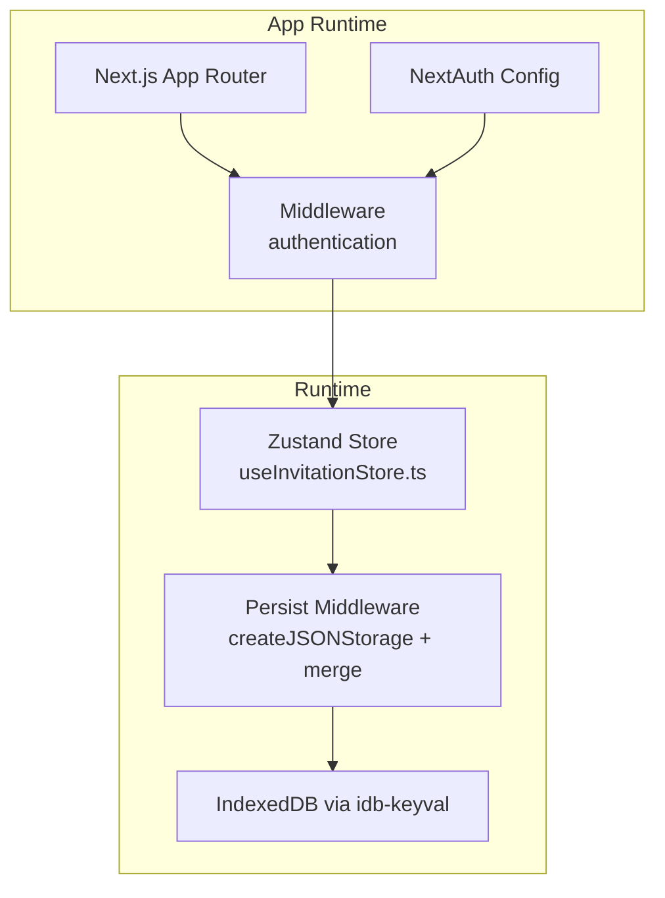
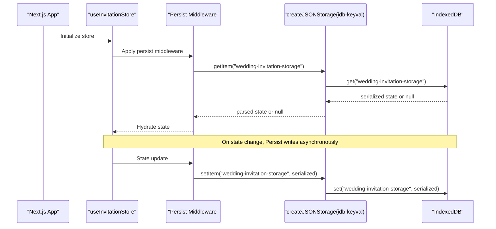
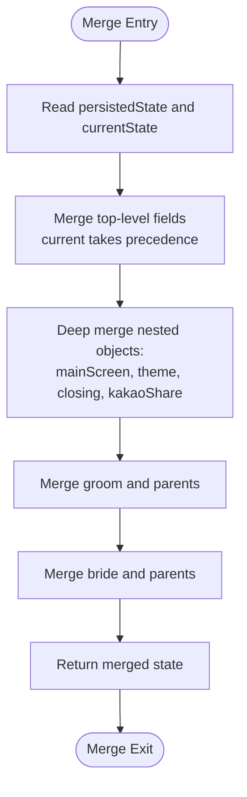
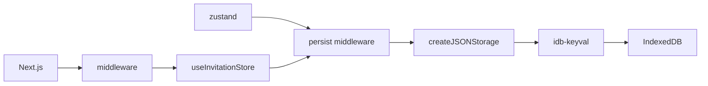

# Persistence and Storage Layer

<cite>
**Referenced Files in This Document**
- [useInvitationStore.ts](file://src/store/useInvitationStore.ts)
- [ARCHITECTURE.md](file://ARCHITECTURE.md)
- [package.json](file://package.json)
- [middleware.ts](file://middleware.ts)
- [auth-config.ts](file://src/auth-config.ts)
- [utils.ts](file://src/lib/utils.ts)
- [next.config.ts](file://next.config.ts)
</cite>

## Table of Contents
1. [Introduction](#introduction)
2. [Project Structure](#project-structure)
3. [Core Components](#core-components)
4. [Architecture Overview](#architecture-overview)
5. [Detailed Component Analysis](#detailed-component-analysis)
6. [Dependency Analysis](#dependency-analysis)
7. [Performance Considerations](#performance-considerations)
8. [Troubleshooting Guide](#troubleshooting-guide)
9. [Conclusion](#conclusion)
10. [Appendices](#appendices)

## Introduction
This document explains the IndexedDB persistence layer integrated via idb-keyval in the Zustand store. It covers the persist middleware configuration, custom JSON storage implementation, IndexedDB advantages over localStorage, storage capacity considerations, the merge strategy for schema evolution and backward compatibility, storage key naming, serialization/deserialization, error handling, practical storage operation examples, debugging techniques, performance optimization strategies, storage quotas, cleanup procedures, and data integrity validation.

## Project Structure
The persistence layer centers around a single Zustand store with the persist middleware configured to use IndexedDB via idb-keyval. The store defines a comprehensive state model for the invitation builder and integrates with Next.js routing and authentication.

**Diagram sources**
- [useInvitationStore.ts](file://src/store/useInvitationStore.ts#L474-L533)
- [ARCHITECTURE.md](file://ARCHITECTURE.md#L283-L305)
- [middleware.ts](file://middleware.ts#L1-L22)
- [auth-config.ts](file://src/auth-config.ts#L1-L227)

**Section sources**
- [useInvitationStore.ts](file://src/store/useInvitationStore.ts#L1-L534)
- [ARCHITECTURE.md](file://ARCHITECTURE.md#L283-L305)
- [middleware.ts](file://middleware.ts#L1-L22)
- [auth-config.ts](file://src/auth-config.ts#L1-L227)

## Core Components
- Zustand Store with Persist Middleware: The store is configured with a custom JSON storage backed by IndexedDB and a merge function to handle schema evolution.
- idb-keyval Integration: Asynchronous IndexedDB operations are delegated to idb-keyval for get/set/del.
- Merge Strategy: Deep merges nested objects to preserve new fields while retaining user data.
- Storage Naming: The store uses a single storage key name for hydration and persistence.
- Serialization/Deserialization: Uses JSON string storage with async operations.

Key implementation references:
- Persist configuration and storage: [useInvitationStore.ts](file://src/store/useInvitationStore.ts#L474-L489)
- Merge function: [useInvitationStore.ts](file://src/store/useInvitationStore.ts#L490-L530)
- Storage name: [useInvitationStore.ts](file://src/store/useInvitationStore.ts#L475)
- Advantages note: [useInvitationStore.ts](file://src/store/useInvitationStore.ts#L531-L533)

**Section sources**
- [useInvitationStore.ts](file://src/store/useInvitationStore.ts#L474-L533)

## Architecture Overview
The persistence architecture ensures that builder state is preserved across navigation and page reloads using IndexedDB. The persist middleware hydrates the store on app startup and writes updates asynchronously.

**Diagram sources**
- [useInvitationStore.ts](file://src/store/useInvitationStore.ts#L474-L489)
- [ARCHITECTURE.md](file://ARCHITECTURE.md#L283-L305)

## Detailed Component Analysis

### IndexedDB and idb-keyval Integration
- Storage Provider: The persist middleware uses a custom JSON storage backed by idb-keyval for asynchronous IndexedDB operations.
- Operations:
  - getItem: Loads serialized state from IndexedDB by key.
  - setItem: Persists serialized state to IndexedDB by key.
  - removeItem: Removes persisted state from IndexedDB by key.
- Module Loading: idb-keyval is dynamically imported per operation to keep the initial bundle lean.

Implementation references:
- Storage provider: [useInvitationStore.ts](file://src/store/useInvitationStore.ts#L476-L489)
- Dynamic imports: [useInvitationStore.ts](file://src/store/useInvitationStore.ts#L477-L487)

**Section sources**
- [useInvitationStore.ts](file://src/store/useInvitationStore.ts#L476-L489)

### Persist Middleware Configuration
- Storage Key Name: The store uses a single storage key for hydration and persistence.
- JSON Serialization: The middleware serializes state to JSON strings and stores them in IndexedDB.
- Hydration Timing: The store hydrates on initialization; ensure UI readiness before saving to avoid premature writes.

Implementation references:
- Storage key name: [useInvitationStore.ts](file://src/store/useInvitationStore.ts#L475)
- Hydration and storage: [useInvitationStore.ts](file://src/store/useInvitationStore.ts#L474-L489)
- Hydration guidance: [ARCHITECTURE.md](file://ARCHITECTURE.md#L283-L305)

**Section sources**
- [useInvitationStore.ts](file://src/store/useInvitationStore.ts#L474-L489)
- [ARCHITECTURE.md](file://ARCHITECTURE.md#L283-L305)

### Merge Function Strategy for Schema Evolution
The merge function ensures backward compatibility when new fields are added to the store schema:
- Top-level fields: Current state takes precedence; persisted state fills missing fields.
- Nested Objects: Deep merges nested objects (e.g., mainScreen, theme, closing, kakaoShare, groom, bride) to preserve user data while adding defaults.
- Parent Objects: Parents inside groom and bride are merged recursively.

**Diagram sources**
- [useInvitationStore.ts](file://src/store/useInvitationStore.ts#L490-L530)

Implementation references:
- Merge definition: [useInvitationStore.ts](file://src/store/useInvitationStore.ts#L490-L530)

**Section sources**
- [useInvitationStore.ts](file://src/store/useInvitationStore.ts#L490-L530)

### Storage Key Naming Convention
- Key Name: The store uses a single key name for persistence. This simplifies migration and reduces key fragmentation.
- Recommendation: Keep the key name stable across releases to maintain continuity for users.

Implementation references:
- Key name: [useInvitationStore.ts](file://src/store/useInvitationStore.ts#L475)

**Section sources**
- [useInvitationStore.ts](file://src/store/useInvitationStore.ts#L475)

### Serialization and Deserialization
- JSON Serialization: State is stringified to JSON before storage and parsed upon retrieval.
- Asynchronous Operations: All storage operations are async to avoid blocking the UI thread.
- Error Handling: Errors during parsing or storage are handled gracefully; the store continues to operate with defaults.

Implementation references:
- JSON storage provider: [useInvitationStore.ts](file://src/store/useInvitationStore.ts#L476-L489)

**Section sources**
- [useInvitationStore.ts](file://src/store/useInvitationStore.ts#L476-L489)

### Error Handling Mechanisms
- IndexedDB Errors: Errors during IndexedDB operations are surfaced by idb-keyval; the application remains functional by falling back to defaults.
- Parsing Errors: If stored data is malformed, the store hydrates with defaults rather than crashing.
- UI Safety: Guard against saving until hydration is complete to avoid inconsistent writes.

Implementation references:
- Hydration safety guidance: [ARCHITECTURE.md](file://ARCHITECTURE.md#L283-L305)

**Section sources**
- [ARCHITECTURE.md](file://ARCHITECTURE.md#L283-L305)

### Practical Examples of Storage Operations
- Load Stored State: On app initialization, the store hydrates from IndexedDB using the configured storage provider.
- Save State: On state updates, the store asynchronously persists the JSON-serialized state to IndexedDB.
- Remove State: The storage provider supports removal by key for cleanup scenarios.

Implementation references:
- Hydration and save: [useInvitationStore.ts](file://src/store/useInvitationStore.ts#L474-L489)

**Section sources**
- [useInvitationStore.ts](file://src/store/useInvitationStore.ts#L474-L489)

### Debugging Techniques
- DevTools Inspection:
  - IndexedDB: Open browser DevTools, go to Application/Storage, inspect IndexedDB, and locate the key used by the store.
  - Network Tab: Verify that idb-keyval operations are executed asynchronously and not causing UI stalls.
- Logging:
  - Add logging around getItem/setItem/removeItem to track hydration and persistence events.
  - Monitor for repeated hydration failures to detect corrupted entries.
- Safe Initialization:
  - Ensure UI readiness before saving to avoid premature writes during hydration.

Implementation references:
- Hydration guidance: [ARCHITECTURE.md](file://ARCHITECTURE.md#L283-L305)

**Section sources**
- [ARCHITECTURE.md](file://ARCHITECTURE.md#L283-L305)

### Performance Optimization Strategies
- Lazy Imports: idb-keyval is dynamically imported per operation, reducing initial load.
- Minimal Writes: Debounce or batch frequent updates to reduce IndexedDB write pressure.
- Avoid Large Blobs: Prefer URLs or references to large assets rather than storing binary data directly.
- Hydration Readiness: Prevent saving until the store is hydrated to avoid redundant writes.

Implementation references:
- Dynamic imports: [useInvitationStore.ts](file://src/store/useInvitationStore.ts#L477-L487)
- Notes on IndexedDB limits: [useInvitationStore.ts](file://src/store/useInvitationStore.ts#L531-L533)

**Section sources**
- [useInvitationStore.ts](file://src/store/useInvitationStore.ts#L477-L487)
- [useInvitationStore.ts](file://src/store/useInvitationStore.ts#L531-L533)

### Storage Capacity Considerations
- IndexedDB vs localStorage:
  - IndexedDB offers significantly larger storage quotas compared to localStorage, enabling persistence of richer state (e.g., galleries and images).
  - localStorage is limited and unsuitable for large datasets; the store avoids partialization to leverage IndexedDB’s capacity.
- Quota Management:
  - Monitor storage usage and implement cleanup routines for large arrays or caches.
  - Consider trimming excessive history or images to stay within quotas.

Implementation references:
- IndexedDB capacity note: [useInvitationStore.ts](file://src/store/useInvitationStore.ts#L531-L533)

**Section sources**
- [useInvitationStore.ts](file://src/store/useInvitationStore.ts#L531-L533)

### Cleanup Procedures
- Removing Stored Data:
  - Use the storage provider’s removeItem to delete the store’s key when needed (e.g., logout or user-initiated reset).
- Authentication Context:
  - Middleware redirects protect builder access; ensure cleanup aligns with user lifecycle.
- Environment Configuration:
  - Validate environment variables for external services to prevent runtime errors that could interrupt persistence.

Implementation references:
- Remove item usage: [useInvitationStore.ts](file://src/store/useInvitationStore.ts#L485-L487)
- Middleware protection: [middleware.ts](file://middleware.ts#L1-L22)
- Environment validation: [auth-config.ts](file://src/auth-config.ts#L11-L13)

**Section sources**
- [useInvitationStore.ts](file://src/store/useInvitationStore.ts#L485-L487)
- [middleware.ts](file://middleware.ts#L1-L22)
- [auth-config.ts](file://src/auth-config.ts#L11-L13)

### Data Integrity Validation
- Hydration Validation:
  - After hydration, validate that critical fields exist and are of expected types; fall back to defaults if invalid.
- Merge Validation:
  - Ensure nested merges do not overwrite user data unintentionally; current-state precedence protects user edits.
- Error Resilience:
  - Wrap storage operations in try/catch and log errors without failing the app.

Implementation references:
- Hydration guidance: [ARCHITECTURE.md](file://ARCHITECTURE.md#L283-L305)
- Merge strategy: [useInvitationStore.ts](file://src/store/useInvitationStore.ts#L490-L530)

**Section sources**
- [ARCHITECTURE.md](file://ARCHITECTURE.md#L283-L305)
- [useInvitationStore.ts](file://src/store/useInvitationStore.ts#L490-L530)

## Dependency Analysis
- External Dependencies:
  - idb-keyval: Provides async IndexedDB helpers (get/set/del).
  - zustand: Core state management with persist middleware.
- Internal Dependencies:
  - Store depends on idb-keyval for persistence.
  - Middleware configuration depends on the store key name and merge strategy.
- Runtime Context:
  - Next.js middleware enforces authentication and routing policies affecting when persistence is used.

**Diagram sources**
- [package.json](file://package.json#L57-L74)
- [useInvitationStore.ts](file://src/store/useInvitationStore.ts#L474-L489)
- [middleware.ts](file://middleware.ts#L1-L22)

**Section sources**
- [package.json](file://package.json#L57-L74)
- [useInvitationStore.ts](file://src/store/useInvitationStore.ts#L474-L489)
- [middleware.ts](file://middleware.ts#L1-L22)

## Performance Considerations
- Bundle Size: Dynamic imports of idb-keyval minimize initial payload.
- Write Frequency: Batch or debounce updates to IndexedDB to reduce transaction overhead.
- Data Size: Avoid storing large binary blobs; prefer URLs and references.
- Hydration Safety: Prevent saving until the store is hydrated to avoid redundant writes.

[No sources needed since this section provides general guidance]

## Troubleshooting Guide
- Hydration Failures:
  - Symptoms: State resets to defaults after reload.
  - Actions: Inspect IndexedDB key, verify JSON validity, and confirm async operations complete.
- Storage Errors:
  - Symptoms: Errors thrown by IndexedDB.
  - Actions: Wrap operations with error handling and fallback to defaults.
- UI Stalls:
  - Symptoms: Jank during save/load.
  - Actions: Confirm async operations; avoid synchronous heavy work on the main thread.

Implementation references:
- Hydration guidance: [ARCHITECTURE.md](file://ARCHITECTURE.md#L283-L305)

**Section sources**
- [ARCHITECTURE.md](file://ARCHITECTURE.md#L283-L305)

## Conclusion
The IndexedDB persistence layer leverages idb-keyval through Zustand’s persist middleware to deliver robust, scalable state persistence. The merge strategy ensures backward compatibility, while the storage key naming and JSON serialization simplify maintenance. By following the recommended debugging, performance, and cleanup practices, the system remains reliable and user-friendly.

[No sources needed since this section summarizes without analyzing specific files]

## Appendices

### Appendix A: Storage Operation Examples (paths only)
- Hydration: [useInvitationStore.ts](file://src/store/useInvitationStore.ts#L474-L489)
- Save: [useInvitationStore.ts](file://src/store/useInvitationStore.ts#L474-L489)
- Remove: [useInvitationStore.ts](file://src/store/useInvitationStore.ts#L485-L487)

### Appendix B: Related Runtime Context
- Middleware enforcement: [middleware.ts](file://middleware.ts#L1-L22)
- Authentication configuration: [auth-config.ts](file://src/auth-config.ts#L1-L227)
- PWA and build configuration: [next.config.ts](file://next.config.ts#L99-L109)

**Section sources**
- [middleware.ts](file://middleware.ts#L1-L22)
- [auth-config.ts](file://src/auth-config.ts#L1-L227)
- [next.config.ts](file://next.config.ts#L99-L109)