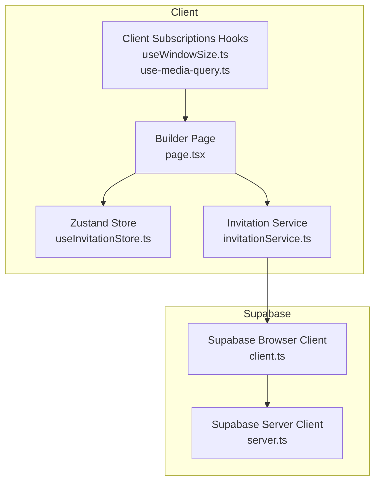
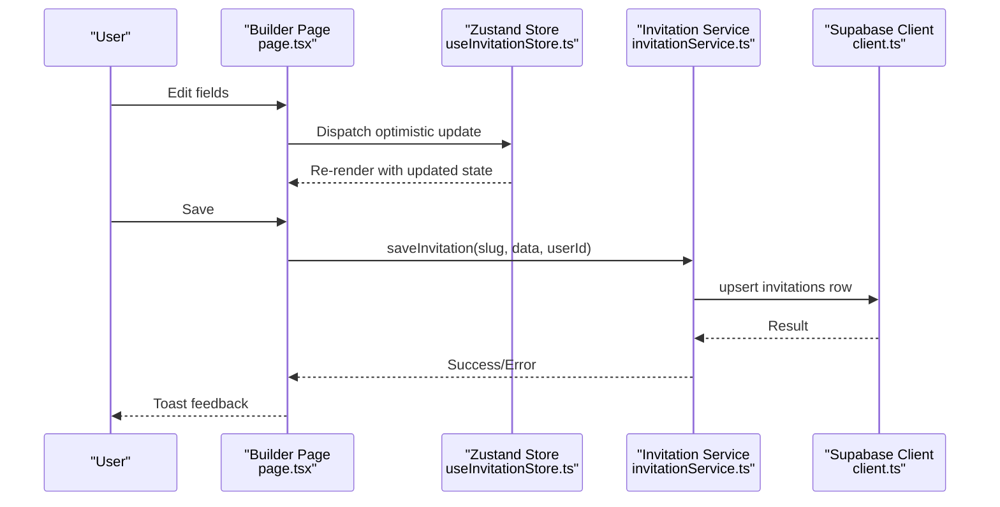
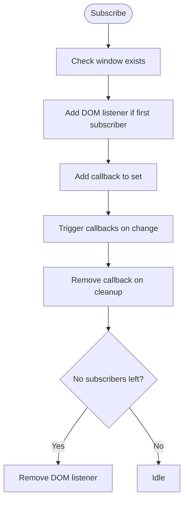
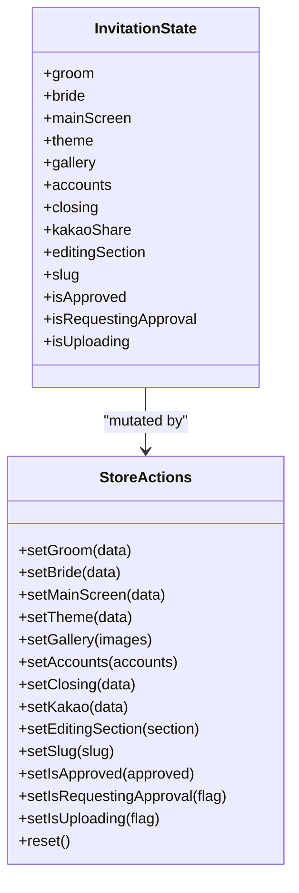
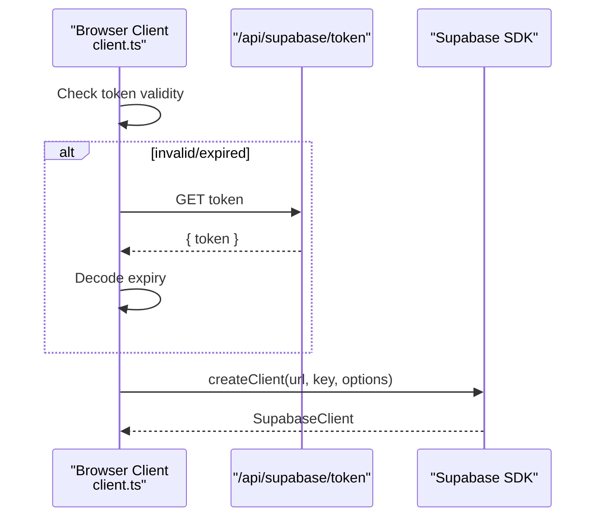
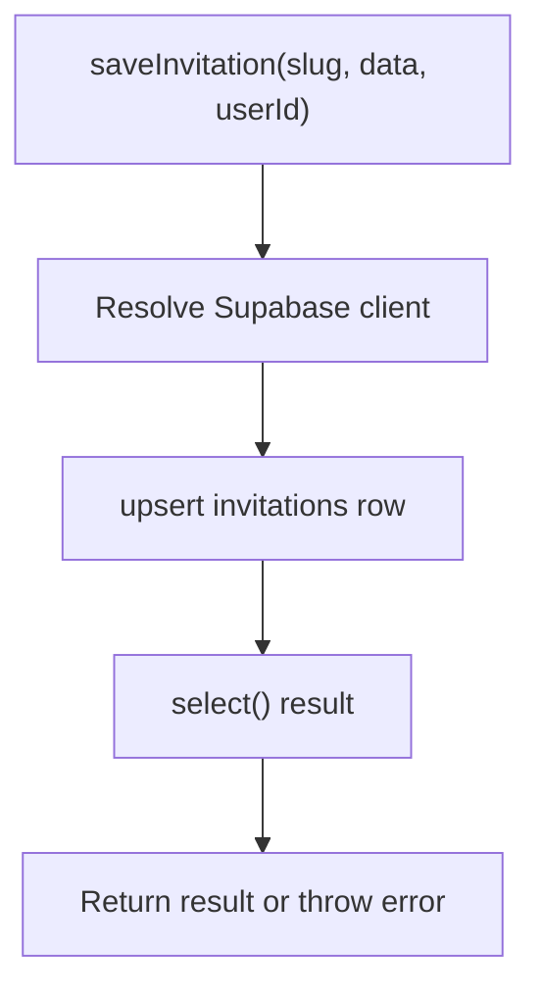
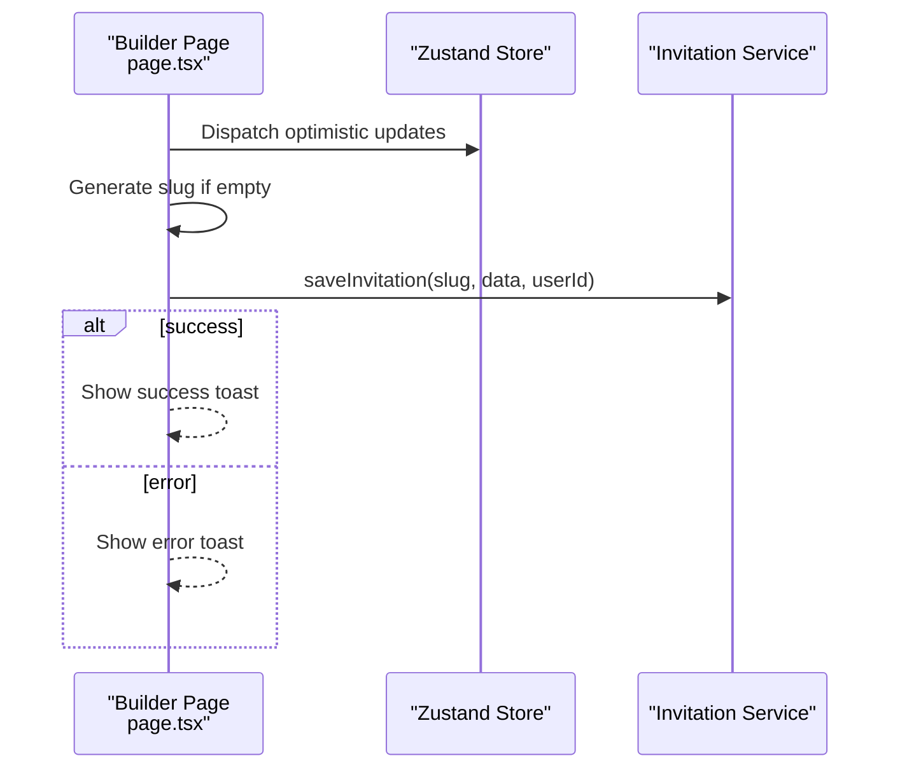
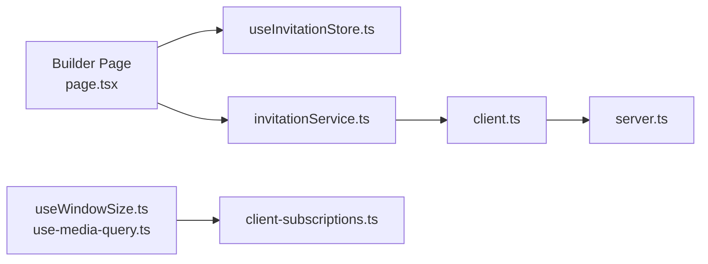

# Real-time Subscriptions and Collaboration

<cite>
**Referenced Files in This Document**
- [client-subscriptions.ts](file://src/lib/client-subscriptions.ts)
- [use-media-query.ts](file://src/hooks/use-media-query.ts)
- [useWindowSize.ts](file://src/hooks/useWindowSize.ts)
- [useInvitationStore.ts](file://src/store/useInvitationStore.ts)
- [invitationService.ts](file://src/services/invitationService.ts)
- [client.ts](file://src/lib/supabase/client.ts)
- [server.ts](file://src/lib/supabase/server.ts)
- [supabase.ts](file://src/lib/supabase.ts)
- [page.tsx](file://src/app/builder/page.tsx)
- [GreetingSection.tsx](file://src/components/builder/sections/GreetingSection.tsx)
</cite>

## Table of Contents
1. [Introduction](#introduction)
2. [Project Structure](#project-structure)
3. [Core Components](#core-components)
4. [Architecture Overview](#architecture-overview)
5. [Detailed Component Analysis](#detailed-component-analysis)
6. [Dependency Analysis](#dependency-analysis)
7. [Performance Considerations](#performance-considerations)
8. [Troubleshooting Guide](#troubleshooting-guide)
9. [Conclusion](#conclusion)

## Introduction
This document explains the real-time subscription system and collaborative editing features for the invitation builder. It covers:
- Client-subscriptions architecture for live data synchronization
- Subscription lifecycle management
- Conflict resolution strategies
- Integration between local state and remote database updates
- Optimistic updates and rollback mechanisms
- Subscription patterns for different data types
- Performance optimization for concurrent updates
- Error handling for network failures
- Practical examples of subscription setup, synchronization workflows, and collaborative editing scenarios
- Subscription cleanup, memory management, and debugging collaborative state issues

## Project Structure
The real-time and collaboration features are built around:
- Local state management via a zustand store
- Supabase client initialization and token refresh
- Service layer for saving and retrieving invitation data
- UI hooks that subscribe to client-side events (window/media queries)
- Builder page orchestrating save and preview flows

**Diagram sources**
- [page.tsx](file://src/app/builder/page.tsx#L1-L232)
- [useInvitationStore.ts](file://src/store/useInvitationStore.ts#L1-L534)
- [useWindowSize.ts](file://src/hooks/useWindowSize.ts#L1-L14)
- [use-media-query.ts](file://src/hooks/use-media-query.ts#L1-L15)
- [invitationService.ts](file://src/services/invitationService.ts#L1-L81)
- [client.ts](file://src/lib/supabase/client.ts#L1-L85)
- [server.ts](file://src/lib/supabase/server.ts#L1-L19)

**Section sources**
- [page.tsx](file://src/app/builder/page.tsx#L1-L232)
- [useInvitationStore.ts](file://src/store/useInvitationStore.ts#L1-L534)
- [client.ts](file://src/lib/supabase/client.ts#L1-L85)
- [server.ts](file://src/lib/supabase/server.ts#L1-L19)
- [invitationService.ts](file://src/services/invitationService.ts#L1-L81)
- [useWindowSize.ts](file://src/hooks/useWindowSize.ts#L1-L14)
- [use-media-query.ts](file://src/hooks/use-media-query.ts#L1-L15)

## Core Components
- Client subscriptions: Window resize and media query subscriptions for responsive UI updates
- Zustand store: Centralized local state for invitation data with persistence and deep merge
- Supabase clients: Browser and server clients with token management and caching
- Invitation service: Upsert/save invitation data to Supabase
- Builder page: Orchestrates save flow and integrates with store and service

Key responsibilities:
- Client subscriptions manage lightweight, SSR-safe subscriptions for UI responsiveness
- Zustand store manages optimistic updates and persists state to IndexedDB
- Supabase clients handle authentication headers and token refresh
- Invitation service encapsulates CRUD operations against the invitations table
- Builder page coordinates saving and preview rendering

**Section sources**
- [client-subscriptions.ts](file://src/lib/client-subscriptions.ts#L1-L94)
- [useInvitationStore.ts](file://src/store/useInvitationStore.ts#L1-L534)
- [client.ts](file://src/lib/supabase/client.ts#L1-L85)
- [server.ts](file://src/lib/supabase/server.ts#L1-L19)
- [invitationService.ts](file://src/services/invitationService.ts#L1-L81)
- [page.tsx](file://src/app/builder/page.tsx#L1-L232)

## Architecture Overview
The system combines local state with remote persistence. While there is no explicit Supabase Realtime subscription in the current codebase, the architecture supports building real-time collaboration on top of the existing store and service layer.

**Diagram sources**
- [page.tsx](file://src/app/builder/page.tsx#L87-L127)
- [useInvitationStore.ts](file://src/store/useInvitationStore.ts#L373-L473)
- [invitationService.ts](file://src/services/invitationService.ts#L9-L24)
- [client.ts](file://src/lib/supabase/client.ts#L41-L84)

## Detailed Component Analysis

### Client Subscriptions: Window and Media Queries
The client subscriptions module exposes:
- subscribeWindowWidth and getWindowWidthSnapshot for responsive UI
- subscribeMediaQuery and getMediaQuerySnapshot for SSR-safe media query subscriptions

Implementation highlights:
- Single global event listeners per subscription type
- Efficient listener sets with cleanup on unsubscribe
- Snapshot functions for SSR compatibility

**Diagram sources**
- [client-subscriptions.ts](file://src/lib/client-subscriptions.ts#L12-L30)
- [client-subscriptions.ts](file://src/lib/client-subscriptions.ts#L71-L88)

**Section sources**
- [client-subscriptions.ts](file://src/lib/client-subscriptions.ts#L1-L94)
- [useWindowSize.ts](file://src/hooks/useWindowSize.ts#L1-L14)
- [use-media-query.ts](file://src/hooks/use-media-query.ts#L1-L15)

### Zustand Store: Local State and Persistence
The store defines the entire invitation state model and provides setters for each field. It uses persistence with IndexedDB via idb-keyval and a deep merge strategy to handle schema evolution.

Highlights:
- Optimistic updates via setters
- Deep merge during hydration to preserve new fields
- IndexedDB-backed storage for large data (gallery/images)

**Diagram sources**
- [useInvitationStore.ts](file://src/store/useInvitationStore.ts#L4-L230)
- [useInvitationStore.ts](file://src/store/useInvitationStore.ts#L373-L473)

**Section sources**
- [useInvitationStore.ts](file://src/store/useInvitationStore.ts#L1-L534)

### Supabase Clients: Token Management and Initialization
The browser client manages:
- Token refresh with expiration checks
- Lazy module loading of Supabase SDK
- Reinitialization when token changes
- Authorization header injection for authenticated requests

The server client creates a client with optional JWT for server-side operations.

**Diagram sources**
- [client.ts](file://src/lib/supabase/client.ts#L24-L39)
- [client.ts](file://src/lib/supabase/client.ts#L41-L84)
- [supabase.ts](file://src/lib/supabase.ts#L1-L2)

**Section sources**
- [client.ts](file://src/lib/supabase/client.ts#L1-L85)
- [server.ts](file://src/lib/supabase/server.ts#L1-L19)
- [supabase.ts](file://src/lib/supabase.ts#L1-L2)

### Invitation Service: Remote Persistence
The service encapsulates:
- Upsert/save invitation data with conflict handling
- Fetching summaries and full records
- Deleting invitations

**Diagram sources**
- [invitationService.ts](file://src/services/invitationService.ts#L9-L24)

**Section sources**
- [invitationService.ts](file://src/services/invitationService.ts#L1-L81)

### Builder Page: Save Workflow and Optimistic Updates
The builder page coordinates:
- Optimistic updates in the store
- Slug generation if missing
- Save operation via the service
- Feedback via toasts

**Diagram sources**
- [page.tsx](file://src/app/builder/page.tsx#L87-L127)
- [useInvitationStore.ts](file://src/store/useInvitationStore.ts#L373-L473)
- [invitationService.ts](file://src/services/invitationService.ts#L9-L24)

**Section sources**
- [page.tsx](file://src/app/builder/page.tsx#L1-L232)
- [GreetingSection.tsx](file://src/components/builder/sections/GreetingSection.tsx#L1-L199)

## Dependency Analysis
- UI depends on Zustand store for state and on service layer for persistence
- Service layer depends on Supabase client initialization
- Hooks depend on client subscriptions for responsive UI
- Supabase client initialization depends on environment variables and token endpoint

**Diagram sources**
- [page.tsx](file://src/app/builder/page.tsx#L1-L232)
- [useInvitationStore.ts](file://src/store/useInvitationStore.ts#L1-L534)
- [invitationService.ts](file://src/services/invitationService.ts#L1-L81)
- [client.ts](file://src/lib/supabase/client.ts#L1-L85)
- [useWindowSize.ts](file://src/hooks/useWindowSize.ts#L1-L14)
- [use-media-query.ts](file://src/hooks/use-media-query.ts#L1-L15)
- [server.ts](file://src/lib/supabase/server.ts#L1-L19)

**Section sources**
- [page.tsx](file://src/app/builder/page.tsx#L1-L232)
- [useInvitationStore.ts](file://src/store/useInvitationStore.ts#L1-L534)
- [invitationService.ts](file://src/services/invitationService.ts#L1-L81)
- [client.ts](file://src/lib/supabase/client.ts#L1-L85)
- [useWindowSize.ts](file://src/hooks/useWindowSize.ts#L1-L14)
- [use-media-query.ts](file://src/hooks/use-media-query.ts#L1-L15)
- [server.ts](file://src/lib/supabase/server.ts#L1-L19)

## Performance Considerations
- Use shallow selectors to minimize re-renders in components that only need a subset of store state
- Persist large arrays (e.g., gallery) to IndexedDB to avoid localStorage limitations
- Debounce or batch frequent updates in rich text editors to reduce unnecessary writes
- Use snapshot functions for SSR-safe subscriptions to avoid hydration mismatches
- Cache Supabase client instances and reuse tokens to avoid repeated initialization overhead

[No sources needed since this section provides general guidance]

## Troubleshooting Guide
Common issues and resolutions:
- Network errors during save: Wrap save in try/catch and surface user-friendly messages
- Stale data after save: Ensure optimistic updates are reverted on error; consider refetching after failure
- Memory leaks from subscriptions: Always return cleanup functions from subscription hooks
- SSR hydration mismatches: Use snapshot functions and server fallbacks for subscriptions
- IndexedDB storage growth: Monitor persisted state size and prune unused keys periodically

**Section sources**
- [page.tsx](file://src/app/builder/page.tsx#L87-L127)
- [client-subscriptions.ts](file://src/lib/client-subscriptions.ts#L12-L30)
- [client-subscriptions.ts](file://src/lib/client-subscriptions.ts#L71-L88)
- [useInvitationStore.ts](file://src/store/useInvitationStore.ts#L474-L533)

## Conclusion
The current architecture provides a solid foundation for real-time collaboration:
- Local state is optimized for optimistic updates and persistence
- Supabase clients handle authentication and token refresh
- Service layer encapsulates remote persistence
- Client subscriptions enable responsive UI updates

To add real-time collaboration:
- Introduce Supabase Realtime subscriptions for the invitations table
- Implement optimistic updates with rollback on conflicts
- Add conflict resolution strategies (e.g., last-writer-wins or operational transforms)
- Extend subscription patterns to cover different data types and sections
- Implement robust error handling and retry logic for network failures

[No sources needed since this section summarizes without analyzing specific files]