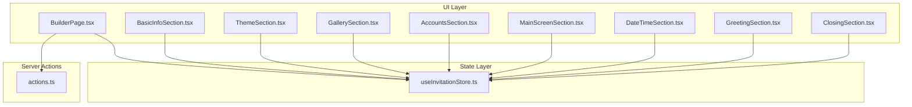
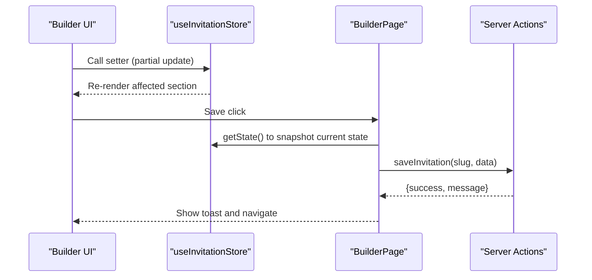
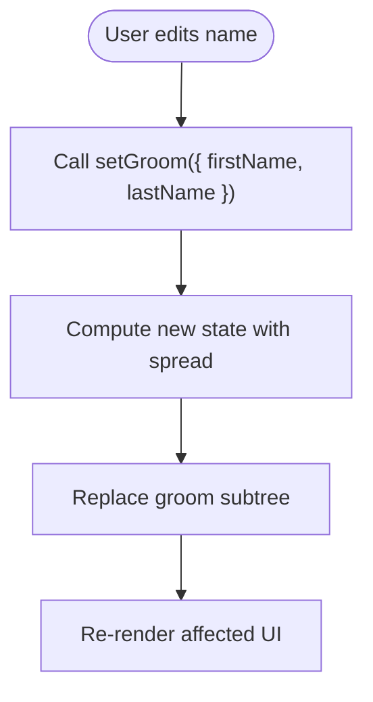
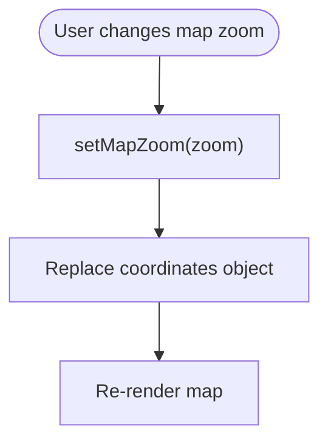
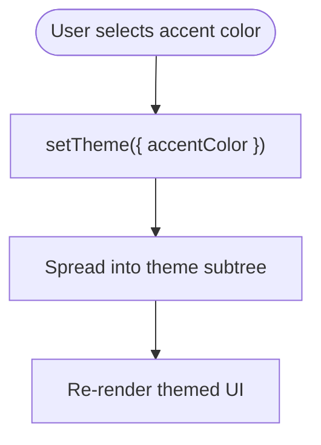
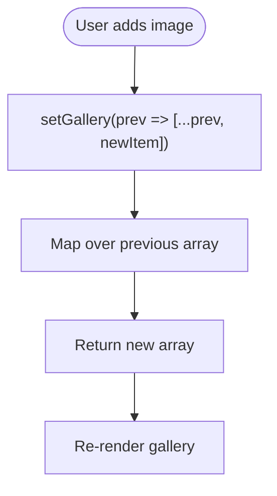
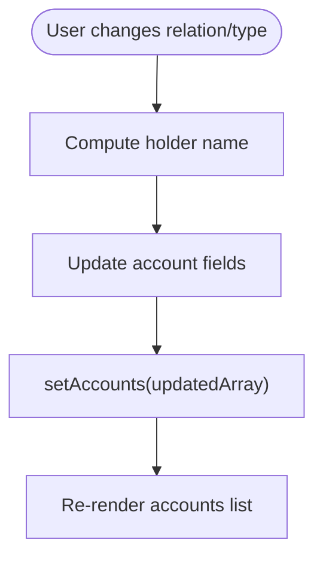
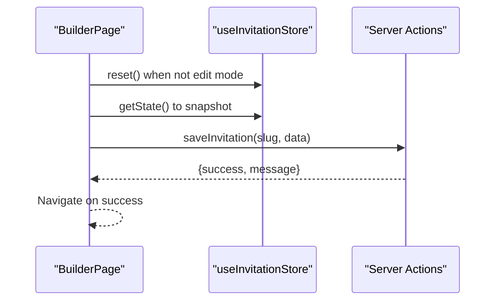
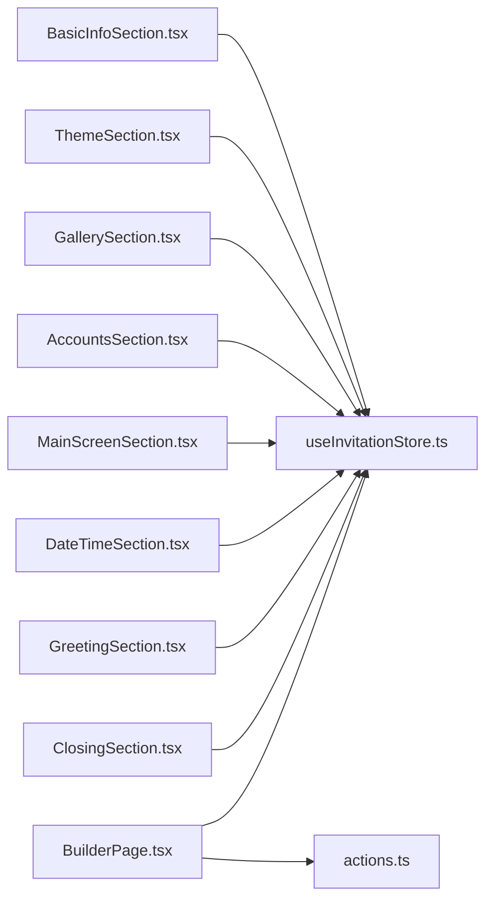

# State Actions and Mutations

<cite>
**Referenced Files in This Document**
- [useInvitationStore.ts](file://src/store/useInvitationStore.ts)
- [BuilderPage.tsx](file://src/app/builder/page.tsx)
- [BasicInfoSection.tsx](file://src/components/builder/sections/BasicInfoSection.tsx)
- [LocationSection.tsx](file://src/components/builder/sections/LocationSection.tsx)
- [ThemeSection.tsx](file://src/components/builder/sections/ThemeSection.tsx)
- [GallerySection.tsx](file://src/components/builder/sections/GallerySection.tsx)
- [AccountsSection.tsx](file://src/components/builder/sections/AccountsSection.tsx)
- [MainScreenSection.tsx](file://src/components/builder/sections/MainScreenSection.tsx)
- [DateTimeSection.tsx](file://src/components/builder/sections/DateTimeSection.tsx)
- [GreetingSection.tsx](file://src/components/builder/sections/GreetingSection.tsx)
- [ClosingSection.tsx](file://src/components/builder/sections/ClosingSection.tsx)
- [actions.ts](file://src/lib/actions.ts)
- [ARCHITECTURE.md](file://ARCHITECTURE.md)
</cite>

## Table of Contents
1. [Introduction](#introduction)
2. [Project Structure](#project-structure)
3. [Core Components](#core-components)
4. [Architecture Overview](#architecture-overview)
5. [Detailed Component Analysis](#detailed-component-analysis)
6. [Dependency Analysis](#dependency-analysis)
7. [Performance Considerations](#performance-considerations)
8. [Troubleshooting Guide](#troubleshooting-guide)
9. [Conclusion](#conclusion)

## Introduction
This document explains the state mutation functions and action patterns used to build and manage the invitation editor. It focuses on the comprehensive setter functions grouped by functional areas (basic info, location, theme, gallery, accounts), the update patterns using callbacks and partial updates, nested object mutations, and the differences between direct and functional setters. It also covers immutability patterns, optimization strategies, and debugging techniques for state changes.

## Project Structure
The state management is centralized in a Zustand store that defines strongly typed state slices and setters. Components in the builder UI subscribe to specific parts of the state and call setters to mutate data. Server actions encapsulate backend tasks such as saving, preview generation, and image uploads.

**Diagram sources**
- [useInvitationStore.ts](file://src/store/useInvitationStore.ts#L1-L534)
- [BuilderPage.tsx](file://src/app/builder/page.tsx#L1-L232)
- [BasicInfoSection.tsx](file://src/components/builder/sections/BasicInfoSection.tsx#L1-L134)
- [ThemeSection.tsx](file://src/components/builder/sections/ThemeSection.tsx#L1-L136)
- [GallerySection.tsx](file://src/components/builder/sections/GallerySection.tsx#L1-L25)
- [AccountsSection.tsx](file://src/components/builder/sections/AccountsSection.tsx#L1-L305)
- [MainScreenSection.tsx](file://src/components/builder/sections/MainScreenSection.tsx#L1-L60)
- [DateTimeSection.tsx](file://src/components/builder/sections/DateTimeSection.tsx#L1-L95)
- [GreetingSection.tsx](file://src/components/builder/sections/GreetingSection.tsx#L1-L199)
- [ClosingSection.tsx](file://src/components/builder/sections/ClosingSection.tsx#L1-L107)
- [actions.ts](file://src/lib/actions.ts#L1-L200)

**Section sources**
- [useInvitationStore.ts](file://src/store/useInvitationStore.ts#L1-L534)
- [BuilderPage.tsx](file://src/app/builder/page.tsx#L1-L232)

## Core Components
- State shape and initial values: The store defines a large, nested state with sections for basic info, event info, theme, gallery, accounts, main screen, date/time display, Kakao share, closing, and UI flags. Defaults are provided in the initial state.
- Setters: Each functional area exposes dedicated setters. Many setters accept partial updates to support granular changes without replacing entire subtrees.
- Functional vs direct setters:
  - Direct setters replace top-level fields atomically.
  - Functional setters receive a function argument to compute the next state from the previous array/object, enabling safe batch updates and immutable transformations.
- Persistence: The store persists to IndexedDB via a JSON storage adapter with a merge strategy to handle schema evolution.

Key setter categories and representative examples:
- Basic info: setGroom, setBride, setGroomParents, setBrideParents, setUseFlowerIcon, setOrder
- Location: setLocationTitle, setLocationSubtitle, setLocationContact, setShowMap, setLockMap, setShowNavigation, setMapHeight, setMapZoom, setMapType, setShowSketch, setSketchUrl, setSketchRatio, setCoordinates
- Theme: setTheme
- Greeting and main screen: setMessage, setGreetingTitle, setGreetingSubtitle, setShowNamesAtBottom, setEnableFreeformNames, setGroomNameCustom, setBrideNameCustom, setImageUrl, setImageRatio, setGreetingImage, setGreetingRatio, setMainScreen
- Gallery: setGallery, setGalleryTitle, setGallerySubtitle, setGalleryType, setGalleryPopup, setGalleryPreview, setGalleryFade, setGalleryAutoplay
- Accounts: setAccountsTitle, setAccountsSubtitle, setAccountsDescription, setAccountsGroomTitle, setAccountsBrideTitle, setAccountsColorMode, setAccounts
- Date/time: setShowCalendar, setShowDday, setDdayMessage
- UI and metadata: setEditingSection, setSlug, setIsApproved, setIsRequestingApproval, setIsUploading, reset

**Section sources**
- [useInvitationStore.ts](file://src/store/useInvitationStore.ts#L4-L230)
- [useInvitationStore.ts](file://src/store/useInvitationStore.ts#L373-L534)

## Architecture Overview
The builder UI subscribes to the store using shallow selectors to minimize re-renders. Components call setters to mutate state. The builder page orchestrates initialization and saving, invoking server actions for persistence and preview generation.

**Diagram sources**
- [BuilderPage.tsx](file://src/app/builder/page.tsx#L87-L127)
- [useInvitationStore.ts](file://src/store/useInvitationStore.ts#L373-L534)
- [actions.ts](file://src/lib/actions.ts#L10-L27)

## Detailed Component Analysis

### Basic Info Area
- Purpose: Manage names and parents for groom and bride.
- Patterns:
  - Partial updates for top-level fields (e.g., setGroom, setBride).
  - Nested partial updates for parents (e.g., setGroomParents, setBrideParents).
- Examples:
  - Updating a parent’s name or deceased flag triggers a nested spread to preserve other fields.
  - Updating a person’s first/last name uses a partial object to avoid resetting unrelated fields.

**Diagram sources**
- [BasicInfoSection.tsx](file://src/components/builder/sections/BasicInfoSection.tsx#L36-L41)
- [useInvitationStore.ts](file://src/store/useInvitationStore.ts#L378-L379)

**Section sources**
- [BasicInfoSection.tsx](file://src/components/builder/sections/BasicInfoSection.tsx#L15-L134)
- [useInvitationStore.ts](file://src/store/useInvitationStore.ts#L378-L397)

### Location Area
- Purpose: Configure venue details, map visibility, and map customization.
- Patterns:
  - Direct setters for primitive fields (e.g., setLocationTitle, setShowMap).
  - Coordinates setter replaces the entire coordinate object.
- Examples:
  - Changing map zoom level or type uses direct setters.
  - Sketch toggles and URLs use direct setters for atomic updates.

**Diagram sources**
- [LocationSection.tsx](file://src/components/builder/sections/LocationSection.tsx#L1-L25)
- [useInvitationStore.ts](file://src/store/useInvitationStore.ts#L413-L419)

**Section sources**
- [LocationSection.tsx](file://src/components/builder/sections/LocationSection.tsx#L8-L24)
- [useInvitationStore.ts](file://src/store/useInvitationStore.ts#L406-L419)

### Theme Area
- Purpose: Control typography, colors, background patterns, and privacy settings.
- Patterns:
  - setTheme accepts a partial theme object and spreads into the existing theme subtree.
- Examples:
  - Changing accent color or font scale updates only the modified keys.

**Diagram sources**
- [ThemeSection.tsx](file://src/components/builder/sections/ThemeSection.tsx#L36-L58)
- [useInvitationStore.ts](file://src/store/useInvitationStore.ts#L432)

**Section sources**
- [ThemeSection.tsx](file://src/components/builder/sections/ThemeSection.tsx#L22-L136)
- [useInvitationStore.ts](file://src/store/useInvitationStore.ts#L432)

### Gallery Area
- Purpose: Manage gallery images and presentation options.
- Patterns:
  - setGallery supports both direct replacement and functional updates (passing a function receives the previous array and returns the next array).
- Examples:
  - Adding/removing images uses functional updates to transform the gallery array immutably.

**Diagram sources**
- [GallerySection.tsx](file://src/components/builder/sections/GallerySection.tsx#L9-L24)
- [useInvitationStore.ts](file://src/store/useInvitationStore.ts#L433)

**Section sources**
- [GallerySection.tsx](file://src/components/builder/sections/GallerySection.tsx#L9-L24)
- [useInvitationStore.ts](file://src/store/useInvitationStore.ts#L433)

### Accounts Area
- Purpose: Configure gift account lists and appearance.
- Patterns:
  - setAccounts supports functional updates for the accounts array.
  - Inline per-item updates use map/filter to produce a new array with selective changes.
  - Automatic holder synchronization when related person data changes.
- Examples:
  - Adding an account appends a new item.
  - Updating a single field on an account merges only that field while preserving others.
  - Relation/type changes trigger holder auto-fill based on groom/bride data.

**Diagram sources**
- [AccountsSection.tsx](file://src/components/builder/sections/AccountsSection.tsx#L71-L113)
- [AccountsSection.tsx](file://src/components/builder/sections/AccountsSection.tsx#L87-L104)
- [useInvitationStore.ts](file://src/store/useInvitationStore.ts#L447)

**Section sources**
- [AccountsSection.tsx](file://src/components/builder/sections/AccountsSection.tsx#L19-L305)
- [useInvitationStore.ts](file://src/store/useInvitationStore.ts#L441-L447)

### Main Screen and Greeting Areas
- Main screen: setMainScreen applies partial updates to the mainScreen subtree.
- Greeting: setMessage, setGreetingTitle, setGreetingSubtitle, setShowNamesAtBottom, setEnableFreeformNames, setGroomNameCustom, setBrideNameCustom, setImageUrl, setImageRatio, setGreetingImage, setGreetingRatio.
- Patterns:
  - Partial updates for granular changes.
  - Functional setters for gallery and accounts enable batch transforms.

**Section sources**
- [MainScreenSection.tsx](file://src/components/builder/sections/MainScreenSection.tsx#L18-L59)
- [GreetingSection.tsx](file://src/components/builder/sections/GreetingSection.tsx#L24-L199)
- [useInvitationStore.ts](file://src/store/useInvitationStore.ts#L448-L431)

### Date and Time Area
- Purpose: Configure event date/time and D-Day display.
- Patterns:
  - Direct setters for date, time, and flags.
  - Conditional rendering of D-Day message input when enabled.

**Section sources**
- [DateTimeSection.tsx](file://src/components/builder/sections/DateTimeSection.tsx#L15-L95)
- [useInvitationStore.ts](file://src/store/useInvitationStore.ts#L449-L451)

### Closing Area
- Purpose: Configure closing section title/subtitle/content and optional image.
- Patterns:
  - setClosing applies partial updates to the closing subtree.
  - Image uploader updates URL and ratio atomically.

**Section sources**
- [ClosingSection.tsx](file://src/components/builder/sections/ClosingSection.tsx#L25-L107)
- [useInvitationStore.ts](file://src/store/useInvitationStore.ts#L469)

### Builder Initialization and Saving
- Initialization:
  - BuilderPage resets the store when not in edit mode and gates save operations until ready.
- Saving:
  - Snapshot current state, generate slug if missing, call server action to save, and navigate on success.

**Diagram sources**
- [BuilderPage.tsx](file://src/app/builder/page.tsx#L60-L127)
- [ARCHITECTURE.md](file://ARCHITECTURE.md#L227-L276)
- [actions.ts](file://src/lib/actions.ts#L10-L27)

**Section sources**
- [BuilderPage.tsx](file://src/app/builder/page.tsx#L42-L127)
- [ARCHITECTURE.md](file://ARCHITECTURE.md#L227-L276)

## Dependency Analysis
- UI components depend on the store via shallow selectors to subscribe to specific fields.
- Setters are thin wrappers around Zustand’s set; most are pure functions that compute the next state.
- Persistence and merging are handled by the store middleware, ensuring backward compatibility when new fields are added.

**Diagram sources**
- [useInvitationStore.ts](file://src/store/useInvitationStore.ts#L1-L534)
- [BasicInfoSection.tsx](file://src/components/builder/sections/BasicInfoSection.tsx#L1-L134)
- [ThemeSection.tsx](file://src/components/builder/sections/ThemeSection.tsx#L1-L136)
- [GallerySection.tsx](file://src/components/builder/sections/GallerySection.tsx#L1-L25)
- [AccountsSection.tsx](file://src/components/builder/sections/AccountsSection.tsx#L1-L305)
- [MainScreenSection.tsx](file://src/components/builder/sections/MainScreenSection.tsx#L1-L60)
- [DateTimeSection.tsx](file://src/components/builder/sections/DateTimeSection.tsx#L1-L95)
- [GreetingSection.tsx](file://src/components/builder/sections/GreetingSection.tsx#L1-L199)
- [ClosingSection.tsx](file://src/components/builder/sections/ClosingSection.tsx#L1-L107)
- [BuilderPage.tsx](file://src/app/builder/page.tsx#L1-L232)
- [actions.ts](file://src/lib/actions.ts#L1-L200)

**Section sources**
- [useInvitationStore.ts](file://src/store/useInvitationStore.ts#L1-L534)

## Performance Considerations
- Prefer partial updates: Use setters that accept partial objects to avoid replacing entire subtrees.
- Use functional setters for arrays/lists: Pass a function to setGallery or setAccounts to compute the next state from the previous array, preventing unnecessary re-renders caused by object identity changes.
- Shallow selectors: Subscribe only to the fields you need to reduce re-renders.
- Batch updates: Group related changes into a single render cycle by chaining setters within the same event handler.
- Avoid deep nesting mutations: Keep updates shallow when possible; use nested partials for deeply nested objects.
- Persist large arrays carefully: The store persists to IndexedDB; avoid persisting very large galleries to keep IndexedDB performance optimal.

[No sources needed since this section provides general guidance]

## Troubleshooting Guide
- Symptom: Unexpected re-renders
  - Cause: Subscribing to too broad a slice or passing new object instances instead of partial updates.
  - Fix: Use shallow selectors and partial updates; prefer functional setters for arrays.
- Symptom: State not updating after bulk change
  - Cause: Passing a new object instance instead of a function to setGallery/setAccounts.
  - Fix: Wrap updates in a function receiving the previous state.
- Symptom: Parent or child fields not syncing
  - Cause: Missing nested spread in setGroomParents/setBrideParents.
  - Fix: Ensure nested spread preserves unchanged fields.
- Debugging tips:
  - Log state snapshots during save to confirm data integrity.
  - Verify persistence merge behavior for new fields.
  - Confirm server action responses and error handling.

**Section sources**
- [useInvitationStore.ts](file://src/store/useInvitationStore.ts#L378-L447)
- [AccountsSection.tsx](file://src/components/builder/sections/AccountsSection.tsx#L71-L113)
- [BuilderPage.tsx](file://src/app/builder/page.tsx#L87-L127)

## Conclusion
The state mutation system combines direct and functional setters to maintain immutability and performance. By using partial updates, shallow selectors, and functional updates for arrays, the UI remains responsive and predictable. The builder page coordinates initialization and saving, while server actions encapsulate persistence and preview generation. Following the patterns outlined here ensures robust, maintainable state updates across the invitation editor.