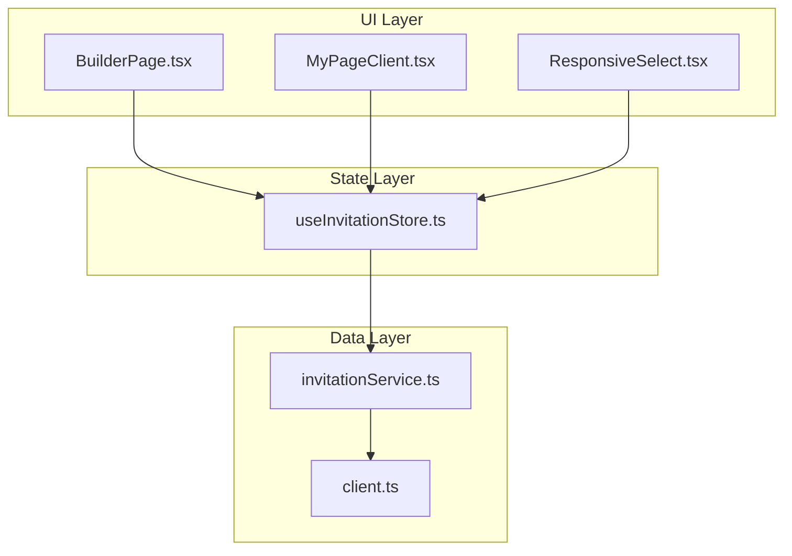
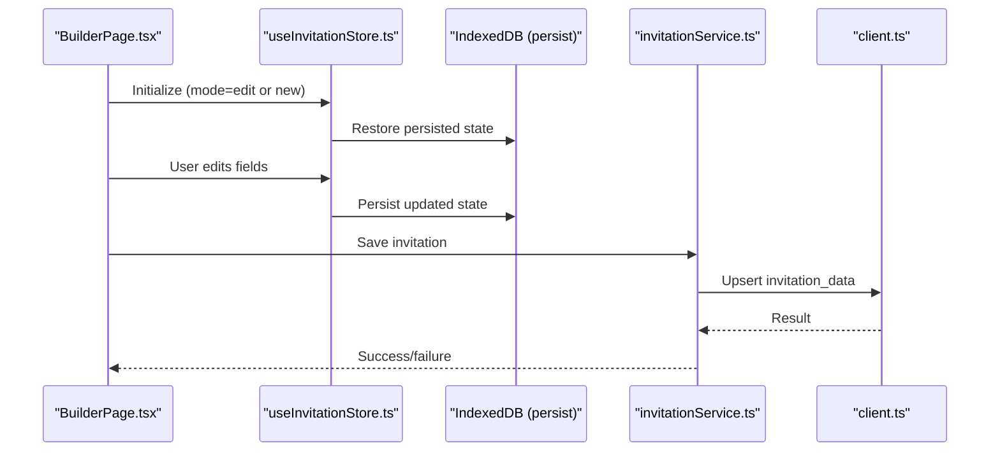
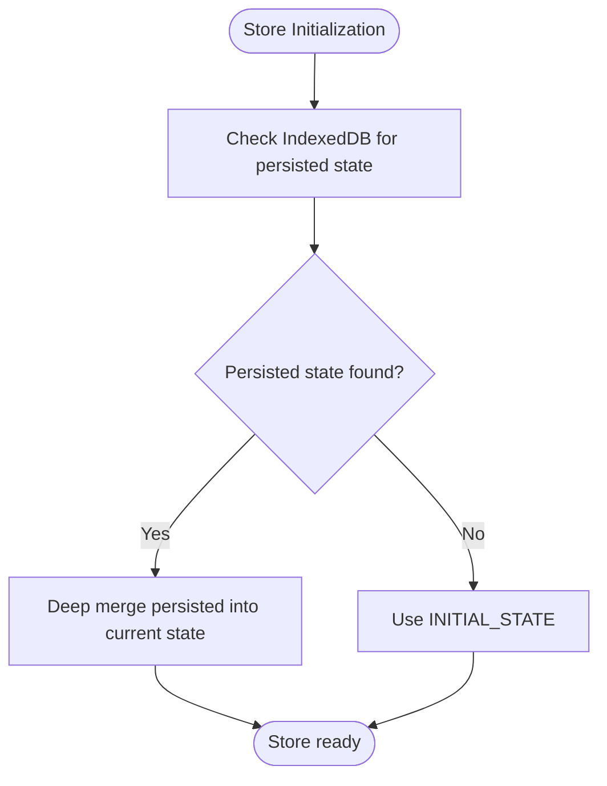
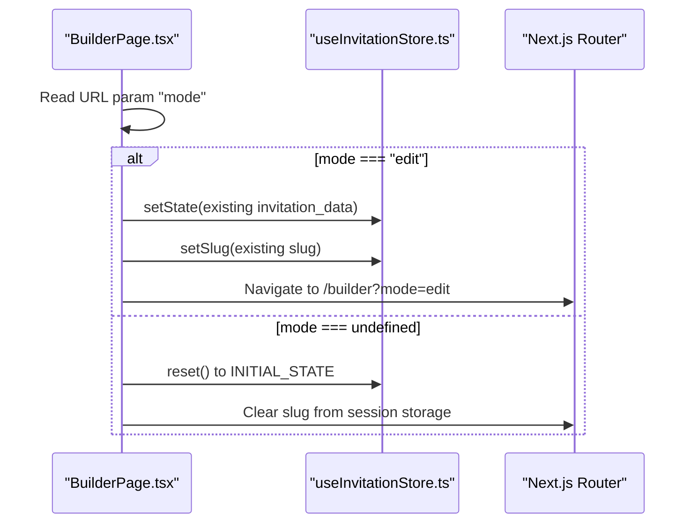
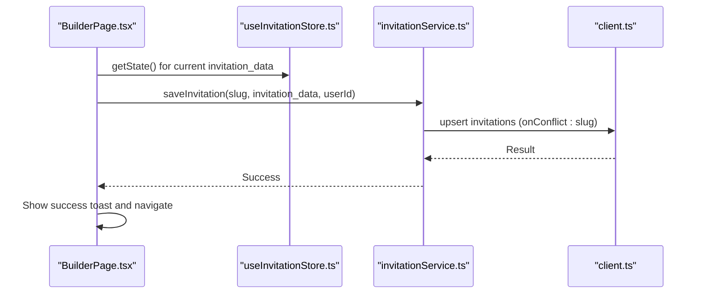
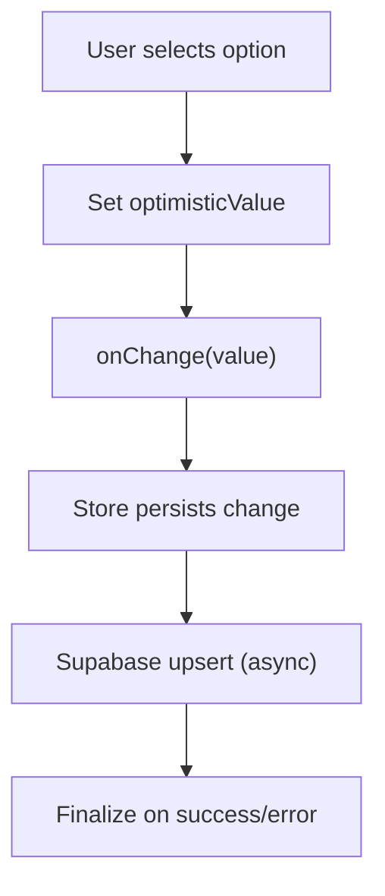
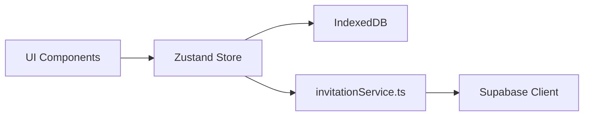

# State Management System

<cite>
**Referenced Files in This Document**
- [useInvitationStore.ts](file://src/store/useInvitationStore.ts)
- [BuilderPage.tsx](file://src/app/builder/page.tsx)
- [MyPageClient.tsx](file://src/app/mypage/MyPageClient.tsx)
- [invitationService.ts](file://src/services/invitationService.ts)
- [client.ts](file://src/lib/supabase/client.ts)
- [ResponsiveSelect.tsx](file://src/components/common/ResponsiveSelect/ResponsiveSelect.tsx)
- [utils.ts](file://src/lib/utils.ts)
- [ARCHITECTURE.md](file://ARCHITECTURE.md)
</cite>

## Table of Contents
1. [Introduction](#introduction)
2. [Project Structure](#project-structure)
3. [Core Components](#core-components)
4. [Architecture Overview](#architecture-overview)
5. [Detailed Component Analysis](#detailed-component-analysis)
6. [Dependency Analysis](#dependency-analysis)
7. [Performance Considerations](#performance-considerations)
8. [Troubleshooting Guide](#troubleshooting-guide)
9. [Conclusion](#conclusion)

## Introduction
This document explains the state management system built with Zustand for the wedding invitation builder. It covers the centralized state architecture with the InvitationData structure, IndexedDB persistence via zustand/middleware, URL-based mode differentiation, store initialization patterns for edit/new modes, synchronization with Supabase, and real-time collaboration considerations. It also documents the subscription system for collaborative editing, optimistic updates, conflict resolution, practical mutation examples, selector patterns with useShallow, performance optimizations, integration with URL parameters and browser history, state hydration and migration strategies, and debugging techniques.

## Project Structure
The state management system centers around a single Zustand store that encapsulates the entire invitation model, persistence, and integration points:
- Store definition and persistence: src/store/useInvitationStore.ts
- Builder page orchestration and URL mode handling: src/app/builder/page.tsx
- MyPage client for loading/saving invitations: src/app/mypage/MyPageClient.tsx
- Supabase client and service layer: src/lib/supabase/client.ts, src/services/invitationService.ts
- Optimistic UI patterns: src/components/common/ResponsiveSelect/ResponsiveSelect.tsx
- URL/history utilities: src/lib/utils.ts
- Architecture notes: ARCHITECTURE.md

**Diagram sources**
- [useInvitationStore.ts](file://src/store/useInvitationStore.ts#L1-L534)
- [BuilderPage.tsx](file://src/app/builder/page.tsx#L1-L232)
- [MyPageClient.tsx](file://src/app/mypage/MyPageClient.tsx#L1-L640)
- [invitationService.ts](file://src/services/invitationService.ts#L1-L81)
- [client.ts](file://src/lib/supabase/client.ts#L1-L85)

**Section sources**
- [useInvitationStore.ts](file://src/store/useInvitationStore.ts#L1-L534)
- [BuilderPage.tsx](file://src/app/builder/page.tsx#L1-L232)
- [MyPageClient.tsx](file://src/app/mypage/MyPageClient.tsx#L1-L640)
- [invitationService.ts](file://src/services/invitationService.ts#L1-L81)
- [client.ts](file://src/lib/supabase/client.ts#L1-L85)

## Core Components
- InvitationState and InvitationData: Strongly typed state shape and data transfer type excluding functions.
- Zustand store with persist middleware: Provides IndexedDB-backed persistence and deep merge strategy.
- Selector patterns: useShallow for fine-grained reactivity and performance.
- URL-based mode differentiation: mode parameter controls initialization behavior.
- Supabase integration: Save/load invitation data with optimistic UI patterns.
- Optimistic updates: Immediate UI feedback with eventual consistency.

Key implementation references:
- Store creation and persistence: [useInvitationStore.ts](file://src/store/useInvitationStore.ts#L373-L533)
- Selector usage in Builder: [BuilderPage.tsx](file://src/app/builder/page.tsx#L47-L50)
- URL mode handling: [BuilderPage.tsx](file://src/app/builder/page.tsx#L53-L69)
- Optimistic select component: [ResponsiveSelect.tsx](file://src/components/common/ResponsiveSelect/ResponsiveSelect.tsx#L60-L75)

**Section sources**
- [useInvitationStore.ts](file://src/store/useInvitationStore.ts#L4-L234)
- [BuilderPage.tsx](file://src/app/builder/page.tsx#L47-L69)
- [ResponsiveSelect.tsx](file://src/components/common/ResponsiveSelect/ResponsiveSelect.tsx#L60-L75)

## Architecture Overview
The system follows a unidirectional data flow:
- UI components trigger state mutations via store actions.
- Mutations update the Zustand store, persisting to IndexedDB.
- Optional Supabase sync persists to backend and can inform future hydration.
- URL parameters drive initialization modes (new vs edit).

**Diagram sources**
- [BuilderPage.tsx](file://src/app/builder/page.tsx#L53-L127)
- [useInvitationStore.ts](file://src/store/useInvitationStore.ts#L373-L533)
- [invitationService.ts](file://src/services/invitationService.ts#L10-L24)
- [client.ts](file://src/lib/supabase/client.ts#L41-L84)

## Detailed Component Analysis

### Zustand Store and InvitationData Structure
The store defines a comprehensive InvitationState with nested sections (Basic Info, Event Info, Theme, Gallery, Accounts, etc.) and exposes setters for each field. InvitationData is derived to exclude function types, ensuring only serializable data is persisted or sent to the backend.

```mermaid
classDiagram
class InvitationState {
+groom : object
+bride : object
+useFlowerIcon : boolean
+order : enum
+date : string
+time : string
+location : string
+address : string
+detailAddress : string
+mapType : enum
+coordinates : object|null
+message : string
+greetingTitle : string
+greetingSubtitle : string
+imageUrl : string|null
+imageRatio : enum
+greetingImage : string|null
+greetingRatio : enum
+showNamesAtBottom : boolean
+enableFreeformNames : boolean
+groomNameCustom : string
+brideNameCustom : string
+mainScreen : object
+showCalendar : boolean
+showDday : boolean
+ddayMessage : string
+theme : object
+galleryTitle : string
+gallerySubtitle : string
+galleryType : enum
+galleryPopup : boolean
+galleryPreview : boolean
+galleryFade : boolean
+galleryAutoplay : boolean
+gallery : array
+accountsTitle : string
+accountsSubtitle : string
+accountsDescription : string
+accountsGroomTitle : string
+accountsBrideTitle : string
+accountsColorMode : enum
+accounts : array
+kakaoShare : object
+closing : object
+slug : string
+isApproved : boolean
+isRequestingApproval : boolean
+isUploading : boolean
+editingSection : string|null
+setGroom(data)
+setBride(data)
+setGroomParents(type,data)
+setBrideParents(type,data)
+setUseFlowerIcon(use)
+setOrder(order)
+setDate(date)
+setTime(time)
+setLocation(location)
+setAddress(address)
+setDetailAddress(detail)
+setCoordinates(lat,lng)
+setLocationTitle(title)
+setLocationSubtitle(subtitle)
+setLocationContact(contact)
+setShowMap(show)
+setLockMap(lock)
+setShowNavigation(show)
+setMapHeight(height)
+setMapZoom(zoom)
+setMapType(type)
+setShowSketch(show)
+setSketchUrl(url)
+setSketchRatio(ratio)
+setMessage(message)
+setGreetingTitle(title)
+setGreetingSubtitle(subtitle)
+setShowNamesAtBottom(show)
+setEnableFreeformNames(enable)
+setGroomNameCustom(name)
+setBrideNameCustom(name)
+setImageUrl(url)
+setImageRatio(ratio)
+setGreetingImage(url)
+setGreetingRatio(ratio)
+setTheme(theme)
+setGallery(images)
+setGalleryTitle(title)
+setGallerySubtitle(subtitle)
+setGalleryType(type)
+setGalleryPopup(popup)
+setGalleryPreview(preview)
+setGalleryFade(fade)
+setGalleryAutoplay(autoplay)
+setAccountsTitle(title)
+setAccountsSubtitle(subtitle)
+setAccountsDescription(description)
+setAccountsGroomTitle(title)
+setAccountsBrideTitle(title)
+setAccountsColorMode(mode)
+setAccounts(accounts)
+setMainScreen(data)
+setShowCalendar(show)
+setShowDday(show)
+setDdayMessage(message)
+setEditingSection(section)
+setKakao(data)
+setClosing(data)
+setSlug(slug)
+setIsApproved(approved)
+setIsRequestingApproval(requesting)
+setIsUploading(uploading)
+reset()
}
class InvitationData {
<<type>>
}
InvitationState --> InvitationData : "derived type (excludes functions)"
```

**Diagram sources**
- [useInvitationStore.ts](file://src/store/useInvitationStore.ts#L4-L234)

**Section sources**
- [useInvitationStore.ts](file://src/store/useInvitationStore.ts#L4-L234)

### IndexedDB Persistence and Hydration
The store uses zustand/middleware.persist with a custom IndexedDB storage adapter (idb-keyval). A deep merge strategy preserves nested objects and handles schema evolution gracefully.

**Diagram sources**
- [useInvitationStore.ts](file://src/store/useInvitationStore.ts#L474-L533)

**Section sources**
- [useInvitationStore.ts](file://src/store/useInvitationStore.ts#L474-L533)

### URL-Based Mode Differentiation and Store Initialization
The builder page reads the URL parameter mode to decide whether to reset the store (new mode) or preserve existing state (edit mode). It also manages readiness and slug generation.

**Diagram sources**
- [BuilderPage.tsx](file://src/app/builder/page.tsx#L53-L69)
- [MyPageClient.tsx](file://src/app/mypage/MyPageClient.tsx#L129-L141)

**Section sources**
- [BuilderPage.tsx](file://src/app/builder/page.tsx#L53-L69)
- [MyPageClient.tsx](file://src/app/mypage/MyPageClient.tsx#L129-L141)

### Supabase Integration and Real-Time Synchronization
Invitations are saved/upserted to the Supabase database with the invitation_data field. The Supabase client manages token fetching and caching. The system supports optimistic UI during saves and can later reconcile with backend state.

**Diagram sources**
- [BuilderPage.tsx](file://src/app/builder/page.tsx#L87-L127)
- [invitationService.ts](file://src/services/invitationService.ts#L10-L24)
- [client.ts](file://src/lib/supabase/client.ts#L41-L84)

**Section sources**
- [BuilderPage.tsx](file://src/app/builder/page.tsx#L87-L127)
- [invitationService.ts](file://src/services/invitationService.ts#L10-L24)
- [client.ts](file://src/lib/supabase/client.ts#L41-L84)

### Subscription System for Collaborative Editing and Optimistic Updates
The system leverages optimistic UI patterns for immediate feedback. The ResponsiveSelect component demonstrates optimistic value updates and immediate focus behavior, aligning with collaborative editing expectations.

**Diagram sources**
- [ResponsiveSelect.tsx](file://src/components/common/ResponsiveSelect/ResponsiveSelect.tsx#L60-L75)

**Section sources**
- [ResponsiveSelect.tsx](file://src/components/common/ResponsiveSelect/ResponsiveSelect.tsx#L60-L75)

### Practical Examples of State Mutations and Selector Patterns
- Using useShallow to subscribe to specific fields avoids unnecessary re-renders.
- Mutation examples include setGroom, setBride, setMainScreen, setTheme, setGallery, setAccounts, setKakao, setClosing, setSlug, setIsApproved, setIsRequestingApproval, setIsUploading, and reset.

References:
- Selector usage: [BuilderPage.tsx](file://src/app/builder/page.tsx#L47-L50)
- Mutation setters: [useInvitationStore.ts](file://src/store/useInvitationStore.ts#L373-L473)

**Section sources**
- [BuilderPage.tsx](file://src/app/builder/page.tsx#L47-L50)
- [useInvitationStore.ts](file://src/store/useInvitationStore.ts#L373-L473)

### Integration with URL Parameters, Session Storage, and Browser History
- URL parameter mode drives initialization behavior.
- Slug generation and persistence are managed in the builder page.
- Browser history is manipulated via URL utilities for parameter updates.

References:
- URL mode handling: [BuilderPage.tsx](file://src/app/builder/page.tsx#L53-L69)
- Slug generation: [BuilderPage.tsx](file://src/app/builder/page.tsx#L37-L40)
- URL utilities: [utils.ts](file://src/lib/utils.ts#L264-L276)

**Section sources**
- [BuilderPage.tsx](file://src/app/builder/page.tsx#L37-L40)
- [BuilderPage.tsx](file://src/app/builder/page.tsx#L53-L69)
- [utils.ts](file://src/lib/utils.ts#L264-L276)

### State Hydration, Migration Strategies, and Debugging
- Hydration: The persist middleware hydrates state from IndexedDB on startup.
- Migration: The merge function deep merges persisted state into current state, handling new fields and nested objects.
- Debugging: Use browser devtools to inspect Zustand state, monitor IndexedDB entries, and verify Supabase upsert results.

References:
- Hydration and merge: [useInvitationStore.ts](file://src/store/useInvitationStore.ts#L474-L533)
- Architecture notes: [ARCHITECTURE.md](file://ARCHITECTURE.md#L283-L305)

**Section sources**
- [useInvitationStore.ts](file://src/store/useInvitationStore.ts#L474-L533)
- [ARCHITECTURE.md](file://ARCHITECTURE.md#L283-L305)

## Dependency Analysis
The state layer depends on:
- UI components for triggering actions
- Store for state and persistence
- Service layer for backend operations
- Supabase client for authentication and token management

**Diagram sources**
- [useInvitationStore.ts](file://src/store/useInvitationStore.ts#L373-L533)
- [invitationService.ts](file://src/services/invitationService.ts#L1-L81)
- [client.ts](file://src/lib/supabase/client.ts#L1-L85)

**Section sources**
- [useInvitationStore.ts](file://src/store/useInvitationStore.ts#L373-L533)
- [invitationService.ts](file://src/services/invitationService.ts#L1-L81)
- [client.ts](file://src/lib/supabase/client.ts#L1-L85)

## Performance Considerations
- Use shallow selectors (useShallow) to minimize re-renders.
- Persist only serializable data (InvitationData) to avoid storing functions.
- Prefer targeted updates (partial objects) to reduce merge overhead.
- Debounce or batch frequent updates in rapid succession.
- Use optimistic UI for immediate feedback; reconcile with backend asynchronously.

[No sources needed since this section provides general guidance]

## Troubleshooting Guide
Common issues and resolutions:
- State not persisting: Verify IndexedDB availability and permissions; check merge strategy for nested objects.
- URL mode not working: Ensure mode parameter is correctly parsed and initialization logic runs once.
- Supabase save failures: Inspect token fetching and network requests; confirm upsert logic and conflict resolution.
- Excessive re-renders: Replace full-state selectors with useShallow for specific fields.

**Section sources**
- [useInvitationStore.ts](file://src/store/useInvitationStore.ts#L474-L533)
- [BuilderPage.tsx](file://src/app/builder/page.tsx#L53-L69)
- [client.ts](file://src/lib/supabase/client.ts#L24-L39)

## Conclusion
The state management system employs a robust, centralized Zustand store with IndexedDB persistence, URL-driven initialization modes, and seamless Supabase integration. It balances performance with optimistic UI patterns and provides clear extension points for collaborative editing and real-time synchronization. The architecture supports scalable evolution through deep merge strategies and selective subscriptions.